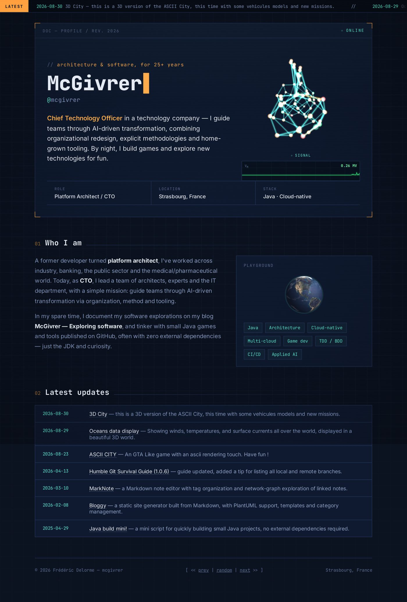
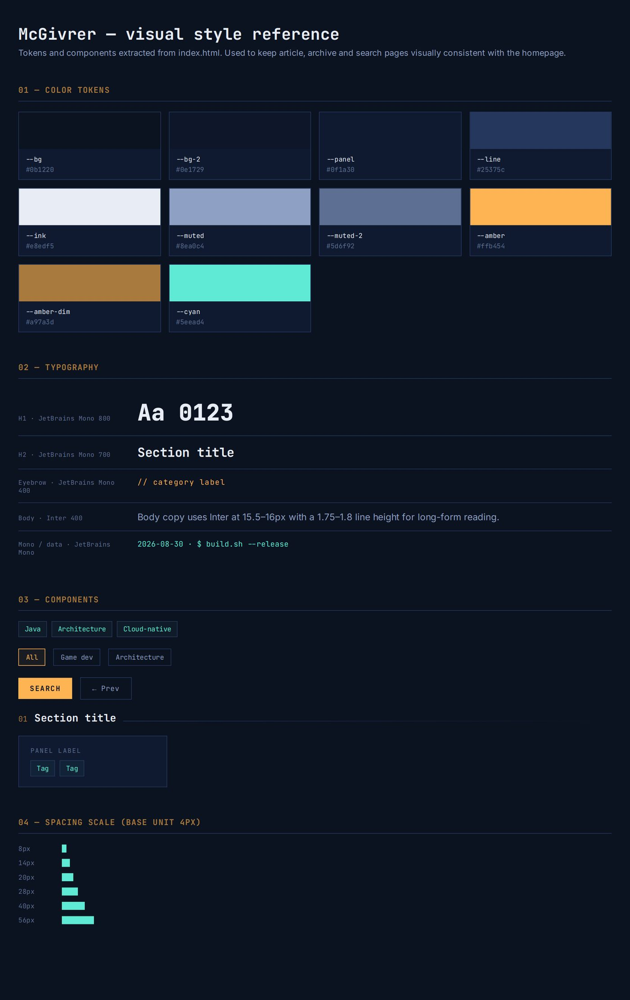
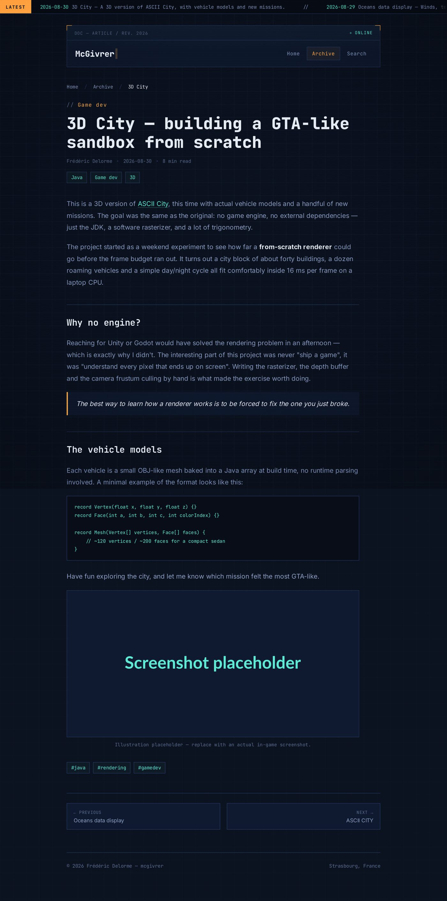
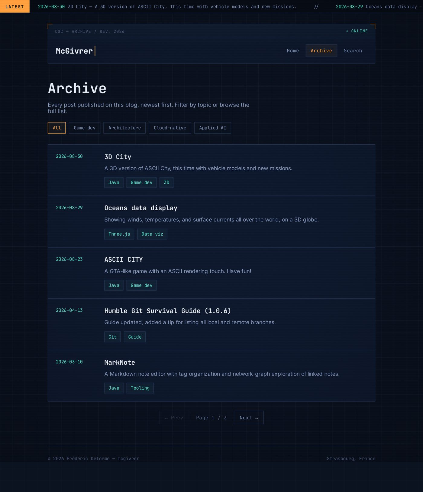
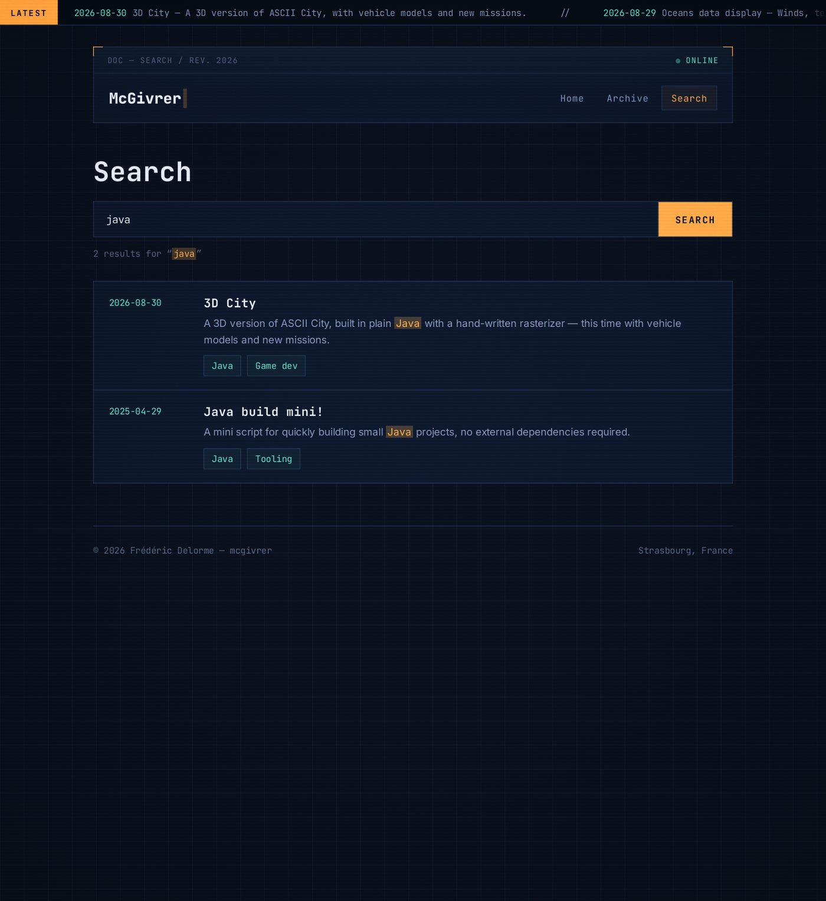

# Charte graphique — blog McGivrer

**Version 1.0 — 2026-08-31**
**Périmètre : `index.html` et les futures pages de contenu du blog (articles, archive, recherche)**

## 1. Objectif de ce document

`index.html` a été conçu comme une page unique, riche en effets (bandeau d'actualités,
overlay CRT, réseau de neurones animé, globe 3D, oscilloscope). Ce document extrait de
cette page l'identité visuelle réutilisable — couleurs, typographie, composants — et
propose trois **gabarits de page standard** (article, archive, recherche) qui la
reprennent, afin que les futures pages du blog restent visuellement cohérentes avec la
page d'accueil sans dupliquer son code à chaque fois.

Trois livrables accompagnent ce document :

- `docs/templates/article.html` — gabarit de page d'article
- `docs/templates/archive.html` — gabarit de page d'archive / liste d'articles
- `docs/templates/recherche.html` — gabarit de page de résultats de recherche
- `docs/style-guide.html` — planche de référence vivante (couleurs, typographie, composants)

Chaque gabarit est une page HTML autonome (pas de build, pas de dépendance locale),
dans la continuité du reste du projet (`index.html`, `demos/*.html`).



## 2. Principes d'identité visuelle

Le site adopte l'esthétique d'un **terminal / poste de contrôle technique** :

- fond très sombre avec une trame de grille discrète, qui rappelle un oscilloscope ou un
  schéma d'ingénierie ;
- typographie **monospace (JetBrains Mono)** pour tout ce qui est label, donnée, date,
  code ou UI ; **Inter** (sans-serif) réservée au texte de lecture longue ;
- deux couleurs d'accent avec un rôle distinct : **ambre** pour l'accent principal / les
  actions (branding, CTA, focus) et **cyan** pour les données et les liens ;
- décor discret de coins en équerre (façon écran de diagnostic) sur les blocs d'en-tête ;
- une seule signature animée par page : le bandeau d'actualités et l'overlay CRT sont
  partagés par toutes les pages, mais les animations lourdes (réseau de neurones, globe
  3D, oscilloscope) restent réservées à la page d'accueil (voir §8).

## 3. Palette de couleurs

| Jeton CSS | Valeur | Usage |
|---|---|---|
| `--bg` | `#0b1220` | Fond de page |
| `--bg-2` | `#0e1729` | Lignes de la trame de fond |
| `--panel` | `#0f1a30` | Fond des blocs (cartes, en-têtes, tableaux) |
| `--line` | `#25375c` | Bordures, séparateurs |
| `--ink` | `#e8edf5` | Texte principal, titres |
| `--muted` | `#8ea0c4` | Texte de paragraphe |
| `--muted-2` | `#5d6f92` | Texte secondaire, labels, métadonnées |
| `--amber` | `#ffb454` | Accent principal : marque, CTA, focus, état actif |
| `--amber-dim` | `#a97a3d` | Accent atténué : numéros de section, séparateurs du ticker |
| `--cyan` | `#5eead4` | Données, dates, liens, tags |



Règle de contraste : le texte de lecture (`--muted` sur `--bg`/`--panel`) reste au-dessus
de 4.5:1 ; les libellés `--muted-2` ne sont utilisés que pour du texte non essentiel
(métadonnées, décor).

## 4. Typographie

Deux polices Google Fonts, déjà chargées dans `index.html` :

```html
<link href="https://fonts.googleapis.com/css2?family=JetBrains+Mono:wght@400;500;700;800&family=Inter:wght@400;500;600;700&display=swap" rel="stylesheet">
```

| Rôle | Police | Poids | Taille |
|---|---|---|---|
| Titre H1 (hero, article) | JetBrains Mono | 800 | `clamp(26px, 4.4vw, 40px)` à `clamp(32px, 6vw, 54px)` |
| Titre de section (H2) | JetBrains Mono | 700 | 20–22px |
| Eyebrow / catégorie | JetBrains Mono | 400 | 13px, `letter-spacing:0.08em` |
| Corps de texte | Inter | 400 | 15.5–16px, interligne 1.75–1.8 |
| Libellés / données / code | JetBrains Mono | 400–700 | 10.5–13px |

Le corps de texte longue lecture (article) est plafonné à **72 caractères de large**
(`max-width:72ch`) pour rester confortable à lire.

## 5. Grille et espacement

- Conteneur de page : `max-width:960px` (accueil) ou `820–900px` (article, archive,
  recherche — un peu plus étroit car le texte de lecture y domine), centré, padding
  horizontal `24px`.
- Rupture responsive principale à `680px` (les grilles à deux colonnes repassent en une
  colonne).
- Échelle d'espacement observée : `8 · 14 · 20 · 28 · 40 · 56px`. Les marges entre
  sections utilisent `40–56px` ; le padding interne des blocs (cartes, en-têtes) utilise
  `18–20px`.
- `border-radius` volontairement nul ou quasi nul (`--radius:2px`) : le style est
  anguleux, pas arrondi.

## 6. Composants réutilisables

Ces classes existent déjà dans `index.html` et sont reprises telles quelles dans les
trois gabarits :

- **`.tag` / `.tags`** — étiquette de sujet (bordure fine, fond cyan à 4% d'opacité).
- **`.section-head` / `.section-num` / `.section-title` / `.section-rule`** — en-tête de
  section numéroté avec filet dégradé.
- **`.log-row` (accueil) → `.archive-card` (archive)** — même patron de ligne
  date/contenu, réutilisé pour la liste d'articles.
- **Bandeau `.ticker`** — bandeau défilant sticky en haut de toutes les pages.
- **Overlay `#crt`** — grain/vignettage WebGL en superposition, partagé par toutes les
  pages (poids négligeable, pas d'effet de glitch aléatoire sur les pages secondaires
  pour rester sobre).
- **`footer`** — pied de page identique sur toutes les pages.

Nouveaux composants introduits pour les gabarits secondaires (documentés en détail au
§9) :

- **`.site-header`** — en-tête compact (nom + navigation) qui remplace le grand bloc
  hero de l'accueil sur les pages de contenu.
- **`.breadcrumb`** — fil d'ariane (page article).
- **`.post-*`** — habillage d'article long (métadonnées, prose, citation, code, pager).
- **`.archive-filters` / `.filter-chip` / `.pagination`** — filtrage et pagination de
  l'archive.
- **`.search-form` / `.result-row` / `.search-empty`** — formulaire et résultats de
  recherche.

## 7. Accessibilité et mouvement

- Toutes les animations (curseur clignotant, glitch CRT, ticker, effets de survol) sont
  neutralisées sous `@media (prefers-reduced-motion: reduce)`.
- Le bandeau `.ticker` s'arrête au survol (`:hover`) et bascule en défilement
  horizontal natif (`overflow-x:auto`) sous *reduced motion*, pour rester consultable
  sans animation.
- Tous les éléments interactifs ont un état `:focus-visible` visible
  (`outline:2px solid var(--amber)`).
- Les couleurs de statut (ambre, cyan, vert/rouge du réseau de neurones) ne sont jamais
  le seul vecteur d'information : le texte reste toujours présent à côté.

## 8. Éléments réservés à la page d'accueil

Trois animations sont volontairement **spécifiques à `index.html`** et ne doivent pas
être copiées sur les pages de contenu (poids de rendu, et redondance de la « signature »
visuelle qui perd son effet si elle est répétée partout) :

- le réseau de neurones WebGL (`#neuralNet`) et l'oscilloscope associé (`#scopeCanvas`) ;
- le petit globe 3D interactif (`#mini-globe`, Three.js).

Les pages de contenu gardent en commun avec l'accueil : la trame de fond, le bandeau
d'actualités, l'overlay CRT et le pied de page — c'est ce socle commun qui assure la
cohérence de marque, pas la répétition des animations lourdes.

## 9. Règle « source unique » pour le bandeau d'actualités

Le bandeau `.ticker` ne doit **jamais** être rempli à la main avec une liste
d'actualités recopiée : sur `index.html`, il est généré en JavaScript à partir des
lignes de la section *Latest updates* (`#log .log-row`). Deux variantes de ce même
principe sont utilisées dans les gabarits :

1. **La page contient déjà la liste canonique** (ex. `archive.html`) : le ticker lit
   directement le DOM de cette liste (`.log-row` / `.archive-card`), exactement comme
   sur l'accueil.
2. **La page n'a pas de liste sur place** (ex. `article.html`, `recherche.html`) : un
   îlot de données `<script type="application/json" id="site-latest">` porte la liste,
   et le ticker la lit au chargement.

Dans un générateur de site statique (Bloggy ou équivalent), cet îlot JSON devrait être
injecté automatiquement à la construction à partir de la même source que la page
d'archive — jamais recopié article par article.

## 10. Gabarit — Page d'article

Fichier : `docs/templates/article.html`



Structure de la page, de haut en bas :

1. **Bandeau d'actualités** (`.ticker`) — identique à l'accueil.
2. **En-tête de site compact** (`.site-header`) — nom du site + navigation
   (Accueil / Archive / Recherche), remplace le grand hero de l'accueil.
3. **Fil d'ariane** (`.breadcrumb`) — Accueil / Archive / Titre de l'article.
4. **En-tête d'article** (`.post-head`) — catégorie (`eyebrow`), titre H1, métadonnées
   (auteur, date, temps de lecture), tags.
5. **Corps de l'article** (`.post-body`) — prose limitée à 72ch : paragraphes, `h2`/`h3`,
   citation (`blockquote`), bloc de code (`pre`/`code`), figure avec légende.
6. **Tags de fin d'article** (`.post-tags`).
7. **Navigation article précédent / suivant** (`.post-pager`).
8. **Pied de page** commun.

## 11. Gabarit — Page d'archive

Fichier : `docs/templates/archive.html`



Structure de la page :

1. **Bandeau d'actualités** — généré à partir de la liste ci-dessous (voir §9).
2. **En-tête de site compact**, onglet *Archive* actif.
3. **En-tête de section** (`.archive-head`) — titre, description, filtres par tag
   (`.filter-chip`, bascule d'état actif géré en JS).
4. **Liste d'articles** (`.archive-list` > `.archive-card`) — même patron que la section
   *Latest updates* de l'accueil (date en colonne fixe à gauche, titre/extrait/tags à
   droite), répété pour tous les articles.
5. **Pagination** (`.pagination`).
6. **Pied de page** commun.

## 12. Gabarit — Page de recherche

Fichier : `docs/templates/recherche.html`



Structure de la page :

1. **Bandeau d'actualités** — alimenté par l'îlot JSON `#site-latest`.
2. **En-tête de site compact**, onglet *Search* actif.
3. **En-tête de recherche** (`.search-head`) — champ de recherche + bouton, compteur de
   résultats avec le terme recherché surligné (`<mark>`).
4. **Liste de résultats** (`.search-results` > `.result-row`) — même grille
   date/contenu que l'archive, avec les occurrences du terme recherché surlignées dans
   l'extrait.
5. **État vide** (`.search-empty`, masqué par défaut) — message + lien vers l'archive
   complète, à afficher quand une recherche ne retourne aucun résultat.
6. **Pied de page** commun.

## 13. Page de référence — Style guide

Fichier : `docs/style-guide.html`

Planche vivante (couleurs, typographie, composants, échelle d'espacement) servant de
mémo visuel rapide — à ouvrir directement dans un navigateur pour vérifier qu'une
nouvelle page respecte bien les jetons définis dans ce document.

## 14. Arborescence des livrables

```text
docs/
├── charte-graphique.md      (ce document)
├── charte-graphique.docx
├── charte-graphique.pdf
├── style-guide.html          (planche de référence vivante)
├── assets/
│   ├── home.jpg               (capture de index.html)
│   ├── article.jpg             (capture du gabarit article)
│   ├── archive.jpg              (capture du gabarit archive)
│   ├── recherche.jpg            (capture du gabarit recherche)
│   └── style-guide.jpg          (capture de la planche de référence)
└── templates/
    ├── article.html
    ├── archive.html
    └── recherche.html
```

## 15. Recommandations pour la suite

- Brancher les trois gabarits sur un générateur de contenu réel (le projet **Bloggy**,
  déjà utilisé pour d'autres blogs de l'auteur, ou un script équivalent) plutôt que de
  dupliquer le HTML à la main pour chaque article.
- Faire de l'îlot `#site-latest` et de la liste d'archive une seule source de données
  (front-matter des articles), générée une fois à la construction du site.
- Ajouter une page 404 reprenant le même `.site-header` / pied de page, pour fermer la
  boucle de navigation.
- Le champ de recherche des gabarits est statique (démonstrateur) : à brancher soit sur
  un index côté client (ex. Lunr.js), soit sur un service de recherche externe, selon le
  volume d'articles à terme.
