# Étude — Construction générative des vaisseaux cargo

Document de travail séparé de la spécification principale (`spec-space_travel_and_transport-2.12.md`) : ce chantier redéfinit en profondeur la manière dont le vaisseau du joueur est construit et affiché, et mérite d'être arbitré à part avant toute intégration. Rien ici n'est implémenté — chaque section pose des options concrètes, avec leurs compromis, en attendant les choix de Frédéric.

**Statut : proposition, non implémentée.**

---

## Sommaire

- [1. Constat et objectif](#1-constat-et-objectif)
- [2. Deux archétypes de coque](#2-deux-archétypes-de-coque)
- [3. Conteneurs — types, gabarit, code couleur](#3-conteneurs--types-gabarit-code-couleur)
- [4. Dimensionnement génératif](#4-dimensionnement-génératif)
- [5. Répartition des conteneurs sur le vaisseau](#5-répartition-des-conteneurs-sur-le-vaisseau)
- [6. Passagers et modules d'habitation](#6-passagers-et-modules-dhabitation)
- [7. Propulsion et défense évolutives](#7-propulsion-et-défense-évolutives)
- [8. Feux de position](#8-feux-de-position)
- [9. Rétropropulseurs et RCS](#9-rétropropulseurs-et-rcs)
- [10. Nommage et immatriculation](#10-nommage-et-immatriculation)
- [11. Maquettes proposées](#11-maquettes-proposées)
- [12. Impact sur l'implémentation actuelle](#12-impact-sur-limplémentation-actuelle)
- [13. Synthèse et recommandation](#13-synthèse-et-recommandation)

---

## 1. Constat et objectif

Le vaisseau actuel (`buildShip()`, §4 de la spec principale) est **unique et fixe** : une silhouette à deux blocs (nacelle cargo à claire-voie + bloc propulsif arrière) dessinée une fois pour toutes au chargement, quel que soit le contrat en cours. C'est cohérent avec un jeu à un seul cargo persistant, mais ça ne raconte rien du chargement transporté — un contrat de 4 conteneurs de glace et un contrat de 200 conteneurs de minerai produisent exactement le même vaisseau à l'écran.

L'objectif de cette étude : rendre la silhouette du vaisseau **elle-même une conséquence du contrat** — nombre de conteneurs, nature de la cargaison, nombre de passagers — plutôt qu'un décor fixe. Le vaisseau devient un indicateur visuel de ce qu'il transporte, lisible de loin, avant même d'ouvrir un panneau.

Ce que cette étude couvre : les deux familles de coque possibles, le gabarit des conteneurs, la logique de génération (taille, forme, répartition), l'évolution de la propulsion et de la défense avec la taille, les feux de position, les rétropropulseurs/RCS, et le nommage. Ce qu'elle ne couvre pas : le code d'implémentation lui-même, laissé à une phase ultérieure une fois les choix arbitrés.

---

## 2. Deux archétypes de coque

### 2.1 Cargo-entrepôt (empilement)

Le principe du vaisseau actuel, généralisé : une coque-caisson qui **grandit dans les trois dimensions** avec le nombre de conteneurs, ceux-ci empilés en grille à l'intérieur d'une ossature ajourée. Compact, silhouette ramassée, lecture immédiate de la cargaison par la mosaïque de couleurs visible à travers l'ossature.

**Structure en croisillons (revu).** L'ossature reprend, sur ses quatre flancs, le treillis en X déjà présent sur le vaisseau actuel du jeu — un motif classique de coque-cargo (cf. les références fournies : casiers à conteneurs suspendus dans une charpente ajourée, cadres en croix à l'avant/l'arrière d'un cargo). Techniquement, un « Warren truss » : deux diagonales par tronçon de longueur, reliant les longerons d'angle déjà en place, plutôt qu'un simple contour de câble. Peu coûteux (quelques cylindres fins de plus) et lit immédiatement comme une vraie structure porteuse plutôt qu'un cadre décoratif.

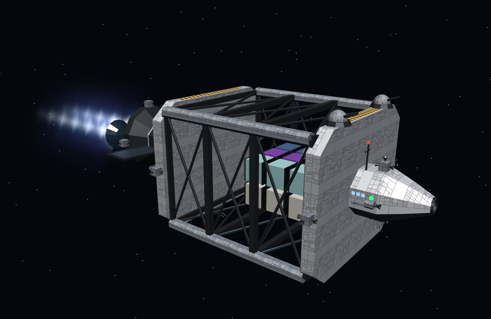

*18 conteneurs. Grille 3×3×2, ossature en croisillons, passerelle avant, bloc propulseur arrière.*

À grande échelle, la même logique produit un vraquier massif :

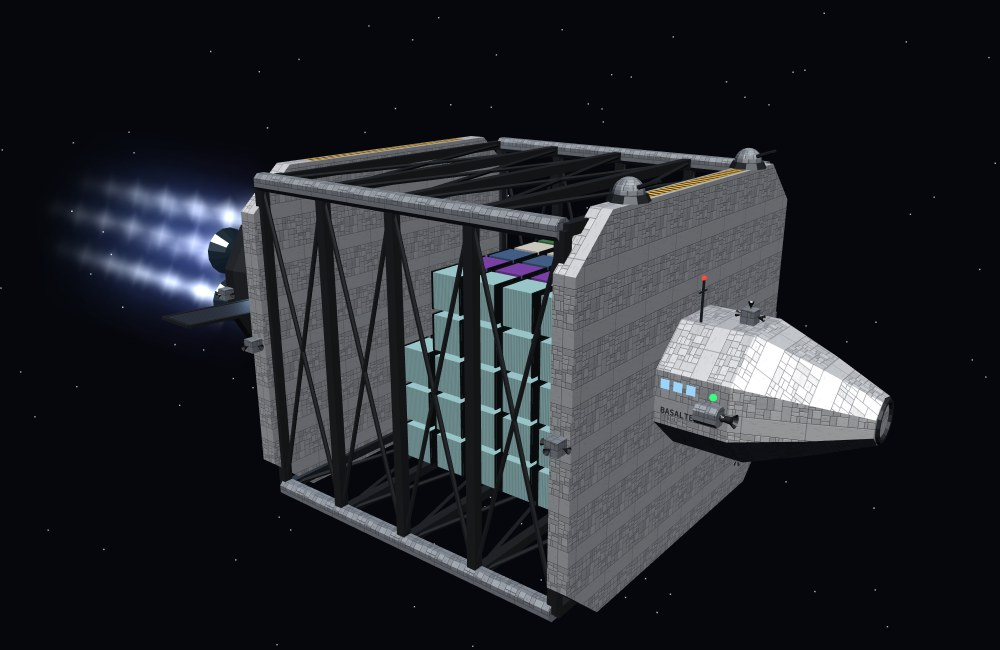

*140 conteneurs. La silhouette reste compacte — elle épaissit dans les trois axes plutôt que de s'allonger démesurément ; le treillis ajoute simplement plus de tronçons en X sur sa longueur.*

**Avantages** : silhouette ramassée donc lisible à toute distance de caméra ; se prête bien à un blindage/une défense concentrée (moins de surface exposée par conteneur transporté) ; proche de l'existant, migration plus simple. **Inconvénients** : au-delà d'un certain volume, la grille 3D devient difficile à bien cadrer en caméra rapprochée (§4 de la spec principale, mode plan-séquence) ; moins spectaculaire visuellement qu'une silhouette allongée.

### 2.2 Cargo-poutre (suspension)

Une poutre centrale (treillis) sur laquelle les conteneurs sont **accrochés par une extrémité**, répartis sur sa longueur, précédée d'un **module de proue** (pointe, rétropropulseurs, RCS, feux vert/rouge) et prolongée à l'**arrière** par un **pousseur** — quartier d'habitation et cabine passagers, puis nacelle et propulsion — qui pousse le faisceau de conteneurs devant lui. La coque **s'allonge** avec le nombre de conteneurs plutôt que d'épaissir.

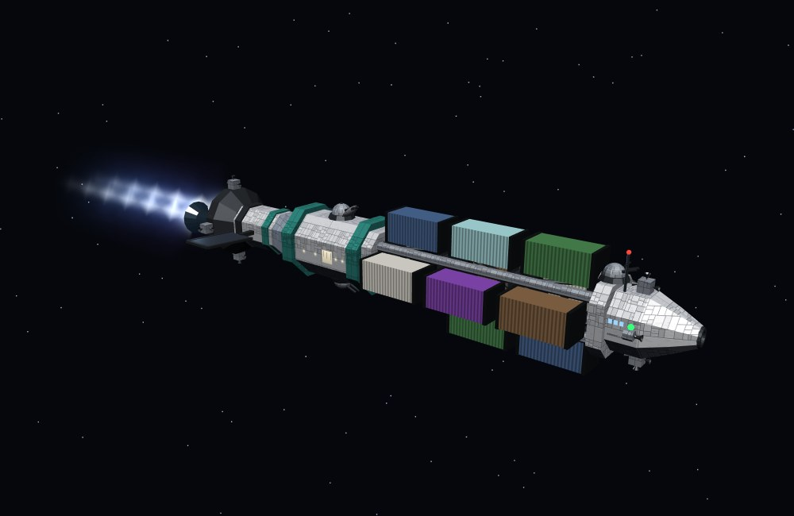

*10 conteneurs répartis en 4 points radiaux autour de la poutre. Module de proue à l'avant (pointe, rétropropulseurs, feux), pousseur à l'arrière (habitat éclairé, nacelle, tuyères) dont le jet part à l'opposé de la cargaison.*

À grande échelle, la poutre s'étire :

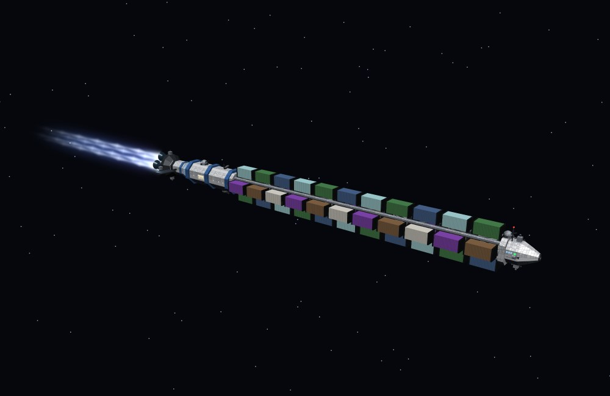

*44 conteneurs. Le pousseur ne change presque pas de taille — c'est la poutre qui s'allonge, jusqu'à donner une silhouette très étirée, caractéristique du genre (cf. les trains de fret orbitaux de la SF).*

**Avantages** : silhouette spectaculaire et immédiatement reconnaissable ; chaque conteneur reste visible individuellement (lecture directe du contenu, sans avoir à percer une coque) ; le pousseur (habitat, passerelle) reste un module de taille quasi constante, facile à détailler une fois pour toutes.
**Inconvénients** : très allongé à grande échelle — pose question pour le cadrage caméra (une poursuite standard verrait le pousseur sortir du champ pendant qu'on regarde l'arrière) et pour la géométrie de mise en orbite/amarrage (§7 de la spec) ; plus fragile en apparence (moins pertinent si des combats/tourelles doivent être crédibles, §7 ci-dessous).

### 2.3 Paquebot (transport de passagers pur)

Un contrat sans le moindre conteneur — uniquement des passagers (§6) — ne se prête bien à aucun des deux archétypes ci-dessus : une coque-entrepôt vide de conteneurs n'a pas de sens, et une poutre sans rien à y accrocher non plus. Troisième silhouette, réservée à ce cas : le **pousseur seul, agrandi**, dont le quartier d'habitation devient la masse principale du vaisseau plutôt qu'un module secondaire — pas de poutre, pas de grille de fret, juste une succession de ponts de cabines entre la nacelle avant et un capuchon/observatoire arrière.

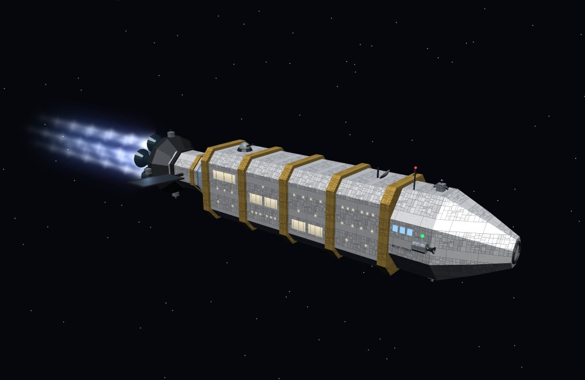

*20 cabines réparties sur 3 ponts. Même vocabulaire que le pousseur (nacelle, RCS, feux de position) mais l'habitat devient la coque elle-même plutôt qu'un module greffé dessus.*

Ce troisième archétype partage son moteur de génération avec le pousseur du cargo-poutre (§6.2) — mêmes règles de cabines et de ponts, simplement dimensionné pour être la coque entière plutôt qu'un module. Pas d'équivalent côté cargo-entrepôt : un contrat mixte (passagers + conteneurs) reste couvert par les deux archétypes existants, chacun avec son module d'habitation (§6.1).

### 2.4 Quand choisir lequel ?

| Critère | Cargo-entrepôt | Cargo-poutre | Paquebot (§2.3) |
|---|---|---|---|
| Nombreux petits conteneurs homogènes (minerai, denrées, glace en vrac) | ✅ naturel (vrac empilable) | possible mais peu naturel | non applicable (pas de conteneurs) |
| Peu de conteneurs mais volumineux/spécialisés (matériel médical, technologies) | possible | ✅ naturel (chaque colis reste identifiable) | non applicable |
| Beaucoup de passagers, pas de fret | possible mais peu naturel | non applicable (pas de fret à suspendre) | ✅ naturel — c'est son seul rôle |
| Passagers en complément d'un chargement | ✅ module habitat greffé sur la coque (§6.1) | ✅ pousseur agrandi (§6.2, n'est plus de taille fixe — revu depuis la version précédente de cette étude) | non applicable |
| Lisibilité en combat / tourelles | ✅ coque compacte à défendre | plus difficile (poutre étirée, cible facile) | faible (coque non blindée, pas prévue pour ça) |
| Spectacle visuel / silhouette mémorable | correct | ✅ fort | ✅ fort (registre différent : élégance plutôt qu'imposant) |

**Option A — un seul archétype pour tout le jeu.** Choisir l'un des deux (entrepôt ou poutre) une fois pour toutes pour les contrats avec fret, en fonction de l'identité visuelle voulue pour le jeu — le paquebot (§2.3) reste de toute façon à part, seul candidat possible pour un contrat sans conteneurs. Le plus simple à implémenter et à équilibrer (une seule famille de règles de génération pour le fret, plus le paquebot).

**Option B — l'archétype dépend du contrat (recommandé).** Une règle simple détermine l'archétype à la génération du contrat : paquebot si aucun conteneur (passagers seuls) ; sinon cargo-poutre si le nombre de conteneurs est faible (< 15) **ou** si le type de cargaison dominant est « spécialisé » (médical, technologies) ; cargo-entrepôt sinon. Le joueur verrait alors trois familles de silhouettes au fil de la partie plutôt qu'une seule, ce qui sert directement l'objectif de la section 1 (le vaisseau raconte le contrat) — au prix d'une génération et d'un équilibrage propulsion/défense à dupliquer pour chaque famille (§7).

**Option C — les deux archétypes de fret existent, choix du joueur.** Un embranchement de gameplay (achat du prochain vaisseau, ou choix en début de contrat) où le joueur choisit lui-même l'archétype selon sa préférence (rapidité de cadrage vs. spectacle), le paquebot restant automatique dès lors qu'un contrat n'a pas de fret. Séduisant mais alourdit sensiblement la boucle de jeu pour un gain qui reste cosmétique — à réserver à une version ultérieure si le jeu évolue vers une gestion de flotte.

---

## 3. Conteneurs — types, gabarit, code couleur

Six natures de cargaison, chacune avec une teinte dominante pour rester identifiable d'un coup d'œil dans la grille ou le long de la poutre :

| Type | Teinte proposée | Association |
|---|---|---|
| Minerais | brun-rouille | benne/vrac minier |
| Denrées | vert | conteneur réfrigéré/agricole |
| Matériel médical | blanc cassé, liseré rouge | croix/urgence |
| Matériel de transport | bleu | conteneur ISO générique |
| Technologies | violet | haute valeur, signalétique distincte |
| Glace | cyan pâle | cryogénie/eau |

**Un septième type, à part : les passagers.** Un contrat peut porter uniquement sur du transport de passagers, sans le moindre conteneur (demande explicite) — le nombre de passagers *P* n'est alors plus un simple complément au fret (§6) mais LE contenu du contrat, qui détermine à lui seul l'archétype (paquebot, §2.3) et la taille du vaisseau. Ce septième type n'a pas de teinte de conteneur puisqu'il n'y a pas de conteneur : sa signature visuelle, ce sont les hublots/baies éclairés du paquebot (§6).

**Gabarit standard.** Comme le fret maritime actuel (conteneurs ISO, unités EVP), une seule taille de conteneur unitaire simplifie radicalement la génération — le nombre de conteneurs devient directement un nombre d'unités à placer, sans avoir à gérer un mélange de formats dans la même grille.

- **Option A — taille unique (recommandé pour la V1).** Un seul gabarit de conteneur pour tous les types. La différence entre cargaisons est purement chromatique/textuelle, jamais dimensionnelle. Le plus simple à générer (grille régulière, poutre à espacement constant) et à équilibrer.
- **Option B — deux gabarits (standard / long).** Les technologies et le matériel médical utilisent un conteneur « long » (× 2 en profondeur) pour suggérer un contenu plus complexe/fragile. Ajoute un peu de variété visuelle, complexifie légèrement la grille (cases doubles à prévoir) et l'espacement sur la poutre (deux pas possibles).
- **Option C — gabarit variable par cargaison.** Chaque type a sa propre empreinte (le minerai en vrac dans une benne large et basse, la technologie dans un caisson cubique compact, la glace dans une citerne cylindrique). Le plus riche visuellement, mais transforme la génération en un problème de *bin packing* hétérogène — nettement plus de travail d'implémentation pour un gain surtout esthétique. À envisager seulement si l'archétype cargo-poutre devient central (où la variété de silhouettes de conteneurs se voit particulièrement bien, chaque colis étant exposé).

---

## 4. Dimensionnement génératif

Le contrat fournit trois entrées : nombre de conteneurs *N*, répartition par type de cargaison, nombre de passagers *P*. Il en ressort : l'archétype (§2.4), un **palier de taille**, et les dimensions qui en découlent.

**Cas du paquebot (§2.3)** : *N* = 0 par définition (aucun conteneur) — le palier s'y détermine directement sur *P* (via le nombre de cabines qui en résulte, §6.1) plutôt que sur *N*. Les mêmes cinq paliers du tableau ci-dessous s'appliquent, simplement lus sur la colonne *P* plutôt que *N*.

**Paliers proposés** (bornes à ajuster en playtest, l'idée est la marche en escalier plutôt qu'une échelle continue) :

| Palier | Conteneurs *N* | Passagers *P* | Nom indicatif |
|---|---|---|---|
| I | 1–8 | 0–2 | Navette légère |
| II | 9–24 | 0–6 | Cargo standard *(le vaisseau actuel se situe ici)* |
| III | 25–60 | 0–12 | Cargo lourd |
| IV | 61–150 | 0–24 | Vraquier |
| V | 150+ | 24+ | Convoi/long-courrier |

**Option A — paliers discrets (recommandé).** Chaque palier a un jeu de règles fixe (nombre de moteurs, présence ou non du saut quantique, nombre de tourelles — cf. §7). Facile à équilibrer et à tester (5 configurations à valider, pas un continuum infini), et le joueur perçoit clairement les seuils (« mon vaisseau vient de changer de catégorie ») plutôt qu'une dérive continue imperceptible.

**Option B — échelle continue.** Chaque dimension (moteurs, blindage, taille de grille) est une fonction continue de *N* et *P*. Plus lisse visuellement d'un contrat à l'autre, mais bien plus difficile à équilibrer (une infinité de configurations à couvrir) et à tester ; risque de configurations dégénérées (un vaisseau à 61 conteneurs presque identique à un à 24, sans palier perceptible) si les fonctions ne sont pas soigneusement choisies.

La **cargaison dominante** (le type représentant la plus grosse part de *N*) influence en plus la teinte d'ensemble de la coque (liséré/accent), sans changer la structure — un clin d'œil supplémentaire, à moindre coût, à ce que transporte le vaisseau.

---

## 5. Répartition des conteneurs sur le vaisseau

### 5.1 Cargo-entrepôt — grille 3D

Logique retenue pour les maquettes de la section 11 : dimensionner la grille au plus proche du cube plutôt que de privilégier un seul axe (une file unique très longue serait peu lisible et peu crédible structurellement). Nombre de colonnes/rangées dérivé de la racine cubique de *N*, le nombre de « couches » en profondeur comblant le reste :

```
colonnes  = round(cbrt(N) × 1.25)
rangées   = round(cbrt(N) × 0.95)
profondeur = ceil(N / (colonnes × rangées))
```

Les proportions (1,25 / 0,95) donnent une coque légèrement plus large que haute — une silhouette de cargo plutôt qu'une tour. Les conteneurs sont ensuite placés dans cette grille et coloriés selon leur type ; si plusieurs types se partagent le chargement, l'**Option recommandée** est un remplissage par blocs contigus (tout le minerai groupé, puis toutes les denrées, etc.) plutôt qu'une alternance — plus lisible visuellement, et plus proche de la façon dont un vrai entrepôt chargerait par lots.

### 5.2 Cargo-poutre — répartition radiale

Les conteneurs s'accrochent à la poutre par groupes de 4 (haut/bas/gauche/droite), chaque groupe occupant une tranche de longueur ; le nombre de tranches nécessaires détermine la longueur totale de la poutre. Comme pour la grille, un remplissage par blocs contigus par type de cargaison est recommandé plutôt qu'une alternance — on distinguerait ainsi, en glissant le regard le long de la poutre depuis le pousseur, les lots successifs du contrat.

**Option — répartition équilibrée autour du pousseur.** Pour les contrats mixtes (plusieurs types de cargaison), répartir les blocs symétriquement par rapport au centre de la poutre plutôt que dans l'ordre d'arrivée, pour une silhouette visuellement équilibrée des deux côtés du point d'attache central — pertinent seulement si un point d'ancrage central (grappin, remorquage) est envisagé ailleurs dans le jeu ; sinon l'ordre simple suffit.

### 5.3 Cas des contrats mixtes (plusieurs types)

Dans les deux archétypes, l'ordre de remplissage par blocs pose la question de quel type charger en premier. **Proposition** : le type le plus volumineux en premier (le plus proche du pousseur/de la passerelle), les colis les plus légers/fragiles (technologies, médical) en dernier — une logique de chargement qui se défend (le lourd d'abord, pour la répartition des masses) et qui, incidemment, place les cargaisons les plus « intéressantes » visuellement (technologies en violet, médical en blanc/rouge) aux extrémités les plus exposées à la caméra.

---

## 6. Passagers et modules d'habitation

Le nombre de passagers *P* n'ajoute pas de conteneurs mais dimensionne un **module d'habitation dédié**, distinct de la passerelle de pilotage — subdivisé en cabines, chacune avec sa propre signature de hublots (demande explicite).

### 6.1 Types de cabine

Quatre types, du plus compact au plus spacieux, chacun avec son nombre de hublots ou sa baie :

| Type | Hublots | Passagers/cabine | Registre |
|---|---|---|---|
| Standard | 1 hublot rond | 2 | classe économique |
| Confort | 2 hublots ronds | 2 | classe intermédiaire |
| Suite | 3 hublots ronds | 1–2 | haut de gamme |
| Panoramique | 1 grande baie (remplace les hublots) | 1–2 | luxe |

Le nombre de cabines à générer découle simplement de *P* divisé par la capacité moyenne du mélange retenu. **Option A — un seul type par contrat (recommandé pour la V1)** : toutes les cabines d'un même contrat sont du même type, déterminé par exemple par le budget/la classe du contrat — le plus simple à générer (une seule taille de fenêtre à répéter) et le plus lisible (un vaisseau se lit d'un coup comme « un charter économique » ou « une croisière de luxe »). **Option B — mélange de types** : un contrat haut de gamme pourrait comporter majoritairement des suites avec quelques cabines standard pour l'équipage ; plus réaliste, mais demande une règle de répartition supplémentaire (par exemple : blocs contigus par type, comme pour les conteneurs mixtes, §5.3) pour rester lisible plutôt que bigarré.

### 6.2 Le pousseur, une forme qui évolue avec sa taille (revu)

Le pousseur n'est plus dimensionné une fois pour toutes (contrairement à la première version de cette étude) : sa forme évolue avec le nombre de cabines qu'il doit loger, en trois paliers.

**Petit pousseur** — peu ou pas de passagers : nacelle compacte, un seul pont, une cabine standard et une cabine panoramique (bug corrigé — la première version de cette maquette n'en proposait aucune, alors que la grande baie est justement ce qui doit se voir même à la plus petite échelle, pas seulement sur les plus gros gabarits).

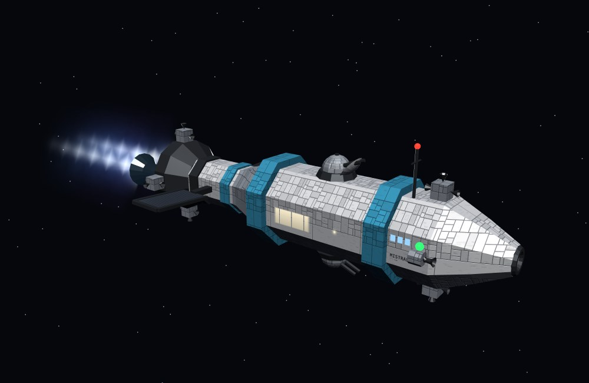

**Pousseur moyen** — charge passagère modérée : l'habitat s'allonge nettement, mélange de cabines standard/confort/panoramique visible en rangée (même correctif que ci-dessus), toujours un seul pont mais la nacelle grossit en proportion (plus de moteurs pour compenser la masse supplémentaire).

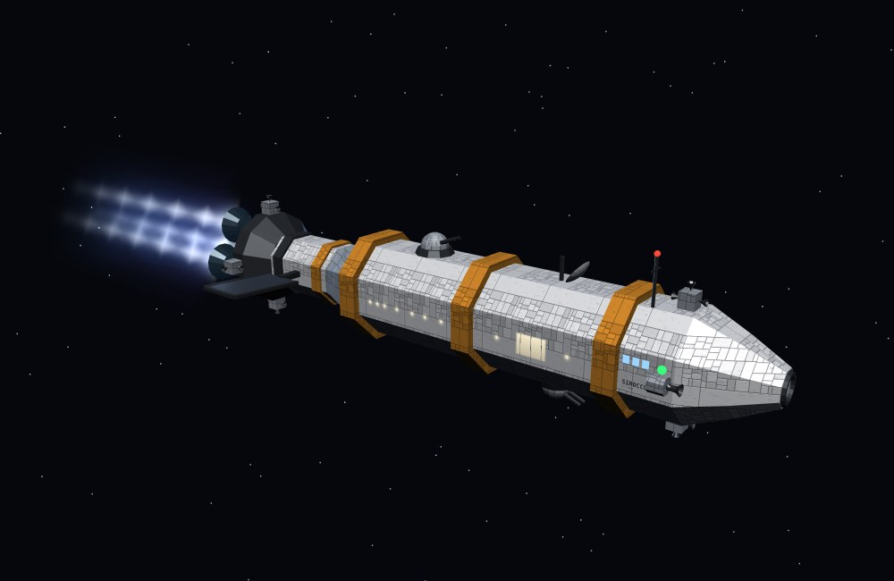

**Grand pousseur** — forte charge passagère (convoi/paquebot, paliers IV-V) : l'habitat passe sur **deux ponts empilés**, les quatre types de cabine cohabitent (y compris la baie panoramique, nettement plus large qu'un hublot plutôt qu'un simple carré agrandi), la nacelle et le nombre de tuyères grossissent encore.

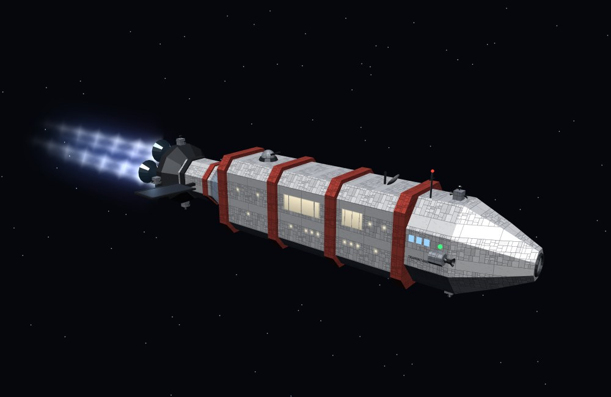

**Option — seuil de passage à deux ponts.** Basculer sur deux ponts (plutôt qu'un seul pont toujours plus long) au-delà d'un nombre de cabines donné, plutôt qu'une règle continue : un habitat qui s'étire indéfiniment en longueur finirait par paraître aussi disproportionné qu'une poutre trop chargée (§2.2) ; répartir la croissance entre longueur et hauteur de pont, par paliers, garde une silhouette de pousseur crédible à toute échelle. C'est le choix illustré ci-dessus (1 pont jusqu'à ~10 cabines, 2 ponts au-delà).

### 6.3 Rendu des hublots — un shader plutôt qu'une vraie lumière

Un hublot doit donner l'impression d'émettre de la lumière, pas seulement porter une couleur claire. Trois façons d'y arriver, par coût croissant :

- **Couleur unie** (première version de ces maquettes) : un simple disque `MeshBasicMaterial` de teinte claire. Lisible mais plat — aucune impression de lumière réellement émise, juste une forme claire parmi des formes sombres.
- **Shader radial, fondu additif (retenu, illustré ci-dessus)** : un petit `ShaderMaterial` calcule, par fragment, la distance au centre du hublot et en tire un dégradé — cœur lumineux quasi opaque, halo qui se dissipe progressivement vers la transparence — rendu en fondu additif (`AdditiveBlending`, `depthWrite:false`). Exactement le principe déjà en place dans le jeu pour les halos d'étoiles et la lueur des réacteurs (§4 de la spec principale), à ceci près que le dégradé est calculé directement dans le shader plutôt que lu dans une texture externe : aucun asset à générer ni à charger, et le rayon/la teinte du halo restent de simples uniforms, faciles à faire varier par type de cabine (une baie panoramique n'a qu'à utiliser un halo plus large que celle d'un hublot standard, cf. maquettes ci-dessus). Coût quasi nul : un plan de plus par hublot, aucun calcul d'éclairage réel.
- **Vraie `PointLight` par hublot** : illuminerait réellement la coque alentour (contrairement aux deux options précédentes, qui ne font qu'auto-briller sans rien éclairer autour). Le plus réaliste, mais chaque lumière dynamique a un coût réel de rendu — un paquebot de palier V peut compter plusieurs dizaines de cabines, donc de hublots ; multiplier les lumières dans ces proportions n'est pas raisonnable. À réserver, comme le fait déjà le jeu pour le dock de navettes (§4 de la spec principale), à un unique point lumineux ponctuel et notable plutôt qu'à une répétition systématique.

**Recommandation** : le shader radial pour tous les hublots, sans exception — c'est ce qu'illustrent les quatre maquettes du pousseur et du paquebot (§6.2, §2.3), qui utilisaient encore de simples disques de couleur dans la version précédente de cette étude.

### 6.4 Répartition par archétype

- **Cargo-poutre** : le pousseur suit directement §6.2 — c'est son rôle nominal, déjà prévu dans la description de l'archétype (§2.2).
- **Cargo-entrepôt** : un module habitat séparé, greffé sur le flanc de la coque à l'opposé de la passerelle, suit la **même logique de paliers/cabines** que le pousseur (§6.1-6.2) plutôt qu'une règle propre — cohérence visuelle entre les deux archétypes, et pas de système de génération supplémentaire à concevoir.
- **Paquebot** (§2.3) : le pousseur agrandi devient la coque elle-même — la maquette à 20 cabines/3 ponts de la section 2.3 est un quatrième palier de la même progression (6.2), simplement poussé plus loin puisqu'ici l'habitat n'a plus de fret à partager la place.

**Option — plafond de passagers par palier de taille.** Un vaisseau de palier I (navette légère, §4) ne devrait pas raisonnablement loger 24 passagers en plus de son fret : plafonner *P* par palier évite une silhouette incohérente et donne un levier de gameplay supplémentaire (certains contrats à fort *P* forcent un palier de vaisseau plus grand, même à *N* modeste). Ce plafond ne s'applique évidemment pas au paquebot, dont tout le volume est dédié aux passagers.

---

## 7. Propulsion et défense évolutives

Principe : les moteurs, la présence du module de saut quantique, et l'armement suivent le **palier de taille** (§4), pas un calcul continu — cohérent avec l'option recommandée plus haut, et avec ce qui existe déjà pour le carburant/saut quantique (§22-23 de la spec principale).

| Palier | Moteurs principaux | Saut quantique | Défense |
|---|---|---|---|
| I — Navette légère | 2 | non | aucune |
| II — Cargo standard | 4 *(comme l'existant)* | optionnel (achat, §23) | aucune |
| III — Cargo lourd | 4, plus puissants | optionnel | 1–2 tourelles point-défense |
| IV — Vraquier | 6 | optionnel | 2–4 tourelles, 1 lance-missiles |
| V — Convoi | 8+, répartis sur plusieurs points d'ancrage | inclus d'office | tourelles + missiles + 1 point laser longue portée |

**Sur les tourelles/armement** — trois options quant à leur usage réel en jeu, indépendantes du dimensionnement visuel ci-dessus :

- **Option A — purement décoratif.** Les tourelles/lance-missiles existent visuellement (silhouette plus crédible, plus imposante) mais n'ont aucune fonction de gameplay. Le plus simple, cohérent avec un jeu aujourd'hui centré sur le transport et non le combat.
- **Option B — défense passive automatique.** En cas d'événement hostile (à concevoir, cf. §13 « événements aléatoires, proposition » de la spec principale), les tourelles se déclenchent seules selon leur nombre/palier, influençant l'issue sans intervention du joueur — ajoute un enjeu au fait de transporter un gros chargement (plus exposé, mais mieux défendu) sans complexifier les commandes.
- **Option C — combat jouable.** Le joueur commande l'armement activement. Cohérent avec la présence de vraies tourelles/missiles, mais un changement de genre pour le jeu (simulation de transport → simulation de transport-et-combat) qui dépasse largement le cadre de cette étude.

**Recommandation** : Option A pour une première itération (aucun risque, pur habillage visuel cohérent avec la taille), avec l'Option B comme évolution naturelle si des événements hostiles sont un jour développés.

---

## 8. Feux de position

Convention reprise de l'aéronautique/maritime, adaptée : elle permet d'identifier de loin le sens de déplacement d'un vaisseau croisé, sans avoir à distinguer sa silhouette précise.

- **Vert** : tribord (côté droit, +X)
- **Rouge** : bâbord (côté gauche, −X)
- **Blanc** : feu de queue (arrière)
- **Blanc clignotant** *(optionnel, anticollision)* : point culminant de la coque

Sur le cargo-entrepôt, les trois feux fixes se placent aux angles avant de la coque (vert/rouge) et à l'arrière (blanc) — déjà illustré sur les maquettes §11. Sur le cargo-poutre, vert et rouge se placent sur les flancs du module de proue — à l'avant, donc, là où ils indiquent le sens de marche — et le blanc sur le dessus de la nacelle du pousseur, à l'arrière, hors de l'axe du jet pour rester visible moteur allumé.

**Option — feux de gabarit intermédiaires sur la poutre.** Pour les plus longues poutres (palier IV-V), ajouter de petits feux blancs discrets à intervalles réguliers le long de la poutre (comme le balisage d'une grue de chantier) — purement cosmétique, mais évite une poutre « invisible » sur sa plus grande partie une fois les feux d'extrémité hors champ.

---

## 9. Rétropropulseurs et RCS

- **Rétropropulseurs** : deux tuyères orientées vers l'avant, de part et d'autre de la coque (entrepôt) ou de la nacelle (poutre) — déjà positionnées sur les maquettes §11. Leur nombre n'évolue pas avec la taille dans cette proposition : freiner un gros vaisseau plus fort qu'un petit se traduit mieux par une poussée par tuyère plus élevée (cohérent avec le principe des paliers) que par une multiplication de petites tuyères, plus difficile à lire visuellement.
- **RCS** : quatre grappes aux angles de la coque (entrepôt) assurent le contrôle d'attitude (tangage/lacet/roulis). Sur la poutre, le défi est différent : une structure aussi longue nécessite un contrôle d'attitude réparti, pas seulement concentré sur le pousseur — d'où un point RCS supplémentaire à mi-poutre dès le palier III, déjà présent sur la maquette §11 (petit cône visible au-dessus du point médian).

**Option — RCS proportionnels au palier.** Ajouter un point RCS médian supplémentaire par tranche de longueur (plutôt qu'un seul, fixe, à partir du palier III) sur les poutres les plus longues (palier V) — cohérent avec le principe physique (plus c'est long, plus le contrôle d'attitude réparti est nécessaire), au prix d'une règle de génération un peu plus fine à écrire.

---

## 10. Nommage et immatriculation

Déjà en place pour le vaisseau actuel (`SHIP_REGISTRY`, dérivé du seed) : peinte sur le flanc du bloc arrière. Pour les deux archétypes génératifs :

- **Cargo-entrepôt** : immatriculation sur le flanc du bloc propulseur arrière (inchangé) — c'est la plus grande surface plane visible depuis la plupart des angles de caméra.
- **Cargo-poutre** : sur le corps du module habitat du pousseur (§2.2) — la nacelle, cylindrique, s'y prête moins bien (surface courbe) que le bloc habitat, rectangulaire.

Aucune option ici : le principe déjà validé sur le vaisseau actuel (nom dérivé du seed, peint sur la plus grande surface plane disponible) se transpose directement aux deux archétypes sans ambiguïté.

---

## 11. Maquettes proposées

*Toutes les images de ce document montrent la troisième génération des maquettes, décrite au §11.4, et sont extraites de la page de présentation interactive (`maquettes-vaisseaux.html`).*

Les quatre images ci-dessous illustrent les deux archétypes de fret à deux échelles chacun, générées à partir d'un script paramétrique de démonstration (cargaison, dimensions et répartition calculées selon les règles des sections 4 et 5 — pas le rendu final du jeu, dont les textures de coque, l'éclairage dynamique et les détails resteraient à reprendre du vaisseau actuel, §4 de la spec principale). Les maquettes du pousseur évolutif et du paquebot, à part puisqu'elles illustrent un point précis plutôt qu'une vue d'ensemble, sont intégrées directement aux sections 2.3 et 6.2.

| | Petite échelle | Grande échelle |
|---|---|---|
| **Cargo-entrepôt** |  *(18 conteneurs, palier II)* |  *(140 conteneurs, palier IV)* |
| **Cargo-poutre** |  *(10 conteneurs, palier II)* |  *(44 conteneurs, palier III)* |

Points communs visibles sur les quatre : conteneurs colorés par type de cargaison (§3), feux de position vert/rouge/blanc (§8), rétropropulseurs avant et RCS (§9), passerelle/habitat avec hublots éclairés (§6), tuyères principales à l'arrière dont le nombre suit le palier (§7).

### 11.1 Formes modernisées (revu)

Les toutes premières maquettes de cette étude utilisaient des primitives brutes (pavés, cylindres, cônes) — lisibles mais peu futuristes. Remplacées par des formes plus travaillées, à coût de génération comparable :

- **Coques et nacelles effilées** (`LatheGeometry`, un profil rayon/longueur tourné en facettes) plutôt qu'un simple cylindre — nez, nacelle du pousseur, capuchon arrière du paquebot.
- **Panneaux chanfreinés** (`ExtrudeGeometry` avec biseau réel) pour l'habitat et les longerons d'angle de la coque-entrepôt, plutôt que des pavés à arêtes vives.
- **Tuyères en cloche** (`LatheGeometry`, col étroit puis évasement) à la place de simples cylindres pour les moteurs et rétropropulseurs — silhouette immédiatement reconnaissable comme un moteur-fusée.
- **Poutre hexagonale** plutôt qu'un tube rond, pour une structure qui a l'air d'un treillis conçu plutôt que d'un simple tuyau.
- **Structure en croisillons** sur les quatre flancs du cargo-entrepôt (§2.1), d'après des références fournies — un treillis en X (« Warren truss ») entre les longerons d'angle, plutôt qu'un simple contour de câble.
- **Greebles** (petits blocs de détail dispersés en surface) sur les nacelles et logements moteur, pour une impression de technicité sans géométrie coûteuse.

**Deux bugs trouvés en modernisant, tous deux sur le panneau chanfreiné** :
- Une rotation superflue dans la fonction de génération permutait largeur et longueur du panneau — l'habitat du pousseur se retrouvait construit selon de mauvaises proportions à chaque appel.
- Une fois corrigé, une large bande blanche est apparue sur le flanc du pousseur, à l'endroit même des hublots. Plusieurs pistes côté shader (position, largeur du halo, mode de fondu) écartées une à une sans effet — jusqu'à un test décisif : masquer complètement les hublots, sans que la bande blanche disparaisse pour autant. La cause était ailleurs : le biseau de l'extrusion élargit réellement la géométrie au-delà de sa largeur nominale (mesuré : +0,94 unité de chaque côté, sur un panneau de 12,6 de large) — les hublots, placés juste à l'extérieur de la largeur nominale, se retrouvaient purement et simplement engloutis dans la coque. Corrigé en dégageant une marge qui tient compte de ce débordement. Un reflet spéculaire du même ordre (matériaux un peu trop lisses sur les arêtes chanfreinées) a été corrigé au passage sur l'ensemble des coques.

**Troisième bug, remonté en jeu — feux de position flottants.** Les trois feux (vert/rouge/blanc) de chaque maquette étaient posés à des coordonnées calculées dans l'absolu (par exemple : « à mi-hauteur de la coque, juste à côté de la passerelle ») plutôt que sur un point réel de la géométrie voisine — sur le cargo-entrepôt en particulier, vert et rouge se retrouvaient à flotter dans le vide entre l'ossature et la passerelle, sans rien pour les porter. Corrigé en ancrant chaque feu sur un point de surface calculé, jamais deviné : rayon réel du profil de la passerelle (interpolé dans son profil de Lathe) pour le vert/rouge du cargo-entrepôt, flanc réel de l'habitat pour le pousseur et le cargo-poutre, pointe exacte du capuchon arrière pour le blanc du paquebot et du cargo-poutre (qui flottait, lui aussi, à mi-chemin dans le capuchon plutôt qu'à son extrémité).

**Quatrième bug, remonté en jeu — propulseurs principaux mal rattachés, RCS flottants.** Deux défauts distincts, du même ordre que les précédents :
- Sur le pousseur (et donc le cargo-poutre et le paquebot, qui en réutilisent la construction), les tuyères principales étaient posées à une distance devinée de l'habitat plutôt qu'à l'extrémité réelle de la nacelle — mesuré : la nacelle commençait à Z=+10,5 et se terminait à Z=+31,5, les tuyères étaient posées à Z=+3, soit *avant même le début de la nacelle*, dans le vide entre elle et l'habitat. Corrigé en calculant la position à partir du dernier point du profil de la nacelle (son bout réel), plutôt qu'une distance choisie au jugé — vérifié numériquement après correction (tuyères posées exactement à Z=+31,5, confondues avec la pointe de la nacelle).
- Sur le cargo-entrepôt, les propulseurs RCS étaient positionnés à un rayon plus petit que celui des longerons d'angle et de leur treillis en croisillons (§2.1) — ils flottaient donc à l'intérieur du cadre plutôt que d'y être fixés. Corrigés en les posant exactement sur les longerons.

Vérification du sens des tuyères à cette occasion : la géométrie d'une tuyère (`makeEngineBell`) a son col étroit au « Z local = 0 » (côté à coller contre une structure) et son évasement vers « Z local = +longueur » (sortie des gaz) — montée sans rotation supplémentaire, une tuyère orientée vers l'arrière (+Z monde) est donc correcte pour un propulseur principal (pousse le vaisseau vers l'avant), et une rotation de 180° est nécessaire pour un rétropropulseur à l'avant (sortie des gaz vers l'avant, +Z local devenant -Z monde — freiner veut dire éjecter les gaz dans le sens de la marche). Les deux cas ont été vérifiés cohérents sur les quatre archétypes.

**Cinquième bug, remonté en jeu — pièces non attachées entre elles.** Signalement plus général que les précédents, qui a mis au jour deux vrais écarts et un effet de bord introduit par le correctif précédent :
- **Pousseur (donc cargo-poutre et paquebot)** : l'habitat et la nacelle étaient positionnés indépendamment l'un de l'autre, chacun avec sa propre distance devinée — l'écart mesuré entre la fin de l'habitat et le début de la nacelle allait de 12,6 unités (cargo-poutre) à 21,9 unités (petit pousseur), du vide pur. Corrigé en construisant les pièces **en chaîne** : la position de la nacelle se calcule désormais à partir de la fin réelle de l'habitat (`nacelleZ = habZ + habL/2`), plus une distance choisie au jugé — l'écart est nul par construction, plus par ajustement.
- **Effet de bord découvert en creusant** : sur le cargo-poutre, la nacelle avait une taille fixe qui ne tenait pas compte de l'espace réellement disponible entre l'habitat et le début du faisceau — une fois la chaîne appliquée, ses propres tuyères (repositionnées au tour précédent à l'extrémité réelle de la nacelle) se seraient retrouvées enterrées 9 unités à l'intérieur de la zone des conteneurs. Corrigé en calculant la longueur de la nacelle à partir de l'espace réellement disponible, plutôt qu'une taille fixe qui ne le connaît pas.
- **Cargo-entrepôt** : la passerelle avant chevauchait en réalité le premier tiers de la coque (mesuré : 16,8 unités de pénétration sur une petite configuration) — un chevauchement, pas un écart, mais tout aussi révélateur d'une position devinée plutôt que calculée. Corrigée pour que sa queue touche exactement le nez de la coque, ni écart ni chevauchement.

Un même principe retenu pour la suite : toute nouvelle pièce devra désormais se positionner à partir de la fin réelle de sa voisine, jamais d'une distance choisie au jugé.

**Sixième bug, remonté en jeu — nacelle du cargo-poutre orientée à l'envers.** La chaîne de construction (bug précédent) garantissait que les pièces se touchaient, mais pas qu'elles avaient la bonne forme : la nacelle du pousseur s'évasait vers les tuyères (large côté moteur, resserrée côté habitat) — l'inverse de la convention usuelle sur ce genre de silhouette, où c'est l'attache à la structure porteuse qui est la plus large (un collier de fixation) et la nacelle qui se resserre vers le moteur, la tuyère elle-même se rechargeant d'évaser à nouveau vers sa propre sortie. Corrigé en inversant le profil : large à l'attache sur l'habitat, resserrée à l'extrémité où sont montées les tuyères.

**Septième bug — pousseur du cargo-poutre placé du mauvais côté (le vrai sens du sixième).** Le nouveau jet du moteur (§11.3) a rendu le défaut flagrant : le pousseur était placé à l'**avant** de la poutre, tuyères tournées vers elle — le jet aurait tiré droit dans les conteneurs. C'est très probablement ce que visait le signalement précédent (« nacelle tournée du mauvais côté ») : l'inversion d'évasement faite alors n'avait traité qu'un symptôme. Corrigé à la racine : le pousseur est désormais à l'**arrière** (il pousse la poutre, comme son nom l'indique), et un **module de proue** reprend à l'avant ce qui doit y être — pointe, rétropropulseurs orientés vers l'avant, RCS, feux vert/rouge. Au passage, la poutre est dimensionnée au nombre réel de tranches de conteneurs : elle était jusqu'ici deux fois trop longue, conteneurs tassés à une extrémité.

---

### 11.2 Inspiration visuelle — *The Expanse*

Référence pertinente : c'est sans doute le design de vaisseaux le plus salué du genre pour son ancrage physique — chaque élément visuel répond à une contrainte réelle (chaleur à évacuer, besoin de défense rapprochée, poussée continue) plutôt que d'être un pur artifice stylistique. Petite précision au passage : la série a été diffusée sur Syfy puis Amazon Prime Video, jamais Netflix — sans conséquence sur la démarche ci-dessous, qui s'applique à l'esthétique plutôt qu'à la plateforme.

Quatre signatures visuelles identifiées, évaluées coût/effort/valeur avant retenue :

| Élément | Effort | Valeur visuelle | Retenu ? |
|---|---|---|---|
| **Radiateurs thermiques** — panneaux plats sombres sur bras courts, en paire sur les flancs | Faible (boîtes + cylindre, pas de shader) | Forte — lit immédiatement comme « ce vaisseau gère une contrainte physique réelle », signature reconnaissable entre toutes | ✅ Oui |
| **Tourelles PDC** (point defense cannon) — dôme + canon court en surface | Faible (deux primitives) | Forte — silhouette de défense immédiate, sans logique de tir à simuler ; rattache enfin le §7 (défense évolutive) à une vraie forme | ✅ Oui |
| **Panache moteur « torche »** (Epstein drive) — cœur quasi blanc, halo bleu, cône de fondu additif | Faible (réutilise le shader radial des hublots, §6.4) | Très forte — c'est la signature la plus reconnaissable de la série, et elle transforme radicalement la lecture du vaisseau vu de l'arrière | ✅ Oui — remplacé depuis par un shader dédié (§11.3) |
| **Esthétique « bricolée » des vaisseaux Ceinturiens** — asymétrie, tuyauteries apparentes, absence d'uniformité | Élevé (règles de génération dédiées, pas une simple primitive) | Moyenne — pertinente seulement si le jeu introduit une faction ceinturienne distincte | ❌ Non retenu pour l'instant — à reconsidérer si une telle faction apparaît |

**Radiateurs** : posés en paire sur les flancs de chaque coque porteuse (ossature du cargo-entrepôt, habitat du pousseur et du cargo-poutre) — deux longueurs selon la taille du vaisseau, jamais un paramètre supplémentaire à faire évoluer par palier : ils suivent simplement la taille de la coque qui les porte.

**Tourelles PDC** : deux à trois par vaisseau, aux points hauts de la coque — purement décoratives pour l'instant, cohérent avec la recommandation de l'Option A du §7 (armement décoratif). Le jour où une défense passive automatique serait implémentée, ce sont ces mêmes tourelles qui s'animeraient.

**Panache moteur** *(première version, remplacée par le shader dédié du §11.3)* : posé derrière chaque tuyère principale existante (pas en remplacement) — la tuyère reste la pièce structurelle, la torche n'est qu'un halo lumineux superposé à sa sortie. Le rétropropulseur avant n'en reçoit pas : à cette échelle et pour un usage ponctuel de freinage, une torche continue façon Epstein serait visuellement mensongère.


*18 conteneurs. Radiateur au premier plan, tourelle PDC sur le coin supérieur, panache bleu-blanc au niveau des tuyères — la silhouette se lit désormais de loin comme un vaisseau « équipé » plutôt qu'une coque nue.*

### 11.3 Shader dédié du moteur Epstein

Le premier panache (§11.2) n'était qu'un cône lumineux générique — lisible, mais sans rien de la signature de la série. Il est remplacé par un shader dédié, construit à partir de ce qui caractérise le drive Epstein à l'écran :

- un jet **très collimaté** — long et fin, presque sans évasement, bien plus long que le vaisseau lui-même ;
- un **cœur blanc saturé** qui vire au bleu électrique puis au violet sur ses bords ;
- un **éblouissement** à la sortie de tuyère, et un **flare** quand on regarde dans l'axe du moteur ;
- la poupe **éclairée** par le jet ;
- un moteur allumé **uniquement en phase de poussée ou de freinage** (le « flip and burn » de la série), éteint en croisière.

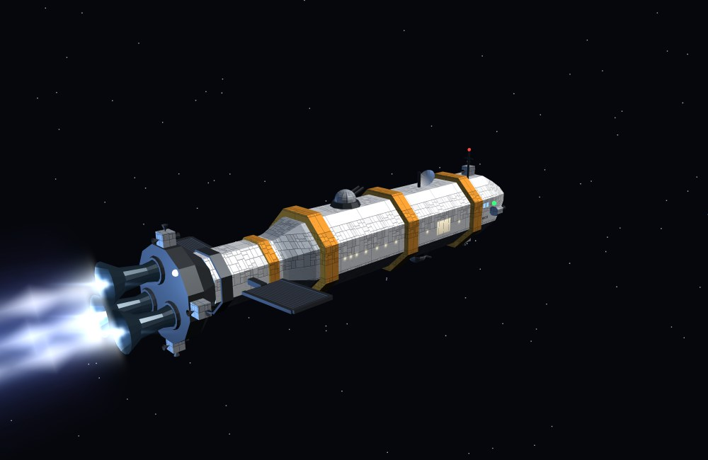

*Pousseur moyen, trois tuyères. Cœur blanc, chapelet de diamants de choc, gaine bleue turbulente ; la nacelle et les tuyères sont éclairées par le jet.*

#### Options évaluées

| Option | Principe | Coût GPU | Effort | Rendu | Retenu |
|---|---|---|---|---|---|
| A — Cône lumineux (§11.2) | un cône en fondu additif | quasi nul | fait | générique, « flamme de bougie » | remplacé |
| **B — Jet procédural en billboard axial** | 2 quads par tuyère, profil entièrement calculé par fragment | faible — 4 triangles, bruit fractal sur les seuls pixels couverts | modéré | aspect volumétrique sous presque tous les angles, animé | ✅ |
| **C — + lumière dynamique** | une `PointLight` par vaisseau (pas par tuyère) | modéré — une lumière de plus dans l'éclairage de la scène | faible | la poupe s'éclaire : le jet s'ancre dans la scène | ✅ |
| D — + bloom en post-traitement | `UnrealBloomPass` sur toute l'image | élevé — plusieurs passes plein écran, pénalisant sur mobile | modéré (intégrer un `EffectComposer` au jeu) | halo « cinéma » sur tout ce qui brille | ❌ pour l'instant — le halo est déjà simulé dans le shader |
| E — Volume raymarché | rayons marchés dans un volume 3D | très élevé | élevé | le plus physique | ❌ disproportionné pour le gain à distance de jeu |

**B + C : le meilleur rendu pour un coût modéré.** D reste une évolution possible si le jeu adopte un jour une chaîne de post-traitement (elle profiterait alors aussi aux étoiles, hublots et réacteurs).

#### Construction

Deux maillages par tuyère, tous deux de simples quads.

**Le jet — billboard axial.** Le quad garde son grand axe aligné sur l'axe de poussée et ne pivote qu'autour de cet axe pour toujours faire face à la caméra (calcul dans le vertex shader). Le fragment shader compose six couches :

| Couche | Rôle |
|---|---|
| Cœur | gaussienne très étroite, quasi constante sur la longueur (collimation) — saturée au blanc |
| Diamants de choc | losanges lumineux régulièrement espacés ; le cœur s'assombrit entre deux nœuds (structure en chapelet) |
| Gaine | bleu électrique, s'évase doucement, modulée par un bruit fractal qui s'écoule vers l'arrière |
| Halo | violet, plus large et plus diffus, second bruit plus fin |
| Point chaud | éblouissement à la sortie de tuyère ; gaine et halo naissent progressivement (le gaz se détend) |
| Scintillement | ±10 % d'intensité, décorrélé d'une tuyère à l'autre |

Un tonemapping `1 − e^(−x)` finalise : le cœur sature au blanc tandis que la gaine garde sa couleur — la gradation blanc → bleu → violet de la série.

**Le flare — sprite face caméra** posé à la sortie de tuyère : cœur, halo, anneau discret et **traînée horizontale anamorphique**. Il grossit quand on regarde dans l'axe du moteur — précisément l'angle où le jet, vu par la tranche, devient une simple ligne et s'efface (fondu programmé dans son shader).

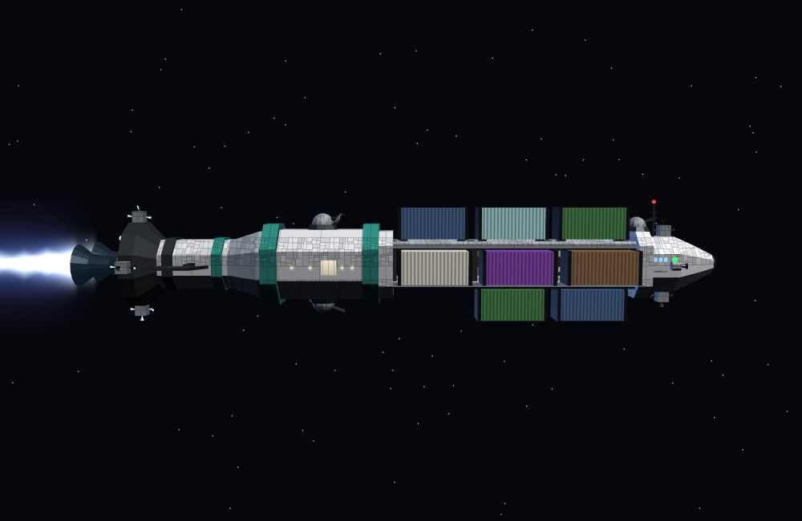

*Cargo-poutre de profil : jet collimaté avec ses diamants de choc, orienté à l'opposé de la cargaison (cf. septième bug, §11.1).*

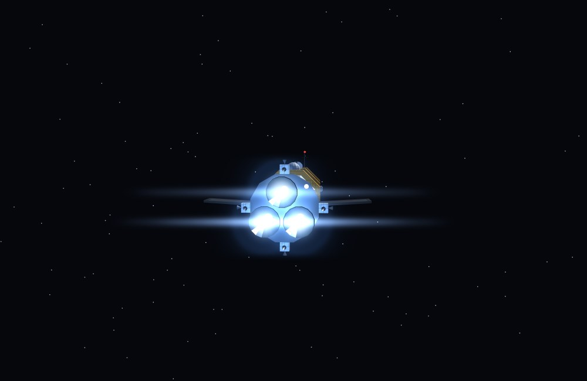

*Dans l'axe du moteur : le flare anamorphique prend le relais, les tuyères se découpent en contre-jour.*

Cœur du fragment shader du jet (`z` = position le long du jet, 0 à la tuyère ; `x` = position en travers, −1 à 1) :

```glsl
float wCore   = mix(0.10, 0.15, z);                 // cœur quasi constant : collimation
float wSheath = mix(0.26, 0.60, pow(z, 0.8));       // gaine qui s'évase doucement
float n  = fbm(vec2(x*5.0,  z*12.0 - t*7.0));       // turbulence qui s'écoule vers l'arrière
float xw = x + (n - 0.5)*0.05*z;                    // flottement latéral, nul à la tuyère
// diamants de choc : nœuds réguliers, cœur assombri entre deux nœuds
float cell = z*uDiamonds;  float u = fract(cell + 0.5) - 0.5;
float dOn  = step(0.5, uDiamonds) * smoothstep(0.4, 0.8, cell);
float nodeA = (1.0 - abs(u)*2.0); nodeA *= nodeA;
float a = xw/wCore;
float core    = exp(-a*a) * exp(-z*1.8) * (1.0 - dOn*0.55*(1.0 - nodeA)*exp(-z*1.2));
float diamond = pow(clamp(1.0 - (abs(u)*1.8 + abs(xw)/(wCore*2.4)), 0.0, 1.0), 1.5) * exp(-z*2.6) * dOn;
float b = xw/wSheath;       float sheath = exp(-b*b) * exp(-z*1.15) * (0.55 + 0.45*n) * smoothstep(0.0, 0.05, z);
float c = xw/(wSheath*2.1); float haze   = exp(-c*c) * exp(-z*2.2)  * (0.6 + 0.4*n2)  * smoothstep(0.0, 0.10, z);
float d = xw/0.22;          float hot    = exp(-z*22.0) * exp(-d*d);
vec3 col = uHaze*haze*0.16 + uSheath*sheath*0.45 + uCore*(core*1.5 + diamond*1.8 + hot*2.6);
col *= flicker * uThrottle * uGain * fade;          // fade : extrémité, bords, vue dans l'axe
col = vec3(1.0) - exp(-col*1.3);                    // tonemapping : cœur blanc, gaine bleue
```

#### Paramètres

Partagés par toutes les tuyères, donc une seule mise à jour par image : `uTime` (animation), `uThrottle` de 0 à 1 (longueur du jet de 35 à 100 %, intensité, lumière de poupe), `uDiamonds` (nombre de nœuds, 0 = désactivés), `uCore` / `uSheath` / `uHaze` (couleurs). Propres à chaque tuyère : `uLength`, `uRadius`, `uSeed` (décorrèle turbulence et scintillement) et `uGain` = 1/√n — les jets d'un même bouquet s'additionnent : sans cette compensation, un vaisseau à six tuyères saturerait tout en blanc (défaut constaté sur la première version de ce shader).

**Diamants de choc — un choix à trancher.** Physiquement, ils naissent d'un écart de pression entre le jet et l'atmosphère ambiante : dans le vide, leur présence est discutable. C'est pourtant une signature visuelle forte de « jet propulsif », que beaucoup de représentations de SF conservent. Activés par défaut (7 nœuds), désactivables d'un seul paramètre pour un rendu strictement physique.

#### Performances et optimisations

- **Géométrie** : 4 triangles par tuyère — négligeable.
- **Coût réel : le remplissage.** Deux bruits fractals de 4 octaves par pixel couvert, en fondu additif. Maîtrisé tant que la caméra ne colle pas au jet.
- **Optimisations prévues** : au-delà d'une certaine distance, fusionner le bouquet de tuyères en un seul jet élargi (coût divisé par le nombre de tuyères) ; réduire les octaves de bruit avec la distance (4 → 2) ; une seule lumière par vaisseau, jamais par tuyère ; moteur éteint = maillages masqués, coût nul en croisière.

#### Intégration au jeu

`uThrottle` suit la phase de l'autopilote : accélération (poussée pleine), croisière (0 — moteur éteint, comme dans la série), freinage après retournement (« flip and burn », poussée pleine). Les rétropropulseurs avant ne reçoivent pas ce shader : leur usage bref appelle un simple sursaut lumineux, pas un jet continu.

Démo interactive livrée à part (`epstein-drive-demo.html`) : choix du vaisseau, poussée, diamants de choc activés ou non, rotation libre autour du vaisseau — l'animation (turbulence, scintillement) ne se juge vraiment qu'en mouvement.

### 11.4 Refonte globale des formes (maquettes v3)

Les retouches successives du §11.1 avaient corrigé des défauts locaux, mais laissé des faiblesses d'ensemble : habitats d'un seul pavé, nacelles en « oignon », cage vitrée translucide sur le cargo-entrepôt, simple tube annelé pour la poutre, coques gris uni sans aucune matière. La refonte repose sur un principe unique : **chaque vaisseau est une chaîne de trois sections standard** — proue, habitat, section moteur — chacune démarrant exactement sur la face arrière de la précédente (principe acté au cinquième bug, §11.1). Les trois archétypes partagent ainsi les mêmes briques, ce qui garantit une famille visuelle cohérente.

| Élément | Avant | Après |
|---|---|---|
| Coques | gris uni | plaquage procédural (une seule texture partagée, projetée à la même échelle sur toutes les pièces), collerettes et côtes aux couleurs de la livrée du vaisseau |
| Habitat | un pavé biseauté | modules octogonaux séparés par des collerettes, dôme radar et tourelles dessus et dessous |
| Proue | fuseau lisse ou cône | nez octogonal fermé par un anneau d'amarrage, puis un tronçon « passerelle » qui porte hublots de passerelle, nom peint, rétropropulseurs latéraux, RCS, feux et antenne |
| Section moteur | nacelle en oignon | adaptateur, réacteur à côtes, jupe, plaque de poussée, tuyères montées sur cardan ; radiateurs en ailes sur le réacteur, RCS et feu blanc sur la plaque |
| Cargo-entrepôt | boîte translucide et croisillons | cage ouverte (longerons, cadres, croisillons) fermée par deux cloisons pleines, qui portent l'une la proue, l'autre la section moteur ; bandes de danger sur les cloisons |
| Cargo-poutre | tube hexagonal annelé | poutre en treillis carré (quatre longerons, cadres, diagonales alternées), conteneurs bridés sur ses quatre faces |
| Conteneurs | cubes de couleur | tôle ondulée et cadres d'extrémité, couleur de cargaison conservée (§3) |
| Défense | dôme et canon | tourelle PDC sur socle, double canon |

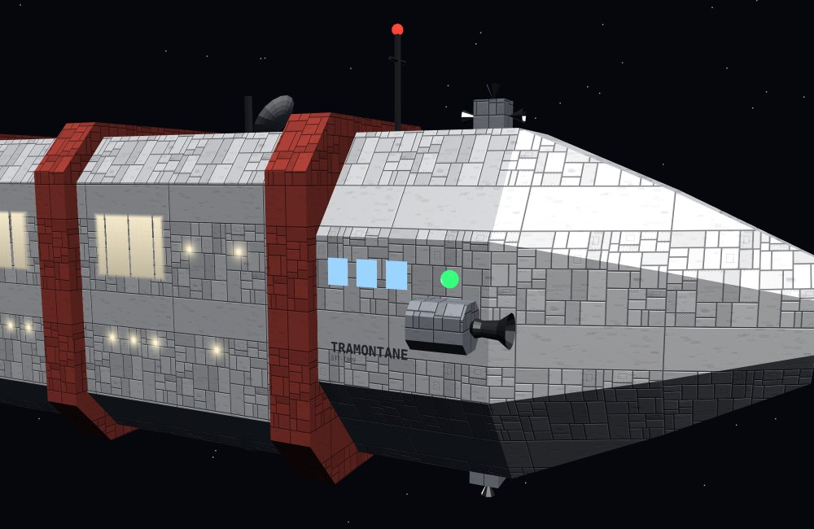

*Tronçon passerelle de la proue : hublots de passerelle, nom et immatriculation peints, rétropropulseur latéral (sortie vers l'avant), feu vert de tribord, RCS dorsal, antenne ; à gauche, collerettes aux couleurs de la livrée et grande baie d'une cabine panoramique.*

**Points techniques retenus :**

- **Prismes octogonaux exacts.** Les modules sont extrudés *sans* biseau, l'octogone venant du profil lui-même. Ce seul choix supprime le débordement de géométrie qui avait englouti les hublots (deuxième bug, §11.1) : hublots, nom et feux se posent à la cote exacte des faces, sans marge de sécurité à deviner.
- **Faces alignées d'une section à l'autre.** Nez, adaptateur et réacteur ont leurs faces centrées sur les axes, comme les modules : aucune torsion visible aux jonctions.
- **Plaquage à l'échelle monde.** Les coordonnées de texture sont calculées par projection sur la face dominante, en unités monde : une seule texture de 512 px, générée au chargement, habille toutes les pièces à la même échelle, du petit pousseur au vraquier. Coût : une texture partagée, zéro image à télécharger.
- **Nom peint.** Nom et immatriculation sont dessinés à la volée dans une texture, posée sur le tronçon constant de la proue, aux deux flancs et lisible dans le bon sens de chaque côté.
- **Feux de position.** Défaut corrigé au passage, présent depuis les toutes premières maquettes : l'intensité émissive, trop forte, saturait les canaux de couleur — le feu vert virait au cyan et le rouge à l'orange. Intensité ramenée pour conserver la teinte (vert mesuré après correction : R53 V255 B123).

**Page de présentation.** Les huit configurations sont réunies dans une page interactive (`maquettes-vaisseaux.html`) aux couleurs de la charte McGivrer : index des modèles groupé par archétype, banc d'essai 3D (quatre points de vue, rotation libre, poussée et diamants de choc réglables), fiche technique calculée sur la maquette elle-même (dimensions, tuyères, tourelles, cabines, conteneurs).

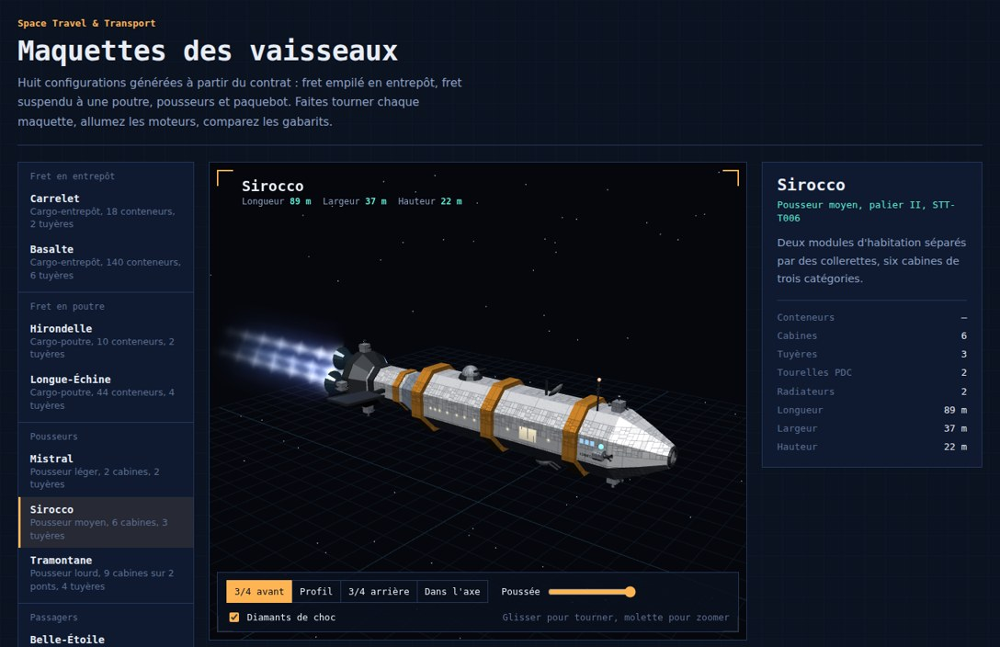

---

## 12. Impact sur l'implémentation actuelle

Ce chantier touche en profondeur plusieurs mécanismes déjà en place, tous solidaires du vaisseau actuel :

- **`buildShip()`** (§4 spec principale) devient une fonction paramétrée par contrat plutôt qu'une IIFE exécutée une fois — impact direct sur tout ce qui référence `shipMesh`/`shipRig` par une géométrie supposée fixe.
- **Miniature de la carte stellaire** (§23.7 spec principale, ajoutée récemment) clone `shipMesh` directement : une génération paramétrée doit rester compatible avec ce clonage (ou re-générer la miniature à chaque nouveau contrat).
- **Panneau PROPULSION, jauge de carburant, saut quantique** (§16, §22-23) : leurs seuils/capacités actuels sont calibrés sur LE vaisseau existant — un dimensionnement par palier (§7 ci-dessus) demande de revoir ces constantes pour chaque palier, pas seulement d'en ajouter une variante.
- **Caméras de poursuite** (§4) : le mode plan-séquence et la poursuite standard supposent des distances/angles calibrés sur la silhouette actuelle — une poutre de palier V (§4) sortirait du cadre sans un recalibrage des distances de caméra en fonction du palier.
- **Amarrage et mise en orbite** (§7, §8, §17 spec principale) : les points d'ancrage (dock de navettes, alignement de mise en orbite) sont positionnés en dur sur la silhouette actuelle ; une génération paramétrée doit exposer ces points comme des ancrages calculés, pas des coordonnées fixes.

Aucun de ces points n'est bloquant, mais ils cadrent l'ampleur réelle du chantier une fois les choix d'options ci-dessus arbitrés : la génération de la silhouette elle-même n'est qu'une partie du travail, la resynchronisation des systèmes qui en dépendent en est une autre, comparable en volume.

---

## 13. Synthèse et recommandation

Pour une première itération raisonnable, en cohérence avec les recommandations déjà données section par section :

1. **Archétype** : les trois (Option B, §2.4) — cargo-entrepôt et cargo-poutre pour le fret, paquebot automatique dès qu'un contrat n'a aucun conteneur. C'est ce qui sert le mieux l'objectif de départ (le vaisseau raconte le contrat), au prix assumé d'un équilibrage à tripler.
2. **Conteneurs** : gabarit unique (Option A, §3) — simplicité de génération, quitte à enrichir plus tard.
3. **Dimensionnement** : cinq paliers discrets (Option A, §4) — plus simple à équilibrer et à tester qu'un continuum ; le paquebot y suit les mêmes paliers, lus sur le nombre de passagers plutôt que de conteneurs.
4. **Répartition** : remplissage par blocs contigus par type de cargaison dans les deux archétypes de fret (§5) ; un seul type de cabine par contrat pour les passagers (Option A, §6.1).
5. **Pousseur** : forme évolutive à trois paliers (§6.2) plutôt qu'une taille fixe — un pont jusqu'à une dizaine de cabines, deux ponts au-delà.
6. **Armement** : purement décoratif pour commencer (Option A, §7), en gardant la porte ouverte à une défense passive automatique si des événements hostiles sont développés.

Ce sont des points de départ, pas des décisions arrêtées — chaque section ci-dessus reste ouverte à discussion avant toute mise en implémentation.
