# Space Travel & Transport — Spécification v2.15

**Format :** Markdown avec captures d'écran, schémas SVG et diagrammes mermaid **intégrés directement dans le fichier** (images en base64) — un seul fichier `.md`, aucun dossier annexe requis.

**Ce qui change depuis la v2.0** (DOCX) : plusieurs évolutions qui y étaient décrites comme de simples propositions sont désormais **réellement implémentées et vérifiées** dans `space-travel.html` — le système de crédits, les raccourcis F3/F10, l'élargissement du panneau de plan de vol, le correctif du roulis, et surtout la mise en scène cinématique des navettes avec un dock physique sous le vaisseau et un habillage texturé de la coque. Ce document sépare nettement, comme la v2.0, ce qui existe (Partie I) de ce qui reste à construire (Partie II) — mais la frontière entre les deux s'est déplacée.

## Historique des révisions

| Version | Date | Auteur | Contenu |
|---|---|---|---|
| 2.0 | 13 septembre 2026 | Frédéric Delorme | Spécification initiale (DOCX) : vue d'ensemble, univers procédural, vaisseau, commandes, navigation, systèmes planétaires, séquence d'arrivée, HUD, architecture, i18n. |
| 2.1 | 16 septembre 2026 | Frédéric Delorme | Conversion en Markdown autonome (images intégrées). Ajout des propositions §14 (dialogues radio par IA embarquée, Gemini Nano) et §15 (contrôle tactile), puis implémentation et vérification des deux. Corrections : scintillement du dock (z-fighting), caméra de largage des navettes décentrée/tremblante, mise en orbite trop rapide, trajectoire du cargo pouvant traverser des corps célestes. |
| 2.2 | 16-17 septembre 2026 | Frédéric Delorme | Palier 1 livré : mode Pause (§11), barre de contrôle du HUD (§12), services portuaires (§16, nouveau). Premier lot de corrections (espacement des systèmes trop resserré, planètes absentes du plan de vol, chevauchement radio/services). |
| 2.3 | 17 septembre 2026 | Frédéric Delorme | Second lot de corrections et améliorations (§17) : bugs (chevauchement général des panneaux, regard tactile disparu, position de la barre d'icônes, bouton d'aide manquant) et confort (croix de fermeture, raccourcis F1-F9+H, icône caméra dynamique, aide en overlay, message de bienvenue radio, avatars, trajectoire de largage des navettes en 3 temps, traînée de propulseur, labels de vaisseaux, rendu d'objet dans le panneau « objet le plus proche »). Proposition (non implémentée) pour la carte de l'univers (§19). |
| 2.4 | 17 septembre 2026 | Frédéric Delorme | Icône de regard tactile remplacée par une icône caméra. Deux nouveaux panneaux (§21) : **itinéraire** visuel (bas droite) — piste d'étapes vert/bleu avec point de position continu — et **orientation par rapport à un point de Lagrange** (bas gauche) — boussole + distance. Deux icônes HUD supplémentaires, raccourcis fixes `I`/`L`. Captures non refaites intégralement cette fois ; une seule capture ajoutée (§21) pour les deux nouveaux panneaux. |
| 2.5 | 18 septembre 2026 | Frédéric Delorme | Trois nouvelles propositions, non implémentées — dédiées à leur propre cycle de validation avant chantier, comme la carte de l'univers en son temps. **Carburant** (§22) : jauge, consommation liée au régime moteur, ravitaillement en escale, quantités initiales dimensionnées contre les constantes réelles du générateur de routes. **Propulsion quantique et carte stellaire** (§23) : achat en escale d'un module de saut, sélection de la destination sur la carte de l'univers — décision enfin tranchée pour cette dernière (option B du §19, désormais à double usage). **Ports orbitaux** (§24) : second type de port, en orbite plutôt qu'au sol, nombre restreint de maquettes 3D instanciées dans certains systèmes. Conflit de touche `I`/§13 (relevé en v2.4) résolu : incendie moteur déplacé sur `J`. |
| 2.6 | 18 septembre 2026 | Frédéric Delorme | **Carburant (§22) implémenté** : jauge fusionnée au panneau PROPULSION (option B retenue), consommation liée au régime moteur, ravitaillement en escale, comportement à sec tranché (croisière réduite à 20 %, boost coupé). Bug trouvé et corrigé pendant l'implémentation : chevauchement possible entre le panneau services portuaires — désormais plus haut — et le panneau itinéraire sur une fenêtre basse. |
| 2.7 | 19 septembre 2026 | Frédéric Delorme | **Propulsion quantique et carte stellaire (§23) implémentées** : achat unique en escale (18 000 CR), carte 3D sur une scène dédiée (sphères simples plutôt que les maillages étoile complets, plus légères pour ~24 candidats), sélection par lancer de rayon, séquence de saut en 3 phases réutilisant les réacteurs et l'effet `.speedlines` du boost plutôt qu'un système de particules. Deux bugs trouvés et corrigés en implémentant : un commentaire HTML refermé par erreur en syntaxe JS (`*/`), qui faisait disparaître le panneau de la carte du DOM ; l'overlay de la carte imbriqué dans le conteneur HUD général, masqué par erreur par sa propre règle de nettoyage d'écran. |
| 2.8 | 19 septembre 2026 | Frédéric Delorme | Suite d'améliorations et de corrections sur la carte stellaire (§23) : rendu des étoiles repris du jeu principal (même shader, halo, couleur réelle) à échelle réduite plutôt que de simples sphères ; grille de référence blanche avec repères lettrés sur un plan horizontal centré sur les étoiles affichées ; lignes pointillées de la couleur de chaque étoile la reliant à ce plan ; étiquettes de nom ; vaisseau représenté par une miniature du modèle réel (clone du groupe visuel, éclairage dédié ajouté) avec étiquette cercle+flèche comme en jeu ; rotation automatique très lente après 5 s d'inactivité de la souris. Deux bugs corrigés : ÉCHAP/ESPACE/ENTRÉE renvoyaient vers l'écran-titre ou reprenaient le vol sans fermer proprement la carte (tous trois réutilisent `gamePaused`, partagé avec la pause générale, sans le savoir) ; la touche `M` ne répondait pas au clavier AZERTY (`e.code` donne la position physique de la touche, où la lettre M occupe la position du point-virgule QWERTY). |
| 2.9 | 19 septembre 2026 | Frédéric Delorme | **Écran-titre (§25) : navigation clavier et travelling de fond.** Flèches + ENTRÉE/ESPACE pour choisir la langue, en plus du clic/tactile déjà en place. Succession de plans très lents à travers l'univers déjà généré (étoile/planète/nébuleuse au hasard), HUD et étiquettes masqués. Trois bugs trouvés en implémentant, tous liés à des hypothèses qui ne tenaient qu'en vol normal : le calcul de taille apparente d'une étoile (jamais exécuté hors de la boucle de jeu normale) ; la distance de cadrage choisie pour une étoile (calée sur son halo, des centaines d'unités — le calcul d'angle n'est pensé que pour un survol à quelques unités) ; et un fond d'écran-titre opaque masquant un rendu pourtant déjà correct en dessous, même défaut que celui déjà rencontré sur la carte stellaire (§23.6). |
| 2.10 | 19 septembre 2026 | Frédéric Delorme | Écran-titre (§25.2) : le vaisseau et le tracé de sa route sont désormais masqués eux aussi pendant le travelling de fond (`.visible = false`, restauré au démarrage réel) — repéré sur une capture montrant clairement les portiques en pointillés de la route dans le décor. Le masquage du HUD, lui, était déjà correct malgré une première vérification trompeuse (`getComputedStyle` sur un panneau ne reflète pas l'effet d'un ancêtre masqué — confirmé sans ambiguïté via `offsetParent`/`getBoundingClientRect`). |
| 2.11 | 19 septembre 2026 | Frédéric Delorme | Trois demandes combinées. **Travelling arrière supprimé** de l'écran-titre (§25.2) : chaque plan approche désormais sa cible depuis la position actuelle de la caméra, jamais depuis une direction aléatoire. **Vaisseau saccadé corrigé** (§5) : la recherche du point le plus proche sur la courbe de route, trop grossière (24 pas sur 420 u), figeait `ROUTE.s` par paliers avant de sauter d'un coup — remplacée par une recherche en deux passes (grossière puis fine), plus précise et moins coûteuse. **Musique de fond et réglage des volumes** (§26) : nouveau dialogue à deux curseurs (musique, voix de synthèse), lecture déclenchée sur le premier geste utilisateur réel pour respecter la politique autoplay des navigateurs. |
| 2.12 | 19 septembre 2026 | Frédéric Delorme | Écran-titre (§25.4) : étoiles de fond recentrées sur la caméra du travelling (elles défilaient trop vite et passaient devant les objets) et rendues systématiquement en arrière-plan ; mention « (c) 2026 - game by Frédéric Delorme - music by ScoreStudio from Envato » en bas d'écran ; musique lancée dès l'affichage de l'écran-titre (§26.1), dans la limite de la politique de lecture automatique des navigateurs. |
| 2.13 | 24 septembre 2026 | Frédéric Delorme | Vaisseaux générés (§27) : le vaisseau unique est remplacé par le générateur de l'étude « Construction générative des vaisseaux cargo » — dix modèles, du pousseur léger de 61 m au cargo-poutre de 237 m —, choisi dans un écran de sélection provisoire entre l'écran-titre et la partie, puis raccordé à tous les systèmes existants (jauges, RCS, feux, balises, dock et bras des navettes, caméra). Moteur Epstein en shader sur tous les modèles. Saut quantique v2 (§28) : réservé aux long-courriers équipés d'anneaux de distorsion, nouvelle séquence de déformation de l'espace-temps (post-traitement actif uniquement pendant le saut). |
| 2.14 | 24 septembre 2026 | Frédéric Delorme | Écran de sélection (§27.2) : sélecteur de système de propulsion sur les long-courriers — « Epstein » ou « Epstein + saut quantique » —, aperçu et fiche recalculés selon le choix ; option grisée sur les autres vaisseaux. Un long-courrier parti sans anneaux peut acheter le module en escale : les anneaux sont alors posés sur la coque, sans toucher au dock ni au bras (§28.1). Parcours du joueur (§1) mis à jour. PDF : diagrammes Mermaid désormais rendus en graphiques — ils apparaissaient sous forme de code. |
| 2.15 | 25 septembre 2026 | Frédéric Delorme | Propulsion supraluminique (§29) : croisière ×5 à ×10 selon la masse, sur anneaux de distorsion — distincte du saut quantique, qui repose désormais sur un générateur de saut (§28) ; sélecteur à deux options cumulables (§27.2). §19 : carte de l'univers marquée implémentée. §3 et captures d'écran mises à jour avec les vaisseaux générés. Projet réorganisé (§30) : sources dans `src/` (html, css, js, test, docs), build Node.js produisant la page unique compacte dans `target/`, 8 tests automatisés, captures et PDF reproductibles ; graine imposable par l'URL (`?seed=`). Corrections : l'écran-titre pouvait revenir par-dessus la partie quand on passait le générique d'un clic puis lançait vite sa partie ; le panneau « Commandes moteur » restait figé sur « Réacteurs 1-4 » quel que soit le vaisseau — deux défauts révélés par l'automatisation des tests et des captures. |

---

## Sommaire

**Partie I — État actuel du simulateur**
- [1. Vue d'ensemble](#1-vue-densemble)
- [2. Univers procédural](#2-univers-procédural)
- [3. Le vaisseau](#3-le-vaisseau)
- [4. Commandes de vol et caméra](#4-commandes-de-vol-et-caméra)
- [5. Navigation — plan de vol](#5-navigation--plan-de-vol)
- [6. Systèmes planétaires](#6-systèmes-planétaires)
- [7. Séquence d'arrivée : orbite, navettes, crédits](#7-séquence-darrivée--orbite-navettes-crédits)
- [8. Interface (HUD)](#8-interface-hud)
- [9. Architecture technique](#9-architecture-technique)
- [10. Internationalisation](#10-internationalisation)

**Partie II — Évolutions restant à implémenter**
- [11. Mode Pause — ✅ implémenté](#11-mode-pause--implémenté)
- [12. Barre de contrôle du HUD — ✅ implémenté](#12-barre-de-contrôle-du-hud--implémenté)
- [13. Événements aléatoires et réparations](#13-événements-aléatoires-et-réparations)
- [14. Dialogues radio générés par IA embarquée (Gemini Nano) — ✅ implémenté](#14-dialogues-radio-générés-par-ia-embarquée-gemini-nano--implémenté)
- [15. Contrôle tactile pour appareils portables — ✅ implémenté](#15-contrôle-tactile-pour-appareils-portables--implémenté)
- [16. Services portuaires — ✅ implémenté](#16-services-portuaires--implémenté)
- [17. Corrections et améliorations (raffinement post-Palier 1)](#17-corrections-et-améliorations-raffinement-post-palier-1)
- [18. Plan d'implémentation](#18-plan-dimplémentation)
- [19. Carte de l'univers — ✅ implémentée (touche M)](#19-carte-de-lunivers--implémentée-touche-m)
- [20. Référence — tous les raccourcis clavier](#20-référence--tous-les-raccourcis-clavier)
- [21. Itinéraire visuel et point de Lagrange — ✅ implémenté](#21-itinéraire-visuel-et-point-de-lagrange--implémenté)
- [22. Carburant et consommation — ✅ implémenté](#22-carburant-et-consommation--implémenté)
- [23. Propulsion quantique et carte stellaire — ✅ implémenté](#23-propulsion-quantique-et-carte-stellaire--implémenté)
- [24. Ports orbitaux](#24-ports-orbitaux)
- [25. Écran-titre : navigation clavier et travelling de fond — ✅ implémenté](#25-écran-titre--navigation-clavier-et-travelling-de-fond--implémenté)
- [26. Musique de fond et réglage des volumes — ✅ implémenté](#26-musique-de-fond-et-réglage-des-volumes--implémenté)
- [27. Vaisseaux générés et écran de sélection — ✅ implémenté](#27-vaisseaux-générés-et-écran-de-sélection--implémenté)
- [28. Saut quantique v2 : déformation de l'espace-temps — ✅ implémenté](#28-saut-quantique-v2--déformation-de-lespace-temps--implémenté)
- [29. Propulsion supraluminique — ✅ implémentée](#29-propulsion-supraluminique--implémentée)
- [30. Organisation du projet, build et tests — ✅ implémentée](#30-organisation-du-projet-build-et-tests--implémentée)

---

# Partie I — État actuel du simulateur

## 1. Vue d'ensemble

Simulateur de vol spatial procédural, livré en **un unique fichier HTML autonome** (Three.js r128, WebGL, aucune étape de build). Un cargo pilote automatiquement — ou manuellement — de système en système, livre sa cargaison par navettes à chaque escale, échange par radio avec le contrôle du port, gagne des crédits, et poursuit son itinéraire dans un univers entièrement généré depuis une seule graine. Interface disponible en français, anglais, allemand et espagnol, choisie sur l'écran-titre.

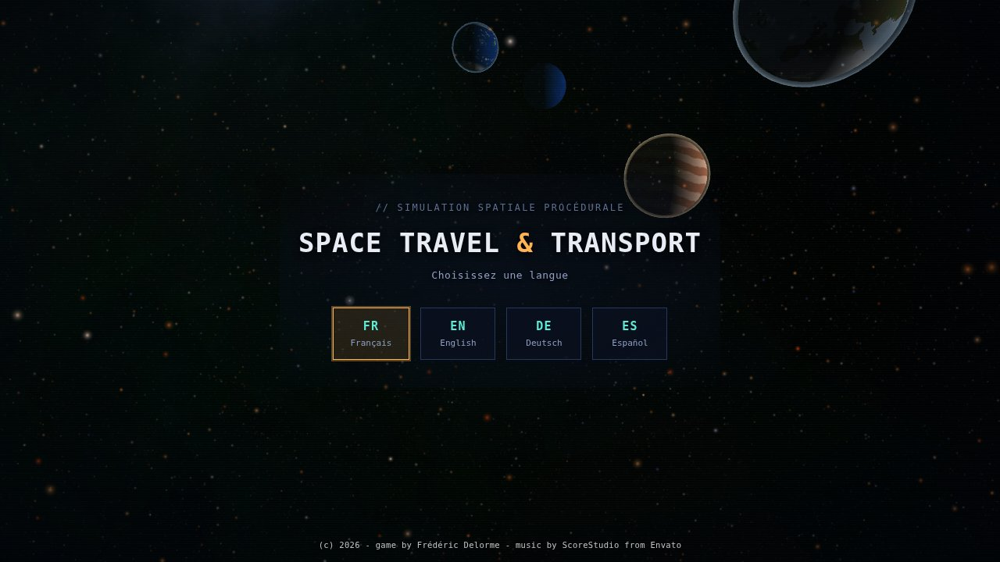

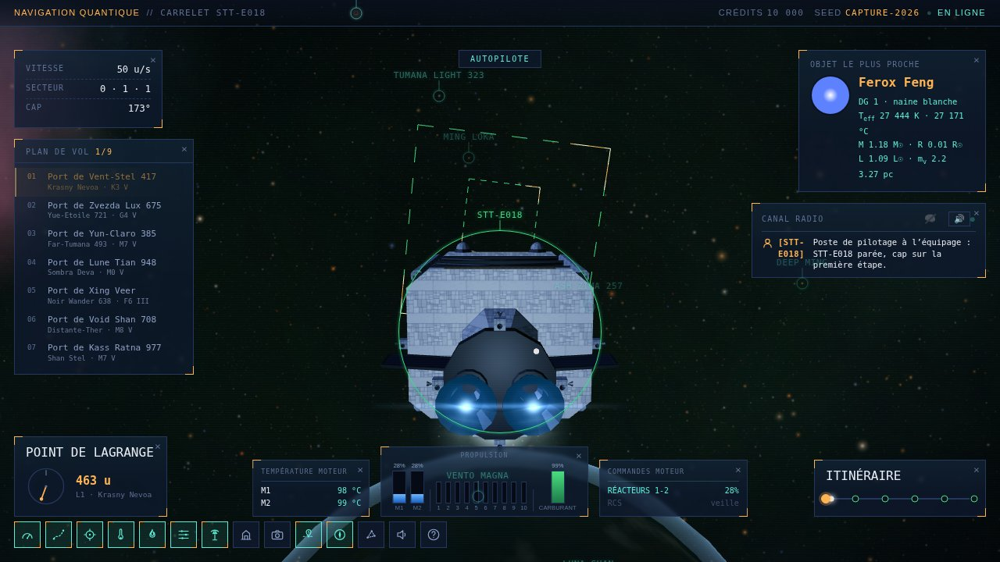

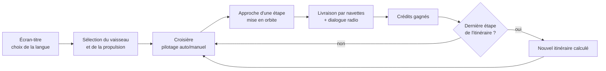
```mermaid
flowchart LR
    A[Écran-titre<br/>choix de la langue] --> S[Sélection du vaisseau<br/>et de la propulsion]
    S --> B[Croisière<br/>pilotage auto/manuel]
    B --> C[Approche d'une étape<br/>mise en orbite]
    C --> D[Livraison par navettes<br/>+ dialogue radio]
    D --> E[Crédits gagnés]
    E --> F{Dernière étape<br/>de l'itinéraire ?}
    F -- non --> B
    F -- oui --> G[Nouvel itinéraire calculé]
    G --> B
```

## 2. Univers procédural

Tout — étoiles, nébuleuses, systèmes planétaires, noms — découle d'une seule graine (`SEED`) via des générateurs pseudo-aléatoires dédiés. Rejouer la même graine reproduit exactement le même univers.

- **Étoiles** physiquement modélisées : classes spectrales (fractions de Salpeter), couleur par lieu planckien, luminosité/masse/rayon par lois astrophysiques, magnitude apparente calculée en fonction de la distance.
- **Nébuleuses** procédurales (bruit fBm 4 canaux), apparition progressive pour éviter tout effet de « pop » visuel.
- **Étiquettes de désignation** : cercle de ciblage + flèche, pour étoiles, planètes et lunes — vocabulaire visuel cohérent dans tout le HUD.

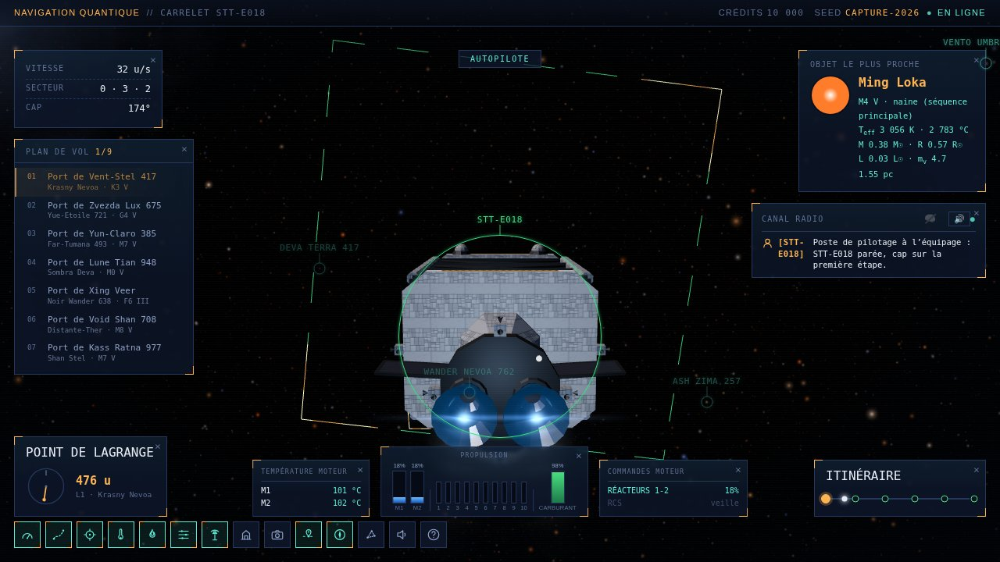

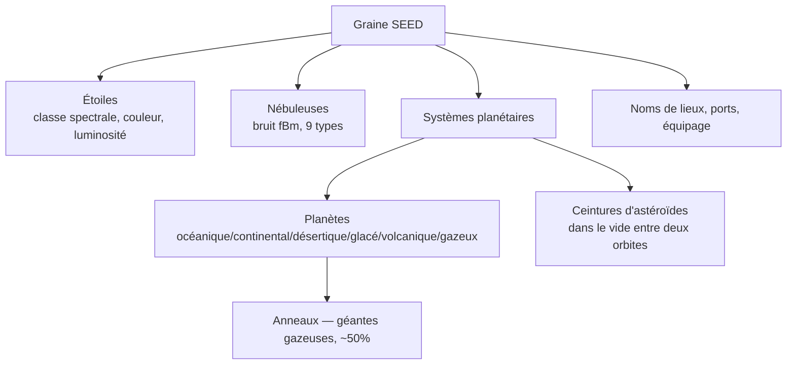
```mermaid
flowchart TD
    SEED[Graine SEED] --> ST[Étoiles<br/>classe spectrale, couleur, luminosité]
    SEED --> NB[Nébuleuses<br/>bruit fBm, 9 types]
    SEED --> SYS[Systèmes planétaires]
    SEED --> NM[Noms de lieux, ports, équipage]
    SYS --> PL[Planètes<br/>océanique/continental/désertique/glacé/volcanique/gazeux]
    PL --> RG[Anneaux — géantes gazeuses, ~50%]
    SYS --> AST[Ceintures d'astéroïdes<br/>dans le vide entre deux orbites]
```

## 3. Le vaisseau

Depuis la v2.13, le vaisseau n'est plus unique : le joueur le choisit au lancement parmi dix modèles générés (§27), du pousseur léger de 61 m au cargo-poutre de 237 m. Tous suivent la même construction en chaîne — proue (passerelle, nom peint, rétropropulseurs latéraux, RCS, feux), habitat en modules séparés par des collerettes aux couleurs de la livrée, section moteur (réacteur, radiateurs, plaque de poussée, tuyères Epstein) —, détaillée dans l'étude « Construction générative des vaisseaux cargo ». Les long-courriers peuvent en plus recevoir des anneaux de distorsion (croisière supraluminique, §29) et un générateur de saut (saut quantique, §28).

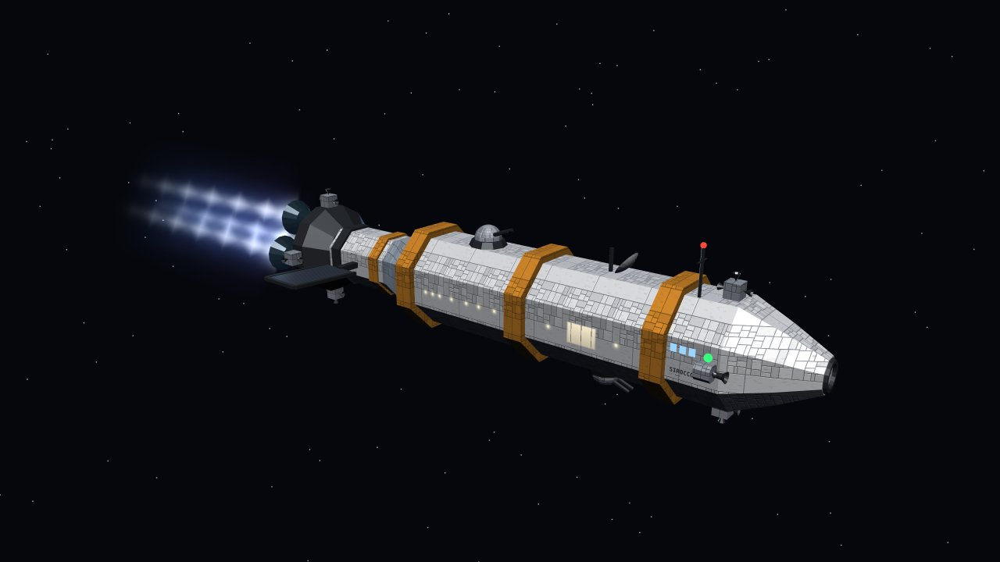

*(Vaisseau d'origine, v2.1 à v2.12.)* **Nouveauté v2.1 — habillage de la coque.** Les quatre matériaux réutilisés dans tout le vaisseau (coque, pont, panneaux sombres, cadres) portent désormais une texture procédurale générée par canvas — grille de panneaux à teinte légèrement désaccordée, joints marqués, greebles épars (capots, ouïes), bandes de danger jaune/noir ponctuelles. Inspirée de vaisseaux cargo façon *Homeworld*, sans dépendance à une image externe : cohérent avec le reste du fichier, qui génère déjà ses textures d'anneaux et de planètes de la même manière. Une texture par matériau suffit à habiller l'ensemble de la silhouette ; les navettes ont leur propre texture, générée une seule fois au chargement plutôt qu'à chaque largage.

*(Vaisseau d'origine, v2.1 à v2.12.)* **Nouveauté v2.1 — dock de navettes.** Une baie éclairée en bleu, en saillie sous le bloc arrière (propulseurs) — pas sous la nacelle cargo, où elle se serait retrouvée occultée par le volume des conteneurs. Puits + cadre métallique + surface émissive + double halo additif (cœur serré, halo large) + point light à courte portée qui illumine réellement la coque alentour, avec une respiration douce plutôt qu'un clignotement. Les navettes partent réellement de ce point, pas du centre du vaisseau.

*Depuis la v2.13, ce dock et son bras de chargement sont posés sous le module d'habitation de chaque modèle — sous la cloison arrière pour le cargo-entrepôt (§27.3).*

## 4. Commandes de vol et caméra

*Depuis la v2.13, le vaisseau n'est plus unique : il est choisi au lancement parmi dix modèles générés (§27), et la caméra de poursuite comme les rayons d'évitement s'adaptent à sa taille.*

| Touche | Action |
|---|---|
| `↑ ↓ ← →` / `Z Q S D` (AZERTY) / `W A S D` (QWERTY) | Orientation |
| `E` / `R` | Roulis *(corrigé en v2.1 — l'aide affichait par erreur `A / E`)* |
| `MAJ` ou `ESPACE` | Propulsion (boost) |
| Glisser la souris | Visée fine |
| `CTRL` + glisser | Regard libre |
| `F3` | Mode de caméra suivant *(nouveau v2.1)* |

**Nouveauté v2.1 — F3.** Le changement de mode de caméra (poursuite standard → plan-séquence → plans lointains) se fait désormais par une simple pression sur `F3`, qui remplace l'ancien mécanisme de double/triple appui sur `CTRL`. Ce dernier — sensible aux conditions de rendu lors de sa validation initiale — a été **entièrement retiré** plutôt que complété : `CTRL` retrouve un rôle unique (regard libre en glissé, recentrage en appui court), sans plus avoir besoin d'un minuteur pour distinguer un, deux ou trois appuis.

## 5. Navigation — plan de vol

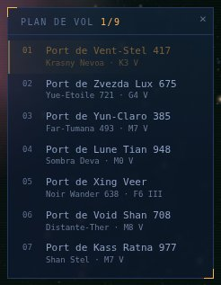

**Correctif v2.1 — largeur du panneau.** Mesuré dans le code : le panneau ne faisait que 230 px de large, avec numéro/nom/désignation stellaire sur une seule ligne — largement insuffisant face aux noms de ports générés, d'où des troncatures fréquentes. Deux ajustements combinés : élargissement modéré à 300 px, **et** passage à un gabarit deux lignes par étape (nom en pleine largeur, désignation stellaire en dessous, atténuée). La troncature reste en filet de sécurité pour les rares noms encore trop longs.

**Révision v2.3 — retour à 230 px.** Demande explicite de resserrer le panneau. Revenir à la largeur d'origine n'a **pas** réintroduit le problème de troncature que la v2.1 avait corrigé : c'est le passage au gabarit deux lignes, gardé intact, qui faisait le vrai travail (un nom trop long occupe sa propre ligne plutôt que d'être compressé à côté du numéro et de la désignation). La largeur en elle-même n'était qu'un des deux leviers.

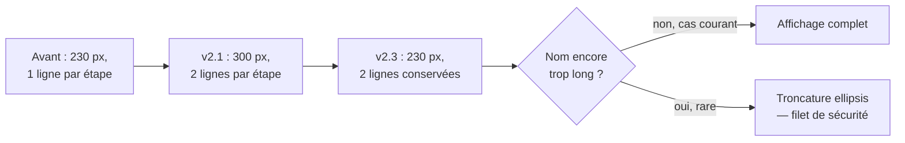
```mermaid
flowchart LR
    A["Avant : 230 px,<br/>1 ligne par étape"] --> B["v2.1 : 300 px,<br/>2 lignes par étape"]
    B --> F["v2.3 : 230 px,<br/>2 lignes conservées"]
    F --> C{Nom encore<br/>trop long ?}
    C -->|non, cas courant| D[Affichage complet]
    C -->|oui, rare| E[Troncature ellipsis<br/>— filet de sécurité]
```

La route est planifiée via une courbe de Catmull-Rom passant par chaque étoile puis chaque planète cible, avec deux passes de sécurité qui écartent toute planète — ciblée ou non — qui se retrouverait trop près du tracé (vérifié sans collision sur 150 itinéraires générés aléatoirement).

**Bug corrigé — le vaisseau semblait avancer en saccadant.** La progression le long de la courbe (`ROUTE.s`, qui alimente le calcul de cap de l'autopilote, §4) était retrouvée chaque image par une recherche du point le plus proche sur 24 pas répartis sur 420 u — un pas d'environ 17,5 u, bien plus grossier que la distance parcourue par image en croisière (~0,9 u à 56 u/s, 60 i/s). `ROUTE.s` restait donc figée une vingtaine d'images avant de sauter d'un coup au palier suivant, décalant le cap visé par à-coups plutôt qu'en continu — perçu comme un mouvement saccadé. Une première densification (240 pas, ~1,75 u) restait perceptible : le delta alternait encore entre 0 et 1,75 u d'une image à l'autre. Remplacée par une recherche en **deux passes** — une grossière (24 pas, repère la bonne zone) puis une fine (32 pas resserrés sur ± un pas grossier autour de ce repère, ~1,1 u de résolution finale) — pour 56 itérations au total, moins cher que les 240 pas de la première tentative, avec un résultat qui ne se fige plus jamais : vérifié sans une seule image bloquée sur 100, contre 92 avant correctif.

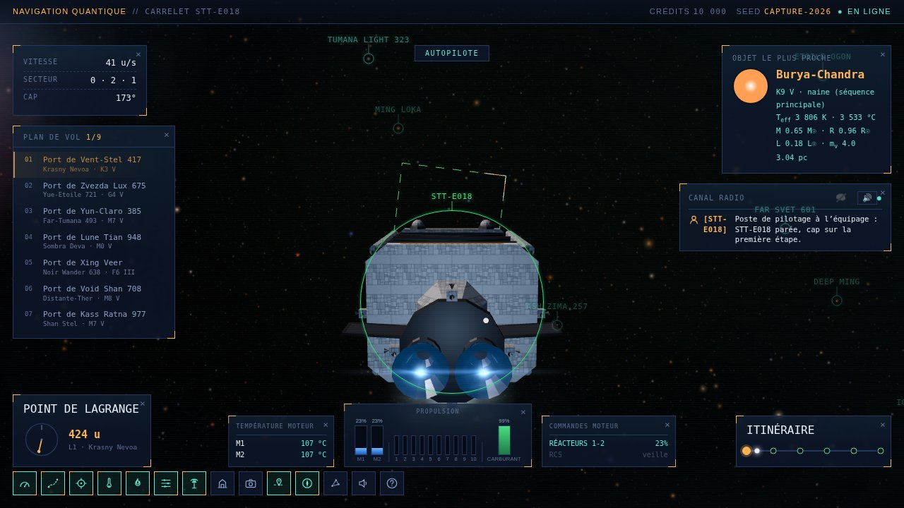

## 6. Systèmes planétaires

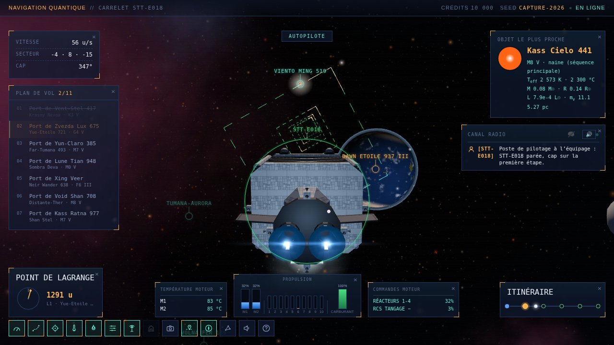

- 2 à 3 planètes par système, une habitable (port spatial).
- Espacement orbital en croissance géométrique (esprit Titius-Bode), avec garantie mathématique de zéro chevauchement quel que soit l'angle orbital.
- Anneaux pour ~50 % des géantes gazeuses ; champs d'astéroïdes placés dans le **vide** entre deux orbites, jamais sur l'orbite d'une planète.

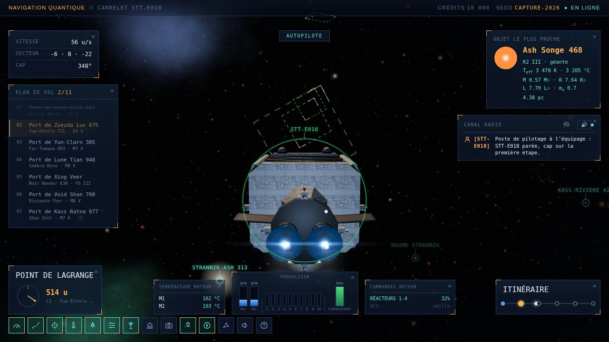

## 7. Séquence d'arrivée : orbite, navettes, crédits

À chaque étape (pas seulement la dernière), le vaisseau ralentit à l'approche, se met en orbite, et livre sa cargaison.

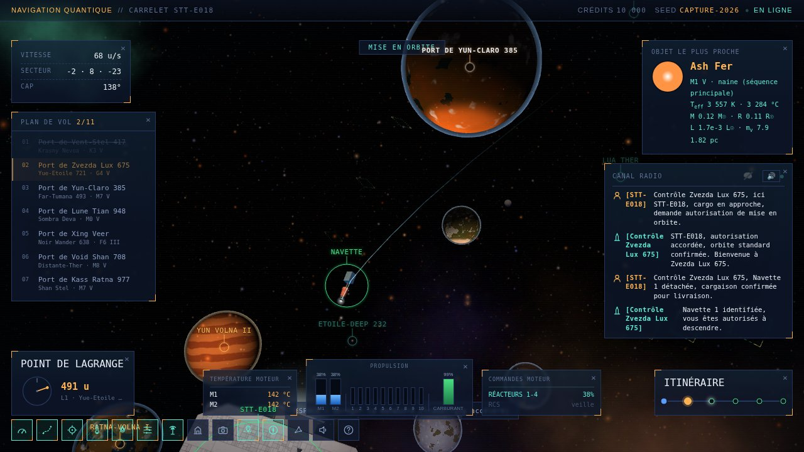

*Navette en vol avec sa traînée de propulseur (§17.2) alignée sur son axe de déplacement réel — pas sur l'orientation du nez, qui peut diverger pendant la phase courbée de l'approche. Panneau services portuaires (§16) ouvert au premier plan.*

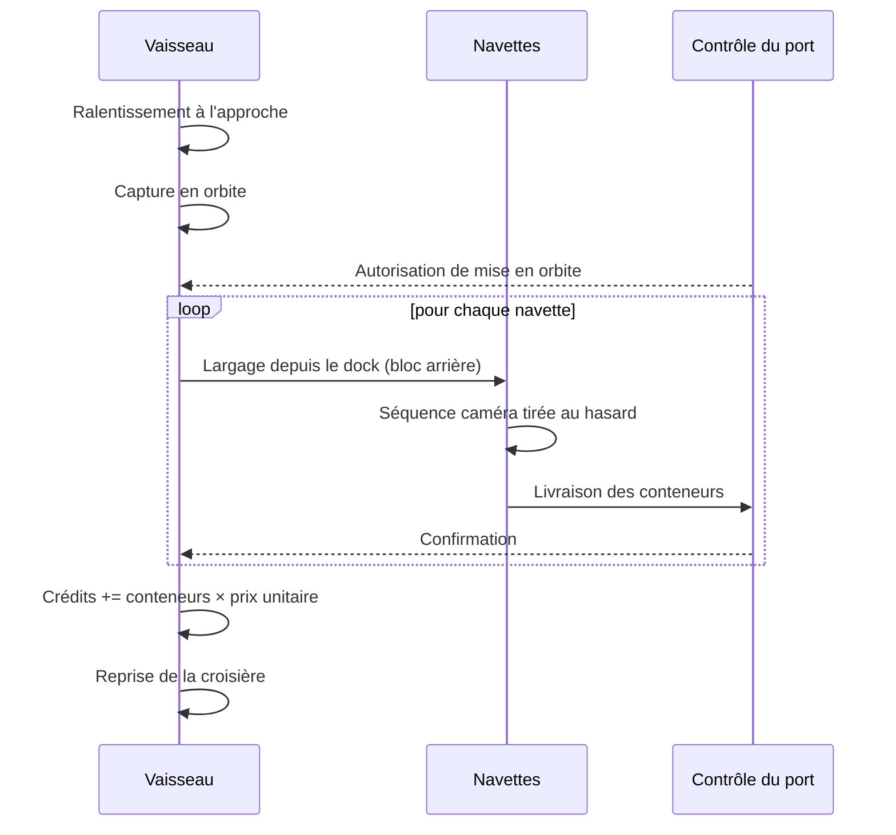
```mermaid
sequenceDiagram
    participant V as Vaisseau
    participant N as Navettes
    participant R as Contrôle du port
    V->>V: Ralentissement à l'approche
    V->>V: Capture en orbite
    R-->>V: Autorisation de mise en orbite
    loop pour chaque navette
        V->>N: Largage depuis le dock (bloc arrière)
        N->>N: Séquence caméra tirée au hasard
        N->>R: Livraison des conteneurs
        R-->>V: Confirmation
    end
    V->>V: Crédits += conteneurs × prix unitaire
    V->>V: Reprise de la croisière
```

**Nouveauté v2.1 — mise en scène des navettes.** Un catalogue de quatre séquences de plans, tirée au hasard à chaque largage (seedée, donc reproductible pour une même graine) :

| Séquence | Gros plan initial | Puis |
|---|---|---|
| Latérale rapprochée | Dock vu de côté, contre-plongée | Coupure franche vers un suivi à distance |
| Face avant | La navette vient droit vers la caméra | Suivi latéral large, le port entre dans le cadre |
| Travelling continu | Dock en gros plan | Éloignement progressif, sans aucune coupure |
| Sur l'épaule | Dock en gros plan | Plan fixe solidaire du vaisseau |

La coupure franche (pour les trois premières séquences) a été vérifiée par instrumentation directe : saut de caméra de plus de 120 unités en une seule image, exactement à l'instant prévu — pas un fondu progressif.

**Nouveauté v2.1 — crédits.** 1 à 5 conteneurs tirés par escale, répartis entre les navettes réellement larguées — et c'est cette même répartition qui alimente le dialogue radio, pour que l'équipage n'annonce jamais un chiffre sans rapport avec ce qui est effectivement crédité. Gain versé au moment où le dernier conteneur atterrit. Solde initial de 10 000 crédits, affiché dans la barre supérieure à gauche de `SEED`.

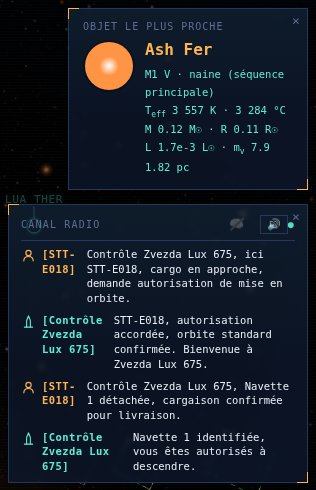

*Ordre d'empilement inversé en v2.3 (§17.1) : les services portuaires (§16) se placent désormais entre « objet le plus proche » et le canal radio, plutôt que l'inverse — un chevauchement dynamique avait été repéré dans l'ancien ordre.*

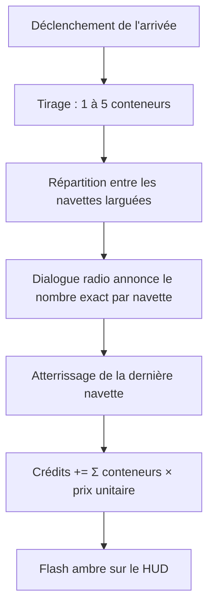
```mermaid
flowchart TD
    A[Déclenchement de l'arrivée] --> B[Tirage : 1 à 5 conteneurs]
    B --> C[Répartition entre les navettes larguées]
    C --> D[Dialogue radio annonce le nombre exact par navette]
    D --> E[Atterrissage de la dernière navette]
    E --> F[Crédits += Σ conteneurs × prix unitaire]
    F --> G[Flash ambre sur le HUD]
```

Le canal radio combine dialogue textuel et synthèse vocale (voix tirée aléatoirement masculine/féminine pour chaque interlocuteur), avec bips synthétisés à l'apparition de chaque message.

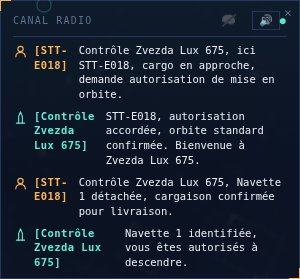

## 8. Interface (HUD)

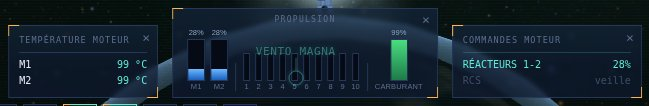

Panneaux : Vitesse/Secteur/Cap, Plan de vol, Objet le plus proche, Température moteur, Propulsion, Commandes moteur, Canal radio (bascule `TAB`). Aide clavier (`H`) tenue à jour avec tous les raccourcis actuels, y compris `F3`/`F10`.

## 9. Architecture technique

### 9.1 Le générateur à graine

Tout l'univers — étoiles, nébuleuses, systèmes planétaires, noms de lieux — découle d'une seule valeur de départ, la graine (`SEED`), au travers d'un mécanisme en deux étages : un hachage de chaîne (`xmur3`) qui transforme une **étiquette textuelle** en un entier 32 bits, suivi d'un générateur pseudo-aléatoire rapide (`mulberry32`) qui transforme cet entier en un flux de nombres reproductible.

**Pourquoi deux étages, pas un seul flux global.** Un générateur unique avancé séquentiellement rendrait chaque tirage dépendant de tout ce qui a été tiré avant lui — la même cellule stellaire donnerait une étoile différente selon qu'on l'atteint directement ou après un long détour, puisque le générateur n'aurait pas consommé le même nombre de valeurs en chemin. Le jeu a besoin de l'inverse : une planète, une étoile ou un nom doit toujours être **le même**, quel que soit l'ordre dans lequel le joueur explore l'univers — condition indispensable à une génération par fenêtre glissante (§2), qui ne construit jamais tout l'univers d'un coup.

La solution : chaque élément généré reçoit sa propre étiquette textuelle, unique et descriptive (par exemple `SEED+':route:3'` pour la 4ᵉ étape d'une route, ou une combinaison de coordonnées de cellule pour une étoile), qui alimente un flux de nombres **indépendant et rejouable à volonté** :

```
rngFor(étiquette) = mulberry32( xmur3(étiquette)() )
```

**Premier étage — `xmur3`, un hachage à avalanche.** Fonction empruntée à la famille MurmurHash3, elle convertit une chaîne de caractères en un entier 32 bits en mélangeant chaque caractère successivement :

```
h₀ = 1779033703 ⊕ longueur(chaîne)
hᵢ = rot13( (hᵢ₋₁ ⊕ code(cᵢ)) × 3432918353  mod 2³² )
```

où `rot13` est une rotation binaire de 13 bits et `×` une multiplication 32 bits (`Math.imul`). Une passe de finition — trois mélanges décalage/OU-exclusif/multiplication par des constantes impaires — garantit qu'un changement d'un seul caractère de l'étiquette, même un seul bit, modifie en moyenne la moitié des bits du résultat (propriété d'avalanche) : condition nécessaire pour que deux étiquettes voisines (`':route:3'` et `':route:4'`) produisent des graines sans corrélation perceptible.

**Second étage — `mulberry32`, le générateur proprement dit.** À partir de l'entier produit par `xmur3`, chaque appel avance l'état par un simple incrément :

```
aₙ₊₁ = aₙ + 0x6D2B79F5   (mod 2³²)
```

puis en tire un nombre à virgule flottante par une combinaison de décalages et de multiplications (l'étape dite de « scrambling ») :

```
t = (aₙ₊₁ ⊕ (aₙ₊₁ ≫ 15)) × (aₙ₊₁ | 1)
t = (t + ((t ⊕ (t ≫ 7)) × (t | 61))) ⊕ t
sortie = (t ⊕ (t ≫ 14)) / 2³²
```

L'incrément à lui seul suffirait à parcourir les 2³² valeurs possibles sans jamais boucler avant la fin de la période — 0x6D2B79F5 est impair, ce qui garantit mathématiquement un cycle complet. Le scrambling n'existe que pour distribuer statistiquement ces valeurs, pas pour éviter les répétitions. Mulberry32 est délibérément choisi pour sa simplicité (quelques opérations entières, aucune dépendance) plutôt que pour une qualité cryptographique inutile ici : suffisant pour qu'aucun motif visuel ne soit perceptible dans un champ d'étoiles ou une distribution de planètes, largement insuffisant pour un usage nécessitant une vraie imprévisibilité.

**Conséquence pratique.** Rejouer la même graine (`SEED`) reproduit exactement le même univers, jusqu'au dernier caillou d'un champ d'astéroïdes — la graine elle-même n'est qu'un ingrédient de plus dans les étiquettes fournies à `rngFor`, jamais consommée directement.

### 9.2 Diagrammes d'architecture


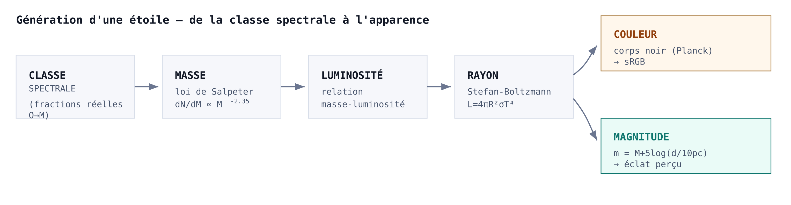


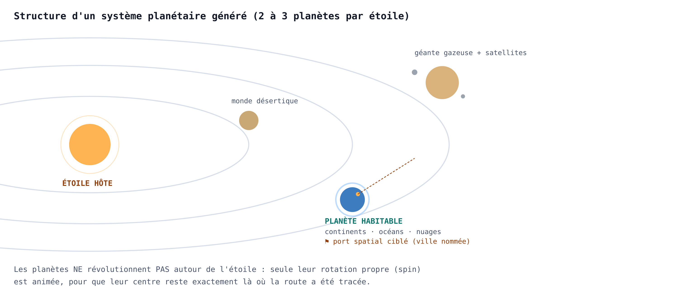
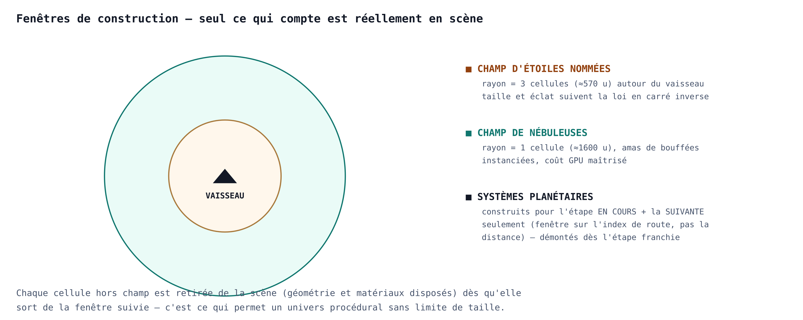


## 10. Internationalisation

Français, anglais, allemand, espagnol — dictionnaire `I18N` couvrant les libellés du HUD, les gabarits de dialogue radio (paramétrés, pas des chaînes figées), et la langue de la synthèse vocale. Choisie une fois sur l'écran-titre, appliquée pour toute la session.

---

# Partie II — Évolutions restant à implémenter

Les chantiers suivants restent au stade de spécification : ils ne sont **pas** présents dans le fichier livré aujourd'hui.

## 11. Mode Pause — ✅ implémenté

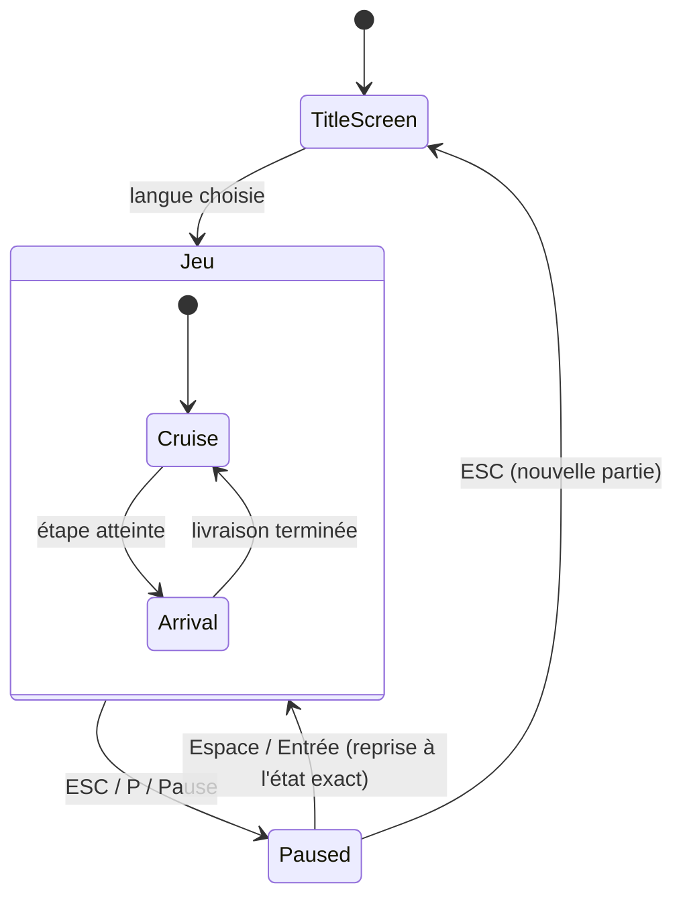
```mermaid
stateDiagram-v2
    [*] --> TitleScreen
    TitleScreen --> Jeu: langue choisie
    state Jeu {
        [*] --> Cruise
        Cruise --> Arrival: étape atteinte
        Arrival --> Cruise: livraison terminée
    }
    Jeu --> Paused: ESC / P / Pause
    Paused --> Jeu: Espace / Entrée (reprise à l'état exact)
    Paused --> TitleScreen: ESC (nouvelle partie)
```

`ÉCHAP`, `P` ou `PAUSE` gèle entièrement la simulation (route, rotation, températures, navettes) et suspend la synthèse vocale sans l'annuler (`speechSynthesis.pause()`, pas `cancel()`). `ESPACE`/`ENTRÉE` reprend exactement où le jeu en était ; `ÉCHAP` depuis la pause renvoie à l'écran-titre.

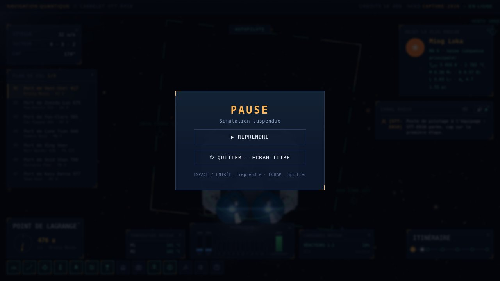

**Écarts par rapport à la version précédente de cette spec :**
- **Pas de renommage** de `ARRIVAL_PAUSE`/`paused` : le risque de confusion signalé était réel mais purement documentaire (portées JS distinctes, aucun conflit effectif) — un nouveau flag au nom sans ambiguïté (`gamePaused`) suffisait, pour un coût et un risque de régression bien moindres qu'un renommage traversant tout le fichier.
- **`ÉCHAP` ne fait plus jamais office d'abrégé de manœuvre** (rôle qu'elle partageait avant avec `ESPACE`/`ENTRÉE`) — retirée de ce rôle pour éliminer tout conflit avec la pause, qui devient sa seule fonction, dans toutes les phases de jeu sans exception.
- **Aucune confirmation avant de quitter** : `ÉCHAP` en pause recharge la page immédiatement (choix délibéré — voir ci-dessous).
- Le retour à l'écran-titre est un **rechargement complet de la page** (`location.reload()`), plutôt qu'une remise à zéro manuelle des dizaines de variables globales interdépendantes (`ROUTE`, `orbitState`, crédits, orientation du vaisseau, niveau d'amélioration des propulseurs…) — garantit un état neuf et une graine neuve (`SEED` dérive de `Date.now()`) sans risque d'en oublier une. Conséquence assumée : le niveau d'amélioration acheté aux services portuaires (§16) repart lui aussi à zéro, cohérent avec « nouvelle partie ».

## 12. Barre de contrôle du HUD — ✅ implémenté

Une barre d'icônes SVG, générée dynamiquement depuis une seule liste (`HUD_BAR_ITEMS`) — bureau et tactile partagent exactement le même mécanisme de bascule, les mêmes icônes et la même logique d'activation, seule la position diffère.

- **Bureau** : fixe en bas à gauche, toujours visible, comme prévu initialement.
- **Tactile** : également en bas, centrée — les commandes de pilotage (joystick, roulis, boost, regard libre) sont décalées plus haut pour lui laisser la place (§15). *Un temps repositionnée en haut par contrainte d'espace, revenue en bas sur demande explicite — cf. §17.3.* Remplace entièrement l'ancien menu ☰ tactile (liste déroulante textuelle), désormais unifié avec cette même barre.
- **12 boutons, pas 8** : les six panneaux d'info, le canal radio, la caméra (`F3` à l'origine) — plus les **services portuaires** (§16, icône grisée/inerte hors de sa fenêtre d'activation), l'**aide** (§17.3), et depuis la v2.4 l'**itinéraire** et le **point de Lagrange** (§21).
- **Raccourcis `F1` à `F9`**, un par bouton dans l'ordre d'affichage, sauf l'aide (`H`), l'itinéraire (`I`) et le point de Lagrange (`L`), qui gardent des touches fixes plutôt qu'un F-slot automatique. Remplace l'ancienne affectation dédiée de `F3` à la caméra (désormais `F9`, comme les autres). Voir §20 pour le détail.
  > **Point d'implémentation (v2.4)** : ces raccourcis F1-F9 sont dispatchés par POSITION dans le tableau `HUD_BAR_ITEMS`, pas en comparant la propriété `hotkey` de chaque entrée — un ajout inséré avant `radio`/`port`/`camera` aurait donc décalé silencieusement F7-F9 vers les mauvaises actions. Les entrées à touche fixe (`H`, puis `I`/`L`) sont pour cette raison toujours ajoutées *après* les neuf premières.
- Mécanisme de visibilité unifié : une seule classe, `.panel-hidden`, ajoutée pour masquer un panneau — fonctionne identiquement au clic, au clavier (`F1`-`F9`) et à la croix de fermeture de chaque panneau (§17.2). En portrait tactile, les six panneaux hors canal radio sont pré-masqués au démarrage (pas la place de tous les garder ouverts en continu) ; en paysage et sur bureau, ils démarrent visibles.

## 13. Événements aléatoires et réparations


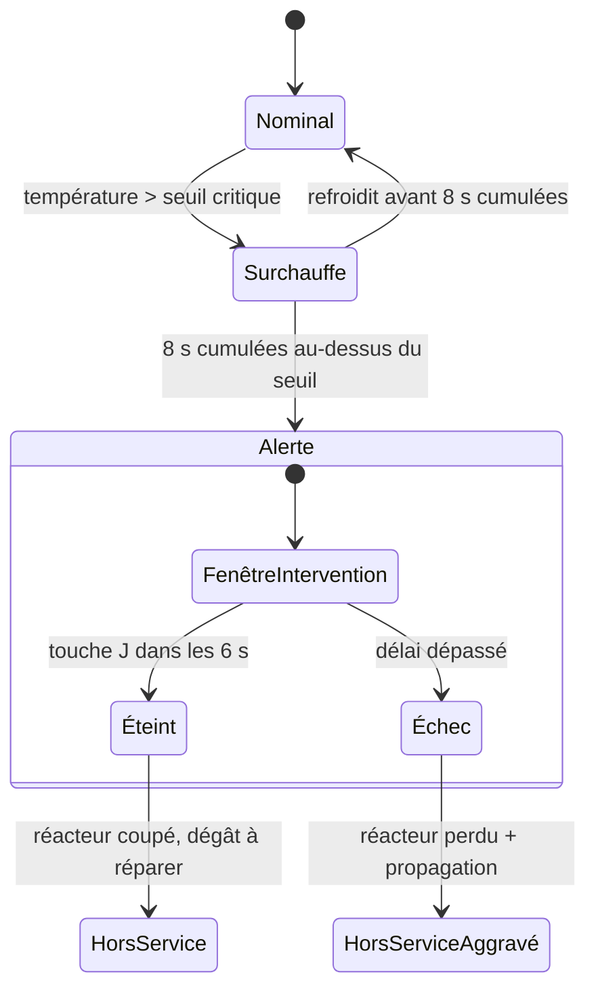
```mermaid
stateDiagram-v2
    [*] --> Nominal
    Nominal --> Surchauffe: température > seuil critique
    Surchauffe --> Nominal: refroidit avant 8 s cumulées
    Surchauffe --> Alerte: 8 s cumulées au-dessus du seuil
    state Alerte {
        [*] --> FenêtreIntervention
        FenêtreIntervention --> Éteint: touche J dans les 6 s
        FenêtreIntervention --> Échec: délai dépassé
    }
    Éteint --> HorsService: réacteur coupé, dégât à réparer
    Échec --> HorsServiceAggravé: réacteur perdu + propagation
```

Trois familles d'incidents partageant un même aval — un dégât à réparer à l'escale suivante :

- **Incendie moteur** (§ ci-dessus) : intervention par la touche `J` (déplacée depuis `I`, prise par l'itinéraire — §20, §21), fenêtre de 6 secondes.
- **Pannes diverses** : radar, propulseurs RCS, autopilote — chacune avec son malus propre en vol.
- **Attaques de pirates** : trois profils de menace (navette, intercepteur, croiseur), dialogue à choix (payer / résister / fuir), bordure colorée selon le type d'événement (ambre = panne, rouge = menace hostile).

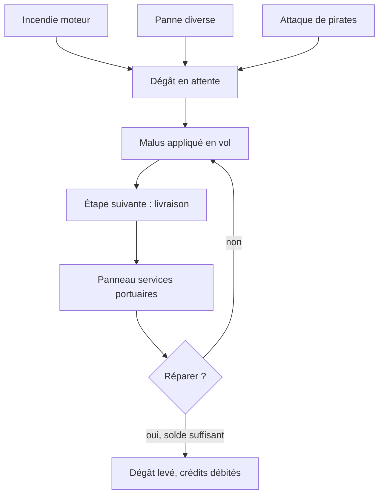
```mermaid
flowchart TD
    F[Incendie moteur] --> D[Dégât en attente]
    P[Panne diverse] --> D
    A[Attaque de pirates] --> D
    D --> M[Malus appliqué en vol]
    M --> N[Étape suivante : livraison]
    N --> S[Panneau services portuaires]
    S --> R{Réparer ?}
    R -->|oui, solde suffisant| Z[Dégât levé, crédits débités]
    R -->|non| M
```

La réparation se propose dans le même panneau « services portuaires » qui gère déjà la dépense de crédits — les deux mécaniques convergent naturellement au même point de la boucle de jeu.

## 14. Dialogues radio générés par IA embarquée (Gemini Nano) — ✅ implémenté

Principe : quand c'est possible, remplacer les dialogues radio générés par gabarits (§7, §13) par une génération dynamique via le LLM embarqué dans Chrome (Gemini Nano, exposé par la *Prompt API*), avec repli automatique et transparent vers le mécanisme existant quand ce LLM n'est pas disponible.

**Ce choix ne trahit pas la philosophie « zéro dépendance externe » du projet** : Gemini Nano tourne **en local dans le navigateur** — aucun appel réseau, aucune clé API, exactement le même principe que `SpeechSynthesis`, déjà utilisé pour la voix (§7). Ce n'est pas un service cloud, c'est une capacité du navigateur.

### 14.1 Détection et repli — implémenté

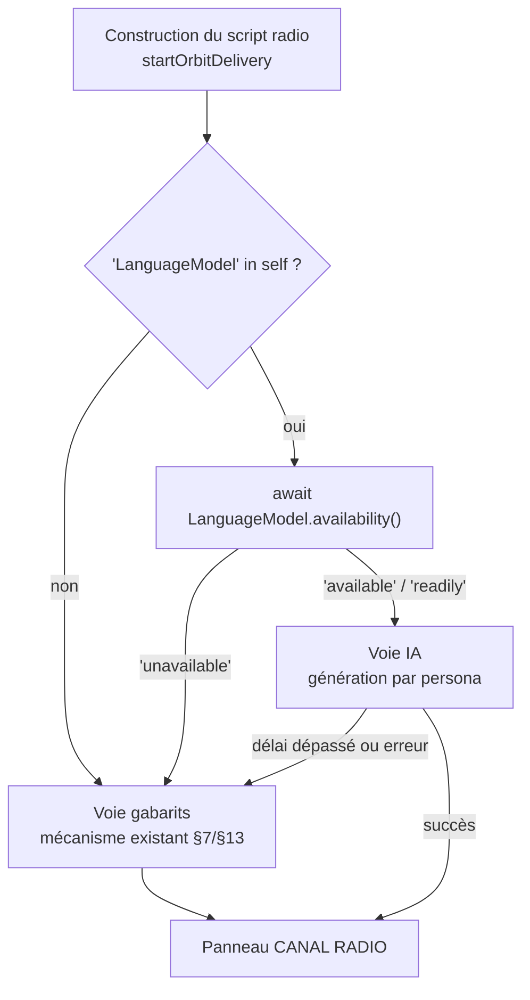
```mermaid
flowchart TD
    A[Construction du script radio<br/>startOrbitDelivery] --> B{"'LanguageModel' in self ?"}
    B -->|non| F[Voie gabarits<br/>mécanisme existant §7/§13]
    B -->|oui| C["await LanguageModel.availability()"]
    C -->|"'unavailable'"| F
    C -->|"'available' / 'readily'"| D[Voie IA<br/>génération par persona]
    D -->|délai dépassé ou erreur| F
    D -->|succès| E[Panneau CANAL RADIO]
    F --> E
```

Écart mineur par rapport à la proposition initiale : la *Prompt API* a changé de nommage entre versions de Chrome (`'readily'/'after-download'/'no'` dans les premières préversions, `'available'/'downloadable'/'downloading'/'unavailable'` ensuite). L'implémentation traite les deux formes comme équivalentes plutôt que de figer un seul nommage, pour rester correcte si l'API évolue encore.

Le texte du gabarit n'est **jamais effacé avant qu'un remplacement confirmé n'arrive** : le script généré par gabarits (§7) reste en mémoire pour chaque réplique et sert directement de repli, sans code de secours séparé à maintenir.

### 14.2 Personæ — une identité par interlocuteur — 2 sur 4 implémentées

Chaque interlocuteur reçoit un profil de personnalité propre (ton, registre de vocabulaire), fourni comme instruction système à sa propre session `LanguageModel` — plutôt qu'un seul modèle générique appelé plusieurs fois.

| Interlocuteur | Registre | État |
|---|---|---|
| Capitaine du cargo | Direct, professionnel, phrases courtes | ✅ implémenté |
| Contrôle du port | Protocolaire, débit posé, formules consacrées | ✅ implémenté |
| Pilotes de navette | Familier, argot de métier, plus bavard | à venir — pas de canal radio dédié aux navettes dans le code actuel |
| *(à venir)* Capitaine pirate | Menaçant ou goguenard selon le profil de menace (§13.3) | à venir — §13.3 non implémenté |

Chaque session est créée une fois puis réutilisée pour toute la partie (pas une session par message) : le profil de personnalité est fixe, seul le contexte transmis dans le prompt utilisateur varie d'un message à l'autre.

### 14.3 Contextes d'usage

| Contexte | État | Section concernée |
|---|---|---|
| Livraison de conteneurs | ✅ implémenté | §7 |
| Pannes et avaries | à venir | §13.1, §13.2 |
| Attaques de pirates | à venir | §13.3 |

### 14.4 Tension avec le déterminisme — tranché : option « accepter l'exception »

Des trois options posées dans la version précédente de ce document, l'implémentation retient la première : **le dialogue reste la seule partie non reproductible de l'univers**, assumé sans conséquence sur le gameplay (décoratif, pas mécanique). Aucun cache par graine n'a été ajouté — ce choix pourra être révisé si un mode « défi seedé » (option 3) voit le jour.

### 14.5 Performance et latence — implémenté, avec une garde supplémentaire

La génération démarre dès la construction du script radio (`startOrbitDelivery`), pour les 12 messages **en parallèle**, bien avant que le premier ne soit dû à l'affichage. Un délai dépassé (2 s, via `Promise.race`) ou une erreur laisse le texte du gabarit en place pour CE message précis, sans abandonner la tentative IA pour les autres messages du même échange.

Ajout non prévu dans la version précédente : un identifiant de génération (`orbitState.radioGen`), incrémenté à chaque nouvelle escale, empêche qu'une réponse tardive d'une escale déjà terminée ou dépassée vienne écraser le script de l'escale en cours — nécessaire dès qu'on enchaîne des livraisons plus vite que les 2 s de délai maximal.

---

## 15. Contrôle tactile pour appareils portables — ✅ implémenté

Le simulateur reposait entièrement sur clavier + souris (§4). Un jeu de contrôles tactiles complet a été ajouté, avec une disposition des panneaux qui s'adapte à un écran plus petit et à son orientation.

### 15.1 Principes directeurs — confirmés à l'implémentation

- Détection par **capacité de pointage** (`matchMedia('(pointer: coarse)')`), pas par taille d'écran — un ordinateur portable dans une petite fenêtre n'active pas les contrôles tactiles.
- Les boutons tactiles pilotent **exactement les mêmes variables** que le clavier (`keys['ArrowUp']`, `keys['KeyE']`, etc.) : aucune logique de vol dupliquée, `updateFlight()` ne voit aucune différence entre les deux moyens de contrôle.
- **Glisser un doigt = regarder autour**, sans modificateur à maintenir — implémenté en distinguant `e.pointerType === 'touch'` dans le gestionnaire de glisser existant, à côté du `CTRL` + souris desktop (inchangé).

### 15.2 Disposition portrait (smartphone) — mise à jour : unifiée avec §12

| Zone tactile | Équivalent clavier/souris | État |
|---|---|---|
| Joystick virtuel (bas gauche) | Flèches / ZQSD — tangage et lacet | ✅ |
| Boutons ⟲ / ⟳ | E / R — roulis | ✅ |
| Bouton BOOST, maintenu | MAJ / ESPACE — propulsion | ✅ |
| Bouton 👁, maintenu | CTRL + glisser — regard libre *(§17.3 : n'est plus automatique)* | ✅ |
| Glisser un doigt sur la vue 3D | Glisser la souris — visée fine → regard libre UNIQUEMENT si 👁 est maintenu | ✅ |
| Barre d'icônes du HUD (bas, centrée) | `F1`-`F9` + `H` — bascule panneaux, radio, services, caméra, aide (§12) | ✅ |

**Superseded** : le menu ☰ (liste déroulante textuelle) et l'icône radio 📻 séparée, décrits dans une version antérieure de cette section, ont été entièrement retirés et remplacés par la barre d'icônes unifiée du §12 — mêmes boutons qu'au bureau, également en bas (cf. §17.3 pour l'aller-retour sur ce choix de position).

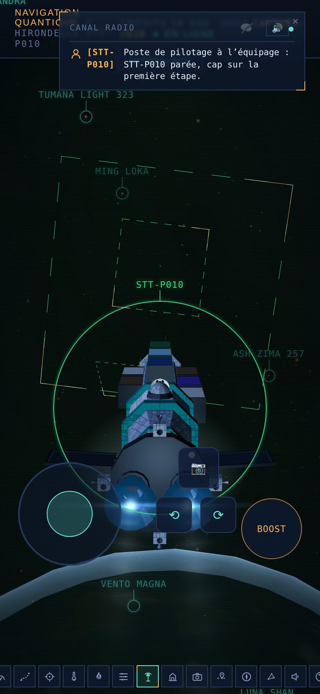

*Capture prise sous émulation d'appareil Chromium (iPhone 13, tactile). On y voit l'ensemble des commandes de vol (joystick, roulis, boost, regard 👁) et la barre d'icônes du HUD tout en bas, ainsi que le message radio de bienvenue et une étiquette de vaisseau avec son anneau de cible.*

### 15.3 Disposition paysage (tablette) — mise à jour : unifiée avec §12

**Superseded** par l'implémentation de la barre de contrôle du HUD (§12) : l'ancien menu ☰ tactile séparé, décrit dans une version antérieure de cette section, a été entièrement retiré et remplacé par la même barre d'icônes SVG que le bureau — mêmes icônes, même logique d'activation. La position a changé deux fois en cours de route (haut, puis de nouveau en bas — §17.3) ; elle reste désormais alignée sur le bureau dans les deux orientations.

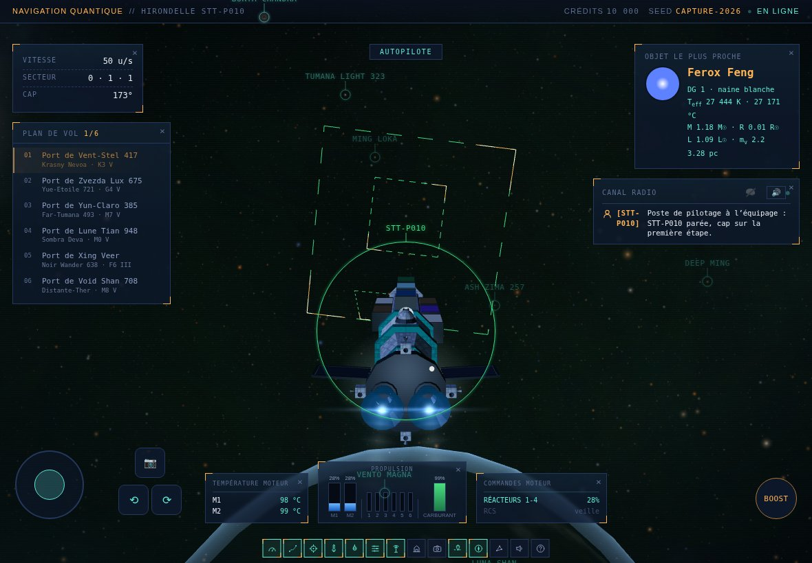

*Capture prise sous émulation d'appareil Chromium (iPad Pro 11", tactile, paysage). Les panneaux d'info restent visibles par défaut dans cette orientation (plus de place qu'en portrait) ; les commandes de vol occupent le bas de l'écran, la barre d'icônes du HUD centrée sous elles.*

### 15.4 Disposition selon l'orientation — implémentée

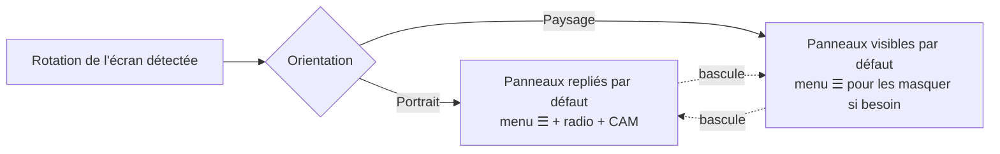
```mermaid
flowchart LR
    A[Rotation de l'écran détectée] --> B{Orientation}
    B -->|Portrait| C[Panneaux repliés par défaut<br/>menu ☰ + radio + CAM]
    B -->|Paysage| D[Panneaux visibles par défaut<br/>menu ☰ pour les masquer si besoin]
    C -.->|bascule| D
    D -.->|bascule| C
```

Recalculée sur `resize` et sur `screen.orientation.change`, sans réinitialiser aucun état de jeu — même principe que le redimensionnement de fenêtre desktop.

### 15.5 Points restant à trancher — état après raffinement (§17.3)

- Mode « une main » (joystick + boost regroupés d'un même côté) : non implémenté.
- ~~Désactivation séparée du glisser-regard~~ : **tranchée** — un bouton dédié (👁), à maintenir enfoncé, conditionne désormais le glisser-regard (§17.3), plutôt qu'un glisser systématique hors des zones de contrôle.
- Gâchette tactile dédiée pour abréger une manœuvre (équivalent ESPACE/ENTRÉE/ÉCHAP) : **volontairement non branchée** sur le bouton BOOST, pour ne pas mélanger propulsion et abrégé de manœuvre sans décision explicite — reste un bouton à ajouter séparément si souhaité.


## 16. Services portuaires — ✅ implémenté

Chantier entièrement absent de la version précédente de cette spec (seul un libellé dans le diagramme du plan d'implémentation, §18). Portée retenue : une **mini-fonction réelle et autonome**, plutôt qu'une coquille vide en attente du système de réparations (§13, toujours non implémenté) — les crédits accumulés n'avaient jusqu'ici aucun débouché.

**Amélioration « Propulseurs »** : jusqu'à 4 niveaux, chacun augmentant la vitesse de croisière effective de 9 % (`effectiveCruiseSpeed() = CRUISE_SPEED_BASE × (1 + niveau × 0,09)`), coût croissant ×1,55 par niveau (départ : 3 200 crédits). Gain permanent, conservé pour toute la partie — remis à zéro uniquement par un retour à l'écran-titre (§11), cohérent avec une nouvelle graine.

> **Deux nouveaux services proposés (v2.5, non implémentés)** : ce panneau est désormais aussi l'endroit naturel pour deux achats supplémentaires, détaillés chacun dans sa propre section — **ravitaillement en carburant** (§22, à la demande, tarifé au volume manquant) et **module de saut quantique** (§23, achat unique). Les trois cohabitent dans le même panneau plutôt que d'en ouvrir un nouveau par fonction.

**Activation conditionnelle** (demande explicite) : l'icône dédiée de la barre du HUD (§12) reste grisée et inerte sauf si l'une des deux conditions suivantes est vraie, réévaluée en continu :
- une livraison est en cours (`orbitState.active`) ;
- le vaisseau se trouve à moins de 4 rayons planétaires d'une planète-port parmi celles actuellement construites (§2, fenêtre `ensureSystemsBuilt`).

Si la fenêtre se referme pendant que le panneau est ouvert (le vaisseau s'est éloigné), il se referme automatiquement plutôt que de laisser un service désormais inaccessible affiché.

**Positionnement** : empilé directement sous le panneau « objet le plus proche », le canal radio (§7) prenant place sous lui — ordre inversé par rapport à un chevauchement constaté en jeu (voir §17.1).

## 17. Corrections et améliorations (raffinement post-Palier 1)

Lot de corrections et d'améliorations remontées après une première passe de jeu sur le Palier 1. Regroupées ici plutôt que dispersées dans chaque section d'origine, pour garder une trace groupée de ce qui a été observé et corrigé.

### 17.1 Bugs corrigés

**Espacement des planètes et de leurs étoiles.** Les systèmes générés paraissaient trop compacts. Espacement élargi : marge minimale planète-planète (`GAP_MIN`) 260→400, plage additionnelle (`GAP_RANGE`) 360→480, croissance orbitale (`ORBIT_GROWTH`) ×1,55→×1,65, première orbite 550-850→780-1160 unités. **Vitesse de croisière augmentée en proportion** (`CRUISE_SPEED_BASE` 42→56, +33 %) pour que le temps de trajet ne s'allonge pas d'autant — l'un ne va pas sans l'autre, cf. l'historique déjà présent dans le code d'un précédent réglage inverse (systèmes resserrés pour éviter des trajets de ~16 minutes). Revalidé par recherche Monte-Carlo (6 itinéraires, graines aléatoires) : marges de sécurité étoile/planète toujours positives, temps de croisière estimé 4 à 9 minutes.

**Planètes invisibles dans le plan de vol.** Cause : `ensureSystemsBuilt()` ne construisait que l'étape courante et la suivante — toute autre planète listée au plan de vol n'avait tout simplement aucun maillage 3D tant qu'on ne l'atteignait pas. Fenêtre élargie à `[index-1, index, index+1, index+2]`.

**Chevauchement Services portuaires / Canal radio.** Deux causes combinées : (1) les deux panneaux n'étaient repositionnés qu'à l'ouverture, jamais quand le contenu de l'un grandissait ensuite (le journal radio, notamment) — chaque fonction de repositionnement redéclenche désormais l'autre ; (2) l'ordre d'empilement est inversé (services d'abord, radio ensuite), demande explicite.

### 17.2 Améliorations de confort

**Croix de fermeture** sur chaque panneau (y compris canal radio, services portuaires et aide) — un seul gestionnaire délégué (`data-panel-cls` sur chaque bouton) plutôt qu'un écouteur dupliqué par panneau.

**Icône caméra dynamique** : trois symboles distincts selon le mode actif (poursuite / plan-séquence / plans lointains), remplaçant un pictogramme générique unique.

**Aide clavier en overlay centré** (touche `H`) : remplace l'ancienne bande fixe en bas d'écran par un panneau centré, même famille visuelle que le mode Pause (coins ambrés, fond assombri). Contenu généré dynamiquement depuis la liste des boutons du HUD (§12), donc toujours synchronisé avec elle.

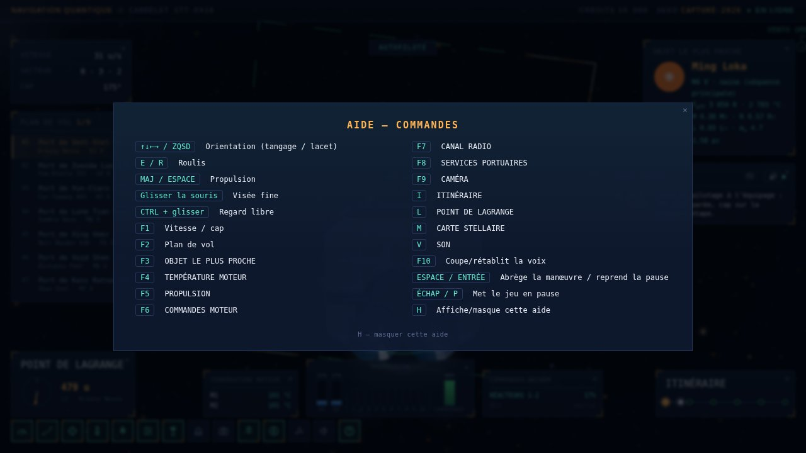

*Un doublon a été repéré directement sur cette capture lors de sa prise (la touche `H` listée deux fois) et corrigé dans la foulée : l'aide s'auto-listait une première fois via la boucle générique des boutons du HUD, puis une seconde fois via sa ligne de description dédiée.*

**Largeur du panneau « Plan de vol »** réduite de 300 à 230px.

**Message radio de bienvenue** : le capitaine salue l'équipage juste après le calcul de la première route, avant toute escale — même panneau et même voix que le reste du canal radio, pas de mécanisme séparé.

**Avatars dans le canal radio** : silhouette de capitaine (ambre) pour l'équipage, antenne de tour (cyan) pour le contrôle au sol, insérées devant chaque ligne du journal.

**Trajectoire de largage des navettes** repensée en trois temps, plutôt qu'un trajet direct dès l'instant zéro :

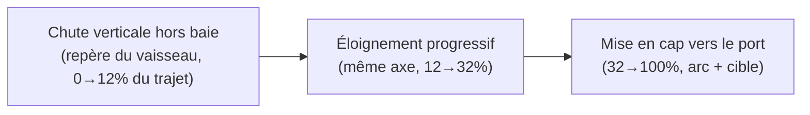
```mermaid
flowchart LR
    A["Chute verticale hors baie<br/>(repère du vaisseau, 0→12% du trajet)"] --> B["Éloignement progressif<br/>(même axe, 12→32%)"]
    B --> C["Mise en cap vers le port<br/>(32→100%, arc + cible)"]
```

Le repère du vaisseau (position/orientation du dock) est réévalué à CHAQUE image durant les deux premières phases : le cargo continue de manœuvrer en orbite pendant toute la séquence, la chute et l'éloignement doivent rester solidaires de sa position réelle, pas d'un instantané figé au largage. Le retour au dock garde le trajet simple d'origine (non concerné par la demande).

**Traînée de propulseur** sur les navettes : polyligne en coordonnées MONDE (ajoutée à la scène, pas au groupe de la navette), fondu obtenu par assombrissement des couleurs en mélange additif plutôt qu'un canal alpha par sommet (non géré simplement par `LineBasicMaterial`).

**Labels + cercle de cible sur les vaisseaux** (cargo et navettes), même vocabulaire visuel que pour étoiles/planètes (cercle + flèche + texte), mais avec une différence de fond : l'anneau est dimensionné **dynamiquement selon la taille apparente à l'écran** (projection du rayon réel via le champ de vision de la caméra), pour réellement entourer l'objet plutôt qu'être une pastille de taille fixe — adapté d'une demande explicite. Troisième teinte (vert) pour les distinguer des étoiles (cyan) et planètes (ambre).

**Rendu d'objet dans le panneau « objet le plus proche »** : une icône canvas 2D (52px), pas un second rendu 3D complet — bien moins coûteux pour une vignette de cette taille. Dégradé teinté par type de planète (palette dédiée par nature : océanique, désertique, glacée, volcanique, continentale, géante gazeuse avec bandes), couleur de corps noir réelle pour les étoiles, dégradé diffus pour les nébuleuses.

### 17.3 Second passage — 4 correctifs supplémentaires

Nouveau lot remonté après une seconde session de jeu sur les livrables ci-dessus.

**Chevauchement des panneaux, cause plus générale que celle déjà corrigée en §17.1.** La colonne de gauche (`hud-left` → `routePanel`) avait, elle, un décalage CSS **fixe** (`top:210px`), jamais recalculé quand `hud-left` change de hauteur réelle (retour à la ligne sur petit écran, panneau masqué via la barre du HUD, changement de langue…) — exactement le même type de défaut que celui déjà réglé pour radio/services, mais resté sur cette colonne. Une fonction unique, `repositionAllPanels()`, regroupe désormais TOUT le repositionnement de la pile de panneaux (mesure du bas réel de chaque ancre, jamais de valeur devinée), appelée à quatre moments : ouverture, bascule d'un panneau (icône, raccourci ou croix de fermeture), redimensionnement de fenêtre, **et** en continu (throttlé à 350ms, dans la boucle de mise à jour du HUD) — ce dernier point pour absorber les variations de hauteur dues au seul contenu (texte de l'objet le plus proche, longueur du plan de vol), qu'aucun événement ponctuel ne capture.

**Bouton de regard tactile rétabli.** Un bouton dédié (icône 👁), à **maintenir enfoncé**, conditionne désormais le glisser-regard sur la vue 3D — équivalent fidèle de CTRL maintenu au clavier, là où un glisser sans modificateur avait cours jusqu'ici (§15.1). Sans le bouton maintenu, un glisser tactile ne fait plus rien : ni pilotage (déjà exclu, le joystick reste la seule commande de vol), ni regard — un glisser accidentel ne peut plus rien déclencher par erreur.

**Barre d'icônes ramenée en bas, y compris au tactile.** Contredit le choix pris en §12/§15.3 (la remonter en haut par contrainte d'espace) — demande explicite de la garder cohérente avec le bureau, quelle que soit la plateforme. Les commandes de pilotage (joystick, roulis, boost, regard) sont décalées plus haut d'une quarantaine de pixels pour lui laisser la place tout en bas, sans se chevaucher.

**Bouton d'aide ajouté à la barre.** Dixième icône (point d'interrogation), ouvrant le même panneau overlay déjà en place (titre + croix de fermeture, §17.2) — jusqu'ici accessible uniquement par la touche `H`, sans bouton pour la découvrir. Cas particulier dans l'affectation automatique des raccourcis : garde `H` plutôt que le `F10` qui lui reviendrait par la logique habituelle (un F par bouton, dans l'ordre), pour ne pas entrer en conflit avec la coupure de voix déjà sur `F10`.

**Robustesse trouvée en testant** (sans lien avec une demande explicite, mais corrigée au passage) : `setPointerCapture()` peut lever une exception dans certains cas limites (pointeur déjà relâché, multi-doigts) — non interceptée, elle interrompait le reste du gestionnaire avant la mise à jour de l'état du bouton. `try/catch` défensif ajouté sur les trois boutons tactiles maintenus (roulis, boost, regard).

## 18. Plan d'implémentation

Le **palier 0** de la spécification précédente (six étapes sans dépendance) et le **palier 1** (mode Pause, barre du HUD, services portuaires) sont désormais **entièrement livrés**, avec en prime un lot de corrections et d'améliorations de confort (§17). Les paliers suivants restent à faire.

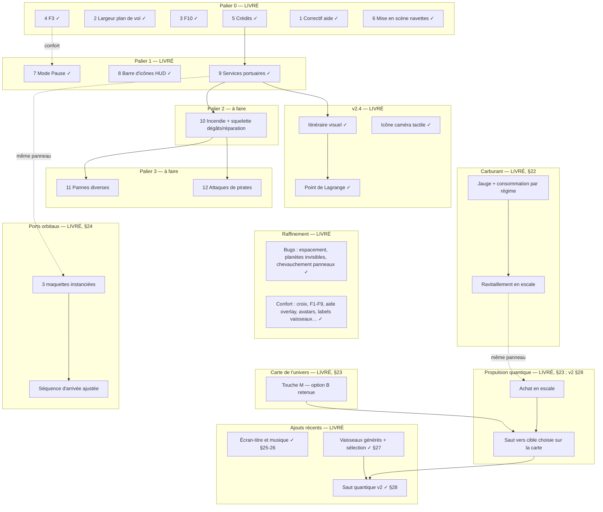
```mermaid
flowchart TD
    subgraph L0["Palier 0 — LIVRÉ"]
        A1[1 Correctif aide ✓]
        A2[2 Largeur plan de vol ✓]
        A3[3 F10 ✓]
        A4[4 F3 ✓]
        A5[5 Crédits ✓]
        A6[6 Mise en scène navettes ✓]
    end
    subgraph L1["Palier 1 — LIVRÉ"]
        B7[7 Mode Pause ✓]
        B8[8 Barre d'icônes HUD ✓]
        B9[9 Services portuaires ✓]
    end
    subgraph L1B["Raffinement — LIVRÉ"]
        R1[Bugs : espacement, planètes invisibles, chevauchement panneaux ✓]
        R2[Confort : croix, F1-F9, aide overlay, avatars, labels vaisseaux… ✓]
    end
    subgraph L1C["v2.4 — LIVRÉ"]
        V1[Icône caméra tactile ✓]
        V2[Itinéraire visuel ✓]
        V3[Point de Lagrange ✓]
    end
    subgraph L2["Palier 2 — à faire"]
        C10[10 Incendie + squelette dégâts/réparation]
    end
    subgraph L3["Palier 3 — à faire"]
        D11[11 Pannes diverses]
        D12[12 Attaques de pirates]
    end
    subgraph LM["Carte de l'univers — LIVRÉ, §23"]
        M[Touche M — option B retenue]
    end
    subgraph LFuel["Carburant — LIVRÉ, §22"]
        F1[Jauge + consommation par régime]
        F2[Ravitaillement en escale]
    end
    subgraph LJump["Propulsion quantique — LIVRÉ, §23 ; v2 §28"]
        J1[Achat en escale]
        J2[Saut vers cible choisie sur la carte]
    end
    subgraph LOrbit["Ports orbitaux — LIVRÉ, §24"]
        O1[3 maquettes instanciées]
        O2[Séquence d'arrivée ajustée]
    end
    subgraph LR2["Ajouts récents — LIVRÉ"]
        W1[Écran-titre et musique ✓ §25-26]
        W2[Vaisseaux générés + sélection ✓ §27]
        W3[Saut quantique v2 ✓ §28]
    end
    W2 --> W3
    J2 --> W3
    O1 --> O2
    A4 -.->|confort| B7
    A5 --> B9
    B9 --> C10
    C10 --> D11
    C10 --> D12
    B9 --> V2
    V2 --> V3
    M --> J2
    F1 --> F2
    F2 -.->|même panneau| J1
    J1 --> J2
    B9 -.->|même panneau| O1
    %% disposition en grille de 4 colonnes (liens invisibles) : lisible sur une page
    L0 ~~~ L2
    L1 ~~~ L3
    L1B ~~~ LM
    L1C ~~~ LFuel
    L2 ~~~ LJump
    L3 ~~~ LOrbit
    LM ~~~ LR2
```

Économie de la boucle de jeu — les crédits ont maintenant un vrai débouché (§16) en plus de la future réparation :

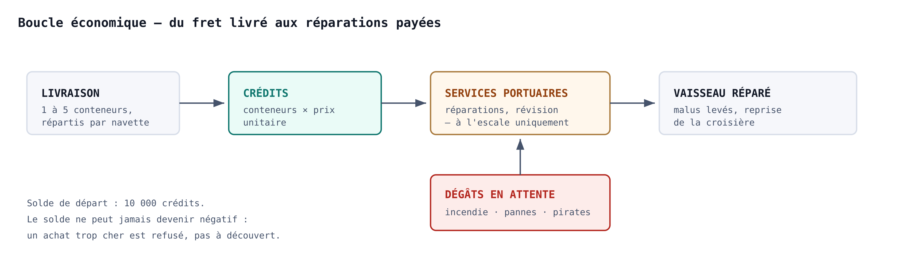

## 19. Carte de l'univers — ✅ implémentée (touche M)

*Proposée en v2.5, implémentée avec la propulsion quantique : c'est la carte stellaire 3D décrite au §23.3, ouverte par `M` (ou `;` sur clavier QWERTY). Les options évaluées à l'époque sont conservées ci-dessous pour mémoire.*

| Option | Effort | Valeur | Détail |
|---|---|---|---|
| **A — Carte 2D schématique, non navigable** | Faible | Moyenne | Projection orthographique du plan de vol connu (étapes visitées + à venir) sur un plan 2D façon plan de métro, système actuel mis en évidence. Aucune interaction au-delà d'afficher/masquer. Rapide à livrer, mais ne montre que ce qui est déjà dans le plan de vol — aucune découverte. |
| **B — Carte 3D navigable, caméra libre** *(retenue — voir décision ci-dessous)* | Moyen | Haute | Vue d'ensemble en 3D (caméra orbitale indépendante de celle du jeu) de tous les systèmes déjà rencontrés/construits, avec zoom/rotation à la souris. Réutilise largement le rendu existant (mêmes maillages d'étoiles simplifiés) plutôt que d'inventer une représentation à part — coût contenu. Donne une vraie impression d'échelle et d'exploration. |
| **C — Carte galactique procédurale complète** | Élevé | Incertaine | Génère et affiche une région bien plus large que ce qui a été réellement visité (au-delà des systèmes construits). Séduisant sur le papier, mais soulève des questions non triviales : jusqu'où générer sans détruire la surprise de la découverte ? Coût de génération à grande échelle non négligeable pour un simple overlay. |

**Décision (v2.5)** : option B, désormais à double usage plutôt que simple consultation — la demande de propulsion quantique (§23) lui donne un second rôle, sélecteur de destination de saut. Le détail de fonctionnement (systèmes affichés, clic pour sélectionner, pause pendant la consultation) est spécifié au §23 plutôt que dupliqué ici, pour ne garder qu'un seul endroit où la carte est décrite dans le détail.

Les trois questions posées lors de la proposition initiale sont donc tranchées au §23 : systèmes affichés (construits **et** à portée de saut, pas seulement le plan de vol), clic pour sélection (désormais indispensable, plus seulement un « nice to have »), et jeu mis en pause pendant la consultation (plutôt qu'un simple overlay à bascule comme l'aide) — un choix de destination mérite qu'on ne dérive pas pendant qu'on hésite.

**Aujourd'hui.** La carte est consultable avec n'importe quel vaisseau. Sur un long-courrier équipé d'un générateur de saut, elle sert aussi à choisir la destination d'un saut quantique ; sur les autres, un encart explique pourquoi le saut n'est pas proposé — « réservé aux long-courriers » ou « module achetable en escale » (§28.1).

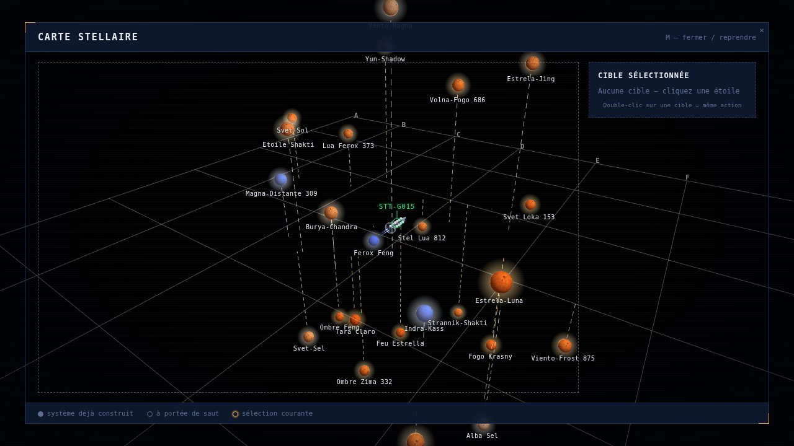

## 20. Référence — tous les raccourcis clavier

| Touche | Action | État |
|---|---|---|
| `↑ ↓ ← →` / `ZQSD` / `WASD` | Orientation | actuel |
| `E` / `R` | Roulis | actuel |
| `MAJ` / `ESPACE` | Propulsion | actuel |
| Glisser la souris | Visée fine | actuel |
| `CTRL` + glisser | Regard libre | actuel |
| `CTRL` (appui court) | Recentre le regard libre | actuel |
| `F1` à `F6` | Bascule chacun des 6 panneaux d'info du HUD | **actuel** |
| `F7` | Affiche/masque le canal radio (remplace `TAB`, conservée en alias) | **actuel** |
| `F8` | Ouvre/ferme les services portuaires (§16) — inerte hors zone/livraison | **actuel** |
| `F9` | Mode de caméra suivant (remplace l'ancien `F3`) | **actuel** |
| `TAB` | Affiche/masque le canal radio (alias historique de `F7`) | actuel |
| `H` | Ouvre/ferme l'aide en overlay centré (§17.2) | **actuel** |
| `I` | Ouvre/ferme le panneau itinéraire (§21) | **actuel (v2.4)** |
| `L` | Ouvre/ferme le panneau point de Lagrange (§21) | **actuel (v2.4)** |
| `F10` | Coupe/rétablit la voix de synthèse | actuel |
| `ESPACE` / `ENTRÉE` | Abrège la manœuvre d'approche · Reprend depuis la pause | **actuel** |
| `ÉCHAP` / `P` / `PAUSE` | Met le jeu en pause (§11) | **actuel** |
| `ÉCHAP` (en pause) | Retour à l'écran-titre, rechargement complet | **actuel** |
| `M` | Carte stellaire / sélection de destination de saut quantique | ✅ implémenté (§19, §23) |
| `J` | Intervenir sur un incendie moteur | à venir (§13) |

> **Conflit de touche résolu (v2.5).** La v2.4 avait relevé une collision : `I` était déjà réservée (§13, jamais implémenté) pour une intervention sur incendie moteur, alors que la même touche venait d'être prise pour l'itinéraire (§21, lui bien implémenté). Résolu en déplaçant la réservation d'incendie moteur sur `J`, libre. `I` reste donc affectée à l'itinéraire sans réserve.

### Touches à sens multiple

| Touche | Sens selon le contexte |
|---|---|
| `ESPACE` | Propulsion (croisière) · Abrégé (approche) · Reprise (pause) |
| `ÉCHAP` | Met en pause · Retour à l'écran-titre (si déjà en pause) — **ne fait plus jamais office d'abrégé**, rôle retiré pour éliminer tout conflit avec la pause |
| `CTRL` | Regard libre si maintenu et glissé · Recentrage si appui court seul |

## 21. Itinéraire visuel et point de Lagrange — ✅ implémenté

Deux nouveaux panneaux HUD, ajoutés en v2.4 avec leurs propres icônes dans la barre du HUD (§12) et des raccourcis à touche fixe plutôt qu'un F-slot automatique (`I` et `L` — voir §20 pour l'arbitrage entre `I` et `J`).

**Icône de regard tactile.** Au passage, le bouton de regard libre tactile (§15) change de pictogramme — une caméra plutôt qu'un œil — sans aucun changement de comportement : il s'agit toujours du même bouton à maintenir pour activer le glisser-regard, équivalent tactile de `CTRL`+souris.

### 21.1 Itinéraire (bas droite)

Un second regard sur la route, complémentaire du plan de vol textuel (§5) : plutôt qu'une liste de noms de ports, une **piste visuelle** avec un point représentant la position réelle du vaisseau sur le trajet.

- Fenêtre glissante de 6 étapes (même logique que le plan de vol, §5) : espacées **régulièrement** sur la piste, pas à l'échelle réelle des distances — deux étoiles peuvent être quasi collées ou aux deux bouts de la carte, un tracé proportionnel rendrait la plupart des étapes illisibles.
- Code couleur à trois valeurs : **bleu** (étape franchie), **ambre** (étape en cours, pastille agrandie), **vert** (étape à venir).
- Le point-vaisseau (blanc, halo lumineux) se déplace en continu entre deux pastilles, interpolé sur l'abscisse curviligne `ROUTE.s` déjà maintenue par le suivi de route — pas de nouveau calcul de fond, juste sa lecture à chaque image (contrairement aux pastilles elles-mêmes, reconstruites seulement quand l'étape change).

### 21.2 Point de Lagrange (bas gauche)

Une boussole donnant un cap à suivre indépendant de la route principale : l'orientation du vaisseau par rapport à un point fixe de l'étape en cours, plus sa distance.

> **Approximation assumée, pas une simulation à N corps.** Le point visé est placé sur l'axe étoile→planète de l'étape en cours, à 92 % de la distance en partant de l'étoile — une position plausible pour un point de type L1, choisie parce que les planètes générées n'ont pas de masse simulée dont tirer un vrai point de libration. Affiché comme repère de navigation secondaire, pas comme donnée scientifique.

- Aiguille rotative (cadran SVG) pointant le relèvement RELATIF du point par rapport au nez du vaisseau (0° = droit devant), recalculée à chaque image à partir du cap du vaisseau et de la direction vers le point — même construction que le cap déjà affiché en haut à gauche (§8), pas un second système de coordonnées.
- Distance au point affichée en unités de jeu (`u`), même convention que le reste du HUD (rayons planétaires, distances stellaires).

### 21.3 Visibilité

Les deux panneaux suivent le mécanisme unifié du §12 (`.panel-hidden`, croix de fermeture, icône de la barre) et démarrent visibles sur bureau comme les six panneaux d'info existants. **Masqués en mode tactile**, quelle que soit l'orientation : leurs emplacements bas-gauche/bas-droite chevauchent exactement le joystick, les boutons de roulis et le bouton BOOST (§15) — l'espace n'existe pas encore pour les intégrer proprement à cette disposition, contrairement aux panneaux d'info qui se replient simplement en portrait sans occuper l'espace des commandes de vol.

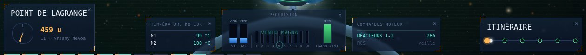

## 22. Carburant et consommation — ✅ implémenté

Implémenté dans `space-travel.html`. Comme les autres chantiers de cette ampleur (§13, §19 en son temps), il avait d'abord fait l'objet d'une proposition détaillée et de maquettes filaires (§22.5) avant d'être construit — les décisions laissées ouvertes à ce stade sont tranchées ci-dessous.

### 22.1 Pourquoi ces chiffres, pas d'autres

Le risque explicitement signalé — laisser le joueur en panne dès la première étape — ne se garde pas en choisissant une réserve « qui semble confortable » : elle se calcule contre les constantes réelles du générateur de routes, déjà en place et vérifiées (§5).

- Un saut entre étoiles-étapes mesure entre `HOP_MIN=700` et `HOP_MAX=1500` unités (`findNextWaypoint`) — soit **1 100 u** en moyenne.
- Une route compte entre 3 et 12 étapes (`legCount = 3 + alea(10)`, `planRoute`) — soit **7,5 étapes** en moyenne.
- Un itinéraire complet représente donc en moyenne 7,5 × 1 100 ≈ **8 250 u**, arrondi à **8 000 u** pour les calculs qui suivent (les trajets intra-système, de l'étoile à la planète cible, restent petits par comparaison — quelques centaines d'unités, §6).

### 22.2 Jauge et consommation

- **Réservoir de départ** : 24 000 u — soit l'équivalent de trois itinéraires complets **en croisière économique**. Rejauge à zéro uniquement par un retour à l'écran-titre (§11), comme les niveaux de propulsion (§16).
- **Consommation liée au régime moteur**, pas à la seule distance parcourue : `conso(u de distance) = distance × (vitesse / effectiveCruiseSpeed())^1,5`. En croisière normale (le ratio vaut 1 par construction — une amélioration « Propulseurs », §16, ne change donc PAS le coût en carburant d'un trajet, seulement sa durée), un itinéraire moyen coûte les 8 000 u de référence. En boost permanent (`BOOST_MULT=3,1`), le ratio monte à 3,1^1,5 ≈ **5,46** — un itinéraire volé intégralement en boost coûterait ≈ 43 700 u, plus que le réservoir plein : délibéré, le boost soutenu doit rester une ressource d'appoint, pas un régime de croisière.
- **D'où le « 1 à 3 itinéraires »** demandé : croisière économique de bout en bout → jusqu'à 3 itinéraires sur la réserve de départ ; usage généreux du boost → bien moins d'un seul. Le curseur est entre les mains du joueur, pas un palier figé.
- **Garde-fou de la toute première étape** : le pire cas isolé — un unique saut à `HOP_MAX=1500` u, parcouru intégralement en boost — coûte ≈ 1 500 × 5,46 ≈ 8 190 u, soit un tiers du réservoir de départ. Même un premier saut malchanceux (le plus long possible) ET piloté sans aucune retenue laisse encore les deux tiers du réservoir intacts.
- **Comportement à sec, tranché à l'implémentation** (non détaillé dans la proposition d'origine) : le vaisseau n'est pas totalement immobilisé à 0 u, ce qui bloquerait la partie sans espoir de rejoindre un port — le boost devient indisponible et la croisière tombe à 20 % de sa vitesse normale (`FUEL_EMPTY_SPEED_SCALE`). De quoi se traîner jusqu'à l'escale la plus proche, pas de quoi continuer à voler normalement.

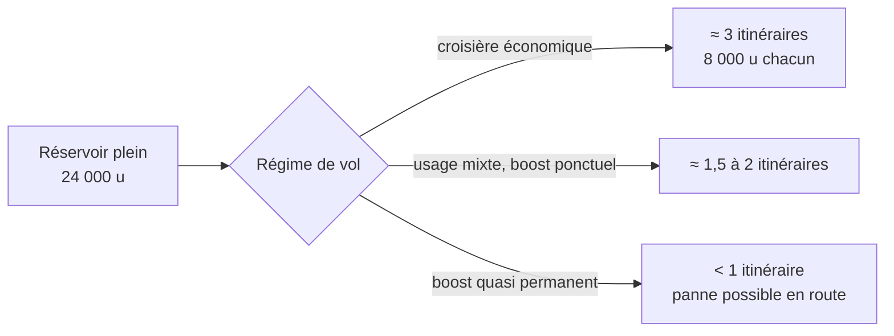
```mermaid
flowchart LR
    A["Réservoir plein<br/>24 000 u"] --> B{Régime de vol}
    B -->|croisière économique| C["≈ 3 itinéraires<br/>8 000 u chacun"]
    B -->|usage mixte, boost ponctuel| D["≈ 1,5 à 2 itinéraires"]
    B -->|boost quasi permanent| E["< 1 itinéraire<br/>panne possible en route"]
```

### 22.3 Ravitaillement en escale

Ajouté au panneau services portuaires (§16), à côté de l'amélioration « Propulseurs » plutôt que dans un panneau séparé :
- Tarif proposé : **0,20 crédit par unité manquante** — un plein complet depuis un réservoir à vide coûterait 4 800 crédits, du même ordre de grandeur que le premier niveau de propulsion (3 200 crédits) plutôt qu'un achat négligeable ou écrasant.
- Facturé uniquement sur le volume réellement manquant (comme on ne paierait pas pour de l'essence déjà dans le réservoir), pas un forfait fixe.
- Mêmes conditions d'activation que le reste du panneau (§16) : à l'arrêt en escale ou pendant une livraison en cours.

### 22.4 Affichage HUD — décision : fusionné avec PROPULSION

Une jauge supplémentaire, dans l'esprit du panneau PROPULSION existant (§8) : barres ou pourcentage, virant à l'ambre sous 25 % puis au rouge sous 10 %. **Décision (option B des maquettes filaires, §22.5)** : fusionnée avec le panneau PROPULSION déjà existant plutôt qu'un panneau à part — cinquième jauge verticale à sa suite, même famille visuelle que les réacteurs M1-M4 (séparateur, piste, remplissage), couleur seule changeant sous les seuils plutôt qu'un nouveau panneau et une nouvelle icône HUD à maintenir pour une information lue au même moment que le régime moteur.

### 22.5 Maquettes filaires

Les deux pistes envisagées avant implémentation, posées côte à côte pour arbitrer avant de coder plutôt qu'après — l'option B (à droite) a été retenue, cf. §22.4.

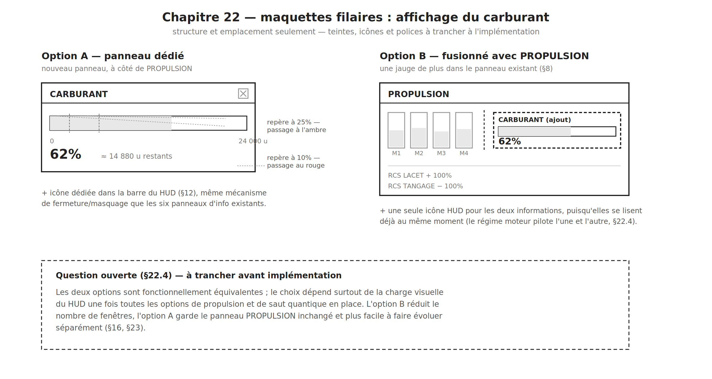

### 22.6 Chevauchement avec le panneau itinéraire — bug trouvé et corrigé

Le panneau services portuaires (§16), désormais plus haut de deux lignes (carburant, en plus des propulseurs), pouvait chevaucher le panneau ITINÉRAIRE (§21) sur une fenêtre basse (repéré à 1024×600, avec services portuaires et canal radio ouverts en même temps) — la vérification de chevauchement déjà en place (`repositionCornerBottomPanels`, §17.3) ne couvrait que la rangée basse centrée, pas cette pile de droite qui peut désormais s'étendre plus loin. Étendu au même mécanisme plutôt qu'une fonction séparée, avec une nuance : rehausser assez pour dégager un obstacle peut, si l'obstacle est lui-même haut sur l'écran, repousser le panneau EN PLEIN DEDANS plutôt que hors de lui — d'où une vérification en boucle courte (jusqu'à 3 passages) qui revérifie la position réelle après chaque ajustement, contre les deux sources de chevauchement à chaque fois, plutôt qu'un calcul unique supposé valable d'un coup. Sur une fenêtre extrêmement basse avec de nombreux panneaux ouverts à la fois, un garde-fou évite en dernier recours de pousser le panneau hors du haut de l'écran, au prix d'un résidu de chevauchement plutôt qu'un panneau à moitié invisible.

## 23. Propulsion quantique et carte stellaire — ✅ implémenté

*Révisé en v2.13 et v2.15 : le saut est réservé aux long-courriers équipés d'un générateur de saut (§28), matériel distinct des anneaux de distorsion de la croisière supraluminique (§29), et son effet visuel a été entièrement refait. Les sous-sections 23.1 (achat en escale) et 23.5 (effet visuel) décrivent l'état antérieur, conservé pour mémoire.*

Implémenté dans `space-travel.html`. Réunit deux demandes qui n'ont de sens que l'une avec l'autre : un module de saut ne sert à rien sans un moyen de choisir sa destination, et la carte de l'univers (§19, proposée puis jamais tranchée) trouve ici sa vraie raison d'être plutôt qu'une simple consultation.

### 23.1 Acquisition

Achat unique en escale (panneau services portuaires, §16), pas un système à paliers comme les propulseurs (§16) — soit le vaisseau dispose du module, soit non. Tarif : **18 000 crédits**, un achat structurant plutôt qu'une amélioration incrémentale, cohérent avec le fait qu'il ouvre une capacité entièrement nouvelle plutôt qu'un simple gain de pourcentage. Une fois acheté, la ligne du panneau passe définitivement sur « ACQUIS » (même famille que « NIVEAU MAXIMAL »/« PLEIN » des deux autres services) — pas de retour en arrière hors nouvelle partie (§11).

### 23.2 Coût en carburant d'un saut

Un saut consomme **exactement le carburant qu'aurait coûté le même trajet en croisière normale** (§22 — `distance × 1`, le régime « croisière » de la formule de consommation), ni plus ni moins. L'intérêt du module n'est donc pas d'économiser du carburant, mais du **temps de vol** — un saut est quasi instantané (§23.4) contre plusieurs minutes de vol simulé.

### 23.3 Carte stellaire (touche `M`) — écarts assumés par rapport à la proposition

Reprend l'esprit de l'option B du §19 (carte 3D navigable, caméra orbitale libre) et tranche ses questions restées ouvertes, avec deux ajustements faits à l'implémentation :

- **Scène dédiée, pas les maillages étoile réels** : la proposition envisageait de réutiliser les maillages déjà en place (shaders + halo additif). En pratique, une **scène Three.js séparée** avec de simples sphères (pleines pour un système déjà construit, en fil de fer sinon) s'est avérée bien moins coûteuse à construire pour ~24 candidats, et plus proche de la maquette filaire (§23.6) qu'un rendu stellaire complet aurait paru chargé à cette échelle. Rendue à la place de la scène de jeu tant que la carte est ouverte (même canevas, pas un second contexte WebGL), via la même bascule que le mode Pause (`gamePaused`).
- **Liste plafonnée aux 24 plus proches** : la portée de saut (§23.4) élargie à 5 cellules de rayon proposerait sinon plusieurs centaines d'étoiles candidates — illisible. Les candidates sont triées par distance réelle et tronquées, pas par la seule grille de cellules.
- **Caméra orbitale à la main** : coordonnées sphériques (glisser = orbite, molette = zoom) autour de la position du vaisseau, sur le même principe que le regard libre (§4) — `THREE.OrbitControls` n'est pas chargé dans ce projet.
- **Systèmes affichés** : ceux déjà construits (§2, `ensureSystemsBuilt`) **et** toute étoile déjà générée à portée de saut (§23.4), pas seulement le plan de vol en cours.
- **Sélection** : clic sur une étoile pour la désigner comme cible (repérage par lancer de rayon), confirmation explicite (bouton ou double-clic) avant de déclencher le saut.
- **Pendant la consultation** : le jeu se **met en pause** (réutilise `gamePaused`/`enterPause()`, avec l'overlay de la carte à la place de celui de pause) — pas un simple overlay à bascule comme l'aide. `M` referme la carte et reprend la simulation ; une touche dédiée plutôt que de surcharger `ÉCHAP`, qui aurait sinon hérité de son comportement « quitte vers l'écran-titre si déjà en pause ».
- **Sans le module acquis** : la carte reste consultable en lecture seule — le bouton de confirmation affiche « MODULE REQUIS » plutôt que de masquer la fonction. Carburant insuffisant pour la cible visée : même traitement, « CARBURANT INSUFFISANT ».
- **Icône dédiée dans la barre du HUD** (en plus de la touche `M`), ajoutée en cours d'implémentation : sans elle, la carte serait restée totalement hors d'atteinte au tactile, faute de clavier.

### 23.4 Portée du saut et régénération

Le saut ne peut viser qu'une étoile **déjà générée** par le champ stellaire par cellules (§2) — calculée directement via `starDataForCell()` (pur calcul déterministe) plutôt que de dépendre des seules étoiles déjà rendues (fenêtre bien plus étroite, §2). Après un saut :
- Le champ stellaire et la nébuleuse se rafraîchissent autour de la nouvelle position (réutilise `refreshField`, déjà en place pour le défilement normal).
- L'itinéraire en cours est **replanifié depuis la nouvelle position** (réutilise `computeRoute`, sans le réalignement du nez sur la courbe réservé au tout premier départ).
- Le point d'arrivée n'est pas le centre de l'étoile ciblée mais un point de sécurité le long de l'axe visé, à distance proportionnelle au rayon stellaire réel (jamais moins de 400 u).

### 23.5 Effet visuel — implémenté en réutilisant l'existant, pas en étirant la géométrie

Le principe reste celui recherché (un effet qui se lit clairement comme un saut, sans nouveau système de rendu coûteux), mais l'implémentation simplifie franchement la phase centrale par rapport à l'idée initiale :

1. **Charge (≈0,4 s)** : les quatre réacteurs (`M1`-`M4`) dépassent leur intensité lumineuse normale, un halo cyan pulsé (nouvel élément `.jump-vignette`) grandit autour de l'écran.
2. **Saut (≈0,5 s)** : plutôt qu'étirer individuellement chaque étoile du champ le long de l'axe caméra→étoile (coûteux à mettre en œuvre proprement), l'effet réutilise directement `.speedlines` — le halo radial déjà en place pour le boost (§4) — poussé à une opacité bien plus élevée. Le résultat visuel (traits radiaux façon vitesse lumière) reste fidèle à l'intention, pour un coût d'implémentation sans commune mesure. La téléportation effective (position, carburant, régénération du champ, replanification de route) a lieu au milieu de cette phase, masquée par l'intensité de l'effet.
3. **Sortie (≈0,15 s)** : un flash blanc bref (nouvel élément `.jump-flash`, opacité 0→1→0) marque l'arrivée. Caméra fixe pendant toute la séquence : la mise à jour du pilotage normal (`updateFlight`) est entièrement court-circuitée tant que le saut est en cours, non interruptible comme la mise en orbite.
4. Bandeau HUD « SAUT QUANTIQUE EN COURS » pendant la séquence, sur son propre élément (`#jumpBanner`) plutôt que le badge de mode existant, réécrit en continu par la logique de vol normale.

### 23.6 Deux bugs trouvés et corrigés pendant l'implémentation

- **Commentaire HTML mal refermé** : un commentaire de code s'est retrouvé clos par `*/` (syntaxe JS/CSS) au lieu de `-->` — le navigateur a alors traité tout le contenu jusqu'au prochain vrai `-->` comme du commentaire, faisant purement et simplement disparaître le panneau de la carte du DOM (présent dans le code source, introuvable via `getElementById`). Repéré en comparant les deux symptômes en apparence contradictoires (la chaîne de caractères présente dans `innerHTML`, l'élément absent pour `getElementById`) plutôt qu'en supposant un problème côté script.
- **Overlay imbriqué au mauvais endroit** : la carte et la bannière de saut avaient d'abord été placées à l'intérieur du conteneur `#hud` général. Une fois la règle ajoutée pour masquer ce conteneur pendant que la carte est ouverte (afin de dégager l'écran des anciens panneaux, figés puisque leur boucle de rafraîchissement s'arrête avec le reste du jeu), cette même règle masquait aussi la carte elle-même, qui en était un descendant. Corrigé en sortant ces éléments de `#hud`, comme `#pauseOverlay` le fait déjà.

### 23.7 Maquette filaire de la carte (référence historique)

Maquette produite avant l'implémentation, pour arbitrer la structure générale — le rendu réel (§23.3) simplifie certains choix (sphères plutôt que maillages complets), pour les raisons expliquées plus haut.

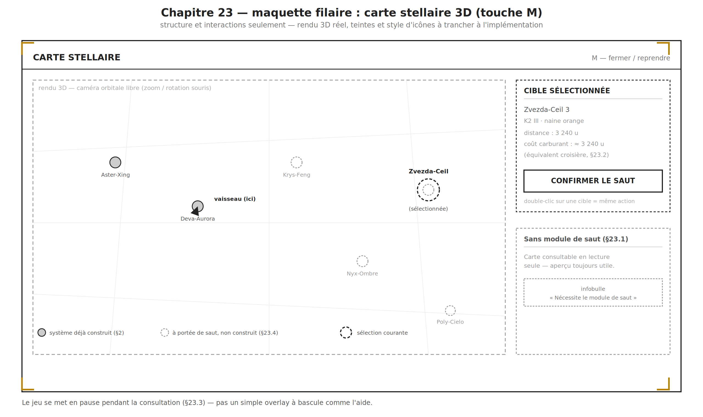

## 24. Ports orbitaux

Proposition, non implémentée. Second type de port, en complément — pas en remplacement — du port au sol déjà existant (§6, §7) : certains ports flottent en orbite d'une planète plutôt que d'être posés dessus.

### 24.1 Pourquoi un second type

Au-delà de la variété visuelle, un cas concret que le système actuel ne couvre pas proprement : une **géante gazeuse** (une des six natures de planète, §6) n'a par définition aucune surface solide où poser un port. Si une géante gazeuse est un jour choisie comme planète cible d'une étape, le port orbital n'est pas une option parmi d'autres mais la **seule** cohérente — un angle mort implicite du système actuel que ce chantier referme au passage.

### 24.2 Génération : un nombre restreint de maquettes, instanciées

Plutôt qu'un modèle 3D généré à la volée par port (coûteux, et peu de raisons de faire varier une station à l'infini comme on le fait pour un système planétaire) : un **petit catalogue de maquettes fixes** — proposition de départ, trois modèles —, choisies et positionnées à la génération du système comme le reste (§2), puis **instanciées** (même maillage de base réutilisé, seule la transformation change) partout où elles apparaissent, dans l'esprit déjà en place pour les astéroïdes ou les champs stellaires.

| Modèle | Silhouette | Ports concernés |
|---|---|---|
| **Anneau simple** | Un anneau ouvert, quai unique en son centre | Petites escales, systèmes secondaires |
| **Hub à bras multiples** | Noyau central, 3-4 bras d'amarrage rayonnants | Ports principaux, systèmes fréquentés |
| **Tour d'amarrage verticale** | Structure allongée le long de l'axe orbital | Géantes gazeuses (§24.1) — profil pensé pour une orbite basse rapide |

- **Quels systèmes en reçoivent un** : tirage pondéré par graine (déterministe, comme le reste de la génération, §2) — proposition de départ, environ un tiers des systèmes, et **systématique** pour toute géante gazeuse choisie comme cible (§24.1), qui n'a pas d'alternative.
- **Échelle** : chaque maquette proportionnée à la planète qu'elle orbite (rayon de la planète, déjà disponible au moment de la génération du système), pas une taille fixe qui paraîtrait tantôt minuscule tantôt écrasante.

### 24.3 Séquence d'arrivée : un ajustement, pas une refonte

Le système d'orbite existant (§7 — mise en orbite, cercle d'orbite autour de la cible) colle déjà bien au principe d'un port orbital : la station occupe simplement un point fixe sur ce cercle, plutôt que le centre de la planète. Changements concrets :
- Le port lui-même remplace le point de livraison au sol comme cible visuelle de la mise en orbite.
- Les navettes (§7) rejoignent la station directement — trajet plus court et plus simple qu'une approche de surface, pas de phase de descente à mettre en scène.
- Le dialogue radio (§7, §14) s'adresse à la station plutôt qu'« au sol » — un ajustement de gabarit de texte, pas une nouvelle mécanique de dialogue.

*Pas de capture pour cette section : comme les événements aléatoires (§13), un chantier encore au stade de proposition — une illustration viendra avec les trois maquettes une fois construites, pas avant.*

## 25. Écran-titre : navigation clavier et travelling de fond — ✅ implémenté

### 25.1 Navigation clavier

En plus du clic/tactile déjà en place (les boutons de langue sont de vrais éléments `<button>`, tactiles par nature) : les flèches gauche/droite (haut/bas acceptées aussi, par tolérance) déplacent le focus entre les quatre langues, ENTRÉE ou ESPACE valide le choix focalisé — jamais un chemin séparé du clic, une même fonction (`selectLanguageAndStart`) gère les deux. Focus visuel dédié (bordure ambrée), distinct du survol (bordure cyan).

### 25.2 Travelling de fond

Une succession de plans très lents à travers l'univers déjà généré — étoile, planète ou nébuleuse choisie au hasard toutes les 14 à 24 secondes, la caméra y dérivant sur plusieurs secondes plutôt que d'y sauter d'un coup. HUD et étiquettes de ciblage masqués pendant tout l'écran-titre (`body.title-active`), pour ne laisser que l'espace à l'écran — **le vaisseau et le tracé de sa route (`ROUTE.gates`) également** (`.visible = false` sur les deux, restauré dès la partie réellement démarrée) : la calcul de route est avancé au démarrage (paragraphe suivant), mais ce que ce calcul produit n'a pas sa place dans un plan qui montre l'univers généré, pas encore le cargo ni son itinéraire.

Condition pratique : le monde doit exister avant qu'il y ait quoi que ce soit à survoler. Le calcul de route (`computeRoute`, §5) et le premier remplissage du champ stellaire/nébuleuses (`refreshField`, §2) — jusqu'ici différés au lancement effectif de la partie — sont donc avancés au moment où le générique cède la place à l'écran-titre. Sans effet de bord : ce calcul ne dépend que de la position/cap de départ du vaisseau, jamais du choix de langue, et `ensureSystemsBuilt()` (appelé en fin de `computeRoute`) construit au passage le premier système planétaire — sans ce déplacement, aucune planète n'existerait encore à cet instant pour le travelling.

**Jamais de travelling ARRIÈRE (demande explicite).** Chaque nouveau plan choisissait au départ une direction d'approche totalement aléatoire autour de sa cible, sans lien avec la position actuelle de la caméra — ce qui pouvait très bien la placer derrière son sens de déplacement en cours, obligeant le plan suivant à reculer pour l'atteindre. Corrigé en approchant TOUJOURS la nouvelle cible depuis la position actuelle de la caméra, le long de la droite qui les relie, en s'arrêtant à distance de champ avant de l'atteindre : la caméra n'avance donc jamais que vers l'avant. Vérifié sur huit changements de plan consécutifs : alignement parfait entre le mouvement et la direction vers la nouvelle cible à chaque fois.

### 25.3 Trois bugs trouvés en implémentant

- **Étoiles invisibles à distance de cadrage** : dans ce jeu, une étoile est modélisée à une échelle physique minuscule (quelques dixièmes d'unité) — sa taille apparente ne vient que d'un calcul d'angle (`baseCore×26/distance`) exécuté à chaque image de vol normal, jamais dans la nouvelle branche « écran-titre ». Corrigé en reprenant ce calcul (distance à la CAMÉRA cinématique, pas au vaisseau, puisque le vaisseau ne vole pas encore).
- **Distance de cadrage des étoiles mal calibrée** : même une fois ce calcul repris, le premier essai (une distance proportionnelle au halo, plusieurs centaines d'unités) rendait l'étoile de toute façon sub-pixel — l'angle calculé plafonnait à son minimum. Le calcul d'angle n'est pensé que pour un survol RAPPROCHÉ (quelques unités à quelques dizaines, jamais plus) : corrigé en calant la distance de cadrage sur `baseCore×8,7` (angle visé ≈ 3) plutôt que sur la taille du halo.
- **Fond d'écran-titre resté noir malgré un rendu correct** : une fois les deux points ci-dessus corrigés, l'écran restait pourtant noir. Cause, repérée en lisant directement les pixels du tampon WebGL (28 % de pixels lumineux alors que la capture semblait uniformément noire) : `#titleScreen` avait un fond opaque plein écran (`background:var(--bg)`), masquant entièrement le canevas 3D en dessous — exactement le même défaut que celui déjà rencontré et corrigé sur la carte stellaire (§23.6). Corrigé en rendant ce fond transparent, avec un voile doux et des ombres portées derrière le texte pour rester lisible par-dessus un arrière-plan désormais visible et changeant.

### 25.4 Corrections et ajouts de la v2.12

- **Étoiles de fond trop rapides, passant devant les objets.** Le fond d'étoiles décoratif (plusieurs couches de points lointains) n'était recentré que sur la position du *vaisseau*, immobile pendant l'écran-titre, alors que la caméra du travelling parcourt des centaines d'unités : resté fixe, ce fond se faisait traverser au lieu de rester à distance infinie apparente. Corrigé en le recentrant sur la *caméra* pendant le travelling, avec en renfort un ordre de rendu très bas qui garantit ces couches derrière tout le reste.
- **Mention légale.** Ligne « (c) 2026 - game by Frédéric Delorme - music by ScoreStudio from Envato » en bas de l'écran-titre, blanc sur fond transparent, discrète et non cliquable.
- **Musique dès l'affichage de l'écran-titre**, et non plus seulement au clic qui ferme le générique (cf. §26.1) — y compris quand le générique se termine seul. Limite inhérente aux navigateurs : sans geste préalable de l'utilisateur, la lecture est refusée ; ce refus est absorbé silencieusement et la musique démarre au geste suivant.


## 26. Musique de fond et réglage des volumes — ✅ implémenté

### 26.1 Musique

Lecture d'un morceau libre de droit, en boucle, via `Audio()` plutôt qu'un `<audio>` HTML (rien à afficher, juste à piloter par script). Livré **à part** — pas embarqué en base64 dans le fichier principal, comme le reste des ressources générées : le fichier musique est un simple asset externe, sans raison d'alourdir le fichier de jeu. Chargé depuis un dossier `musics/` à côté du fichier HTML.

**Point technique — politique autoplay des navigateurs.** Un navigateur refuse de démarrer un son avant un geste utilisateur explicite. Le déclenchement se fait donc sur le clic qui referme le générique (§11) — le premier vrai geste de toute la session — plutôt que d'attendre un moment plus tardif où il faudrait, de toute façon, encore un geste dédié. Un refus éventuel du navigateur (`play()` rejetée) est absorbé silencieusement : la musique est un agrément, jamais une fonction dont l'absence doit remonter comme une erreur.

*Révisé en v2.12 : la lecture démarre dès l'affichage de l'écran-titre (§25.4).*

### 26.2 Réglage des volumes

Nouveau petit dialogue (touche `V`, ou icône dédiée dans la barre du HUD, §12) avec deux curseurs indépendants — musique et voix de synthèse (§14) — plutôt qu'un simple interrupteur muet/actif comme l'ancien raccourci `F10` (conservé tel quel, il agit toujours sur le même état). Le volume de la voix, jusqu'ici une valeur fixe (`0,85`) codée en dur dans la construction de chaque énoncé, devient un réglage persistant pour toute la session — un seul et même point de vérité, lu à chaque nouvel énoncé plutôt que figé à la création du dialogue.

Simple overlay à bascule (comme l'aide, §17.2), pas une consultation qui met le jeu en pause comme la carte stellaire (§23) : ajuster un volume ne justifie pas de geler le vol en cours.

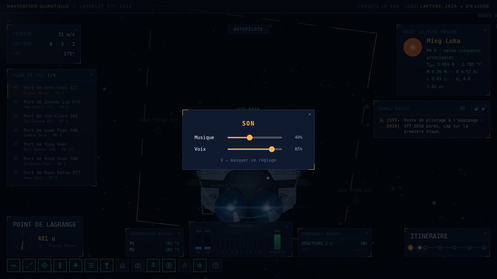

## 27. Vaisseaux générés et écran de sélection — ✅ implémenté

Jusqu'à la v2.12, le jeu n'avait qu'un vaisseau, dessiné une fois pour toutes. La v2.13 intègre le générateur mis au point dans l'étude séparée « Construction générative des vaisseaux cargo » : le joueur choisit son vaisseau au lancement, et ce choix se voit — silhouette, taille, propulsion, capacité de saut.

### 27.1 Dix modèles

| Modèle | Type | Palier | Longueur | Tuyères Epstein | Options (long-courriers) |
|---|---|---|---|---|---|
| Mistral | Pousseur léger | I | 61 m | 2 | — |
| Vagabonde | Cargo léger rapide | II | 71 m | 3 | — |
| Sirocco | Pousseur moyen | II | 89 m | 3 | — |
| Carrelet | Cargo-entrepôt | II | 96 m | 2 | — |
| Hirondelle | Cargo-poutre | II | 110 m | 2 | — |
| Tramontane | Pousseur lourd | III | 120 m | 4 | — |
| Basalte | Cargo-entrepôt (vraquier) | IV | 120 m | 6 | supraluminique ×8, saut |
| Belle-Étoile | Paquebot | III | 140 m | 5 | supraluminique ×10, saut |
| Banquise | Citernier à glace | IV | 181 m | 4 | supraluminique ×5, saut |
| Longue-Échine | Cargo-poutre long | III | 237 m | 4 | supraluminique ×10, saut |

Longueurs mesurées sur les maquettes. Tous les modèles partagent les mêmes briques — proue, habitat modulaire, section moteur — construites en chaîne ; formes, règles de dimensionnement et shader du moteur Epstein sont décrits dans l'étude.

### 27.2 Écran de sélection (dialogue provisoire)

Il s'intercale entre le choix de la langue et le début de la partie ; le travelling de l'écran-titre continue en fond, vaisseau et HUD restent masqués jusqu'au choix. Provisoire par construction : il sera remplacé par la boutique du chantier naval, ce que rappelle une note en tête du dialogue.

- **À gauche**, un carrousel : aperçu 3D en rotation lente, flèches précédent / suivant et bande de vignettes classées **du plus petit au plus grand** — longueur mesurée sur chaque modèle au premier affichage, pas une liste figée.
- **À droite**, la fiche : nom, type, palier, immatriculation ; longueur, largeur, hauteur ; masses à vide et en charge ; conteneurs ou réservoirs ; passagers et équipage ; propulsion ; saut quantique (disponible ou non) ; défense ; radiateurs.
- **Système de propulsion** : « Epstein + » deux interrupteurs cumulables, **Supraluminique ×N** (anneaux de distorsion, §29) et **Saut quantique** (générateur de saut, §28), tous deux actifs par défaut sur les long-courriers ; aperçu 3D, dimensions, masses et lignes « Supraluminique » et « Saut quantique » suivent le choix. Sur les autres vaisseaux, les deux options sont grisées, avec la mention « Supraluminique et saut quantique réservés aux long-courriers ».
- **Clavier** : ← → pour changer de vaisseau, ↑ ↓ pour faire défiler les quatre combinaisons de propulsion, Entrée pour embarquer. Libellés dans les quatre langues du jeu.
- **Aperçu** : moteur de rendu dédié, avec les mêmes réglages de couleur que le jeu (sRGB, tonemapping ACES), libéré à la fermeture du dialogue.

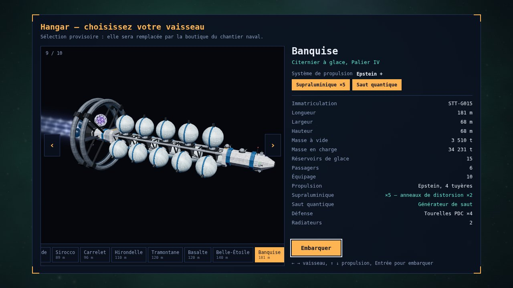

### 27.3 Raccordement aux systèmes existants

Le générateur vit dans son propre espace de noms (`SHIPGEN`) et ne partage rien par accident avec le reste du jeu. Une seule fonction, `installShip()`, branche le modèle choisi sur tout ce qui dépendait de l'ancien vaisseau :

| Système | Adaptation |
|---|---|
| Taille en jeu | longueur ramenée à `40 × (L/89)^0,55` unités, de ~35 u (Mistral) à ~70 u (Longue-Échine) — l'ancien vaisseau en faisait 40 : les gabarits se distinguent sans que la caméra entre dans les plus gros |
| Caméra de poursuite, évitement, étiquettes | décalage de caméra et rayons proportionnels à cette taille |
| Jauges moteur et températures | panneau reconstruit au nombre réel de tuyères (1 à 6) ; les températures, jusque-là prévues pour 4 réacteurs, suivent |
| Tuyères RCS | un jet par bloc RCS du modèle, son axe (lacet, tangage, roulis) déduit de sa position ; l'animation existante les pilote sans modification |
| Feux et balises | matériaux partagés, clignotement existant inchangé ; les feux des antennes rejoignent les balises |
| Dock et bras des navettes | code d'origine rendu paramétrable, posé sous le module d'habitation (sous la cloison arrière pour le cargo-entrepôt), à l'échelle du jeu et non à celle de la coque |
| Moteur Epstein | intensité pilotée par la poussée réelle du vol, boost compris ; halo à l'échelle du vaisseau |
| Options de propulsion | anneaux de distorsion → croisière supraluminique (§29) ; générateur de saut → saut quantique (§28). Posés indépendamment ; le générateur peut être ajouté en escale sans reconstruire le dock |
| Couleurs | matériaux et textures convertis pour le rendu sRGB + ACES du jeu, sans quoi les coques paraîtraient délavées |
| HUD | nom et immatriculation du vaisseau choisi |

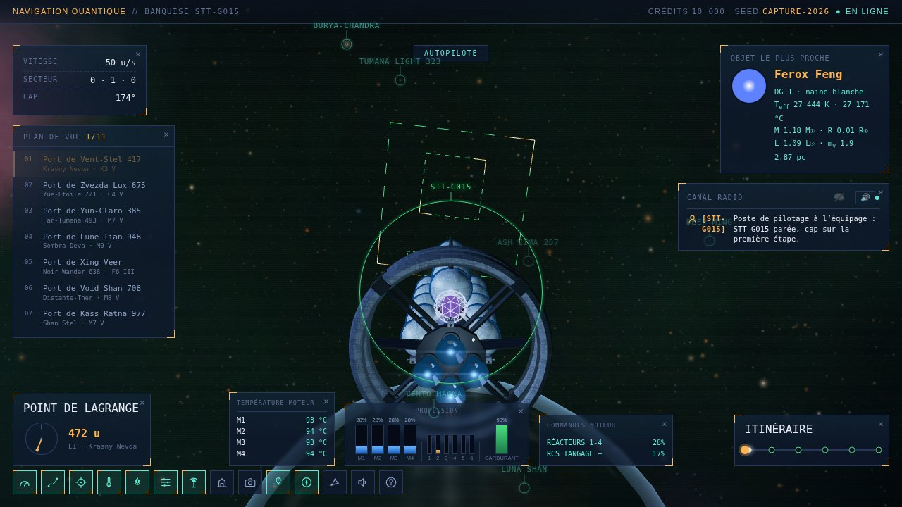

### 27.4 Masses et capacités

Ordres de grandeur, à caler lorsque la boutique fixera les prix : masse à vide ≈ 0,35 × L × √(l × h) tonnes, +6 % par anneau de distorsion, +4 % pour le générateur de saut ; facteur supraluminique = 12 − 1,4 × log₂(masse en charge hors options / 1 000 t), borné entre 5 et 10 (§29.1) ; conteneur chargé : 24 t ; réservoir de glace : ≈ 2 000 t ; deux passagers par cabine ; équipage selon le palier (2, 4, 6 ou 10).

### 27.5 Points d'attention relevés en implémentant

- **Ordre d'initialisation.** Plusieurs réglages dépendant du vaisseau étaient des constantes déclarées plus loin dans le script : l'installation du vaisseau par défaut a été placée en fin de script, une fois tout déclaré.
- **Touche Entrée avalée.** À l'ouverture du dialogue, le focus clavier restait sur le bouton de langue de l'écran-titre, et Entrée était ignorée. Le dialogue reprend désormais le focus et consomme les touches qu'il traite — sans quoi Entrée pouvait aussi relancer l'écran-titre pendant son fondu.
- **Vérifié** : installation de chaque type de vaisseau, sélection au clavier, absence d'erreur, dans la version lisible comme dans la version obfusquée.

## 28. Saut quantique v2 : déformation de l'espace-temps — ✅ implémenté

### 28.1 Générateur de saut, réservé aux long-courriers

Le saut repose sur un **générateur de saut** — un cœur lumineux dans une cage icosaédrique, sur un pylône dorsal au milieu du réacteur —, matériel distinct des anneaux de distorsion de la croisière supraluminique (§29). Seuls les long-courriers (Basalte, Longue-Échine, Banquise, Belle-Étoile) peuvent l'embarquer : choisi à l'écran de sélection (§27.2), ou acheté plus tard en escale (18 000 crédits, §23.1) — seule la coque est alors remontée, sans toucher au dock, au bras de chargement ni à une navette en cours d'opération. Pour les autres vaisseaux, la carte stellaire affiche « Saut impossible : réservé aux long-courriers équipés d'un générateur de saut », la ligne du port « Réservé aux long-courriers ».

Le saut **téléporte** le vaisseau vers une autre région de la carte, choisie sur la carte stellaire (§19, §23) — là où la supraluminique accélère la croisière sur la route en cours.

### 28.2 Séquence (4,4 s, non interruptible)

| Phase | Durée | Ce qu'on voit |
|---|---|---|
| Charge | 1,8 s | moteurs coupés, le générateur monte en puissance (cœur et halo de plus en plus vifs), premières ondulations de l'espace |
| Pli | 1,0 s | l'espace se creuse autour du vaisseau comme sous une lentille gravitationnelle — irisation, anneau lumineux —, le vaisseau s'étire sur son axe |
| Saut | 0,3 s | éclair ; téléportation au milieu de la phase |
| Onde | 1,3 s | à l'arrivée, l'espace se relâche, une onde de choc traverse l'image, les moteurs reprennent |

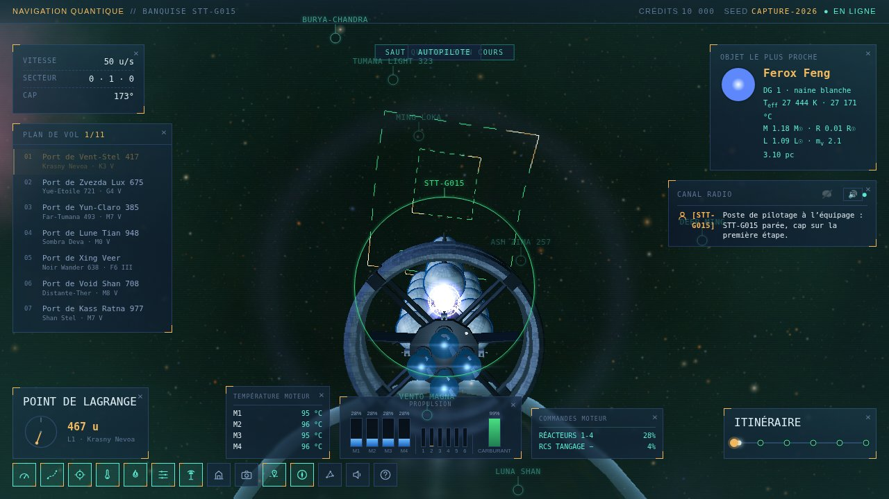

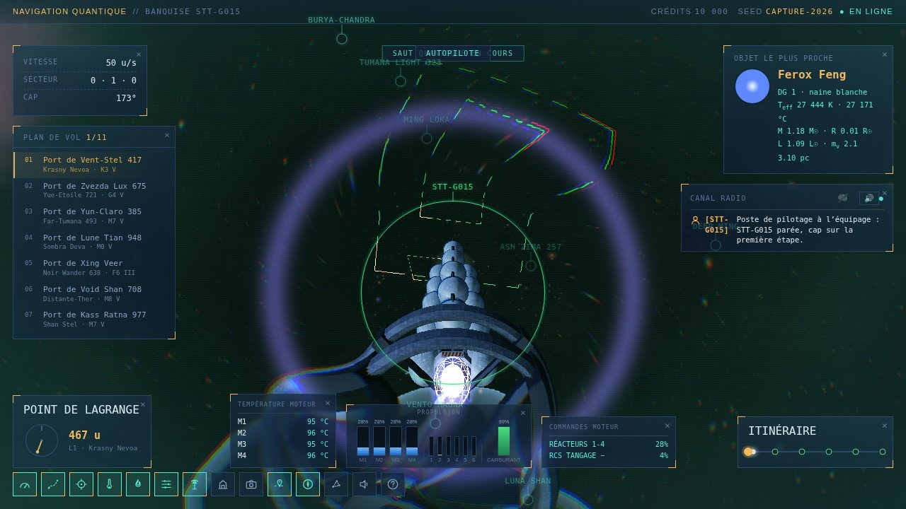

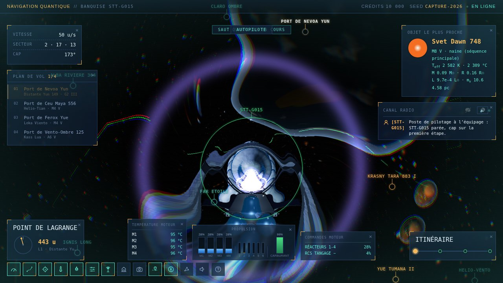

### 28.3 Technique

Pendant la seule durée du saut, la scène est rendue dans une texture, puis déviée en plein écran par un shader : lentille en 1/r, léger tourbillon, irisation, anneau lumineux, onde de choc. La zone du vaisseau est exclue de la déviation — c'est l'espace qui se plie autour de lui, pas la maquette. Hors saut, le jeu fait un seul rendu, comme avant : aucun surcoût. Le bandeau, le voile et l'éclair de la v2.6 sont conservés.

### 28.4 Risques et limites

- Le rendu intermédiaire ne bénéficie pas de l'anticrénelage : bords un peu plus durs pendant 4,4 s, jugé acceptable.
- La fluidité réelle reste à confirmer sur machine : l'environnement de test, en rendu logiciel, est trop lent pour la juger. La chronologie complète a en revanche été vérifiée pas à pas (téléportation, retour à l'état normal).
- Coût : une passe plein écran supplémentaire, bornée à la durée du saut.

## 29. Propulsion supraluminique — ✅ implémentée

Seconde option des long-courriers, distincte du saut : pas de téléportation, mais une **croisière multipliée par 5 à 10** sur la route en cours.

| | Supraluminique | Saut quantique (§28) |
|---|---|---|
| Matériel | deux anneaux de distorsion et leur bulle | générateur de saut |
| Effet | vitesse de croisière ×5 à ×10 | téléportation vers une autre région de la carte |
| Déclenchement | automatique, loin des étapes | choix d'une destination sur la carte stellaire |
| Obtention | écran de sélection | écran de sélection, ou achat en escale |

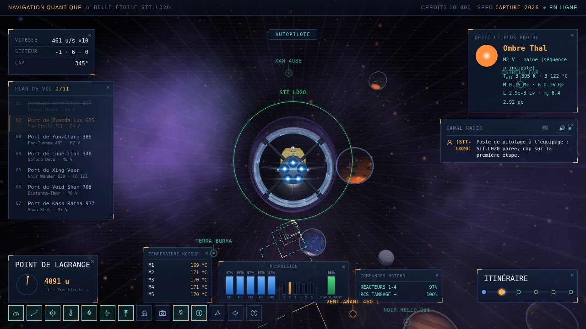

### 29.1 Facteur par vaisseau

Plus un vaisseau est lourd en charge, plus sa bulle est lente : facteur = 12 − 1,4 × log₂(masse en charge hors options / 1 000 t), borné entre 5 et 10. Calculé hors options, il ne dépend pas de l'équipement choisi.

| Vaisseau | Masse en charge (options comprises) | Facteur |
|---|---|---|
| Belle-Étoile | 2 398 t | ×10 |
| Longue-Échine | 3 752 t | ×10 |
| Basalte | 6 455 t | ×8 |
| Banquise | 34 231 t | ×5 |

### 29.2 Engagement et coupure

- **Engagée** progressivement (≈ 2 s) tant que l'étape suivante est assez loin ; **coupée** quand la distance restante passe sous 950 u + vitesse × 1,2 s. Le vaisseau retrouve sa vitesse normale avant la zone d'approche : arrivée, mise en orbite et navettes sont inchangées.
- **Boost** sans effet pendant la supraluminique.
- **Carburant** : la bulle est alimentée par le réacteur — la consommation au kilomètre reste celle de la croisière normale (§22) ; seul le temps de trajet diminue.
- **À l'écran** : bulle de distorsion autour du vaisseau, bobines des anneaux en rotation, traits de vitesse, facteur affiché à côté de la vitesse (par exemple « 560 u/s ×10 »).

### 29.3 Point relevé par les tests

Le premier réglage coupait la supraluminique à 950 u + 2,5 s de vitesse, soit ≈ 2 350 u à ×10 : sur une étape courte (2 390 u avec la graine de test), elle ne s'engageait jamais. Le test automatisé (§30.2) l'a révélé ; le seuil a été ramené à 1,2 s, durée réelle de la décélération.

## 30. Organisation du projet, build et tests — ✅ implémentée

Depuis la v2.15, le jeu n'est plus maintenu comme un fichier unique : les sources sont réparties par nature, et la page unique est produite par un build.

```
build.js              build, tests, captures, PDF, packaging (Node.js)
package.json          dépendances de développement, raccourcis npm
src/
  html/index.html     squelette de la page, marqueurs /*@inline:css*/ et /*@inline:js*/
  css/style.css       styles
  js/NN-*.js          code du jeu, un fichier par section numérotée (19 fichiers)
  assets/musics/      musique de fond
  test/               8 tests automatisés, harnais (lib/), script de captures
  docs/               spécification FR/EN, étude, pages de démonstration
target/               généré : page compacte, version lisible, PDF, archive
```

Le code JavaScript reste un script classique : ses fichiers partagent la même portée globale et sont mis bout à bout dans l'ordre de leurs numéros. Lors de la migration, le réassemblage de `src/` a été vérifié identique, octet pour octet, au fichier d'origine.

### 30.1 Commandes

| Commande | Effet |
|---|---|
| `npm run build` | assemble `src/` : `target/space-travel.min.html` (compacte, obfusquée, three.js et musique intégrés, 6,8 Mo), sa version `.gz`, et `target/dev/space-travel.html` (lisible) |
| `npm test` | 8 tests sur la version compacte (`npm run test:dev` : version lisible) |
| `npm run captures` | régénère les captures d'écran de cette spécification |
| `npm run docs` | PDF de la spécification FR / EN et de l'étude, diagrammes Mermaid rendus |
| `npm run package` | archive de livraison `target/space-travel-<version>.zip` |
| `npm run all` | nettoyage, build, tests, PDF, archive — l'archive n'est produite que si les tests passent |

### 30.2 Tests automatisés

| Test | Vérifie |
|---|---|
| Démarrage | chargement sans erreur, écran-titre, mention légale, graine imposée par l'URL |
| Sélection | dix vaisseaux du plus petit au plus grand, options de propulsion selon le vaisseau, clavier |
| Vaisseaux | installation de chaque modèle : jauges, RCS, dock, bras, balises, caméra, propulsion |
| Supraluminique | croisière ×5 à ×10 loin des étapes, coupure avant l'approche, consommation au km |
| Saut quantique | séquence complète, téléportation, retour à l'état normal |
| Escale | achat du générateur sans toucher au dock ; refus hors long-courriers |
| Traductions | libellés présents dans les quatre langues |
| Mobile | sélection et embarquement au doigt, commandes tactiles |

Toute erreur JavaScript dans la page fait échouer le test en cours. Les tests tournent en rendu logiciel (SwiftShader) pour fonctionner partout, y compris sans carte graphique : ils prennent plusieurs minutes.

### 30.3 Captures, documents, univers reproductible

- **Captures** : `npm run captures` rejoue chaque situation illustrée ici — croisière, panneaux, pause, aide, approche, orbite et navettes, carte stellaire, saut, supraluminique, mobile, tablette — avec une graine fixe, et réécrit les images sous les mêmes noms.
- **PDF** : les diagrammes Mermaid sont rendus en graphiques ; un diagramme trop réduit sur A4 est redessiné dans l'orientation inverse, ou reçoit une page paysage.
- **Graine** : `space-travel.html?seed=MA-GRAINE` impose l'univers — mêmes étoiles, mêmes routes. Tests et captures s'en servent ; c'est aussi un moyen de partager une partie.
- **Limite** : les polices sont chargées en ligne ; hors ligne, la page se replie sur les polices du système.
