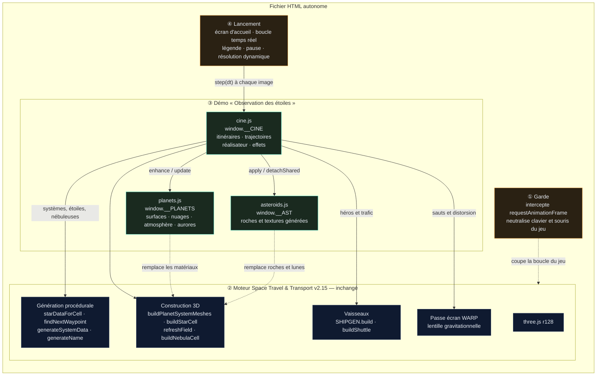
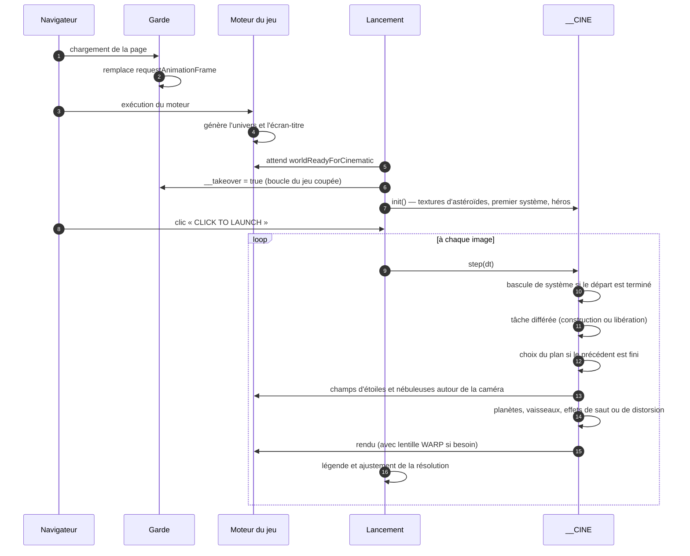
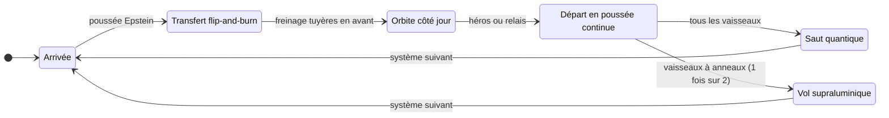

# Space Travel & Transport — *Observation des étoiles*

Démo cinématique **infinie** construite sur le moteur du jeu **Space Travel & Transport** (v2.15).
Aucune interface, aucun HUD : l'univers est généré en continu, des vaisseaux y circulent sur des trajectoires physiquement plausibles, et un réalisateur automatique choisit les plans comme au cinéma — tant qu'on ne ferme pas la page.

> (c) 2026 Frédéric Delorme & claude.ai — Music by ScoreStudio — Observation des étoiles

---

## Sommaire

1. [Fichiers](#fichiers)
2. [Lancer la démo](#lancer-la-démo)
3. [Paramètres d'URL](#paramètres-durl)
4. [Ce que montre la démo](#ce-que-montre-la-démo)
5. [Architecture technique](#architecture-technique)
6. [Chronologies de référence](#chronologies-de-référence)
7. [Performances](#performances)
8. [Limites connues](#limites-connues)
9. [Historique des versions](#historique-des-versions)
10. [Crédits et licences](#crédits-et-licences)

---

## Fichiers

| Fichier | Contenu |
|---|---|
| `observation-des-etoiles-v4.html` | Version courante, code de la démo lisible et commenté |
| `observation-des-etoiles-v4.min.html` | Même version, scripts de la démo minifiés (terser) et CSS compacté |
| `observation-des-etoiles-v3.html` / `.min.html` | Version stabilisée précédente (sans aurores) |
| `space-travel-universe-tour.html` | Première démo : visite scénarisée de 60 s en boucle (plans fixes) |

Chaque fichier est **autonome** (≈ 7 Mo) : moteur du jeu, three.js r128, musique et code de la démo sont embarqués. L'essentiel du poids vient de la piste musicale encodée en base64 ; la minification ne fait gagner qu'environ 35 Ko.

Seules les polices *JetBrains Mono* / *Inter* sont chargées depuis Google Fonts (police système en repli si hors ligne).

---

## Lancer la démo

1. Ouvrir le fichier HTML dans un navigateur récent avec WebGL (Chrome, Edge, Firefox, Safari).
2. Attendre la fin de **GENERATING UNIVERSE…** (génération du monde + textures d'astéroïdes, 1 à 2 s).
3. Cliquer sur **▶ CLICK TO LAUNCH** (le clic est nécessaire pour autoriser la musique).

| Touche | Action |
|---|---|
| `Entrée` / `Espace` (écran d'accueil) | Lancer |
| `Espace` | Pause / reprise (musique comprise) |
| `F` | Plein écran |

Toutes les autres entrées clavier / souris sont neutralisées : le jeu tourne « en arrière-plan » mais ne peut pas être démarré par erreur.

---

## Paramètres d'URL

À ajouter à la fin de l'adresse, par exemple `observation-des-etoiles-v4.html?seed=OBS-1&quality=low`.

| Paramètre | Valeurs | Effet |
|---|---|---|
| `seed` | texte libre | Graine de l'univers : même graine = même univers **et** même film. Sans graine, un univers neuf à chaque chargement. |
| `quality` | `low` · `high` | `low` : résolution plafonnée à 60 % (portables, GPU intégrés). `high` : jusqu'à 2× sur écrans haute densité. Par défaut : jusqu'à 1,5×. |
| `music` | `0` | Coupe la musique. |
| `traffic` | `0` | Supprime le trafic ambiant (navettes, remorqueurs, cargos) et les relais entre vaisseaux. |
| `ftl` | `warp` · `jump` | Impose le mode de départ : vol supraluminique (si le vaisseau en est équipé) ou saut quantique. |
| `aurora` | `all` | Met des aurores sur toutes les planètes à atmosphère (utile pour les tester). |

---

## Ce que montre la démo

### Itinéraires générés à l'infini

Chaque étape (≈ 55 à 75 s) suit le même schéma, avec des paramètres tirés au hasard :

1. **Arrivée** — par saut quantique (l'espace se creuse, éclair, le vaisseau apparaît) ou en sortie de distorsion.
2. **Transfert** vers une planète (habitée 7 fois sur 10) en *flip-and-burn* : poussée Epstein, coupure et retournement de 180°, freinage tuyères en avant. Survol possible d'une autre planète au passage. Trajectoire en courbe de Bézier qui contourne planètes et anneaux.
3. **Orbite** circulaire côté jour : l'arrivée se fait par le flanc de la planète et l'orbite est quittée avant la nuit, pour que les surfaces restent visibles.
4. **Départ** en poussée continue vers l'étoile suivante (choisie par le générateur d'itinéraires du jeu, à 700–1 500 unités).
5. **Saut quantique** ou **vol supraluminique** vers le système suivant, qui a été préparé en arrière-plan ; l'ancien est libéré dès que le nouveau est à l'écran.

**Relais** : 3 fois sur 10, un autre vaisseau en orbite prend le départ ; la caméra le suit dans le système suivant, l'ancien héros reste sur place.

**Trafic ambiant** par système : 3 navettes en orbite basse autour de la planète habitée, 1 à 2 remorqueurs, 0 à 2 cargos en transfert entre planètes.

**Noms** : types issus du catalogue du jeu (*Warehouse freighter*, *Long spine freighter*, *Ice tanker*, *Liner*…), noms générés à partir des banques de noms du jeu (*R.S.C. Ventaris*, *C.S.V. Etoilea*…).

### Réalisation automatique

Les plans durent de 5 à 8 s et sont choisis selon la phase du vol :

| Famille | Plans |
|---|---|
| Suivi du vaisseau | poursuite, travelling latéral, caméra fixe qui panoramique, face, caméra en orbite autour du vaisseau, plan large devant une planète ou l'étoile |
| Proches d'une planète | plongée par-dessus l'épaule (planète en fond), rase-nuages (horizon bas, vaisseau dans le ciel) |
| Événements | arrivée par saut, saut quantique (plan en surplomb pour voir le quadrillage), départ en distorsion, poursuite / côté / face en distorsion, sortie de distorsion |
| Plans de coupe | trafic ambiant (≈ 1 plan sur 5 hors départ) |
| Découverte sans vaisseau | orbite lente autour d'une planète, rase-nuages au lever d'étoile, **aurores en rase-mottes**, survol d'un astéroïde, lune devant sa planète, approche de l'étoile, dérive au bord d'une nébuleuse |

Les travellings de découverte représentent environ un plan sur cinq (plus souvent juste après une arrivée, comme plan d'installation) ; tous les vaisseaux sont alors masqués. Pendant un retournement *flip-and-burn*, le réalisateur préfère les plans latéraux, fixes ou larges aux plans de poursuite ; la caméra ne descend jamais sous la couche nuageuse.

### Habillage

- **En haut à gauche** : `// PROCEDURAL SPACE SIMULATION` / **SPACE TRAVEL & TRANSPORT**, comme sur l'écran-titre du jeu.
- **En bas à gauche**, légende du plan :
  `SpaceshipType / SpaceshipName -- Étoile . Classe spectrale . Planète`
  (ex. `Long spine freighter / R.S.C. Ventaris -- Krasny-Ther 713 . F8 V . Aqua-Ming I`).
  Pendant un vol supraluminique : `… . Superluminal transit → Étoile suivante`.
  Pendant un travelling sans vaisseau, seul le lieu est affiché (ex. `… . Aube Sol II — aurora borealis`).
- **En bas au centre** : la ligne de crédits.

### Propulsions

| Propulsion | Qui | Rendu |
|---|---|---|
| **Moteur Epstein** | tous | panache du jeu (diamants de choc), une commande de poussée **par vaisseau**, lueur de tuyère sur la coque du vaisseau filmé |
| **Saut quantique** | tous | charge du cœur de saut, **quadrillage d'espace-temps façon banc d'essai des maquettes qui se creuse en entonnoir** et se tord sous le vaisseau, vaisseau qui s'étire et glisse dans le puits, lentille gravitationnelle, éclair, onde de choc sur la grille ; à l'arrivée le puits se forme dans le vide avant l'apparition |
| **Vol supraluminique** | vaisseaux à anneaux de distorsion : *Warehouse bulk carrier*, *Long spine freighter*, *Ice tanker*, *Liner* (1 fois sur 2) | montée en charge des bobines pendant l'alignement, formation de la bulle (éclair), accélération, **traversée réelle de l'espace** jusqu'au système suivant avec traînées d'étoiles, sortie de distorsion (contraction des traînées, éclair, onde) |

### Planètes

- **Surfaces procédurales à détail adaptatif** : les octaves fines n'apparaissent que lorsqu'elles sont visibles à l'écran (du plan large au rase-mottes).
- **Mondes continentaux / océaniques** : continents déformés, chaînes de montagnes, biomes selon latitude, altitude et humidité (plages, déserts, savanes, prairies, forêts, jungles, toundra, roche, neige), flore « exotique » sur ~15 % des planètes, relief ombré, océans à profondeur variable avec reflet du soleil et vagues, banquise, villes illuminées côté nuit.
- **Désert** (dunes, canyons, lacs salés), **glace** (banquise fracturée, crevasses), **volcanique** (coulées de lave incandescentes), **géante gazeuse** (bandes turbulentes, grande tempête ovale).
- **Trois couches de nuages** à altitudes et vitesses de dérive différentes (cumulus et cyclones, voiles et fronts, cirrus), ombres portées au sol, couleurs du couchant au terminateur.
- **Atmosphère à diffusion** : limbe bleuté, liseré orangé au terminateur, brume vers l'horizon, halo face au soleil, visible aussi de l'intérieur.
- **Aurores polaires** (v4) sur une partie des planètes à atmosphère (≈ 65 % des habitées, 60 % des glacées, 40 % des autres, 35 % des géantes) : deux ovales de rideaux par pôle magnétique, plis mouvants, rayons scintillants, arcs qui s'allument, vert → rouge (parfois bleu ou rose), visibles surtout côté nuit.

### Astéroïdes et lunes

Générés **au démarrage** : 5 gabarits de roches (formes bosselées, cratères à rebord, un astéroïde binaire de contact) et 4 familles de textures tuilables (carbonée, silicatée, métallique, glacée — albédo + hauteur). Mappage triplanaire sans couture et relief. Chaque ceinture mélange deux familles ; les lunes utilisent le même rendu (cratérisées).

---

## Architecture technique

La démo **ne modifie pas le moteur** : elle le charge tel quel (build v2.15 du jeu) et en prend le contrôle. Le fichier HTML contient quatre blocs de script, exécutés dans l'ordre ① → ④.

### Vue d'ensemble

### Démarrage et boucle d'image

### Cycle d'une visite de système

Géré par `cine.js` : chaque visite est planifiée en entier à l'arrivée (trajectoires fonctions du temps), le système suivant est construit en tâche de fond pendant la visite.

**Fonctions du moteur réutilisées** : `starDataForCell`, `findNextWaypoint` (génération d'itinéraires), `generateSystemData`, `buildPlanetSystemMeshes`, `buildStarCell`, `refreshField` / `buildNebulaCell` (champs d'étoiles et nébuleuses), `SHIPGEN.build` (10 modèles de vaisseaux), `buildShuttle`, la passe écran `WARP` (lentille gravitationnelle), `generateName` / `LANG_BANKS` (noms), `apparentMagnitude`.

**Adaptations notables**

- Les uniformes partagés du générateur de vaisseaux (poussée Epstein, charge du cœur de saut, champ et phase des bobines de distorsion) sont **dupliqués par vaisseau** : chaque vaisseau a ses propres moteurs.
- Une seule lumière de tuyère partagée (suit le vaisseau filmé) pour éviter les recompilations de shaders.
- Les matériaux des planètes et des ceintures créés par le moteur sont remplacés à chaud ; les géométries et matériaux partagés sont détachés avant la libération d'un système.
- Les ceintures d'astéroïdes ne sont plus éliminées à tort par le *frustum culling*.
- Tout est fonction du temps de simulation : la pause fige l'univers entier.

---

## Chronologies de référence

| Séquence | Phases (s) |
|---|---|
| Saut quantique (départ) | charge 2,6 · repli 1,25 · éclair 0,32 · onde 1,7 |
| Arrivée par saut | puits vide 1,8 · éclair 0,32 · onde ≈ 3 |
| Vol supraluminique | montée en charge 2,6 · engagement 0,75 · croisière 4,5–7,5 · décélération 0,9 · onde de sortie 1,6 |
| Transfert *flip-and-burn* | 18–36 (retournement à mi-parcours) |
| Orbite | 6–15 (quittée avant la nuit) |
| Départ en poussée continue | 10–13 |

---

## Performances

- Les surfaces planétaires et les nuages sont calculés par shaders : les gros plans sont exigeants pour le GPU.
- **Résolution dynamique** : la page mesure le temps d'image et ajuste la densité de pixels entre 0,45 et le plafond (1,5 par défaut, 2 avec `quality=high`, 60 % avec `quality=low`). Au-dessus de ~23 ms par image elle baisse, en dessous de ~18,5 ms elle remonte.
- Le nombre d'octaves de bruit dépend de la taille d'un pixel sur la planète : une planète lointaine coûte peu.
- Mémoire stable sur de longues sessions (vérifié sur 20 min simulées : ~13 vaisseaux et ~200 objets en scène en permanence).

---

## Limites connues

- Validé en navigateur *headless* avec rendu logiciel (SwiftShader) : fluidité à confirmer sur GPU réels, en particulier intégrés.
- La musique ne démarre qu'après le clic de lancement (règle d'autoplay des navigateurs).
- Échelle héritée du jeu : les vaisseaux sont grands par rapport aux planètes (un cargo ≈ un quart de rayon planétaire).
- Le vol supraluminique est réservé aux quatre modèles équipés d'anneaux de distorsion.
- Les étoiles des systèmes sont stylisées (petites sphères lumineuses) comme dans le jeu.

---

## Historique des versions

| Version | Apports |
|---|---|
| v1 — *Universe Tour* | Visite scénarisée de 60 s en boucle, moteur piloté sans HUD, titre en haut à gauche |
| v2 — *Observation des étoiles* | Itinéraires et plans générés à l'infini, légende vaisseau/lieu, quadrillage d'espace-temps pendant les sauts, trafic ambiant, relais |
| v2.1 | Planètes détaillées : terres, océans, biomes, 3 couches de nuages, atmosphère à diffusion, rase-nuages, résolution dynamique |
| v3 | Astéroïdes et lunes texturés, travellings de découverte sans vaisseau, vol supraluminique, version minifiée |
| v4 | Aurores polaires et travellings en rase-mottes sous les aurores |

---

## Crédits et licences

- **Jeu et moteur** *Space Travel & Transport* — © 2026 Frédéric Delorme, licence MIT.
- **Démo « Observation des étoiles »** — Frédéric Delorme & claude.ai.
- **Musique** — ScoreStudio, via Envato, reprise du jeu. *Vérifier que la licence couvre la diffusion de la démo avant publication.*
- **three.js r128** — © three.js authors, licence MIT.
- **Bruit simplex 3D (GLSL)** — Ashima Arts / Stefan Gustavson, licence MIT.
- Polices *JetBrains Mono* et *Inter* — SIL Open Font License.
