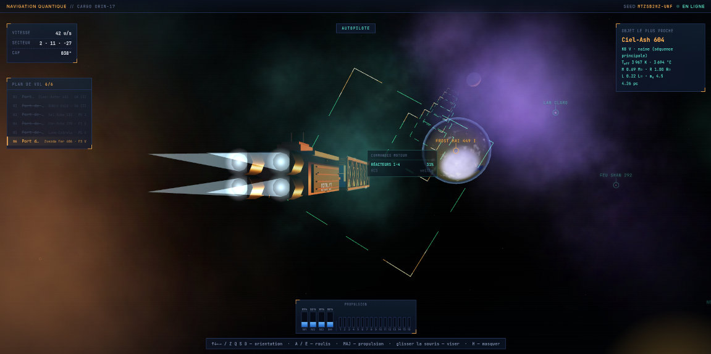
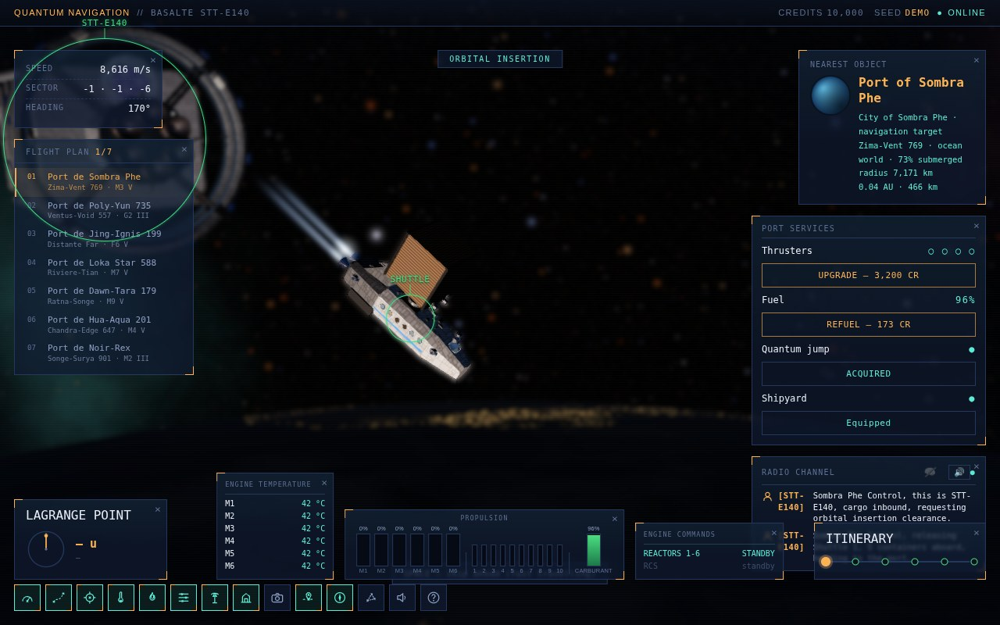

# Voyage Spatial — Space Travel & Transport

Simulateur de vol spatial procédural, livré sous la forme d'un **unique fichier HTML autonome** (Three.js, WebGL, aucune étape de build). Un cargo pilote automatiquement (ou manuellement) de système en système, livre sa cargaison par navettes à chaque escale, échange par radio avec le contrôle du port, gagne des crédits pour améliorer ses propulseurs, se ravitailler ou acheter un module de saut quantique, et poursuit son itinéraire dans un univers entièrement généré depuis une seule graine — étoiles, nébuleuses, systèmes planétaires, noms.

Disponible en **français, anglais, allemand et espagnol**, choisi sur l'écran-titre au lancement.

## Lancer le jeu

Aucune installation ni compilation nécessaire :

1. Ouvrir `space-travel.html` (ou sa version minifiée, `space-travel.min.html`) directement dans un navigateur récent (Chrome, Firefox, Edge…), en double-cliquant sur le fichier.
2. Une connexion internet est nécessaire au premier chargement (Three.js est chargé depuis un CDN).
3. Cliquer sur **START** : ce premier geste lance aussi la musique.

**Alternative recommandée**, pour un rendu plus stable selon les navigateurs :

```bash
# depuis le dossier du projet
python3 -m http.server 8000
# puis ouvrir http://localhost:8000/space-travel.html
```

La musique de fond est un fichier `.m4a` chargé depuis le dossier `musics/`, à côté du fichier HTML. Ce fichier n'est pas suivi par git : sans lui, le jeu reste simplement muet.

## Paramètres d'URL

À ajouter à l'adresse de la page, séparés par `&` (par exemple `…?seed=DEMO&scale=allegee`) :

| Paramètre                         | Effet                                                                                                                                                                                                                                              |
|-----------------------------------|----------------------------------------------------------------------------------------------------------------------------------------------------------------------------------------------------------------------------------------------------|
| `seed=XXX`                        | Fixe la graine de l'univers : la même graine redonne toujours le même univers. Sans ce paramètre, une graine est tirée au hasard et affichée dans la barre du haut.                                                                                  |
| `scale=actuel` ou `scale=allegee` | Choisit le profil d'échelle des tailles et des distances (défaut : `actuel`). `allegee` est en construction : seule la génération est câblée pour l'instant, voir [`docs/specs/SPEC-003-etude_des_echelles-V1.0.md`](./docs/specs/SPEC-003-etude_des_echelles-V1.0.md).                              |
| `selftest=1` ou `selftest=boot`   | Réservé à `selftest.sh`, le test de non-régression sous Chrome sans écran.                                                                                                                                                                         |

## Fonctionnalités

- Univers procédural déterministe : la même graine reproduit toujours le même univers.
- Étoiles physiquement modélisées (classes spectrales, corps noir, magnitude apparente), nébuleuses, systèmes planétaires (anneaux, astéroïdes, lunes, ports spatiaux).
- Pilotage automatique ou manuel, avec inertie réaliste du vaisseau, et trois modes de caméra.
- Séquence d'arrivée à chaque escale : mise en orbite, livraison par navettes, échanges radio doublés d'une synthèse vocale.
- Économie : crédits gagnés à chaque livraison, services portuaires (propulseurs, carburant, module de saut quantique).
- Carburant, carte stellaire en 3D et saut quantique vers une étoile choisie sur la carte.
- Contrôles tactiles pour smartphone et tablette.
- Musique de fond et réglage des volumes (musique, voix de synthèse).
- Interface entièrement traduite en 4 langues.

## Captures d'écran

| Interface en français                                                                                                                       |
|---------------------------------------------------------------------------------------------------------------------------------------------|
|       |
| Interface en anglais                                                                                                                        |
|                                                      |

Toutes les captures de la documentation sont produites par `screenshots.sh` (voir la spécification, §9.5).

## Commandes

*(Correspond à l'état actuel du jeu. La référence complète, avec les touches en projet, est au §20 de la [spécification](./docs/spec-space_travel_and_transport-2.12.md).)*

### Pilotage

| Touche                                                   | Action                                                                    |
|----------------------------------------------------------|---------------------------------------------------------------------------|
| `↑` `↓` `←` `→`                                          | Orientation (tangage / lacet)                                             |
| `Z` `Q` `S` `D` *(AZERTY)* ou `W` `A` `S` `D` *(QWERTY)* | Équivalents des flèches — les deux dispositions fonctionnent en parallèle |
| `E` / `R`                                                | Roulis                                                                    |
| `MAJ` (Shift) ou `ESPACE`                                | Propulsion (boost)                                                        |
| Glisser la souris                                        | Visée fine / pilotage à la souris                                         |

### Caméra

| Touche                                | Action                                                                        |
|---------------------------------------|-------------------------------------------------------------------------------|
| `CTRL` + glisser la souris            | Regard libre autour du vaisseau                                               |
| Appui court sur `CTRL` (sans glisser) | Recentre le regard libre                                                      |
| `F9`                                  | Mode de caméra suivant (poursuite → plan-séquence → plans lointains)          |

### Interface

| Touche              | Action                                                                              |
|---------------------|-------------------------------------------------------------------------------------|
| `F1` à `F6`         | Affichent/masquent les six panneaux d'information                                   |
| `F7` ou `TAB`       | Canal radio                                                                         |
| `F8`                | Services portuaires (près d'un port ou pendant une livraison)                       |
| `I` / `L`           | Itinéraire / point de Lagrange                                                      |
| `M`                 | Carte stellaire et choix de la destination d'un saut quantique                      |
| `V`                 | Réglage des volumes (musique, voix)                                                 |
| `H`                 | Affiche/masque l'aide clavier                                                       |
| `F10`               | Coupe/rétablit la voix de synthèse                                                  |
| `ÉCHAP` ou `P`      | Met le jeu en pause (`ÉCHAP` de nouveau : retour à l'écran-titre)                   |

### Séquence d'approche

| Touche               | Action                                                                                           |
|----------------------|--------------------------------------------------------------------------------------------------|
| `ESPACE` ou `ENTRÉE` | Abrège la manœuvre d'approche en cours (mise en orbite/livraison), qui se joue alors en accéléré |

### Démarrage et écran-titre

| Touche                          | Action                                                                   |
|---------------------------------|--------------------------------------------------------------------------|
| `ENTRÉE` ou `ESPACE`            | Écran de démarrage : START · écran-titre : valide la langue focalisée    |
| `←` `→` (ou `↑` `↓`), `TAB`     | Écran-titre : change de langue (le texte de l'écran suit)                |

## Structure du projet

| Fichier                                            | Contenu                                                                                          |
|----------------------------------------------------|--------------------------------------------------------------------------------------------------|
| `space-travel.html`                                | Le jeu — fichier unique, autonome                                                                |
| `space-travel.min.html`                            | Version minifiée du jeu, régénérée à chaque changement par `minify-html-bundle.py`               |
| `minify-html-bundle.py`                            | Compacte un fichier HTML autonome (nécessite `terser` et `clean-css`)                            |
| `selftest.sh`, `selftest.expected`                 | Test de non-régression sous Chrome sans écran, et ses références                                 |
| `screenshots.sh`, `screenshots.js`                 | Refont les captures d'écran de la documentation (Chrome sans écran, ImageMagick)                 |
| `spec-pack.py`                                     | Assemble une spécification : `.md` autonome (images en base64) et `.zip`                         |
| `docs/spec-space_travel_and_transport-2.12.md`     | Spécification v2.12 en français (`_en.md` : traduction anglaise ; `.zip` : version légère)       |
| `docs/specs/SPEC-002-generation_de_l_univers-V1.0.md`                  | Génération de l'univers : graine, étoiles, nébuleuses, route, systèmes planétaires               |
| `docs/specs/SPEC-003-etude_des_echelles-V1.0.md`                           | Étude : révision des échelles (étoiles, planètes, lunes, vaisseau), décisions et plan par paliers |
| `docs/specs/SPEC-001-vaisseaux_generatifs-V1.0.md`               | Étude : construction générative des vaisseaux cargo (proposition, non implémentée)               |
| `TODO.md`                                          | Relevé des demandes et des correctifs, version par version                                       |

## Feuille de route

Ce qui reste à faire est listé au §18 de la [spécification](./docs/spec-space_travel_and_transport-2.12.md) (« Restant à faire »), avec pour chaque chantier ses décisions déjà arrêtées. La **révision des échelles** — planètes plus petites et plus lointaines de leur étoile, vaisseau bien plus petit que les planètes — est en cours par paliers : le palier P0 (profils d'échelle, `?scale=`) est livré, la suite est décrite dans [`docs/specs/SPEC-003-etude_des_echelles-V1.0.md`](./docs/specs/SPEC-003-etude_des_echelles-V1.0.md).
