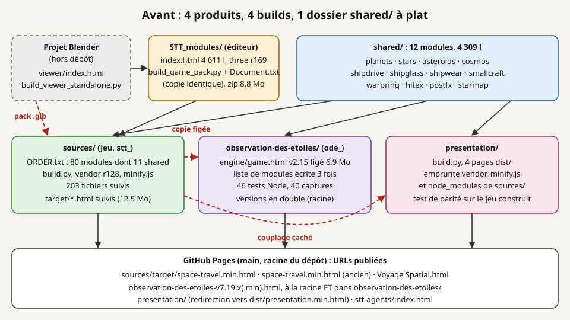
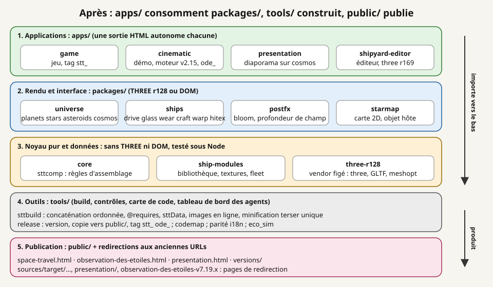
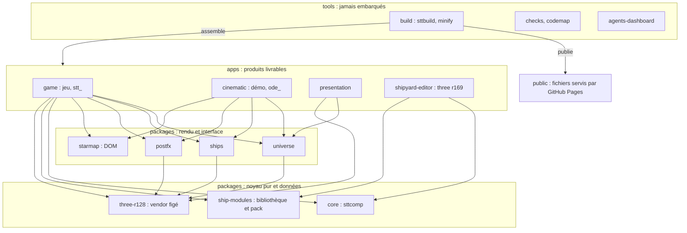
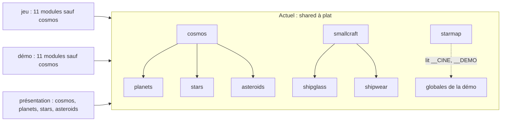
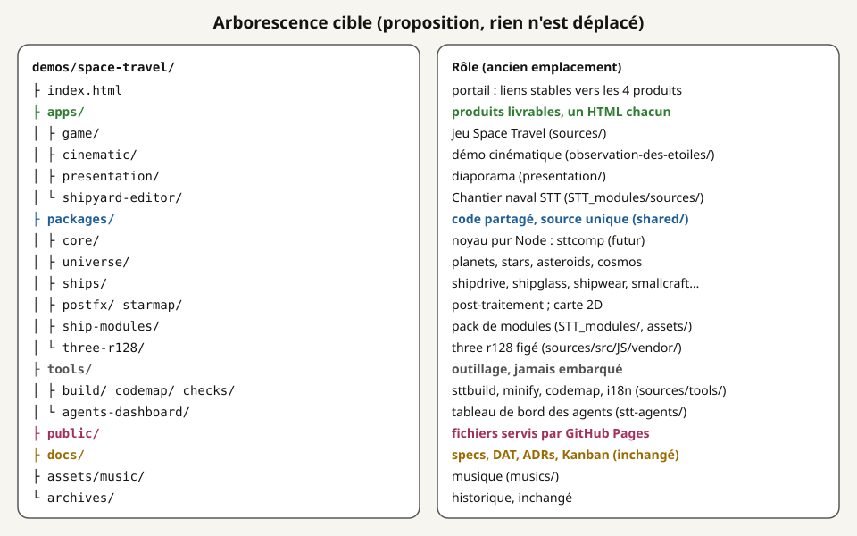
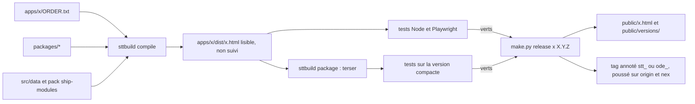
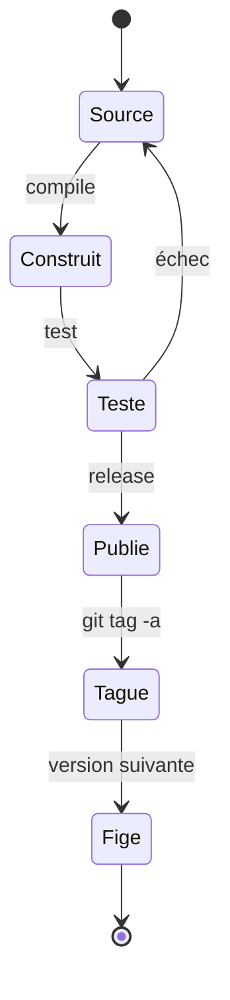
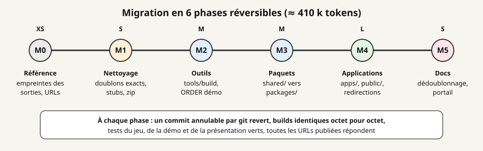
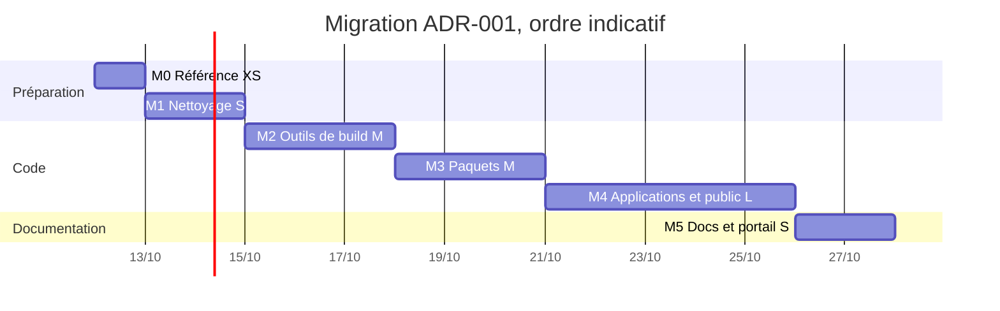
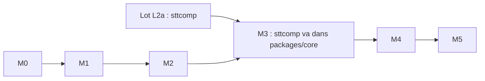

# ADR-001 — Réorganisation du code de `demos/space-travel/`

| | |
|---|---|
| **Statut** | Proposé (rien n'est exécuté : aucun fichier de code ou de données n'a été déplacé) |
| **Date** | 06/10/2026 |
| **Décideurs** | Frédéric Delorme (mainteneur) ; rédaction : agent ARCHI ; mise en œuvre : CP et DEV après acceptation |
| **Demande** | « Faire une proposition de réorganisation du code des éléments : observation-des-etoiles, presentation, jeu (sources), STT_modules, ainsi que les composants partagés (shared) » (06/10/2026) |
| **Portée** | `demos/space-travel/` uniquement ; la racine du blog n'est pas concernée |

Chemins relatifs à `demos/space-travel/` sauf mention contraire. Les chiffres viennent de `git ls-files`, `wc` et
`md5sum` sur la branche issue de `main` du 06/10/2026 ; ce qui est déduit sans vérification est marqué *à vérifier*.

---

## 1. Contexte

Le dossier contient quatre produits qui ont grandi séparément, plus un dossier de code partagé à plat. 636 fichiers
suivis au total.

*La carte montre les quatre dossiers produits, `shared/`, le projet Blender hors dépôt et les fichiers publiés par
GitHub Pages. Les flèches rouges sont les dépendances qui ne sont déclarées nulle part.*

| Composant | Rôle | Point d'entrée | Build | Fichiers suivis | Tests | Tag |
|---|---|---|---|---|---|---|
| `sources/` | jeu *Space Travel & Transport*, three r128 | `src/html/index.template.html` + `src/JS/game/ORDER.txt` (80 entrées, dont 11 `shared/`) | `build.py` (213 l) : `compile` (concaténation ordonnée, contrôle `@provides`/`@requires`, `sttData`, pack `<!--@PACK@-->`, parité i18n), `package` (terser via `tools/minify.js`), `test` | 203 ; 11 418 l de JS moteur, 1 375 l `sim/` + `ui/` | 21 Playwright, 8 Node (`unit/`) | `stt_v2.17.0` à `stt_v2.19.0` |
| `observation-des-etoiles/` | démo cinématique sans joueur | `engine/game.html` (copie figée du jeu v2.15, 6,9 Mo) + 8 fichiers `src/` (4 840 l, dont `cine.js` 3 701 l) | `build/build.py` (15 l) ; `build/build_min.js` (21 l) ; `build/package.py` (67 l, zip de projet) | 107 | 46 scripts Node/Playwright | `ode_v7.19.0`, `ode_v7.19.1` |
| `presentation/` | diaporama sur fond d'univers en temps réel | `index.html` (redirection vers `dist/presentation.min.html`) | `build/build.py` (155 l) : 4 pages, dont 3 pages de test | 50 ; 1 618 l `src/` | 4 Playwright | aucun |
| `STT_modules/` | éditeur « Chantier naval STT », three r169 en modules ES via `importmap` | `sources/index.html` (4 611 l, 302 Ko) | aucun dans le dépôt ; `build_game_pack.py` produit le pack du jeu | 70 (dont `STT_ModuleLibrary.json` 8 Mo) | aucun (sonde prévue par L2a) | aucun |
| `shared/` | 12 modules communs (4 309 l) | globales `window.__X` | lus par les trois builds | 12 | via les produits | — |
| autres | `stt-agents/` (tableau de bord des agents, 3 fichiers), `musics/` (1 `.m4a`), `archives/` (13 fichiers, 124 Mo), `docs/` (163 fichiers, 34 Mo) | | | | | |

### 1.1 Problèmes constatés

1. **Le nom ne dit pas le rôle.** `sources/` désigne le jeu alors que tout est source ; `STT_modules/` mélange l'éditeur,
   la bibliothèque 3D, un script de pack et une archive de 8,8 Mo ; `shared/` met au même niveau un noyau de règles
   (futur `sttcomp`), du rendu THREE et une interface DOM (`starmap.js` : 8 `document.`, 0 `THREE.`).
2. **Copies et doublons exacts** (`md5sum` identiques) : `STT_modules/Document.txt` = `build_game_pack.py` ;
   `observation-des-etoiles-v7.19.{1,2}{,.min}.html` présents à la racine **et** dans `observation-des-etoiles/`
   (4 fichiers de 7,4 à 7,7 Mo, environ 30 Mo en double) ; 12 images identiques entre `docs/illustrations/`,
   `observation-des-etoiles/docs/` et `sources/src/docs/img/` ; trois `stt-meridian*.png` dont deux « copie ».
3. **Copies divergentes** : `engine/game.html` est un instantané v2.15 du jeu (la démo ne suit plus le moteur) ;
   l'éditeur et `build_game_pack.py` existent aussi dans le projet Blender hors dépôt avec des empreintes différentes
   (contrat L2a § 7) ; `STT_modules/sources/fleet.json` ≠ `sources/src/assets/stt_fleet.json` ;
   `sources/src/docs/spec-L9-*.md`, `spec-missions.md`… sont les noms d'avant la renumérotation des SPEC (*à vérifier*
   par `diff` qu'elles sont des copies) ; deux `spec-…-v2.17-P1.md` d'empreintes différentes.
4. **Couplages cachés** : `presentation/build/build.py` lit `../sources/src/JS/vendor/three.r128.min.js`,
   `../sources/tools/minify.js`, exige `../sources/node_modules` et teste contre `../sources/target/space-travel.html` ;
   `shared/starmap.js` lit `__CINE` et `__DEMO`, globales de la démo.
5. **Liste de modules de la démo écrite trois fois** (`build.py`, `build_min.js`, `package.py`) : 17 entrées à tenir
   synchrones à la main ; `package.py` régénère un `build.py` par texte (fragile, *à vérifier* s'il sert encore).
6. **Trois installations Node** : `sources/package.json`, `observation-des-etoiles/package.json` (terser, clean-css),
   et la présentation qui emprunte celle du jeu ; deux `package-lock.json` vides (racine du dépôt et du dossier).
7. **Publication dispersée** : GitHub Pages sert `main` depuis la racine ; les URLs vivantes sont des fichiers de
   build suivis à des endroits hétérogènes (`sources/target/`, racine, sous-dossier de la démo, `presentation/dist/`),
   plus `space-travel.min.html` (racine, différent de `target/`) et `Voyage Spatial.html` (export d'une page, *à vérifier*).
   La musique est chargée depuis `musics/` **à côté du HTML** (README § 23) : depuis `sources/target/`, elle est
   probablement absente (*à vérifier*).
8. **Outils de build sans socle commun** : trois scripts Python qui refont chacun lecture, concaténation, insertion
   dans un gabarit et écriture ; seul celui du jeu contrôle `@requires`.

## 2. Facteurs de décision

| # | Facteur | Exigence |
|---|---|---|
| F1 | URLs publiées | aucune URL servie aujourd'hui ne doit répondre 404 ; une redirection est acceptable |
| F2 | Tags de release | `stt_vX.Y.Z` et `ode_vX.Y.Z` conservés, poussés sur `origin` et `nex` |
| F3 | Un HTML autonome par produit | aucun chargement à l'exécution hors CDN existants (DAT § 6) |
| F4 | Builds reproductibles | après chaque déplacement, sorties identiques octet pour octet à l'existant |
| F5 | Séparation sim / ui / rendu | la couche `sim/` et `sttcomp` sans THREE ni DOM, testables sous Node |
| F6 | Partage sans copie | un module partagé n'existe qu'une fois ; pas de copie vers un produit |
| F7 | Tests | les 21 + 8 tests du jeu, 46 de la démo, 4 de la présentation restent exécutables |
| F8 | Coût de migration | phases courtes, réversibles, compatibles avec les lots en cours (L2a) |
| F9 | SPEC-011 | la structure doit accueillir modules ES, TypeScript, Vite et *workers* sans nouveau déménagement |
| F10 | Agents | `CODEMAP.md`, listes noires, profils CP/ARCHI/DEV/REVUE, Kanban et `CLAUDE.md` mis à jour dans la même phase |

## 3. Options étudiées

### Option A — Statu quo amélioré (renommages seuls)

Garder les quatre dossiers à la racine, renommer (`sources/` → `game/`, `STT_modules/` → `shipyard-editor/`),
supprimer les doublons, sous-dossiers dans `shared/`.

- \+ Coût faible (S à M), peu de chemins changés.
- − Les couplages cachés restent (vendor, minifieur, `node_modules`) ; trois builds sans socle ; aucune règle de
  dépendance vérifiable ; un second déménagement sera nécessaire pour SPEC-011 étape 2 (espaces de travail Vite).

### Option B — Monorepo en paquets (`apps/` + `packages/` + `tools/` + `public/`)

Les produits deviennent des applications, le code partagé des paquets classés par couche, les outils un socle commun,
et les fichiers servis un dossier unique avec des redirections aux anciennes URLs.

- \+ Rôle lisible dans le chemin ; règles de dépendance vérifiables par le build ; forme native d'un espace de travail
  npm ou pnpm (SPEC-011) ; un seul `package.json` d'outillage ; publication regroupée.
- − Coût L à XL si tout est fait d'un coup ; tous les chemins des agents et des docs changent ; redirections à tenir.

### Option C — Dépôts distincts (jeu, démo, présentation, éditeur, bibliothèque partagée)

- \+ Cycles de version indépendants, historiques séparés.
- − Le partage de `shared/` exige un paquet publié ou un sous-module git : copie ou synchronisation, contraire à F6 ;
  les URLs GitHub Pages changent de domaine ; les agents perdent la vue d'ensemble ; coût XL.

### Option D (hybride) — B par étapes, internes des produits inchangés

L'option B, exécutée en six phases indépendantes ; la structure **interne** de chaque produit (fichiers numérotés du
moteur, globales `__X`, noms des modules) reste telle quelle ; les sorties publiées passent par `public/` avec des
pages de redirection ; la démo garde son moteur figé.

- \+ Bénéfices de B avec un coût étalé et un risque borné par phase ; chaque phase vérifiable par empreintes.
- − Une période de transition où coexistent anciens chemins (redirections) et nouveaux.

## 4. Décision proposée

**Option D : monorepo en paquets, mené par phases réversibles.** Elle traite les huit problèmes du § 1.1, respecte
F1 à F10 et prépare SPEC-011 sans l'anticiper : les paquets restent des scripts classiques concaténés tant que
l'étape 2 de SPEC-011 n'est pas décidée ; le jour venu, chaque dossier de `packages/` reçoit un `package.json` et
des `export` sans changer de place. A est trop court (second déménagement certain), C contraire à F6.

**Langue des noms.** Les dossiers de **code** sont en anglais (`apps/`, `packages/`, `tools/`, `game`, `cinematic`) :
l'API (`STTCOMP`, `GAME`, `BRIDGE`, `__PLANETS`) est en anglais, les noms de paquets npm et de chemins sans accents
évitent l'encodage des URLs, et c'est la convention des espaces de travail Vite. Les dossiers de **documentation**
restent en français (`docs/specs/`, `work_in_progress/`), comme le contenu. Les **noms publics** des produits ne sont
pas traduits : `space-travel.html`, `observation-des-etoiles.html`, `presentation.html`.

## 5. Architecture cible

*Les couches se lisent de haut en bas : une couche n'importe que des couches situées en dessous ; les outils
produisent les fichiers de `public/` mais ne sont jamais embarqués.*

### 5.1 Règles de dépendance (vérifiées par `sttbuild`)

| Couche | Peut utiliser | Interdit | Contrôle proposé |
|---|---|---|---|
| `packages/core` | rien (JS pur) | THREE, `document`, `window`, `Math.random`, `Date.now` | `grep` au build + `node --test` |
| `packages/universe`, `ships`, `postfx` | THREE r128 global, `core` | DOM hors création de canvas hors écran ; globales d'une application | en-tête `@provides`/`@requires` |
| `packages/starmap` | DOM, `core` ; comportement propre au produit **par objet hôte** (`__STARMAP_HOST`) | lire `__CINE`, `__DEMO` (écart actuel à corriger) | `@requires` |
| `packages/ship-modules` | données, scripts Python de production | code d'exécution | — |
| `apps/*` | tout paquet ; leurs propres fichiers | importer une autre application (seule exception : un **artefact construit** comme oracle de test, déclaré) | chemins résolus par le manifeste |
| `tools/*` | tout, en lecture | être embarqué dans une sortie | — |

Dans `apps/game`, la règle de SPEC-010 § 2.4 tient toujours : `src/sim/` ne touche ni THREE ni le DOM et ne parle au
moteur que par `BRIDGE`.

### 5.2 Classement des composants partagés

| Paquet | Modules (lignes) | Couche | Dépend de | Consommé par |
|---|---|---|---|---|
| `core` | `sttcomp.js` (futur, ≤ 500 l, contrat L2a) | noyau pur | rien | jeu, éditeur |
| `universe` | `planets` 538, `stars` 368, `asteroids` 242, `cosmos` 726 | rendu | THREE ; `cosmos` → les trois autres | jeu, démo (sauf `cosmos`), présentation |
| `ships` | `shipdrive` 237, `shipglass` 754, `shipwear` 305, `smallcraft` 307, `warpring` 85, `hitex` 64 | rendu | THREE ; `smallcraft` → `shipglass`, `shipwear` ; `hitex` : canvas | jeu, démo |
| `postfx` | `postfx` 113 | rendu | THREE | jeu, démo |
| `starmap` | `starmap` 570 | interface | DOM, objet hôte | jeu, démo |
| `ship-modules` | bibliothèque, textures, `fleet.json`, `build_game_pack.py`, futur `build_modules_geom.py` | données | Python 3, Pillow, gltfpack | jeu (pack), éditeur |
| `three-r128` | `three.r128.min.js`, `GLTFLoader`, `meshopt_decoder` | vendor | — | jeu, présentation (la démo embarque le sien via le moteur figé) |

Les noms de fichiers et de globales (`__PLANETS`, `__SHIPGLASS`…) **ne changent pas** : seul le dossier change, la
concaténation produit donc les mêmes octets.

## 6. Table de renommage et de déplacement

*L'illustration donne la forme d'ensemble ; la table ci-dessous est exhaustive pour les dossiers et les fichiers
remarquables.*

| Ancien chemin | Nouveau chemin | Raison |
|---|---|---|
| **Jeu** | | |
| `sources/` | `apps/game/` | « sources » ne dit pas le produit |
| `sources/build.py` | `apps/game/build.py` | mince : appelle `tools/build/sttbuild` |
| `sources/src/JS/game/ORDER.txt` | `apps/game/ORDER.txt` | manifeste visible ; `codemap.py` sait déjà le lire à la racine du produit |
| `sources/src/JS/game/*.js` | `apps/game/src/engine/*.js` | le niveau `JS/` est vide de sens ; « engine » = moteur existant (SPEC-010) |
| `sources/src/JS/sim/`, `ui/` | `apps/game/src/sim/`, `src/ui/` | même raison |
| `sources/src/JS/vendor/` | `packages/three-r128/` | utilisé aussi par la présentation |
| `sources/src/{css,html,data,assets}/` | `apps/game/src/{css,html,data,assets}/` | inchangés sous `src/` |
| `sources/src/test/*_test.py` | `apps/game/tests/e2e/` | séparer Playwright… |
| `sources/src/test/unit/` | `apps/game/tests/unit/` | …et Node |
| `sources/src/docs/spec-*.md`, `img/` | `docs/specs/` (dédoublonnés) | copies d'avant renumérotation (*à vérifier*) |
| `sources/src/docs/spec217/` | `tools/spec-pdf/` | outillage de doc, pas du jeu |
| `sources/tools/codemap.py` | `tools/codemap/codemap.py` | couvre tous les produits |
| `sources/tools/minify.js`, `package.json`, `package-lock.json` | `tools/build/` | une seule installation Node |
| `sources/tools/i18n_parity.mjs` | `tools/checks/i18n_parity.mjs` | contrôle générique |
| `sources/tools/eco_sim.py` | `apps/game/tools/eco_sim.py` | propre au jeu |
| `sources/target/*.html` | `apps/game/dist/` (non suivi) + `public/space-travel.html` | seul le livrable est publié |
| `sources/target/shots/`, `mesures/` | `apps/game/dist/` (non suivi) | sorties de test (*à vérifier* qu'aucune doc ne les cite) |
| **Démo cinématique** | | |
| `observation-des-etoiles/` | `apps/cinematic/` | rôle fonctionnel ; le nom public reste `observation-des-etoiles` |
| `engine/game.html` | `apps/cinematic/engine/game-v2.15.html` | la version figée se lit dans le nom |
| `src/*.js` (8) | `apps/cinematic/src/` | noms conservés (`head_guard2.js`, `live2.js`) pour ne pas changer les sorties |
| `build/build.py` + `build_min.js` | `apps/cinematic/build.py` + `apps/cinematic/ORDER.txt` | une seule liste de 17 modules au lieu de trois |
| `build/package.py` | `archives/` ou `tools/release/` | génère un `build.py` par texte (*à vérifier* s'il sert) |
| `tests/` (46) | `apps/cinematic/tests/` | inchangés |
| `docs/*.jpg` (40) | `apps/cinematic/docs/img/` | images du README de la démo ; doublons supprimés |
| `observation-des-etoiles-v7.19.x(.min).html` (dans le dossier) | supprimés (identiques à la racine) | doublons exacts ; redirections |
| `package.json` | `apps/cinematic/package.json` (nom, version, sans dépendances) | la version de la démo y reste lue |
| **Présentation** | | |
| `presentation/` | `apps/presentation/` | même convention |
| `build/build.py` | `apps/presentation/build.py` | ne lit plus `../sources/` : paquets et `tools/build` |
| `src/`, `tests/`, `docs/SPEC-P*.md` | `apps/presentation/{src,tests,docs}/` | specs propres au produit, avec lui |
| `media/` | `apps/presentation/media/` ; `apercu.jpg` copié dans `public/media/` | `og:image` est une URL absolue |
| `dist/*-test.html` | `apps/presentation/dist/` (non suivi) | déjà dans `.gitignore`, mais suivis de force |
| `index.html` | page de redirection conservée sur place | URL publiée (README, `og:url`) |
| **Éditeur et bibliothèque** | | |
| `STT_modules/sources/index.html`, `manual/` | `apps/shipyard-editor/` | « Chantier naval STT » ; `shipyard-editor` évite la confusion avec l'onglet CHANTIER et `cinematic/src/shipyard.js` |
| `STT_modules/sources/STT_ModuleLibrary.json`, `lib/`, `tex/`, `fleet.json` | `packages/ship-modules/library/` | données sources du pack et de l'éditeur (chemins de chargement de l'éditeur à adapter, *à vérifier*) |
| `STT_modules/build_game_pack.py` | `packages/ship-modules/build_game_pack.py` | produit `apps/game/src/assets/` |
| `STT_modules/STT_INTEGRATION.md` | `packages/ship-modules/INTEGRATION.md` | documentation du paquet |
| `STT_modules/Document.txt` | supprimé | copie exacte de `build_game_pack.py` |
| `STT_modules/stt_pipeline-1.1.0-linux-x64.zip` | `archives/` | binaire de 8,8 Mo |
| `STT_modules/stt-meridian*.png` (3) | `docs/illustrations/stt-meridian.png` | deux « copie » (*à vérifier* leur différence) |
| `STT_modules/stt-mercator.json` | *à vérifier* | rôle inconnu |
| **Modules partagés** | | |
| `shared/planets.js`, `stars.js`, `asteroids.js`, `cosmos.js` | `packages/universe/` | univers sans vaisseau |
| `shared/shipdrive.js`, `shipglass.js`, `shipwear.js`, `smallcraft.js`, `warpring.js`, `hitex.js` | `packages/ships/` | rendu des vaisseaux |
| `shared/postfx.js` | `packages/postfx/` | post-traitement |
| `shared/starmap.js` | `packages/starmap/` | seule interface DOM |
| `shared/sttcomp.js` (L2a) | `packages/core/sttcomp.js` | noyau pur |
| **Autres** | | |
| `stt-agents/` (+ `README_1.md`) | `tools/agents-dashboard/` (+ `README.md`) | outil, pas produit |
| `musics/` | `public/musics/` | chargé à côté du HTML publié |
| `space-travel.min.html` (racine) | `public/versions/` (version *à vérifier*) | ancienne version publiée |
| `Voyage Spatial.html` | *à vérifier* : `archives/` ou `public/versions/` | export d'une page de présentation |
| `observation-des-etoiles-v7.19.x(.min).html` (racine) | `public/versions/` | versions publiées regroupées |
| `stt-001.jpg`, `stt-002.jpg` | `docs/illustrations/` | images du README |
| `package-lock.json` (vide) | supprimé | stub sans projet |
| `README.md` (obsolète, cf. `CLAUDE.md`) | réécrit, + `index.html` portail | carte d'entrée exacte |
| `docs/SPEC-010-arbre_des_technologies_et_missions.md` | `docs/specs/` avec un numéro libre | collision avec `SPEC-010-chantier_naval…` |
| `docs/spec-…-v2.17-P1.{md,pdf}`, `DAT*.md` | inchangés | déjà rangés |
| `docs/work_in_progress/` | inchangé | Kanban et prompts référencés par les agents |
| `docs/ADRs/` | nouveau | décisions d'architecture |
| `archives/` | inchangé | historique |
| `TODO.md` | inchangé | journal du mainteneur |

## 7. Pipeline de build et de release cible

**Un socle, des manifestes.** `tools/build/sttbuild.py` (Python 3, bibliothèque standard) regroupe ce que les trois
builds refont : résolution des entrées d'un manifeste (`ORDER.txt`, préfixes `packages/…`), contrôle
`@provides`/`@requires` et des règles du § 5.1, insertion dans un gabarit, bloc `sttData`, images en ligne, appel du
minifieur unique (`tools/build/minify.js`, une seule installation `npm ci`). Chaque application garde un `build.py`
court avec les mêmes commandes qu'aujourd'hui (`compile`, `package`, `test`), ce qui ne change pas les habitudes des
agents. Un point d'entrée commun `python3 tools/build/make.py <app> [étapes]` les enchaîne.

- **Versions** : une seule source par produit (`VERSION` du jeu, `live2.js` + `package.json` de la démo) ; `release`
  vérifie leur accord, comme le fait déjà `package.py` pour la démo.
- **Tags** : `stt_vX.Y.Z` et `ode_vX.Y.Z` inchangés ; la présentation et l'éditeur n'en ont pas (question 5).
- **Démo** : son moteur reste figé ; un changement de `packages/universe`, `ships`, `postfx` ou `starmap` impose de
  la reconstruire et de la publier (règle actuelle de `CLAUDE.md`), `make.py` le signale.

### 7.1 URLs publiées

Préfixe commun : `https://mcgivrer.github.io/csblog/demos/space-travel/`. GitHub Pages n'offre pas de redirection
serveur : une **page de redirection** est un HTML d'environ 1 Ko (`meta refresh` + `location.replace` qui garde
`?seed=…` et `#…`, lien visible, balises `og:` recopiées), sur le modèle de l'actuel `presentation/index.html`.

| URL actuelle | URL cible | Redirection |
|---|---|---|
| `sources/target/space-travel.min.html` (citée par la présentation) | `public/space-travel.html` | page de redirection |
| `sources/target/space-travel.html` | `public/space-travel.html` | page de redirection |
| `space-travel.min.html` | `public/versions/space-travel-vX.Y.min.html` (*à vérifier*) | page de redirection |
| `observation-des-etoiles-v7.19.{1,2}{,.min}.html` | `public/versions/` même nom ; dernière aussi en `public/observation-des-etoiles.html` | 4 pages de redirection |
| `observation-des-etoiles/observation-des-etoiles-v7.19.x…` | idem | 4 pages de redirection |
| `presentation/` et `presentation/dist/presentation(.min).html` | `public/presentation.html` | `index.html` conservé + 2 pages |
| `presentation/media/apercu.jpg` (`og:image`) | `public/media/presentation-apercu.jpg` | fichier conservé à l'ancien chemin |
| `Voyage Spatial.html` | *à vérifier* | page de redirection |
| `stt-agents/index.html` | `tools/agents-dashboard/index.html` | page de redirection |
| `STT_modules/sources/index.html` | `apps/shipyard-editor/index.html` | page de redirection |
| `docs/work_in_progress/kanban.html` | inchangée | — |
| (nouvelle) | `index.html` : portail des 4 produits | — |

Environ 16 pages de redirection, vérifiées par un test de liens (`http.server` + requête de chaque URL du tableau).

## 8. Plan de migration en phases

*Chaque phase est un commit (ou une PR) autonome, annulable par `git revert`, et mesurée par les mêmes vérifications.*

| Phase | Contenu | Vérifications | Agents, Kanban, docs | Taille |
|---|---|---|---|---|
| **M0** Référence | empreintes `sha256` des sorties actuelles (`target/`, `dist/` de la démo et de la présentation), liste des URLs, script `tools/checks/urls.py` | script vert sur l'existant | carte Kanban « ADR-001 » | XS (20 k) |
| **M1** Nettoyage | supprimer `Document.txt`, stubs `package-lock.json`, doublons exacts d'images ; zip vers `archives/` | aucun build touché ; `md5sum` avant suppression | listes noires inchangées | S (40 k) |
| **M2** Outils | `tools/build/sttbuild.py`, `minify.js`, une installation Node ; `ORDER.txt` de la démo ; les trois `build.py` deviennent minces (dossiers encore à l'ancienne place) | sorties **identiques octet pour octet** à M0 ; 29 + 46 + 4 tests verts | `CLAUDE.md` § build | M (80 k) |
| **M3** Paquets | `shared/` → `packages/*` ; préfixes d'`ORDER.txt` ; `codemap.py` (`DIRS`) ; règles § 5.1 en avertissement | octets identiques ; `CODEMAP.md` régénéré ; `node --test` vert | listes noires et chemins des 4 profils `.claude/agents/stt-*.md`, `CLAUDE.md` « Shared modules » | M (80 k) |
| **M4** Applications | `apps/*`, `tools/*`, `public/`, pages de redirection, `public/musics/` | octets identiques des sorties (hors chemin d'écriture) ; tous les tests ; `urls.py` vert sur un `http.server` | profils d'agents, `CODEMAP.md`, `AGENTS.md`, `CLAUDE.md` du dossier et de la racine, prompts du Kanban qui citent des chemins | L (150 k) |
| **M5** Docs | dédoublonner `docs/`, renuméroter le SPEC-010 en collision, README réécrit, portail `index.html` | liens Markdown vérifiés | `renumerotation-specs.md` complété | S (40 k) |

Total ≈ 410 k tokens. **Ordre avec L2a** : L2a crée `shared/sttcomp.js` et des scripts dans `STT_modules/` ; M0 à
M2 ne touchent pas ces chemins et peuvent passer avant ou pendant L2a ; M3 et M4 passent **entre deux lots**, jamais
pendant un lot qui modifie `ORDER.txt` (point de conflit sérialisé, SPEC-010 § 3.2 règle 13). Rien de ce plan n'a
été exécuté ni testé.

## 9. Conséquences

**Positives**
- Le chemin dit le rôle et la couche ; un agent sait sans lire le code qu'un fichier de `packages/core` est testable
  sous Node.
- Plus de copie exacte suivie (environ 30 Mo de HTML et 4 Mo d'images en moins dans l'arbre courant, *à vérifier*
  après dédoublonnage) ; une installation Node au lieu de trois.
- Une seule liste de modules par produit ; règles de dépendance contrôlées au build.
- Publication regroupée dans `public/`, portail d'entrée, URLs stables et courtes ; la musique devient accessible.
- Forme compatible avec SPEC-011 étape 2 : chaque paquet peut recevoir `package.json`, `export` et TypeScript sur place.

**Négatives**
- Tous les chemins cités dans `docs/specs/`, les prompts du Kanban et les profils d'agents vieillissent ; les anciens
  contrats de lot restent avec leurs chemins d'origine (historique).
- Environ 16 pages de redirection à garder durablement.
- L'historique `git log` d'un fichier déplacé demande `--follow`.

**Risques et parades**

| Risque | Parade |
|---|---|
| Ordre de concaténation cassé | M2 et M3 ne changent que la résolution des chemins ; comparaison d'empreintes obligatoire |
| URL publiée perdue | test `urls.py` sur la liste de M0, dans la PR de M4 |
| Éditeur cassé (chemins relatifs vers `library/`) | sonde Playwright de L2a avant et après M4 |
| Projet Blender qui recopie l'ancien chemin | question 2 ; README du paquet `ship-modules` |
| Conflit avec un lot en cours | M3 et M4 seulement entre deux lots |
| Moteur figé de la démo incompatible avec un paquet qui évolue | règle actuelle conservée : reconstruire et tester la démo à chaque changement de paquet de rendu |

## 10. Alternatives écartées

- Faire suivre le moteur courant à la démo (supprimer `engine/game.html`) : chantier XL, hors périmètre (SPEC-011 § 5).
- Sous-modules git pour `packages/` : synchronisation manuelle, contraire à F6.
- Passer tout de suite aux modules ES et à Vite : relève de SPEC-011 étape 2, après la mesure de l'étape 1.
- Renommer les globales (`__PLANETS` → `UNIVERSE.planets`) : change le code et les sorties, sans gain structurel ici.
- Renommer en français (`applis/`, `paquets/`) : contraire à l'API anglaise et aux conventions d'outillage.
- Publier dans une branche `gh-pages` : changerait le mode de publication du blog entier.
- Git LFS pour `archives/` (124 Mo) : utile mais indépendant de cette réorganisation.

## 11. Questions ouvertes pour le mainteneur

1. **Quelle copie de l'éditeur fait foi**, le dépôt ou le projet Blender ? *Recommandation* : le dépôt
   (`apps/shipyard-editor`) ; `build_viewer_standalone.py` rejoint `tools/build/` et le projet Blender lit le dépôt.
2. **Versions archivées dans `main`** : garder chaque version publiée en HTML suivi (6 à 8 Mo chacune) ou les joindre
   aux releases GitHub des tags ? *Recommandation* : `main` ne garde que la dernière version et celles déjà publiées
   (`public/versions/`), les suivantes vont en pièce jointe des releases.
3. **Sorties lisibles suivies** (`target/space-travel.html` 6,5 Mo, pages de test de la présentation) : les retirer
   du suivi ? *Recommandation* : oui en M4, seule la version compacte est publiée.
4. **Calendrier par rapport à L2a** : *Recommandation* : M0 à M2 tout de suite, M3 et M4 juste après la fusion de
   L2a, avant L2.
5. **Tags pour la présentation et l'éditeur** : *Recommandation* : `pres_vX.Y.Z` dès la première version publiée
   de la présentation ; pas de tag pour l'éditeur tant qu'il n'est pas publié seul.

## 12. Références

- `demos/space-travel/CLAUDE.md` (builds, modules partagés, tags) ; `AGENTS.md` à la racine.
- `docs/specs/SPEC-010-chantier_naval_et_campagne-V1.0.md` § 2.1 à 2.12 (couches, modules, arborescence, budgets).
- `docs/specs/SPEC-011-implementation_technology_roadmap-V1.0.md` (modules ES, TypeScript, Vite, workers, WebGPU).
- Contrat L2a (brouillon, hors dépôt) : noyau `sttcomp`, `modules-geom.json`, copies divergentes de l'éditeur.
- `STT_modules/STT_INTEGRATION.md` § 13 ; `presentation/README.md` ; `observation-des-etoiles/README.md`.
- `docs/work_in_progress/renumerotation-specs.md` (règles de nommage des SPEC).
- Illustrations : `img/adr-001-avant.svg`, `img/adr-001-apres.svg`, `img/adr-001-arborescence.svg`,
  `img/adr-001-migration.svg`.
