# ADR-001 — Réorganisation du code de `demos/space-travel/`

| | |
|---|---|
| **Statut** | Proposé (rien n'est exécuté : aucun fichier de code ou de données n'a été déplacé) |
| **Date** | 06/10/2026 (révisé : migration Three.js r186) |
| **Décideurs** | Frédéric Delorme (mainteneur) ; rédaction : agent ARCHI ; mise en œuvre : CP et DEV après acceptation |
| **Demande** | « Faire une proposition de réorganisation du code des éléments : observation-des-etoiles, presentation, jeu (sources), STT_modules, ainsi que les composants partagés (shared) » (06/10/2026) ; amendement : « Ajoute dans l'ADR-001 la migration vers la dernière version de Three.js (r186) » (06/10/2026) |
| **Portée** | `demos/space-travel/` uniquement ; la racine du blog n'est pas concernée |

Chemins relatifs à `demos/space-travel/` sauf mention contraire. Les chiffres viennent de `git ls-files`, `wc` et
`md5sum` sur la branche issue de `main` du 06/10/2026 ; ce qui est déduit sans vérification est marqué *à vérifier*.

---

## 1. Contexte

Le dossier contient quatre produits qui ont grandi séparément, plus un dossier de code partagé à plat. 636 fichiers
suivis au total.

*La carte montre les quatre dossiers produits, `shared/`, le projet Blender hors dépôt et les fichiers publiés par
GitHub Pages. Les flèches rouges sont les dépendances qui ne sont déclarées nulle part.*

| Composant | Rôle | Point d'entrée | Build | Fichiers suivis | Tests | Tag |
|---|---|---|---|---|---|---|
| `sources/` | jeu *Space Travel & Transport*, three r128 | `src/html/index.template.html` + `src/JS/game/ORDER.txt` (80 entrées, dont 11 `shared/`) | `build.py` (213 l) : `compile` (concaténation ordonnée, contrôle `@provides`/`@requires`, `sttData`, pack `<!--@PACK@-->`, parité i18n), `package` (terser via `tools/minify.js`), `test` | 203 ; 11 418 l de JS moteur, 1 375 l `sim/` + `ui/` | 21 Playwright, 8 Node (`unit/`) | `stt_v2.17.0` à `stt_v2.19.0` |
| `observation-des-etoiles/` | démo cinématique sans joueur | `engine/game.html` (copie figée du jeu v2.15, 6,9 Mo) + 8 fichiers `src/` (4 840 l, dont `cine.js` 3 701 l) | `build/build.py` (15 l) ; `build/build_min.js` (21 l) ; `build/package.py` (67 l, zip de projet) | 107 | 46 scripts Node/Playwright | `ode_v7.19.0`, `ode_v7.19.1` |
| `presentation/` | diaporama sur fond d'univers en temps réel | `index.html` (redirection vers `dist/presentation.min.html`) | `build/build.py` (155 l) : 4 pages, dont 3 pages de test | 50 ; 1 618 l `src/` | 4 Playwright | aucun |
| `STT_modules/` | éditeur « Chantier naval STT », three r169 en modules ES via `importmap` | `sources/index.html` (4 611 l, 302 Ko) | aucun dans le dépôt ; `build_game_pack.py` produit le pack du jeu | 70 (dont `STT_ModuleLibrary.json` 8 Mo) | aucun (sonde prévue par L2a) | aucun |
| `shared/` | 12 modules communs (4 309 l) | globales `window.__X` | lus par les trois builds | 12 | via les produits | — |
| autres | `stt-agents/` (tableau de bord des agents, 3 fichiers), `musics/` (1 `.m4a`), `archives/` (13 fichiers, 124 Mo), `docs/` (163 fichiers, 34 Mo) | | | | | |

### 1.1 Problèmes constatés

1. **Le nom ne dit pas le rôle.** `sources/` désigne le jeu alors que tout est source ; `STT_modules/` mélange l'éditeur,
   la bibliothèque 3D, un script de pack et une archive de 8,8 Mo ; `shared/` met au même niveau un noyau de règles
   (futur `sttcomp`), du rendu THREE et une interface DOM (`starmap.js` : 8 `document.`, 0 `THREE.`).
2. **Copies et doublons exacts** (`md5sum` identiques) : `STT_modules/Document.txt` = `build_game_pack.py` ;
   `observation-des-etoiles-v7.19.{1,2}{,.min}.html` présents à la racine **et** dans `observation-des-etoiles/`
   (4 fichiers de 7,4 à 7,7 Mo, environ 30 Mo en double) ; 12 images identiques entre `docs/illustrations/`,
   `observation-des-etoiles/docs/` et `sources/src/docs/img/` ; trois `stt-meridian*.png` dont deux « copie ».
3. **Copies divergentes** : `engine/game.html` est un instantané v2.15 du jeu (la démo ne suit plus le moteur) ;
   l'éditeur et `build_game_pack.py` existent aussi dans le projet Blender hors dépôt avec des empreintes différentes
   (contrat L2a § 7) ; `STT_modules/sources/fleet.json` ≠ `sources/src/assets/stt_fleet.json` ;
   `sources/src/docs/spec-L9-*.md`, `spec-missions.md`… sont les noms d'avant la renumérotation des SPEC (*à vérifier*
   par `diff` qu'elles sont des copies) ; deux `spec-…-v2.17-P1.md` d'empreintes différentes.
4. **Couplages cachés** : `presentation/build/build.py` lit `../sources/src/JS/vendor/three.r128.min.js`,
   `../sources/tools/minify.js`, exige `../sources/node_modules` et teste contre `../sources/target/space-travel.html` ;
   `shared/starmap.js` lit `__CINE` et `__DEMO`, globales de la démo.
5. **Liste de modules de la démo écrite trois fois** (`build.py`, `build_min.js`, `package.py`) : 17 entrées à tenir
   synchrones à la main ; `package.py` régénère un `build.py` par texte (fragile, *à vérifier* s'il sert encore).
6. **Trois installations Node** : `sources/package.json`, `observation-des-etoiles/package.json` (terser, clean-css),
   et la présentation qui emprunte celle du jeu ; deux `package-lock.json` vides (racine du dépôt et du dossier).
7. **Publication dispersée** : GitHub Pages sert `main` depuis la racine ; les URLs vivantes sont des fichiers de
   build suivis à des endroits hétérogènes (`sources/target/`, racine, sous-dossier de la démo, `presentation/dist/`),
   plus `space-travel.min.html` (racine, différent de `target/`) et `Voyage Spatial.html` (export d'une page, *à vérifier*).
   La musique est chargée depuis `musics/` **à côté du HTML** (README § 23) : depuis `sources/target/`, elle est
   probablement absente (*à vérifier*).
8. **Outils de build sans socle commun** : trois scripts Python qui refont chacun lecture, concaténation, insertion
   dans un gabarit et écriture ; seul celui du jeu contrôle `@requires`.
9. **Deux versions de Three.js, toutes deux anciennes** : r128 (avril 2021) dans le jeu, la présentation, la démo et
   `shared/` ; r169 (septembre 2024) dans l'éditeur, chargé depuis un CDN. La version r128 n'existe plus sous la forme
   que le jeu embarque (`three.min.js` global, `GLTFLoader` non module) : détail au § 9.

## 2. Facteurs de décision

| # | Facteur | Exigence |
|---|---|---|
| F1 | URLs publiées | aucune URL servie aujourd'hui ne doit répondre 404 ; une redirection est acceptable |
| F2 | Tags de release | `stt_vX.Y.Z` et `ode_vX.Y.Z` conservés, poussés sur `origin` et `nex` |
| F3 | Un HTML autonome par produit | aucun chargement à l'exécution hors CDN existants (DAT § 6) |
| F4 | Builds reproductibles | après chaque déplacement, sorties identiques octet pour octet à l'existant |
| F5 | Séparation sim / ui / rendu | la couche `sim/` et `sttcomp` sans THREE ni DOM, testables sous Node |
| F6 | Partage sans copie | un module partagé n'existe qu'une fois ; pas de copie vers un produit |
| F7 | Tests | les 21 + 8 tests du jeu, 46 de la démo, 4 de la présentation restent exécutables |
| F8 | Coût de migration | phases courtes, réversibles, compatibles avec les lots en cours (L2a) |
| F9 | SPEC-011 | la structure doit accueillir modules ES, TypeScript, Vite et *workers* sans nouveau déménagement |
| F10 | Agents | `CODEMAP.md`, listes noires, profils CP/ARCHI/DEV/REVUE, Kanban et `CLAUDE.md` mis à jour dans la même phase |
| F11 | Three.js à jour | une seule version épinglée (r186, 0.186.1) pour tout le dépôt ; pendant la phase M6 seulement, F4 (octets identiques) est remplacé par une non-régression visuelle à seuil (§ 9.7) |

## 3. Options étudiées

### Option A — Statu quo amélioré (renommages seuls)

Garder les quatre dossiers à la racine, renommer (`sources/` → `game/`, `STT_modules/` → `shipyard-editor/`),
supprimer les doublons, sous-dossiers dans `shared/`.

- \+ Coût faible (S à M), peu de chemins changés.
- − Les couplages cachés restent (vendor, minifieur, `node_modules`) ; trois builds sans socle ; aucune règle de
  dépendance vérifiable ; un second déménagement sera nécessaire pour SPEC-011 étape 2 (espaces de travail Vite).

### Option B — Monorepo en paquets (`apps/` + `packages/` + `tools/` + `public/`)

Les produits deviennent des applications, le code partagé des paquets classés par couche, les outils un socle commun,
et les fichiers servis un dossier unique avec des redirections aux anciennes URLs.

- \+ Rôle lisible dans le chemin ; règles de dépendance vérifiables par le build ; forme native d'un espace de travail
  npm ou pnpm (SPEC-011) ; un seul `package.json` d'outillage ; publication regroupée.
- − Coût L à XL si tout est fait d'un coup ; tous les chemins des agents et des docs changent ; redirections à tenir.

### Option C — Dépôts distincts (jeu, démo, présentation, éditeur, bibliothèque partagée)

- \+ Cycles de version indépendants, historiques séparés.
- − Le partage de `shared/` exige un paquet publié ou un sous-module git : copie ou synchronisation, contraire à F6 ;
  les URLs GitHub Pages changent de domaine ; les agents perdent la vue d'ensemble ; coût XL.

### Option D (hybride) — B par étapes, internes des produits inchangés

L'option B, exécutée en six phases indépendantes ; la structure **interne** de chaque produit (fichiers numérotés du
moteur, globales `__X`, noms des modules) reste telle quelle ; les sorties publiées passent par `public/` avec des
pages de redirection ; la démo garde son moteur figé.

- \+ Bénéfices de B avec un coût étalé et un risque borné par phase ; chaque phase vérifiable par empreintes.
- − Une période de transition où coexistent anciens chemins (redirections) et nouveaux.

## 4. Décision proposée

**Option D : monorepo en paquets, mené par phases réversibles.** Elle traite les huit problèmes du § 1.1, respecte
F1 à F10 et prépare SPEC-011 sans l'anticiper : les paquets restent des scripts classiques concaténés tant que
l'étape 2 de SPEC-011 n'est pas décidée ; le jour venu, chaque dossier de `packages/` reçoit un `package.json` et
des `export` sans changer de place. A est trop court (second déménagement certain), C contraire à F6.

**Three.js r186, en phase M6 après la réorganisation.** Le paquet `packages/three` épingle `three` 0.186.1 pour tout
le dépôt ; un bundle IIFE (esbuild) expose `window.THREE` et les addons, ce qui laisse le code du jeu en scripts
classiques concaténés (option d'intégration A du § 9.6). L'éditeur passe de r169 à la même version épinglée. La démo
cinématique reste gelée en r128 ; les modules partagés supportent les deux versions par un adaptateur `__STTGL`
tant qu'elle n'est pas rebasée (§ 9.8). Cette phase anticipe le volet « Three récent » de SPEC-011 étape 2 sans
imposer les modules ES.

**Langue des noms.** Les dossiers de **code** sont en anglais (`apps/`, `packages/`, `tools/`, `game`, `cinematic`) :
l'API (`STTCOMP`, `GAME`, `BRIDGE`, `__PLANETS`) est en anglais, les noms de paquets npm et de chemins sans accents
évitent l'encodage des URLs, et c'est la convention des espaces de travail Vite. Les dossiers de **documentation**
restent en français (`docs/specs/`, `work_in_progress/`), comme le contenu. Les **noms publics** des produits ne sont
pas traduits : `space-travel.html`, `observation-des-etoiles.html`, `presentation.html`.

## 5. Architecture cible

*Les couches se lisent de haut en bas : une couche n'importe que des couches situées en dessous ; les outils
produisent les fichiers de `public/` mais ne sont jamais embarqués.*

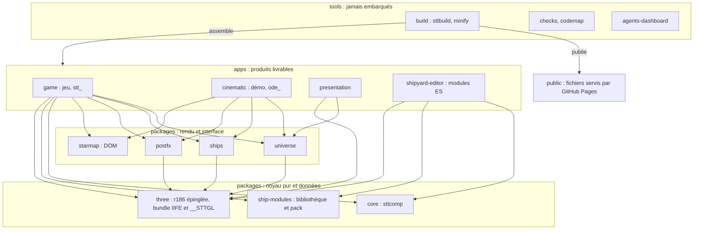

### 5.1 Règles de dépendance (vérifiées par `sttbuild`)

| Couche | Peut utiliser | Interdit | Contrôle proposé |
|---|---|---|---|
| `packages/core` | rien (JS pur) | THREE, `document`, `window`, `Math.random`, `Date.now` | `grep` au build + `node --test` |
| `packages/universe`, `ships`, `postfx` | THREE global (r186 ; r128 dans la démo gelée), `core` ; toute API qui diffère entre r128 et r186 passe par `__STTGL` (§ 9.8) | DOM hors création de canvas hors écran ; globales d'une application | en-tête `@provides`/`@requires` |
| `packages/starmap` | DOM, `core` ; comportement propre au produit **par objet hôte** (`__STARMAP_HOST`) | lire `__CINE`, `__DEMO` (écart actuel à corriger) | `@requires` |
| `packages/ship-modules` | données, scripts Python de production | code d'exécution | — |
| `apps/*` | tout paquet ; leurs propres fichiers | importer une autre application (seule exception : un **artefact construit** comme oracle de test, déclaré) | chemins résolus par le manifeste |
| `tools/*` | tout, en lecture | être embarqué dans une sortie | — |

Dans `apps/game`, la règle de SPEC-010 § 2.4 tient toujours : `src/sim/` ne touche ni THREE ni le DOM et ne parle au
moteur que par `BRIDGE`.

### 5.2 Classement des composants partagés

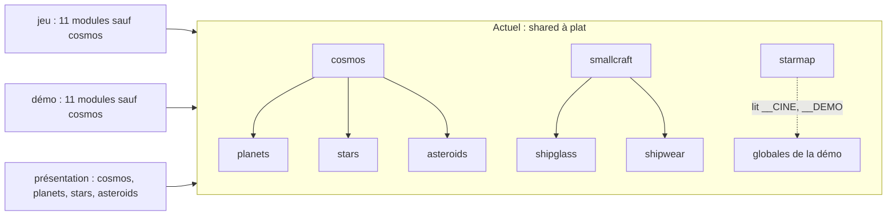

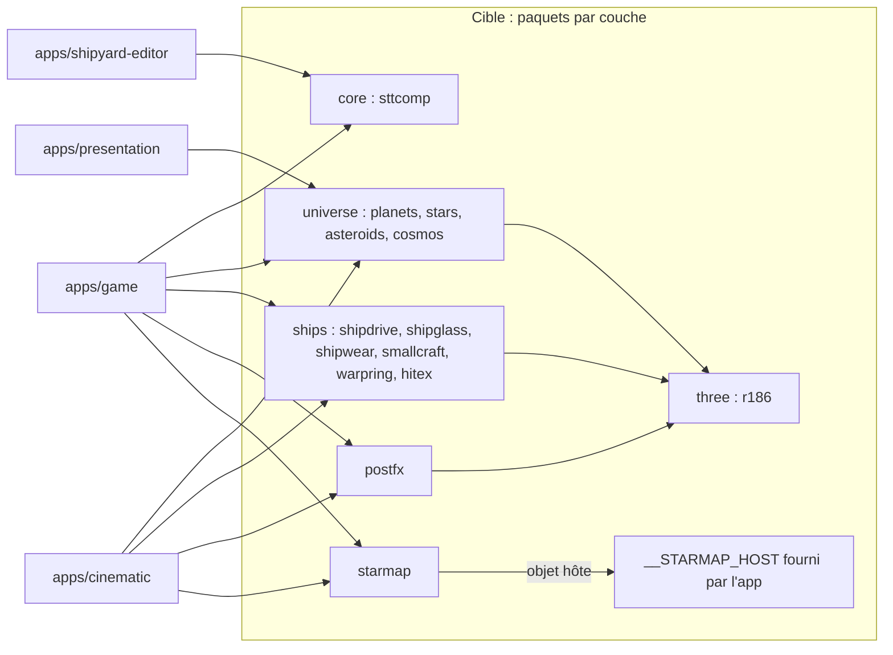

| Paquet | Modules (lignes) | Couche | Dépend de | Consommé par |
|---|---|---|---|---|
| `core` | `sttcomp.js` (futur, ≤ 500 l, contrat L2a) | noyau pur | rien | jeu, éditeur |
| `universe` | `planets` 538, `stars` 368, `asteroids` 242, `cosmos` 726 | rendu | THREE ; `cosmos` → les trois autres | jeu, démo (sauf `cosmos`), présentation |
| `ships` | `shipdrive` 237, `shipglass` 754, `shipwear` 305, `smallcraft` 307, `warpring` 85, `hitex` 64 | rendu | THREE ; `smallcraft` → `shipglass`, `shipwear` ; `hitex` : canvas | jeu, démo |
| `postfx` | `postfx` 113 | rendu | THREE | jeu, démo |
| `starmap` | `starmap` 570 | interface | DOM, objet hôte | jeu, démo |
| `ship-modules` | bibliothèque, textures, `fleet.json`, `build_game_pack.py`, futur `build_modules_geom.py` | données | Python 3, Pillow, gltfpack | jeu (pack), éditeur |
| `three` | avant M6 : `three.r128.min.js`, `GLTFLoader`, `meshopt_decoder` ; après M6 : `package.json` (`three` 0.186.1 exact), `entry.js`, `dist/three-r186.iife.min.js` (suivi), `sttgl.js` (adaptateur) | vendor | — | jeu, présentation, éditeur (la démo embarque son r128 via le moteur figé) |

Les noms de fichiers et de globales (`__PLANETS`, `__SHIPGLASS`…) **ne changent pas** : seul le dossier change, la
concaténation produit donc les mêmes octets.

## 6. Table de renommage et de déplacement

*L'illustration donne la forme d'ensemble ; la table ci-dessous est exhaustive pour les dossiers et les fichiers
remarquables.*

| Ancien chemin | Nouveau chemin | Raison |
|---|---|---|
| **Jeu** | | |
| `sources/` | `apps/game/` | « sources » ne dit pas le produit |
| `sources/build.py` | `apps/game/build.py` | mince : appelle `tools/build/sttbuild` |
| `sources/src/JS/game/ORDER.txt` | `apps/game/ORDER.txt` | manifeste visible ; `codemap.py` sait déjà le lire à la racine du produit |
| `sources/src/JS/game/*.js` | `apps/game/src/engine/*.js` | le niveau `JS/` est vide de sens ; « engine » = moteur existant (SPEC-010) |
| `sources/src/JS/sim/`, `ui/` | `apps/game/src/sim/`, `src/ui/` | même raison |
| `sources/src/JS/vendor/` (r128, 3 fichiers, 665 638 octets) | `packages/three/` en M3 (contenu r128 inchangé, octets identiques) ; en M6 remplacé par `packages/three/dist/three-r186.iife.min.js` | utilisé aussi par la présentation ; le nom du paquet ne porte plus la version, épinglée dans son `package.json` |
| (nouveau, M6) | `packages/three/package.json`, `package-lock.json`, `entry.js` | version unique `three` 0.186.1 et liste des addons exposés (§ 9.6) |
| (nouveau, M6) | `packages/three/sttgl.js` (`window.__STTGL`) | adaptateur r128 / r186 des modules partagés tant que la démo est gelée (§ 9.8) |
| `sources/src/{css,html,data,assets}/` | `apps/game/src/{css,html,data,assets}/` | inchangés sous `src/` |
| `sources/src/test/*_test.py` | `apps/game/tests/e2e/` | séparer Playwright… |
| `sources/src/test/unit/` | `apps/game/tests/unit/` | …et Node |
| `sources/src/docs/spec-*.md`, `img/` | `docs/specs/` (dédoublonnés) | copies d'avant renumérotation (*à vérifier*) |
| `sources/src/docs/spec217/` | `tools/spec-pdf/` | outillage de doc, pas du jeu |
| `sources/tools/codemap.py` | `tools/codemap/codemap.py` | couvre tous les produits |
| `sources/tools/minify.js`, `package.json`, `package-lock.json` | `tools/build/` | une seule installation Node |
| `sources/tools/i18n_parity.mjs` | `tools/checks/i18n_parity.mjs` | contrôle générique |
| `sources/tools/eco_sim.py` | `apps/game/tools/eco_sim.py` | propre au jeu |
| `sources/target/*.html` | `apps/game/dist/` (non suivi) + `public/space-travel.html` | seul le livrable est publié |
| `sources/target/shots/`, `mesures/` | `apps/game/dist/` (non suivi) | sorties de test (*à vérifier* qu'aucune doc ne les cite) |
| **Démo cinématique** | | |
| `observation-des-etoiles/` | `apps/cinematic/` | rôle fonctionnel ; le nom public reste `observation-des-etoiles` |
| `engine/game.html` | `apps/cinematic/engine/game-v2.15.html` | la version figée se lit dans le nom |
| `src/*.js` (8) | `apps/cinematic/src/` | noms conservés (`head_guard2.js`, `live2.js`) pour ne pas changer les sorties |
| `build/build.py` + `build_min.js` | `apps/cinematic/build.py` + `apps/cinematic/ORDER.txt` | une seule liste de 17 modules au lieu de trois |
| `build/package.py` | `archives/` ou `tools/release/` | génère un `build.py` par texte (*à vérifier* s'il sert) |
| `tests/` (46) | `apps/cinematic/tests/` | inchangés |
| `docs/*.jpg` (40) | `apps/cinematic/docs/img/` | images du README de la démo ; doublons supprimés |
| `observation-des-etoiles-v7.19.x(.min).html` (dans le dossier) | supprimés (identiques à la racine) | doublons exacts ; redirections |
| `package.json` | `apps/cinematic/package.json` (nom, version, sans dépendances) | la version de la démo y reste lue |
| **Présentation** | | |
| `presentation/` | `apps/presentation/` | même convention |
| `build/build.py` | `apps/presentation/build.py` | ne lit plus `../sources/` : paquets et `tools/build` |
| `src/`, `tests/`, `docs/SPEC-P*.md` | `apps/presentation/{src,tests,docs}/` | specs propres au produit, avec lui |
| `media/` | `apps/presentation/media/` ; `apercu.jpg` copié dans `public/media/` | `og:image` est une URL absolue |
| `dist/*-test.html` | `apps/presentation/dist/` (non suivi) | déjà dans `.gitignore`, mais suivis de force |
| `index.html` | page de redirection conservée sur place | URL publiée (README, `og:url`) |
| **Éditeur et bibliothèque** | | |
| `STT_modules/sources/index.html`, `manual/` | `apps/shipyard-editor/` | « Chantier naval STT » ; `shipyard-editor` évite la confusion avec l'onglet CHANTIER et `cinematic/src/shipyard.js` |
| import map de l'éditeur (`three@0.169.0`, l. 884–888) | même import map, version lue dans `packages/three/package.json` (0.186.1) et contrôlée par `sttbuild` en M6 | une seule version de three dans le dépôt |
| `STT_modules/sources/STT_ModuleLibrary.json`, `lib/`, `tex/`, `fleet.json` | `packages/ship-modules/library/` | données sources du pack et de l'éditeur (chemins de chargement de l'éditeur à adapter, *à vérifier*) |
| `STT_modules/build_game_pack.py` | `packages/ship-modules/build_game_pack.py` | produit `apps/game/src/assets/` |
| `STT_modules/STT_INTEGRATION.md` | `packages/ship-modules/INTEGRATION.md` | documentation du paquet |
| `STT_modules/Document.txt` | supprimé | copie exacte de `build_game_pack.py` |
| `STT_modules/stt_pipeline-1.1.0-linux-x64.zip` | `archives/` | binaire de 8,8 Mo |
| `STT_modules/stt-meridian*.png` (3) | `docs/illustrations/stt-meridian.png` | deux « copie » (*à vérifier* leur différence) |
| `STT_modules/stt-mercator.json` | *à vérifier* | rôle inconnu |
| **Modules partagés** | | |
| `shared/planets.js`, `stars.js`, `asteroids.js`, `cosmos.js` | `packages/universe/` | univers sans vaisseau |
| `shared/shipdrive.js`, `shipglass.js`, `shipwear.js`, `smallcraft.js`, `warpring.js`, `hitex.js` | `packages/ships/` | rendu des vaisseaux |
| `shared/postfx.js` | `packages/postfx/` | post-traitement |
| `shared/starmap.js` | `packages/starmap/` | seule interface DOM |
| `shared/sttcomp.js` (L2a) | `packages/core/sttcomp.js` | noyau pur |
| **Autres** | | |
| `stt-agents/` (+ `README_1.md`) | `tools/agents-dashboard/` (+ `README.md`) | outil, pas produit |
| `musics/` | `public/musics/` | chargé à côté du HTML publié |
| `space-travel.min.html` (racine) | `public/versions/` (version *à vérifier*) | ancienne version publiée |
| `Voyage Spatial.html` | *à vérifier* : `archives/` ou `public/versions/` | export d'une page de présentation |
| `observation-des-etoiles-v7.19.x(.min).html` (racine) | `public/versions/` | versions publiées regroupées |
| `stt-001.jpg`, `stt-002.jpg` | `docs/illustrations/` | images du README |
| `package-lock.json` (vide) | supprimé | stub sans projet |
| `README.md` (obsolète, cf. `CLAUDE.md`) | réécrit, + `index.html` portail | carte d'entrée exacte |
| `docs/SPEC-010-arbre_des_technologies_et_missions.md` | `docs/specs/` avec un numéro libre | collision avec `SPEC-010-chantier_naval…` |
| `docs/spec-…-v2.17-P1.{md,pdf}`, `DAT*.md` | inchangés | déjà rangés |
| `docs/work_in_progress/` | inchangé | Kanban et prompts référencés par les agents |
| `docs/ADRs/` | nouveau | décisions d'architecture |
| `archives/` | inchangé | historique |
| `TODO.md` | inchangé | journal du mainteneur |

## 7. Pipeline de build et de release cible

**Un socle, des manifestes.** `tools/build/sttbuild.py` (Python 3, bibliothèque standard) regroupe ce que les trois
builds refont : résolution des entrées d'un manifeste (`ORDER.txt`, préfixes `packages/…`), contrôle
`@provides`/`@requires` et des règles du § 5.1, insertion dans un gabarit, bloc `sttData`, images en ligne, appel du
minifieur unique (`tools/build/minify.js`, une seule installation `npm ci`). Chaque application garde un `build.py`
court avec les mêmes commandes qu'aujourd'hui (`compile`, `package`, `test`), ce qui ne change pas les habitudes des
agents. Un point d'entrée commun `python3 tools/build/make.py <app> [étapes]` les enchaîne.

**Bundle du vendor (à partir de M6).** `python3 tools/build/make.py three` lance esbuild sur
`packages/three/entry.js` (dépendance de développement de `tools/build/package.json`, versions exactes, `npm ci`) et
écrit `packages/three/dist/three-r186.iife.min.js`, **suivi** comme l'est le vendor r128 aujourd'hui, avec son
empreinte `sha256` dans `packages/three/dist/SHA256`. `compile` ne fait que lire ce fichier : il reste sans Node,
reproductible et hors-ligne ; le bundle n'est régénéré que lorsque la version épinglée change.

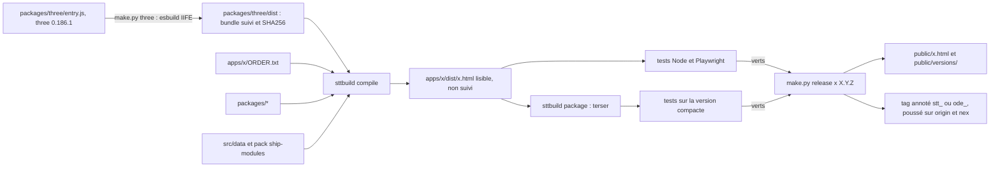

- **Versions** : une seule source par produit (`VERSION` du jeu, `live2.js` + `package.json` de la démo) ; `release`
  vérifie leur accord, comme le fait déjà `package.py` pour la démo.
- **Tags** : `stt_vX.Y.Z` et `ode_vX.Y.Z` inchangés ; la présentation et l'éditeur n'en ont pas (question 5).
- **Démo** : son moteur reste figé ; un changement de `packages/universe`, `ships`, `postfx` ou `starmap` impose de
  la reconstruire et de la publier (règle actuelle de `CLAUDE.md`), `make.py` le signale.

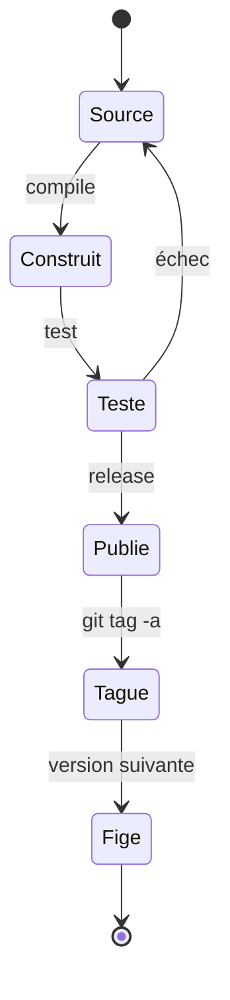

### 7.1 URLs publiées

Préfixe commun : `https://mcgivrer.github.io/csblog/demos/space-travel/`. GitHub Pages n'offre pas de redirection
serveur : une **page de redirection** est un HTML d'environ 1 Ko (`meta refresh` + `location.replace` qui garde
`?seed=…` et `#…`, lien visible, balises `og:` recopiées), sur le modèle de l'actuel `presentation/index.html`.

| URL actuelle | URL cible | Redirection |
|---|---|---|
| `sources/target/space-travel.min.html` (citée par la présentation) | `public/space-travel.html` | page de redirection |
| `sources/target/space-travel.html` | `public/space-travel.html` | page de redirection |
| `space-travel.min.html` | `public/versions/space-travel-vX.Y.min.html` (*à vérifier*) | page de redirection |
| `observation-des-etoiles-v7.19.{1,2}{,.min}.html` | `public/versions/` même nom ; dernière aussi en `public/observation-des-etoiles.html` | 4 pages de redirection |
| `observation-des-etoiles/observation-des-etoiles-v7.19.x…` | idem | 4 pages de redirection |
| `presentation/` et `presentation/dist/presentation(.min).html` | `public/presentation.html` | `index.html` conservé + 2 pages |
| `presentation/media/apercu.jpg` (`og:image`) | `public/media/presentation-apercu.jpg` | fichier conservé à l'ancien chemin |
| `Voyage Spatial.html` | *à vérifier* | page de redirection |
| `stt-agents/index.html` | `tools/agents-dashboard/index.html` | page de redirection |
| `STT_modules/sources/index.html` | `apps/shipyard-editor/index.html` | page de redirection |
| `docs/work_in_progress/kanban.html` | inchangée | — |
| (nouvelle) | `index.html` : portail des 4 produits | — |

Environ 16 pages de redirection, vérifiées par un test de liens (`http.server` + requête de chaque URL du tableau).

## 8. Plan de migration en phases

*Chaque phase est un commit (ou une PR) autonome, annulable par `git revert`, et mesurée par les mêmes vérifications.
La frise montre M0 à M5 ; la phase M6 (Three.js r186), ajoutée par l'amendement, est détaillée au § 9.*

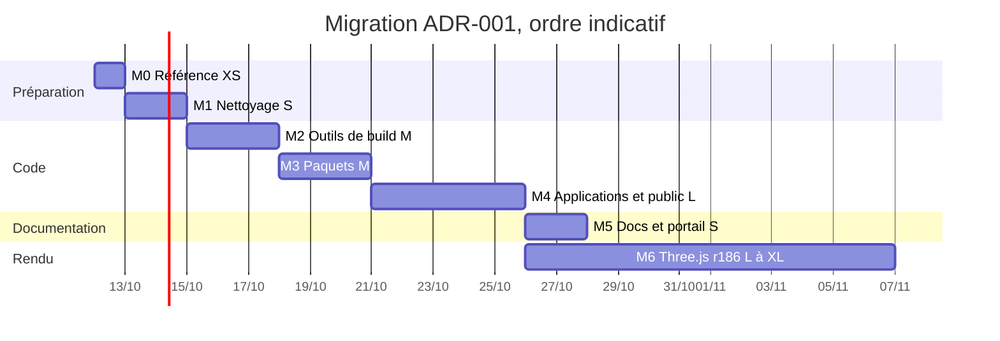

| Phase | Contenu | Vérifications | Agents, Kanban, docs | Taille |
|---|---|---|---|---|
| **M0** Référence | empreintes `sha256` des sorties actuelles (`target/`, `dist/` de la démo et de la présentation), liste des URLs, script `tools/checks/urls.py` | script vert sur l'existant | carte Kanban « ADR-001 » | XS (20 k) |
| **M1** Nettoyage | supprimer `Document.txt`, stubs `package-lock.json`, doublons exacts d'images ; zip vers `archives/` | aucun build touché ; `md5sum` avant suppression | listes noires inchangées | S (40 k) |
| **M2** Outils | `tools/build/sttbuild.py`, `minify.js`, une installation Node ; `ORDER.txt` de la démo ; les trois `build.py` deviennent minces (dossiers encore à l'ancienne place) | sorties **identiques octet pour octet** à M0 ; 29 + 46 + 4 tests verts | `CLAUDE.md` § build | M (80 k) |
| **M3** Paquets | `shared/` → `packages/*` ; préfixes d'`ORDER.txt` ; `codemap.py` (`DIRS`) ; règles § 5.1 en avertissement | octets identiques ; `CODEMAP.md` régénéré ; `node --test` vert | listes noires et chemins des 4 profils `.claude/agents/stt-*.md`, `CLAUDE.md` « Shared modules » | M (80 k) |
| **M4** Applications | `apps/*`, `tools/*`, `public/`, pages de redirection, `public/musics/` | octets identiques des sorties (hors chemin d'écriture) ; tous les tests ; `urls.py` vert sur un `http.server` | profils d'agents, `CODEMAP.md`, `AGENTS.md`, `CLAUDE.md` du dossier et de la racine, prompts du Kanban qui citent des chemins | L (150 k) |
| **M5** Docs | dédoublonner `docs/`, renuméroter le SPEC-010 en collision, README réécrit, portail `index.html` | liens Markdown vérifiés | `renumerotation-specs.md` complété | S (40 k) |
| **M6** Three.js r186 | sous-phases M6.0 à M6.6 du § 9.9 : captures de référence, bundle, adaptateur, palier r160, r186, éditeur, clôture | non-régression visuelle à seuil (§ 9.7) au lieu des octets identiques ; tous les tests | `CLAUDE.md` (vendor, « three r128 »), SPEC-010 § 2, SPEC-011 étape 2, `CODEMAP.md` | L à XL (≈ 340 k) |

Total ≈ 410 k tokens pour M0 à M5, ≈ 750 k avec M6. **Condition d'entrée de M6** : M4 terminée (le paquet
`packages/three` existe et les sorties sont identiques à M0) et la base de captures de référence r128 (M6.0)
validée par le mainteneur. **Ordre avec L2a** : L2a crée `shared/sttcomp.js` et des scripts dans `STT_modules/` ; M0 à
M2 ne touchent pas ces chemins et peuvent passer avant ou pendant L2a ; M3 et M4 passent **entre deux lots**, jamais
pendant un lot qui modifie `ORDER.txt` (point de conflit sérialisé, SPEC-010 § 3.2 règle 13). M6 vient après M4
et peut courir en parallèle de M5 ; elle ne touche pas `sttcomp` (sans THREE, mini-matrices internes), seulement le
vendor, les appels THREE des produits et de `packages/universe`, `ships`, `postfx`. Ses sous-phases passent entre
deux lots, jamais pendant un lot qui modifie le rendu. Rien de ce plan n'a été exécuté ni testé.

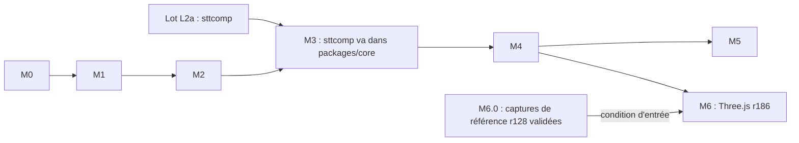

## 9. Migration vers Three.js r186

Ce qui suit sépare ce qui est **établi** (lu dans le dépôt, mesuré, ou lu dans les sources officielles de three.js
citées au § 13) de ce qui est **estimé** (marqué *estimé* ou *à vérifier*). Aucune migration n'a été essayée : seul
un bundle de mesure a été produit hors du dépôt (§ 9.6).

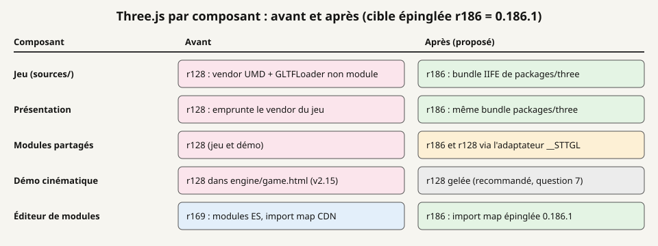

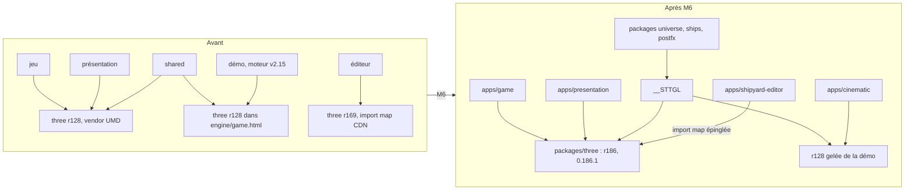

### 9.1 Situation actuelle (établie)

| Composant | Version | Mode d'embarquement | Où |
|---|---|---|---|
| Jeu | r128 | `build.py` l. 31 : `VENDOR = ['three.r128.min.js', 'GLTFLoader.r128.min.js', 'meshopt_decoder.r128.js']`, insérés au marqueur `/*@VENDOR@*/` (`index.template.html` l. 297) dans un `<script>` classique ; `THREE` global | `sources/src/JS/vendor/` : 603 445 + 40 328 + 21 865 = 665 638 octets ; le `GLTFLoader` est l'ancien `examples/js` r128 qui étend `THREE.Loader` global |
| Présentation | r128 | `presentation/build/build.py` l. 21 lit `../sources/src/JS/vendor/three.r128.min.js` seul (pas de loader) | vendor du jeu |
| Modules partagés | r128 | concaténés dans le jeu et dans la démo | `shared/` (12 fichiers) |
| Démo cinématique | r128 (*à vérifier* : seule la chaîne `"128"` a été trouvée, pas `REVISION=`) | `engine/game.html` (6 931 695 octets, moteur v2.15 figé) où `build.py` insère `src/` et `shared/` | `observation-des-etoiles/engine/` |
| Éditeur | r169 | `<script type="importmap">` l. 884–888 vers `cdn.jsdelivr.net/npm/three@0.169.0` (`build/three.module.js`, `examples/jsm/`) ; addons `GLTFLoader`, `OrbitControls`, `RoomEnvironment`, `BufferGeometryUtils`, `EffectComposer`, `RenderPass`, `UnrealBloomPass`, `OutputPass`, `ShaderPass` ; déjà `outputColorSpace`, `AgXToneMapping`, `colorspace_fragment` | `STT_modules/sources/index.html` ; donc pas hors-ligne aujourd'hui. `build_viewer_standalone.py` (projet Blender, hors dépôt) non lu : *à vérifier* |

### 9.2 Cible

Une seule version, **r186 épinglée (`three` 0.186.1 exact)**, dans `packages/three/package.json` + `package-lock.json`,
pour le jeu, la présentation, l'éditeur et les modules partagés. La release r186 est datée du 24/09/2026 dans l'API
des releases GitHub ; la version npm 0.186.1 a été vérifiée par le CP. Sa distribution (lue sur jsDelivr) est
`"type": "module"` : `build/three.module.js` (662 772 octets) qui importe `build/three.core.js` (1 458 113 octets),
non minifiés, addons dans `examples/jsm`. Il n'y a plus de build global : `build/three.min.js` répond 200 pour 0.160.0
et 404 pour 0.161.0 (le guide de migration date le retrait de r161) ; `examples/js/loaders/GLTFLoader.js` répond 200
pour 0.147.0 et 404 pour 0.148.0 (retrait de `examples/js` en r148).

### 9.3 Changements cassants établis entre r128 et r186

Lus dans le guide de migration officiel (sections « rN → rN+1 »), les notes de release GitHub et les deux billets du
forum three.js cités au § 13. Le guide recommande de monter **par paliers d'environ dix versions**, les
avertissements de dépréciation durant dix versions.

| Version | Changement | Concerne le dépôt ? |
|---|---|---|
| r137 | décodage sRGB en GLSL retiré ; import map requise pour les modules ES | éditeur (déjà conforme) |
| r138 | `WebGLMultisampleRenderTarget` retiré | non (0 occurrence) |
| r145 | alias `*BufferGeometry` dépréciés | non : seul `InstancedBufferGeometry` (classe réelle, pas un alias) est utilisé |
| r147 | `decay` des `PointLight`/`SpotLight` = 2 par défaut | les `PointLight` du jeu passent déjà `decay` 2 ; autres *à vérifier* |
| r148 | `examples/js` retiré : addons en modules ES seulement | oui : `GLTFLoader` et `meshopt_decoder` du jeu |
| r151 | `InstancedMesh.frustumCulled` vrai par défaut | 3 créations à vérifier |
| r152 | `outputEncoding` → `outputColorSpace`, `Texture.encoding` → `colorSpace`, `sRGBEncoding` → `SRGBColorSpace`, `LinearEncoding` → `LinearSRGBColorSpace`, `ColorManagement.enabled` vrai par défaut (les couleurs hexadécimales sont lues comme sRGB) | oui (§ 9.4, lignes 1 à 3 et 8) |
| r153 | WebGL 1 déprécié ; cibles de rendu de `EffectComposer` en `HalfFloatType` | éditeur (composer) |
| r154 | chunk `encodings_fragment` renommé `colorspace_fragment` | oui : `shipglass.js` |
| r155 | `useLegacyLights` faux par défaut : plus de facteur π sur les intensités, `PointLight`/`SpotLight` en candela ; tone mapping « en ligne » appliqué seulement au rendu à l'écran (comme l'espace de sortie) | oui : 17 lumières, `postfx.js` |
| r157 | structure GLSL `GeometricContext` retirée : les shaders patchés par `onBeforeCompile` peuvent casser | oui : `shipwear.js` (§ 9.4, ligne 5) |
| r161 | `build/three.js` et `build/three.min.js` retirés | oui : vendor du jeu et de la présentation |
| r163 | WebGL 1 retiré de `WebGLRenderer` | oui : machines sans WebGL 2 exclues |
| r165 | `useLegacyLights` retiré (notes de release r165) | oui : pas de repli sur l'ancien éclairage |
| r170 | `Material.type` statique ; mipmaps toujours générées si `generateMipmaps` | *à vérifier* (aucune écriture de `.type` trouvée) |
| r183 | `Clock` déprécié au profit de `Timer` | 2 usages (jeu, éditeur) |
| r186 | `Object3D.dispose()` ajouté | non : aucune sous-classe de `Object3D` dans le code |

### 9.4 Inventaire mesuré de l'API utilisée

Décompte par expression régulière (script hors dépôt) sur `sources/src/JS/{game,sim,ui}` (jeu), `shared/`,
`observation-des-etoiles/src` (démo, hors moteur figé), `presentation/src` et `STT_modules/sources/index.html`
(éditeur). Un même site peut compter pour deux motifs (`t.encoding = THREE.sRGBEncoding`). Total des `THREE.` :
665 / 320 / 258 / 67 / 202 = 1 512.

| # | Motif | Jeu / shared / démo / prés. / éditeur | Changement (version) | Effort |
|---|---|---|---|---|
| 1 | `sRGBEncoding`, `LinearEncoding` | 8 / 1 / 0 / 5 / 0 = 14 | renommés (r152) | XS, mécanique |
| 2 | `.encoding =` | 5 / 2 / 1 / 1 / 0 = 9 | `.colorSpace` (r152) | XS |
| 3 | `outputEncoding` (dont `postfx.js` l. 91, `28-propulsion…` l. 104) | 4 / 2 / 1 / 4 / 0 = 11 | `outputColorSpace` (r152) ; cibles de rendu linéaires | XS à S |
| 4 | `#include <encodings_fragment>` | 0 / 1 / 0 / 0 / 0 | `colorspace_fragment` (r154) | XS |
| 5 | patch de `lights_fragment_begin` (`shipwear.js` l. 169, `LIGHTS_HOLD`) | 0 / 1 / 0 / 0 / 0 | cherche `getDirectionalDirectLightIrradiance( directionalLight, geometry, directLight )` et appelle `RE_Direct( directLight, geometry, material, reflectedLight )` ; en r186 ces textes n'existent plus (lu : `getDirectionalLightInfo( directionalLight, directLight )`, `RE_Direct( directLight, geometryPosition, geometryNormal, geometryViewDir, geometryClearcoatNormal, material, reflectedLight )`) : le remplacement échoue en silence et l'appel ne compile plus (r157) | S, GLSL à réécrire |
| 6 | `onBeforeCompile` (`asteroids`, `shipdrive`, `shipwear`, `smallcraft`) avec remplacement de chunks `common` 8, `begin_vertex` 3, `map_fragment` 3, `normal_fragment_maps` 3, `emissivemap_fragment` 2, `lights_fragment_end` 1, `metalnessmap_fragment` 1, `project_vertex` 1 | 0 / 8 / 0 / 0 / 0 | tous ces chunks existent encore en r186 (lu dans `ShaderChunk`), mais leur contenu a changé | M, vérification visuelle |
| 7 | lumières `PointLight`, `AmbientLight`/`HemisphereLight`, `DirectionalLight` | 8 / 2 / 6 / 1 / 0 = 17 | ×π pour ambiante, hémisphérique, directionnelle ; candela pour les ponctuelles (r155, r165) ; l'éditeur est déjà en éclairage physique | S + réglage visuel |
| 8 | littéraux `0x` à 6 chiffres ; `convertSRGBToLinear` | 145 / 86 / 80 / 3 / — = 314 ; 2 / 7 / 1 / 0 | lus comme sRGB (r152) | décision globale (§ 9.5) : S à M |
| 9 | `ShaderMaterial` 92 ; `gl_FragColor` 87 ; `texture2D(` 90 ; `gl_FragDepthEXT` 1 | 23 / 26 / 20 / 11 / 12 (matériaux) | encore acceptés : `three.module.js` r186 définit `gl_FragColor pc_fragColor`, `texture2D texture`, `gl_FragDepthEXT gl_FragDepth` | 0 modification ; vérification visuelle |
| 10 | `extensions = { derivatives, fragDepth }` | 0 / 4 / 0 / 0 / 0 | natifs en WebGL 2 ; plus lus par r186 (0 occurrence) | XS, nettoyage facultatif |
| 11 | `new THREE.InstancedMesh` (15-asteroides l. 49, 20n-ports l. 100, `cine.js` l. 1068) | 2 / 0 / 1 / 0 / — | culling actif (r151) | XS |
| 12 | `GLTFLoader`, `meshopt` | 2 + 4 / 0 / 0 / 0 / 3 | addons en modules ES seulement (r148) | intégration (§ 9.6) |
| 13 | `THREE.Clock` | 1 / 0 / 0 / 0 / 1 | déprécié (r183) | XS |
| — | absents (0) : `physicallyCorrectLights`, `THREE.Geometry`, `Face3`, `THREE.Math.`, `Lensflare`, `LOD`, `MeshPhong`/`MeshLambert`, `WebGLMultisampleRenderTarget`, alias `*BufferGeometry` | | | |

**Sites à modifier** (lignes 1 à 5, 7, 13) : **55** = jeu 26, `shared/` 9, présentation 11, éditeur 1, démo 8
(seulement si elle est rebasée). S'y ajoutent une décision globale sur les 314 couleurs, 3 `InstancedMesh` à
contrôler, et 92 `ShaderMaterial` + 8 `onBeforeCompile` à vérifier à l'image.

### 9.5 Changements de rendu attendus

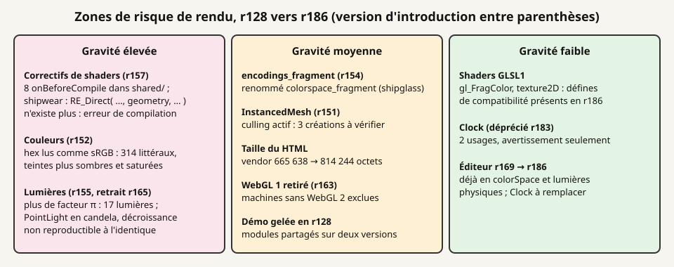

| Zone | Établi (source) | Effet probable (*estimé*) | Parade proposée |
|---|---|---|---|
| Couleurs | r152 : hex et CSS lus comme sRGB puis convertis en linéaire ; le jeu sort déjà en sRGB (`05-scene-three-js.js` l. 8), cas que le billet r152 dit « sans perte » pour les textures | les 314 couleurs écrites pour r128 (lues alors comme linéaires) sortiront plus sombres et plus saturées | palier : `THREE.ColorManagement.enabled = false` (propriété présente en r186) pour garder l'aspect, puis recalage décidé (question 6) |
| Lumières | r155 : plus de facteur π ; ponctuelles en candela ; décroissance ancienne « non reproductible » (billet r155) | scène d'environ π fois plus sombre sans correction ; halos des ponctuelles différents | multiplier ambiante, hémisphérique et directionnelle par π ; recaler les ponctuelles à l'image |
| Post-traitement | r155 : tone mapping et espace de sortie appliqués seulement au rendu à l'écran | `postfx.js` rend la scène dans `rtScene` (l. 91–97) : sans ACES ni sRGB à l'arrivée, image délavée ou trop contrastée (*déduit* de la lecture) | appliquer `tonemapping_fragment` + `colorspace_fragment` dans la passe finale, à la manière d'`OutputPass` |
| Shaders patchés | r157 : `GeometricContext` retiré ; r154 : chunk renommé | erreur de compilation de `shipwear` (cales éclairées), `shipglass` sans conversion de sortie | réécriture via `__STTGL.chunk()` (§ 9.8) |
| WebGL 1 | retiré en r163 | un poste sans WebGL 2 ne lance plus le jeu ; aucune mesure du parc | message d'erreur explicite au démarrage, comme SPEC-011 le prévoit pour WebGPU |
| ACES | non vérifié si l'implémentation d'`ACESFilmicToneMapping` a changé entre r128 et r186 | — | couvert par les captures |

### 9.6 Options d'intégration dans un HTML autonome

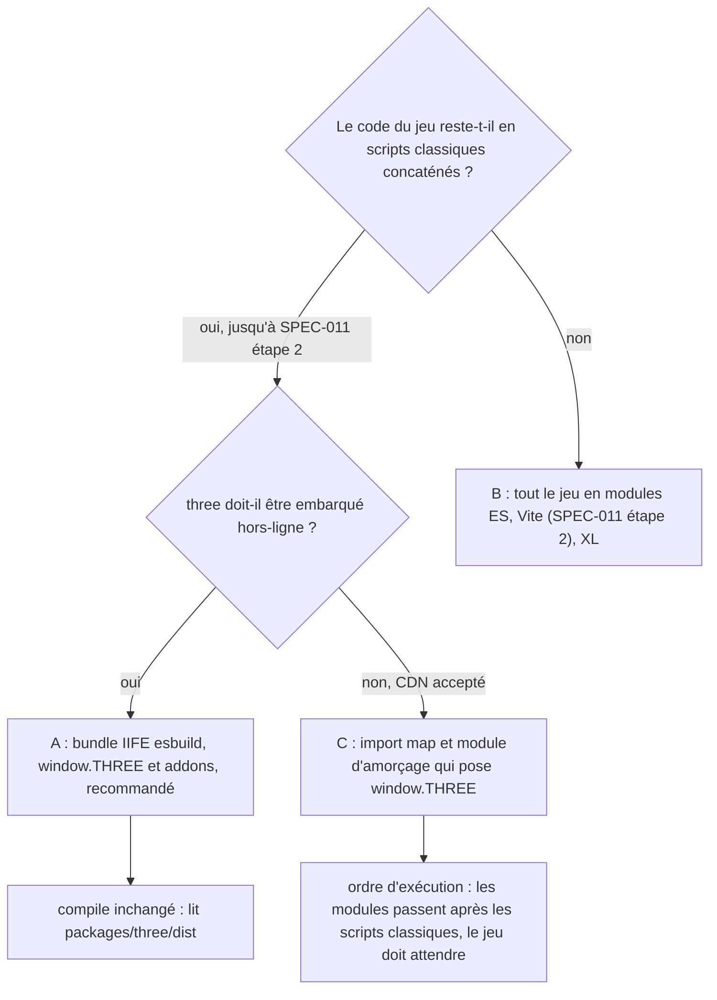

| Option | Principe | Avantages | Coûts et risques |
|---|---|---|---|
| **A** | `entry.js` importe `three` et les addons (`GLTFLoader`, `MeshoptDecoder`), les pose sur `window.THREE` ; esbuild `--bundle --minify --format=iife` ; le fichier produit remplace les trois fichiers r128 au marqueur `/*@VENDOR@*/` | aucun changement du modèle de scripts classiques ni d'`ORDER.txt` ; un seul HTML hors-ligne ; build reproductible (bundle suivi + `SHA256`) ; même entrée réutilisable par Vite plus tard | une dépendance de développement (esbuild) ; bundle plus gros : **814 244 octets mesurés** (entrée de mesure hors dépôt, esbuild 0.25.12, three 0.186.1, `GLTFLoader` + `MeshoptDecoder`, `import *` donc sans élagage) contre 665 638 pour r128, soit +148 606 octets (+2,5 % du HTML compact de 6 031 797 octets) ; 209 261 octets en gzip contre 148 742 pour le seul `three.r128.min.js` |
| **B** | passer tout le jeu en modules ES (SPEC-011 étape 2) | forme finale, élagage réel | XL ; mêle deux changements risqués (portée globale de 11 000 lignes et rendu) ; contraire à F8 |
| **C** | import map + `<script type="module">` d'amorçage | pas d'outil de bundle | hors-ligne seulement avec des URL `data:` ou `blob:` (*à vérifier*) ; les modules s'exécutent après les scripts classiques, il faut retarder tout le démarrage du jeu ; deux mécanismes de chargement |

**Recommandation : A.** C'est la seule option qui garde intact le modèle « scripts classiques concaténés dans un
scope global » (F3, F4 hors rendu, F8) tout en sortant de r128 ; elle reste compatible avec SPEC-011 : le jour de
l'étape 2, Vite importe `three` depuis le même `packages/three` et `entry.js` disparaît. L'éditeur, déjà en modules
ES, garde son import map, épinglée à 0.186.1 ; l'embarquer hors-ligne relève de la question 1.

### 9.7 Stratégie de test : non-régression visuelle

F4 (octets identiques) ne peut pas tenir pendant M6 ; il est remplacé, pour cette phase seulement, par :

1. **Base de référence (M6.0)** : sur le commit de départ, taguer `three-r128-final` (tag technique, en plus des
   tags de release) ; rejouer les tests Playwright qui écrivent des captures (`target/shots`, 14 fichiers
   aujourd'hui) : `titre`, `smoke`, `vol`, `pilote`, `echelle`, `passage`, `gros_plans`, `survol`, `carte`,
   `modulaire`, `largage`, `missions`, `commerce` pour le jeu, `photo`, `lecteur`, `realisateur`, `cosmos` pour la
   présentation ; graine fixe (`?seed=`), même Chromium, même machine, même taille de fenêtre.
2. **Scènes de référence** à ajouter si absentes (*à vérifier*) : cale éclairée (`shipwear`), navette en hangar
   (`smallcraft`), verrière (`shipglass`), post-traitement actif (`postfx`), champ d'astéroïdes instancié.
3. **Comparaison** : script Python (Pillow, déjà utilisé par `ship-modules`) par paire de captures : part de pixels
   dont l'écart dépasse 16/255 sur un canal, et écart moyen. **Seuils proposés** : M6.1 (bundle en r128) ≤ 0,5 % ;
   paliers suivants ≤ 2 % ou revue humaine sur planche avant/après, puis nouvelle base acceptée (question 6).
4. **Tests fonctionnels** : les 21 + 8 tests du jeu et les 4 de la présentation restent verts ; aucun ne lit
   `THREE.REVISION`. Les 46 de la démo ne sont concernés que si elle est rebasée.
5. **Retour arrière** : chaque sous-phase est un commit ; revenir à r128 = `git revert` ou restaurer
   `packages/three/dist` depuis `three-r128-final` ; pas de release `stt_` avant la clôture M6.6.

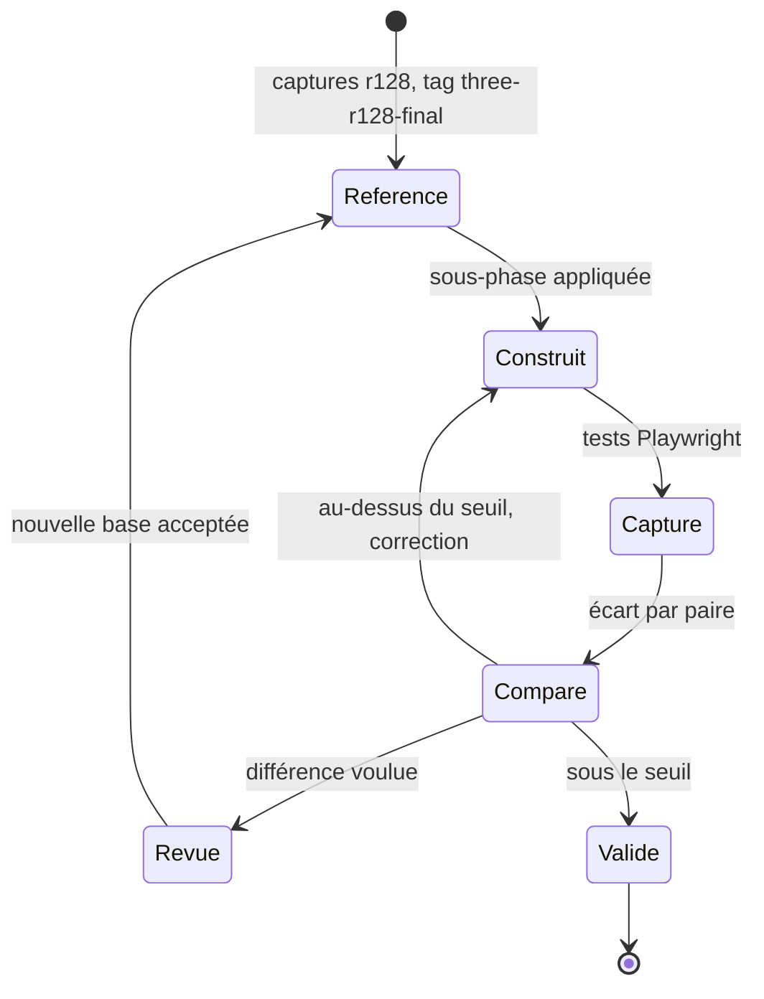

### 9.8 Cas de la démo cinématique

La démo n'utilise pas le vendor : son r128 est dans `engine/game.html`, avec le moteur v2.15 que la règle actuelle
interdit de modifier. Deux voies :

- **Gel en r128 (recommandé)** : coût nul pour la démo ; ses 8 sites (`src/`) restent tels quels. En contrepartie,
  les modules de `packages/universe`, `ships`, `postfx` tournent sous deux versions. **Règle proposée** : un module
  partagé n'appelle jamais directement une API qui diffère entre r128 et r186 ; il passe par `window.__STTGL`
  (`packages/three/sttgl.js`, environ 40 lignes *estimées*), qui lit `THREE.REVISION` une fois et expose
  `srgb(texture)`, `outputSpace(renderer)`, `targetSpace(rt)`, `chunk('colorspace')`, `lightsPatch(...)` et
  `lightScale` (1 ou π). `sttgl.js` est ajouté à `ORDER.txt` du jeu et au manifeste de la démo, avant les modules
  partagés : la sortie de la démo change, donc reconstruction et release `ode_` (règle de `CLAUDE.md`). L'adaptateur
  est retiré quand la démo est rebasée.
- **Rebase sur le moteur du jeu** : supprime le double support, mais c'est le chantier XL déjà écarté (§ 11,
  SPEC-011 § 5).

`sttcomp` n'est pas concerné : il n'utilise pas THREE (contrat L2a) et sert tel quel au jeu et à l'éditeur.

### 9.9 Sous-phases et estimation

Estimations en tokens d'agent (échelle XS 20 k, S 40 k, M 80 k, L 150 k, XL 300 k), *estimées* d'après l'inventaire.
Dates fictives, pour l'ordre seulement.

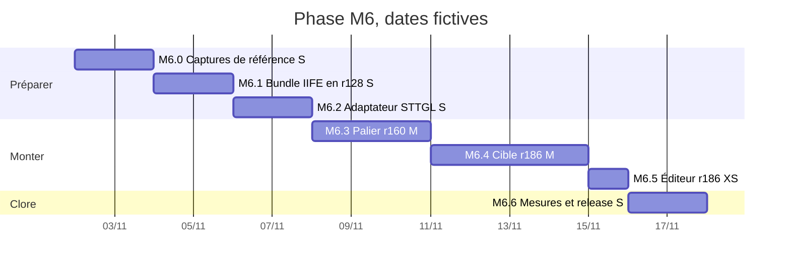

| Sous-phase | Contenu | Vérification | Taille |
|---|---|---|---|
| M6.0 | captures de référence, scènes ajoutées, script de comparaison, tag `three-r128-final` (possible dès M2) | base validée par le mainteneur | S (40 k) |
| M6.1 | `packages/three` + esbuild ; bundle de **r128** depuis `three.module.js` et `examples/jsm` r128 (présence d'un `meshopt_decoder` module en r128 *à vérifier*, sinon fichier actuel gardé à part) : seul le mode d'embarquement change | écart ≤ 0,5 % ; tests verts | S (40 k) |
| M6.2 | `sttgl.js` et passage des 9 sites de `shared/` par l'adaptateur | jeu et démo identiques à l'image | S (40 k) |
| M6.3 | palier **r160** (dernier avec `useLegacyLights`, encore présent jusqu'en r164) : renommages colorSpace (34 sites), `ColorManagement.enabled = false`, `useLegacyLights = true`, `colorspace_fragment`, `shipwear` réécrit, `postfx` passe finale, `InstancedMesh` | écart ≤ 2 % ou revue | M (80 k) |
| M6.4 | **r186** : éclairage physique (17 lumières, π et candela), retrait de `useLegacyLights`, `Clock` → `Timer`, décision couleurs (question 6), message sans WebGL 2 | revue sur planche ; nouvelle base | M (80 k) |
| M6.5 | éditeur : import map 0.186.1 contrôlée par `sttbuild`, `Clock`, sonde L2a | sonde Playwright de l'éditeur | XS (20 k) |
| M6.6 | taille, temps de compilation des programmes, images par seconde (tests longue durée), docs, release `stt_` mineure | budgets § 9.10 | S (40 k) |

**Total M6 ≈ 340 k tokens** (entre L et XL), *estimé*, hors rebase de la démo.

### 9.10 Risques et parades

| Risque | Gravité | Parade |
|---|---|---|
| Aspect changé (couleurs, lumières, post-traitement) | élevée | paliers, `ColorManagement` coupé au palier r160, planches avant/après, décision du mainteneur |
| Shaders patchés qui ne compilent plus | élevée | réécriture via `__STTGL`, scène de référence par module patché ; `renderer.debug.checkShaderErrors` dans les tests |
| Performance (programmes plus longs à compiler, WebGL 2 seul) | moyenne | mesure `renderer.info` et durée du premier rendu avant et après (*à mesurer*) |
| Taille du HTML (+148 606 octets mesurés pour le vendor) | moyenne | accepté si le mainteneur le valide (SPEC-011 : budget à fixer après l'étape 1) ; élagage réel seulement avec l'option B |
| Éditeur cassé par le changement de version | faible | sonde L2a avant et après M6.5 ; l'éditeur est déjà sur l'API r152+ |
| Double version dans `shared/` qui dure | moyenne | adaptateur à périmètre fermé ; retrait programmé avec le rebase de la démo |

## 10. Conséquences

**Positives**
- Le chemin dit le rôle et la couche ; un agent sait sans lire le code qu'un fichier de `packages/core` est testable
  sous Node.
- Plus de copie exacte suivie (environ 30 Mo de HTML et 4 Mo d'images en moins dans l'arbre courant, *à vérifier*
  après dédoublonnage) ; une installation Node au lieu de trois.
- Une seule liste de modules par produit ; règles de dépendance contrôlées au build.
- Publication regroupée dans `public/`, portail d'entrée, URLs stables et courtes ; la musique devient accessible.
- Forme compatible avec SPEC-011 étape 2 : chaque paquet peut recevoir `package.json`, `export` et TypeScript sur place.
- (M6) Une seule version de Three.js, maintenue en amont ; accès aux addons actuels, à `Timer`, aux corrections de
  quatre ans et demi ; base nécessaire au `WebGPURenderer` de SPEC-011 étape 5.

**Négatives**
- Tous les chemins cités dans `docs/specs/`, les prompts du Kanban et les profils d'agents vieillissent ; les anciens
  contrats de lot restent avec leurs chemins d'origine (historique).
- Environ 16 pages de redirection à garder durablement.
- L'historique `git log` d'un fichier déplacé demande `--follow`.
- (M6) L'aspect du jeu change, au moins pour les lumières ; HTML plus lourd de 148 606 octets (vendor mesuré) ;
  WebGL 2 obligatoire ; une dépendance de développement (esbuild) ; adaptateur `__STTGL` tant que la démo est gelée.

**Risques et parades**

| Risque | Parade |
|---|---|
| Ordre de concaténation cassé | M2 et M3 ne changent que la résolution des chemins ; comparaison d'empreintes obligatoire |
| URL publiée perdue | test `urls.py` sur la liste de M0, dans la PR de M4 |
| Éditeur cassé (chemins relatifs vers `library/`) | sonde Playwright de L2a avant et après M4 |
| Projet Blender qui recopie l'ancien chemin | question 2 ; README du paquet `ship-modules` |
| Conflit avec un lot en cours | M3 et M4 seulement entre deux lots |
| Moteur figé de la démo incompatible avec un paquet qui évolue | règle actuelle conservée : reconstruire et tester la démo à chaque changement de paquet de rendu |
| (M6) Régression de rendu ou shader qui ne compile plus | non-régression visuelle à seuil, paliers r128 → r160 → r186, tag `three-r128-final` (§ 9.7, § 9.10) |
| (M6) Module partagé qui casse la démo r128 | toute API différente passe par `__STTGL` ; démo reconstruite et testée à chaque sous-phase |

## 11. Alternatives écartées

- Faire suivre le moteur courant à la démo (supprimer `engine/game.html`) : chantier XL, hors périmètre (SPEC-011 § 5).
- Sous-modules git pour `packages/` : synchronisation manuelle, contraire à F6.
- Passer tout de suite aux modules ES et à Vite : relève de SPEC-011 étape 2, après la mesure de l'étape 1.
- Renommer les globales (`__PLANETS` → `UNIVERSE.planets`) : change le code et les sorties, sans gain structurel ici.
- Renommer en français (`applis/`, `paquets/`) : contraire à l'API anglaise et aux conventions d'outillage.
- Publier dans une branche `gh-pages` : changerait le mode de publication du blog entier.
- Git LFS pour `archives/` (124 Mo) : utile mais indépendant de cette réorganisation.
- Rester en r128 : version sans build ni addons publiés depuis r161 et r148, sans correctifs ; bloque SPEC-011.
- Sauter directement à `WebGPURenderer` : change aussi le langage des shaders (TSL) des 92 `ShaderMaterial` ; c'est
  l'étape 5 de SPEC-011, après une base WebGL 2 à jour.
- Monter r128 → r186 d'un seul coup : contraire à la recommandation du guide officiel (paliers de dix versions) ;
  le palier r160 garde `useLegacyLights` pour séparer couleurs et lumières.
- Monter par paliers de dix (r138, r148, …) : six bundles et six bases de captures pour peu de sites concernés ;
  un palier suffit (r160).
- Intégration par import map (option C) ou passage complet aux modules ES (option B) : § 9.6.
- Garder une copie de r128 et une de r186 dans le jeu (choix à l'exécution) : double taille, contraire à F6.
- Rebaser la démo sur le moteur du jeu pendant M6 : XL, hors périmètre (§ 9.8).

## 12. Questions ouvertes pour le mainteneur

1. **Quelle copie de l'éditeur fait foi**, le dépôt ou le projet Blender ? *Recommandation* : le dépôt
   (`apps/shipyard-editor`) ; `build_viewer_standalone.py` rejoint `tools/build/` et le projet Blender lit le dépôt.
2. **Versions archivées dans `main`** : garder chaque version publiée en HTML suivi (6 à 8 Mo chacune) ou les joindre
   aux releases GitHub des tags ? *Recommandation* : `main` ne garde que la dernière version et celles déjà publiées
   (`public/versions/`), les suivantes vont en pièce jointe des releases.
3. **Sorties lisibles suivies** (`target/space-travel.html` 6,5 Mo, pages de test de la présentation) : les retirer
   du suivi ? *Recommandation* : oui en M4, seule la version compacte est publiée.
4. **Calendrier par rapport à L2a** : *Recommandation* : M0 à M2 tout de suite, M3 et M4 juste après la fusion de
   L2a, avant L2.
5. **Tags pour la présentation et l'éditeur** : *Recommandation* : `pres_vX.Y.Z` dès la première version publiée
   de la présentation ; pas de tag pour l'éditeur tant qu'il n'est pas publié seul.
6. **Différences visuelles de r186 : garder l'aspect actuel ou adopter le flux linéaire ?** *Recommandation* :
   garder l'aspect au palier r160 (couleurs non converties, éclairage hérité), puis en r186 corriger les lumières
   (×π, candela) pour retrouver l'aspect à 2 % près, et décider des couleurs sur planche avant/après ; seuil de
   2 % de pixels écartés de plus de 16/255, au-delà revue humaine.
7. **Démo cinématique : gel en r128 ou rebase ?** *Recommandation* : gel, avec l'adaptateur `__STTGL` dans les
   modules partagés ; rebase plus tard avec SPEC-011.
8. **Ordre de M6 par rapport à la réorganisation et aux lots** : *Recommandation* : après M4 (paquet `packages/three`
   en place, sorties encore identiques à M0), après L2a, entre deux lots ; M6.0 dès M2.

## 13. Références

- `demos/space-travel/CLAUDE.md` (builds, modules partagés, tags) ; `AGENTS.md` à la racine.
- `docs/specs/SPEC-010-chantier_naval_et_campagne-V1.0.md` § 2.1 à 2.12 (couches, modules, arborescence, budgets).
- `docs/specs/SPEC-011-implementation_technology_roadmap-V1.0.md` (modules ES, TypeScript, Vite, workers, WebGPU).
- Contrat L2a (brouillon, hors dépôt) : noyau `sttcomp`, `modules-geom.json`, copies divergentes de l'éditeur.
- `STT_modules/STT_INTEGRATION.md` § 13 ; `presentation/README.md` ; `observation-des-etoiles/README.md`.
- `docs/work_in_progress/renumerotation-specs.md` (règles de nommage des SPEC).
- Illustrations : `img/adr-001-avant.svg`, `img/adr-001-apres.svg`, `img/adr-001-arborescence.svg`,
  `img/adr-001-migration.svg`, `img/adr-001-three-versions.svg`, `img/adr-001-three-risques.svg`.
- Three.js, guide de migration officiel (lu le 06/10/2026) :
  `https://github.com/mrdoob/three.js/wiki/Migration-Guide` (sections r128 → r129 à r186 → r187).
- Notes de release r150, r151, r153, r154, r155, r163, r165, r181, r183, r186 (API GitHub
  `repos/mrdoob/three.js/releases`, lue le 06/10/2026).
- Forum three.js : « Updates to color management in three.js r152 » (`discourse.threejs.org/t/50791`) et
  « Updates to lighting in three.js r155 » (`discourse.threejs.org/t/53733`).
- Paquet `three@0.186.1` sur jsDelivr : `package.json`, `build/three.module.js`, `build/three.core.js` (lus pour
  `REVISION = '186'`, la liste `ShaderChunk`, les signatures de `lights_fragment_begin` et les défines GLSL1) ;
  disponibilité de `build/three.min.js` (0.160.0 / 0.161.0) et de `examples/js` (0.147.0 / 0.148.0).
- Mesure du bundle IIFE : esbuild 0.25.12, entrée `import * as T from 'three'` + `GLTFLoader` + `MeshoptDecoder`,
  `--bundle --minify --format=iife` ; fait hors dépôt, non reproduit dans le build.
