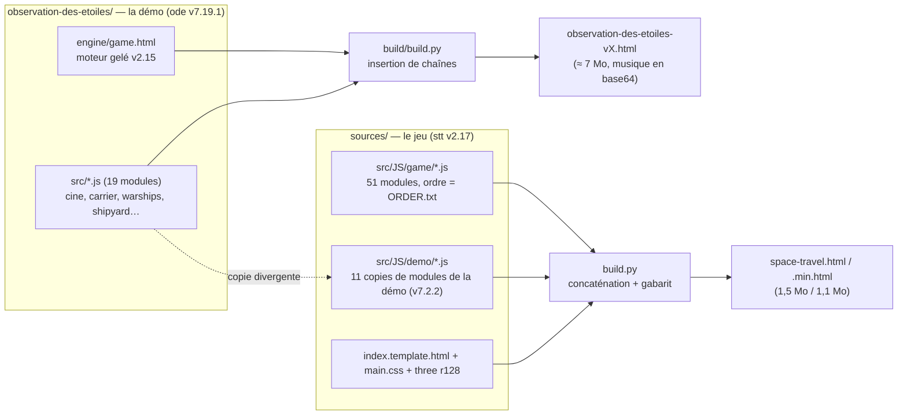
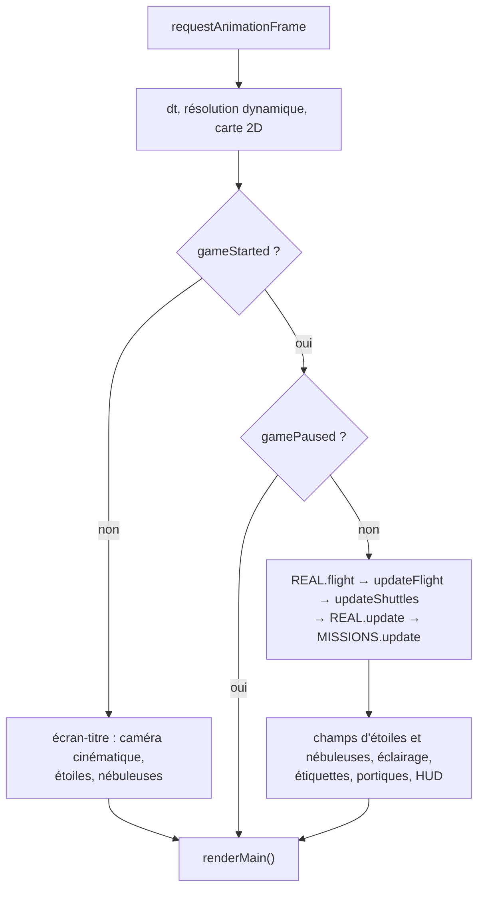
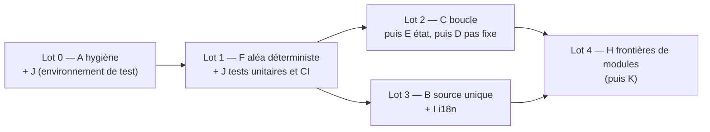

# DAT — Dossier d'architecture technique du moteur Space Travel & Transport

| | |
|---|---|
| **Version étudiée** | jeu `stt_v2.17.0` (`sources/`) et démo `ode_v7.19.1` (`observation-des-etoiles/`) |
| **Date** | 2026-10-02 |
| **Statut** | Étude et propositions, rien n'est implémenté |
| **Auteur** | Claude (rôle architecte), à valider par le mainteneur |

## 1. Objet, périmètre et méthode

Ce document décrit l'architecture actuelle du moteur, relève ses forces et ses faiblesses, et propose des améliorations ordonnées par valeur et par risque.

**Méthode.** Lecture ciblée du code (prologue, rendu en couches, boucle `animate()`, `REAL`/`FLIGHT`, i18n, états globaux, build, tests) et mesures par recherche textuelle sur `sources/src/JS` (13 666 lignes de JS : 62 fichiers, hors Three.js).

**Limites, à lire avant de se fier aux conclusions :**
- Les modules `09` (générateur de vaisseaux), `16`, `20n`, `20p`, `20q`, `26`, `30` n'ont été parcourus que par leurs signatures et leurs en-têtes.
- Aucun profilage sur GPU réel : le rendu logiciel (SwiftShader) donne des ordres de grandeur seulement. Les points « performance » sont des hypothèses à mesurer (§7).
- Les compteurs (`grep`) comptent des occurrences, pas des chemins d'exécution : un `new THREE.Vector3` compté n'est pas forcément dans une boucle chaude.
- Les tests n'ont pas été relancés pour cette étude (voir §4.7 : l'environnement par défaut n'existe pas sur cette machine).

## 2. Vue d'ensemble

Le dépôt livre **deux produits** qui partagent une même famille de code mais pas le même code.

Trois bases de code coexistent :

| Base | Où | Version | Rôle |
|---|---|---|---|
| Moteur du jeu | `sources/src/JS/game` | v2.17 | Jeu jouable, échelle réelle, missions, ports |
| Modules « démo » dans le jeu | `sources/src/JS/demo` | copie de la v7.2.2 | Rendu des étoiles, planètes, vaisseaux repris dans le jeu |
| Démo cinématique | `observation-des-etoiles/src` + `engine/game.html` | v7.19.1 sur moteur v2.15 | Film infini sans pilotage |

## 3. Architecture actuelle

### 3.1 Chaîne de build

- `sources/build.py` : `compile` concatène les modules dans l'ordre de `ORDER.txt` puis les injecte dans le gabarit HTML (`/*@CSS@*/`, `/*@VENDOR@*/`, `/*@JS@*/`) ; `package` minifie avec terser ; `test` lance des scripts Playwright.
- Les modules sont des **scripts classiques en portée globale** : l'ordre de concaténation fait partie du programme. Une seule directive `"use strict"` ouvre le fichier (`00-prologue.js`).
- La démo a son propre build (`build/build.py`, `build_min.js`, `package.py`) qui insère des scripts dans un `engine/game.html` figé. La liste des modules y est **écrite trois fois** (`build.py`, `build_min.js`, `package.py`).
- Livrable : un seul fichier HTML autonome par produit. Cette contrainte est une force à conserver (§6).

### 3.2 Rendu : deux couches, origine flottante, tranches de profondeur

`LAYERS` (`05b-couches-de-rendu.js`) est le cœur du rendu :

1. **Couche galactique** : étoiles, nébuleuses, décor, en unités du jeu (1 u = 1/38 pc), avec la caméra galactique.
2. **Couche système** : planètes, lunes, vaisseau, navettes, en **mètres**, rendue en **origine flottante** (la caméra de rendu reste à l'origine, le monde est décalé le temps du rendu) et par **tranches de profondeur** de la plus lointaine à la plus proche, tampon de profondeur vidé entre deux tranches.

C'est la bonne réponse au problème de précision `float32` d'un univers à l'échelle réelle (de 0,2 m à 10¹⁹ m). Les objets gardent leurs coordonnées absolues pour la logique : le décalage n'existe que pendant le rendu. Les tranches inutilisées sont sautées (`stats.used`).

### 3.3 Boucle de jeu

La boucle est `animate()` (`41-animation-des-systemes-planetaires.js`, ≈ 195 lignes). Elle enchaîne, avec `dt` plafonné à 0,1 s :

Il n'y a **pas de pas de temps fixe** : la simulation avance du `dt` mesuré. Les tests contournent cela en détournant `requestAnimationFrame` et `performance.now` (`window.__step`).

### 3.4 Modules métier et état

Quatorze espaces de noms en IIFE existent (`REAL`, `FLIGHT`, `LAYERS`, `SHIPGEN`, `GP`, `CARGO`, `MISSIONS`, `PORTS`, `LOCAL`, `TITLE`, `SURVOL`, `SHIPFX`, `DYNRES`, `STAR_SAMPLE`, `ASTEROID_TEMPLATES`). Le reste est global : **840 déclarations de haut niveau** (`const`/`let`/`var`/`function`), dont une cinquantaine de `let` mutables (`credits`, `fuel`, `flightPhase`, `gameStarted`, `gamePaused`, `cameraMode`, `jumpState`…).

L'état de partie est donc **réparti** entre plusieurs machines à états qui se recoupent :

| État | Où | Valeurs observées |
|---|---|---|
| `gameStarted`, `gamePaused`, `worldReadyForCinematic` | `24-mode-pause` | booléens |
| `flightPhase` | `28-propulsion-quantique` | `'CRUISE'`, `'ARRIVAL_PAUSE'` |
| `REAL.phase` | `20c-echelle-reelle` | `'IDLE'`, `'ORBIT'`, … (autres valeurs non relevées) |
| `orbitState.active` | `29-economie-credits` | booléen + 15 champs de séquence |
| `GP.state.auto` | `20h-gros-plans` | type de plan automatique en cours |
| `cameraMode`, `jumpState` | `24`, `28` | entier, objet ou `null` |

Aucune transition n'est centralisée : la cohérence repose sur l'ordre d'appel dans `animate()` et sur 38 gardes `typeof X !== 'undefined'` (couplage d'ordre de chargement).

### 3.5 Univers procédural

Excellent point : tout l'univers dérive d'une graine (`xmur3` → `mulberry32`, `rngFor(tag)`), par cellules (`refreshField`). `realizeSystem` convertit un système généré à l'échelle réelle (zone habitable à √L UA, rayons en R⊕, lunes képlériennes). Même graine = même univers.

**Mais** le déterminisme s'arrête à la génération : on compte 37 appels à `Math.random` dans 12 modules du jeu (radio, navettes, plans de gros plans, dialogues, effets de saut, mise en pause). Le déroulement d'une partie n'est donc pas rejouable.

### 3.6 Internationalisation, audio, IA

- Table `I18N` en 4 langues (fr, en, de, es) : **159 clés chacune, parité complète** (vérifiée). `LANG` est fixée pour la session.
- Les modules plus récents (`20p`, `20q`, `20h`, `33`) portent aussi des tables `{fr, en}` en ligne : deux mécanismes coexistent.
- Dialogues radio : script par gabarits = **source de vérité**, réécriture par LLM local (`LanguageModel`) en tâche de fond avec délai de 2 s et repli silencieux. Conception robuste, à garder telle quelle.

### 3.7 Tests

15 scripts Playwright (`sources/src/test/*_test.py`) pilotent Chromium sur le HTML construit et lisent des globales de page. Utiles (fumée, saccades, largage, missions, ports), mais :
- uniquement de bout en bout, aucun test unitaire de logique pure (PRNG, modèle astrophysique, génération de route) ;
- le chemin par défaut des navigateurs (`/opt/pw-browsers`) n'existe pas sur la machine du mainteneur : les tests ne sont pas exécutables tels quels ;
- pas d'intégration continue dans le dépôt.

La démo a 46 scripts Node/Playwright autonomes, bien documentés dans son README, sans exécuteur commun.

## 4. Constats

### 4.1 Forces à préserver

1. Livrable unique et autonome, ouvrable sans serveur ni installation.
2. Pipeline de rendu adapté à l'échelle réelle (origine flottante + tranches).
3. Génération déterministe par graine, avec noms et systèmes reproductibles.
4. IA locale optionnelle, sans dépendance réseau et sans blocage du jeu.
5. Documentation et traçabilité des versions (spécifications, README par version, tags `stt_`/`ode_`).

### 4.2 Duplication et dérive entre les deux produits (priorité haute)

Les 11 modules de `sources/src/JS/demo` sont des copies de la v7.2.2 de la démo. Comparaison avec la démo actuelle (v7.19.1) :

| Module | Écart | Nature |
|---|---|---|
| `asteroids`, `hitex`, `planets`, `postfx`, `shipdrive`, `stars`, `warpring` | 1 ligne | seulement l'en-tête « Copie de… » |
| `starmap` | 84 lignes | adaptation voulue (traductions, règles du jeu) |
| `smallcraft` | 41 lignes | dérive |
| `shipwear` | 60 lignes | dérive (ombre de soute du porte-vaisseaux, v7.6, absente du jeu) |
| `shipglass` | 295 lignes | dérive importante |

Toute correction de la démo (ex. la fuite mémoire de la v7.19) doit être reportée à la main dans le jeu, et rien ne signale qu'elle manque. De plus, le moteur du jeu contient lui-même du code « repris tel quel » de `cine.js` (`realizeSystem`, constantes physiques).

### 4.3 `animate()` : une fonction qui fait tout

- ≈ 195 lignes mêlant simulation, éclairage, magnitudes stellaires, étiquettes DOM, portiques, HUD.
- Blocs dupliqués entre la branche titre et la branche de vol : calcul magnitude → flux → halo, et fondu des nébuleuses.
- Allocations dans la boucle : `clone()` et `new Vector3` par étoile et par image dans la boucle des étiquettes, `new Set()` recréé à chaque image (`hostCells`).
- Écriture DOM (`style.left/top/opacity`) pour chaque étoile étiquetée à chaque image, sans test de changement.
- Le nom des fichiers ne dit plus ce qu'ils contiennent : `40-boucle-principale.js` ne fait que 5 lignes (l'horloge), la boucle est dans `41-animation-des-systemes-planetaires.js`, `updateFlight` dans `36-inertie-de-rotation.js`, `updateShuttles` dans `35-evitement-d-obstacles-pour.js`.

### 4.4 État global et couplage d'ordre

- 840 déclarations globales ; aucune vérification de dépendance entre modules (une faute de frappe ou un ordre erroné ne se voit qu'à l'exécution). Un correctif récent l'illustre : `FLIGHT` inaccessible depuis `updateOrbitDelivery` (ReferenceError, résolu en passant par `REAL.FLIGHT`).
- Aucune transition d'état centralisée (§3.4).
- Plusieurs mécanismes de crochets concurrents : `window.__X`, `LAYERS.units`, `typeof` gardés.

### 4.5 Temps et déterminisme

- Pas de pas de temps fixe : les saccades de caméra signalées dans `TODO.md` (« tressautement ») sont des symptômes typiques d'un `dt` variable qui alimente à la fois la simulation et la caméra. Le code actuel compense par extrapolation, qui « ne tient qu'à cadence parfaitement régulière » (commentaire dans `animate`).
- `Math.random` dans la logique de partie (§3.5) : pas de rejeu, pas de test reproductible.

### 4.6 Paramètre `quality` incohérent

Le jeu (`DYNRES`, `41-…`) comprend `quality=fixed|low` (plafond 2) ; la démo (`live2.js`) comprend `low|high` (plafond 1,5, ou 2 avec `high`) et, depuis la v7.19.1, `high` désactive l'adaptation. Même nom, sémantiques différentes, et deux implémentations de la même résolution dynamique.

### 4.7 Hygiène du dépôt

- `sources/node_modules` est **suivi par git : 5 653 fichiers** (dépendances de `sources/package.json` dont Mermaid, d3 et katex, sans lien avec le code exécuté par le jeu). `sources/target/*.html` (builds, 2,7 Mo) et 6 fichiers `__pycache__` sont aussi suivis.
- Une quinzaine de HTML versionnés de 7 Mo (démo) gonflent l'historique.
- La liste des modules de la démo est triplée (§3.1).
- Les tests dépendent de `/opt/pw-browsers` (§3.7).
- Three.js r128 (2021) est figé et embarqué (603 Ko, 39 % du HTML lisible) ; le code garde des tests de présence (`renderer.outputEncoding`) qui trahissent des écarts d'API.

### 4.8 Risque mémoire dans le jeu non évalué

La v7.19 de la démo a corrigé une fuite (tampons d'effets retenant les vaisseaux libérés, ≈ +120 Mo/h). Le jeu partage des modules de même famille (`shipwear`, `smallcraft`, `20f-greffons-vaisseau`) mais **aucun test de longue durée n'existe côté jeu** ; on ne sait pas s'il est touché.

## 5. Propositions

Chaque proposition précise le bénéfice, l'effort (S < 1 j, M 1 à 3 j, L > 3 j) et le risque.

| # | Proposition | Bénéfice | Effort | Risque |
|---|---|---|---|---|
| **A** | **Hygiène du dépôt** : désuivre `node_modules`, `__pycache__`, `sources/target` ; `.gitignore` ; `package.json` + `npm ci` documentés ; builds publiés en artefacts (Pages ou releases) | Dépôt léger, diffs lisibles, fin des conflits sur builds | S | Faible |
| **B** | **Source unique des modules partagés** : dossier `shared/` consommé par les deux builds, avec crochets de configuration pour les adaptations du jeu (ex. `starmap`) ; rebaser le jeu sur la v7.19 | Fin de la dérive, corrections propagées une seule fois | L | Moyen (régressions de rendu) |
| **C** | **Décomposer `animate()`** en systèmes nommés et ordonnés (`ENGINE.systems`), sortir l'éclat stellaire et les étiquettes dans un module, supprimer les doublons titre/vol | Lisibilité, ordre explicite, point d'entrée pour profiler chaque système | M | Faible à moyen |
| **D** | **Pas de temps fixe** : accumulateur (simulation à 60 Hz) + interpolation au rendu ; API publique `ENGINE.step(dt)` pour remplacer le détournement de `requestAnimationFrame` dans les tests | Fin des saccades de caméra, tests déterministes | M | Élevé (tous les modules dépendent de la sémantique de `dt`, `arrivalTimeScale` inclus) |
| **E** | **Magasin d'état unique** `GAME.state` et machine à états de phase avec transitions autorisées ; première étape : encapsuler les `let` existants derrière des accesseurs | Une seule vérité sur la phase, bugs de transition détectables | M à L | Moyen |
| **F** | **Aléa de jeu déterministe** : `RNG.game(tag)` dérivé de la graine pour toute logique de partie, `Math.random` réservé au cosmétique | Parties rejouables, tests reproductibles | S à M | Faible |
| **G** | **Performance mesurée puis ciblée** : mesurer `LAYERS.stats` et le temps par système (C) ; puis réutiliser les vecteurs dans la boucle des étiquettes, ne réécrire le DOM que sur changement, tester l'instanciation | Cadence sur machines modestes | S à M | Faible |
| **H** | **Frontières de modules** : renommer les fichiers selon leur contenu, une seule liste de modules générée, puis, en dernière étape, modules ES regroupés en un seul HTML par un bundler de développement (esbuild) | Dépendances explicites, erreurs d'ordre détectées au build, livrable unique conservé | L | Moyen |
| **I** | **i18n unifiée** : un seul mécanisme, extraction des tables en ligne, test de parité des clés sur les 4 langues | Cohérence, ajout d'une langue simplifié | S à M | Faible |
| **J** | **Tests** : tests unitaires Node de la logique pure (PRNG, magnitude, route), variable `PLAYWRIGHT_BROWSERS_PATH` documentée, workflow GitHub Actions (build + test de fumée), test de longue durée pour le jeu | Filet de sécurité, détection de fuite côté jeu | M | Faible |
| **K** | **Mise à niveau de Three.js** derrière une couche de compatibilité | Maintenance à long terme | M à L | Moyen ; à repousser après B et H |

### Ce que je ne recommande pas

- **Réécriture complète ou framework** : le moteur fonctionne, le livrable unique est un atout, le coût et le risque ne se justifient pas.
- **Migration TypeScript** : sans valeur immédiate tant que les frontières de modules (H) n'existent pas.
- **Modules ES en premier** : sans A, J et F, une migration de cette taille se ferait sans filet.

### Feuille de route proposée

Chaque lot se termine par une version taguée (`stt_vX.Y.Z`, `ode_vX.Y.Z`) et une exécution complète des tests. Le lot 0 est sans risque fonctionnel et peut démarrer tout de suite ; D est volontairement après C et E, car il touche à la sémantique du temps dans tout le moteur.

## 6. Contraintes à respecter

- Un fichier HTML autonome par produit reste la sortie (aucun serveur, aucun chargement de modules à l'exécution).
- Le jeu garde son interface en 4 langues et son repli sans IA.
- `observation-des-etoiles/engine/game.html` reste immuable tant que B n'est pas décidé ; une fois B fait, la démo devra être reconstruite sur le moteur partagé et son archive v2.15 conservée.
- Toute proposition touchant le rendu se vérifie par captures comparées (script de capture du README) avant fusion.

## 7. Mesures à faire avant d'engager les lots 2 à 4

1. Cadence et temps par image sur GPU réel (pas en SwiftShader), avec et sans étiquettes.
2. Tas JavaScript du jeu sur 1 h de partie automatique (fuite éventuelle, §4.8).
3. Inventaire exact des écarts entre `sources/src/JS/demo` et la démo (copie complète du diff `shipglass`, `smallcraft`, `shipwear`) pour dimensionner B.
4. Liste des consommateurs de `dt` et de `arrivalTimeScale` pour dimensionner D.
5. Couverture réelle des 15 tests du jeu (quels modules ne sont jamais exercés).

## 8. Questions ouvertes pour le mainteneur

1. Le jeu et la démo doivent-ils converger vers un même moteur (B), ou rester deux produits distincts avec des copies assumées ?
2. Les builds (`target/`, HTML versionnés) doivent-ils rester dans git, ou être publiés en artefacts ?
3. Quel niveau de compatibilité garder avec les anciennes versions (parties sauvegardées, URL de graines) lors d'un changement d'aléa (F) ?
