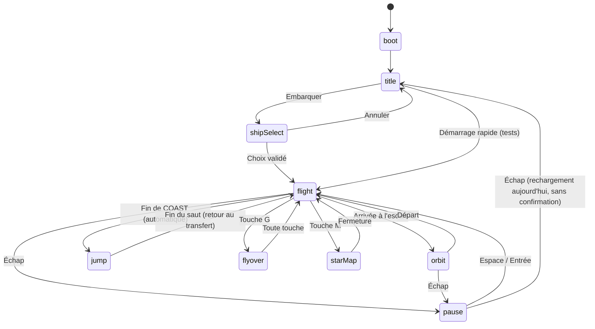
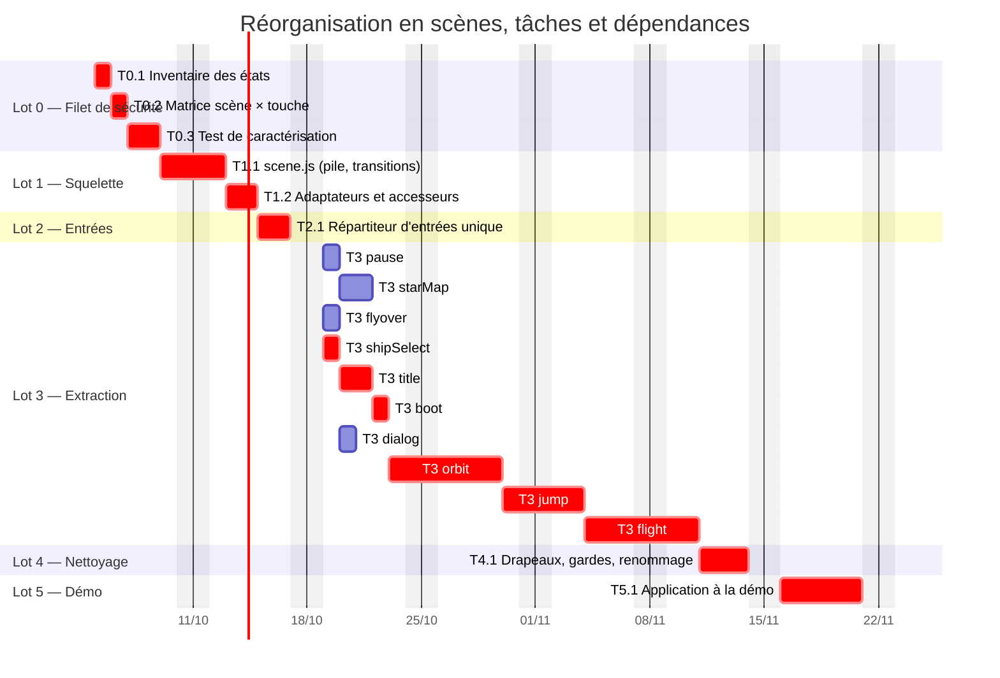

# Plan — réorganiser le moteur autour du concept de Scene

| | |
|---|---|
| **Base** | jeu `stt_v2.17.0` (`sources/`) ; la démo `ode_v7.19.1` est traitée au lot 5 |
| **Date** | 2026-10-02 |
| **Statut** | Plan proposé, rien n'est implémenté |
| **Rôle** | Spécification d'architecte, découpée en tâches pour le chef de projet (voir `AGENTS.md`, mode agentique) |
| **Liens** | Prolonge les propositions **C** (décomposer `animate()`) et **E** (état unique) du [DAT](./DAT.md#5-propositions) ; les lettres A à H citées dans le plan sont résumées dans l'[annexe](#annexe--propositions-du-dat-citées-dans-ce-plan) |

## 1. Pourquoi une Scene

Aujourd'hui, « dans quel état est le jeu ? » n'a pas de réponse unique. Le code le déduit de plusieurs drapeaux qui se recoupent (comptages sur `sources/src/JS/game` ; voir aussi [DAT §3.4](./DAT.md#34-modules-métier-et-état) et [§4.4](./DAT.md#44-état-global-et-couplage-dordre)) :

| Drapeau ou état | Utilisations | Rôle réel |
|---|---|---|
| `jumpState` | 27 | saut quantique en cours |
| `gamePaused` | 15 | pause (seul mécanisme qui gèle la simulation) |
| `REAL.phase` | 14 | `IDLE` (jamais lue), `TRANSFER`, `APPROACH`, `ORBIT`, `DEPART`, `COAST`, `WARP`, `WARPOUT`, `HOP`, `JUMP` |
| `flightPhase` | 13 | `CRUISE` ou `ARRIVAL_PAUSE` |
| `cameraMode` | 13 | mode de caméra |
| `gameStarted` | 8 | le jeu a démarré (sinon : écran-titre) |
| `SHIP_SELECT_OPEN`, `orbitState.active`, `SURVOL` | 4, 3, 5 | choix du vaisseau, mise en orbite, survol du système |

Conséquences observées dans le code :

- **États sans propriétaire commun.** La carte stellaire n'a pas d'état propre dans le jeu : elle n'existe que par des tests `isStarMapOpen()` dispersés. L'inventaire T0.1 a montré que, contrairement à ce que disent des commentaires périmés de `23-planification-relance-d-itineraire.js` (`:247-273`), elle **ne réutilise plus `gamePaused`** : la simulation continue sous la carte ouverte. Les pièges réels sont ailleurs : le clavier principal n'a aucune garde `gameStarted`, le choix du vaisseau n'isole pas le clavier, `M` s'ouvre même en pause, le survol avale toute touche (voir l'[inventaire T0.1](./PLAN-scenes-T0.1-inventaire.md#5-écarts-avec-le-plan-et-pièges-relevés)).
- **Clavier éclaté.** Huit enregistrements clavier (K1 à K8 de l'inventaire T0.1) dans 5 fichiers (`20e`, `20g`, `23` ×2, `24` ×2, `42` ×2) ; la barre d'icônes (`26`) n'a pas d'écouteur clavier propre, ses touches F1-F9 sont traitées par `23`. Le survol doit se placer en phase de capture et appeler `stopImmediatePropagation()` pour passer devant les autres. Chaque ajout d'un écran oblige à toucher les autres gestionnaires.
- **`animate()` branche sur des drapeaux** (`gameStarted`, puis `gamePaused`) avec des blocs dupliqués entre titre et vol (voir [DAT §4.3](./DAT.md#43-animate--une-fonction-qui-fait-tout)).
- **Ordre de chargement fragile** : `startGame()` rafraîchit la barre d'icônes « différée jusqu'ici car elle dépend d'`orbitState` et `ROUTE`, déclarés après », et 38 gardes `typeof X !== 'undefined'` colmatent ce couplage.
- **La démo répète le schéma** : `live2.js` enchaîne `selOpen`, `yardOpen`, `helpOpen`, `fleetOpen` et la carte dans un seul `__onKey` à retours anticipés.

**Objectif** : une seule réponse à « quelle scène est active ? », avec pour chaque scène ses entrées, sa mise à jour, son rendu et son interface, et des transitions explicites.

## 2. Concept et vocabulaire

> **Nom dans le code.** `scene` (minuscule) est déjà l'objet `THREE.Scene` du moteur (`05-scene-three-js.js`) et `LAYERS.sysScene` son équivalent système. Pour éviter toute confusion, le concept s'appelle **`GameScene`** et son gestionnaire **`SCENES`**. Dans ce document, « scène » désigne `GameScene`.

Une **scène** est un *mode d'interaction et d'affichage* du jeu : ce que le joueur voit, ce que les touches font, ce qui avance dans le temps. Elle se distingue de deux notions voisines :

- une **phase de vol** (`REAL.phase`) est un *mouvement* à l'intérieur d'une scène, pas un mode d'interaction : elles deviennent des **sous-états** de la scène de vol ;
- un **panneau HUD** (radio, services portuaires, plan de vol) est un *élément d'interface* : une scène déclare quels panneaux elle affiche, elle ne les remplace pas.

### 2.1 Contrat d'une scène

```js
GameScene = {
  name: 'orbit',
  modal: false,                // vrai : se superpose à la scène dessous
  freezesBelow: true,          // la scène dessous ne reçoit plus update()
  rendersBelow: true,          // la scène dessous reste dessinée (fond de la pause)
  ui: ['speed', 'radio', 'port'],   // panneaux affichés (remplace body.title-active, repositionAllPanels…)
  enter(params, from) {},      // initialise ; params passés par la transition
  exit(to) {},                 // libère ce qu'elle a créé (aussi : fuites mémoire)
  update(dt, elapsed) {},      // avance la simulation de la scène
  render() {},                 // facultatif ; sinon rendu par défaut (renderMain)
  onKey(e) { return false; },  // vrai = touche consommée
  onPointer(e) { return false; },
  onResize() {}
}
```

### 2.2 Gestionnaire `SCENES`

- **Pile** : une scène de base (titre, vol, orbite, saut…) plus des scènes modales empilées (pause, carte, survol, choix du vaisseau). `push`, `pop`, `replace(name, params)`.
- **Une seule boucle** : `animate()` ne fait plus que `SCENES.update(dt)` puis `SCENES.render()`. Le gestionnaire met à jour la scène du haut, et celles du dessous seulement si la scène du haut ne les gèle pas (`freezesBelow`).
- **Un seul répartiteur d'entrées** : un seul `keydown`, un seul `keyup`, un seul jeu d'événements de pointeur, à la fenêtre, qui appellent `onKey`/`onPointer` de la scène du haut puis, si elle ne consomme pas, celles du dessous non gelées. Plus de phase de capture ni de `stopImmediatePropagation`.
- **Table des transitions** déclarée à un seul endroit : un changement de scène hors de cette table est refusé et journalisé.
- **Événements** `SCENES.on('enter'|'exit', fn)` pour l'audio, la musique, les tests.

### 2.3 Rendu et post-traitement

`renderMain()` (`28-propulsion-quantique-et-carte.js`) applique globalement la lentille de saut (`WARP`) et la profondeur de champ (`GP.dof`). Cela reste **hors des scènes** (rendu en couches : [DAT §3.2](./DAT.md#32-rendu--deux-couches-origine-flottante-tranches-de-profondeur)) : c'est un étage du rendu par défaut, que `JumpScene` pilote en écrivant dans `WARP`/`GP`. Une scène ne remplace `render()` que si elle a un rendu vraiment différent (carte 2D, aperçu du vaisseau).

## 3. Inventaire des scènes

**Corrigée par la tâche T0.1** (inventaire par lecture du code : [PLAN-scenes-T0.1-inventaire.md](./PLAN-scenes-T0.1-inventaire.md), §6). La version initiale de ce plan comptait onze scènes ; deux n'existent pas dans le code (`dialog` pour la panne de carburant, `gameOver`) et la carte ne détourne pas la pause. La liste reste à confirmer par exécution au lot 0 (T0.3).

| Scène | Remplace aujourd'hui | Type | Gèle dessous ? | Sous-états / remarques |
|---|---|---|---|---|
| `boot` | générique, terminal (`42-…`, `finish()`) | base | n/a | |
| `title` | `!gameStarted`, `TITLE.tick`, `updateTitleCinematic` | base | n/a | choix de la langue ; ne se termine que par `startGame` |
| `shipSelect` | `SHIP_SELECT_OPEN` | modale sur `title` | non | doit isoler le clavier (aujourd'hui il ne le fait pas) |
| `flight` | `REAL.phase` ∈ `TRANSFER`, `APPROACH`, `DEPART`, `COAST`, `HOP` ; `flightPhase = 'CRUISE'` hors escale | base | n/a | `APPROACH` est la seule phase qui lit le pilotage ; `IDLE` (jamais lue) à supprimer |
| `orbit` | `REAL.phase = 'ORBIT'`, `flightPhase`, `orbitState.active`, plans automatiques, navettes | base | n/a | `ARRIVAL_PAUSE` (escale) puis `CRUISE` + `ORBIT` (attente du départ) ; le tableau des missions est un panneau |
| `jump` | `jumpState`, lentille `WARP` | base | n/a | **automatique** après `COAST` (jamais déclenché par le joueur) ; 6,67 s ; couvre aussi `WARP` et `WARPOUT` |
| `flyover` | `SURVOL` (touche `G`) | modale | non | avale toute touche, y compris Échap et P |
| `starMap` | `isStarMapOpen()` | modale | **non** : la simulation continue dessous | n'utilise pas `gamePaused` |
| `pause` | `gamePaused` | modale | **oui** | Échap recharge la page, sans confirmation |

Aide (H), audio (V), télémétrie, canal radio, services portuaires, tableaux de contrats, de missions et chantier naval restent des **panneaux HUD** déclarés dans `ui` (ils s'affichent *pendant* une scène), pas des scènes.

### 3.1 Transitions proposées



La matrice « scène × touche → résultat » (ÉCHAP, ESPACE, ENTRÉE, M, G, H, F1 à F9, I, L) sera écrite au lot 0 à partir du comportement **actuel** et sert de test d'acceptation de chaque lot suivant. Les données brutes sont au §3.2 de l'[inventaire T0.1](./PLAN-scenes-T0.1-inventaire.md#32-matrice-brute-pour-t02). Le diagramme montre la pause depuis `flight` et `orbit` ; l'inventaire montre qu'elle est aussi possible pendant un saut (`jump`), car `enterPause` ne teste que `gameStarted`.

## 4. Organisation du code cible

```
sources/src/JS/
├── game/                      moteur : monde, vol, rendu (inchangé pour l'essentiel)
├── demo/                      modules repris de la démo
└── scenes/                    NOUVEAU, ajouté à ORDER.txt après le moteur, avant la boucle
    ├── scene.js               contrat + gestionnaire SCENES + répartiteur d'entrées
    ├── boot.js  title.js  ship-select.js
    ├── flight.js  orbit.js  jump.js
    └── flyover.js  star-map.js  pause.js  dialog.js  game-over.js
```

Règles :
- le fichier d'une scène **porte le nom de la scène** (aujourd'hui la boucle est dans `41-animation-des-systemes-planetaires.js`, le vol dans `36-inertie-de-rotation.js`) ;
- une scène s'**enregistre elle-même** (`SCENES.register(...)`) : disparition progressive des gardes `typeof` ;
- une scène ne touche pas directement aux drapeaux des autres : elle demande une transition ;
- on garde le build par concaténation et le livrable HTML unique ; pas de nouvelle dépendance.

## 5. Stratégie : étranglement progressif

On ne réécrit pas. Chaque lot est livrable, testé, et laisse le jeu jouable. Les anciens drapeaux restent en **accesseurs dérivés** (`gamePaused`, `gameStarted`…) tant qu'un consommateur existe, puis sont supprimés au lot 4.

| Lot | Contenu | Critère de sortie |
|---|---|---|
| **0 — Filet de sécurité** | Inventaire des états (vérifier la table du §3) ; matrice scène × touche ; test Playwright de caractérisation qui rejoue la matrice sur le jeu **actuel** ; documenter `PLAYWRIGHT_BROWSERS_PATH` | Matrice verte sur `stt_v2.17.0`, sans modifier le jeu |
| **1 — Squelette** | `scenes/scene.js` : contrat, pile, transitions, événements ; scènes **adaptateurs** qui enveloppent les drapeaux existants ; `animate()` appelle `SCENES.update/render` mais la logique reste en place ; `gameStarted`/`gamePaused` deviennent des accesseurs | Aucun changement de comportement ; matrice verte ; test de fumée vert |
| **2 — Entrées** | Répartiteur unique ; migration des 6 gestionnaires `keydown`, des `keyup` et des pointeurs vers `onKey`/`onPointer` ; suppression de la capture et de `stopImmediatePropagation` | Matrice verte ; plus qu'un seul `addEventListener('keydown')` dans `sources/` |
| **3 — Extraction** | Une scène par PR, du plus simple au plus risqué : `pause`, `starMap` (fin du détournement), `flyover`, `shipSelect`, `title`, `boot`, `dialog`, puis `orbit`, `jump`, enfin `flight` avec sa machine à sous-états | Chaque PR : matrice + test de fumée + test propre à la scène ; `orbit` : tests largage, ports, missions inchangés |
| **4 — Nettoyage** | Supprimer les anciens drapeaux et gardes `typeof` devenus inutiles ; panneaux HUD pilotés par `ui` (retirer `body.title-active`, `repositionAllPanels` ad hoc) ; renommer les fichiers selon leur contenu ; mettre à jour `ORDER.txt` | Plus de lecture directe d'un ancien drapeau ; `grep` de contrôle vide |
| **5 — Démo** | Appliquer le même schéma à `live2.js` (`boot`, `title`, `run` avec modes Auto/Suivre, `map`, `selector`, `yard`, `fleet`, `help`, `paused`), idéalement avec le module `scenes/scene.js` **partagé** (proposition B du DAT) | Les scripts de test de la démo qui touchent au clavier (`selector`, `map`, `map-api`, `military-2`…) passent ; tag `ode_v7.x` |

Chaque lot se termine par une version taguée (`stt_vX.Y.Z`, voir `CLAUDE.md`) quand il change le comportement observable ; les lots 0, 1 et 2 n'en changent aucun et peuvent être regroupés dans une même version.

## 6. Découpage en tâches (pour le chef de projet)

| Id | Tâche | Rôle | Dépend de | Critère d'acceptation |
|---|---|---|---|---|
| T0.1 | Inventaire des états et valeurs réelles de `REAL.phase`, `flightPhase`, `orbitState` | Développeur | — | Table du §3 confirmée ou corrigée. **Fait** : [inventaire](./PLAN-scenes-T0.1-inventaire.md), table corrigée (2 scènes supprimées) |
| T0.2 | Matrice scène × touche (comportement actuel) | Architecte | T0.1 | Document relu, cas ambigus listés. **Fait** : [matrice](./PLAN-scenes-T0.2-matrice.md), 26 cas à tester en T0.3 |
| T0.3 | Test de caractérisation Playwright de la matrice | Développeur | T0.2 | Vert sur `stt_v2.17.0` |
| T1.1 | `scenes/scene.js` : pile, transitions, événements | Développeur | T0.3 | Tests unitaires de la pile et des transitions refusées |
| T1.2 | Scènes adaptateurs + accesseurs dérivés | Développeur | T1.1 | Matrice et fumée vertes |
| T2.1 | Répartiteur d'entrées unique | Développeur | T1.2 | Un seul `keydown` ; matrice verte |
| T3.x | Extraction d'une scène (x = pause, starMap, flyover, …) | Développeur, revue Architecte | T2.1 | Voir lot 3 |
| T4.1 | Nettoyage des drapeaux et gardes, renommage | Développeur | T3.* | `grep` vide, matrice verte |
| T5.1 | Application à la démo | Développeur | T4.1 | Voir lot 5 |

Revue de l'architecte à chaque PR : respect du contrat (§2.1), aucune lecture d'un drapeau d'une autre scène, aucune allocation ajoutée dans `update()` (voir [DAT §4.3](./DAT.md#43-animate--une-fonction-qui-fait-tout)).

### 6.1 Planning et dépendances

Diagramme de Gantt des tâches du §6, avec le lot 3 détaillé scène par scène. Les flèches sont les dépendances (`after`) ; les barres rouges forment le **chemin critique**.

> **Les durées sont des estimations de l'architecte, en jours ouvrés, non validées par un chiffrage.** La date de départ (lundi 5 octobre 2026) est arbitraire : seules les durées relatives et l'enchaînement comptent. Hypothèse : un développeur à temps plein, revue d'architecte comprise dans chaque durée.



Lecture du planning :

- **Chemin critique** : T0.1 → T0.2 → T0.3 → T1.1 → T1.2 → T2.1 → `shipSelect` → `title` → `boot` → `orbit` → `jump` → `flight` → T4.1 → T5.1, soit **35 jours ouvrés** (7 semaines) avec plusieurs personnes. La chaîne `pause` → `starMap` (3 jours) a 1 jour de marge sur celle de `boot` (4 jours).
- **Un seul développeur** : les branches parallèles (`flyover`, `shipSelect`, `title`, `boot`, `dialog`) s'ajoutent au chemin critique, soit **40 jours ouvrés** (environ 8 semaines).
- **Premier jalon livrable** : fin de T2.1 (10 jours ouvrés), sans changement de comportement visible. C'est le bon moment pour une revue d'ensemble et un tag.
- **Point dur** : `orbit` (5 jours) puis `flight` (5 jours) concentrent le risque du §7 ; une dérive de ces deux tâches décale directement T4.1 et T5.1.
- `jump` dépend d'`orbit` car la lentille de saut (`WARP`) et la pause partagent le rendu (§2.3) ; cette dépendance est une prudence d'architecte, à lever si le lot 0 montre que les deux sont indépendants.

## 7. Risques

| Risque | Gravité | Parade |
|---|---|---|
| Régression de comportement subtile (pause, carte, arrivée) | Élevée | Matrice de caractérisation dès le lot 0 ; un lot = un comportement inchangé |
| `flight`/`orbit` : sous-états très entremêlés (`REAL.phase` lu à 14 endroits, `orbitState` sur une vingtaine de champs) | Élevée | Faire `flight` et `orbit` en dernier ; commencer par des sous-états qui se contentent d'envelopper l'existant |
| Temps : `orbit` utilise `arrivalTimeScale` et des chronos propres, tandis que la pause gèle tout via un `dt` à zéro | Moyenne | Tests de pause pendant l'orbite ; la [proposition D du DAT](./DAT.md#5-propositions) (pas de temps fixe) vient **après** ce plan |
| Confusion `scene` / `GameScene` | Faible | Nommage du §2 ; revue de code |
| Audio et radio (synthèse vocale, musique) non couverts par les tests | Moyenne | Événements `enter`/`exit` pour couper ou reprendre ; test manuel listé en lot 3 |
| Surcoût de la couche scènes | Faible | Une seule indirection par image ; mesure avant/après au lot 1 |

## 8. Hors périmètre

- Pas de pas de temps fixe ni de refonte du temps ([DAT, proposition D](./DAT.md#5-propositions) et [§4.5](./DAT.md#45-temps-et-déterminisme)).
- Pas de modules ES ni de nouveau bundler ([DAT, proposition H](./DAT.md#5-propositions)).
- Pas de changement d'interface visible : les panneaux, touches et séquences restent identiques.
- Pas de réécriture de la logique de vol, d'orbite ou de saut : seules leurs entrées, sorties et frontières changent.

## 9. Questions ouvertes

1. **Granularité** : `orbit` doit-elle rester une scène unique (arrivée, livraison, missions, ports) ou se scinder en `arrival`, `delivery` et `missionBoard` ?
2. **Pause** : la pause doit-elle aussi couper la musique et la synthèse vocale ? Le comportement actuel est à relever au lot 0.
3. ~~**`gameOver`** : existe-t-il un écran de fin ?~~ **Réglée par T0.1** : non. « Quitter » est un rechargement de page sans confirmation. Faut-il ajouter une confirmation, et la panne de carburant décrite dans `TODO.md` (non implémentée) est-elle toujours voulue ? Si oui, une scène `dialog` reviendra dans le plan.
4. **Pièges de l'inventaire** : les défauts relevés au §5 de l'inventaire T0.1 (clavier du titre, `M` en pause, tableau des missions au-dessus de la pause…) doivent-ils être corrigés par la refonte, ou conservés à l'identique pour que la matrice du lot 0 reste un test de non-régression ?
5. **Ordre avec le DAT** : faire ce plan (C + E) avant la [proposition A](./DAT.md#5-propositions) (hygiène du dépôt, [DAT §4.7](./DAT.md#47-hygiène-du-dépôt)), ou l'inverse ? Je recommande A en premier : le dépôt allégé facilite les revues de ce plan.

## Annexe — Propositions du DAT citées dans ce plan

Les lettres renvoient à la [section 5 du DAT](./DAT.md#5-propositions), qui contient la liste complète (A à K) avec bénéfice, effort et risque. Résumé des six propositions que ce plan mentionne :

| Lettre | Proposition du DAT | Lien avec ce plan |
|---|---|---|
| **A** — [§4.7](./DAT.md#47-hygiène-du-dépôt) | **Hygiène du dépôt** : ne plus suivre `node_modules`, `__pycache__` et `sources/target` dans git ; `.gitignore`, `npm ci` documenté, builds publiés en artefacts | Recommandée **avant** ce plan (§9, question 4) : un dépôt allégé facilite les revues |
| **B** — [§4.2](./DAT.md#42-duplication-et-dérive-entre-les-deux-produits-priorité-haute) | **Source unique des modules partagés** entre le jeu et la démo (dossier `shared/`), pour mettre fin à la dérive des copies | Le lot 5 y recourt : `scenes/scene.js` partagé entre jeu et démo |
| **C** — [§4.3](./DAT.md#43-animate--une-fonction-qui-fait-tout) | **Décomposer `animate()`** en systèmes nommés et ordonnés | Ce plan la prolonge : `animate()` ne fait plus que `SCENES.update` puis `SCENES.render` |
| **D** — [§4.5](./DAT.md#45-temps-et-déterminisme) | **Pas de temps fixe** (accumulateur, interpolation) | **Hors périmètre** (§8) ; vient après ce plan, car elle change la sémantique du temps dans tout le moteur |
| **E** — [§4.4](./DAT.md#44-état-global-et-couplage-dordre), [§3.4](./DAT.md#34-modules-métier-et-état) | **État unique et machine à états de phase** avec transitions autorisées | Ce plan la réalise : table des transitions, pile de scènes, accesseurs dérivés des anciens drapeaux |
| **H** — [§4.4](./DAT.md#44-état-global-et-couplage-dordre), [§3.1](./DAT.md#31-chaîne-de-build) | **Frontières de modules** (fichiers renommés selon leur contenu, puis modules ES regroupés en un HTML) | **Hors périmètre** pour les modules ES (§8) ; le renommage des fichiers est fait au lot 4 |

> Tant que la PR contenant `DAT.md` n'est pas fusionnée, le lien ci-dessus est cassé : le DAT est sur la branche `worktree-dat-architecture` (PR #12).
