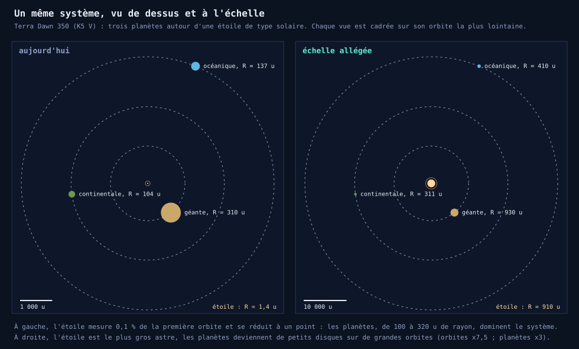
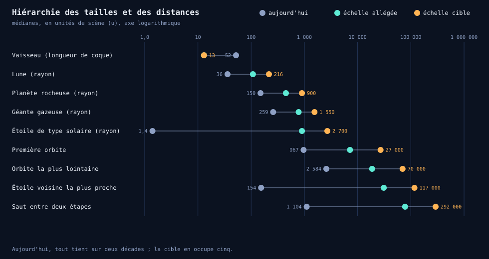
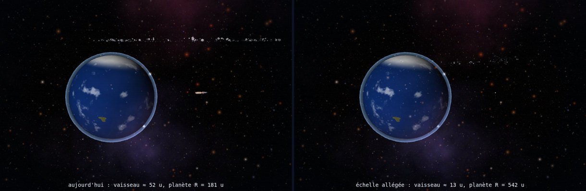

# Étude — Révision des échelles : étoiles, planètes, satellites et vaisseau

Document de travail séparé de la spécification principale : ce chantier modifie en profondeur les tailles et les distances de tout l'univers, et mérite d'être arbitré avant toute implémentation. Il s'appuie sur [`generation-de-l-univers.md`](./generation-de-l-univers.md), qui décrit le code actuel, et sur des mesures faites en exécutant ce code (méthode au [§12](#12-comment-les-chiffres-ont-été-mesurés)).

**Statut : proposition, non implémentée.** Rien dans le jeu n'a été modifié ; les choix à trancher sont regroupés au [§11](#11-décisions-à-trancher).

---

## Sommaire

- [1. Ce qui est signalé](#1-ce-qui-est-signalé)
- [2. Ce que les mesures montrent](#2-ce-que-les-mesures-montrent)
- [3. Pourquoi c'est ainsi](#3-pourquoi-cest-ainsi)
- [4. Principes de l'échelle proposée](#4-principes-de-léchelle-proposée)
- [5. Deux niveaux d'ambition](#5-deux-niveaux-dambition)
- [6. Règles de génération révisées](#6-règles-de-génération-révisées)
- [7. Conséquences sur le jeu](#7-conséquences-sur-le-jeu)
- [8. Impact sur l'implémentation actuelle](#8-impact-sur-limplémentation-actuelle)
- [9. Risques techniques](#9-risques-techniques)
- [10. Plan par paliers](#10-plan-par-paliers)
- [11. Décisions à trancher](#11-décisions-à-trancher)
- [12. Comment les chiffres ont été mesurés](#12-comment-les-chiffres-ont-été-mesurés)

---

## 1. Ce qui est signalé

Deux constats, à l'écran :

1. **Les planètes d'une étoile semblent trop grosses et trop peu éloignées de leur étoile.**
2. **Le vaisseau est beaucoup trop gros par rapport aux planètes.**

Ils relèvent d'une même cause : les tailles et les distances ont été choisies **une par une, pour la lisibilité à l'écran**, sans hiérarchie d'ensemble. Cette étude mesure l'écart, propose une hiérarchie cohérente et chiffre ce qu'elle coûte.

## 2. Ce que les mesures montrent

Les mesures portent sur le code de la version 2.12 (graine `TEST` et 24 autres graines, voir [§12](#12-comment-les-chiffres-ont-été-mesurés)). Les valeurs sont des médianes, en unités de scène (u).

### 2.1 Les rapports d'échelle actuels

| Rapport | Aujourd'hui | Ordre de grandeur réel |
|---|---:|---:|
| Diamètre d'une planète rocheuse / longueur de la coque du vaisseau (52 u) | **5,8** (de 3,8 à 12) | 10⁵ |
| Rayon d'une planète / rayon visuel de son étoile | **107** (la planète est 100 fois **plus grosse**) | 0,01 (l'étoile est 100 fois plus grosse) |
| Première orbite / rayon d'une planète | **6,4** (2,6 à 10) | 10⁴ |
| Première orbite / rayon de l'étoile | 690 | 200 |
| Orbite la plus lointaine / saut vers l'étape suivante | **2,5** | 10⁻⁴ |
| Orbite lunaire / rayon de la planète | 2,2 à 5,4 | 10 à 60 |

### 2.2 Les faits qui sautent aux yeux

- **La coque du vaisseau mesure environ 52 u de long** (64 u avec le panache des réacteurs : boîte englobante mesurée 14 × 15 × 64 u), et une planète fait **4 à 12 vaisseaux de diamètre**. Dans la vue d'arrivée en orbite, le vaisseau apparaît comme un objet visible à côté d'une planète qui n'est que six fois plus large que lui (figure du [§5.3](#53-la-vue-darrivée-en-orbite)).
- **L'étoile est plus petite que le vaisseau** : le cœur d'une étoile de type solaire fait 1,4 u de rayon, son halo environ 2 u. Une planète de 150 u de rayon est, en rayon, **cent fois plus grosse que son propre soleil**. À 1 000 u, le halo d'une étoile de type solaire a un rayon angulaire de 0,12°, quand une planète de 150 u de rayon a, à la même distance, un rayon angulaire de 8,6° : soixante-dix fois plus.
- **Les planètes sont proches de leur étoile, au sens des proportions** : la première orbite est à 6 rayons de planète seulement, et l'écart médian entre deux orbites est de 1 074 u pour des planètes de 300 u de diamètre.
- **Un système planétaire est plus vaste que la distance entre deux étoiles.** L'orbite la plus lointaine (2 584 u) est 2,5 fois plus grande que le saut vers l'étape suivante (1 104 u) : sur les **264 sauts** des 24 routes mesurées, l'étoile suivante est **toujours** à l'intérieur de l'orbite extérieure du système que l'on quitte.
- **La sphère d'une orbite lointaine contient des milliers d'étoiles** :

| Rayon de la sphère autour d'une étoile | Autres étoiles à l'intérieur (moyenne) |
|---:|---:|
| 967 u (première orbite médiane) | 278 |
| 1 104 u (saut médian) | 416 |
| 2 584 u (orbite extérieure médiane) | **5 321** |
| 4 149 u (orbite extérieure maximale) | 20 816 |

  La distance médiane au plus proche voisin n'est que de **154 u**, soit 3 longueurs de vaisseau.
- **La route passe surtout d'une planète à l'autre, pas d'une étoile à l'autre.** La courbe de route traverse le point d'approche de la planète cible de chaque étape, situé à 1 000 à 4 000 u de son étoile. Sur les 24 routes mesurées, elle est **3,5 fois plus longue que la somme des sauts entre étoiles** (de 2,3 à 4,3) : 3 923 u par étape pour 1 113 u de saut. À 56 u/s, une étape dure 70 s et une route de 8 étapes environ **9 minutes**.

## 3. Pourquoi c'est ainsi

Ce n'est pas un oubli : le code l'explique. Trois choix se cumulent.

1. **Les planètes doivent dominer la vue à l'approche.** Le commentaire de `generateSystemData` fixe les rayons pour « un diamètre 5 à 17 fois la longueur du vaisseau » : c'est un choix de lisibilité, pas de proportion.
2. **Les orbites suivent la place disponible, pas l'étoile.** Les orbites sont calculées à partir des rayons des planètes (plancher additif, croissance ×1,65) et **jamais** de la taille de l'étoile ni de la distance aux voisines. Une étoile géante et une naine rouge reçoivent le même système.
3. **La taille de l'étoile a été compressée pour rester affichable.** Le rayon visuel `1,4 × R^0,42` conserve l'ordre des tailles mais tombe sous celle du vaisseau ; l'étoile est dessinée surtout par son halo.

Ajoutons que la grille d'étoiles (cellule de 190 u) et la longueur des sauts (700 à 1 500 u) ont été réglées pour la **densité du ciel** et la durée d'un trajet, indépendamment de la taille des systèmes.

## 4. Principes de l'échelle proposée

La physique réelle est hors de portée : l'écart entre le vaisseau et la distance entre deux étoiles dépasse dix ordres de grandeur. Il s'agit donc de **compresser** en gardant un ordre et des rapports lisibles. Six règles, de la plus petite à la plus grande échelle :

| # | Règle | Aujourd'hui | Visé |
|---|---|---:|---:|
| R1 | Une planète est **très grande** devant le vaisseau | diamètre = 5,8 vaisseaux | ≥ 50 vaisseaux |
| R2 | L'étoile est **plus grosse** que ses planètes | étoile = 0,01 planète | étoile = 2 à 3 planètes |
| R3 | Les planètes sont **loin** de leur étoile | orbite = 6 rayons de planète | ≥ 15 à 30 rayons |
| R4 | L'orbite est **grande devant l'étoile** | 690 rayons stellaires | 8 à 10 rayons stellaires |
| R5 | Le **système est petit** devant la distance aux voisines | orbite extérieure = 2,5 sauts | saut ≥ 4 orbites extérieures |
| R6 | Une **lune** est loin de sa planète | 2,2 à 5,4 rayons | 6 à 18 rayons |

Deux effets de bord sont à garder en tête.

- **R5 impose la taille des cellules d'étoiles** : pour qu'aucune autre étoile ne se trouve, en moyenne, à l'intérieur d'un système, le côté de cellule doit dépasser environ 5 fois la première orbite. C'est ce qui fait grandir les distances entre étoiles bien plus vite que les autres échelles.
- **La vitesse doit suivre.** Pour conserver la durée actuelle d'une route (environ 9 minutes à la croisière), la vitesse doit croître avec la longueur de la route, donc avec les sauts. Comme la route ne serpentera plus entre des planètes lointaines de leur étoile, sa longueur retombera près de la somme des sauts (rapport estimé à 1,1 au lieu de 3,5).

## 5. Deux niveaux d'ambition

Les deux niveaux appliquent les mêmes règles avec des rapports plus ou moins marqués. Les valeurs sont des médianes en unités de scène ; la coque du vaisseau passe de 52 u à 13 u dans les deux cas (÷ 4).

### 5.1 Le tableau comparatif

| Grandeur | Aujourd'hui | Allégée | Cible |
|---|---:|---:|---:|
| Longueur de la coque du vaisseau | 52 | 13 | 13 |
| Rayon d'une planète rocheuse | 150 | 450 | 900 |
| Rayon d'une géante gazeuse | 259 | 780 | 1 550 |
| Rayon d'une lune (planète rocheuse) | 36 | 108 | 216 |
| Rayon visuel d'une étoile de type solaire | 1,4 | 900 | 2 700 |
| Première orbite | 967 | 7 200 | 27 000 |
| Orbite la plus lointaine | 2 584 | 18 700 | 70 000 |
| Côté d'une cellule d'étoiles | 190 | 39 000 | 146 000 |
| Distance au plus proche voisin | 154 | 31 000 | 117 000 |
| Saut entre deux étapes | 1 104 | 78 000 | 292 000 |
| Vitesse de croisière (route de ≈ 9 min conservée) | 56 | 1 200 | 4 600 |
| Vitesse en boost (× 3,1) | 174 | 3 700 | 14 200 |
| Vitesse de croisière en longueurs de vaisseau par seconde | 1,1 | 92 | 354 |

| Rapport | Aujourd'hui | Allégée | Cible |
|---|---:|---:|---:|
| Diamètre de la planète / vaisseau (R1) | 5,8 | 69 | 138 |
| Rayon de l'étoile / rayon de la planète (R2) | 0,01 | 2 | 3 |
| Première orbite / rayon de la planète (R3) | 6,4 | 16 | 30 |
| Première orbite / rayon de l'étoile (R4) | 690 | 8 | 10 |
| Saut / orbite la plus lointaine (R5) | 0,43 | 4,2 | 4,2 |
| Autres étoiles dans la sphère de l'orbite extérieure | 5 321 | 0,2 | 0,2 |
| Longueur de la courbe de route / somme des sauts | 3,5 | ≈ 1,1 (estimé) | ≈ 1,1 (estimé) |

Le niveau **Allégée** est le premier pas raisonnable : ses valeurs les plus élevées (saut de 78 000 u, vitesse de 1 200 u/s) restent dans la plage où le moteur 3D se comporte bien. Le niveau **Cible** exprime les mêmes rapports avec un ordre de grandeur de plus sur les distances ; il est plus fidèle, mais exige de traiter sérieusement les risques du [§9](#9-risques-techniques).

### 5.2 Le même système, vu de dessus

Le graphique ci-dessus ([§2.2](#22-les-faits-qui-sautent-aux-yeux)) applique le niveau **Allégée** à `Terra Dawn 350` (K5 V) : les orbites sont multipliées par 7,5, les planètes par 3 et l'étoile reçoit un rayon visuel d'environ 910 u. L'étoile devient le plus gros astre du système et les planètes de petits disques sur de grandes orbites.

### 5.3 La vue d'arrivée en orbite

Rendu réel de la vue d'ensemble de la mise en orbite (planète à `R`, vaisseau sur l'orbite de livraison à 2,3 R, caméra à 4,4 R), avec le code actuel puis avec le niveau **Allégée** (planète × 3, vaisseau ÷ 4) :

Aujourd'hui, le vaisseau est un objet bien visible, environ 14 % du diamètre de la planète. Avec l'échelle allégée il tombe à 1,2 % : c'est **le bon rapport**, mais un simple point. Cette vue d'ensemble, qui montre le vaisseau et les navettes en action, devra être **recadrée** (voir [§7.3](#73-cinématiques-et-caméra)).

## 6. Règles de génération révisées

Les formules ci-dessous remplacent, dans `generateSystemData`, `buildStarCell`, `findNextWaypoint` et `buildPlanetSystemMeshes`, les constantes actuelles. `K_*` sont les coefficients propres à chaque niveau.

**Rayon des planètes.** Inchangé en forme (rocheuse 100 à 200, géante 200 à 320), multiplié par `K_PLANET` (3 en Allégée, 6 en Cible).

**Rayon visuel de l'étoile.** `R_visuel = K_STAR × 1,4 × R★^0,42`, borné entre 0,5 et 5 fois la valeur d'une étoile de type solaire. `K_STAR` vaut environ 640 en Allégée (soleil : 900 u) et 1 930 en Cible (2 700 u). Le plafond évite qu'une supergéante ne devienne plus grande que tout son système.

**Orbites.** Première orbite `(780 + 380 × u) × K_ORBIT`, avec un plancher à `8 × R_visuel + rayon de la planète` (le plancher l'emporte pour les étoiles géantes). Les termes de l'espacement suivant (`× 1,65`, plancher additif `400 + 480 × u`) sont multipliés par `K_ORBIT`.

**Lunes.** Le rayon reste `0,18 à 0,30 × R`. L'orbite passe de `R × (2,2 + 1,8 × u + 1,4 × rang)` à `R × (6 + 8 × u + 4 × rang)`.

**Ceintures d'astéroïdes.** Largeur multipliée par `K_ORBIT`, taille des astéroïdes par `K_PLANET`, effectif doublé pour garder une densité lisible.

**Cellules d'étoiles.** `STAR_CELL` ≥ 5,4 × la première orbite médiane (39 000 u en Allégée, 146 000 en Cible). `STAR_RADIUS` reste à 3 : le nombre d'étoiles suivies ne change pas (343 cellules, environ 171 étoiles).

**Longueur des sauts.** De `[700 ; 1 500]` à `[1,2 ; 3,2] × STAR_CELL`. La plage reste assez large pour avoir de l'ordre de vingt candidates par saut, et le balayage passe de 4 913 à 729 cellules.

**Nébuleuses.** Cellule et rayons multipliés par le même facteur que `STAR_CELL`. Le décor lointain (six couches d'étoiles, neuf nébuleuses de fond) reste inchangé : il est recentré sur le vaisseau à chaque image.

**Vitesses.** Croisière `= longueur d'une étape / 70 s`, soit environ `1,1 × saut médian / 70 s`, boost × 3,1. Toutes les distances liées à l'approche d'une planète (zone de ralentissement, seuils d'arrivée) sont exprimées en **rayons de planète** au lieu de valeurs fixes.

## 7. Conséquences sur le jeu

### 7.1 Vitesse et durée des trajets

À durée de route constante, la vitesse de croisière passe de 56 u/s à 1 200 u/s (Allégée), soit environ 90 longueurs de vaisseau par seconde contre 1,1 aujourd'hui. Près d'une planète, cette vitesse serait démesurée : le ralentissement d'approche (`approachScale`, aujourd'hui `lerp(0,28 ; 1)` sur 950 u) doit devenir **proportionnel à la distance à la planète**, sur plusieurs rayons, et la vitesse en orbite de livraison à un multiple du rayon de la planète.

### 7.2 Carburant, HUD et carte

- **Carburant** : `FUEL_CAPACITY` (24 000) a été calibré sur la somme des sauts (environ 8 000 u par route, d'après le commentaire du code), alors que la courbe mesure en réalité environ 31 000 u : un réservoir plein ne couvre déjà que 0,8 route. Il doit être recalculé sur la longueur réelle de la route et suivre le coefficient de vitesse.
- **HUD** : la vitesse affichée (u/s) atteindrait plusieurs milliers ; une unité d'affichage (par exemple 1 u = 10 km) évite des nombres illisibles.
- **Carte stellaire et saut quantique** : la portée du saut, l'échelle de la carte et le rayon de sélection dérivent des distances entre étoiles et suivent le coefficient de cellule.

### 7.3 Cinématiques et caméra

- **Caméra de poursuite** : elle est aujourd'hui lissée en position (`camPos.lerp(cible, dt × 4,5)`). Le retard vaut `vitesse / 4,5` : 12 u à 56 u/s (39 u en boost), mais **267 u à 1 200 u/s** (830 u en boost), soit un vaisseau qui sortirait du cadre. Le lissage doit porter sur le **décalage** par rapport au vaisseau, pas sur la position absolue.
- **Vue d'ensemble de la mise en orbite** : le vaisseau devient un point (§5.3). Il faut recadrer (téléobjectif, ou alternance de plans plus serrés sur le vaisseau et les navettes).
- **Plans du largage des navettes** et **décalages de la caméra** exprimés en longueurs de vaisseau : ils suivent le vaisseau, donc ÷ 4 ([§8.3](#83-à-suivre-la-taille-du-vaisseau--4)).

### 7.4 Route et portiques

Le pas des portiques (320 u) et leur taille (34 u) sont réglés sur le vaisseau : à l'échelle proposée, ils doivent être adaptés pour rester visibles à la vitesse de croisière (le pas augmente, la taille suit la largeur utile du couloir).

## 8. Impact sur l'implémentation actuelle

Un inventaire du code (`space-travel.html`, commit `e59921e`) recense plus d'une centaine de constantes ou de littéraux liés à l'échelle. Ils se répartissent en cinq familles selon **ce qui les commande** ; les numéros de ligne sont ceux de ce commit.

### 8.1 À multiplier par un coefficient de génération

| Élément | Emplacement | Coefficient |
|---|---|---|
| Rayon des planètes (100 à 200, géantes 200 à 320) | `generateSystemData` L3355 | `K_PLANET` |
| Première orbite `780 + 380 × u`, écarts `400 + 480 × u`, croissance × 1,65 | `generateSystemData` L3370–3382 | `K_ORBIT`, avec plancher lié à l'étoile |
| Orbite des lunes `R × (2,2 + 1,8 × u + 1,4 × rang)` | `buildPlanetSystemMeshes` L3873 | remplacée par `R × (6 + 8 × u + 4 × rang)` |
| Ceintures : marges 60 et 150 u, taille des astéroïdes `1,1 + 26 × u²`, effectif 240 à 499 | `generateSystemData` L3435–3443, `buildAsteroidBelt` L3635 | `K_ORBIT`, `K_PLANET`, effectif doublé |
| Rayon visuel de l'étoile `1,4 × R★^0,42` | `buildStarCell` L3131 | `K_STAR`, borné |
| Côté des cellules d'étoiles, 190 u | `STAR_CELL` L3081 | `K_CELL` |
| Longueur des sauts, 700 à 1 500 u, et rayon de balayage | `HOP_MIN`, `HOP_MAX` L3939, `findNextWaypoint` | `[1,2 ; 3,2] × STAR_CELL` |
| Cellules et rayons des nébuleuses (1 600 u ; 420 à 900 u) | `NEBULA_CELL` L3082, `buildNebulaCell` L3173–3186 | `K_CELL` |
| Point de Lagrange : 0,92 de la distance étoile-planète | `LAGRANGE_FRACTION` L4280 | inchangé, mais voir la remarque ci-dessous |

Le point de Lagrange est aujourd'hui décalé de 8 % de la distance étoile-planète, soit 62 à 93 u pour la première orbite, alors que la planète mesure 100 à 200 u de rayon : il tombe à l'intérieur de la planète. Avec l'échelle proposée, le décalage (environ 580 u pour une orbite à 7 200 u) sort largement d'une planète de 450 u de rayon.

### 8.2 À exprimer en rayons de planète, ou d'étoile

Ces valeurs sont aujourd'hui **absolues** alors qu'elles servent à passer près d'une planète ou d'une étoile :

| Élément | Emplacement | Aujourd'hui | À exprimer en |
|---|---|---|---|
| Dégagement autour d'une autre planète | `computeRoute` L4377, L4507 | R + 320 (« ~6× la longueur du vaisseau », selon le commentaire) | R × 2 |
| Dégagement autour de la planète cible | L4426, L4470 | R + 130 | R × 0,7 |
| Dégagement autour de l'étoile | L4428 | `baseCore + 220` | 1,5 × rayon visuel |
| Poussées de correction | L4442, L4387, L4475 | 260, 60, 40 u | fractions du rayon |
| Zone de ralentissement d'approche | `updateFlight` L7349 | 950 u, plancher 0,28 | 12 rayons de planète |
| Seuils de déclenchement d'une étape | L7201, L7212 | − 120 u, − 180 u | 1,5 à 2,5 rayons |
| Portée de recherche vers l'avant du suivi de route | L7179 | 420 u | proportionnelle à la vitesse |
| Portées des étiquettes | L1980–1982 | 3 400, 1 400, 1 300 u | rayons de planète |
| Portée de l'étiquette d'une étoile | `LABEL_RANGE` L8106 | 1,5 × `STAR_PROXIMITY_RANGE` (855 u) | suit `STAR_CELL` |
| Arrivée d'un saut quantique | `confirmQuantumJump` L5721 | `max(400, R★ × 4)` avec `R★` en rayons solaires | 4 × rayon **visuel** de l'étoile |
| Pas et taille des portiques | `GATE_SPACING`, `GATE_HALF` L4024–4025 | 320 u, 34 u | proportionnels à la vitesse de croisière |

Sont **déjà relatifs** à la planète et n'ont pas besoin d'être modifiés : le rayon d'orbite de livraison (`2,3 × R`, L6482), la caméra d'ensemble (`1,9 × 2,3 × R`), la distance de service portuaire (`4 × R`), la balise du port, l'atmosphère et les anneaux.

### 8.3 À suivre la taille du vaisseau (÷ 4)

| Élément | Emplacement | Aujourd'hui |
|---|---|---|
| Modèle du vaisseau : coque, nacelle, réacteurs, RCS, dock, bras, lumière ponctuelle du dock | section 5 « Le vaisseau », L2169–2785 | dimensions absolues ; 52 u de coque |
| Décalage de la caméra de poursuite | `CAM_OFFSET` L5841 | (0, 12, 46) |
| Plan-séquence | L7696–7698 | rayon 95, hauteur 26 ± 10 |
| Plans du largage des navettes | L7560–7606 | décalages de 9, 15, 26, 38 et 42 « longueurs de vaisseau » |
| Sphère d'exclusion de la caméra | `SHIP_HULL_RADIUS` L6799 | 20 u |
| Étiquettes de vaisseaux | `SHIP_LABEL_MIN_DIST` L1933 | distance minimale 18 u |
| Navettes : modèle de 3 u, arcs de départ de 50 à 120 u, chute de 14 u et éloignement de 55 u | `buildShuttle`, L6863, L6877–6880 | absolus |
| Autopilote : anticipation `LD` 180 u et `LF` 140 u | L7262, L7293 | dépendent de la dynamique du vaisseau, pas des planètes |

### 8.4 À multiplier par le coefficient de vitesse

| Élément | Emplacement | Aujourd'hui |
|---|---|---|
| Vitesse de croisière et boost | `CRUISE_SPEED_BASE`, `BOOST_MULT` L5316 | 56 u/s, × 3,1 |
| Améliorations de vitesse | L5327–5331 | + 9 % par niveau, facteur pur |
| Capacité du réservoir, prix du ravitaillement | `FUEL_CAPACITY` L5345 | 24 000 (voir §7.2) |
| Coût d'un saut quantique | L5407–5413 | égal à la distance |
| Carte stellaire : grille de 220 u, caméra initiale à 1 400 u, bornes de zoom 200 à 60 000 u | L5542, L5393, L5634 | absolus, à suivre `STAR_CELL` |
| Portée d'un saut : 5 cellules, 24 candidates les plus proches | `STAR_MAP_RADIUS` L5385 | en cellules : suit `STAR_CELL` |

### 8.5 À revoir côté rendu

| Élément | Emplacement | Aujourd'hui |
|---|---|---|
| Plans de la caméra | L1666 | `near` 0,1, `far` 6 000, pas de tampon logarithmique |
| Brouillard | `FogExp2` L1664 | densité 0,00026 (un facteur e⁻¹ à 3 850 u) ; il agit sur les matériaux standard et les sprites, pas sur les shaders de planètes, d'étoiles ni de nébuleuses |
| Disque de l'étoile | `animate` L8123, plans de titre L7996 | rayon multiplié par `clamp(26 × baseCore / d, 0,3 ; 9)` : facteur d'affichage conçu pour des étoiles minuscules |
| Six couches d'étoiles et neuf nébuleuses de décor | L2156–2166, L3054–3065 | rayons de 380 à 4 400 u : inchangés, mais ils se retrouvent bien **plus près** que les étoiles suivies |
| Nombre d'échantillons de la courbe de route | `computeRoute` L4408, L4459, L4486, L4524 | 300, 400, 300, 1 200, quelle que soit la longueur |

Le facteur d'affichage du disque de l'étoile est à traiter tout de suite : avec un rayon visuel de 900 u, il grossirait l'étoile jusqu'à 8 100 u de rayon en approche.

### 8.6 Ce qui n'a pas besoin de changer

Les vitesses angulaires (rotation propre des planètes, révolution des lunes, couples et plafonds de rotation du vaisseau), la durée fixe de l'orbite de livraison (36 s), la capture (5,5 s), les fractions de largage des navettes, les durées des cinématiques et le décor lointain recentré sur le vaisseau.

## 9. Risques techniques

| # | Risque | Explication | Parade |
|---|---|---|---|
| 1 | **Précision de la profondeur** | `near` 0,1 et `far` 6 000 donnent déjà ≈ 0,6 u de résolution à 1 000 u. Avec `far` = 400 000 (Allégée), la résolution atteint ≈ 60 u à 10 000 u et ≈ 6 000 u à 100 000 u : scintillement entre une planète et son atmosphère. | `near` porté à 0,5 (même le gros plan de chargement, ramené à environ 2 u du dock, reste au-delà) ; rendu en deux passes (lointain, puis proche après effacement de la profondeur) ; ou `logarithmicDepthBuffer`, avec correction des `ShaderMaterial` du jeu (étoiles, planètes, nébuleuses, portiques). |
| 2 | **Caméra de poursuite** | Le lissage en position crée un retard de `v / 4,5` : 267 u à 1 200 u/s. | Lisser le décalage par rapport au vaisseau, pas la position. |
| 3 | **Sensation de vitesse** | La parallaxe des étoiles proches diminue d'un facteur 6 environ : à 1 200 u/s, une étoile à 40 000 u défile à 3 % par seconde, contre 19 % aujourd'hui pour une étoile à 300 u et 56 u/s. Le fond d'étoiles suivant le vaisseau n'en donne pas. | Poussière spatiale locale, fixe dans le monde et dense autour du vaisseau ; portiques et lignes de vitesse conservés. |
| 4 | **Brouillard** | À densité inchangée, la transmission vaut 37 % à 3 850 u et moins de 2 % à 8 000 u : les matériaux standard au-delà (lunes en orbite lointaine, astéroïdes, coque en vue lointaine) disparaissent. | Densité proportionnelle à `1 / K`, ou brouillard supprimé pour les corps de grande taille. |
| 5 | **Autopilote et suivi de route** | À 3 700 u/s (boost), le vaisseau parcourt 62 u par image et jusqu'à 370 u quand `dt` atteint son plafond de 0,1 s, contre 420 u de portée de recherche grossière. | Portée et anticipation (`LD`, `LF`) proportionnelles à la vitesse. |
| 6 | **Précision des flottants** | Les sommets des portiques sont construits en coordonnées monde et stockés en simple précision (`Float32Array`) ; à 650 000 u de l'origine, le pas est de 0,06 u. Acceptable en Allégée ; à 2,4 millions d'unités (Cible) il monte à 0,25 u. | Portiques positionnés par groupe local ; origine flottante si la Cible est retenue. |
| 7 | **Cinématiques** | La vue d'ensemble de la mise en orbite cadre aujourd'hui vaisseau et navettes ; à l'échelle proposée ils sont des points. | Recadrer (téléobjectif, plans plus serrés) ou exagérer visuellement le vaisseau dans les seuls plans d'ensemble. |
| 8 | **Tests** | L'empreinte de la route du jeu d'essai (`route=d12a2d50`) change forcément. | Profil `actuel` conservé (empreinte inchangée) ; références séparées pour les nouveaux profils. |
| 9 | **Étoiles géantes** | Le plafond du rayon visuel (5 fois une étoile solaire) laisse des systèmes de géantes d'environ 94 000 u de rayon, plus grands que la distance moyenne entre voisines : une trentaine d'étoiles y seraient encore incluses. | Plafonner aussi la première orbite, ou écarter les étoiles trop proches d'une géante (distance minimale déterministe). |

## 10. Plan par paliers

Chaque palier est livrable séparément, testable, et n'altère pas le suivant.

| Palier | Contenu | Vérification |
|---|---|---|
| **P0 — Profils d'échelle** | Regrouper toutes les constantes du §8 dans une table `SCALE`, choisie par le paramètre d'URL `?scale=` (valeurs `actuel`, `allegee` ou `cible`). Le profil `actuel` reproduit **exactement** le comportement d'aujourd'hui. | `selftest.sh` inchangé ; aucun écart visuel. Un test vérifie, pour chaque profil, les rapports R1 à R6. |
| **P1 — Génération** | Planètes, rayon visuel de l'étoile, orbites, lunes, ceintures, cellules, sauts, nébuleuses, disque de l'étoile. Le vaisseau ne change pas. | Statistiques de routes sur 24 graines ; plan de système à l'échelle ; nouvelles références de test. |
| **P2 — Vitesses et approche** | Vitesse et carburant, zones exprimées en rayons, saut quantique, carte stellaire, portiques. | Durée d'une route conservée (environ 9 min) ; carburant recalculé. |
| **P3 — Rendu et caméra** | `near` / `far`, brouillard, caméra de poursuite relative, poussière locale, étiquettes. | Captures à plusieurs distances ; absence de scintillement de profondeur. |
| **P4 — Vaisseau ÷ 4** | Modèle et constantes de caméra, navettes, plans de largage, recadrage de la vue d'ensemble. | Captures des plans de largage ; comparaison avec l'état actuel. |
| **P5 — Recalage et documentation** | Prix, réglages fins, mise à jour de la spécification et de `generation-de-l-univers.md`. | Partie complète jouée, sur les trois profils. |

P0 est un pur refactoring : il est sans risque visuel et sert de filet de sécurité aux paliers suivants. Il permet aussi de **comparer les profils dans le jeu** en changeant simplement l'URL.

## 11. Décisions à trancher

1. **Niveau d'ambition.** Allégée d'abord (recommandé : plage numérique raisonnable, gain net sur les six règles), ou Cible directement (plus fidèle, mais exige la précision de profondeur, l'origine flottante et davantage de retouches).
2. **Taille du vaisseau.** ÷ 4 (13 u de coque, recommandé), ÷ 2, ou inchangée en ne jouant que sur la taille des planètes. Chaque option fixe le rapport R1 et l'ampleur de P4.
3. **Durée d'une route.** Conserver les 9 minutes actuelles (les vitesses du §5.1 en découlent), ou les allonger pour donner plus de poids aux distances.
4. **Vue d'ensemble de la mise en orbite.** Accepter un vaisseau minuscule et recadrer, ou exagérer visuellement le vaisseau dans ce seul plan (un facteur d'échelle propre aux cinématiques).
5. **Systèmes des étoiles géantes.** Plafonner leur taille, ou écarter les étoiles trop proches d'elles.
6. **Profils sélectionnables.** Garder `?scale=actuel|allegee|cible` dans le jeu livré, ou le réserver à la mise au point.

## 12. Comment les chiffres ont été mesurés

Les mesures sont issues de l'exécution du **vrai code** du jeu dans Chrome, à l'aide de scripts jetables (non conservés dans le dépôt) qui appellent directement les fonctions de génération :

| Mesure | Échantillon |
|---|---|
| Dimensions du vaisseau | boîte englobante du groupe `shipRig` |
| Voisinage stellaire | 41 × 41 × 41 = 68 921 cellules autour de l'origine (34 615 étoiles), graine `TEST` ; 172 étoiles centrales |
| Étoiles à l'intérieur d'une sphère | pour ces 172 étoiles, décompte de toutes les autres étoiles à moins de `r` |
| Taille apparente d'une étoile | formules du jeu (`baseCore`, `baseHalo`, magnitude apparente, éclat perçu) appliquées à quatre types d'étoiles |
| Système et saut suivant | 24 graines (`S01` à `S24`), 12 étapes demandées par `planRoute` : 288 étapes, 264 sauts suivants |
| Longueur de la courbe de route | les mêmes 24 graines, route calculée par `computeRoute` (tirage du nombre d'étapes rendu déterministe) : 189 étapes, comparées à la somme des sauts correspondants |
| Rendu de la vue d'arrivée | vrai shader, planète et vaisseau du jeu, caméra placée comme dans `animate()` (2,3 R et 4,4 R) |
| Constantes d'échelle du code | inventaire par lecture du code au commit `e59921e` ; les emplacements du §8 peuvent glisser d'une ou deux lignes d'une version à l'autre |

Les figures du [§5](#5-deux-niveaux-dambition) sont calculées à partir des valeurs du tableau du [§5.1](#51-le-tableau-comparatif). Les valeurs des niveaux Allégée et Cible sont des **propositions** : elles découlent des règles du [§4](#4-principes-de-léchelle-proposée) et n'ont pas été implémentées.
