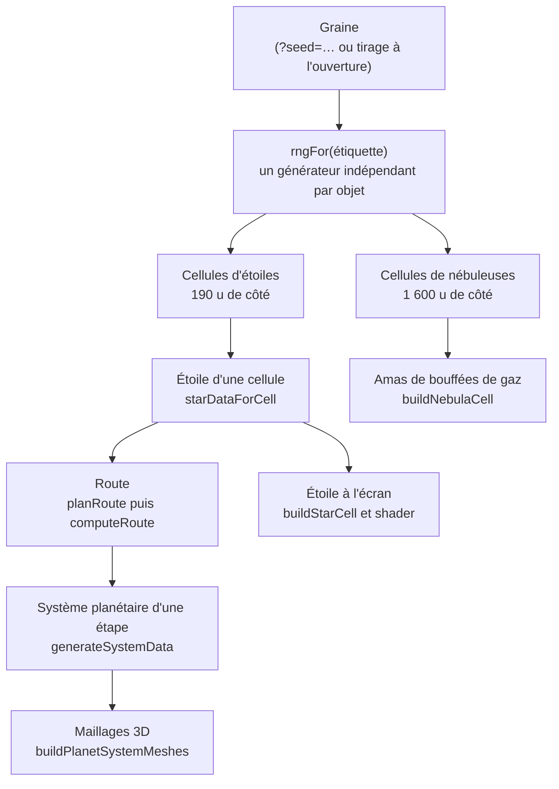
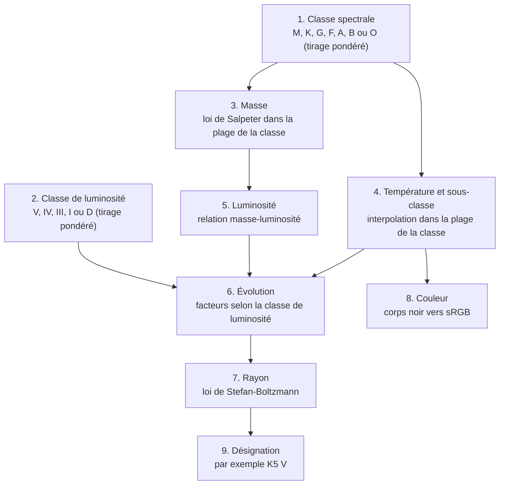
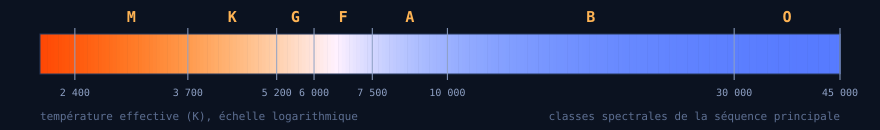
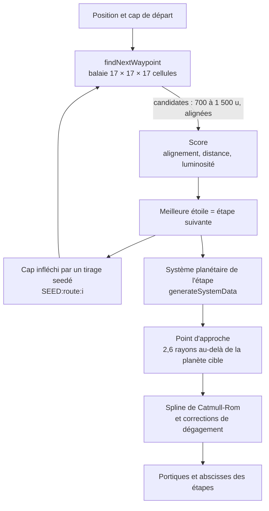
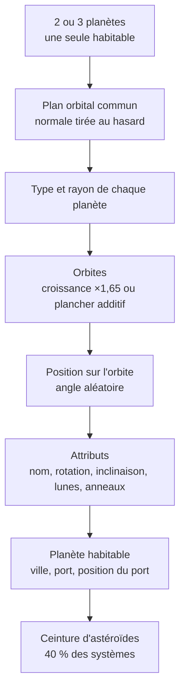
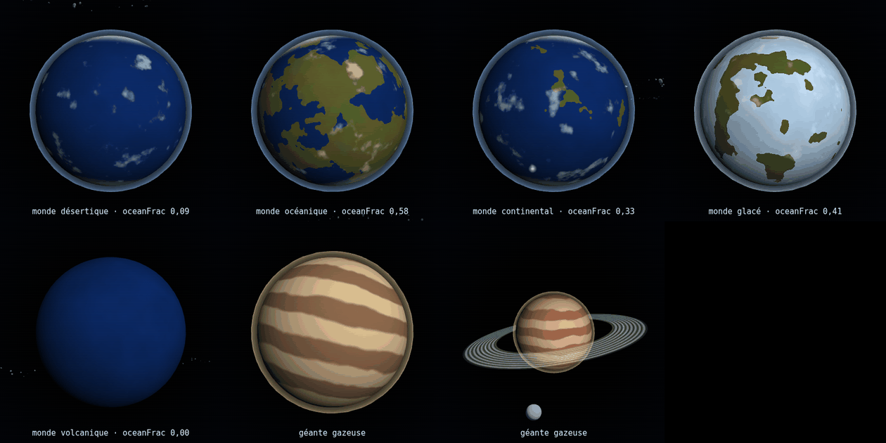

# Génération procédurale de l'univers

**Space Travel & Transport** — comment le simulateur fabrique ses étoiles, ses nébuleuses, ses systèmes planétaires et sa route à partir d'une seule graine.

Ce document décrit le code de la **version 2.12** (`space-travel.html`, état du commit `be19a22`). Il nomme les fonctions plutôt que les numéros de ligne, qui changent d'une version à l'autre. Les chiffres « mesurés » viennent de l'exécution du vrai code du jeu sur un large échantillon : la méthode est décrite au [§12.4](#124-comment-les-chiffres-ont-été-mesurés). Les écarts entre l'intention du code et son comportement réel sont regroupés au [§13](#13-points-dattention).

## Sommaire

- [1. En bref](#1-en-bref)
- [2. Vue d'ensemble](#2-vue-densemble)
- [3. La graine et les nombres pseudo-aléatoires](#3-la-graine-et-les-nombres-pseudo-aléatoires)
- [4. L'espace découpé en cellules](#4-lespace-découpé-en-cellules)
- [5. Les noms](#5-les-noms)
- [6. Les étoiles](#6-les-étoiles)
- [7. Les nébuleuses](#7-les-nébuleuses)
- [8. La route](#8-la-route)
- [9. Les systèmes planétaires](#9-les-systèmes-planétaires)
- [10. Du modèle au rendu 3D](#10-du-modèle-au-rendu-3d)
- [11. Paramètres de référence](#11-paramètres-de-référence)
- [12. Reproduire et explorer](#12-reproduire-et-explorer)
- [13. Points d'attention](#13-points-dattention)
- [Annexe A — Glossaire](#annexe-a--glossaire)
- [Annexe B — Index des fonctions](#annexe-b--index-des-fonctions)

---

## 1. En bref

- **Une seule graine** (`SEED`, une chaîne de caractères) détermine tout l'univers. La même graine redonne toujours les mêmes étoiles, les mêmes nébuleuses, les mêmes planètes et les mêmes noms.
- L'espace est découpé en **cellules cubiques**. Chaque cellule tire son propre contenu à partir d'un générateur aléatoire dédié, dérivé de la graine et des coordonnées de la cellule. Rien n'est stocké : une cellule se régénère à l'identique quand on y revient.
- Une **étoile** est tirée dans une population réaliste (classe spectrale, classe de luminosité, loi de masse de Salpeter). Sa température, sa luminosité, son rayon et sa couleur en découlent par les lois de la physique stellaire.
- La **route** du cargo est calculée d'avance : de proche en proche, le jeu choisit une étoile alignée sur le cap, à distance de saut, en favorisant les étoiles brillantes.
- Chaque étape de la route reçoit un **système planétaire** de 2 ou 3 planètes, dont une seule est habitable et porte la ville et le port visés.
- Les **données** (positions, types, rayons) sont séparées des **maillages 3D** : les maillages ne sont construits que pour les quelques systèmes proches du vaisseau.
- L'échelle est celle du jeu, **pas une échelle physique** : les systèmes planétaires sont plus vastes que la distance entre deux étoiles voisines (voir [§4.6](#46-échelles-et-unités)).

## 2. Vue d'ensemble



Quatre principes structurent l'ensemble.

| Principe | Ce que ça signifie dans le code |
|---|---|
| **Déterminisme sans état** | Chaque objet a son propre générateur aléatoire, construit par `rngFor(étiquette)` à partir d'une chaîne qui contient la graine et les coordonnées. L'ordre dans lequel le joueur visite l'espace n'a aucune influence. |
| **Génération paresseuse** | Seules les cellules proches du vaisseau existent en mémoire (343 cellules d'étoiles, 27 de nébuleuses). Celles que l'on quitte sont détruites et libérées. |
| **Données avant maillages** | `starDataForCell` renvoie des données sans créer de géométrie : le rendu et le planificateur de route l'utilisent tous les deux, ce qui garantit que la route vise bien des étoiles qui existent à l'écran. |
| **Une seule source de vérité par objet** | Le système planétaire d'une étoile est calculé une fois par `generateSystemData` ; ses maillages sont construits plus tard, seulement pour les étapes proches. |

## 3. La graine et les nombres pseudo-aléatoires

### 3.1 La graine

```js
const SEED = _params.get('seed') || (Date.now().toString(36).toUpperCase() + '-' +
  Math.floor(Math.random()*46656).toString(36).toUpperCase().padStart(3,'0'));
```

- Avec `?seed=XXX` dans l'URL, la graine est `XXX`. C'est ce qui rend une partie rejouable.
- Sans paramètre, la graine est l'heure d'ouverture en base 36, suivie d'un suffixe aléatoire de trois caractères en base 36 (`46656 = 36³`). Elle est affichée dans la barre du haut et sur l'écran de démarrage (« CHARGEMENT DE LA GRAINE »).

### 3.2 Les générateurs

Trois petites fonctions, sans dépendance :

| Fonction | Rôle |
|---|---|
| `xmur3(chaîne)` | Fonction de hachage : transforme une chaîne en suite d'entiers 32 bits bien mélangés. |
| `mulberry32(entier)` | Générateur pseudo-aléatoire 32 bits : à chaque appel, renvoie un flottant dans `[0, 1)`. |
| `rngFor(étiquette)` | `mulberry32(xmur3(étiquette)())` : un générateur **indépendant** pour chaque étiquette. |

L'idée centrale est d'avoir **un générateur par objet, et non un flux global**. L'étoile de la cellule `3,-2,5` est tirée avec `rngFor(SEED + ':star:3:-2:5')` : elle est la même quel que soit le nombre de cellules que le joueur a visitées avant.

### 3.3 Les étiquettes utilisées

| Étiquette | Ce qu'elle génère |
|---|---|
| `SEED:star:ix:iy:iz` | L'étoile et le nom d'une cellule. |
| `SEED:nebula:ix:iy:iz` | La nébuleuse d'une cellule (ou son absence). |
| `SEED:system:<cellule>` | Le système planétaire de l'étoile de cette cellule. |
| `SEED:moons:<cellule>:<seedNoise>` | Les lunes d'une planète. |
| `SEED:asteroids:<cellule>` | Le placement des astéroïdes d'une ceinture. |
| `SEED:ring:<cellule>:<seedNoise>` | La texture des anneaux d'une planète. |
| `SEED:route:<i>` | La déviation de cap après l'étape `i`. |
| `SEED:starsample` | L'échantillon de 3 000 étoiles qui colore le ciel de fond. |
| `SEED:skybox`, `skybox2`, `skybox3`, `dust`, `dust2`, `accent` | Les six couches d'étoiles décoratives. |
| `SEED:backdrop-neb` | Les neuf nébuleuses lointaines du décor. |
| `SEED:noise` | La texture de bruit partagée par toutes les nébuleuses. |
| `asteroid-template-<0 à 4>` | Cinq formes d'astéroïdes. **Indépendantes de la graine** : identiques dans tous les univers. |

D'autres étiquettes servent au vaisseau du joueur (`SEED:registry`, `SEED:ship`, `SEED:beacons`) et aux dialogues radio (`SEED:welcome`, `SEED:radio:*`) : elles ne participent pas à la génération de l'univers.

### 3.4 Ce que la graine ne détermine pas

Quelques tirages utilisent `Math.random` et échappent donc à la graine :

- **le nombre d'étapes de la route** (3 à 12), tiré au départ de chaque route ;
- les plans de caméra cinématiques de l'écran-titre et des plans lointains ;
- les détails d'une livraison : quantité de fret, prix unitaire, voix des dialogues, séquence de caméra des navettes, couleur des conteneurs.

En pratique : **deux parties avec la même graine partagent le même univers et les mêmes premières étapes, mais pas forcément la même longueur de route ni les mêmes livraisons.**

### 3.5 Un contrat de stabilité

Le résultat dépend de l'**ordre des tirages** : ajouter ou retirer un appel au générateur au milieu d'une fonction change tout ce qui est tiré ensuite, donc l'univers entier. Pour s'en protéger, `selftest.sh` calcule une empreinte de la route de la graine `TEST` (`route=d12a2d50` dans `selftest.expected`). Si cette empreinte change sans que ce soit voulu, la génération a changé.

## 4. L'espace découpé en cellules

### 4.1 Les cellules d'étoiles

L'espace est une grille de cubes de **190 unités** (`STAR_CELL`). La cellule qui contient un point `p` est `round(p / 190)` sur chaque axe, et sa clé est la chaîne `"ix,iy,iz"`.

```
        x →        Une coupe à hauteur du vaisseau : chaque cellule mesure 190 u.
   z    ┌─────┬─────┬─────┬─────┬─────┐   * = une étoile, décalée au hasard dans sa cellule
   ↓    │ *   │     │   * │     │  *  │   (une cellule sur deux en contient une)
        ├─────┼─────┼─────┼─────┼─────┤
        │     │  *  │     │  *  │     │
        ├─────┼─────┼─────┼─────┼─────┤
        │   * │     │  *  │     │ *   │
        └─────┴─────┴─────┴─────┴─────┘
```

`starDataForCell(ix, iy, iz)` fait, dans cet ordre :

1. crée `rngFor(SEED + ':star:' + ix + ':' + iy + ':' + iz)` ;
2. **tire une fois** : si le nombre est au-dessus de 0,5, la cellule est vide (`null`) ;
3. tire trois décalages `(rng() - 0.5) × 190 × 0.85`, soit au plus **± 80,75 u** autour du centre de la cellule ;
4. appelle `generateStar(rng)` (§6), puis `generateName(rng)` (§5) ;
5. tire `seedNoise = rng() × 100`, qui décale le motif de granulation de l'étoile.

Elle renvoie `{ position, star, name, seedNoise, cell }`. Un cache (`_starDataCache`, vidé au-delà de 20 000 entrées) évite de rejouer le générateur quand le planificateur de route interroge la même cellule plusieurs fois.

Sur 132 651 cellules, **49,95 %** contiennent une étoile : le tirage à 50 % du code, à l'arrondi près.

### 4.2 Le voisinage suivi autour du vaisseau

`refreshField(STAR_CELL, STAR_RADIUS, starField, buildStarCell)` maintient les cellules situées à moins de `STAR_RADIUS = 3` cellules du vaisseau, soit un bloc de **7 × 7 × 7 = 343 cellules** (environ 171 étoiles). Elle est appelée toutes les 0,5 s : les nouvelles cellules sont construites, celles que l'on a quittées sont retirées de la scène **et libérées** (géométries et matériaux).

Les nébuleuses suivent le même principe avec des cellules de **1 600 u** et `NEBULA_RADIUS = 1`, soit 27 cellules.

### 4.3 La cellule comme identifiant

La clé de cellule (`"0,0,-1"`) est le vrai identifiant d'une étoile, pas son nom : deux étoiles peuvent porter le même nom (§5.3). C'est aussi la clé qui alimente l'étiquette `SEED:system:<cellule>` des systèmes planétaires.

### 4.4 Ce que voit le joueur

Le voisinage suivi est plus grand que ce que l'œil distingue : les étoiles éloignées ne sont que des points. Une étiquette (cercle, flèche, nom) n'est affichée que pour les étoiles à moins de `STAR_PROXIMITY_RANGE × 1,5`, soit **855 u**, et de magnitude apparente inférieure à 9.

### 4.5 Les objets qui ne sont pas des cellules

Le ciel de fond (300 000 points) et les neuf nébuleuses lointaines ne sont pas des cellules : ce sont des décors générés une fois, centrés sur le vaisseau à chaque image (voir §6.7 et §7.4).

### 4.6 Échelles et unités

Toutes les distances sont en **unités de scène** (`u`). Le vaisseau mesure environ 50 u.

Une seule conversion physique existe : **38 u = 1 parsec**, utilisée uniquement pour calculer les magnitudes apparentes (`distPc = d / 38`). Avec cette convention, une cellule d'étoiles fait 5 pc de côté. Mais le reste du monde n'est pas à cette échelle :

| Grandeur | Valeur en unités | Équivalent avec 38 u = 1 pc |
|---|---:|---:|
| Côté d'une cellule d'étoiles | 190 | 5 pc |
| Saut entre deux étapes (médiane mesurée) | 1 104 | 29 pc |
| Rayon de l'orbite la plus lointaine d'un système (médiane) | 2 584 | 68 pc |

**Un système planétaire est donc plus vaste que la distance qui sépare deux étoiles.** C'est un choix de jeu (les planètes doivent dominer la vue à l'approche), pas de la physique. La densité d'étoiles qui en résulte, 0,5 étoile pour 125 pc³, est aussi environ 25 fois plus faible que celle du voisinage solaire.

## 5. Les noms

### 5.1 L'algorithme

`generateName(rng)` assemble deux mots pris dans **deux langues différentes** :

1. tire une première langue parmi 9 ;
2. tire une seconde langue, différente (jusqu'à 5 essais pour éviter la même) ;
3. prend un mot au hasard dans chaque banque, avec une majuscule ;
4. les joint par un tiret (45 %) ou une espace (55 %) ;
5. dans 55 % des cas, ajoute un nombre à trois chiffres entre 100 et 998.

| Langue | Mots | Exemples |
|---|---:|---|
| grec | 14 | thal, xan, nyx, aster, helio |
| latin | 14 | sol, lux, nova, terra, ferox |
| hindi | 12 | chandra, tara, surya, indra, loka |
| chinois | 12 | xing, tian, long, yun, feng |
| français | 12 | etoile, ombre, lune, brume, aube |
| anglais | 12 | star, drift, shadow, void, frost |
| russe | 10 | zvezda, nebo, ogon, svet, zima |
| espagnol | 10 | estrella, sombra, fuego, cielo, alba |
| portugais | 9 | estrela, nevoa, fogo, ceu, aurora |

Exemples réels de la graine `TEST` : `Terra Dawn 350` (latin + anglais), `Surya-Frost 445` (hindi + anglais), `Maya-Shan` (hindi + chinois).

### 5.2 Où sont utilisés les noms

| Objet | Construction |
|---|---|
| Étoile | `generateName(rng)` |
| Planète | `generateName(rng)` suivi d'un chiffre romain d'orbite : `Via Volna 487 III` |
| Lune | nom de la planète suivi de `a`, `b`, `c` : `Via Volna 487 III a` |
| Ville | `generateName(rng)` (planète habitable uniquement) |
| Port | préfixe de la langue courante puis nom de la ville : `Port de Zima-Kass 859` |
| Nébuleuse | `generateName(rng)` |

### 5.3 Combien de noms possibles, et les doublons

Avec les tailles de banques ci-dessus, il y a `105² − 1 249 = 9 776` paires ordonnées de mots de langues différentes, donc **19 552 noms sans numéro** (deux séparateurs) et 17 577 248 avec numéro : environ **17,6 millions** au total.

Mais 45 % des noms n'ont pas de numéro, et ceux-là se partagent un espace de seulement 19 552 possibilités. Sur les 66 262 étoiles de l'échantillon mesuré, on ne compte que **51 526 noms distincts**, soit 22 % de doublons. La probabilité d'une collision atteint 50 % dès environ 365 étoiles.

Un nom n'est donc **pas un identifiant** : c'est la clé de cellule qui identifie une étoile.

## 6. Les étoiles

Chaque étoile est tirée dans une population réaliste, puis toutes ses grandeurs observables en découlent (`generateStar(rng)`).



### 6.1 Classe spectrale (`SPECTRAL_CLASSES`)

Le tirage est pondéré par les fractions réellement observées près du Soleil : les naines M dominent, les étoiles O sont presque introuvables. Les fractions du code ne totalisent pas exactement 1 (0,99883) : `pickWeighted` les normalise.

| Classe | Fraction codée | Masse (M☉) | Température (K) |
|---|---:|---|---|
| M | 76,45 % | 0,08 à 0,45 | 2 400 à 3 700 |
| K | 12,10 % | 0,45 à 0,80 | 3 700 à 5 200 |
| G | 7,60 % | 0,80 à 1,04 | 5 200 à 6 000 |
| F | 3,00 % | 1,04 à 1,40 | 6 000 à 7 500 |
| A | 0,60 % | 1,40 à 2,10 | 7 500 à 10 000 |
| B | 0,13 % | 2,10 à 16,0 | 10 000 à 30 000 |
| O | 0,003 % | 16,0 à 60,0 | 30 000 à 45 000 |

### 6.2 Classe de luminosité (`LUMINOSITY_CLASSES`)

Tirée **indépendamment** de la classe spectrale.

| Code | Type | Fraction |
|---|---|---:|
| V | naine (séquence principale) | 88,0 % |
| IV | sous-géante | 3,0 % |
| III | géante | 4,5 % |
| I | supergéante | 0,3 % |
| D | naine blanche | 4,2 % |

### 6.3 De la classe aux grandeurs physiques

**Masse.** Tirée selon la fonction de masse initiale de Salpeter (`dN/dM ∝ M^-2,35`) par transformation inverse, à l'intérieur de la plage de la classe :

```
alpha = 2,35
a = Mmin^(1 − alpha)      b = Mmax^(1 − alpha)
masse = (a + u × (b − a))^(1 / (1 − alpha))          (u : tirage uniforme dans [0, 1))
```

**Température et sous-classe.** Un tirage `t` place l'étoile dans la plage de température de sa classe : `T = Tmax − t × (Tmax − Tmin)`. La sous-classe (0 à 9, 0 étant la plus chaude) est `floor(t × 10)`.

**Luminosité.** Relation masse-luminosité de la séquence principale, par domaines (unités solaires) :

| Masse | Luminosité |
|---|---|
| M < 0,43 | `0,23 × M^2,3` |
| 0,43 ≤ M < 2 | `M^4` |
| 2 ≤ M < 55 | `1,4 × M^3,5` |
| M ≥ 55 | `32 000 × M` |

**Évolution.** Les classes évoluées s'écartent de la séquence principale :

| Classe | Effet |
|---|---|
| IV, sous-géante | luminosité × (2,5 à 5,5) |
| III, géante | luminosité × (25 à 85), température × 0,72 |
| I, supergéante | luminosité × (4 000 à 24 000), température × 0,62 |
| D, naine blanche | remplacement complet : température 6 000 à 30 000 K, masse 0,5 à 1,2 M☉, luminosité `4π × 0,013² × (T / T☉)^4` |

Aucune étoile (hors naine blanche) ne descend sous **2 100 K**, limite de la fusion de l'hydrogène.

**Rayon.** Loi de Stefan-Boltzmann, `R = √L × (T☉ / T)²` avec `T☉ = 5 772 K`. Pour une naine blanche : `R = 0,013 × (0,6 / M)^(1/3)`.

**Couleur.** `blackbodyRGB(T)` convertit la température en couleur de corps noir : approximation analytique du lieu planckien vers la chromaticité CIE `xy`, puis `XYZ`, puis sRGB linéaire (matrice D65), normalisé sur le canal le plus fort. Seule la **teinte** est conservée : l'intensité est portée séparément par la luminosité.



**Désignation.** `K5 V` = classe, sous-classe, classe de luminosité. Pour une naine blanche : `D` suivi de la classe et de la sous-classe, par exemple `DM 9`.

L'objet renvoyé porte : `spectralClass`, `subClass`, `lumClass`, `designation`, `temp` (K), `mass` (M☉), `lum` (L☉), `radius` (R☉) et `color`.

### 6.4 Un exemple recalculé à la main

L'étoile `Terra Dawn 350` (cellule `0,0,-1`, graine `TEST`) est classée K5 V :

| Étape | Calcul | Résultat |
|---|---|---|
| Température | `5 200 − t × 1 500` avec `t ≈ 0,54` | 4 391 K, sous-classe `floor(5,4) = 5` |
| Masse | dans la plage K (0,45 à 0,80) | 0,77 M☉ |
| Luminosité | 0,43 ≤ M < 2, donc `M^4 = 0,77^4` | 0,352 L☉ |
| Rayon | `√0,352 × (5 772 / 4 391)²` | 1,025 R☉ |
| Couleur | corps noir à 4 391 K | `(1, 0,71, 0,47)`, un orange clair |

### 6.5 Ce que donne la population (66 262 étoiles mesurées)

Les fractions mesurées retombent sur les fractions codées. Les dernières colonnes montrent, elles, un effet de la route (§8.5) : les étoiles choisies comme étapes ne sont pas un échantillon de la population.

| Classe | Part codée (normalisée) | Mesurée | Sur les étapes de route (288) |
|---|---:|---:|---:|
| M | 76,5 % | 76,5 % | 39,6 % |
| K | 12,1 % | 12,1 % | 14,6 % |
| G | 7,61 % | 7,70 % | 18,8 % |
| F | 3,00 % | 2,93 % | 16,3 % |
| A | 0,60 % | 0,65 % | 6,25 % |
| B | 0,13 % | 0,14 % | 3,82 % |
| O | 0,003 % | 0,003 % | 0,69 % |

| Code | Type | Part codée | Mesurée | Sur les étapes de route |
|---|---|---:|---:|---:|
| V | naine (séquence principale) | 88,0 % | 88,0 % | 62,5 % |
| IV | sous-géante | 3,00 % | 3,02 % | 3,12 % |
| III | géante | 4,50 % | 4,41 % | 20,8 % |
| I | supergéante | 0,30 % | 0,30 % | 9,72 % |
| D | naine blanche | 4,20 % | 4,23 % | 3,82 % |

| Grandeur | Min | P10 | Médiane | P90 | Max | Moyenne |
|---|---:|---:|---:|---:|---:|---:|
| Température effective (K) | 2 100 | 2 530 | 3 259 | 5 735 | 31 468 | 4 159 |
| Masse (M☉) | 0,08 | 0,088 | 0,163 | 0,878 | 46,2 | 0,335 |
| Luminosité (L☉) | 0,00069 | 0,000876 | 0,00432 | 0,644 | 26 525 380 | 409 |
| Rayon (R☉) | 0,0103 | 0,0892 | 0,22 | 0,991 | 378 | 0,789 |

La luminosité est extrêmement asymétrique : la médiane (0,004 L☉) est cent mille fois sous la moyenne (409 L☉), tirée par de rares géantes bleues. Une étoile typique est une naine rouge faible, de 0,16 masse solaire.

**Les dix étoiles les plus proches de l'origine (graine `TEST`)**

| Cellule | Nom | Désignation | Distance (u) | T (K) | Masse (M☉) | L (L☉) | R (R☉) |
|---|---|---|---:|---:|---:|---:|---:|
| `-1,0,0` | Cielo Krys 605 | M7 V | 154,6 | 2 677 | 0,161 | 0,003 | 0,274 |
| `0,0,-1` | Terra Dawn 350 | K5 V | 157,2 | 4 391 | 0,77 | 0,352 | 1,02 |
| `0,-1,1` | Viento Long 129 | DM 9 | 189,9 | 7 298 | 0,775 | 0,005 | 0,012 |
| `-1,1,0` | Aster Feu | M5 IV | 218,0 | 2 962 | 0,223 | 0,024 | 0,593 |
| `0,1,-1` | Ferox Nebo | M6 V | 223,0 | 2 900 | 0,128 | 0,002 | 0,179 |
| `0,-1,-1` | Surya-Frost 445 | M3 V | 254,3 | 3 228 | 0,149 | 0,003 | 0,172 |
| `0,0,1` | Noir-Aqua 799 | M9 V | 271,3 | 2 421 | 0,286 | 0,013 | 0,646 |
| `1,-1,-1` | Burya Shan | M5 V | 272,5 | 3 017 | 0,091 | 0,001 | 0,111 |
| `1,0,-1` | Brume Ogon 367 | M1 V | 275,7 | 3 538 | 0,352 | 0,021 | 0,384 |
| `1,0,0` | Maya-Shan | M0 V | 283,6 | 3 623 | 0,127 | 0,002 | 0,113 |

**Les extrêmes du même échantillon**

| Extrême | Nom | Désignation | T (K) | Masse (M☉) | L (L☉) | R (R☉) |
|---|---|---|---:|---:|---:|---:|
| plus lumineuse | Ombre Megha 696 | O1 III | 30 415 | 46,2 | 26 525 380 | 185 |
| moins lumineuse | Dawn-Nevoa 696 | M0 V | 3 688 | 0,08 | 0,001 | 0,064 |
| plus chaude | Aster Ogon | O9 V | 31 468 | 25,8 | 122 271 | 11,8 |
| plus froide | Aqua Riviere 274 | M7 III | 2 100 | 0,41 | 2 | 10,7 |
| plus grande | Distante Wander | F0 I | 4 603 | 1,31 | 57 733 | 378 |
| plus petite | Bruma-Frost | DG 9 | 7 685 | 1,2 | 0,007 | 0,01 |

### 6.6 De l'étoile à l'écran

**Le modèle 3D** (`buildStarCell`). Une étoile est un groupe de deux objets :

- un **cœur** : une sphère de rayon `baseCore = 1,4 × R^0,42`. Cette compression logarithmique conserve l'ordre des tailles (une supergéante reste écrasante) tout en restant affichable : un rayon solaire donne 1,4 u, 378 rayons solaires donnent 17 u ;
- un **halo** : un sprite additif de taille `baseCore × (3,0 + 1,6 × log10(1 + L))`, teinté de la couleur du corps noir.

**Le shader du cœur** (`STAR_FRAG`) reproduit trois phénomènes :

| Phénomène | Traitement |
|---|---|
| Assombrissement centre-bord | `I(μ) = 1 − u × (1 − μ)` avec `u = 0,45 + 0,3 × exp(−T / 9 000)` : les étoiles froides s'assombrissent davantage au bord. |
| Granulation convective | bruit fBm à 3 octaves, animé lentement, appliqué avec une force de 1 sous 7 000 K et de 0,25 au-dessus. |
| Taches stellaires | zones plus froides (× 0,55) là où un second bruit dépasse un seuil. |

Le bord est en outre rougi (`× (1,15 ; 0,80 ; 0,58)`), car les couches hautes rayonnent plus froid.

**La taille et l'éclat à chaque image.** La magnitude apparente suit la loi en carré inverse :

```
M_bol = 4,74 − 2,5 × log10(L)
m     = M_bol + 5 × log10(d_pc / 10)             avec  d_pc = d / 38
flux  = 10^(−0,4 × (m − 4))
éclat perçu = clamp(flux^0,25, 0, 6)
```

Le cœur est mis à l'échelle `clamp(baseCore × 26 / d, 0,3 ; 9)`, et le halo grossit avec l'éclat perçu : `taille × (0,55 + 0,55 × éclat)`, opacité `clamp(0,25 + 0,35 × éclat, 0,15 ; 1)`. Une étoile lointaine n'est ainsi qu'un point, et les brillantes gonflent d'un halo, comme à l'œil.

**L'éclairage.** L'étoile « dominante » est celle dont le flux reçu `L / d²` est le plus fort : elle éclaire la coque du vaisseau, avec un fondu d'environ 1 s quand elle change. L'intensité est `clamp((L / d² × 9 000)^0,32 ; 0,12 ; 2,4)`. Les planètes, elles, sont chacune éclairées par **leur propre étoile**.

### 6.7 Le ciel de fond

Six couches de points, recentrées sur le vaisseau à chaque image pour rester « infinies », forment le décor. Leur couleur et leur éclat suivent la même population stellaire : un ciel majoritairement rouge et faible, ponctué de rares blanc-bleu éclatantes.

| Couche | Points | Rayon (u) | Échelle | Opacité |
|---|---:|---|---:|---:|
| `skybox` | 95 000 | 2 400 à 4 200 | 1,45 | 0,70 |
| `skybox2` | 70 000 | 1 900 à 3 600 | 1,20 | 0,62 |
| `skybox3` | 52 000 | 1 500 à 3 100 | 1,00 | 0,55 |
| `dust` | 58 000 | 700 à 2 300 | 1,10 | 0,62 |
| `dust2` | 24 000 | 380 à 1 100 | 0,95 | 0,55 |
| `accent` | 900 | 500 à 2 600 | 3,00 | 0,95 |

Générer 300 000 étoiles complètes coûterait près d'une seconde au démarrage. Le jeu tire donc **un échantillon de 3 000 étoiles** (`STAR_SAMPLE`) et chaque point du fond y pioche sa couleur et sa luminosité : la distribution statistique est celle du modèle, seule la diversité des valeurs exactes est finie. Chaque point est placé sur une sphère (direction uniforme, rayon uniforme dans la couche) et sa taille dépend de sa magnitude apparente : `taille = échelle × clamp(éclat^0,22 ; 0,35 ; 4,5)`.

## 7. Les nébuleuses

### 7.1 Une cellule, une nébuleuse ou rien

`buildNebulaCell(ix, iy, iz)` utilise `rngFor(SEED + ':nebula:' + ix + ':' + iy + ':' + iz)` :

1. un tirage au-dessus de **0,42** : pas de nébuleuse (mesuré : 42,55 % des cellules en portent une) ;
2. un décalage de ± 560 u (`0,7 × 1 600 / 2`) sur chaque axe ;
3. un **type** parmi 9, à probabilités égales ;
4. un nom (§5) ;
5. le nuage lui-même : rayon `420 + 480 × u` (420 à 900 u) et `55 + floor(60 × u)` bouffées (55 à 114).

| Type | Couleur de cœur | Couleur de bord | Part mesurée |
|---|---|---|---:|
| Région HII | `#ff8fa8` | `#8e3f7a` | 12,2 % |
| Nébuleuse par réflexion | `#8fb8ff` | `#2a3f8f` | 11,9 % |
| Nébuleuse en émission | `#ff5d8a` | `#7a2d6b` | 11,5 % |
| Pouponnière stellaire | `#c08cff` | `#3d47a8` | 11,4 % |
| Nébuleuse obscure | `#3a2a5c` | `#140e26` | 11,2 % |
| Nuage moléculaire | `#5e7ba8` | `#1e2a4d` | 11,2 % |
| Nébuleuse en émission OIII | `#6fffc4` | `#2a7a6b` | 10,9 % |
| Nébuleuse planétaire | `#7dffe8` | `#1d6f82` | 10,3 % |
| Rémanent de supernova | `#ffb066` | `#8f3a2a` | 9,39 % |

### 7.2 Un amas de « bouffées »

Plutôt qu'un volume tracé par rayons, une nébuleuse est un **amas de dizaines de quads orientés vers la caméra** (les « bouffées »), dessinés en une seule passe instanciée. Pour un amas (`buildNebulaCluster`) :

- la forme est un **ellipsoïde aplati au hasard** : trois axes tirés entre 0,6 et 1,5 (x et z) et entre 0,45 et 1,25 (y) ;
- chaque bouffée est placée dans une direction uniforme, à une distance `u^0,62 × rayon` du centre : une répartition plus concentrée au cœur qu'une répartition uniforme en volume (qui donnerait `u^(1/3)`) ;
- les bouffées du cœur sont **plus grosses et plus opaques** ; la taille suit `rayon × (0,28 + 0,42 × u) × (0,55 + 0,75 × cœur)` et l'opacité `(0,10 + 0,16 × u) × (0,4 + 0,9 × cœur)` ;
- chacune reçoit une teinte dérivée des deux couleurs du type, avec une légère variation de teinte, de saturation et de luminosité ;
- chacune choisit une fenêtre dans la texture de bruit (décalage, échelle de 0,35 à 1,10, canal 0 à 3).

### 7.3 Le shader

Toutes les bouffées partagent une **texture de bruit** de 256 × 256 pixels à 4 canaux (`makeNoiseTexture`, seedée par `SEED:noise`). Chaque canal est un bruit de valeur à 4 octaves (grilles de 8, 16, 32 et 64 cellules, amplitudes 0,5 ; 0,25 ; 0,125 ; 0,0625), raccordable sans couture. Le bruit est **précalculé** : une seule lecture de texture par pixel remplace une quarantaine d'itérations de bruit fractal, ce qui permet d'afficher des centaines de bouffées.

Pour un pixel d'une bouffée :

```
falloff = 1 − d²                          (1 au centre, 0 au bord ; d² : distance au centre du quad au carré)
n       = bruit du canal choisi
t       = falloff × (0,35 + 0,75 × n)
alpha   = opacité × t²                    (courbe au carré : des bords vaporeux)
teinte  = mix(couleur de cœur, couleur de bord, d²)
```

L'alpha est **prémultiplié** et le mélange se fait en `(ONE, ONE_MINUS_SRC_ALPHA)`. Le vertex shader ajoute une dérive lente et une « respiration » de 10 % : le gaz n'est jamais figé. Une nébuleuse qui entre dans le champ apparaît en **fondu** (`uFade` tend vers 1 de façon exponentielle, avec une constante de temps d'environ 2 s), pour ne pas surgir d'un coup.

### 7.4 Les nébuleuses du décor

Neuf nébuleuses supplémentaires (`SEED:backdrop-neb`) sont posées sur une sphère lointaine autour du vaisseau : rayon de placement 3 000 à 4 400 u, rayon de nuage 900 à 2 000 u, 45 à 89 bouffées, opacité 0,30 à 0,60. Elles sont dessinées tôt (ordre de rendu −10, juste après les étoiles de fond) et sans test de profondeur : ce sont de simples toiles de fond.

**Mesuré** (2 028 cellules) : 863 nébuleuses ; bouffées : médiane 84 (55 à 114) ; rayon : médiane 651 u (420 à 899).

## 8. La route

### 8.1 Le principe

La route est établie **avant** le premier rendu de la partie : le cargo sait où il va dès le départ. Comme `starDataForCell` est déterministe, la route ne dépend que de la graine, de la position et du cap de départ.



### 8.2 Choisir l'étape suivante (`findNextWaypoint`)

À partir de la position courante, la fonction examine les `(2 × 8 + 1)³ = 4 913` cellules voisines (`8 = ceil(1 500 / 190)`) et écarte celles qui sont vides, déjà visitées, à moins de 700 u ou à plus de 1 500 u (`HOP_MIN` et `HOP_MAX`). Elle exige aussi que la direction vers l'étoile soit alignée sur le cap : produit scalaire ≥ **0,35** (environ 70° de part et d'autre au maximum). Chaque candidate reçoit un score :

```
score = 2,2 × alignement  +  0,9 × scoreDistance  +  0,8 × scoreLuminosité

scoreDistance   = 1 − |d − 1 100| / 400              (maximal à mi-portée)
scoreLuminosité = min(log10(1 + L) / 3, 1)           (sature à 1 000 L☉)
```

Le jeu préfère donc des étoiles bien alignées, à mi-portée et **brillantes** (« repère sûr »). Si aucune candidate ne passe, le seuil d'alignement descend à 0 puis à −0,6 : on accepte un virage plus marqué plutôt que d'interrompre la route.

### 8.3 Enchaîner les étapes (`planRoute`)

`planRoute(origine, cap, n)` répète `findNextWaypoint`, marque chaque étoile choisie comme visitée, puis **infléchit le cap** pour que la route serpente : à partir de la direction du dernier saut, on ajoute un bruit seedé (`SEED:route:i`) de ± 0,275 sur x, ± 0,20 sur y et ± 0,275 sur z, puis on renormalise.

### 8.4 Matérialiser la route (`computeRoute`)

`computeRoute` fait, dans l'ordre :

1. démonte l'ancienne route (portiques, systèmes construits) ;
2. tire le **nombre d'étapes** : `3 + floor(10 × Math.random())`, donc 3 à 12. Ce tirage n'est pas seedé (§3.4) ;
3. appelle `planRoute` ;
4. pour chaque étape, génère le **système planétaire** (§9) et fixe la cible : la planète habitable. La courbe ne vise pas son centre mais un **point d'approche** décalé de `2,6 × rayon` vers l'extérieur, le long de l'axe étoile-planète ;
5. écarte les **autres planètes** du segment étoile-approche si elles passent à moins de `rayon + 320` u : elles sont poussées perpendiculairement, avec une marge de 60 u ;
6. construit la courbe : une **spline de Catmull-Rom centripète** passant par l'origine puis par chaque point d'approche ;
7. **vérifie le dégagement** de la courbe (jusqu'à 10 essais, sur 300 échantillons) : elle doit rester à plus de `rayon + 130` u de la planète cible et à plus de `1,4 × R★^0,42 + 220` u de son étoile. Sinon le point d'approche est repoussé de `manque + 260` u et la courbe recalculée ;
8. applique deux **filets de sécurité** : pousser la planète cible si la courbe la frôle encore (+ 40 u), puis écarter les autres planètes trop proches de la courbe (3 passes, + 60 u) ;
9. calcule l'**abscisse curviligne** de chaque étape (1 200 échantillons) et pose les **portiques** tous les 320 u.

### 8.5 Ce que produit la route (24 graines, 12 étapes demandées)

- Les 24 routes ont trouvé leurs 12 étapes : aucune impasse dans l'échantillon.
- **Longueur d'un saut** : de 768 à 1 416 u, médiane 1 104 u, soit à peu près la mi-portée (1 100 u).
- **Virage entre deux tronçons** : médiane 15,5°, 90 % sous 29,9°, maximum 53,6°.
- **Route réellement calculée par `computeRoute`** : 189 étapes au total (3 à 12 par route), 485 planètes. Longueur de la courbe : de 10 559 à 52 257 u, médiane 30 887 u.
- **Point d'approche** : de 2,6 rayons (le minimum) jusqu'à 47 rayons, médiane 4,5. Il est repoussé quand la spline passerait trop près de la planète ou de l'étoile.
- **Planètes déplacées** par les boucles de dégagement : 57 sur 485 (**11,75 %**), dont 10 habitables. Le déplacement médian est de 194 u, le maximum de 756 u.

**Un biais assumé vers les étoiles brillantes.** Le terme de luminosité du score déforme nettement la population des étapes (tableaux du §6.5) : 39,6 % de naines M contre 76,5 % dans la population ; 9,7 % de supergéantes contre 0,3 % ; et deux étoiles de classe O sur 288 étapes, alors qu'elles font 0,003 % de la population. La luminosité médiane d'une étape est de 1,09 L☉, contre 0,004 L☉ pour une étoile quelconque, soit **250 fois plus**.

**La route d'exemple de la graine `TEST`** (résultat de `computeRoute` avec le tirage du nombre d'étapes rendu déterministe, comme dans `selftest.sh` ; longueur de courbe 47 539 u) :

| # | Étoile | Désignation | Saut (u) | L (L☉) | Planètes (habitable en gras) | Ceinture | Port | Approche (× rayon) |
|---:|---|---|---:|---:|---|---|---|---:|
| 1 | Alba Estrela | G8 III | 924,1 | 32,2 | désertique, océanique, **continentale** | oui (277) | Port de Shan-Ferox 318 | 11,3 |
| 2 | Ratna Fer 840 | M5 V | 1 129,0 | 0,001 | **continentale**, géante | — | Port de Vent Light 600 | 5,31 |
| 3 | Ventus Aster | B9 V | 1 156,8 | 24,2 | désertique, géante+anneaux, **océanique** | — | Port de Ratna Sombra | 2,6 |
| 4 | Deva Nevoa | M2 I | 1 037,2 | 26,1 | continentale, continentale, **océanique** | oui (380) | Port de Vent-Ther 380 | 9,06 |
| 5 | Tara Feng | G3 V | 1 053,6 | 1,15 | **océanique**, désertique | oui (435) | Port de Xing-Indra 376 | 2,6 |
| 6 | Tumana Vento 771 | K1 III | 1 134,2 | 17 | désertique, **océanique**, désertique | — | Port de Deva-Void | 2,6 |
| 7 | Feu Zvezda 762 | A0 V | 1 245,2 | 6,62 | géante+anneaux, **océanique** | — | Port de Dawn-Ory | 22,9 |
| 8 | Burya Lan 321 | K3 III | 1 075,6 | 2,05 | **continentale**, glacée, continentale | oui (458) | Port de Volna Star | 2,6 |
| 9 | Ombre Indra | M8 III | 1 111,8 | 0,195 | volcanique, volcanique, **continentale** | oui (411) | Port de Via Distante | 4,32 |

## 9. Les systèmes planétaires

Chaque étape de la route reçoit un système. **Les planètes ne tournent pas autour de leur étoile** : seule leur rotation propre est animée. Leur centre doit rester exactement là où la courbe de vol a été tracée.



### 9.1 Le tirage (`generateSystemData`)

`generateSystemData(étape)` utilise `rngFor(SEED + ':system:' + étape.cell)` et procède ainsi :

1. **Nombre de planètes** : `2 + floor(2 × u)`, soit 2 ou 3 (à peu près une chance sur deux chacun).
2. **Planète habitable** : un indice tiré parmi les planètes. Il y en a **exactement une** par système.
3. **Plan orbital** : une normale `(u − 0,5 ; (u − 0,5) × 0,35 ; u − 0,5)` normalisée, dont on déduit deux axes `u` et `v` qui engendrent le plan (voir §13, point 2).
4. **Type et rayon** de chaque planète (tableau ci-dessous).
5. **Orbites** (§9.2).
6. **Position** : un angle aléatoire sur l'orbite, `étoile + orbite × (cos(angle) × u + sin(angle) × v)`.
7. **Attributs** de chaque planète (§9.3).
8. **Planète habitable** : ville, port et position du port (§9.4).
9. **Ceinture d'astéroïdes** (§9.5).

Les six types (`PLANET_KINDS`) :

| Type | Fraction océanique (`ocean`) | Vie | Atmosphère | Particularité |
|---|---:|:---:|:---:|---|
| océanique | 0,62 | oui | oui | |
| continental | 0,32 | oui | oui | |
| désertique | 0,04 | non | oui | |
| glacé | 0,50 | non | oui | mer de glace claire |
| volcanique | 0,00 | non | non | palette de lave |
| géante gazeuse | 0 | non | oui | bandes, lunes, anneaux possibles |

La planète **habitable** est tirée uniquement parmi les deux premiers types (océanique, continental), à parts égales. Les autres planètes sont tirées parmi les **six** types : elles peuvent donc être des mondes océaniques ou continentaux, simplement sans ville ni port.

Le **rayon** est de `200 + 120 × u` (200 à 320 u) pour une géante gazeuse et de `100 + 100 × u` (100 à 200 u) sinon. Le vaisseau mesurant 50 u, une planète fait de 4 à 13 fois sa longueur en diamètre : elle domine la vue à l'approche.

### 9.2 Les orbites

Les orbites sont calculées **à partir des rayons réels** des planètes, pour que deux voisines ne puissent jamais se chevaucher, quel que soit l'angle de chacune sur son orbite.

```
orbite 1 = 780 + 380 × u                                          (780 à 1 160 u)
orbite i = max( orbite(i−1) × 1,65 ,
                orbite(i−1) + rayon(i−1) + rayon(i) + 400 + 480 × u )
```

Le premier terme, géométrique, rappelle l'espacement croissant des systèmes réels (esprit Titius-Bode) ; le second, additif, garantit un plancher (les deux rayons plus une marge de 400 à 880 u). **Le plus grand des deux l'emporte.**

Exemple : le système de `Terra Dawn 350` (K5 V), graine `TEST` :

```
étoile ●────────────────●────────────────────────●──────────────────────────────●
       0              1 160                    2 385                          3 935   (u)
                      I  gazeuse (310 u)       II  continentale (104 u)      III  océanique (137 u), HABITABLE
```

| Orbite | Terme géométrique | Plancher additif (rayons) + écart | Retenue | Qui l'emporte |
|---:|---:|---|---:|---|
| 1 | — | — | 1 159,6 | tirage initial |
| 2 | 1 913,3 | 1 573,1 + un écart tiré de 811,5 | 2 384,6 | le plancher additif |
| 3 | 3 934,7 | 2 625,0 + un écart de 400 à 880 (au plus 3 505) | 3 934,7 | la croissance géométrique |

### 9.3 Les attributs d'une planète

| Attribut | Tirage | Plage |
|---|---|---|
| `properName` | `generateName` + chiffre romain d'orbite | `Via Volna 487 III` |
| `oceanFrac` | `clamp(ocean + (u − 0,5) × 0,22 ; 0 ; 0,92)` (0 pour une géante) | océanique 0,51 à 0,73 ; continental 0,21 à 0,43 |
| `spinSpeed` | `(0,05 + 0,10 × u)` avec un signe aléatoire | ± 0,05 à 0,15 rad/s |
| `spinAngle` | `2π × u` | angle de rotation initial |
| `tilt` | `(u − 0,5) × 0,6` | ± 0,3 rad, soit ± 17° |
| `moonCount` | géante : `floor(3 × u)` ; autre : 40 % de chance d'en avoir 1 | 0 à 2 ; 0 ou 1 |
| `hasRings` | géante uniquement, 50 % | anneaux |
| `seedNoise` | `1 000 × u` | décale le bruit du shader et sert d'étiquette aux lunes et aux anneaux |
| `hueShift` | `u` | variété de teinte des terres et des bandes |
| `hasAtmosphere` | selon le type | tous sauf volcanique |

### 9.4 La planète habitable

Elle reçoit en plus :

- un **nom de ville** (`generateName`) ;
- un **nom de port** : `t('portPrefix') + ville`, soit « Port de … », « Port of … », « Hafen von … » ou « Puerto de … » (voir §13, point 3) ;
- la **position du port** sur la surface, `portLocal`, en coordonnées de l'objet pour qu'elle suive la rotation : latitude `(u − 0,5) × π × 0,65` (on évite les pôles), longitude `2π × u`.

### 9.5 La ceinture d'astéroïdes

Dans **40 % des systèmes**, une ceinture est placée dans le **vide entre deux orbites consécutives**, jamais sur une orbite de planète, comme la ceinture principale du Système solaire entre Mars et Jupiter :

- l'intervalle est tiré parmi ceux qui séparent les planètes classées par distance ;
- elle s'étend de `distance(i) + rayon(i) + 60` à `distance(i+1) − rayon(i+1) − 60` ;
- si cette largeur ne dépasse pas 150 u, la ceinture est abandonnée ;
- sinon elle compte **240 à 499 astéroïdes**.

### 9.6 Ce que donnent 20 000 systèmes (50 139 planètes)

**Nombre de planètes** : 2 planètes dans 49,3 % des systèmes, 3 dans 50,7 %.

**Types de planètes :**

| Type | Toutes les planètes | Planète habitable | Autres planètes |
|---|---:|---:|---:|
| océanique | 29,9 % | 49,9 % | 16,6 % |
| continental | 30,1 % | 50,1 % | 16,9 % |
| désertique | 9,92 % | 0 % | 16,5 % |
| glacé | 10,0 % | 0 % | 16,6 % |
| volcanique | 9,99 % | 0 % | 16,6 % |
| géante gazeuse | 10,1 % | 0 % | 16,8 % |

**Tailles et distances :**

| Grandeur | Min | Médiane | Max |
|---|---:|---:|---:|
| Rayon d'une géante gazeuse (u) | 200 | 259 | 320 |
| Rayon d'une planète rocheuse (u) | 100 | 150 | 200 |
| Première orbite (u) | 780 | 967 | 1 160 |
| Dernière orbite (u) | 1 429 | 2 584 | 4 149 |
| Écart entre deux orbites (u) | 603 | 1 074 | 1 634 |

**Lunes, anneaux, ceintures :**

- lunes des géantes gazeuses : 0 (33,4 %), 1 (32,6 %), 2 (34,0 %) ; lunes des planètes rocheuses : aucune (60,1 %), une (39,9 %) ;
- **48,9 %** des géantes gazeuses (2 478 sur 5 064) ont des anneaux ;
- **39,94 %** des systèmes ont une ceinture, de 240 à 499 astéroïdes (médiane 370) et de 280 à 1 216 u de large (médiane 599) ;
- vitesse de rotation propre : 0,05 à 0,15 rad/s (médiane 0,10) ; inclinaison de l'axe : jusqu'à 0,3 rad (17°).

**Inclinaison du plan orbital** (angle entre le plan et l'horizontale, sur 16 068 systèmes mesurables) :

| Angle avec l'horizontale (°) | Part des systèmes | |
|---|---:|---|
| 0–10 | 0,14 % | |
| 10–20 | 0,32 % | |
| 20–30 | 0,57 % | |
| 30–40 | 1,25 % | █ |
| 40–50 | 2,23 % | █ |
| 50–60 | 4,92 % | ███ |
| 60–70 | 14,7 % | ██████████ |
| 70–80 | 37,1 % | █████████████████████████ |
| 80–90 | 38,7 % | ██████████████████████████ |

Le plan orbital est donc **presque vertical** dans 91 % des systèmes (médiane 77°), ce qui est probablement l'inverse de l'intention (§13, point 2).

## 10. Du modèle au rendu 3D

### 10.1 Ne construire que ce qui est proche

`generateSystemData` ne fait que des données. Les **maillages** (`buildPlanetSystemMeshes`) sont coûteux : un shader riche, une atmosphère, des lunes. `ensureSystemsBuilt` n'en construit que pour les étapes **de `index − 1` à `index + 2`** de la route (au plus quatre systèmes) et détruit les autres, en libérant leurs ressources GPU.

### 10.2 La planète

Une planète est un groupe incliné (`tilt`) contenant :

| Élément | Construction |
|---|---|
| Sphère | `SphereGeometry(rayon, 40, 28)` avec un `ShaderMaterial` (`PLANET_FRAG`), tournée de `spinAngle` puis animée à `spinSpeed` |
| Atmosphère | sphère de rayon `× 1,07`, rendue par la face arrière avec un liseré de Fresnel additif : `alpha = rim^2,4 × 0,75` ; teinte `#8fc4ff` (défaut), `#bfe3ff` (glacé), `#e8caa0` (géante) |
| Anneaux | géantes uniquement (§10.4) |
| Lunes | §10.5 |
| Balise du port | sprite ambre `× 0,09` du rayon, posé à `portLocal × rayon × 1,03` **sur la sphère qui tourne** : il suit la rotation sans calcul par image |

### 10.3 Le shader de surface

Le motif est un **bruit fractal (fBm)** à 4 octaves (fréquence × 2,05, amplitude × 0,5), échantillonné dans l'**espace de l'objet** : il reste collé à la surface quand la planète tourne. Nuages et éclairage sont calculés dans le même passage : pas de second maillage.

Pour une **planète rocheuse** :

1. la hauteur `h = fbm(n × 3,1 + graine)` (`n` : normale à la surface) sépare terre et mer : `terre = step(1 − oceanFrac, h)` ;
2. la couleur de mer est bleu profond `(0,04 ; 0,16 ; 0,40)`, ou blanc bleuté pour un monde glacé ;
3. la couleur de terre mélange vert et brun (selon `hueShift` et un second bruit), ou la palette de lave rouge-orange pour un monde volcanique ;
4. des **calottes polaires** apparaissent à partir de `|y| = 0,74` (latitude d'environ 48°) et sont pleines à `|y| = 0,92` (environ 67°), sauf sur un monde volcanique ;
5. la hauteur `h` sert aussi de pseudo-relief : `couleur × (0,86 + 0,28 × h)` ;
6. l'éclairage jour/nuit vaut `0,05 + 0,95 × max(0, normale · lumière)`, teinté de la **couleur de l'étoile hôte** ;
7. des **lumières de villes** brillent côté nuit sur les terres (bruit à haute fréquence, seuil 0,83), et des **nuages** dérivent lentement (bruit décalé dans le temps, fusionnés à 55 %).

Pour une **géante gazeuse**, le shader dessine des bandes de latitude perturbées par du bruit : `bandes = sin(n.y × 16 + fbm × 3,2)`, entre deux teintes ocre et crème.



*Rendu réel du shader pour un exemple de chaque type (graine `TEST`). La valeur `oceanFrac` de chaque planète est indiquée sous l'image. Le rendu ne correspond pas à ce que les noms des types laissent attendre : voir le point suivant.*

**La part de terre varie dans le sens inverse de `oceanFrac`.** Comme la terre est `step(1 − oceanFrac, h)`, plus `oceanFrac` est grand, plus le seuil baisse et plus il y a de terre. De plus, `h` se concentre autour de 0,47 (médiane ; 5 % à 95 % : 0,29 à 0,65), donc `oceanFrac` n'est pas la fraction de mer réelle. Résultat mesuré en portant le shader :

| Type | `oceanFrac` | Part de terre effective |
|---|---|---|
| océanique | 0,51 / 0,62 / 0,73 | 42 % / 78 % / 97 % |
| glacé | 0,39 / 0,50 / 0,61 | 10 % / 38 % / 76 % |
| continental | 0,21 / 0,32 / 0,43 | 0 % / 2 % / 18 % |
| désertique | 0 à 0,15 | 0 % |
| volcanique | 0 à 0,11 | 0 % |

Un monde désertique apparaît donc entièrement bleu, un monde volcanique est une sphère bleu sombre **sans aucune lave** (la palette de lave ne s'applique qu'à la « terre », qui n'existe jamais), et un monde « océanique » est majoritairement couvert de terre (§13, point 1).

### 10.4 Les anneaux

Uniquement pour les géantes gazeuses tirées favorables. Le disque est construit dans le plan équatorial local (`buildRingGeometry`), de rayon interne `1,5 × R` et de rayon externe `R × (2,25 + 0,85 × ((ringSeed mod 100) / 100))`, soit jusqu'à 3,1 R. Sa texture (`buildRingTexture`, `SEED:ring:<cellule>:<seedNoise>`) est un profil de **1 × 256 pixels** :

- 5 à 10 bandes sinusoïdales de phase aléatoire, plus un grain fin ;
- une couleur **chaude** (`rgb(214, 198, 168)`, poussière et roche) ou **froide** (`rgb(206, 214, 222)`, glace), une chance sur deux ;
- une transparence qui s'éteint sur 5 % à chaque bord.

### 10.5 Les lunes

Chaque lune est tirée par un générateur dédié (`SEED:moons:<cellule>:<seedNoise>`) : rayon `R × (0,18 + 0,12 × u)`, orbite à `R × (2,2 + 1,8 × u + 1,4 × rang)`, plan orbital incliné de ± 0,4 rad, vitesse `0,15 à 0,35` rad/s avec un sens aléatoire, couleur gris-brun (`HSL 0,08 ; 0,12 ; 0,45 à 0,65`). Contrairement aux planètes, les lunes **tournent** autour de leur planète.

### 10.6 Les astéroïdes

Cinq **gabarits** de forme sont générés une fois au chargement (`ASTEROID_TEMPLATES`) : un icosaèdre subdivisé, déformé par un bruit directionnel à trois fréquences et étiré au hasard sur chaque axe. Une ceinture est ensuite un ensemble d'**instances** de ces gabarits : angle uniforme, rayon uniforme entre les bords intérieur et extérieur, dispersion verticale de ± 2,5 % de la largeur de la ceinture, rotation aléatoire, et taille `1,1 + 26 × u × u` : la loi en `u × u` favorise fortement les petits corps, les gros étant rares.

### 10.7 L'éclairage par l'étoile hôte

`updatePlanetSystems` recalcule, à chaque image et pour chaque planète, la direction étoile-planète (`uLightDir`) et la couleur de l'étoile hôte (`uLightColor`), et fait tourner la planète et ses lunes. Chaque planète est donc éclairée par **son propre soleil**, et non par l'étoile qui domine l'éclairage du vaisseau.

## 11. Paramètres de référence

Les valeurs ci-dessous sont celles du profil d'échelle **`actuel`**, le profil par défaut. Depuis le palier P0 de l'[étude des échelles](./etude-echelles.md), les constantes de génération (côtés de cellule, longueur des sauts, rayons des planètes et des astéroïdes, orbites, lunes, ceintures, rayon visuel des étoiles) sont lues dans la table `SCALE_PROFILES`, où `actuel` reproduit exactement ce tableau et `allegee` applique la révision des échelles.

| Paramètre | Valeur | Rôle |
|---|---:|---|
| `STAR_CELL` | 190 u | côté d'une cellule d'étoiles |
| `STAR_RADIUS` | 3 | rayon de suivi (343 cellules) |
| probabilité d'une étoile | 0,5 | tirage dans `starDataForCell` |
| décalage d'une étoile | ± 0,425 cellule | `(u − 0,5) × 0,85` |
| `NEBULA_CELL` | 1 600 u | côté d'une cellule de nébuleuses |
| `NEBULA_RADIUS` | 1 | rayon de suivi (27 cellules) |
| probabilité d'une nébuleuse | 0,42 | tirage dans `buildNebulaCell` |
| conversion parsec | 38 u | magnitudes uniquement |
| indice de Salpeter | 2,35 | loi de masse initiale |
| température plancher | 2 100 K | étoiles hors naines blanches |
| `HOP_MIN`, `HOP_MAX` | 700 u, 1 500 u | longueur d'un saut |
| seuils d'alignement | 0,35, puis 0, puis −0,6 | choix de l'étape suivante |
| poids du score | 2,2 ; 0,9 ; 0,8 | alignement, distance, luminosité |
| nombre d'étapes | 3 à 12 | `computeRoute` (non seedé) |
| point d'approche | 2,6 × rayon | au-delà de la planète cible |
| dégagements | 130 ; 220 ; 320 u | planète cible, étoile, autres planètes |
| poussées de correction | 260 ; 40 ; 60 u | point d'approche, planète cible, autres planètes |
| `GATE_SPACING`, `GATE_HALF` | 320 u, 34 u | portiques de la route |
| planètes par système | 2 ou 3 | dont une habitable |
| première orbite | 780 à 1 160 u | |
| croissance des orbites | × 1,65 | ou plancher additif |
| écart additif | 400 à 880 u | plus la somme des rayons |
| ceinture d'astéroïdes | 40 % ; 240 à 499 | probabilité ; nombre |
| anneaux | 50 % des géantes | rayon 1,5 R à 3,1 R |
| fenêtre de construction | `index − 1` à `index + 2` | systèmes 3D existants |

## 12. Reproduire et explorer

### 12.1 Choisir la graine

Ouvrir le jeu avec `?seed=` suivi de n'importe quelle chaîne :

```
http://localhost:8000/space-travel.html?seed=TEST
```

Le paramètre `scale=actuel` (défaut) ou `scale=allegee` choisit le profil d'échelle et se combine avec la graine : `?seed=TEST&scale=allegee`. Le profil `allegee` est en construction : seule la génération est câblée pour l'instant (voir l'[étude des échelles](./etude-echelles.md)).

### 12.2 Interroger le générateur dans la console

Les fonctions de génération sont globales ; la console des outils de développement permet de les appeler directement (page ouverte avec `?seed=TEST`) :

```js
// l'étoile de la cellule (0, 0, -1) : nom, désignation, température, masse…
starDataForCell(0, 0, -1)

// le système planétaire de cette étoile
generateSystemData({ cell: '0,0,-1', starPosition: starDataForCell(0, 0, -1).position })

// les cinq premières étapes d'une route partant de l'origine vers −z
planRoute(new THREE.Vector3(0, 0, 0), new THREE.Vector3(0, 0, -1), 5)
  .map(l => l.name + ' ' + l.designation)

// la route réellement en cours (calculée dès l'affichage de l'écran-titre)
ROUTE.legs.map(l => l.name + ' → ' + l.portName)
```

### 12.3 Verrouiller la génération

`demos/space-travel/selftest.sh` charge le jeu dans Chrome sans écran (`?seed=TEST&selftest=1`), recalcule la route et compare son empreinte aux références de `selftest.expected` (9 étapes, `route=d12a2d50`). Toute modification involontaire de la génération change cette empreinte. Le même script vérifie aussi que le profil par défaut reste `actuel`, que le profil `allegee` satisfait les six règles de hiérarchie de l'étude des échelles et qu'il génère une route différente.

### 12.4 Comment les chiffres ont été mesurés

Les mesures de ce document sont issues de l'exécution du **vrai code** du jeu dans Chrome, à l'aide d'un script jetable (non conservé dans le dépôt) qui appelle directement `starDataForCell`, `generateSystemData`, `buildNebulaCell`, `planRoute` et `computeRoute` :

| Mesure | Échantillon |
|---|---|
| Étoiles | 51 × 51 × 51 = 132 651 cellules autour de l'origine, graine `TEST` : 66 262 étoiles |
| Systèmes planétaires | les 20 000 premières étoiles de cet échantillon : 50 139 planètes |
| Nébuleuses | 13 × 13 × 12 = 2 028 cellules autour de l'origine |
| Routes | 24 graines (`S01` à `S24`), 12 étapes demandées puis `computeRoute` avec le tirage du nombre d'étapes rendu déterministe |
| Part de terre des planètes | port en JavaScript des fonctions `hash`, `noise` et `fbm` du shader (60 000 points sur la sphère), recoupé par le rendu réel des planètes |

Ces chiffres valent pour la version 2.12 : toute modification de la génération peut les faire évoluer.

## 13. Points d'attention

Ce sont des **observations** faites en lisant et en mesurant le code, pas des décisions : chacune est présentée avec sa preuve pour que le choix de la corriger, ou de la garder comme une particularité du jeu, soit éclairé.

1. **La fraction océanique est inversée dans le shader des planètes.** `landMask = step(1.0 - uOceanFrac, h)` donne plus de terre quand `oceanFrac` augmente. Effets visibles (§10.3) : les mondes désertiques sont entièrement bleus, les mondes volcaniques sont des sphères bleu sombre sans lave, les mondes océaniques sont surtout couverts de terre et les mondes continentaux surtout d'eau. Une correction inverserait le sens du seuil et le calibrerait sur la distribution de `h` (médiane 0,47, écart-type d'environ 0,12) plutôt que de supposer qu'elle est uniforme.

2. **Le plan orbital est presque vertical, alors que le commentaire dit « à peine incliné ».** La normale est tirée dans un cube aplati sur l'axe y (`(u − 0,5 ; (u − 0,5) × 0,35 ; u − 0,5)`), donc presque horizontale, ce qui rend le **plan** presque vertical : médiane 77°, 91 % des systèmes à plus de 60° de l'horizontale (§9.6). Si l'intention est un plan quasi horizontal, c'est la composante y de la normale qu'il faudrait renforcer.

3. **Le préfixe des ports est figé dans la langue en cours au moment de la génération.** `t('portPrefix')` est évalué dans `generateSystemData`. La première route est calculée à l'affichage de l'écran-titre, avant le choix de la langue : ses ports s'appellent donc « Port de … » même si le joueur choisit l'anglais. Les routes suivantes utilisent la langue choisie.

4. **Le nombre d'étapes n'est pas seedé** (`Math.random`, §3.4). La graine fixe l'univers et les premières étapes, pas la longueur de la route.

5. **Les noms ne sont pas uniques** : 22 % de doublons sur 66 000 étoiles, parce que 45 % des noms n'ont pas de numéro (§5.3). L'identifiant réel est la clé de cellule.

6. **La physique stellaire est approchée, par choix de simplicité :**
   - Les classes évoluées sont tirées **indépendamment** de la classe spectrale et de la masse : une « géante » `M4 III` peut être moins lumineuse que le Soleil (`Indra-Ogon`, 0,16 L☉), et une supergéante `M0 I` n'atteint que 19 L☉.
   - La **désignation** est celle de la classe tirée avant les corrections : une supergéante `F0 I` de 4 603 K a la température d'une étoile K.
   - La classe des **naines blanches** est tirée dans la population de la séquence principale : 76 % d'entre elles s'appellent `DM`, même à 7 000 K.
   - La luminosité d'une naine blanche contient un facteur `4π` superflu en unités solaires : elle est 12,6 fois trop élevée. Contrôle sur `Viento Long 129` : `4π × 0,013² × (7 298 / 5 772)^4 = 0,0054 L☉`, alors que `0,013² × (7 298 / 5 772)^4 = 0,00043 L☉`.

7. **Les échelles ne sont pas physiques** (§4.6) : un système planétaire est plus vaste que la distance entre deux étoiles.

8. **Les lumières de villes** s'affichent sur toutes les planètes rocheuses non volcaniques qui ont de la « terre », habitables ou non : seule une planète par système porte pourtant une ville.

9. **Les cinq formes d'astéroïdes ne dépendent pas de la graine** (`asteroid-template-<n>`) : elles sont identiques dans tous les univers. Seul leur placement change.

## Annexe A — Glossaire

| Terme | Sens dans ce document |
|---|---|
| **Graine (seed)** | Chaîne de caractères dont dérive tout le contenu procédural. |
| **PRNG** | Générateur pseudo-aléatoire : suite déterministe de nombres qui a l'apparence du hasard. |
| **Cellule** | Cube de l'espace qui contient au plus une étoile (ou une nébuleuse). |
| **Classe spectrale** | Type d'étoile selon sa température : O (la plus chaude), B, A, F, G, K, M (la plus froide). |
| **Séquence principale** | Phase où une étoile fusionne l'hydrogène en son cœur ; la classe de luminosité V. |
| **Naine blanche** | Cœur résiduel d'une étoile, très chaud mais de la taille de la Terre. |
| **Luminosité solaire (L☉)** | Unité de puissance rayonnée : celle du Soleil vaut 1. |
| **Loi de Salpeter** | Distribution observée des masses d'étoiles à la naissance : beaucoup de petites, peu de grandes. |
| **Loi de Stefan-Boltzmann** | Relie puissance, rayon et température d'un corps qui rayonne. |
| **Corps noir** | Émetteur idéal dont la couleur ne dépend que de la température. |
| **Magnitude apparente** | Échelle logarithmique de l'éclat vu depuis un point donné (cinq magnitudes = un facteur 100). |
| **fBm** | Bruit fractal : somme de bruits de fréquences croissantes et d'amplitudes décroissantes. |
| **Bruit de valeur** | Bruit obtenu en interpolant des valeurs aléatoires placées sur une grille. |
| **Spline de Catmull-Rom** | Courbe lisse qui passe exactement par ses points de contrôle. |
| **Billboard** | Quad toujours orienté vers la caméra. |
| **Instanciation** | Dessin de nombreuses copies d'un même maillage en un seul appel de rendu. |

## Annexe B — Index des fonctions

| Fonction ou constante | Rôle | Section |
|---|---|---|
| `xmur3`, `mulberry32`, `rngFor` | générateurs pseudo-aléatoires | §3 |
| `SEED` | graine de l'univers | §3.1 |
| `starDataForCell` | étoile d'une cellule, sans géométrie | §4.1 |
| `refreshField` | construit et libère les cellules autour du vaisseau | §4.2 |
| `generateName` | nom à deux mots de deux langues | §5 |
| `generateStar`, `pickWeighted` | tirage d'une étoile | §6 |
| `luminosityFromMass`, `radiusFromLT`, `blackbodyRGB`, `apparentMagnitude` | physique stellaire | §6.3, §6.6 |
| `buildStarCell`, `STAR_FRAG` | étoile 3D et son shader | §6.6 |
| `buildStarLayer`, `STAR_SAMPLE` | ciel de fond | §6.7 |
| `buildNebulaCell`, `buildNebulaCluster` | nébuleuse d'une cellule | §7 |
| `makeNoiseTexture` | texture de bruit des nébuleuses | §7.3 |
| `findNextWaypoint`, `planRoute` | choix des étapes | §8.2, §8.3 |
| `computeRoute`, `buildRouteCurve` | route, courbe et dégagements | §8.4 |
| `generateSystemData` | système planétaire (données) | §9 |
| `ensureSystemsBuilt`, `buildPlanetSystemMeshes` | maillages des systèmes proches | §10.1, §10.2 |
| `PLANET_FRAG`, `ATMO_FRAG` | shaders de planète et d'atmosphère | §10.3 |
| `buildRingGeometry`, `buildRingTexture` | anneaux | §10.4 |
| `ASTEROID_TEMPLATES`, `buildAsteroidBelt` | astéroïdes | §10.6 |
| `updatePlanetSystems` | éclairage et rotation des planètes | §10.7 |
