# Space Travel & Transport — L9 · Trafic, petits engins, concurrence, escorte, radar

**Spécification « jeu »** — ce que le joueur voit, fait et gagne. Lisible sans connaître le code ;
la mise en œuvre est décrite dans [`spec-L9-technique.md`](spec-L9-technique.md).

| | |
|---|---|
| Version du jeu visée | v2.18 (base : v2.17, échelle réelle seule) |
| Source | démo « Observation des étoiles » v7.2.2 (trafic, petits engins, baies, radar) + règles propres au jeu (concurrence, escorte, incidents) |
| Décisions déjà prises | trafic **avec interactions** ; concurrence et escorte de **niveau intermédiaire, sans combat** |
| Statut | proposition — les valeurs marquées **⚑ à valider** sont des propositions argumentées |

---

## 1. Intention

Aujourd'hui, le joueur est **seul** dans chaque système : le vaisseau, les planètes, les stations du
commerce local — rien ne bouge autour de lui. L9 peuple les systèmes et fait de ce monde vivant un
enjeu de jeu :

1. **Trafic ambiant** — des vaisseaux et des petits engins circulent sur de vraies orbites ; certains
   sortent des baies de hangar à champ de force.
2. **Radar** — un instrument du HUD pour voir ce qui vous entoure, au-delà de ce que la caméra montre.
3. **Concurrence** — certains contrats sont disputés : d'autres transporteurs visent la même
   livraison ; arriver le premier rapporte la prime pleine.
4. **Escorte** — un vaisseau d'escorte, loué au port, vous accompagne et désamorce les incidents de
   route. Il dissuade, intercepte ou remorque : **il ne se bat pas**.

**Hors périmètre** : combat, dégâts d'armes, poursuites pilotées, abordage, sauvegarde de partie.

---

## 2. Trafic ambiant

### 2.1 Ce que voit le joueur

Chaque système visité contient quelques vaisseaux sur des trajectoires physiquement plausibles
(orbites képlériennes réelles, transferts en accélération / retournement / freinage). La composition
reprend celle de la démo, adaptée au jeu :

| Rôle | Nombre par système | Où | Comportement |
|---|---|---|---|
| Petits engins (navette de transport, gabare à conteneurs, navette de maintenance) | 3 | orbite basse de la planète habitée (1,03–1,07 R) | orbite circulaire, sens aléatoire |
| Remorqueurs | 1–2 | orbite de la planète habitée, parfois d'une autre planète | orbite (1,08–1,5 R ; 1,15–1,3 R si anneaux) |
| Cargos | 1–2 | entre l'orbite basse et une **station haute** (3,5–7 R) | navette perpétuelle en accélération / retournement / freinage |
| Concurrents | 0–2 | selon les contrats disputés (§4) | en course vers la même destination que vous |
| Escorte | 0–1 | à vos côtés (§5) | vol en formation |

Les stations orbitales du commerce local (L3) servent d'extrémité « station haute » aux cargos
quand le système en possède : le trafic dessert les mêmes lieux que vous.

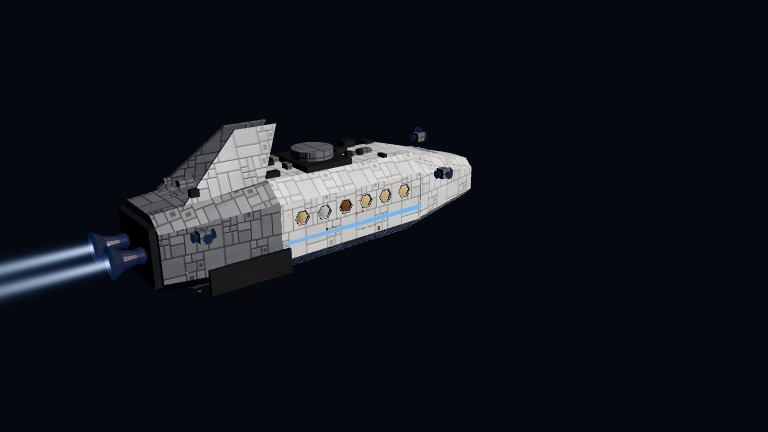

| | | |
|---|---|---|
| 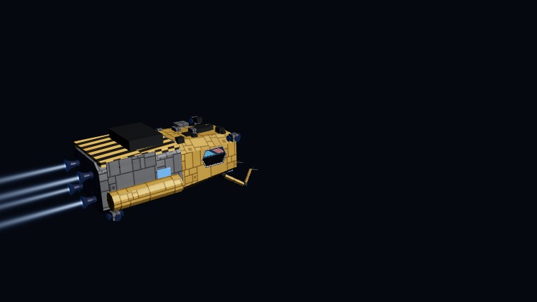 | 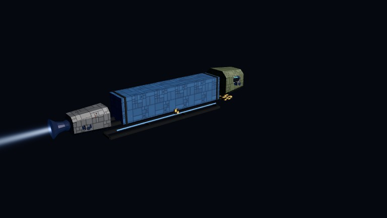 | 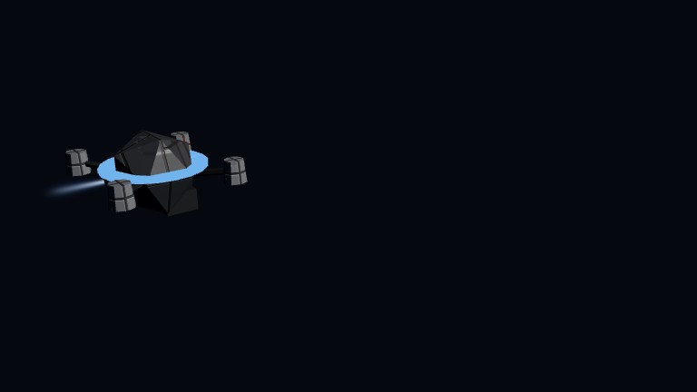 |
| *Navette de maintenance* (8,8 m) — bras, projecteurs | *Gabare* (23 m) — poutre, conteneurs de 12 m | *Drone d'inspection* (2,4 m) |

*Captures de la démo v7.2.2 (générateur `smallcraft.js`, repris tel quel).*

### 2.2 Baies à champ de force

Les vaisseaux dotés de baies de hangar (paquebot *Belle-Étoile*, pousseurs, *Vagabonde*) font vivre
leurs engins : un engin **garé** (18–40 s) **sort** lentement à travers le champ de force (onde
circulaire à la traversée), part en **mission**, puis **revient** s'aligner et rentrer. Le vaisseau du
joueur n'y échappe pas : un long-courrier à baies anime les siennes.

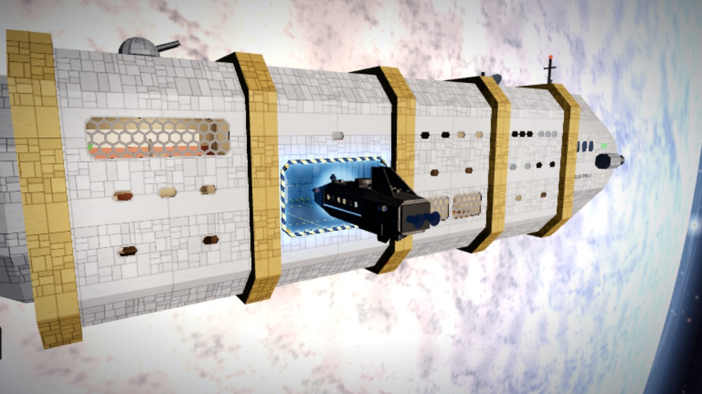

**⚑ à valider — navette de livraison des vaisseaux à baie.** Pour un vaisseau doté d'une grande baie
latérale, l'escale pourrait livrer par la **navette de transport de la baie** plutôt que par le
remorqueur et son conteneur actuels. Proposition : oui pour le paquebot (passagers), non pour les
cargos (conteneurs).

### 2.3 Densité et respect de la performance

La densité suit la démo (8 à 12 objets mobiles par système) : c'est le budget déjà mesuré à plus de
20 minutes de simulation sans dérive mémoire. **⚑ à valider** : une densité modulée par la
population du système (système à planète habitable et stations : ×1 ; système sans port : trafic
réduit à 1–2 vaisseaux de passage).

---

## 3. Radar

Instrument permanent du HUD, en bas à droite (au-dessus de la barre d'icônes), repris de la démo et
enrichi des catégories du jeu.

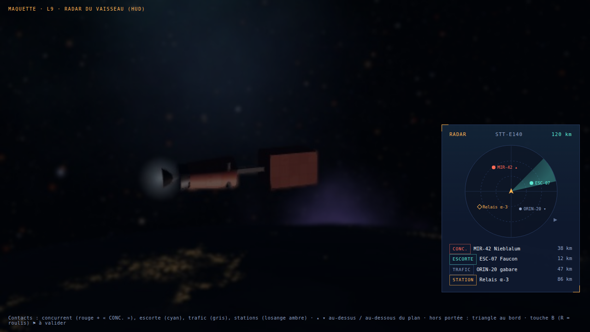

| Élément | Règle |
|---|---|
| Centre | votre vaisseau, **nez vers le haut** |
| Contacts | point coloré **et** étiquette texte (la couleur n'est jamais le seul indice) : concurrent (rouge, « CONC. »), escorte (cyan, « ESCORTE »), trafic (gris, « TRAFIC »), station (losange ambre, « STATION ») |
| Relief | ▴ / ▾ : au-dessus / au-dessous du plan du vaisseau |
| Hors portée | triangle au bord du cercle, dans la direction du contact |
| Portée | automatique par paliers (300 m → 3 millions de km) pour garder au moins deux contacts ; changement après 1,2 s de stabilité ; échelle en racine carrée |
| Liste | les 4 plus proches : catégorie, immatriculation, nom, distance (m, km, ua) |
| Balayage | un tour en 4 s, qui avive les contacts à son passage (coupé si « réduire les animations ») |
| Commande | **touche B** (« balayage ») et icône de la barre — **⚑ à valider** : la touche R du radar de la démo est déjà le **roulis** dans le jeu |
| Masqué | pendant le survol du système, la séquence de titre, quand la carte est ouverte |

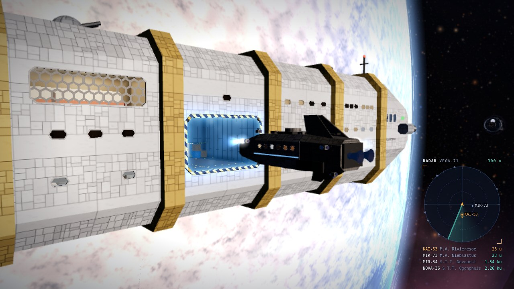

La **carte** (L4) affiche aussi le trafic : au niveau système, les vaisseaux en orbite de chaque
planète ; un clic donne leur fiche (immatriculation, rôle, distance), un double-clic cadre la caméra
sur eux.

---

## 4. Concurrence

### 4.1 Principe

Certains contrats sont **disputés** : un ou deux transporteurs visent la même livraison et partent en
même temps que vous. La première livraison arrivée touche la prime pleine ; les suivantes touchent
moins. **Une livraison n'est jamais perdue**, elle rapporte moins : la concurrence rend le jeu plus
tendu sans le rendre punitif.

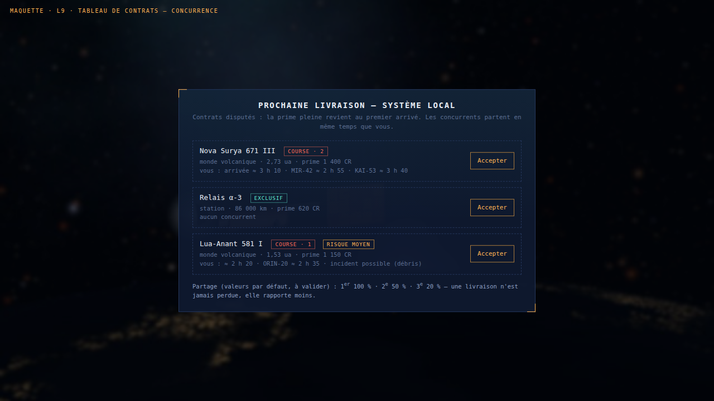

| Règle | Valeur proposée | ⚑ |
|---|---|---|
| Contrats locaux disputés (tableau de contrats) | 40 %, avec 1 ou 2 concurrents | à valider |
| Étapes de l'itinéraire interstellaire disputées | 25 %, avec 1 concurrent | à valider |
| Partage de la prime | 1er : 100 % · 2e : 50 % · 3e : 20 % | à valider |
| Bonus de victoire dans une course | +10 % de la prime | à valider |
| Information donnée au joueur | nombre de concurrents et leurs temps d'arrivée estimés, dès l'offre | — |

### 4.2 Déroulé d'une course

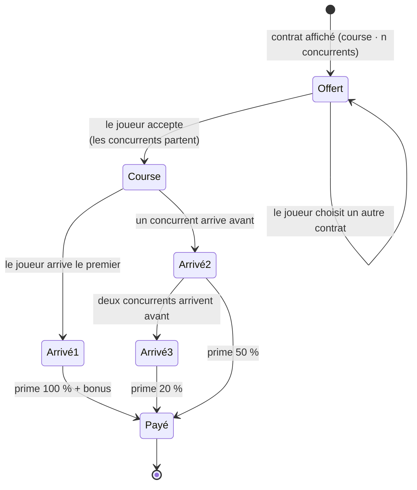

### 4.3 Leviers du joueur

- **Accepter vite** : les concurrents partent à l'acceptation, pas avant.
- **Le vaisseau** : l'accélération du modèle raccourcit le temps d'arrivée physique.
- **Les Propulseurs** : **proposition** pour la décision en attente — l'amélioration « Propulseurs » du
  port augmente l'accélération (1 g → jusqu'à 1,6 g). À l'écran, un transfert dure toujours ~22 s (le
  temps s'adapte) ; mais **en course**, c'est le temps physique qui compte : l'amélioration fait gagner
  des courses. **⚑ à valider** — cela redonne un effet concret à l'amélioration.
- **L'escorte de rang III** : elle ouvre une trajectoire plus directe (−10 % de temps d'arrivée,
  **⚑ à valider**).

Les concurrents sont visibles : sur le radar (« CONC. ») et sur la carte ; à l'arrivée, la radio
annonce le classement (voix générées, comme les dialogues actuels).

---

## 5. Escorte

### 5.1 Principe

Au port, le joueur peut **louer une escorte** pour les prochaines étapes. L'escorte vole en
formation à ses côtés, saute et passe en distorsion avec lui, et **désamorce les incidents de
route**. Sans combat : elle dissuade, intercepte des débris, remorque en cas d'avarie.

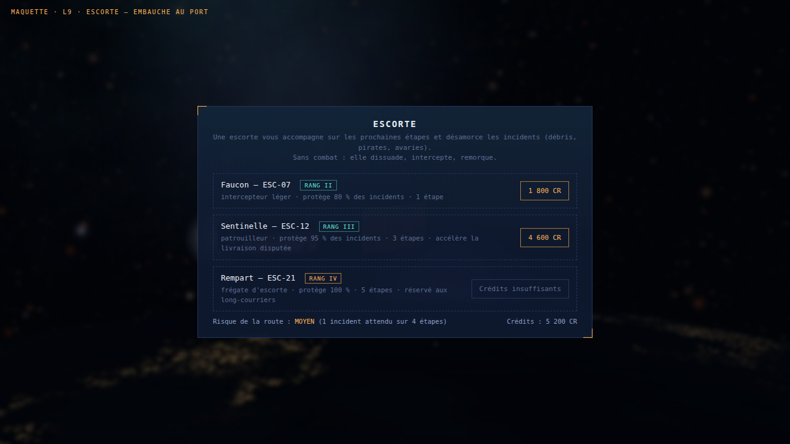

| Rang | Modèle proposé | Protection | Durée | Prix | ⚑ |
|---|---|---|---|---|---|
| II | intercepteur léger | 80 % des incidents | 1 étape | 1 800 CR | à valider |
| III | patrouilleur | 95 % · temps d'arrivée −10 % en course | 3 étapes | 4 600 CR | à valider |
| IV | frégate d'escorte | 100 % | 5 étapes | 9 500 CR · long-courriers seulement | à valider |

### 5.2 Incidents de route

Un incident peut survenir pendant un **transfert** (jamais pendant l'approche manuelle ni l'escale).
Le risque dépend du système (indiqué sur le tableau de contrats et au port).

| Incident | Sans escorte | Avec escorte (si protégé) | ⚑ |
|---|---|---|---|
| Champ de débris | +40 min de trajet, usure de coque +0,02 | l'escorte passe devant et dévie les fragments | à valider |
| Pirates | rançon : −15 % de la prime | l'escorte s'interpose, les pirates renoncent | à valider |
| Avarie | +1 h, carburant −5 % | l'escorte remorque jusqu'à l'orbite | à valider |
| Risque par transfert | faible 5 % · moyen 12 % · élevé 25 % | — | à valider |

### 5.3 Cycle d'un contrat d'escorte

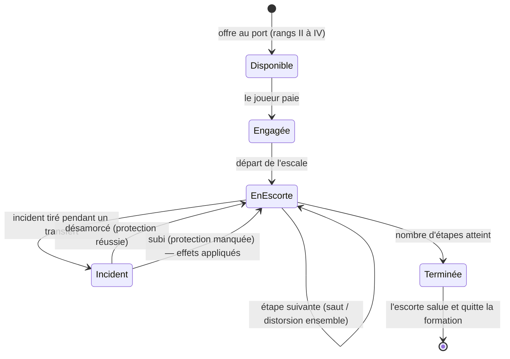

---

## 6. Parcours type : une escale disputée, escortée

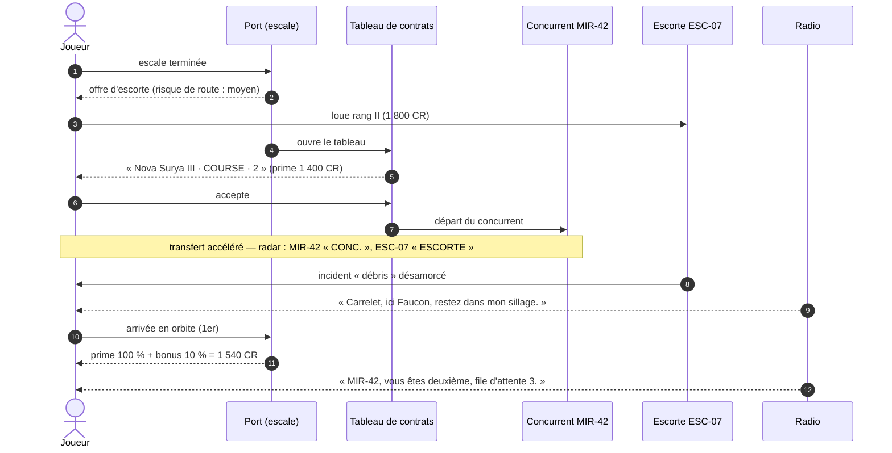

---

## 7. Économie — récapitulatif

| Flux | Valeur proposée | ⚑ |
|---|---|---|
| Prime d'un contrat disputé | comme un contrat normal (L3), partagée selon l'ordre d'arrivée | — |
| Bonus de victoire | +10 % | à valider |
| Escorte | 1 800 / 4 600 / 9 500 CR selon le rang | à valider |
| Rançon (pirates, sans escorte) | −15 % de la prime | à valider |
| Retards | aucun coût direct, mais perte de courses | — |
| Propulseurs (proposition) | +0,15 g par niveau, jusqu'à 1,6 g | à valider |

Garde-fous : une partie reste toujours jouable (aucune perte de livraison, aucune dette), le joueur
peut ignorer l'escorte et les courses.

---

## 8. Décisions à valider

1. Densité du trafic modulée par la population du système (§2.3).
2. Navette de livraison par la baie pour le paquebot (§2.2).
3. Touche du radar : **B** (R est le roulis) (§3).
4. Proportion de contrats disputés, partage 100 / 50 / 20 %, bonus 10 % (§4.1).
5. Effet des Propulseurs sur l'accélération, décisif en course (§4.3) — **tranche la décision en attente**.
6. Rangs, prix, protection et durée des escortes (§5.1).
7. Types, effets et fréquences des incidents (§5.2).
