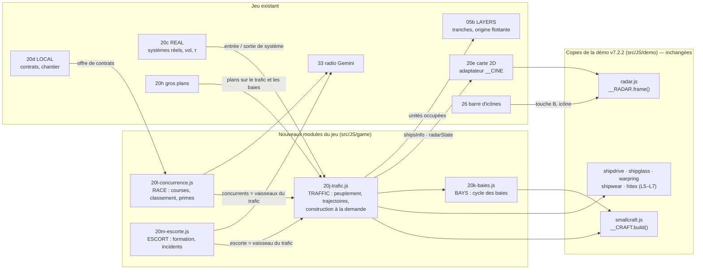
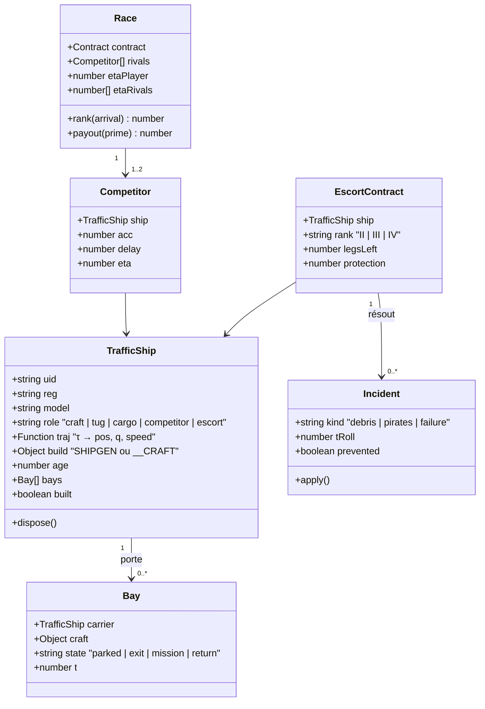
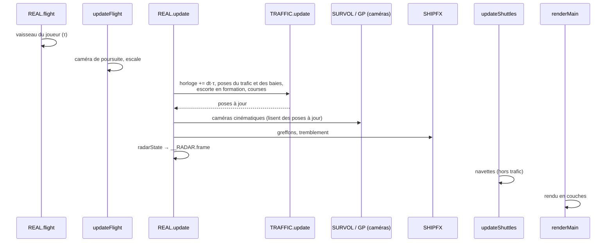
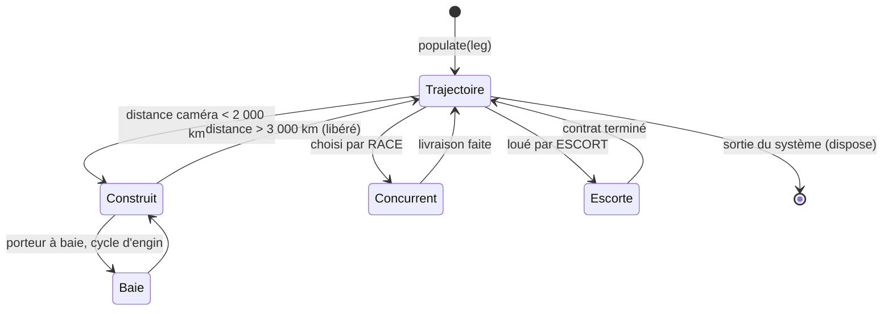
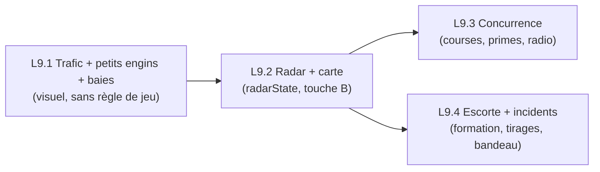

# Space Travel & Transport — L9 · Spécification technique

Mise en œuvre de [`spec-L9-jeu.md`](spec-L9-jeu.md) : trafic ambiant, petits engins et baies à
champ de force, radar, concurrence, escorte et incidents.

| | |
|---|---|
| Base | v2.17 (échelle réelle seule, 1 409 Ko source, 1 078 Ko obfusquée) |
| Principe | reprendre **tels quels** les modules de la démo quand ils existent ; écrire le reste dans des modules du jeu raccordés comme L2 à L10 |
| Contraintes héritées | origine flottante et tranches de profondeur (L2.1), temps physique τ (L2.3), greffons vaisseau (L5–L7), leçons des bugs de largage (§6) |

---

## 1. Architecture



| Module | Nature | Rôle | Taille estimée |
|---|---|---|---|
| `demo/smallcraft.js` | copie inchangée | 4 types d'engins (transport, maintenance, drone, gabare), RCS, feux, usure | 297 lignes |
| `demo/radar.js` | copie inchangée | dessin du radar, portée automatique, liste des 4 plus proches | 109 lignes |
| `20j-trafic.js` | nouveau (port de `cine.js` §657–702) | peuplement d'un système, `orbitTraj`, `pingPongTraj`, construction des vaisseaux, mise à jour par image | ~350 lignes |
| `20k-baies.js` | nouveau (port de `cine.js` §365–542) | cycle garé → sortie → mission → retour, pose dans le repère du porteur | ~250 lignes |
| `20l-concurrence.js` | nouveau | tirage des contrats disputés, temps d'arrivée, classement, partage | ~200 lignes |
| `20m-escorte.js` | nouveau | offre, formation, tirage et résolution des incidents | ~300 lignes |
| `20e-carte-2d.js` | étendu | `shipsInfo()` avec le trafic ; nouveau `radarState()` | +60 lignes |

---

## 2. Reprise de la démo

### 2.1 Tel quel

- **`smallcraft.js`** — `CRAFT.build(kind, { variant, age, seed, slim })` → `{ group, kind, variant, len,
  box, rcs, rcsLen, nav, lamps, thr, bay, dispose }`. Mètres, nez vers −Z, dos vers +Y (repère de
  `SHIPGEN`). 4 à 8 appels de dessin par engin.
- **`radar.js`** — lit `window.__CINE.radarState()` et `__CINE.fmtU()` ; `__RADAR.frame(now, allowed)`
  à chaque image ; `toggle / set / isOn / stats`.

### 2.2 Porté (la démo le fait dans `cine.js`, spectateur)

| Fonction de `cine.js` | Devenir dans le jeu |
|---|---|
| `populateSystem(leg)` | `TRAFFIC.populate(leg)` — mêmes rôles et tirages, stations L3 comme « station haute » |
| `orbitTraj`, `pingPongTraj` | reprises ; paramétrées par **l'horloge physique du système** (§4) au lieu de `tauAt(T)` |
| `makeShip`, `makeCraft` | `SHIPGEN.build(...)` + greffons L5–L7 ; `__CRAFT.build(...)` |
| cycle des baies (`bayOps`, `opPose`) | `20k-baies.js`, pose calculée dans le repère du porteur |
| `radarState()` | réécrit dans l'adaptateur 20e : centre = **vaisseau du joueur**, catégories du jeu |
| réalisateur, relais, sélecteur | **non repris** (le jeu a ses propres caméras, L10) |

### 2.3 Contrat de données du radar

`radarState()` renvoie `null` quand le radar doit se taire (titre, survol, carte ouverte), sinon :

```js
{ name, type, reg, speed,               // vaisseau du joueur
  contacts: [ { uid, name, type, reg,   // triés par distance croissante
                d,                      // distance (m)
                x, y, z,                // dans le repère du joueur : droite, avant, haut
                craft,                  // petit engin (gris)
                cat } ] }               // ajout du jeu : 'conc' | 'escort' | 'traffic' | 'station'
```

`radar.js` ignore `cat` ; la catégorie est rendue par une surcouche fine (étiquette texte + couleur)
posée par l'adaptateur sur la liste des 4 plus proches — **aucune retouche de `radar.js`**.

---

## 3. Modèle de données



---

## 4. Temps, échelle et rendu

**Horloge physique.** Les trajectoires du trafic sont des fonctions du temps physique. Chaque
système tient `TRAFFIC.clock += dt × REAL.tau` : en transfert accéléré (×300–900), le trafic défile
à la même cadence que votre vaisseau ; en temps réel (approche, orbite), il circule à sa vitesse
vraie (~8 km/s en orbite basse).

**Couches et tranches.** Vaisseaux et engins vont dans `LAYERS.shipWorld` (tranches d'échelle 1,
≤ 800 km) ; chaque vaisseau construit s'ajoute à `LAYERS.units` pour que sa tranche soit rendue.
Au-delà de 800 km, un vaisseau n'est plus dessiné (sous le pixel) mais reste sur le radar et la
carte.

**Construction à la demande.** Tout vaisseau du système a sa trajectoire ; seuls ceux à moins de
**2 000 km** de la caméra ont un maillage (construit en 1 image, libéré au-delà de 3 000 km,
hystérésis). Les coques partagent textures (hitex) et programmes ; `shipwear` clone les matériaux
par vaisseau.

### 4.1 Ordre de mise à jour par image — règle impérative

Les bugs de largage (§6) venaient tous d'objets **déplacés après** le calcul de la caméra. Règle :
**toute position lue par une caméra est à jour avant qu'elle soit lue.**



---

## 5. États

### 5.1 Vaisseau du trafic



### 5.2 Course (moteur)

`RACE` calcule à l'acceptation les **temps d'arrivée physiques** (profil accélération / retournement /
freinage de chaque vaisseau : distance, accélération du modèle, délai de départ tiré) et **fixe
l'ordre d'arrivée dès le départ** ; les vaisseaux concurrents suivent ensuite des trajectoires calées
sur ces temps. Le classement est donc déterministe, visible et cohérent avec ce que montre le radar.

---

## 6. Leçons des lots précédents à appliquer

| Leçon | Origine | Application L9 |
|---|---|---|
| Positions lues par une caméra : à jour avant lecture | largage (caméra à 330 m, 1 km de retard) | ordre §4.1 ; les caméras sur un engin rapide extrapolent d'une image |
| Orientation : jamais de « haut » absolu | largage, séquence de titre | engins et vaisseaux orientés avec la verticale de la planète ; interpolation à sens constant |
| Échelles héritées ×f appliquées une seule fois | conteneur à f² | engins en mètres (échelle 1), aucun facteur de jeu |
| Mesurer la coque, pas les sprites | suivi de navette | boîtes englobantes sur les maillages seuls |
| Tests en simulation accélérée : `updateMatrixWorld` explicite | mesure du largage | tous les tests L9 |

---

## 7. Interfaces

| Élément | Mise en œuvre |
|---|---|
| Radar | `radar.js` + `radarState()` ; icône dans la barre (module 26) ; **touche B** (R = roulis) |
| Tableau de contrats | `LOCAL.openContractBoard` : badge « COURSE · n », temps d'arrivée, « RISQUE » |
| Port — escorte | nouvelle ligne du panneau d'escale (comme le chantier naval, L3) + panneau d'embauche |
| Incident | bandeau HUD + radio (persona « pilote d'escorte », Gemini Nano) |
| Carte | `shipsInfo()` étendu : trafic, concurrents, escorte ; fiche et double-clic (L4) |
| Gros plans | `GP` : nouveaux plans « trafic » et « manœuvre de baie » (repère du porteur) |
| Textes | fr / en / de / es (`01-internationalisation…`), comme les lots précédents |

---

## 8. Performances

| Poste | Budget | Référence |
|---|---|---|
| Appels de dessin, système à baies | ≤ +150 par image (≈ 450 au total) | démo : ≈ 280 médiane, 780 au pire ; jeu : ≈ 300 aujourd'hui |
| Vaisseaux construits simultanément | ≤ 12 | démo : 11–15 sur 20 min, tas stable |
| Radar | ≤ 1 ms/image | démo : 0,43 ms mise à jour + 0,48 ms dessin |
| Construction d'un vaisseau | étalée : 1 par image | évite les à-coups à l'entrée d'un système |
| Mémoire GPU | textures partagées | hitex : +22 Mo une fois (5,5 Mo en qualité basse) |

La résolution dynamique (déjà en place) absorbe les pics ; `?traffic=0` coupe le trafic ambiant
(comme la démo), utile pour mesurer et pour les machines modestes.

---

## 9. Tests

| Test | Vérifie |
|---|---|
| `trafic_test.py` | composition par système ; orbites à rayon constant ; jamais sous la surface ; construction / libération à distance ; ≤ 12 vaisseaux construits ; horloge suivant τ |
| `baies_test.py` | cycle complet d'une baie ; engin jamais dans la coque hors de la baie ; sortie dans l'axe (correctif v7.2.2) |
| `radar_test.py` | contacts cohérents avec les positions ; catégories ; portée automatique sans pompage ; masqué au titre, au survol, carte ouverte |
| `concurrence_test.py` | ordre d'arrivée = ordre des temps calculés ; primes 100 / 50 / 20 % ; aucune livraison perdue |
| `escorte_test.py` | formation stable pendant saut et distorsion ; incidents : tirage, protection, effets |
| suites existantes | fumée, vol, passage, commerce, carte, survol, gros plans, largage, titre — sans régression |

---

## 10. Lots de réalisation



| Lot | Contenu | Effort | Risque principal |
|---|---|---|---|
| L9.1 | `20j`, `20k`, copies `smallcraft.js` ; horloge τ ; construction à la demande | élevé | performance dans les systèmes à baies |
| L9.2 | `radar.js`, `radarState()`, icône, touche B, carte | moyen | cohérence radar / monde (repères) |
| L9.3 | `20l`, tableau enrichi, primes, radio | moyen | équilibrage (constantes) |
| L9.4 | `20m`, panneau d'escorte, incidents, bandeau, radio | élevé | escorte pendant saut / distorsion |

Chaque lot est livré avec sa version obfusquée et ses tests, comme les précédents.
