# Space Travel & Transport — Navette de livraison et ports orbitaux

**Spécification d'implémentation — propositions et options.**
Reprend et remplace la proposition du §24 de la spécification v2.16 (« Ports orbitaux »), écrite avant
l'échelle réelle, et ouvre la refonte de la navette de livraison demandée dans `TODO.md` (2026-09-28).

| | |
|---|---|
| Base | v2.17 : échelle réelle seule, greffons vaisseau de la démo (L5–L7), commerce local (L3), carte 2D (L4), gros plans (L10), séquence de titre ; L9 (trafic, concurrence, escorte, radar) **spécifié** |
| Statut | **décisions prises le 28/09/2026** — lots N et **N2 (navette de baie) implémentés et testés** ; lots ports orbitaux à venir |
| Suite prévue | après décision : implémentation par lots (§B.10), puis mise à jour de la spécification générale, du `README.md` et du `TODO.md` |

---

## Décisions (28/09/2026)

| Sujet | Décision | Conséquence |
|---|---|---|
| Navette | **P2 — navette-cargo** | berceau **dorsal** (et non ventral comme sur le rendu de principe) : pendant le chargement, la navette attend sous le module d'amarrage et le bras descend le conteneur depuis la soute — il ne peut le poser que sur son dos |
| Modèles de ports | **archétypes + modules par graine** | 3 archétypes (anneau, moyeu à pontons, tour) déclinés par graine |
| Amarrage | **tous les vaisseaux accostent** (pas de rade) | **chaque port offre au moins un poste L** (≤ 240 m), anneau compris ; **le poste attribué au joueur lui est réservé** (jamais pris par le trafic) |
| Pilotage de l'amarrage | manuel assisté (recommandation, sans réponse) | modifiable |
| Déchargement | portique de ponton (recommandation, sans réponse) | modifiable |

## Lot N — navette-cargo : implémenté (v2.17)

- `20p-navette.js` : conteneur **ISO 20' réel** (6,058 × 2,438 × 2,591 m ; tôle ondulée, rails, pièces de coin, portes,
  code propriétaire, couleur d'armateur par graine) ; navette-cargo = navette de transport de la démo (`smallcraft.js`,
  copié tel quel) + berceau dorsal à 4 pinces ; même interface que l'ancienne navette.
- Module d'amarrage dimensionné pour le conteneur ISO (5,05 m par unité d'origine) au lieu de la taille du vaisseau.
- **Chorégraphie reconstruite depuis les poses réelles du bras** : l'ancien point de stock était à ~3 unités d'origine de
  la saisie (≈ 7 m sur le Carrelet), et le point de dépose ailleurs que le berceau — le conteneur sautait. Désormais le
  conteneur attend exactement où la pince le saisit, la navette exactement où la pince dépose.
- Plan de chargement (gros plans) resserré sur la navette et le point de dépose (≈ 2 longueurs de navette).
- Tests : `largage_test.py` (8/8, dont « conteneur ISO à l'échelle 1 : 6,06 m » et « chargement sans saut : 0,48 m par
  image au plus, mouvement du bras ») ; `saccades_test.py` 6/6 ; gros plans 9/9 ; fumée 8/8.

## Lot N2 — navette de baie (décisions du 28/09/2026, implémenté)

**Consignes** : plus de module d'amarrage ni de bras ; la navette part de la **baie intégrée** au vaisseau ; **les
conteneurs ne voyagent que sur les porte-conteneurs** ; les approches se font à **vitesse de manœuvre**.
**Constat** : aucun des quatre porte-conteneurs n'avait de baie (seuls les pousseurs, le paquebot et la Vagabonde en ont).
**Décision** : baie ventrale ajoutée aux porte-conteneurs **et** prise directe sur la pile.

| Étape (porte-conteneurs) | Mouvement | Vitesse de pointe (réglage du 29/09) |
|---|---|---|
| 1. Sortie de baie | descente à travers le champ de force, attitude du vaisseau | 2,5 m/s |
| 2. Vers la pile | sous la coque puis le long de son flanc, roulis de 90° (dos vers la pile) | 8 m/s |
| 3. Approche finale | 4 m de recul, contact **à l'arrêt** | 2 m/s → 0 |
| 4. Prise | le conteneur extérieur glisse de son logement au berceau | 2,6 s |
| 5. Écartement | 30 m depuis la pile, puis accélération | 8 m/s |
| 6. Transfert, livraison | vers le port (crédits, radio inchangés) | transfert |
| 7. Retour | vers un point d'approche **dans l'axe de la baie, juste hors de la zone de manœuvre** (encombrement + 45 m) | décélération jusqu'à l'arrêt |
| 8. Entrée en baie | alignement, montée à travers le champ | 8 m/s puis 2,5 m/s |

**Mesures** (Carrelet et Basalte) : aller-retour de la navette **97 s** (170 s avant le réglage) ; escale complète
**111 s** (194 s) ; vitesse ≤ 8,00 m/s dans les 40 m autour de la coque (2 462 relevés) ; contact avec la pile à
0,001 m/s ; aucune traversée de l'encombrement du vaisseau ; conteneur sans saut. Réduire le point d'approche à 40 m
**dans la direction d'arrivée** faisait longer la coque à ~63 m/s : il est désormais placé dans l'axe de la baie.

| Sortie de baie | Prise sur la pile | Écartement | Retour en baie |
|---|---|---|---|
| 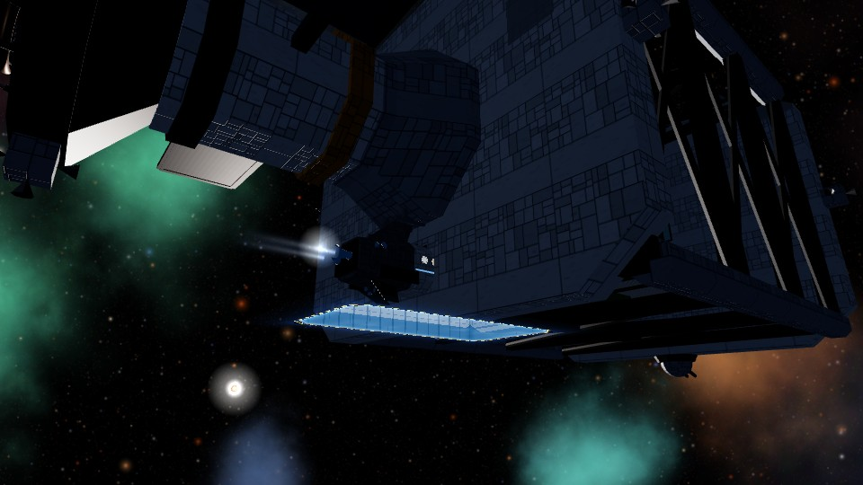 | 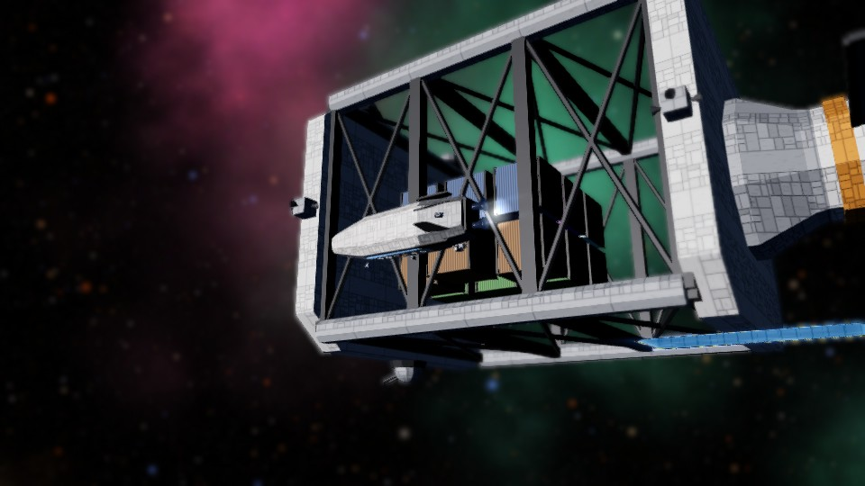 | 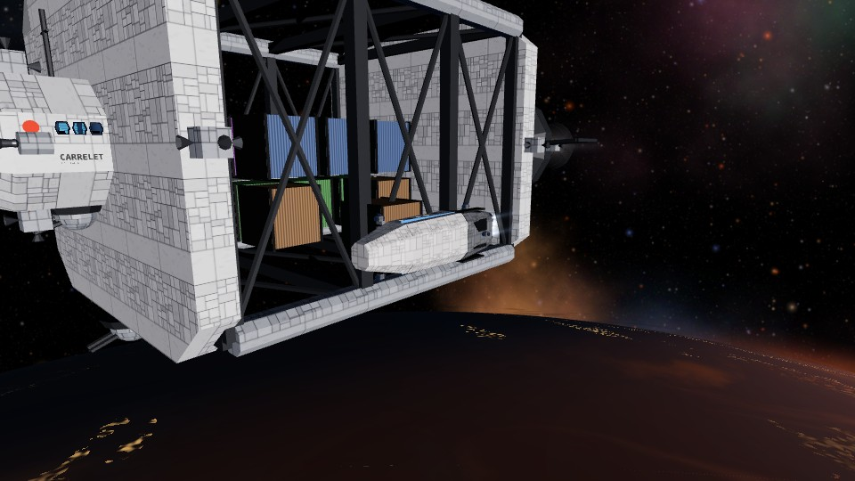 | 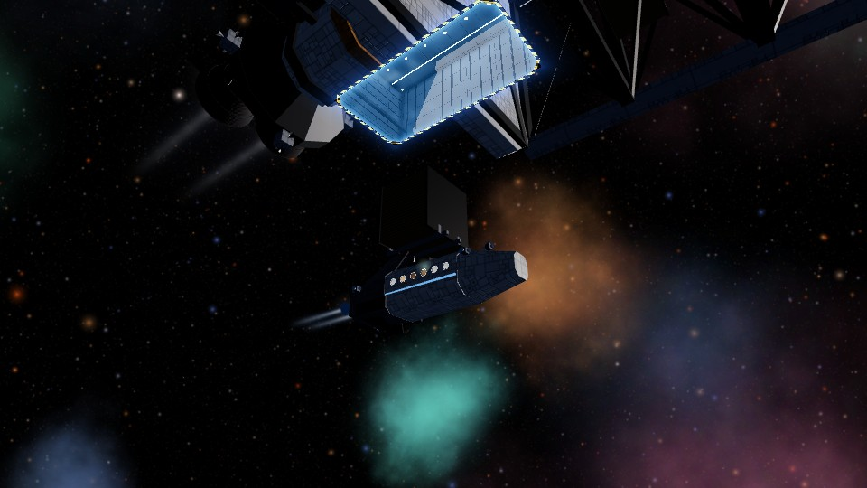 |

**Escale** : une navette de baie par escale (les manœuvres lentes rendaient trois départs rapprochés impossibles) ;
plafond de sécurité de l'escale prolongé pour les vaisseaux à baie (à 90 s, il clôturait l'escale navette encore
dehors : le vaisseau repartait et la navette le poursuivait — rotations aberrantes, plus de plan de suivi).

Le logement vidé reste visible vide pendant l'escale ; la pile est complétée au départ de l'étape suivante.

**Baies ajoutées** (table `BELLY` de `shipglass.js`, seule modification de la copie de la démo) :

| Modèle | Section au point d'amarrage | Ouverture × profondeur |
|---|---|---|
| Carrelet | 42,6 × 32,7 × 27 m | 19,6 × 9,6 m × 10 m |
| Basalte | 90,7 × 90,7 × 28 m | 20,0 × 10,8 m × 10 m |
| Hirondelle, Longue-Échine | 13,9 × 15,9 × 22 m | 19,6 × 8,2 m × 10 m |

| Carrelet | Basalte | Hirondelle | Longue-Échine |
|---|---|---|---|
| 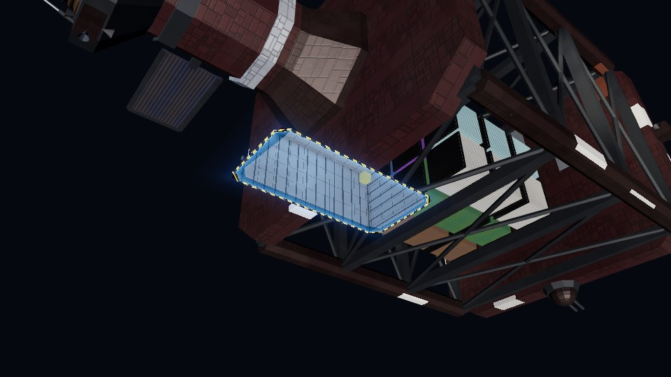 | 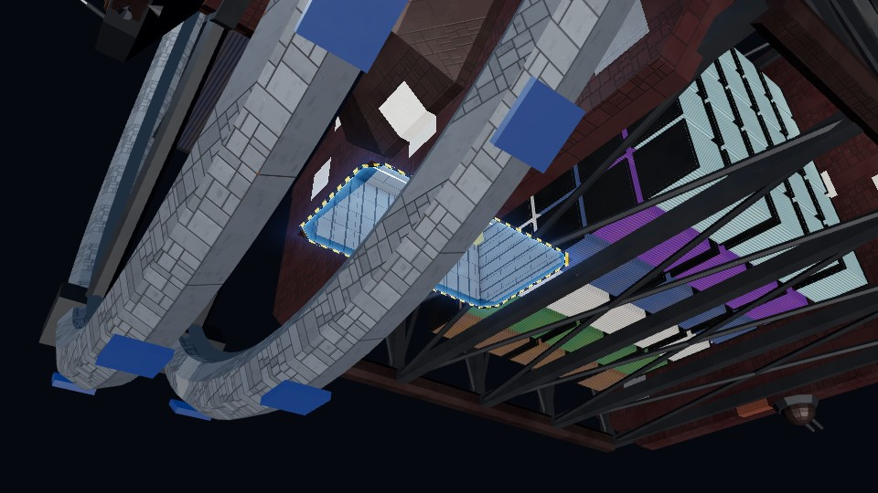 | 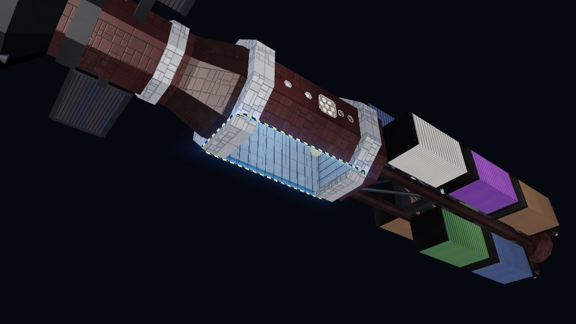 | 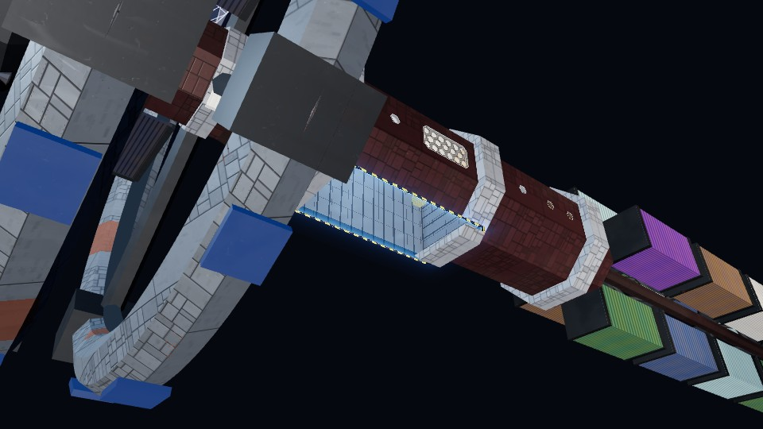 |

**Autres vaisseaux** (décision : chacun livre sa cargaison avec les engins de ses baies, **jamais de conteneur**) :

| Vaisseau | Engin | Baie |
|---|---|---|
| Paquebot | navette de transport (passagers) | latérale 12,4 × 7 m, 17,3 m de profondeur — nez vers l'intérieur, sortie en marche arrière ; la tuyère affleure au champ |
| Vagabonde | drone-cargo | fentes latérales 10 × 2,3 m |
| Pousseurs | drone-cargo | fente ventrale 11,2 × 3,2 m (même la navette de maintenance étroite n'y tient pas) |
| Citernier | aucun (sans baie) | livraison payée sans navette, en attendant les ports orbitaux (lots P) |

Plus aucun module d'amarrage ni bras, sur aucun vaisseau. Économie : prix par passager / par
lot de fret léger / par tonne de glace, calés sur les recettes actuelles d'une escale (⚑ à valider).

**Ensuite** (demandé) : évitement d'obstacles en vol — planètes, lunes, stations, vaisseaux (et, déjà visible sur la
Longue-Échine, les anneaux de distorsion près de la baie).

# Partie A — Refonte de la navette de livraison de conteneurs

## A.1 Constat

La navette actuelle date de la v2.1 : un pousseur cylindrique rouge et un conteneur cubique, en
primitives simples. Depuis L5–L7, les vaisseaux et petits engins suivent le style de la démo : coques à
panneaux, usure, livrées, feux de navigation, blocs RCS, tuyères à torche. La navette est désormais le
seul élément du jeu dans l'ancien style — et elle est filmée en gros plan à chaque escale (L10).

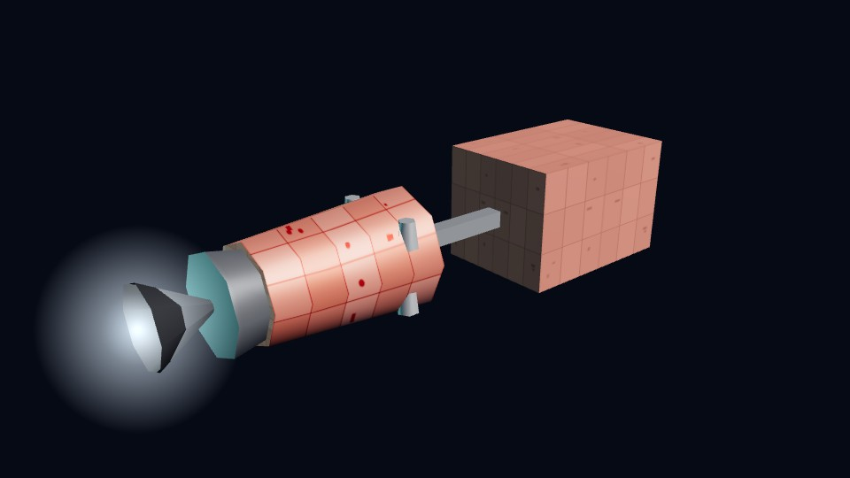

Autre écart : le conteneur fait aujourd'hui **2,6 × 2,4 × 3,6 m** (dessiné pour l'ancien monde
compressé, puis agrandi). Un conteneur réel ISO 20' mesure **6,06 × 2,44 × 2,59 m**. Toutes les
propositions ci-dessous passent au conteneur ISO réel — un nouveau modèle (tôle ondulée, marquages,
couleurs d'armateur) partagé par la navette, la soute du vaisseau et les ports.

## A.2 Trois propositions

| | P1 — Gabare de la démo | P2 — Navette-cargo sur mesure | P3 — Remorqueur à bras |
|---|---|---|---|
| Rendu | 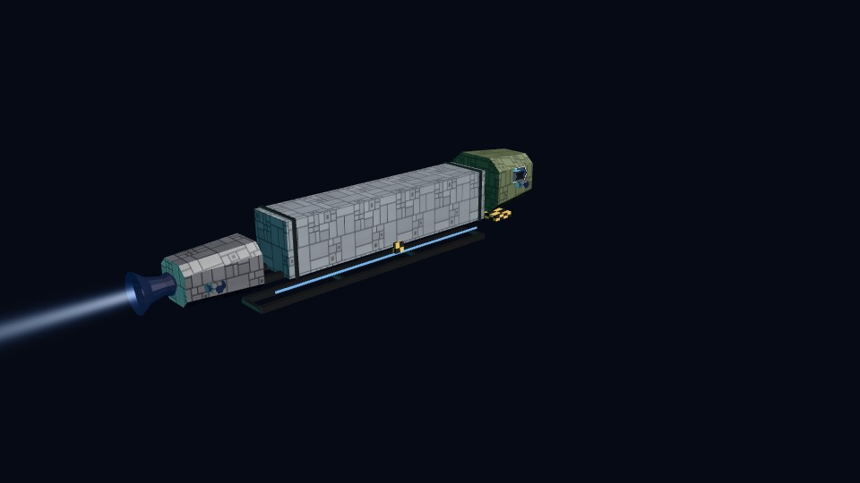 | 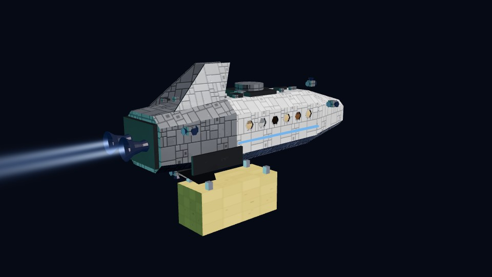 | 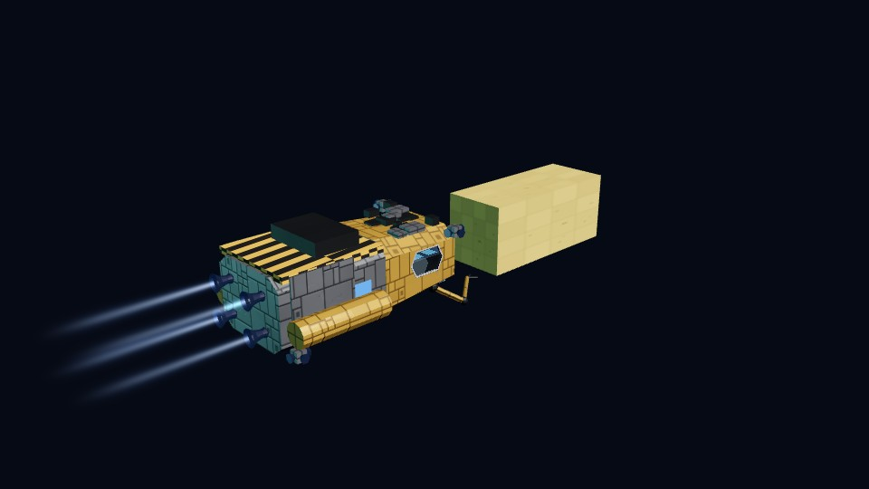 |
| Principe | `smallcraft.js` tel quel : cabine, poutre en treillis, 1–2 conteneurs de 12 m, tuyère | corps de navette de transport de la démo, **berceau ventral** et 4 pinces pour un conteneur ISO 20' | navette de maintenance de la démo : le conteneur est **saisi par ses bras manipulateurs** |
| Dimensions | 23–34 m | 17,5 m de coque, 9,7 m de haut avec le conteneur | 9,4 m de coque, 16 m avec le conteneur |
| Chargement à bord | la gabare arrive **chargée** : plus de scène du bras du vaisseau (ou le bras pose sur la poutre) | **scène actuelle conservée** : le bras du vaisseau pose le conteneur dans le berceau | le remorqueur **vient prendre** le conteneur au dock avec ses bras : plus de bras de vaisseau |
| Style | identique à la démo | démo + berceau propre au jeu | démo, plus « chantier » (projecteurs, bras) |
| Effort | faible (copie + raccord) | moyen (composition + berceau + réglages de la scène de chargement) | élevé (animation des bras, prise et dépose) |
| Valeur | haute visuellement, mais la scène de chargement actuelle disparaît | haute : nouveau style **et** mise en scène actuelle préservée | très haute en gros plan, mais nouvelle chorégraphie à régler et tester |

**Recommandation : P2**, éventuellement complétée par **P1 comme gros porteur** : navette-cargo pour les
vaisseaux S et M (1 conteneur), gabare à 2 conteneurs pour les vaisseaux L. Le tirage par classe de
vaisseau est déterministe (graine), comme le reste.

## A.3 Points communs aux trois propositions

- **Conteneur ISO 20'** réel, modèle neuf ; module d'amarrage (dock) et bras du vaisseau **redimensionnés**
  en conséquence (ils sont aujourd'hui calés sur l'ancien conteneur).
- **Greffons de la démo** : usure (`shipwear`), feux, RCS, chauffe des tuyères (`shipdrive`) — la navette
  vieillit avec le vaisseau.
- **Règles déjà acquises** (correctifs du largage et des saccades) : échelle appliquée une seule fois ;
  orientation avec la verticale de la planète, jamais la verticale absolue ; navettes mises à jour **avant**
  les caméras ; tests à cadence irrégulière (`saccades_test.py`, `largage_test.py`) repris tels quels.

---

# Partie B — Ports orbitaux

## B.1 Contexte

- **§24 de la v2.16** (non implémenté) : trois maquettes fixes (anneau, moyeu à bras, tour d'amarrage),
  un tiers des systèmes, systématique pour une géante gazeuse cible, taille proportionnelle au rayon de
  la planète ; à l'arrivée, orbite classique et navettes vers la station.
- **Depuis** : l'échelle réelle rend la « taille proportionnelle à la planète » caduque (une planète fait
  des milliers de km, une station quelques centaines de mètres) ; L3 a ajouté de **petites stations**
  (anneau et moyeu, 0 à 2 par système, destinations du commerce local, sans amarrage) ; L9 a spécifié
  **missions disputées et escortes**, à trouver au port.

## B.2 Ce que doit devenir un port orbital

Un **lieu d'escale complet** : le vaisseau **s'y amarre** à un ponton, décharge, se ravitaille, achète
au chantier, consulte le **tableau des missions** (contrats locaux et disputés) et loue une **escorte**
— avec un trafic de petits engins qui entre et sort de ses baies. Les ports au sol restent (planètes
habitables) ; le port orbital s'y ajoute et devient **le seul port possible d'une géante gazeuse**.

## B.3 Option 1 — Modèles de stations

| Option | Principe | Effort | Valeur |
|---|---|---|---|
| a. Trois maquettes fixes (v2.16) | anneau, moyeu, tour, identiques partout | faible | variété faible |
| b. Générateur modulaire | noyau + modules (pontons, anneaux habités, radiateurs, baies) assemblés comme `SHIPGEN` | élevé | variété illimitée |
| **c. Archétypes + modules** (recommandé) | 3 archétypes ; nombre et longueur des pontons, anneaux, antennes, baies tirés par graine | moyen | chaque port reconnaissable, aucun identique |

Concepts de principe à taille réelle (primitives simples, vaisseaux du jeu amarrés) :

| A — Anneau | B — Moyeu à pontons | C — Tour d'amarrage |
|---|---|---|
| 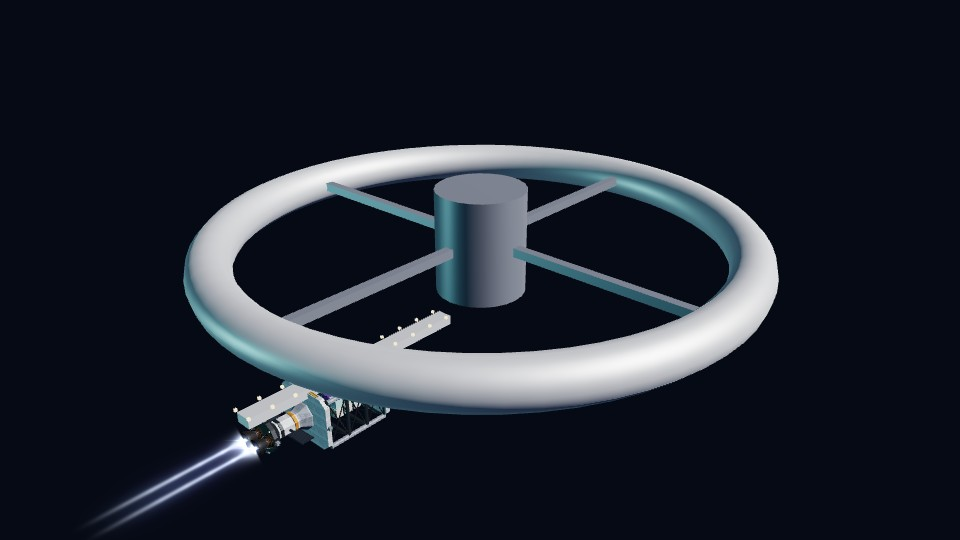 | 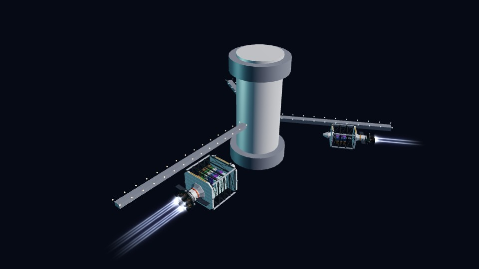 | 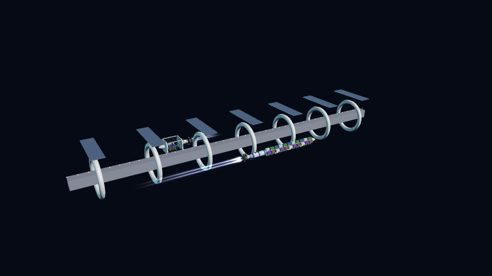 |
| ≈ 370 m · 1 ponton S/M · petites escales ; **reprend les stations L3** | ≈ 490 m · 3 pontons L, M, S · ports principaux | ≈ 900 m · anneaux étagés · géantes gazeuses, orbite haute |

## B.4 Option 2 — Placement

| Règle | Proposition | ⚑ |
|---|---|---|
| Fréquence | un tiers des systèmes (graine) ; **systématique** si la planète cible est une géante gazeuse | à valider |
| Planète | habitable ou géante gazeuse | — |
| Orbite | tellurique : 1,15–1,4 R ; géante : au-delà des anneaux, 2,5–3 R | à valider |
| Taille | **absolue**, par archétype (tableau B.3), plus la taille des vaisseaux à accueillir | — |
| Stations L3 | **absorbées** : elles deviennent des ports « anneau » (mêmes positions, mêmes noms) — un seul concept au lieu de deux | à valider |

## B.5 Option 3 — Amarrage selon la taille du vaisseau

La flotte actuelle va de **61 m** (pousseur léger) à **237 m** (cargo-poutre). Classes de postes :

| Classe | Longueur | Poste | Mode |
|---|---|---|---|
| Petits engins | < 40 m | baies à champ de force de la station (L7) | entrée dans le hangar |
| S | ≤ 100 m | ponton S ou M | accostage latéral le long du ponton |
| M | ≤ 180 m | ponton M ou L | accostage latéral |
| L | ≤ 240 m | ponton L | accostage latéral, ou **en rade** si aucun poste L libre |

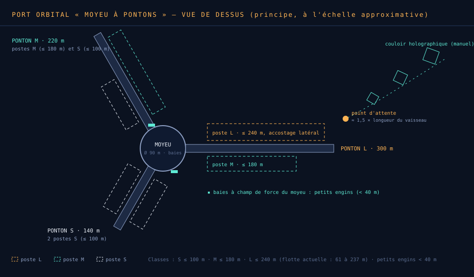

| Option | Principe | Effort | Valeur |
|---|---|---|---|
| a. Tous accostent | chaque vaisseau accoste physiquement à un poste de sa classe | élevé | spectaculaire, cohérent |
| **b. Accostage, rade pour L sans poste** (recommandé) | comme (a) ; un vaisseau L sans poste L libre mouille en rade (400 m) et est desservi par gabares (P1) | élevé | spectaculaire, ne bloque jamais une escale |
| c. Personne n'accoste (v2.16) | orbite + navettes vers la station | faible | la « séquence d'amarrage » demandée n'existe pas |

## B.6 Option 4 — Pilotage de l'amarrage

| Option | Principe | ⚑ |
|---|---|---|
| a. Automatique | toute l'approche est scriptée, caméra cinématique | — |
| **b. Manuel assisté** (recommandé) | comme l'approche planétaire (L2.3) : le joueur pilote dans le couloir holographique jusqu'au **point d'attente** ; l'amarrage final (≈ 1,5 longueur de vaisseau) est automatique | à valider |
| c. Manuel intégral | le joueur accoste lui-même, avec assistance d'alignement | — |

## B.7 Séquence d'amarrage

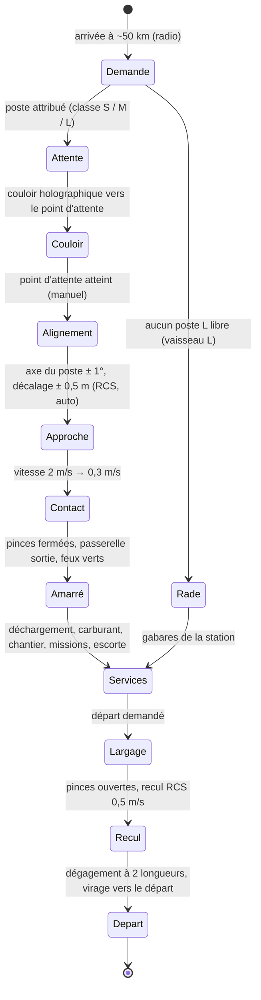

| Paramètre | S | M | L |
|---|---|---|---|
| Point d'attente | 150 m | 270 m | 360 m |
| Vitesse d'approche finale | 2 → 0,3 m/s | 1,5 → 0,3 m/s | 1 → 0,25 m/s |
| Durée à l'écran (temps réel) | ≈ 60 s | ≈ 90 s | ≈ 120 s |
| Pinces / passerelles | 2 / 1 | 4 / 1 | 6 / 2 |

**⚑ à valider** — la durée en temps réel : la touche d'escale abrégée (Entrée) accélère la séquence, comme
aujourd'hui (§7).

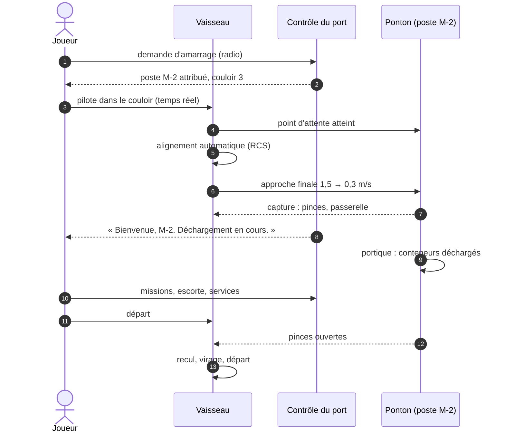

## B.8 Option 5 — Déchargement au port orbital

| Option | Principe | Effort | Valeur |
|---|---|---|---|
| **a. Portique de ponton** (recommandé) | le bras du vaisseau passe les conteneurs à un portique roulant du ponton | moyen | cohérent avec l'amarrage, réutilise la scène du bras |
| b. Navettes du vaisseau | comme au sol, vers les baies de la station | faible | redondant une fois amarré |
| c. Gabares de la station | la station envoie ses gabares (P1) prendre les conteneurs | moyen | utile surtout en rade |

## B.9 Missions et escortes au port

Le port orbital est le lieu naturel des nouveautés de L9 :
- **Tableau des missions** : contrats locaux (L3) et **disputés** (L9), plus deux types propres aux ports
  orbitaux — **convoyage** (escorter un cargo de la station vers une autre planète, **⚑ à valider**) et
  **ravitaillement** (livrer du carburant à une autre station).
- **Escortes** : location (rangs II à IV, L9) ; l'escorte **attend à un poste du port** et rejoint la formation
  au départ.
- **Chantier naval, carburant, propulseurs, générateur de saut** : les services actuels (§16, L3), déplacés dans
  un panneau « PORT » unique quand le vaisseau est amarré.

## B.10 Architecture et intégration

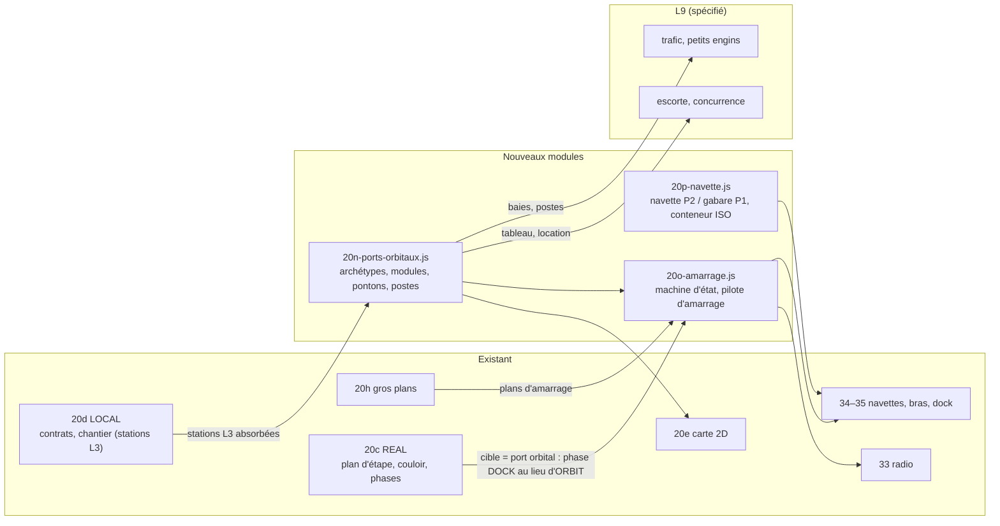

**Points d'attention** (leçons des lots précédents) :
- **Précision** : un port est à ~10¹¹ m de l'étoile ; géométries en coordonnées **relatives** au port (le couloir
  L2.3 avait été invisible pour cette raison).
- **Ordre de mise à jour** : poste, vaisseau et navettes placés **avant** les caméras (correctif des saccades).
- **Orientation** : repère du poste pour l'alignement, jamais de « haut » absolu.
- **Performance** : géométrie fusionnée par matériau, feux instanciés ; budget ≈ 60–120 appels de dessin par port ;
  construction à l'entrée du système, étalée sur plusieurs images.

## B.11 Tests prévus

| Test | Vérifie |
|---|---|
| `ports_test.py` | génération déterministe ; règles de placement ; géante gazeuse toujours dotée ; tailles absolues |
| `amarrage_test.py` | par classe S / M / L : contact ≤ 0,35 m/s, alignement ≤ 1° et 0,5 m, aucune pénétration coque–ponton ; rade si aucun poste |
| `navette_test.py` | conteneur ISO à l'échelle 1 ; berceau ; chargement et vol — **à cadence irrégulière** |
| suites existantes | toutes, sans régression (vol, passage, commerce, carte, survol, gros plans, largage, saccades, titre) |

## B.12 Lots de réalisation

## B.13 Décisions à prendre

1. **Navette** : P1, P2 (recommandé) ou P3 — et le gros porteur P1 pour les vaisseaux L.
2. **Modèles de ports** : trois maquettes fixes, générateur modulaire, ou **archétypes + modules** (recommandé).
3. **Amarrage** : tous accostent, **accostage + rade pour les L sans poste** (recommandé), ou orbite + navettes.
4. **Pilotage** : automatique, **manuel assisté** (recommandé) ou manuel intégral.
5. **Déchargement** : **portique de ponton** (recommandé), navettes, ou gabares de la station.
6. Stations L3 absorbées par les ports « anneau » ; missions de convoyage et de ravitaillement ; fréquences et orbites (⚑).
