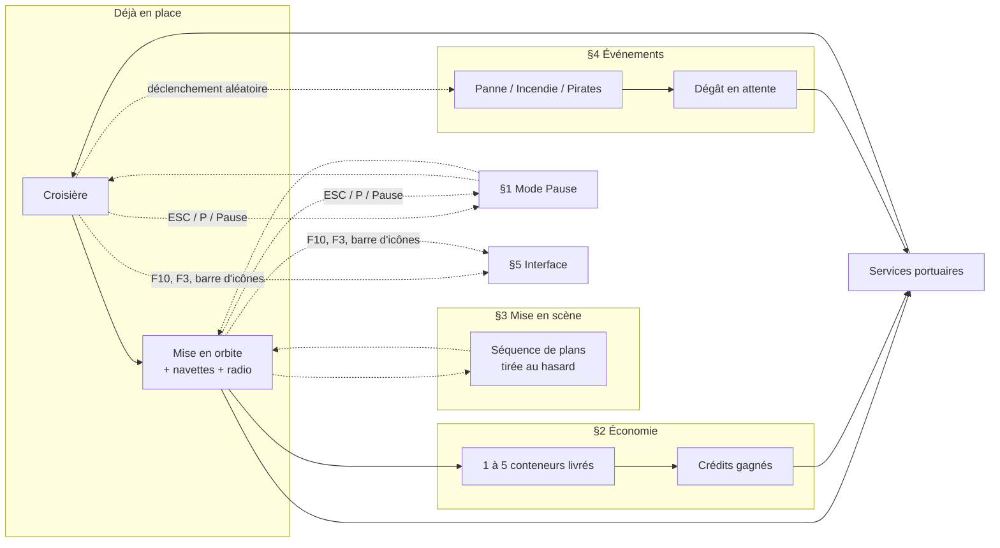
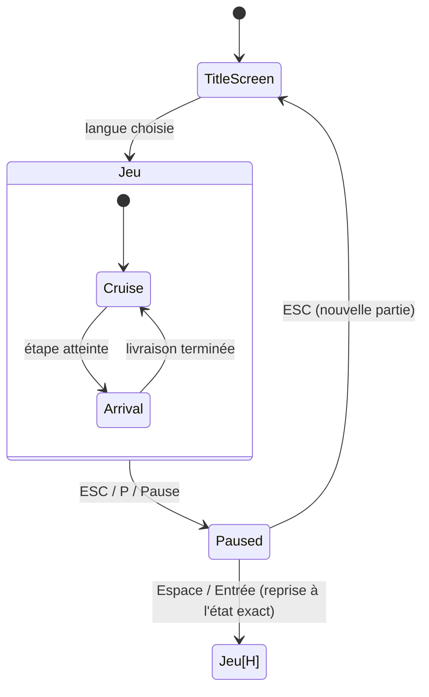
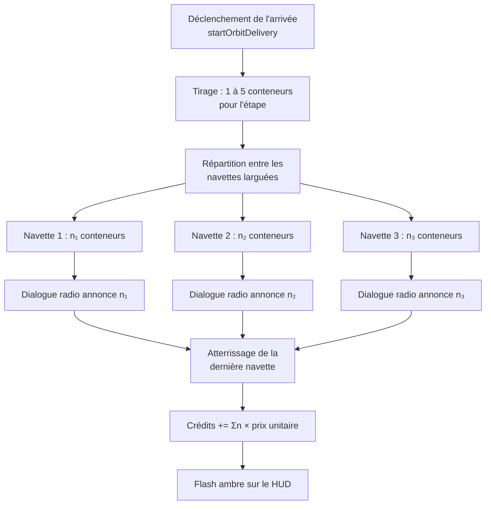
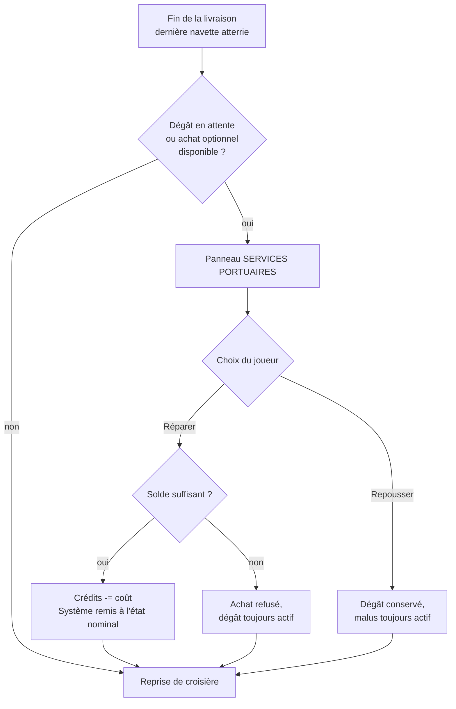
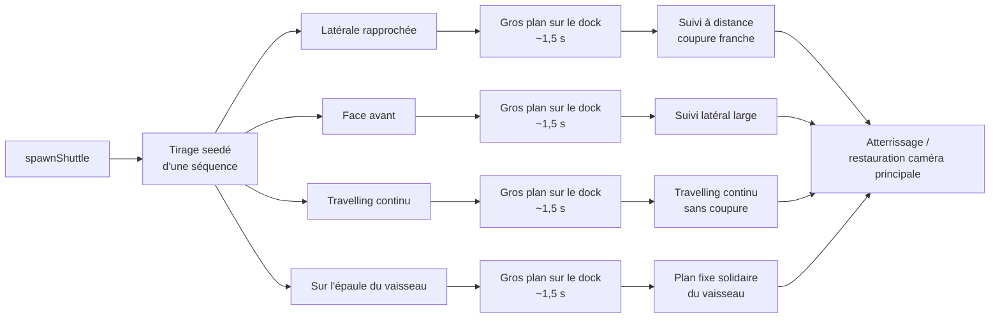
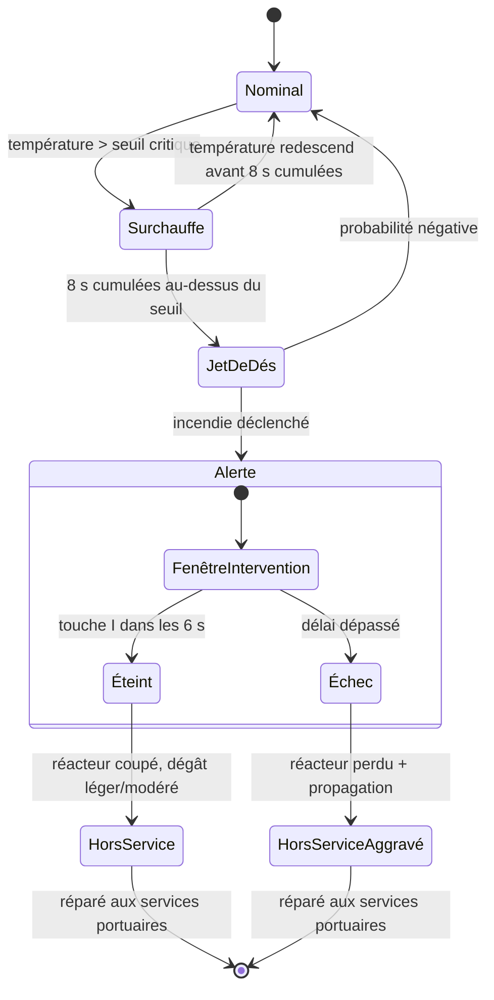
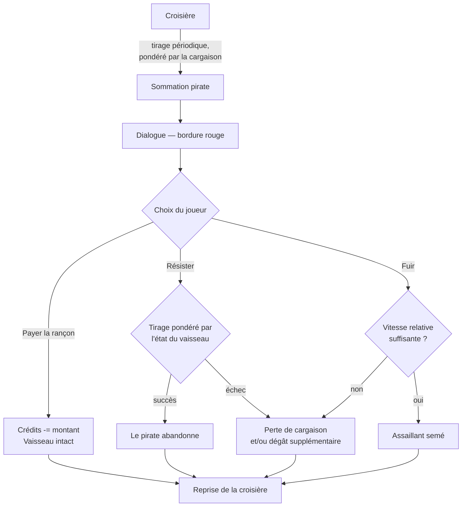
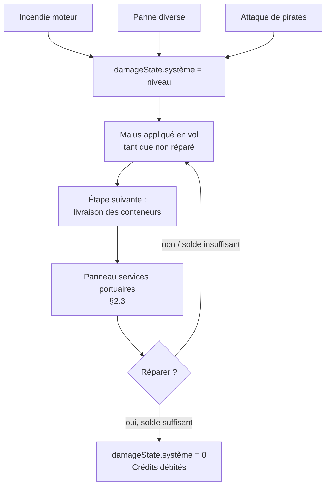
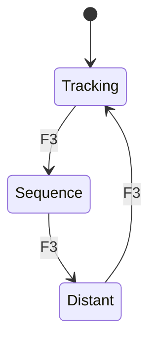
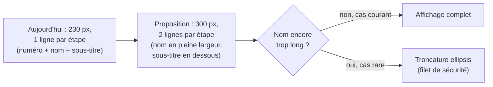

# Voyage Spatial — Spécification des évolutions v2.0

**Statut :** proposition à valider — plusieurs points sont sous-spécifiés dans la demande d'origine ; ce document comble ces zones avec des propositions concrètes (marquées **[proposition]**) et isole les décisions qui vous reviennent dans une section dédiée (§10).

**Périmètre :** cinq chantiers. Les quatre premiers s'articulent tous autour de la séquence d'arrivée existante (mise en orbite → navettes → radio) ; le cinquième est un ensemble d'ajustements d'interface et de raccourcis, plus ponctuels mais transverses aux quatre autres :

1. Mode Pause
2. Économie de crédits
3. Mise en scène cinématique des navettes
4. Événements aléatoires (pannes, incendie, pirates) et réparations
5. Interface — raccourcis et panneau de contrôle du HUD

---

## Sommaire

- [0. Contexte et principes transverses](#0-contexte-et-principes-transverses)
- [1. Mode Pause](#1-mode-pause)
- [2. Économie — crédits](#2-économie--crédits)
- [3. Mise en scène des navettes](#3-mise-en-scène-des-navettes)
- [4. Événements aléatoires](#4-événements-aléatoires)
- [5. Interface — raccourcis et panneau de contrôle du HUD](#5-interface--raccourcis-et-panneau-de-contrôle-du-hud)
- [6. Modèle de données récapitulatif](#6-modèle-de-données-récapitulatif)
- [7. Intégration avec l'existant](#7-intégration-avec-lexistant)
- [8. Internationalisation — nouvelles clés](#8-internationalisation--nouvelles-clés)
- [9. Plan de vérification](#9-plan-de-vérification)
- [10. Questions ouvertes / décisions à confirmer](#10-questions-ouvertes--décisions-à-confirmer)
- [11. Priorisation suggérée](#11-priorisation-suggérée)
- [12. Référence — tous les raccourcis clavier](#12-référence--tous-les-raccourcis-clavier)

---

## 0. Contexte et principes transverses

Le jeu repose aujourd'hui sur trois piliers qu'il faut respecter en ajoutant ces évolutions :

- **Déterminisme par graine** : tout (étoiles, planètes, noms, dialogues radio) découle de `SEED` via des générateurs pseudo-aléatoires dédiés (`rngFor(SEED+':'+clé)`). Les nouveaux systèmes (pannes, attaques, butin) devraient suivre la même discipline — un déclenchement d'événement doit être **reproductible pour une même graine et un même déroulé de vol**, pas purement `Math.random()`. C'est un choix structurant : voir §10.1.
- **Un seul fichier HTML autonome**, sans dépendance de build. Toute nouvelle fonctionnalité doit rester dans cette contrainte (pas de nouvelle librairie externe).
- **Le vocabulaire visuel déjà établi** doit être réutilisé plutôt que réinventé : panneaux à coins tronqués (`.panel`), palette ambre/cyan/vert, cercles + flèche pour les désignations, bips + synthèse vocale pour la radio, i18n via `t()` et `I18N`.

⚠️ **Collision de nommage à anticiper** : l'état de vol `flightPhase === 'ARRIVAL_PAUSE'` (mise en orbite/livraison) et la variable locale `paused` qui en découle **n'ont rien à voir** avec le nouveau mode Pause demandé ici (§1). Il faudra soit renommer l'état existant (`'ARRIVAL_PAUSE'` → `'ARRIVAL'`, `paused` → `arriving`), soit choisir un nom sans ambiguïté pour le nouveau système (`gamePaused`, `menuPaused`). Ce document utilise **`gamePaused`** pour le nouveau mode et recommande de renommer l'existant — voir §7.1.

### Vue d'ensemble des cinq chantiers

Les évolutions ne sont pas isolées : trois d'entre elles se rejoignent au même point de la boucle de jeu, la séquence d'arrivée à une étape ; le mode Pause et le panneau de contrôle du HUD, eux, sont transverses — accessibles à tout moment, quel que soit l'état du jeu.



Le panneau « services portuaires » (§2.3) est le point de convergence des chantiers §2/§3/§4 : c'est là que les crédits gagnés pendant la livraison peuvent financer la réparation des dégâts accumulés pendant la croisière. Le mode Pause (§1) et l'interface (§5) sont, eux, orthogonaux à tout le reste — accessibles quel que soit l'état courant.

---

## 1. Mode Pause



*`[H]` = reprise dans l'état précédent (historique), pas nécessairement `Cruise` : si la pause a été déclenchée pendant une manœuvre d'approche, la reprise se fait dans cet état-là.*


### 1.1 Déclenchement

Un appui sur l'une de ces trois touches bascule `gamePaused` à `true`, **à tout moment sauf pendant l'écran-titre** (qui a déjà son propre état) :

| Touche | Code clavier |
|---|---|
| <kbd>ESCAPE</kbd> | `Escape` |
| <kbd>P</kbd> | `KeyP` |
| <kbd>PAUSE</kbd> (touche Pause/Arrêt physique) | `Pause` |

**[proposition]** La touche `Pause` physique n'existe pas sur tous les claviers (rare sur portable) : elle est traitée comme un raccourci **bonus**, pas comme le moyen principal documenté dans l'aide à l'écran (qui ne mentionnera que <kbd>ESC</kbd> / <kbd>P</kbd>, pour rester lisible).

Aucune des trois touches n'a d'usage actif ailleurs dans le jeu (`Escape`, `KeyP` et `Pause` sont libres) : pas de conflit à gérer côté existant.

### 1.2 Comportement pendant la pause

Quand `gamePaused === true` :

- **La simulation entière est gelée** : aucune progression de route, aucune rotation du vaisseau, aucune mise à jour de temperature/navette/orbite. Le plus simple et le plus sûr : à l'entrée de `updateFlight(dt, elapsed)`, si `gamePaused`, ne rien exécuter (retour immédiat) — la boucle `requestAnimationFrame` continue de tourner (pour que le rendu reste réactif, ex. redimensionnement), mais plus aucun état de jeu n'avance.
- **La synthèse vocale est suspendue, pas annulée** : `window.speechSynthesis.pause()` à l'entrée en pause, `window.speechSynthesis.resume()` à la sortie (si on reprend) — un message radio en cours ne recommence pas depuis le début, il reprend où il en était. C'est une amélioration par rapport à `cancel()`, déjà utilisé ailleurs dans le jeu pour d'autres transitions.
- **Un panneau centré, semi-transparent en arrière-plan**, dans le même vocabulaire que l'écran-titre :
  - fond assombri (overlay `rgba(0,0,0,0.7)` par-dessus toute la scène, sous le HUD)
  - titre `PAUSE` en grand, style terminal (police mono, lettres espacées)
  - deux lignes d'instruction, traduites :
    - `ÉCHAP — Retour à l'écran-titre`
    - `ESPACE / ENTRÉE — Reprendre`
  - **[proposition]** un rappel discret de l'état de session (graine, crédits, étape courante) sous les instructions — utile pour se repérer avant de choisir, sans configuration supplémentaire à faire.
- **Le contenu du HUD reste visible mais figé** *(gelé, pas cliquable)* sous l'overlay — cohérent avec l'esprit « pause », on voit où on en était.

### 1.3 Sortie du mode pause

Deux issues, mutuellement exclusives :

- **<kbd>ESCAPE</kbd> → retour à l'écran-titre.** **[proposition]** Ce retour est un **abandon de la session en cours** : la boucle de jeu s'arrête, le HUD se masque, l'écran-titre réapparaît avec son choix de langue. Un nouveau choix de langue (même la même langue qu'avant) déclenche une **nouvelle graine** et une nouvelle partie — exactement comme au premier lancement. Les crédits (§2) et les dégâts en cours (§4.4) sont donc réinitialisés. Cette lecture correspond au sens le plus naturel de « retour à l'écran-titre » (un menu qu'on quitte, pas une simple pause) ; si une reprise de session était souhaitée à la place, voir la question ouverte en §10.2.
- **<kbd>SPACE</kbd> / <kbd>RETURN</kbd> / <kbd>ENTER</kbd> → reprise.** `gamePaused = false`, la synthèse vocale reprend, la simulation continue exactement où elle en était (aucun recalcul de route nécessaire, puisque rien n'a avancé).

### 1.4 Interactions avec les touches existantes

Pendant `gamePaused === true`, **toutes les autres touches doivent être neutralisées** (orientation, boost, TAB, CTRL, abrégé…) : le gestionnaire global de `keydown` doit vérifier `gamePaused` en tout début de fonction et, si actif, ne traiter que <kbd>ESCAPE</kbd> / <kbd>P</kbd> / <kbd>Pause</kbd> / <kbd>SPACE</kbd> / <kbd>Enter</kbd>, en ignorant tout le reste (`return` anticipé). C'est plus robuste que d'ajouter un `if(!gamePaused)` dans chacun des nombreux gestionnaires existants.

> Point de vigilance : <kbd>SPACE</kbd> a maintenant trois usages selon le contexte (boost en croisière, abrégé pendant l'approche §existant, reprise pendant la pause). Comme la pause a la priorité la plus haute et court-circuite tout le reste, il n'y a pas d'ambiguïté réelle : le gestionnaire vérifie `gamePaused` **avant** de vérifier `flightPhase`.

---

## 2. Économie — crédits

### 2.1 Génération à la livraison

Chaque étape déclenche déjà une séquence de livraison par navettes (§08 de la spec v1.0/v2.0 existante : mise en orbite, 3 navettes, dialogue radio). On y ajoute :

- **Un nombre total de conteneurs livrés pour l'étape**, tiré aléatoirement entre **1 et 5** au moment du déclenchement de la manœuvre (`startOrbitDelivery`), et non plus par navette indépendamment.
- **[proposition — réconciliation avec le dialogue radio existant]** Le script radio actuel fait déjà dire à l'équipage un nombre de conteneurs par navette (`1 + Math.floor(rng()*2)`, tiré indépendamment, sans lien avec une économie). Pour que les chiffres restent cohérents à l'oreille, ce total de 1 à 5 devrait être **réparti entre les navettes réellement larguées** (ex. 5 conteneurs sur 3 navettes → 2/2/1) plutôt que redondant avec un second tirage. Le dialogue annoncerait alors le nombre réellement attribué à chaque navette, et leur somme correspondrait exactement aux crédits gagnés.
- **Barème** **[proposition, à ajuster]** : `credits_gagnés = conteneurs_livrés × prix_unitaire`, avec `prix_unitaire` tiré dans une fourchette raisonnable (ex. 180–420 crédits/conteneur) pour que chaque livraison ait un peu de variance sans devenir un facteur dominant du jeu. Une livraison de 5 conteneurs à 400 cr/u rapporte 2000 cr ; une livraison d'1 conteneur à 180 cr/u en rapporte 180 — l'écart (×11) est volontairement large pour rendre le tirage 1–5 sensible.
- Le gain est crédité **au moment où le dernier conteneur atterrit** (fin de la dernière navette), pas au tout début de la manœuvre — cohérent avec « on gagne des crédits quand on livre ».



### 2.2 Affichage

Dans la barre supérieure, **juste à gauche de `SEED`** :

```
NAVIGATION QUANTIQUE // CARGO XXX-00                    CRÉDITS 12 450   SEED MTZ...-XX0X   EN LIGNE
```

- Format avec séparateur de milliers (espace fine, cohérent avec le style déjà utilisé pour les distances/masses ailleurs dans le HUD : `Math.round(credits).toLocaleString('fr-FR')`, ou l'équivalent selon la langue choisie).
- Libellé traduit (`CRÉDITS` / `CREDITS` / `GUTHABEN` / `CRÉDITOS` — voir §8).
- **[proposition]** Un bref flash (highlight ambre, ~1,5 s, même mécanisme que l'indicateur de mode caméra déjà existant) au moment où le montant augmente, pour que le gain soit perceptible sans avoir à fixer le chiffre en permanence.

### 2.3 Dépense — écran de services portuaires

La demande d'origine indique seulement que les crédits « pourront être dépensés lors des escales », sans préciser sur quoi. Proposition concrète, qui a l'avantage de se brancher directement sur le système de réparations (§4.4), plutôt que d'inventer une mécanique isolée :

**[proposition]** À la fin de la séquence de livraison (juste avant la reprise de croisière), si le vaisseau porte des dégâts en attente (§4.4) **ou** si on souhaite proposer des achats optionnels, un petit panneau **« SERVICES PORTUAIRES »** s'affiche (même emplacement que le canal radio, ou en remplacement temporaire) avec une liste d'options :

| Service | Condition d'apparition | Effet | Coût [proposition] |
|---|---|---|---|
| Réparer <système endommagé> | dégât en attente sur ce système | supprime le malus lié, remet le système à l'état nominal | fonction du niveau de dégât, voir §4.4 |
| Révision générale | toujours proposée | remet la température de tous les réacteurs à leur valeur de repos | coût fixe modique |
| *(extension future)* Assurance cargaison | — | réduit le risque de perte lors d'une attaque pirate au prochain trajet | — |

Le joueur choisit d'acheter (crédits débités immédiatement, plafonnés à son solde — jamais de solde négatif) ou de repousser à plus tard (le dégât reste actif, avec le risque associé décrit en §4.4). Ce panneau n'est **pas** une boutique à parcourir librement à tout moment : il n'apparaît qu'à l'étape, dans la continuité de la séquence d'arrivée déjà rythmée par la radio.



### 2.4 Solde initial et persistance

- Le joueur commence chaque nouvelle partie avec **10 000 crédits**.
- Le solde persiste pour toute la durée de la session (traverse les changements d'itinéraire, contrairement à `ROUTE` qui est recalculée à chaque arrivée finale).
- Un retour à l'écran-titre via <kbd>ESCAPE</kbd> (§1.3) réinitialise le solde à 10 000 pour la partie suivante, cohérent avec le choix d'une graine neuve.

---

## 3. Mise en scène des navettes

### 3.1 Ce qui existe déjà

Aujourd'hui, une navette est créée directement à la position du vaisseau (`spawnShuttle()`), sans point de départ visuel distinct, et un unique plan large fixe (« cutaway », §08/§12.2 de la spec existante, 4,2 s) cadre la cale et la navette à chaque largage. La demande consiste à **enrichir cette unique prise de vue en une petite mise en scène**, avec un point de départ identifiable (un dock) et un choix de plans qui varie d'une livraison à l'autre.

### 3.2 Le dock

**[proposition]** Un point d'ancrage visuel fixe sur la coque, sous la nacelle cargo (par exemple un renfoncement texturé avec un feu clignotant, cohérent avec les balises déjà présentes sur le vaisseau) — un `THREE.Object3D` nommé `dockAnchor`, enfant du groupe du vaisseau, positionné une fois à la construction du modèle. Chaque navette **apparaît à la position mondiale de `dockAnchor`** (au lieu de la position générale du vaisseau) et s'en écarte pour rejoindre sa trajectoire vers le port.

### 3.3 Catalogue de séquences de plans

Au lieu d'un unique plan fixe, on définit un **petit catalogue de 3–4 séquences**, chacune une suite de 2 plans (gros plan sur le départ, puis suivi à distance) avec des paramètres de cadrage différents. Une séquence est tirée **au hasard à chaque largage de navette** (indépendamment pour chacune des navettes d'une même étape, pour que la variété se voie même au sein d'une seule livraison).

**[proposition] — exemples de séquences (à ajuster/étoffer en implémentation) :**

1. **« Latérale rapprochée »** : gros plan sur le dock depuis le côté (caméra proche, légèrement en contre-plongée) pendant ~1,5 s au moment exact du largage, puis coupure franche vers un plan de suivi à ~120 unités en arrière-plan-haut de la navette, qui la garde cadrée jusqu'à mi-parcours avant de la laisser sortir du cadre.
2. **« Face avant »** : gros plan de face sur le dock (la navette semble venir droit vers la caméra avant de la dépasser), puis suivi latéral large qui laisse le port de destination entrer progressivement dans le cadre.
3. **« Travelling continu »** : pas de coupure franche — la caméra part du dock en gros plan et s'éloigne progressivement en un seul mouvement fluide jusqu'au plan de suivi lointain (le plus technique des trois, mais le plus « cinéma »).
4. **« Sur l'épaule du vaisseau »** *(variante courte)* : gros plan sur le dock, puis la caméra reste fixe sur une position solidaire du vaisseau (pas de la navette) pendant que celle-ci s'éloigne dans le cadre — une variante économe en calcul, utile aussi comme repli si les autres posent des soucis de performance.

Chaque séquence a une **durée totale** compatible avec le temps de trajet déjà défini pour les navettes (11–14 s, cf. spec existante) : le gros plan initial dure entre 1 et 2 s, le reste du temps est occupé par le plan de suivi.



### 3.4 Répartition du hasard

**[proposition]** Le tirage de la séquence utilise le flux aléatoire déterministe déjà en place pour la navette elle-même (`rngFor` dérivé du seed de la planète), afin que, pour une même graine, la mise en scène soit reproductible — cohérent avec le principe transverse de §0. Un poids égal entre les séquences est un point de départ raisonnable ; un poids ajustable par séquence permettrait plus tard de doser leur fréquence relative.

### 3.5 Cohabitation avec la caméra principale

Pendant qu'une séquence de navette est active, la caméra principale (poursuite / plan-séquence / plans lointains, §existant) est **temporairement suspendue** — exactement comme le fait déjà le plan large actuel — puis restaurée à la fin de la séquence, sans saut brutal (le point de reprise doit interpoler doucement vers la position que la caméra principale aurait normalement à cet instant, plutôt que de s'y téléporter).

---

## 4. Événements aléatoires

C'est le chantier le plus vaste des quatre. Il se découpe en trois familles d'événements (incendie moteur, pannes diverses, attaques) qui partagent toutes un même aval : la réparation à l'étape suivante.

### 4.1 Incendie moteur (surchauffe)

Le système de température moteur existe déjà (§12.4 de la spec existante : `engineTemps[0..3]`, mise à jour continue selon la puissance effective, refroidissement plus lent que l'échauffement).

**Condition de déclenchement [proposition, à calibrer] :**
Un réacteur qui reste au-dessus d'un seuil critique (ex. 260 °C — la classe visuelle « chaude », déjà définie dans le panneau température) pendant une durée cumulée continue (ex. 8 secondes sans redescendre sous le seuil) déclenche un jet de dés déterministe (issu du même flux que le reste) avec une probabilité croissante au-delà de ce délai, plutôt qu'un déclenchement systématique — pour que la surchauffe soit un risque graduel, pas un couperet à la seconde près.

**Séquence de jeu :**

1. Une alarme se déclenche : effet visuel (particules de flamme/fumée sur le réacteur concerné, halo rouge clignotant sur sa jauge dans le panneau Propulsion), sonore (un signal distinct des bips radio existants), et un message HUD explicite (« INCENDIE RÉACTEUR M2 — APPUYEZ SUR I », traduit).
2. Le joueur dispose d'une **fenêtre de temps limitée** **[proposition : 6 secondes]** pour appuyer sur <kbd>I</kbd> (intervention).
   - **Succès** (appui dans les temps) : l'incendie est éteint, le réacteur concerné est **coupé** (puissance à zéro) pour le reste du trajet en cours, ce qui réduit la poussée totale disponible (donc la vitesse de croisière maximale — cohérent avec « ralentissant le vaisseau »). Le réacteur est marqué endommagé (voir §4.4) et attend réparation.
   - **Échec** (délai dépassé) : conséquence aggravée — **[proposition]** le réacteur est perdu pour le reste du trajet ET un second réacteur voisin subit un dégât mineur par propagation, ou une pénalité de crédits (cargaison partiellement perdue à cause des dégâts). À arbitrer, voir §10.3.
3. Une fois éteint (ou le délai dépassé), l'alarme cesse et le vol continue avec le réacteur concerné hors service jusqu'à réparation.



### 4.2 Pannes diverses

**[proposition — catalogue de départ, extensible]**

| Panne | Effet en vol | Indication au joueur |
|---|---|---|
| Radar | Le panneau « objet le plus proche » et les étiquettes de désignation (étoiles/planètes/lunes) deviennent intermittents ou disparaissent | Icône de panne clignotante sur le panneau concerné |
| Propulseurs auxiliaires (RCS) | Un groupe de tuyères (lacet, tangage ou roulis) devient inopérant : le vaisseau tourne plus lentement sur cet axe, l'autopilote doit compenser plus largement | Jauge RCS correspondante grisée dans le panneau Commandes moteur |
| Autopilote | Bascule forcée en pilotage manuel jusqu'à réparation (le joueur doit piloter, même s'il ne le souhaite pas) — **variante alternative [proposition]** : l'autopilote reste actif mais avec une erreur de trajectoire volontairement dégradée (moins précis dans les portiques) | Badge de mode passant à une couleur d'alerte |

Chaque panne, comme l'incendie, est tirée avec une probabilité modeste et croissante avec la durée de vol/l'usure (voir §4.4 pour l'idée d'un « niveau d'usure » cumulatif, optionnelle), et laisse une marque de dégât à réparer à l'étape suivante.

### 4.3 Attaques de pirates / mercenaires

**Roster de menaces [proposition] :**

| Type | Profil | Comportement |
|---|---|---|
| Navette pirate | Faible, opportuniste | Tente un vol rapide de cargaison si le vaisseau est déjà affaibli (dégât en cours) |
| Intercepteur rapide | Agile, rattrape vite | Menace de tir/abordage si on refuse de payer une rançon |
| Croiseur mercenaire *(extension)* | Plus lourd, plus rare | Exige une rançon plus élevée, menace plus crédible |

**Déclenchement [proposition]** : tirage périodique pendant la croisière (pas pendant la manœuvre d'approche, pour ne pas surcharger une séquence déjà riche), avec une probabilité qui peut dépendre de la richesse apparente du vaisseau (nombre de conteneurs actuellement en soute, par exemple) — un vaisseau qui vient de charger beaucoup de fret est une cible plus intéressante.

**Résolution — dialogue à choix :**

Une fenêtre de dialogue apparaît (même emplacement que le canal radio, ou un panneau dédié similaire), avec une **couleur de bordure/titre qui dépend du type d'événement** — **[proposition de convention, cohérente avec la palette déjà en place]** :

- **Ambre** → panne mécanique (incendie, RCS, radar, autopilote) : gêne, pas de choix à faire, juste une action (§4.1) ou une notification.
- **Rouge** *(nouvelle teinte à introduire dans la palette, à la manière du `tm-hot` déjà utilisé pour les températures critiques)* → menace hostile (pirates), dialogue avec choix.
- **Cyan** → événement neutre/informatif *(réservé pour d'éventuels événements positifs futurs, ex. une aubaine commerciale)*.

Le dialogue de pirate propose typiquement 2 à 3 options, par exemple :

- **Payer la rançon demandée** (montant proposé, fonction de la cargaison) — perte de crédits immédiate, mais le vaisseau repart intact.
- **Résister** — **[proposition]** résolu par un tirage pondéré par l'état du vaisseau (un vaisseau endommagé/RCS en panne a moins de chances de s'en tirer sans casse) : succès = le pirate abandonne, échec = perte d'une partie de la cargaison (réduit les crédits de la prochaine livraison) et/ou dégât supplémentaire.
- *(optionnel)* **Fuir** — tente d'accélérer pour semer l'assaillant ; dépend de la vitesse relative (l'intercepteur rapide est plus dur à semer que la navette pirate).



### 4.4 Dégâts et réparations

**Modèle de dégât [proposition]** : chaque panne/incendie/attaque affecte un « système » identifiable (réacteur N, groupe RCS, radar, autopilote) et lui associe un **niveau de dégât** (ex. léger / modéré / sévère), qui détermine :
- le malus subi en vol tant que non réparé (déjà décrit par système ci-dessus) ;
- le **coût de réparation**, croissant avec le niveau (ex. léger = 300–600 cr, modéré = 800–1400 cr, sévère = 1800–2600 cr — barème à ajuster).

**Moment de la demande de réparation :** comme précisé dans la demande, **après la livraison des conteneurs** de l'étape en cours — c'est-à-dire à l'endroit exact où s'ouvre déjà le panneau « services portuaires » décrit en §2.3. Les deux mécaniques (dépense de crédits, réparation) se rejoignent donc naturellement au même point de la boucle de jeu plutôt que d'ouvrir deux fenêtres différentes.

**Report possible :** le joueur peut choisir de ne pas réparer immédiatement (faute de crédits, ou par choix) ; le système reste endommagé au trajet suivant, avec le malus associé qui continue de s'appliquer — et, **[proposition]**, un risque légèrement accru d'incident supplémentaire sur ce même système tant qu'il n'est pas réparé (pour inciter sans obliger).



---

## 5. Interface — raccourcis et panneau de contrôle du HUD

Ce chantier regroupe des ajustements plus légers que les quatre précédents, mais qui touchent tous à la même zone : les raccourcis clavier et la visibilité des panneaux du HUD.

### 5.1 Coupure de la synthèse vocale — touche F10

`F10` bascule la coupure du son de la voix de synthèse, à tout moment, sans qu'il soit nécessaire d'ouvrir le canal radio pour cliquer sur son bouton dédié.

**[proposition]** Plutôt que d'introduire un second drapeau indépendant, `F10` agit sur le **même état** que le bouton muet déjà présent dans le panneau CANAL RADIO (`radioMuted`) : une seule source de vérité, et l'icône du bouton (🔊/🔇) doit refléter l'état quelle que soit la façon dont il a été changé (touche ou clic). Si une distinction fine était voulue entre « couper uniquement la voix » et « couper aussi les bips » (le comportement actuel du bouton coupe les deux), ce serait un second drapeau à isoler — voir question ouverte §10.6.

### 5.2 Panneau de contrôle du HUD — afficher/masquer les panneaux

Une nouvelle **barre d'icônes fixe, en bas à gauche de l'écran**, permet d'afficher ou de masquer indépendamment chacun des panneaux du HUD. Quand tous les panneaux sont masqués, il ne reste à l'écran que la ligne d'en-tête (`NAVIGATION QUANTIQUE… / CRÉDITS / SEED / EN LIGNE`) et cette barre elle-même — les deux seuls éléments **non togglables**.

**[proposition] — un bouton par panneau :**

| Icône [proposition] | Panneau contrôlé | État par défaut |
|---|---|---|
| 🛰 (ou jauge de vitesse) | Vitesse / Secteur / Cap (`hud-left`) | visible |
| 🗺 (route) | Plan de vol (`hud-route`) | visible |
| 🎯 (cible) | Objet le plus proche (`hud-right` / `nearestPanel`) | visible |
| 🌡 (thermomètre) | Température moteur (`hud-temp`) | visible |
| 🚀 (propulsion) | Propulsion (`hud-engines`) | visible |
| ⚙ (réglages) | Commandes moteur (`hud-telemetry`) | visible |
| 📻 (antenne) | Canal radio (`hud-radio`) | visible pendant une manœuvre, comme aujourd'hui |
| 🎥 (caméra) | *(action, pas une visibilité)* — cf. §5.4 | — |

- Chaque bouton **bascule uniquement son propre panneau** ; il n'y a pas de mode « tout masquer » implicite — le résultat décrit ci-dessus (ne rester qu'avec l'en-tête et la barre) est simplement ce qui se produit si l'on décoche les sept boutons un par un. **[proposition, optionnelle]** deux boutons supplémentaires « tout afficher / tout masquer » peuvent être ajoutés en fin de barre pour le confort, sans changer le principe.
- Le bouton **Canal radio** cohabite avec le raccourci `TAB` déjà existant : les deux pilotent le **même état de visibilité**, ce n'est pas une bascule distincte.
- Masquer un panneau est une **préférence d'affichage pure** : elle n'interrompt aucune logique de jeu (un message radio masqué continue d'être dicté par la synthèse vocale, une navette masquée continue son trajet, etc.).
- **[proposition]** L'état de chaque panneau (visible/masqué) persiste pour la session en cours, mais se réinitialise à « tout visible » lors d'un retour à l'écran-titre (§1.3), comme les crédits et les dégâts.

### 5.3 Correction du raccourci de roulis

L'aide affichée à l'écran indique aujourd'hui `A / E — roulis`. **Correctif : le roulis est en réalité piloté par `E` et `R`.** Cette correction doit être répercutée :
- dans le texte d'aide affiché (`hint_main`, toutes langues) ;
- dans le gestionnaire clavier lui-même si le code ne correspond pas encore à ce mapping ;
- dans toute documentation existante qui mentionnait encore `A / E`.

*(`A` redevient donc disponible pour un usage futur, si besoin.)*

### 5.4 Changement de mode caméra — touche F3

Le changement de mode de caméra (poursuite standard / plan-séquence / plans lointains — déjà implémenté par ailleurs) n'est **plus déclenché par un double ou triple appui sur `CTRL`**, mais par une **simple pression sur `F3`**, qui fait avancer d'un cran dans le cycle des modes :



**[proposition]** Ce changement simplifie sensiblement l'implémentation : le mécanisme à base de comptage d'appuis rapprochés (fenêtre de tolérance entre deux appuis, distinction 1/2/3 appuis) peut être **entièrement retiré**. `CTRL` retrouve un rôle unique et sans ambiguïté : `CTRL` + glisser = regard libre, simple appui court sur `CTRL` = recentrage du regard libre (ce dernier comportement n'a plus besoin d'attendre une fenêtre de temps pour vérifier qu'aucun second appui ne suit, puisqu'il n'y a plus de second sens à distinguer).

Le bouton caméra 🎥 de la barre d'icônes (§5.2) déclenche exactement la même action que `F3` — un clic = un cran dans le cycle.

### 5.5 Icônes et infobulles — exigence transverse

**Tous les nouveaux boutons** (les sept bascules de panneaux + le bouton caméra, soit huit éléments) doivent respecter :
- une **icône** distincte et reconnaissable au premier coup d'œil (le tableau du §5.2 propose un jeu de départ, à affiner en implémentation) ;
- une **infobulle** au survol, dans la langue courante (ex. « Afficher/masquer : Plan de vol »), en s'appuyant sur le même dictionnaire `I18N` que le reste de l'interface plutôt qu'un texte figé ;
- un **état visuel actif/inactif** clairement distinct (ex. bordure cyan quand le panneau est visible, atténuée quand il est masqué) — la barre sert ainsi aussi d'indicateur d'état, pas seulement de bouton.

Ce standard reprend celui déjà appliqué au bouton muet du canal radio (icône + `title`), simplement étendu à l'ensemble des nouveaux contrôles.

### 5.6 Largeur du panneau de plan de vol

Constat mesuré dans le code actuel : le panneau (`.hud-route`) fait aujourd'hui **230 px de large**, et chaque étape affiche sur une seule ligne (`display:flex`) à la fois son numéro, le nom de la destination (`.nm`, qui se taille la part congrue via `flex:1`) et le sous-titre (désignation de l'étoile, `.dd`). Une fois la marge intérieure, le numéro et le sous-titre déduits, il ne reste guère plus d'une centaine de pixels pour le nom lui-même — largement insuffisant face à des noms de ports générés (« Port de Zima-Chandra 423 », « Port de Estrella-Distante 927 »…) qui dépassent régulièrement cette largeur, d'où la troncature déjà visible sur plusieurs captures d'écran de ce document.

**[proposition] — deux ajustements complémentaires, plutôt qu'un seul :**

1. **Élargir modérément le panneau** : 230 px → **300 px**. Une augmentation d'environ 30 %, suffisante pour gagner un vrai confort de lecture, sans pour autant déborder sur le centre de l'écran ni dominer visuellement le panneau Vitesse/Secteur/Cap juste au-dessus (`.hud-left`), déjà large d'environ 180–200 px — les deux restent ainsi du même ordre de grandeur.
2. **Passer d'un affichage sur une seule ligne à deux lignes par étape** : le nom de la destination occupe sa **propre ligne, en pleine largeur** (seul le numéro d'étape reste à côté, en préfixe compact), le sous-titre (désignation stellaire) passant en **seconde ligne, plus petite et atténuée**, en dessous. Cette réorganisation à elle seule redonne au nom près du double de largeur disponible, sans avoir à élargir davantage le panneau pour y parvenir.

Avec ces deux ajustements combinés, l'écrasante majorité des noms générés devrait s'afficher en entier. **La troncature (`text-overflow:ellipsis`, déjà en place) doit néanmoins être conservée comme filet de sécurité** pour les rares noms encore trop longs — cohérent avec la consigne de ne jamais laisser le panneau s'étendre au-delà de sa largeur fixée, quitte à raccourcir l'affichage plutôt que la largeur.



---

## 6. Modèle de données récapitulatif

**[proposition de structure — noms indicatifs, à harmoniser avec le style déjà en place dans le code]**

```js
// état global du mode pause
let gamePaused = false;

// économie
let credits = 10000;

// dégâts en attente, par système
const damageState = {
  engines: [0, 0, 0, 0],   // niveau de dégât par réacteur (0 = sain)
  rcsYaw: 0, rcsPitch: 0, rcsRoll: 0,
  radar: 0,
  autopilot: 0
};

// événement actif (au plus un à la fois, pour rester lisible)
let activeEvent = null;
// activeEvent = { kind:'fire'|'breakdown'|'pirate', system, severity, deadline, choices, ... }

// incendie en cours, si activeEvent.kind === 'fire'
// deadline exprimée en валeur d'horloge de jeu (elapsed), pas en dt cumulés

// séquence de navette choisie au largage
// (ajout à l'objet déjà poussé dans orbitState.shuttles)
// shuttle.cameraSequence = 'lateral' | 'face' | 'travelling' | 'shoulder'
```

Ces structures sont volontairement simples (pas de classes) pour rester dans le style déjà utilisé par le reste du fichier (objets littéraux, fonctions).

---

## 7. Intégration avec l'existant

### 7.1 Renommage recommandé (naming)

Avant d'introduire `gamePaused`, renommer :

- `flightPhase === 'ARRIVAL_PAUSE'` → `flightPhase === 'ARRIVAL'`
- la constante locale `paused` (dans `updateFlight`) → `arriving`

Ce renommage touche plusieurs endroits déjà identifiés dans le code existant (au moins les lignes où `paused`/`ARRIVAL_PAUSE` apparaissent dans `updateFlight`, le bloc caméra, et le déclenchement/fin de manœuvre) mais reste une opération mécanique de recherche/remplacement, sans changement de comportement.

**[ajout §5.4]** Le mécanisme de comptage d'appuis rapprochés sur `CTRL` (fenêtre de tolérance, distinction 1/2/3 appuis, minuteur associé) devient obsolète avec l'introduction de `F3` et peut être **retiré du code** plutôt que conservé en parallèle — un appui court sur `CTRL` conserve son unique sens restant (recentrer le regard libre), sans plus avoir besoin d'attendre de savoir si un second ou un troisième appui va suivre.

### 7.2 Points d'accroche identifiés dans le code actuel

| Évolution | S'accroche à |
|---|---|
| Pause | Tout début de `updateFlight()` (retour anticipé) ; gestionnaire global `keydown` (garde en tête de fonction) ; `window.speechSynthesis` |
| Crédits — gain | Fin de la boucle de largage des navettes, dans la logique qui suit déjà `orbitState.spawnFractions` |
| Crédits — affichage | Barre `.hud-top`, à côté de `#seedVal` (même conteneur que `topBrand`/`seedLabel`) |
| Navettes — dock | Construction du modèle du vaisseau (bloc qui construit déjà la nacelle cargo, les réacteurs, les balises) |
| Navettes — séquences caméra | Bloc caméra du « plan large » déjà existant (`CUTAWAY_DURATION`, déclenché à `spawnShuttle()`) |
| Incendie/pannes | `updateEngineTemps()` (déjà la source de vérité pour la température) ; panneau Propulsion et panneau Commandes moteur pour l'affichage des malus |
| Réparations | Point de sortie de la séquence de livraison, juste avant la reprise de croisière (même point que le panneau « services portuaires », §2.3) |
| F10 — coupure voix | Bouton muet déjà existant du panneau radio (`radioMuted`) ; gestionnaire global `keydown` |
| Barre d'icônes HUD | Un état de visibilité par panneau (ex. `hudVisible.left/route/nearest/temp/engines/telemetry/radio`), appliqué en CSS (`display`) sur les conteneurs déjà identifiés (`.hud-left`, `#routePanel`, `#nearestPanel`, `#tempPanel`, `#enginesPanel`, `#telemetryPanel`, `#radioPanel`) |
| F3 — mode caméra | Remplace le gestionnaire `CTRL` à comptage d'appuis déjà existant (cf. §7.1) ; même fonction `cameraMode = (cameraMode+1) % CAMERA_MODES.length` déjà écrite, simplement déclenchée autrement |
| Largeur du plan de vol | Règles CSS `.hud-route` (largeur `230px` → `300px`) et `.route-leg`/`.route-leg .nm`/`.route-leg .dd` (passage au gabarit deux lignes) ; aucune donnée ni logique de génération de noms à modifier, uniquement l'affichage |

### 7.3 Performance

Aucune de ces évolutions n'ajoute de coût significatif au rendu (pas de nouvelle géométrie lourde, à l'exception d'un éventuel modèle de vaisseau pirate low-poly, du même ordre de complexité que les navettes déjà existantes).

---

## 8. Internationalisation — nouvelles clés

À ajouter dans `I18N` (fr/en/de/es) et, pour le dialogue de pirates, dans `RADIO_TEMPLATES` ou un nouveau dictionnaire dédié (`EVENT_TEMPLATES`) suivant le même principe de fonctions paramétrées :

- `pause_title`, `pause_resume`, `pause_title_screen`
- `credits_label`
- `port_services_title`, `port_services_repair`, `port_services_overhaul`
- `fire_alert` (avec interpolation du numéro de réacteur), `fire_intervene_hint`
- `breakdown_radar`, `breakdown_rcs`, `breakdown_autopilot`
- `pirate_hail_*`, `pirate_choice_pay`, `pirate_choice_resist`, `pirate_choice_flee`
- `repair_prompt_title`, `repair_cost_label`
- `hud_toggle_speed`, `hud_toggle_flightplan`, `hud_toggle_nearest`, `hud_toggle_temp`, `hud_toggle_propulsion`, `hud_toggle_engine_cmd`, `hud_toggle_radio` (infobulles de la barre d'icônes, §5.2)
- `camera_mode_button_tooltip` (infobulle du bouton caméra, §5.4)
- `mute_voice_tooltip` (infobulle cohérente entre le bouton du panneau radio et la mention de `F10` dans l'aide)
- mise à jour de `hint_main` (les 4 langues) pour remplacer la mention du roulis `A / E` par `E / R` (§5.3)

*(cette liste est un point de départ ; le détail exact des chaînes et leur traduction dans les 4 langues relève de l'implémentation, pas de cette spec.)*

---

## 9. Plan de vérification

Cohérent avec la rigueur déjà appliquée aux évolutions précédentes (tests en navigateur réel, pas seulement relecture de code) :

- **Pause** : vérifier qu'aucune valeur de simulation (position, `ROUTE.s`, températures, timers de navette) ne bouge pendant `gamePaused` sur une fenêtre de plusieurs secondes ; vérifier la neutralisation des autres touches ; vérifier `speechSynthesis.pause()/resume()` avec un message en cours.
- **Crédits** : vérifier sur un grand nombre d'étapes simulées que le total crédité correspond exactement à la somme des conteneurs annoncés dans le dialogue radio (cohérence chiffrée) ; vérifier l'affichage et son repositionnement à toutes les tailles d'écran déjà testées pour le reste du HUD.
- **Navettes** : vérifier que chaque séquence du catalogue s'exécute sans erreur, sur les 3 langues déjà éprouvées, et que la caméra principale reprend proprement à la fin de chacune.
- **Événements** : simuler une surchauffe prolongée et vérifier le déclenchement, la fenêtre d'intervention, les deux issues (succès/échec) ; simuler chaque type de panne et vérifier le malus effectif (pas seulement l'affichage) ; simuler une attaque et vérifier chaque branche du dialogue jusqu'à son issue.
- **Réparations** : vérifier que le coût affiché correspond au barème, que le solde ne peut jamais devenir négatif, et que reporter une réparation laisse bien le malus actif au trajet suivant.
- **Interface** : vérifier que `F10` et le bouton muet du panneau radio restent synchronisés dans les deux sens ; vérifier que chacun des sept boutons masque/affiche exactement son panneau et aucun autre ; vérifier qu'avec les sept masqués, seuls l'en-tête et la barre d'icônes restent visibles ; vérifier que `F3` et le bouton caméra produisent exactement le même effet, y compris pour reboucler du dernier mode au premier ; vérifier que l'aide affichée mentionne bien `E / R` pour le roulis, dans les 4 langues ; vérifier sur un échantillon large de noms générés (villes/ports longs comme courts) qu'aucun ne déborde du panneau de plan de vol élargi et que la troncature ne se déclenche que dans les cas réellement trop longs.

---

## 10. Questions ouvertes / décisions à confirmer

1. **Aléa des événements/pannes/attaques : seedé (déterministe) ou purement `Math.random()` ?** Ce document recommande de rester seedé, par cohérence avec le reste du jeu (voir §0), mais purement aléatoire est plus simple à implémenter et rendrait chaque partie imprévisible même en rejouant la même graine. À trancher.
2. **Retour à l'écran-titre = nouvelle partie, ou pause « douce » qui garde la session ?** Ce document part du principe que c'est un abandon de session (§1.3). Si vous préférez une pause qui garde le seed/les crédits/les dégâts en l'état et se contente de masquer temporairement le jeu, la mécanique change sensiblement (il faudrait alors une troisième option, ex. un bouton retour dans l'écran-titre, ou un état intermédiaire).
3. **Sévérité de l'échec d'intervention sur l'incendie** (§4.1) : perte définitive du réacteur, propagation à un réacteur voisin, ou simple pénalité de crédits ? Les trois sont crédibles, avec des implications de difficulté différentes.
4. **Fréquence cible des événements aléatoires** : combien d'incidents par trajet en moyenne ? Une valeur trop haute rendrait le jeu punitif, trop basse le rendrait anecdotique — ce doit être calibré par le jeu (essais successifs), pas figé a priori dans cette spec.
5. **Le panneau « services portuaires » (§2.3) doit-il aussi proposer des achats non liés à la réparation** (assurance, amélioration cosmétique, etc.), ou rester strictement limité aux réparations dans une première version ?
6. **`F10` doit-il couper uniquement la voix de synthèse, ou aussi les bips radio comme le fait déjà le bouton muet actuel ?** (§5.1) Ce document propose de réutiliser le même drapeau (les deux coupés ensemble) par simplicité ; une coupure fine « voix seule » demanderait un second état distinct.

---

## 11. Priorisation suggérée

Pour une mise en œuvre progressive plutôt qu'un unique gros chantier :

1. **Mode Pause** — autonome, sans dépendance aux autres, risque d'implémentation faible.
2. **Interface (F10, F3, barre d'icônes, correctif du roulis)** — également autonome et de faible risque ; peut être traité en parallèle du mode Pause dès le départ.
3. **Crédits (gain + affichage)** — simple, et nécessaire avant les réparations (§4.4) qui en dépendent.
4. **Incendie moteur** — un seul type d'événement, sert de gabarit pour les pannes suivantes.
5. **Pannes diverses**, puis **attaques de pirates** — réutilisent le même squelette (dégât → malus → réparation) posé à l'étape précédente.
6. **Mise en scène des navettes** — purement cosmétique, sans dépendance aux autres chantiers ; peut être traitée en parallèle à tout moment.

---

## 12. Référence — tous les raccourcis clavier

Récapitulatif complet, vérifié directement dans le code du jeu (`voyage-spatial.html`) pour les raccourcis déjà en place, et complété par ceux introduits dans ce document. Deux clarifications avant la liste :

- **Périmètre** : uniquement les raccourcis **clavier** (et les combinaisons clavier+souris déjà conventionnelles, comme `CTRL` + glisser). Les boutons purement à la souris (langue sur l'écran-titre, barre d'icônes du §5.2, bouton muet du canal radio) ne sont pas repris ici — ce sont des clics, pas des raccourcis clavier.
- **Une même touche peut avoir un sens différent selon le contexte** (`ESPACE` en est l'exemple le plus chargé : propulsion en croisière, abrégé pendant une manœuvre d'approche, reprise pendant la pause). La colonne « Contexte » précise à chaque fois dans quel état du jeu le raccourci s'applique.

### 12.1 Pilotage

| Touche | Action | Contexte |
|---|---|---|
| `↑` `↓` `←` `→` | Orientation (tangage / lacet) | Pilotage manuel |
| `Z` `Q` `S` `D` *(AZERTY)* ou `W` `A` `S` `D` *(QWERTY)* | Équivalents clavier des flèches — les deux dispositions fonctionnent simultanément | Pilotage manuel |
| `E` / `R` | Roulis (une direction / l'autre) | Pilotage manuel — corrige l'aide affichée, qui indiquait par erreur `A / E` (§5.3) |
| `MAJ` (Shift) ou `ESPACE` | Propulsion (boost) | Croisière, hors manœuvre d'approche |
| Glisser la souris (sans `CTRL`) | Visée fine / pilotage à la souris | Pilotage manuel |

### 12.2 Caméra

| Touche | Action | Contexte |
|---|---|---|
| `CTRL` + glisser la souris | Regard libre autour du vaisseau | À tout moment en vol |
| Appui court sur `CTRL` (sans glisser) | Recentre le regard libre | À tout moment en vol |
| `F3` | Change de mode de caméra (poursuite standard → plan-séquence → plans lointains, en boucle) | À tout moment en vol — remplace l'ancien double/triple appui sur `CTRL` (§5.4) |

### 12.3 Interface (HUD)

| Touche | Action | Contexte |
|---|---|---|
| `TAB` | Affiche/masque le panneau du canal radio | À tout moment |
| `H` | Affiche/masque la barre d'aide clavier | À tout moment |
| `F10` | Coupe/rétablit la voix de synthèse (même état que le bouton muet du panneau radio) | À tout moment (§5.1) |

### 12.4 Séquence d'approche et événements

| Touche | Action | Contexte |
|---|---|---|
| `ESPACE` (ou `ENTRÉE`) | Abrège la manœuvre d'approche en cours (travelling accéléré) | Pendant la mise en orbite/livraison uniquement |
| `I` | Intervenir sur un incendie moteur (l'éteindre) | Fenêtre de temps limitée après le déclenchement d'un incendie (§4.1) |

### 12.5 Mode Pause

| Touche | Action | Contexte |
|---|---|---|
| `ÉCHAP`, `P`, ou `PAUSE` *(touche physique, si présente)* | Bascule en mode Pause | À tout moment hors écran-titre (§1.1) |
| `ESPACE`, `ENTRÉE`, ou `RETOUR` | Reprend la partie, exactement dans l'état quitté | Pendant la pause (§1.3) |
| `ÉCHAP` | Retour à l'écran-titre (abandon de la session, nouvelle graine à la prochaine sélection de langue) | Pendant la pause (§1.3) |

### 12.6 Point de vigilance — touches à sens multiple

| Touche | Sens selon le contexte |
|---|---|
| `ESPACE` | Propulsion (croisière) **·** Abrégé (approche) **·** Reprise (pause) |
| `ÉCHAP` | Bascule en pause (jeu actif) **·** Retour à l'écran-titre (déjà en pause) |
| `ENTRÉE` | Abrégé (approche) **·** Reprise (pause) |
| `CTRL` | Regard libre en continu si maintenu + glissé **·** Recentrage si appui court seul |

Comme déjà signalé en §1.4, la pause a toujours la priorité la plus haute : dès que `gamePaused` est actif, le gestionnaire clavier ne doit évaluer que les raccourcis du §12.5, en ignorant tous les autres.
