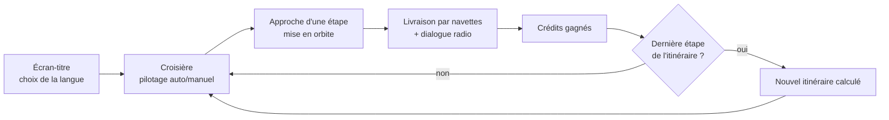
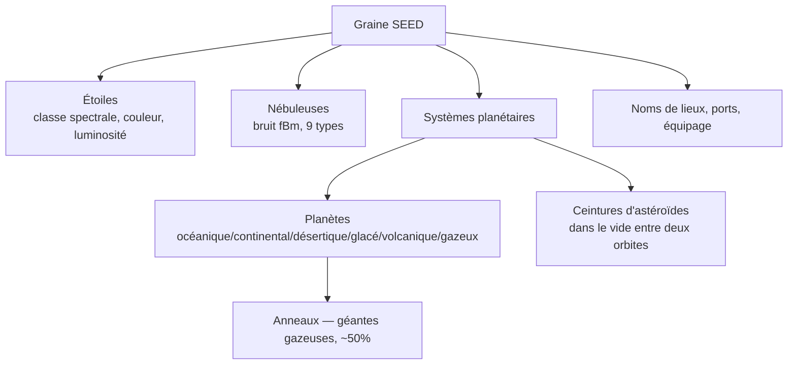
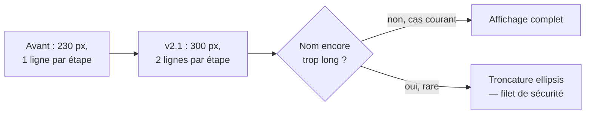
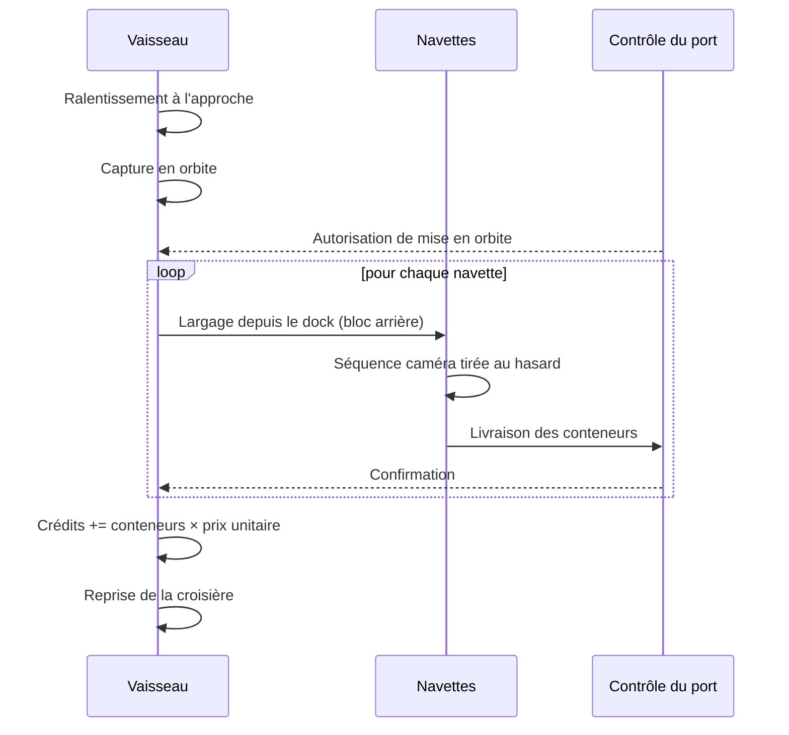
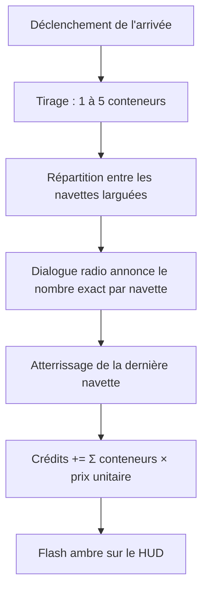
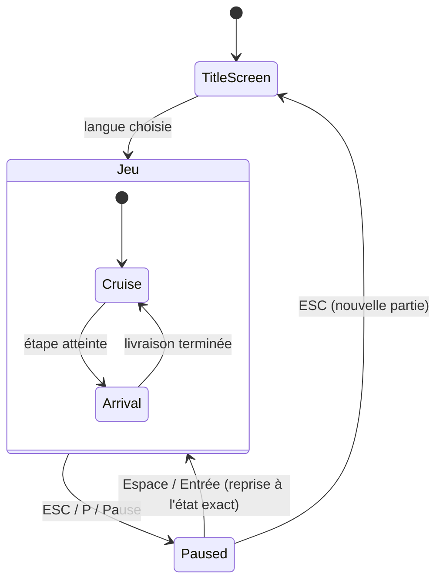
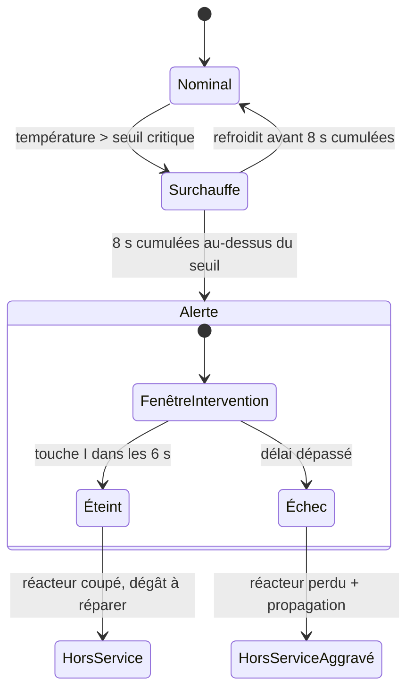
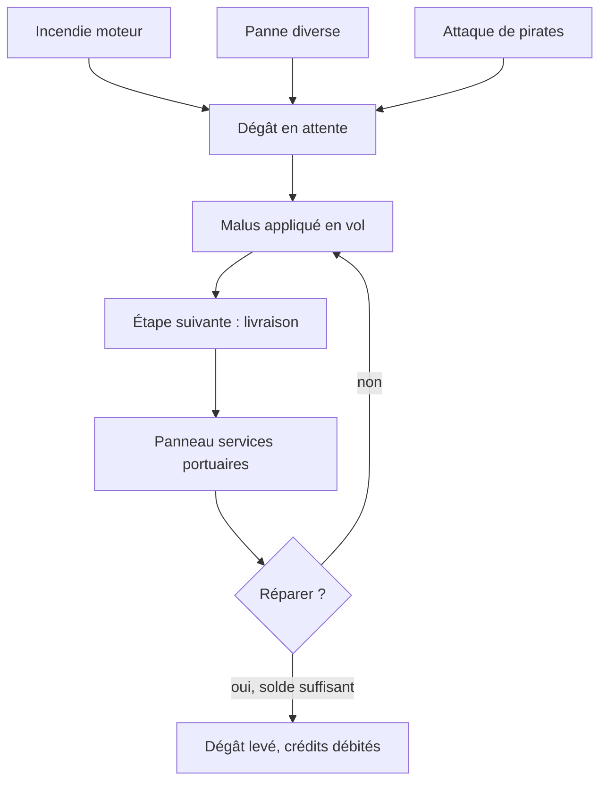
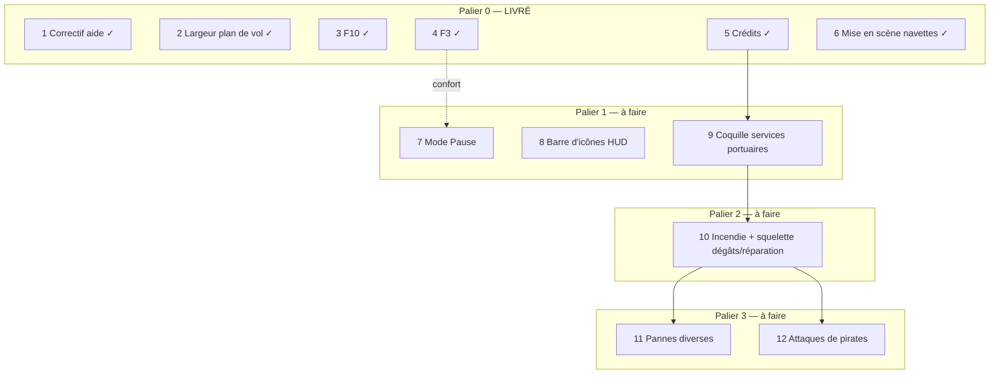

# Space Travel & Transport — Spécification v2.1

**Format :** Markdown, avec captures d'écran, schémas SVG et diagrammes mermaid intégrés — copie de cette v2.1 accompagnée du dossier `images/` requise pour que les illustrations s'affichent.

**Ce qui change depuis la v2.0** (DOCX) : plusieurs évolutions qui y étaient décrites comme de simples propositions sont désormais **réellement implémentées et vérifiées** dans `voyage-spatial.html` — le système de crédits, les raccourcis F3/F10, l'élargissement du panneau de plan de vol, le correctif du roulis, et surtout la mise en scène cinématique des navettes avec un dock physique sous le vaisseau et un habillage texturé de la coque. Ce document sépare nettement, comme la v2.0, ce qui existe (Partie I) de ce qui reste à construire (Partie II) — mais la frontière entre les deux s'est déplacée.

---

## Sommaire

**Partie I — État actuel du simulateur**
- [1. Vue d'ensemble](#1-vue-densemble)
- [2. Univers procédural](#2-univers-procédural)
- [3. Le vaisseau](#3-le-vaisseau)
- [4. Commandes de vol et caméra](#4-commandes-de-vol-et-caméra)
- [5. Navigation — plan de vol](#5-navigation--plan-de-vol)
- [6. Systèmes planétaires](#6-systèmes-planétaires)
- [7. Séquence d'arrivée : orbite, navettes, crédits](#7-séquence-darrivée--orbite-navettes-crédits)
- [8. Interface (HUD)](#8-interface-hud)
- [9. Architecture technique](#9-architecture-technique)
- [10. Internationalisation](#10-internationalisation)

**Partie II — Évolutions restant à implémenter**
- [11. Mode Pause](#11-mode-pause)
- [12. Barre de contrôle du HUD](#12-barre-de-contrôle-du-hud)
- [13. Événements aléatoires et réparations](#13-événements-aléatoires-et-réparations)
- [14. Plan d'implémentation](#14-plan-dimplémentation)
- [15. Référence — tous les raccourcis clavier](#15-référence--tous-les-raccourcis-clavier)

---

# Partie I — État actuel du simulateur

## 1. Vue d'ensemble

Simulateur de vol spatial procédural, livré en **un unique fichier HTML autonome** (Three.js r128, WebGL, aucune étape de build). Un cargo pilote automatiquement — ou manuellement — de système en système, livre sa cargaison par navettes à chaque escale, échange par radio avec le contrôle du port, gagne des crédits, et poursuit son itinéraire dans un univers entièrement généré depuis une seule graine. Interface disponible en français, anglais, allemand et espagnol, choisie sur l'écran-titre.

## 2. Univers procédural

Tout — étoiles, nébuleuses, systèmes planétaires, noms — découle d'une seule graine (`SEED`) via des générateurs pseudo-aléatoires dédiés. Rejouer la même graine reproduit exactement le même univers.

- **Étoiles** physiquement modélisées : classes spectrales (fractions de Salpeter), couleur par lieu planckien, luminosité/masse/rayon par lois astrophysiques, magnitude apparente calculée en fonction de la distance.
- **Nébuleuses** procédurales (bruit fBm 4 canaux), apparition progressive pour éviter tout effet de « pop » visuel.
- **Étiquettes de désignation** : cercle de ciblage + flèche, pour étoiles, planètes et lunes — vocabulaire visuel cohérent dans tout le HUD.

## 3. Le vaisseau

Porte-conteneurs low-poly en deux blocs : une nacelle cargo à claire-voie à l'avant, reliée par une épine dorsale à un bloc propulsif arrière massif portant la passerelle et une grappe de quatre réacteurs.

**Nouveauté v2.1 — habillage de la coque.** Les quatre matériaux réutilisés dans tout le vaisseau (coque, pont, panneaux sombres, cadres) portent désormais une texture procédurale générée par canvas — grille de panneaux à teinte légèrement désaccordée, joints marqués, greebles épars (capots, ouïes), bandes de danger jaune/noir ponctuelles. Inspirée de vaisseaux cargo façon *Homeworld*, sans dépendance à une image externe : cohérent avec le reste du fichier, qui génère déjà ses textures d'anneaux et de planètes de la même manière. Une texture par matériau suffit à habiller l'ensemble de la silhouette ; les navettes ont leur propre texture, générée une seule fois au chargement plutôt qu'à chaque largage.

**Nouveauté v2.1 — dock de navettes.** Une baie éclairée en bleu, en saillie sous le bloc arrière (propulseurs) — pas sous la nacelle cargo, où elle se serait retrouvée occultée par le volume des conteneurs. Puits + cadre métallique + surface émissive + double halo additif (cœur serré, halo large) + point light à courte portée qui illumine réellement la coque alentour, avec une respiration douce plutôt qu'un clignotement. Les navettes partent réellement de ce point, pas du centre du vaisseau.

## 4. Commandes de vol et caméra

| Touche | Action |
|---|---|
| `↑ ↓ ← →` / `Z Q S D` (AZERTY) / `W A S D` (QWERTY) | Orientation |
| `E` / `R` | Roulis *(corrigé en v2.1 — l'aide affichait par erreur `A / E`)* |
| `MAJ` ou `ESPACE` | Propulsion (boost) |
| Glisser la souris | Visée fine |
| `CTRL` + glisser | Regard libre |
| `F3` | Mode de caméra suivant *(nouveau v2.1)* |

**Nouveauté v2.1 — F3.** Le changement de mode de caméra (poursuite standard → plan-séquence → plans lointains) se fait désormais par une simple pression sur `F3`, qui remplace l'ancien mécanisme de double/triple appui sur `CTRL`. Ce dernier — sensible aux conditions de rendu lors de sa validation initiale — a été **entièrement retiré** plutôt que complété : `CTRL` retrouve un rôle unique (regard libre en glissé, recentrage en appui court), sans plus avoir besoin d'un minuteur pour distinguer un, deux ou trois appuis.

## 5. Navigation — plan de vol

**Correctif v2.1 — largeur du panneau.** Mesuré dans le code : le panneau ne faisait que 230 px de large, avec numéro/nom/désignation stellaire sur une seule ligne — largement insuffisant face aux noms de ports générés, d'où des troncatures fréquentes. Deux ajustements combinés : élargissement modéré à 300 px, **et** passage à un gabarit deux lignes par étape (nom en pleine largeur, désignation stellaire en dessous, atténuée). La troncature reste en filet de sécurité pour les rares noms encore trop longs.

La route est planifiée via une courbe de Catmull-Rom passant par chaque étoile puis chaque planète cible, avec deux passes de sécurité qui écartent toute planète — ciblée ou non — qui se retrouverait trop près du tracé (vérifié sans collision sur 150 itinéraires générés aléatoirement).

## 6. Systèmes planétaires

- 2 à 3 planètes par système, une habitable (port spatial).
- Espacement orbital en croissance géométrique (esprit Titius-Bode), avec garantie mathématique de zéro chevauchement quel que soit l'angle orbital.
- Anneaux pour ~50 % des géantes gazeuses ; champs d'astéroïdes placés dans le **vide** entre deux orbites, jamais sur l'orbite d'une planète.

## 7. Séquence d'arrivée : orbite, navettes, crédits

À chaque étape (pas seulement la dernière), le vaisseau ralentit à l'approche, se met en orbite, et livre sa cargaison.

**Nouveauté v2.1 — mise en scène des navettes.** Un catalogue de quatre séquences de plans, tirée au hasard à chaque largage (seedée, donc reproductible pour une même graine) :

| Séquence | Gros plan initial | Puis |
|---|---|---|
| Latérale rapprochée | Dock vu de côté, contre-plongée | Coupure franche vers un suivi à distance |
| Face avant | La navette vient droit vers la caméra | Suivi latéral large, le port entre dans le cadre |
| Travelling continu | Dock en gros plan | Éloignement progressif, sans aucune coupure |
| Sur l'épaule | Dock en gros plan | Plan fixe solidaire du vaisseau |

La coupure franche (pour les trois premières séquences) a été vérifiée par instrumentation directe : saut de caméra de plus de 120 unités en une seule image, exactement à l'instant prévu — pas un fondu progressif.

**Nouveauté v2.1 — crédits.** 1 à 5 conteneurs tirés par escale, répartis entre les navettes réellement larguées — et c'est cette même répartition qui alimente le dialogue radio, pour que l'équipage n'annonce jamais un chiffre sans rapport avec ce qui est effectivement crédité. Gain versé au moment où le dernier conteneur atterrit. Solde initial de 10 000 crédits, affiché dans la barre supérieure à gauche de `SEED`.

Le canal radio combine dialogue textuel et synthèse vocale (voix tirée aléatoirement masculine/féminine pour chaque interlocuteur), avec bips synthétisés à l'apparition de chaque message.

## 8. Interface (HUD)

Panneaux : Vitesse/Secteur/Cap, Plan de vol, Objet le plus proche, Température moteur, Propulsion, Commandes moteur, Canal radio (bascule `TAB`). Aide clavier (`H`) tenue à jour avec tous les raccourcis actuels, y compris `F3`/`F10`.

## 9. Architecture technique

## 10. Internationalisation

Français, anglais, allemand, espagnol — dictionnaire `I18N` couvrant les libellés du HUD, les gabarits de dialogue radio (paramétrés, pas des chaînes figées), et la langue de la synthèse vocale. Choisie une fois sur l'écran-titre, appliquée pour toute la session.

---

# Partie II — Évolutions restant à implémenter

Les chantiers suivants restent au stade de spécification : ils ne sont **pas** présents dans le fichier livré aujourd'hui.

## 11. Mode Pause

`ÉCHAP`, `P` ou `PAUSE` gèle entièrement la simulation (route, rotation, températures, navettes) et suspend la synthèse vocale sans l'annuler. `ESPACE`/`ENTRÉE` reprend exactement où le jeu en était ; `ÉCHAP` depuis la pause renvoie à l'écran-titre (abandon de session, nouvelle graine à la prochaine sélection de langue).

⚠️ Le code actuel utilise déjà `ARRIVAL_PAUSE`/`paused` pour la mise en orbite — sans rapport avec ce nouveau mode. Renommer (`ARRIVAL_PAUSE`→`ARRIVAL`, `paused`→`arriving`) avant d'introduire `gamePaused`.

## 12. Barre de contrôle du HUD

Une barre d'icônes fixe, en bas à gauche, pour afficher/masquer indépendamment chacun des sept panneaux du HUD — plus un huitième bouton dupliquant l'action de `F3`. Quand les sept panneaux sont masqués, seuls la ligne d'en-tête et cette barre restent visibles. Chaque bouton : icône distincte, infobulle traduite, état visuel actif/inactif.

## 13. Événements aléatoires et réparations

Trois familles d'incidents partageant un même aval — un dégât à réparer à l'escale suivante :

- **Incendie moteur** (§ ci-dessus) : intervention par la touche `I`, fenêtre de 6 secondes.
- **Pannes diverses** : radar, propulseurs RCS, autopilote — chacune avec son malus propre en vol.
- **Attaques de pirates** : trois profils de menace (navette, intercepteur, croiseur), dialogue à choix (payer / résister / fuir), bordure colorée selon le type d'événement (ambre = panne, rouge = menace hostile).

La réparation se propose dans le même panneau « services portuaires » qui gère déjà la dépense de crédits — les deux mécaniques convergent naturellement au même point de la boucle de jeu.

## 14. Plan d'implémentation

Le **palier 0** de la spécification précédente (six étapes sans dépendance) est désormais **entièrement livré** : correctif de l'aide, largeur du plan de vol, F10, F3, crédits, et mise en scène des navettes. Les paliers suivants restent à faire.

Économie de la boucle de jeu, telle qu'elle fonctionne aujourd'hui pour la partie crédits, et vers laquelle convergeront les réparations :

## 15. Référence — tous les raccourcis clavier

| Touche | Action | État |
|---|---|---|
| `↑ ↓ ← →` / `ZQSD` / `WASD` | Orientation | actuel |
| `E` / `R` | Roulis | actuel *(corrigé v2.1)* |
| `MAJ` / `ESPACE` | Propulsion | actuel |
| Glisser la souris | Visée fine | actuel |
| `CTRL` + glisser | Regard libre | actuel |
| `CTRL` (appui court) | Recentre le regard libre | actuel |
| `F3` | Mode de caméra suivant | **actuel (v2.1)** |
| `TAB` | Affiche/masque le canal radio | actuel |
| `H` | Affiche/masque l'aide | actuel |
| `F10` | Coupe/rétablit la voix de synthèse | **actuel (v2.1)** |
| `ESPACE` / `ENTRÉE` | Abrège la manœuvre d'approche | actuel |
| `I` | Intervenir sur un incendie moteur | à venir (§13) |
| `ÉCHAP` / `P` / `PAUSE` | Bascule en mode Pause | à venir (§11) |
| `ÉCHAP` (en pause) | Retour à l'écran-titre | à venir (§11) |

### Touches à sens multiple

| Touche | Sens selon le contexte |
|---|---|
| `ESPACE` | Propulsion (croisière) · Abrégé (approche) · *Reprise (pause, à venir)* |
| `CTRL` | Regard libre si maintenu et glissé · Recentrage si appui court seul |
