# Space Travel & Transport — Spécification v2.3

**Format :** Markdown avec captures d'écran, schémas SVG et diagrammes mermaid **intégrés directement dans le fichier** (images en base64) — un seul fichier `.md`, aucun dossier annexe requis.

**Ce qui change depuis la v2.0** (DOCX) : plusieurs évolutions qui y étaient décrites comme de simples propositions sont désormais **réellement implémentées et vérifiées** dans `voyage-spatial.html` — le système de crédits, les raccourcis F3/F10, l'élargissement du panneau de plan de vol, le correctif du roulis, et surtout la mise en scène cinématique des navettes avec un dock physique sous le vaisseau et un habillage texturé de la coque. Ce document sépare nettement, comme la v2.0, ce qui existe (Partie I) de ce qui reste à construire (Partie II) — mais la frontière entre les deux s'est déplacée.

## Historique des révisions

| Version | Date | Auteur | Contenu |
|---|---|---|---|
| 2.0 | 13 septembre 2026 | Frédéric Delorme | Spécification initiale (DOCX) : vue d'ensemble, univers procédural, vaisseau, commandes, navigation, systèmes planétaires, séquence d'arrivée, HUD, architecture, i18n. |
| 2.1 | 16 septembre 2026 | Frédéric Delorme | Conversion en Markdown autonome (images intégrées). Ajout des propositions §14 (dialogues radio par IA embarquée, Gemini Nano) et §15 (contrôle tactile), puis implémentation et vérification des deux. Corrections : scintillement du dock (z-fighting), caméra de largage des navettes décentrée/tremblante, mise en orbite trop rapide, trajectoire du cargo pouvant traverser des corps célestes. |
| 2.2 | 16-17 septembre 2026 | Frédéric Delorme | Palier 1 livré : mode Pause (§11), barre de contrôle du HUD (§12), services portuaires (§16, nouveau). Premier lot de corrections (espacement des systèmes trop resserré, planètes absentes du plan de vol, chevauchement radio/services). |
| 2.3 | 17 septembre 2026 | Frédéric Delorme | Second lot de corrections et améliorations (§17) : bugs (chevauchement général des panneaux, regard tactile disparu, position de la barre d'icônes, bouton d'aide manquant) et confort (croix de fermeture, raccourcis F1-F9+H, icône caméra dynamique, aide en overlay, message de bienvenue radio, avatars, trajectoire de largage des navettes en 3 temps, traînée de propulseur, labels de vaisseaux, rendu d'objet dans le panneau « objet le plus proche »). Proposition (non implémentée) pour la carte de l'univers (§19). |

---

## Sommaire

**Partie I — État actuel du simulateur**
- [1. Vue d'ensemble](#1-vue-densemble)
- [2. Univers procédural](#2-univers-procédural)
- [3. Le vaisseau](#3-le-vaisseau)
- [4. Commandes de vol et caméra](#4-commandes-de-vol-et-caméra)
- [5. Navigation — plan de vol](#5-navigation--plan-de-vol)
- [6. Systèmes planétaires](#6-systèmes-planétaires)
- [7. Séquence d'arrivée : orbite, navettes, crédits](#7-séquence-darrivée--orbite-navettes-crédits)
- [8. Interface (HUD)](#8-interface-hud)
- [9. Architecture technique](#9-architecture-technique)
- [10. Internationalisation](#10-internationalisation)

**Partie II — Évolutions restant à implémenter**
- [11. Mode Pause — ✅ implémenté](#11-mode-pause--implémenté)
- [12. Barre de contrôle du HUD — ✅ implémenté](#12-barre-de-contrôle-du-hud--implémenté)
- [13. Événements aléatoires et réparations](#13-événements-aléatoires-et-réparations)
- [14. Dialogues radio générés par IA embarquée (Gemini Nano) — ✅ implémenté](#14-dialogues-radio-générés-par-ia-embarquée-gemini-nano--implémenté)
- [15. Contrôle tactile pour appareils portables — ✅ implémenté](#15-contrôle-tactile-pour-appareils-portables--implémenté)
- [16. Services portuaires — ✅ implémenté](#16-services-portuaires--implémenté)
- [17. Corrections et améliorations (raffinement post-Palier 1)](#17-corrections-et-améliorations-raffinement-post-palier-1)
- [18. Plan d'implémentation](#18-plan-dimplémentation)
- [19. Carte de l'univers — proposition (non implémentée)](#19-carte-de-lunivers--proposition-touche-m-non-implémentée)
- [20. Référence — tous les raccourcis clavier](#20-référence--tous-les-raccourcis-clavier)

---

# Partie I — État actuel du simulateur

## 1. Vue d'ensemble

Simulateur de vol spatial procédural, livré en **un unique fichier HTML autonome** (Three.js r128, WebGL, aucune étape de build). Un cargo pilote automatiquement — ou manuellement — de système en système, livre sa cargaison par navettes à chaque escale, échange par radio avec le contrôle du port, gagne des crédits, et poursuit son itinéraire dans un univers entièrement généré depuis une seule graine. Interface disponible en français, anglais, allemand et espagnol, choisie sur l'écran-titre.

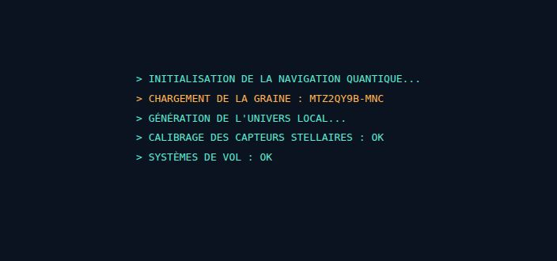

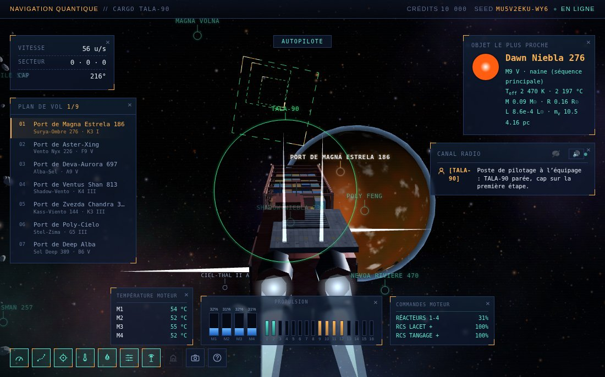

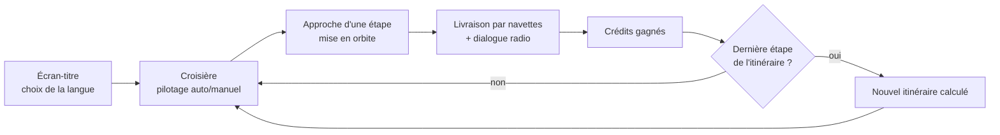
```mermaid
flowchart LR
    A[Écran-titre<br/>choix de la langue] --> B[Croisière<br/>pilotage auto/manuel]
    B --> C[Approche d'une étape<br/>mise en orbite]
    C --> D[Livraison par navettes<br/>+ dialogue radio]
    D --> E[Crédits gagnés]
    E --> F{Dernière étape<br/>de l'itinéraire ?}
    F -- non --> B
    F -- oui --> G[Nouvel itinéraire calculé]
    G --> B
```

## 2. Univers procédural

Tout — étoiles, nébuleuses, systèmes planétaires, noms — découle d'une seule graine (`SEED`) via des générateurs pseudo-aléatoires dédiés. Rejouer la même graine reproduit exactement le même univers.

- **Étoiles** physiquement modélisées : classes spectrales (fractions de Salpeter), couleur par lieu planckien, luminosité/masse/rayon par lois astrophysiques, magnitude apparente calculée en fonction de la distance.
- **Nébuleuses** procédurales (bruit fBm 4 canaux), apparition progressive pour éviter tout effet de « pop » visuel.
- **Étiquettes de désignation** : cercle de ciblage + flèche, pour étoiles, planètes et lunes — vocabulaire visuel cohérent dans tout le HUD.

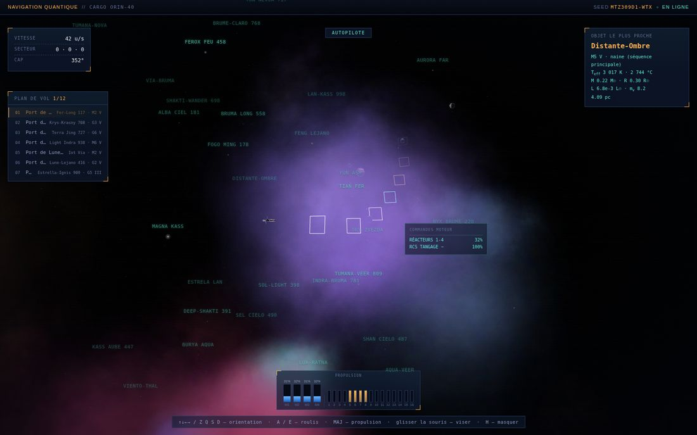

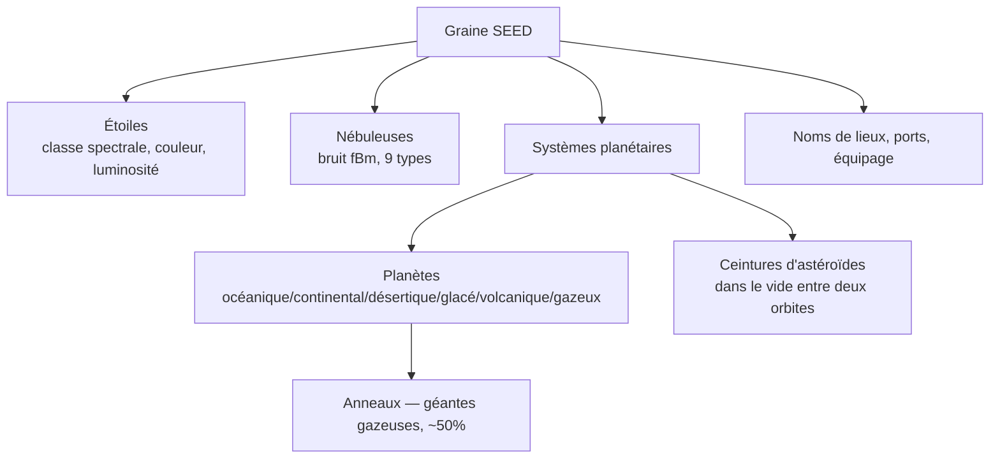
```mermaid
flowchart TD
    SEED[Graine SEED] --> ST[Étoiles<br/>classe spectrale, couleur, luminosité]
    SEED --> NB[Nébuleuses<br/>bruit fBm, 9 types]
    SEED --> SYS[Systèmes planétaires]
    SEED --> NM[Noms de lieux, ports, équipage]
    SYS --> PL[Planètes<br/>océanique/continental/désertique/glacé/volcanique/gazeux]
    PL --> RG[Anneaux — géantes gazeuses, ~50%]
    SYS --> AST[Ceintures d'astéroïdes<br/>dans le vide entre deux orbites]
```

## 3. Le vaisseau

Porte-conteneurs low-poly en deux blocs : une nacelle cargo à claire-voie à l'avant, reliée par une épine dorsale à un bloc propulsif arrière massif portant la passerelle et une grappe de quatre réacteurs.

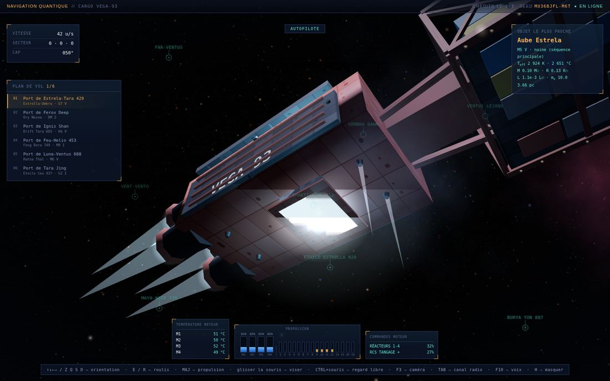

**Nouveauté v2.1 — habillage de la coque.** Les quatre matériaux réutilisés dans tout le vaisseau (coque, pont, panneaux sombres, cadres) portent désormais une texture procédurale générée par canvas — grille de panneaux à teinte légèrement désaccordée, joints marqués, greebles épars (capots, ouïes), bandes de danger jaune/noir ponctuelles. Inspirée de vaisseaux cargo façon *Homeworld*, sans dépendance à une image externe : cohérent avec le reste du fichier, qui génère déjà ses textures d'anneaux et de planètes de la même manière. Une texture par matériau suffit à habiller l'ensemble de la silhouette ; les navettes ont leur propre texture, générée une seule fois au chargement plutôt qu'à chaque largage.

**Nouveauté v2.1 — dock de navettes.** Une baie éclairée en bleu, en saillie sous le bloc arrière (propulseurs) — pas sous la nacelle cargo, où elle se serait retrouvée occultée par le volume des conteneurs. Puits + cadre métallique + surface émissive + double halo additif (cœur serré, halo large) + point light à courte portée qui illumine réellement la coque alentour, avec une respiration douce plutôt qu'un clignotement. Les navettes partent réellement de ce point, pas du centre du vaisseau.

## 4. Commandes de vol et caméra

| Touche | Action |
|---|---|
| `↑ ↓ ← →` / `Z Q S D` (AZERTY) / `W A S D` (QWERTY) | Orientation |
| `E` / `R` | Roulis *(corrigé en v2.1 — l'aide affichait par erreur `A / E`)* |
| `MAJ` ou `ESPACE` | Propulsion (boost) |
| Glisser la souris | Visée fine |
| `CTRL` + glisser | Regard libre |
| `F3` | Mode de caméra suivant *(nouveau v2.1)* |

**Nouveauté v2.1 — F3.** Le changement de mode de caméra (poursuite standard → plan-séquence → plans lointains) se fait désormais par une simple pression sur `F3`, qui remplace l'ancien mécanisme de double/triple appui sur `CTRL`. Ce dernier — sensible aux conditions de rendu lors de sa validation initiale — a été **entièrement retiré** plutôt que complété : `CTRL` retrouve un rôle unique (regard libre en glissé, recentrage en appui court), sans plus avoir besoin d'un minuteur pour distinguer un, deux ou trois appuis.

## 5. Navigation — plan de vol

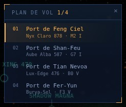

**Correctif v2.1 — largeur du panneau.** Mesuré dans le code : le panneau ne faisait que 230 px de large, avec numéro/nom/désignation stellaire sur une seule ligne — largement insuffisant face aux noms de ports générés, d'où des troncatures fréquentes. Deux ajustements combinés : élargissement modéré à 300 px, **et** passage à un gabarit deux lignes par étape (nom en pleine largeur, désignation stellaire en dessous, atténuée). La troncature reste en filet de sécurité pour les rares noms encore trop longs.

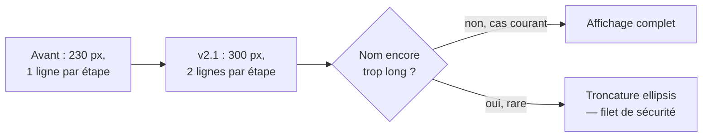
```mermaid
flowchart LR
    A["Avant : 230 px,<br/>1 ligne par étape"] --> B["v2.1 : 300 px,<br/>2 lignes par étape"]
    B --> C{Nom encore<br/>trop long ?}
    C -->|non, cas courant| D[Affichage complet]
    C -->|oui, rare| E[Troncature ellipsis<br/>— filet de sécurité]
```

La route est planifiée via une courbe de Catmull-Rom passant par chaque étoile puis chaque planète cible, avec deux passes de sécurité qui écartent toute planète — ciblée ou non — qui se retrouverait trop près du tracé (vérifié sans collision sur 150 itinéraires générés aléatoirement).

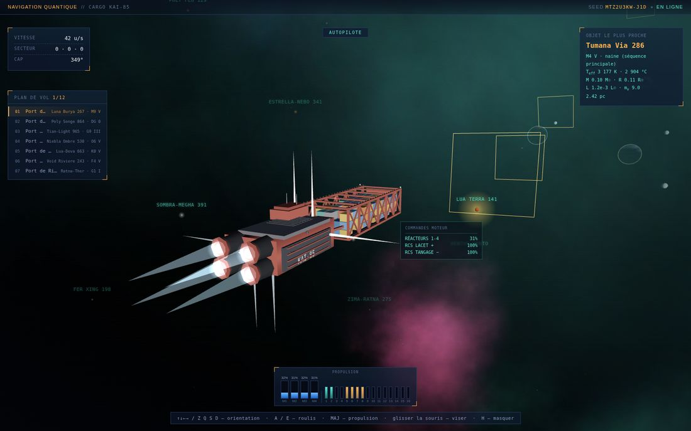

## 6. Systèmes planétaires

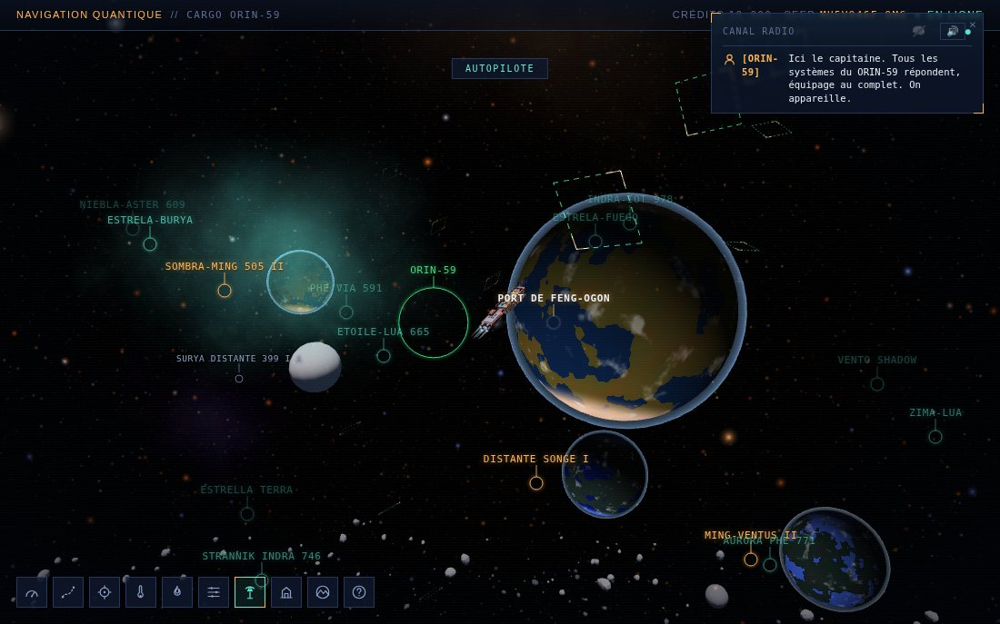

- 2 à 3 planètes par système, une habitable (port spatial).
- Espacement orbital en croissance géométrique (esprit Titius-Bode), avec garantie mathématique de zéro chevauchement quel que soit l'angle orbital.
- Anneaux pour ~50 % des géantes gazeuses ; champs d'astéroïdes placés dans le **vide** entre deux orbites, jamais sur l'orbite d'une planète.

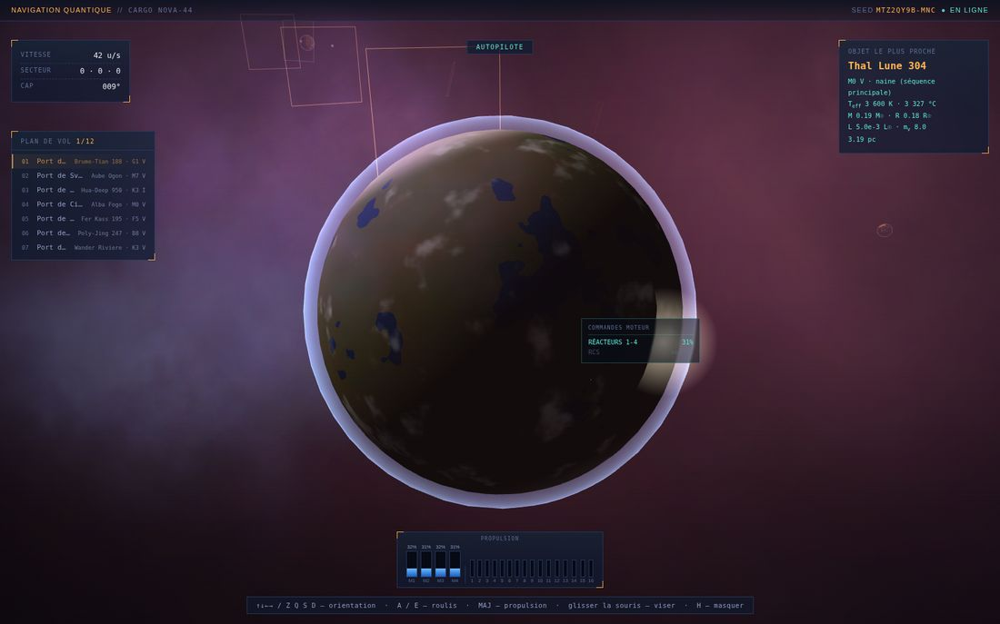

## 7. Séquence d'arrivée : orbite, navettes, crédits

À chaque étape (pas seulement la dernière), le vaisseau ralentit à l'approche, se met en orbite, et livre sa cargaison.

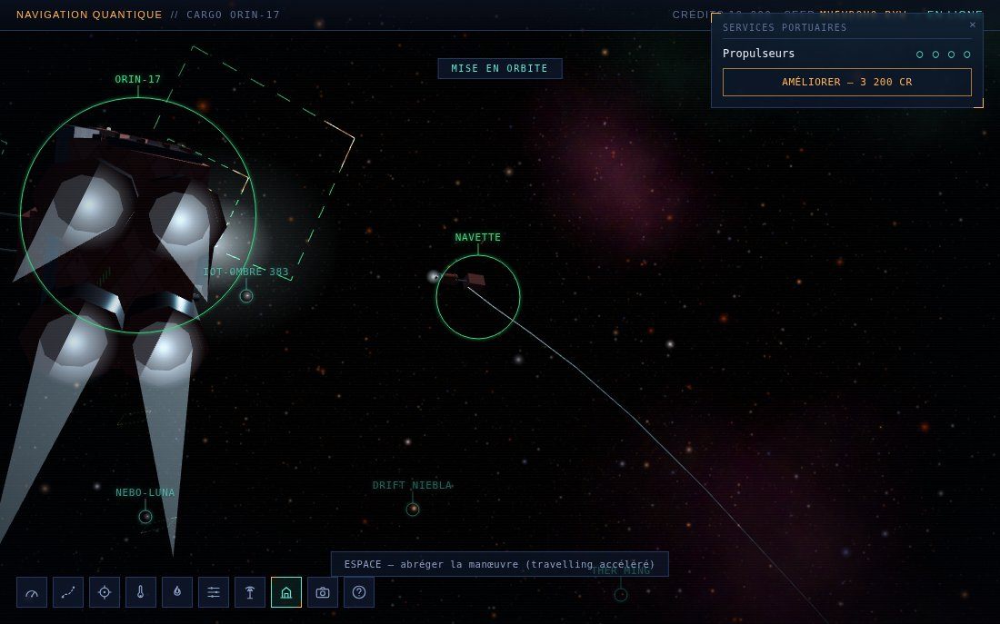

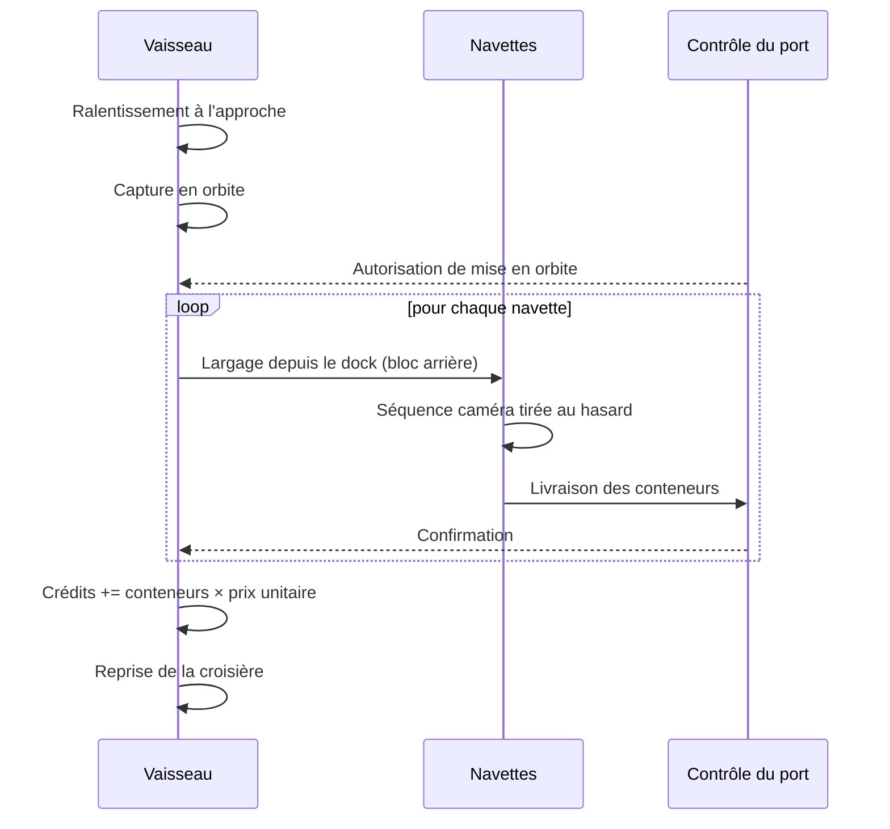
```mermaid
sequenceDiagram
    participant V as Vaisseau
    participant N as Navettes
    participant R as Contrôle du port
    V->>V: Ralentissement à l'approche
    V->>V: Capture en orbite
    R-->>V: Autorisation de mise en orbite
    loop pour chaque navette
        V->>N: Largage depuis le dock (bloc arrière)
        N->>N: Séquence caméra tirée au hasard
        N->>R: Livraison des conteneurs
        R-->>V: Confirmation
    end
    V->>V: Crédits += conteneurs × prix unitaire
    V->>V: Reprise de la croisière
```

**Nouveauté v2.1 — mise en scène des navettes.** Un catalogue de quatre séquences de plans, tirée au hasard à chaque largage (seedée, donc reproductible pour une même graine) :

| Séquence | Gros plan initial | Puis |
|---|---|---|
| Latérale rapprochée | Dock vu de côté, contre-plongée | Coupure franche vers un suivi à distance |
| Face avant | La navette vient droit vers la caméra | Suivi latéral large, le port entre dans le cadre |
| Travelling continu | Dock en gros plan | Éloignement progressif, sans aucune coupure |
| Sur l'épaule | Dock en gros plan | Plan fixe solidaire du vaisseau |

La coupure franche (pour les trois premières séquences) a été vérifiée par instrumentation directe : saut de caméra de plus de 120 unités en une seule image, exactement à l'instant prévu — pas un fondu progressif.

**Nouveauté v2.1 — crédits.** 1 à 5 conteneurs tirés par escale, répartis entre les navettes réellement larguées — et c'est cette même répartition qui alimente le dialogue radio, pour que l'équipage n'annonce jamais un chiffre sans rapport avec ce qui est effectivement crédité. Gain versé au moment où le dernier conteneur atterrit. Solde initial de 10 000 crédits, affiché dans la barre supérieure à gauche de `SEED`.

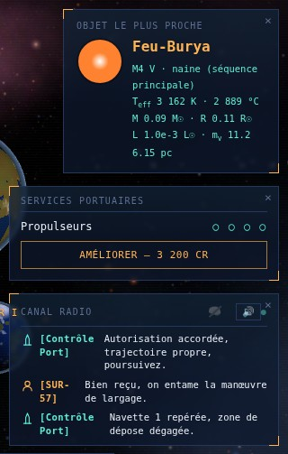

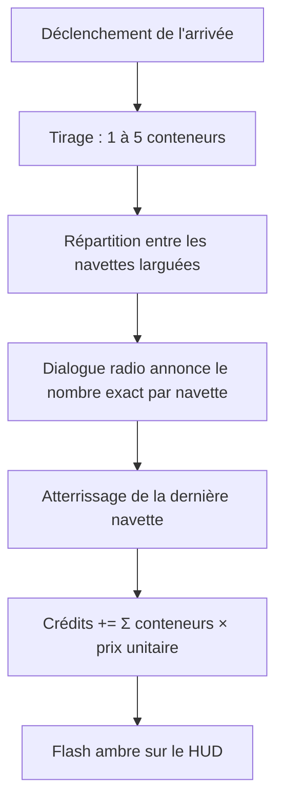
```mermaid
flowchart TD
    A[Déclenchement de l'arrivée] --> B[Tirage : 1 à 5 conteneurs]
    B --> C[Répartition entre les navettes larguées]
    C --> D[Dialogue radio annonce le nombre exact par navette]
    D --> E[Atterrissage de la dernière navette]
    E --> F[Crédits += Σ conteneurs × prix unitaire]
    F --> G[Flash ambre sur le HUD]
```

Le canal radio combine dialogue textuel et synthèse vocale (voix tirée aléatoirement masculine/féminine pour chaque interlocuteur), avec bips synthétisés à l'apparition de chaque message.

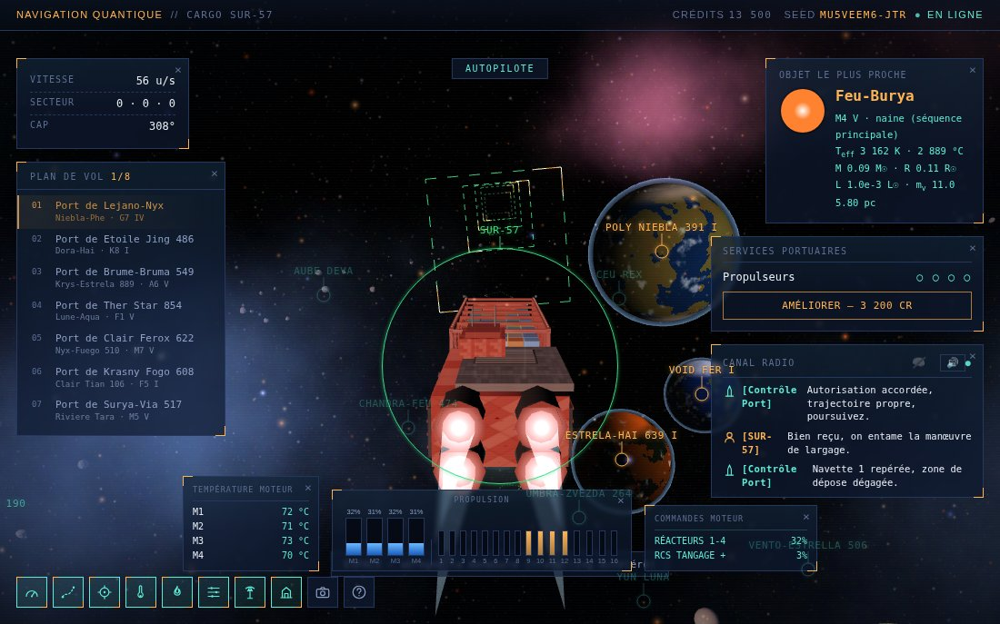

## 8. Interface (HUD)

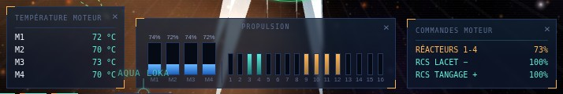

Panneaux : Vitesse/Secteur/Cap, Plan de vol, Objet le plus proche, Température moteur, Propulsion, Commandes moteur, Canal radio (bascule `TAB`). Aide clavier (`H`) tenue à jour avec tous les raccourcis actuels, y compris `F3`/`F10`.

## 9. Architecture technique

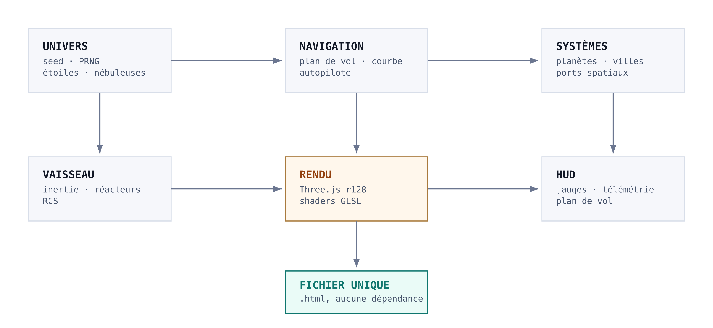

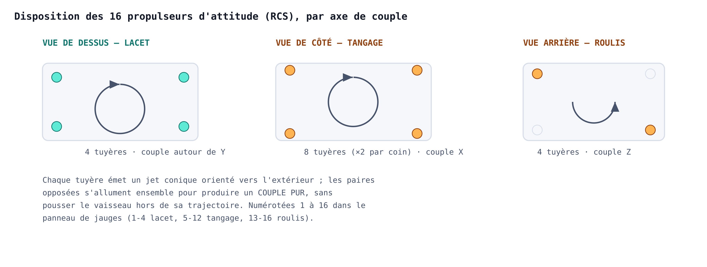
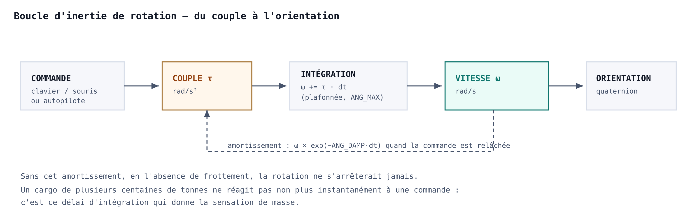
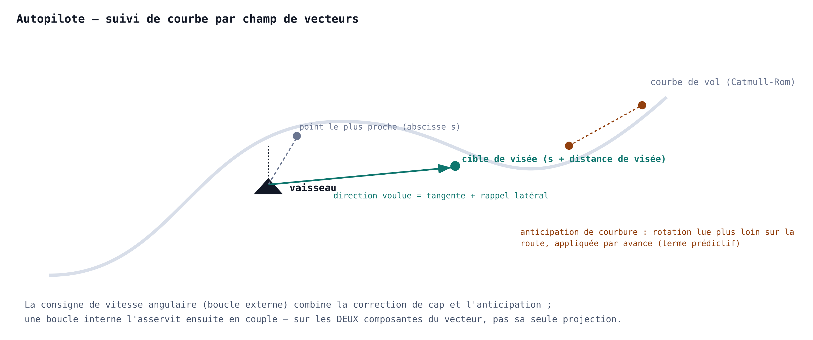

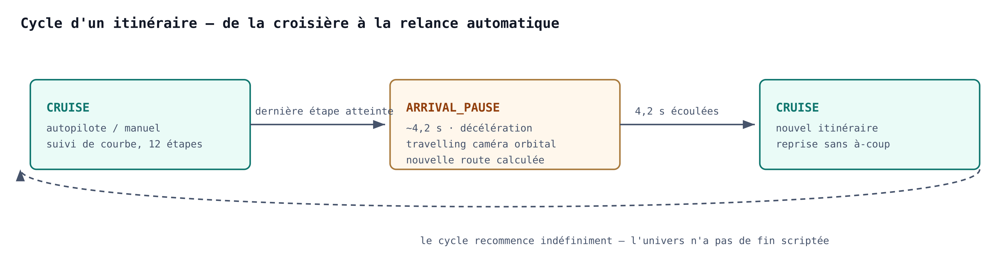

## 10. Internationalisation

Français, anglais, allemand, espagnol — dictionnaire `I18N` couvrant les libellés du HUD, les gabarits de dialogue radio (paramétrés, pas des chaînes figées), et la langue de la synthèse vocale. Choisie une fois sur l'écran-titre, appliquée pour toute la session.

---

# Partie II — Évolutions restant à implémenter

Les chantiers suivants restent au stade de spécification : ils ne sont **pas** présents dans le fichier livré aujourd'hui.

## 11. Mode Pause — ✅ implémenté

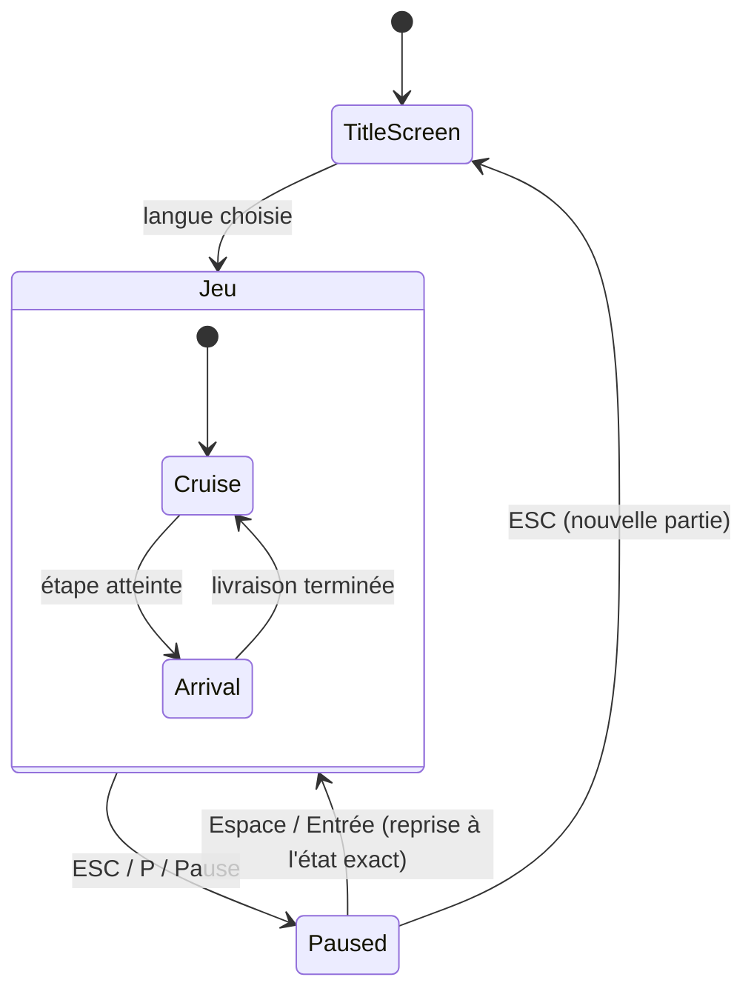
```mermaid
stateDiagram-v2
    [*] --> TitleScreen
    TitleScreen --> Jeu: langue choisie
    state Jeu {
        [*] --> Cruise
        Cruise --> Arrival: étape atteinte
        Arrival --> Cruise: livraison terminée
    }
    Jeu --> Paused: ESC / P / Pause
    Paused --> Jeu: Espace / Entrée (reprise à l'état exact)
    Paused --> TitleScreen: ESC (nouvelle partie)
```

`ÉCHAP`, `P` ou `PAUSE` gèle entièrement la simulation (route, rotation, températures, navettes) et suspend la synthèse vocale sans l'annuler (`speechSynthesis.pause()`, pas `cancel()`). `ESPACE`/`ENTRÉE` reprend exactement où le jeu en était ; `ÉCHAP` depuis la pause renvoie à l'écran-titre.

**Écarts par rapport à la version précédente de cette spec :**
- **Pas de renommage** de `ARRIVAL_PAUSE`/`paused` : le risque de confusion signalé était réel mais purement documentaire (portées JS distinctes, aucun conflit effectif) — un nouveau flag au nom sans ambiguïté (`gamePaused`) suffisait, pour un coût et un risque de régression bien moindres qu'un renommage traversant tout le fichier.
- **`ÉCHAP` ne fait plus jamais office d'abrégé de manœuvre** (rôle qu'elle partageait avant avec `ESPACE`/`ENTRÉE`) — retirée de ce rôle pour éliminer tout conflit avec la pause, qui devient sa seule fonction, dans toutes les phases de jeu sans exception.
- **Aucune confirmation avant de quitter** : `ÉCHAP` en pause recharge la page immédiatement (choix délibéré — voir ci-dessous).
- Le retour à l'écran-titre est un **rechargement complet de la page** (`location.reload()`), plutôt qu'une remise à zéro manuelle des dizaines de variables globales interdépendantes (`ROUTE`, `orbitState`, crédits, orientation du vaisseau, niveau d'amélioration des propulseurs…) — garantit un état neuf et une graine neuve (`SEED` dérive de `Date.now()`) sans risque d'en oublier une. Conséquence assumée : le niveau d'amélioration acheté aux services portuaires (§16) repart lui aussi à zéro, cohérent avec « nouvelle partie ».

## 12. Barre de contrôle du HUD — ✅ implémenté

Une barre d'icônes SVG, générée dynamiquement depuis une seule liste (`HUD_BAR_ITEMS`) — bureau et tactile partagent exactement le même mécanisme de bascule, les mêmes icônes et la même logique d'activation, seule la position diffère.

- **Bureau** : fixe en bas à gauche, toujours visible, comme prévu initialement.
- **Tactile** : également en bas, centrée — les commandes de pilotage (joystick, roulis, boost, regard libre) sont décalées plus haut pour lui laisser la place (§15). *Un temps repositionnée en haut par contrainte d'espace, revenue en bas sur demande explicite — cf. §17.3.* Remplace entièrement l'ancien menu ☰ tactile (liste déroulante textuelle), désormais unifié avec cette même barre.
- **10 boutons, pas 8** : les sept panneaux d'info, le canal radio, la caméra (`F3` à l'origine) — plus les **services portuaires** (§16, icône grisée/inerte hors de sa fenêtre d'activation) et l'**aide** (§17.3), ajoutés en cours de route.
- **Raccourcis `F1` à `F9`**, un par bouton dans l'ordre d'affichage, sauf l'aide qui garde son raccourci historique `H` plutôt que le `F10` qui lui reviendrait automatiquement — déjà pris par la coupure de voix. Remplace l'ancienne affectation dédiée de `F3` à la caméra (désormais `F9`, comme les autres). Voir §20 pour le détail.
- Mécanisme de visibilité unifié : une seule classe, `.panel-hidden`, ajoutée pour masquer un panneau — fonctionne identiquement au clic, au clavier (`F1`-`F9`) et à la croix de fermeture de chaque panneau (§17.2). En portrait tactile, les six panneaux hors canal radio sont pré-masqués au démarrage (pas la place de tous les garder ouverts en continu) ; en paysage et sur bureau, ils démarrent visibles.

## 13. Événements aléatoires et réparations

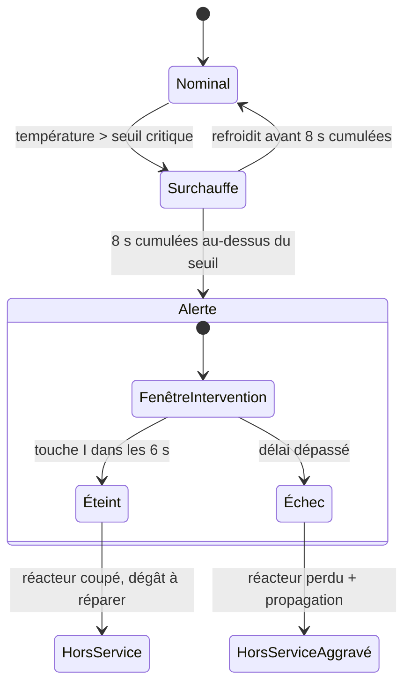
```mermaid
stateDiagram-v2
    [*] --> Nominal
    Nominal --> Surchauffe: température > seuil critique
    Surchauffe --> Nominal: refroidit avant 8 s cumulées
    Surchauffe --> Alerte: 8 s cumulées au-dessus du seuil
    state Alerte {
        [*] --> FenêtreIntervention
        FenêtreIntervention --> Éteint: touche I dans les 6 s
        FenêtreIntervention --> Échec: délai dépassé
    }
    Éteint --> HorsService: réacteur coupé, dégât à réparer
    Échec --> HorsServiceAggravé: réacteur perdu + propagation
```

Trois familles d'incidents partageant un même aval — un dégât à réparer à l'escale suivante :

- **Incendie moteur** (§ ci-dessus) : intervention par la touche `I`, fenêtre de 6 secondes.
- **Pannes diverses** : radar, propulseurs RCS, autopilote — chacune avec son malus propre en vol.
- **Attaques de pirates** : trois profils de menace (navette, intercepteur, croiseur), dialogue à choix (payer / résister / fuir), bordure colorée selon le type d'événement (ambre = panne, rouge = menace hostile).

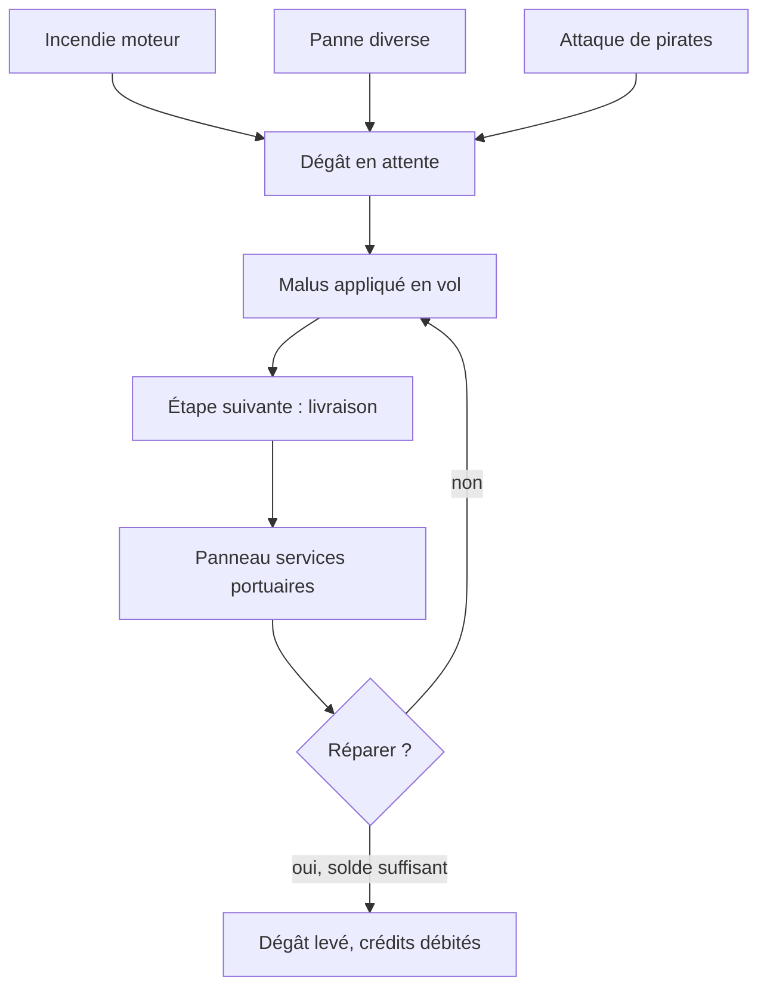
```mermaid
flowchart TD
    F[Incendie moteur] --> D[Dégât en attente]
    P[Panne diverse] --> D
    A[Attaque de pirates] --> D
    D --> M[Malus appliqué en vol]
    M --> N[Étape suivante : livraison]
    N --> S[Panneau services portuaires]
    S --> R{Réparer ?}
    R -->|oui, solde suffisant| Z[Dégât levé, crédits débités]
    R -->|non| M
```

La réparation se propose dans le même panneau « services portuaires » qui gère déjà la dépense de crédits — les deux mécaniques convergent naturellement au même point de la boucle de jeu.

## 14. Dialogues radio générés par IA embarquée (Gemini Nano) — ✅ implémenté

Principe : quand c'est possible, remplacer les dialogues radio générés par gabarits (§7, §13) par une génération dynamique via le LLM embarqué dans Chrome (Gemini Nano, exposé par la *Prompt API*), avec repli automatique et transparent vers le mécanisme existant quand ce LLM n'est pas disponible.

**Ce choix ne trahit pas la philosophie « zéro dépendance externe » du projet** : Gemini Nano tourne **en local dans le navigateur** — aucun appel réseau, aucune clé API, exactement le même principe que `SpeechSynthesis`, déjà utilisé pour la voix (§7). Ce n'est pas un service cloud, c'est une capacité du navigateur.

### 14.1 Détection et repli — implémenté

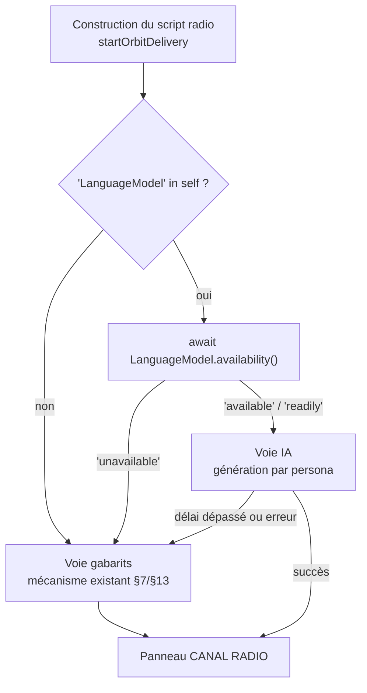
```mermaid
flowchart TD
    A[Construction du script radio<br/>startOrbitDelivery] --> B{"'LanguageModel' in self ?"}
    B -->|non| F[Voie gabarits<br/>mécanisme existant §7/§13]
    B -->|oui| C["await LanguageModel.availability()"]
    C -->|"'unavailable'"| F
    C -->|"'available' / 'readily'"| D[Voie IA<br/>génération par persona]
    D -->|délai dépassé ou erreur| F
    D -->|succès| E[Panneau CANAL RADIO]
    F --> E
```

Écart mineur par rapport à la proposition initiale : la *Prompt API* a changé de nommage entre versions de Chrome (`'readily'/'after-download'/'no'` dans les premières préversions, `'available'/'downloadable'/'downloading'/'unavailable'` ensuite). L'implémentation traite les deux formes comme équivalentes plutôt que de figer un seul nommage, pour rester correcte si l'API évolue encore.

Le texte du gabarit n'est **jamais effacé avant qu'un remplacement confirmé n'arrive** : le script généré par gabarits (§7) reste en mémoire pour chaque réplique et sert directement de repli, sans code de secours séparé à maintenir.

### 14.2 Personæ — une identité par interlocuteur — 2 sur 4 implémentées

Chaque interlocuteur reçoit un profil de personnalité propre (ton, registre de vocabulaire), fourni comme instruction système à sa propre session `LanguageModel` — plutôt qu'un seul modèle générique appelé plusieurs fois.

| Interlocuteur | Registre | État |
|---|---|---|
| Capitaine du cargo | Direct, professionnel, phrases courtes | ✅ implémenté |
| Contrôle du port | Protocolaire, débit posé, formules consacrées | ✅ implémenté |
| Pilotes de navette | Familier, argot de métier, plus bavard | à venir — pas de canal radio dédié aux navettes dans le code actuel |
| *(à venir)* Capitaine pirate | Menaçant ou goguenard selon le profil de menace (§13.3) | à venir — §13.3 non implémenté |

Chaque session est créée une fois puis réutilisée pour toute la partie (pas une session par message) : le profil de personnalité est fixe, seul le contexte transmis dans le prompt utilisateur varie d'un message à l'autre.

### 14.3 Contextes d'usage

| Contexte | État | Section concernée |
|---|---|---|
| Livraison de conteneurs | ✅ implémenté | §7 |
| Pannes et avaries | à venir | §13.1, §13.2 |
| Attaques de pirates | à venir | §13.3 |

### 14.4 Tension avec le déterminisme — tranché : option « accepter l'exception »

Des trois options posées dans la version précédente de ce document, l'implémentation retient la première : **le dialogue reste la seule partie non reproductible de l'univers**, assumé sans conséquence sur le gameplay (décoratif, pas mécanique). Aucun cache par graine n'a été ajouté — ce choix pourra être révisé si un mode « défi seedé » (option 3) voit le jour.

### 14.5 Performance et latence — implémenté, avec une garde supplémentaire

La génération démarre dès la construction du script radio (`startOrbitDelivery`), pour les 12 messages **en parallèle**, bien avant que le premier ne soit dû à l'affichage. Un délai dépassé (2 s, via `Promise.race`) ou une erreur laisse le texte du gabarit en place pour CE message précis, sans abandonner la tentative IA pour les autres messages du même échange.

Ajout non prévu dans la version précédente : un identifiant de génération (`orbitState.radioGen`), incrémenté à chaque nouvelle escale, empêche qu'une réponse tardive d'une escale déjà terminée ou dépassée vienne écraser le script de l'escale en cours — nécessaire dès qu'on enchaîne des livraisons plus vite que les 2 s de délai maximal.

---

## 15. Contrôle tactile pour appareils portables — ✅ implémenté

Le simulateur reposait entièrement sur clavier + souris (§4). Un jeu de contrôles tactiles complet a été ajouté, avec une disposition des panneaux qui s'adapte à un écran plus petit et à son orientation.

### 15.1 Principes directeurs — confirmés à l'implémentation

- Détection par **capacité de pointage** (`matchMedia('(pointer: coarse)')`), pas par taille d'écran — un ordinateur portable dans une petite fenêtre n'active pas les contrôles tactiles.
- Les boutons tactiles pilotent **exactement les mêmes variables** que le clavier (`keys['ArrowUp']`, `keys['KeyE']`, etc.) : aucune logique de vol dupliquée, `updateFlight()` ne voit aucune différence entre les deux moyens de contrôle.
- **Glisser un doigt = regarder autour**, sans modificateur à maintenir — implémenté en distinguant `e.pointerType === 'touch'` dans le gestionnaire de glisser existant, à côté du `CTRL` + souris desktop (inchangé).

### 15.2 Disposition portrait (smartphone) — mise à jour : unifiée avec §12

| Zone tactile | Équivalent clavier/souris | État |
|---|---|---|
| Joystick virtuel (bas gauche) | Flèches / ZQSD — tangage et lacet | ✅ |
| Boutons ⟲ / ⟳ | E / R — roulis | ✅ |
| Bouton BOOST, maintenu | MAJ / ESPACE — propulsion | ✅ |
| Glisser un doigt sur la vue 3D | Glisser la souris — visée fine → devient regard libre au tactile | ✅ |
| Barre d'icônes du HUD (bas, centrée) | `F1`-`F9` + `H` — bascule panneaux, radio, services, caméra, aide (§12) | ✅ |

**Superseded** : le menu ☰ (liste déroulante textuelle) et l'icône radio 📻 séparée, décrits dans une version antérieure de cette section, ont été entièrement retirés et remplacés par la barre d'icônes unifiée du §12 — mêmes boutons qu'au bureau, également en bas (cf. §17.3 pour l'aller-retour sur ce choix de position).

### 15.3 Disposition paysage (tablette) — mise à jour : unifiée avec §12

**Superseded** par l'implémentation de la barre de contrôle du HUD (§12) : l'ancien menu ☰ tactile séparé, décrit dans une version antérieure de cette section, a été entièrement retiré et remplacé par la même barre d'icônes SVG que le bureau — mêmes icônes, même logique d'activation, seule la position change (haut plutôt que bas-gauche, le bas étant occupé par le joystick et les commandes de vol). Voir §12 pour le détail ; cette section n'a donc plus de mécanisme propre à documenter.

### 15.4 Disposition selon l'orientation — implémentée

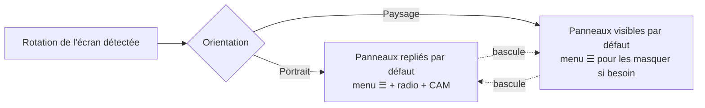
```mermaid
flowchart LR
    A[Rotation de l'écran détectée] --> B{Orientation}
    B -->|Portrait| C[Panneaux repliés par défaut<br/>menu ☰ + radio + CAM]
    B -->|Paysage| D[Panneaux visibles par défaut<br/>menu ☰ pour les masquer si besoin]
    C -.->|bascule| D
    D -.->|bascule| C
```

Recalculée sur `resize` et sur `screen.orientation.change`, sans réinitialiser aucun état de jeu — même principe que le redimensionnement de fenêtre desktop.

### 15.5 Points restant à trancher — état après raffinement (§17.3)

- Mode « une main » (joystick + boost regroupés d'un même côté) : non implémenté.
- ~~Désactivation séparée du glisser-regard~~ : **tranchée** — un bouton dédié (👁), à maintenir enfoncé, conditionne désormais le glisser-regard (§17.3), plutôt qu'un glisser systématique hors des zones de contrôle.
- Gâchette tactile dédiée pour abréger une manœuvre (équivalent ESPACE/ENTRÉE/ÉCHAP) : **volontairement non branchée** sur le bouton BOOST, pour ne pas mélanger propulsion et abrégé de manœuvre sans décision explicite — reste un bouton à ajouter séparément si souhaité.

## 16. Services portuaires — ✅ implémenté

Chantier entièrement absent de la version précédente de cette spec (seul un libellé dans le diagramme du plan d'implémentation, §18). Portée retenue : une **mini-fonction réelle et autonome**, plutôt qu'une coquille vide en attente du système de réparations (§13, toujours non implémenté) — les crédits accumulés n'avaient jusqu'ici aucun débouché.

**Amélioration « Propulseurs »** : jusqu'à 4 niveaux, chacun augmentant la vitesse de croisière effective de 9 % (`effectiveCruiseSpeed() = CRUISE_SPEED_BASE × (1 + niveau × 0,09)`), coût croissant ×1,55 par niveau (départ : 3 200 crédits). Gain permanent, conservé pour toute la partie — remis à zéro uniquement par un retour à l'écran-titre (§11), cohérent avec une nouvelle graine.

**Activation conditionnelle** (demande explicite) : l'icône dédiée de la barre du HUD (§12) reste grisée et inerte sauf si l'une des deux conditions suivantes est vraie, réévaluée en continu :
- une livraison est en cours (`orbitState.active`) ;
- le vaisseau se trouve à moins de 4 rayons planétaires d'une planète-port parmi celles actuellement construites (§2, fenêtre `ensureSystemsBuilt`).

Si la fenêtre se referme pendant que le panneau est ouvert (le vaisseau s'est éloigné), il se referme automatiquement plutôt que de laisser un service désormais inaccessible affiché.

**Positionnement** : empilé directement sous le panneau « objet le plus proche », le canal radio (§7) prenant place sous lui — ordre inversé par rapport à un chevauchement constaté en jeu (voir §17.1).

## 17. Corrections et améliorations (raffinement post-Palier 1)

Lot de corrections et d'améliorations remontées après une première passe de jeu sur le Palier 1. Regroupées ici plutôt que dispersées dans chaque section d'origine, pour garder une trace groupée de ce qui a été observé et corrigé.

### 17.1 Bugs corrigés

**Espacement des planètes et de leurs étoiles.** Les systèmes générés paraissaient trop compacts. Espacement élargi : marge minimale planète-planète (`GAP_MIN`) 260→400, plage additionnelle (`GAP_RANGE`) 360→480, croissance orbitale (`ORBIT_GROWTH`) ×1,55→×1,65, première orbite 550-850→780-1160 unités. **Vitesse de croisière augmentée en proportion** (`CRUISE_SPEED_BASE` 42→56, +33 %) pour que le temps de trajet ne s'allonge pas d'autant — l'un ne va pas sans l'autre, cf. l'historique déjà présent dans le code d'un précédent réglage inverse (systèmes resserrés pour éviter des trajets de ~16 minutes). Revalidé par recherche Monte-Carlo (6 itinéraires, graines aléatoires) : marges de sécurité étoile/planète toujours positives, temps de croisière estimé 4 à 9 minutes.

**Planètes invisibles dans le plan de vol.** Cause : `ensureSystemsBuilt()` ne construisait que l'étape courante et la suivante — toute autre planète listée au plan de vol n'avait tout simplement aucun maillage 3D tant qu'on ne l'atteignait pas. Fenêtre élargie à `[index-1, index, index+1, index+2]`.

**Chevauchement Services portuaires / Canal radio.** Deux causes combinées : (1) les deux panneaux n'étaient repositionnés qu'à l'ouverture, jamais quand le contenu de l'un grandissait ensuite (le journal radio, notamment) — chaque fonction de repositionnement redéclenche désormais l'autre ; (2) l'ordre d'empilement est inversé (services d'abord, radio ensuite), demande explicite.

### 17.2 Améliorations de confort

**Croix de fermeture** sur chaque panneau (y compris canal radio, services portuaires et aide) — un seul gestionnaire délégué (`data-panel-cls` sur chaque bouton) plutôt qu'un écouteur dupliqué par panneau.

**Icône caméra dynamique** : trois symboles distincts selon le mode actif (poursuite / plan-séquence / plans lointains), remplaçant un pictogramme générique unique.

**Aide clavier en overlay centré** (touche `H`) : remplace l'ancienne bande fixe en bas d'écran par un panneau centré, même famille visuelle que le mode Pause (coins ambrés, fond assombri). Contenu généré dynamiquement depuis la liste des boutons du HUD (§12), donc toujours synchronisé avec elle.

**Largeur du panneau « Plan de vol »** réduite de 300 à 230px.

**Message radio de bienvenue** : le capitaine salue l'équipage juste après le calcul de la première route, avant toute escale — même panneau et même voix que le reste du canal radio, pas de mécanisme séparé.

**Avatars dans le canal radio** : silhouette de capitaine (ambre) pour l'équipage, antenne de tour (cyan) pour le contrôle au sol, insérées devant chaque ligne du journal.

**Trajectoire de largage des navettes** repensée en trois temps, plutôt qu'un trajet direct dès l'instant zéro :

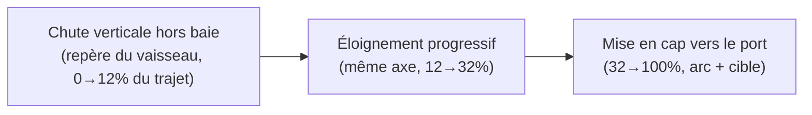
```mermaid
flowchart LR
    A["Chute verticale hors baie<br/>(repère du vaisseau, 0→12% du trajet)"] --> B["Éloignement progressif<br/>(même axe, 12→32%)"]
    B --> C["Mise en cap vers le port<br/>(32→100%, arc + cible)"]
```

Le repère du vaisseau (position/orientation du dock) est réévalué à CHAQUE image durant les deux premières phases : le cargo continue de manœuvrer en orbite pendant toute la séquence, la chute et l'éloignement doivent rester solidaires de sa position réelle, pas d'un instantané figé au largage. Le retour au dock garde le trajet simple d'origine (non concerné par la demande).

**Traînée de propulseur** sur les navettes : polyligne en coordonnées MONDE (ajoutée à la scène, pas au groupe de la navette), fondu obtenu par assombrissement des couleurs en mélange additif plutôt qu'un canal alpha par sommet (non géré simplement par `LineBasicMaterial`).

**Labels + cercle de cible sur les vaisseaux** (cargo et navettes), même vocabulaire visuel que pour étoiles/planètes (cercle + flèche + texte), mais avec une différence de fond : l'anneau est dimensionné **dynamiquement selon la taille apparente à l'écran** (projection du rayon réel via le champ de vision de la caméra), pour réellement entourer l'objet plutôt qu'être une pastille de taille fixe — adapté d'une demande explicite. Troisième teinte (vert) pour les distinguer des étoiles (cyan) et planètes (ambre).

**Rendu d'objet dans le panneau « objet le plus proche »** : une icône canvas 2D (52px), pas un second rendu 3D complet — bien moins coûteux pour une vignette de cette taille. Dégradé teinté par type de planète (palette dédiée par nature : océanique, désertique, glacée, volcanique, continentale, géante gazeuse avec bandes), couleur de corps noir réelle pour les étoiles, dégradé diffus pour les nébuleuses.

### 17.3 Second passage — 4 correctifs supplémentaires

Nouveau lot remonté après une seconde session de jeu sur les livrables ci-dessus.

**Chevauchement des panneaux, cause plus générale que celle déjà corrigée en §17.1.** La colonne de gauche (`hud-left` → `routePanel`) avait, elle, un décalage CSS **fixe** (`top:210px`), jamais recalculé quand `hud-left` change de hauteur réelle (retour à la ligne sur petit écran, panneau masqué via la barre du HUD, changement de langue…) — exactement le même type de défaut que celui déjà réglé pour radio/services, mais resté sur cette colonne. Une fonction unique, `repositionAllPanels()`, regroupe désormais TOUT le repositionnement de la pile de panneaux (mesure du bas réel de chaque ancre, jamais de valeur devinée), appelée à quatre moments : ouverture, bascule d'un panneau (icône, raccourci ou croix de fermeture), redimensionnement de fenêtre, **et** en continu (throttlé à 350ms, dans la boucle de mise à jour du HUD) — ce dernier point pour absorber les variations de hauteur dues au seul contenu (texte de l'objet le plus proche, longueur du plan de vol), qu'aucun événement ponctuel ne capture.

**Bouton de regard tactile rétabli.** Un bouton dédié (icône 👁), à **maintenir enfoncé**, conditionne désormais le glisser-regard sur la vue 3D — équivalent fidèle de CTRL maintenu au clavier, là où un glisser sans modificateur avait cours jusqu'ici (§15.1). Sans le bouton maintenu, un glisser tactile ne fait plus rien : ni pilotage (déjà exclu, le joystick reste la seule commande de vol), ni regard — un glisser accidentel ne peut plus rien déclencher par erreur.

**Barre d'icônes ramenée en bas, y compris au tactile.** Contredit le choix pris en §12/§15.3 (la remonter en haut par contrainte d'espace) — demande explicite de la garder cohérente avec le bureau, quelle que soit la plateforme. Les commandes de pilotage (joystick, roulis, boost, regard) sont décalées plus haut d'une quarantaine de pixels pour lui laisser la place tout en bas, sans se chevaucher.

**Bouton d'aide ajouté à la barre.** Dixième icône (point d'interrogation), ouvrant le même panneau overlay déjà en place (titre + croix de fermeture, §17.2) — jusqu'ici accessible uniquement par la touche `H`, sans bouton pour la découvrir. Cas particulier dans l'affectation automatique des raccourcis : garde `H` plutôt que le `F10` qui lui reviendrait par la logique habituelle (un F par bouton, dans l'ordre), pour ne pas entrer en conflit avec la coupure de voix déjà sur `F10`.

**Robustesse trouvée en testant** (sans lien avec une demande explicite, mais corrigée au passage) : `setPointerCapture()` peut lever une exception dans certains cas limites (pointeur déjà relâché, multi-doigts) — non interceptée, elle interrompait le reste du gestionnaire avant la mise à jour de l'état du bouton. `try/catch` défensif ajouté sur les trois boutons tactiles maintenus (roulis, boost, regard).

## 18. Plan d'implémentation

Le **palier 0** de la spécification précédente (six étapes sans dépendance) et le **palier 1** (mode Pause, barre du HUD, services portuaires) sont désormais **entièrement livrés**, avec en prime un lot de corrections et d'améliorations de confort (§17). Les paliers suivants restent à faire.

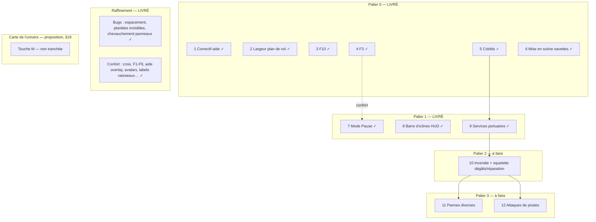
```mermaid
flowchart TD
    subgraph L0["Palier 0 — LIVRÉ"]
        A1[1 Correctif aide ✓]
        A2[2 Largeur plan de vol ✓]
        A3[3 F10 ✓]
        A4[4 F3 ✓]
        A5[5 Crédits ✓]
        A6[6 Mise en scène navettes ✓]
    end
    subgraph L1["Palier 1 — LIVRÉ"]
        B7[7 Mode Pause ✓]
        B8[8 Barre d'icônes HUD ✓]
        B9[9 Services portuaires ✓]
    end
    subgraph L1B["Raffinement — LIVRÉ"]
        R1[Bugs : espacement, planètes invisibles, chevauchement panneaux ✓]
        R2[Confort : croix, F1-F9, aide overlay, avatars, labels vaisseaux… ✓]
    end
    subgraph L2["Palier 2 — à faire"]
        C10[10 Incendie + squelette dégâts/réparation]
    end
    subgraph L3["Palier 3 — à faire"]
        D11[11 Pannes diverses]
        D12[12 Attaques de pirates]
    end
    subgraph LM["Carte de l'univers — proposition, §19"]
        M[Touche M — non tranchée]
    end
    A4 -.->|confort| B7
    A5 --> B9
    B9 --> C10
    C10 --> D11
    C10 --> D12
```

Économie de la boucle de jeu — les crédits ont maintenant un vrai débouché (§16) en plus de la future réparation :

## 19. Carte de l'univers — proposition (touche M, non implémentée)

Demande explicite : un aperçu de l'univers en overlay, activable par `M`. Contrairement aux autres chantiers de cette session, celui-ci n'a **pas** été implémenté — trop structurant pour être improvisé en fin de liste, il mérite son propre cycle proposition→validation. Trois pistes, avec leur coût/effort/valeur :

| Option | Effort | Valeur | Détail |
|---|---|---|---|
| **A — Carte 2D schématique, non navigable** | Faible | Moyenne | Projection orthographique du plan de vol connu (étapes visitées + à venir) sur un plan 2D façon plan de métro, système actuel mis en évidence. Aucune interaction au-delà d'afficher/masquer. Rapide à livrer, mais ne montre que ce qui est déjà dans le plan de vol — aucune découverte. |
| **B — Carte 3D navigable, caméra libre** *(meilleur rapport valeur/coût)* | Moyen | Haute | Vue d'ensemble en 3D (caméra orbitale indépendante de celle du jeu) de tous les systèmes déjà rencontrés/construits, avec zoom/rotation à la souris. Réutilise largement le rendu existant (mêmes maillages d'étoiles simplifiés) plutôt que d'inventer une représentation à part — coût contenu. Donne une vraie impression d'échelle et d'exploration. |
| **C — Carte galactique procédurale complète** | Élevé | Incertaine | Génère et affiche une région bien plus large que ce qui a été réellement visité (au-delà des systèmes construits). Séduisant sur le papier, mais soulève des questions non triviales : jusqu'où générer sans détruire la surprise de la découverte ? Coût de génération à grande échelle non négligeable pour un simple overlay. |

**Recommandation** : option B — meilleur résultat visuel pour un coût modéré, cohérente avec le reste du jeu (pas de nouveau moteur de rendu à part), et laisse la porte ouverte à une évolution vers l'option C plus tard si souhaité.

**Questions avant implémentation :**
- La carte doit-elle marquer uniquement les systèmes déjà construits (§2, `ensureSystemsBuilt`), ou tout le plan de vol prévu même non encore atteint ?
- Doit-on pouvoir cliquer un système sur la carte pour en voir le détail (planètes, port), ou rester à l'échelle « constellation » ?
- La carte se ferme-t-elle comme l'aide (`M` à bascule) ou met-elle le jeu en pause (§11) le temps de la consulter ?

## 20. Référence — tous les raccourcis clavier

| Touche | Action | État |
|---|---|---|
| `↑ ↓ ← →` / `ZQSD` / `WASD` | Orientation | actuel |
| `E` / `R` | Roulis | actuel |
| `MAJ` / `ESPACE` | Propulsion | actuel |
| Glisser la souris | Visée fine | actuel |
| `CTRL` + glisser | Regard libre | actuel |
| `CTRL` (appui court) | Recentre le regard libre | actuel |
| `F1` à `F6` | Bascule chacun des 6 panneaux d'info du HUD | **actuel** |
| `F7` | Affiche/masque le canal radio (remplace `TAB`, conservée en alias) | **actuel** |
| `F8` | Ouvre/ferme les services portuaires (§16) — inerte hors zone/livraison | **actuel** |
| `F9` | Mode de caméra suivant (remplace l'ancien `F3`) | **actuel** |
| `TAB` | Affiche/masque le canal radio (alias historique de `F7`) | actuel |
| `H` | Ouvre/ferme l'aide en overlay centré (§17.2) | **actuel** |
| `F10` | Coupe/rétablit la voix de synthèse | actuel |
| `ESPACE` / `ENTRÉE` | Abrège la manœuvre d'approche · Reprend depuis la pause | **actuel** |
| `ÉCHAP` / `P` / `PAUSE` | Met le jeu en pause (§11) | **actuel** |
| `ÉCHAP` (en pause) | Retour à l'écran-titre, rechargement complet | **actuel** |
| `M` | Carte de l'univers | proposition, non tranchée (§19) |
| `I` | Intervenir sur un incendie moteur | à venir (§13) |

### Touches à sens multiple

| Touche | Sens selon le contexte |
|---|---|
| `ESPACE` | Propulsion (croisière) · Abrégé (approche) · Reprise (pause) |
| `ÉCHAP` | Met en pause · Retour à l'écran-titre (si déjà en pause) — **ne fait plus jamais office d'abrégé**, rôle retiré pour éliminer tout conflit avec la pause |
| `CTRL` | Regard libre si maintenu et glissé · Recentrage si appui court seul |
