# Space Travel & Transport — Specification v2.5

**Format:** Markdown with screenshots, SVG diagrams and mermaid diagrams **embedded directly in the file** (base64 images) — a single `.md` file, no companion folder required.

**What's changed since v2.0** (DOCX): several developments described there as mere proposals are now **actually implemented and verified** in `space-travel.html` — the credits system, the F3/F10 shortcuts, the widened flight-plan panel, the roll fix, and above all the cinematic staging of the shuttles with a physical dock under the ship and a textured hull dressing. Like v2.0, this document clearly separates what exists (Part I) from what remains to be built (Part II) — but the boundary between the two has shifted.

## Revision History

| Version | Date | Author | Content |
|---|---|---|---|
| 2.0 | September 13, 2026 | Frédéric Delorme | Initial specification (DOCX): overview, procedural universe, ship, controls, navigation, planetary systems, arrival sequence, HUD, architecture, i18n. |
| 2.1 | September 16, 2026 | Frédéric Delorme | Converted to standalone Markdown (embedded images). Added proposals §14 (radio dialogues via embedded AI, Gemini Nano) and §15 (touch controls), then implemented and verified both. Fixes: dock flickering (z-fighting), off-center/shaky shuttle-launch camera, orbit insertion too fast, cargo trajectory able to pass through celestial bodies. |
| 2.2 | September 16–17, 2026 | Frédéric Delorme | Tier 1 delivered: Pause mode (§11), HUD control bar (§12), port services (§16, new). First batch of fixes (systems spaced too tightly, planets missing from flight plan, radio/services overlap). |
| 2.3 | September 17, 2026 | Frédéric Delorme | Second batch of fixes and improvements (§17): bugs (general panel overlap, touch look gone missing, icon-bar position, missing help button) and polish (close buttons, F1-F9+H shortcuts, dynamic camera icon, overlay help, radio welcome message, avatars, 3-phase shuttle launch trajectory, thruster trail, ship labels, object rendering in the "nearest object" panel). Proposal (not implemented) for the universe map (§19). |
| 2.4 | September 17, 2026 | Frédéric Delorme | Touch look icon replaced with a camera icon. Two new panels (§21): visual **itinerary** (bottom right) — green/blue step track with a continuous position dot — and **orientation relative to a Lagrange point** (bottom left) — compass + distance. Two extra HUD icons, fixed shortcuts `I`/`L`. Screenshots not fully redone this time; a single screenshot added (§21) for the two new panels. |
| 2.5 | September 18, 2026 | Frédéric Delorme | Three new proposals, not implemented — each deserving its own validation cycle before being built, like the universe map once did. **Fuel** (§22): gauge, consumption tied to engine regime, refueling at stopovers, initial quantities sized against the route generator's real constants. **Quantum propulsion and star map** (§23): purchase at a stopover of a jump module, destination selected on the universe map — the latter's design finally settled (option B from §19, now serving double duty). **Orbital ports** (§24): a second port type, in orbit rather than on the ground, a small number of 3D mockups instanced across certain systems. Key conflict `I`/§13 (flagged in v2.4) resolved: engine fire moved to `J`. |

---

## Table of Contents

**Part I — Current state of the simulator**
- [1. Overview](#1-overview)
- [2. Procedural universe](#2-procedural-universe)
- [3. The ship](#3-the-ship)
- [4. Flight controls and camera](#4-flight-controls-and-camera)
- [5. Navigation — flight plan](#5-navigation--flight-plan)
- [6. Planetary systems](#6-planetary-systems)
- [7. Arrival sequence: orbit, shuttles, credits](#7-arrival-sequence-orbit-shuttles-credits)
- [8. Interface (HUD)](#8-interface-hud)
- [9. Technical architecture](#9-technical-architecture)
- [10. Internationalization](#10-internationalization)

**Part II — Remaining developments to implement**
- [11. Pause mode — ✅ implemented](#11-pause-mode--implemented)
- [12. HUD control bar — ✅ implemented](#12-hud-control-bar--implemented)
- [13. Random events and repairs](#13-random-events-and-repairs)
- [14. Radio dialogues generated by embedded AI (Gemini Nano) — ✅ implemented](#14-radio-dialogues-generated-by-embedded-ai-gemini-nano--implemented)
- [15. Touch controls for mobile devices — ✅ implemented](#15-touch-controls-for-mobile-devices--implemented)
- [16. Port services — ✅ implemented](#16-port-services--implemented)
- [17. Fixes and improvements (post-Tier-1 refinement)](#17-fixes-and-improvements-post-tier-1-refinement)
- [18. Implementation plan](#18-implementation-plan)
- [19. Universe map — proposal (not implemented)](#19-universe-map--proposal-m-key-not-implemented)
- [20. Reference — all keyboard shortcuts](#20-reference--all-keyboard-shortcuts)
- [21. Visual itinerary and Lagrange point — ✅ implemented](#21-visual-itinerary-and-lagrange-point--implemented)
- [22. Fuel and consumption](#22-fuel-and-consumption)
- [23. Quantum propulsion and star map](#23-quantum-propulsion-and-star-map)
- [24. Orbital ports](#24-orbital-ports)

---

# Part I — Current state of the simulator

## 1. Overview

Procedural space-flight simulator, shipped as **a single self-contained HTML file** (Three.js r128, WebGL, no build step). A cargo ship pilots automatically — or manually — from system to system, delivers its cargo by shuttle at each stopover, exchanges radio traffic with port control, earns credits, and continues its route through a universe generated entirely from a single seed. Interface available in French, English, German and Spanish, chosen on the title screen.


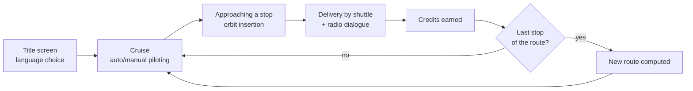

## 2. Procedural universe

Everything — stars, nebulae, planetary systems, names — derives from a single seed (`SEED`) via dedicated pseudo-random generators. Replaying the same seed reproduces exactly the same universe.

- **Stars** physically modeled: spectral classes (Salpeter fractions), color by Planckian locus, luminosity/mass/radius from astrophysical laws, apparent magnitude computed from distance.
- **Nebulae** procedural (4-channel fBm noise), fading in gradually to avoid any visual "pop" effect.
- **Designation labels**: targeting circle + arrow, for stars, planets and moons — a visual vocabulary consistent across the whole HUD.


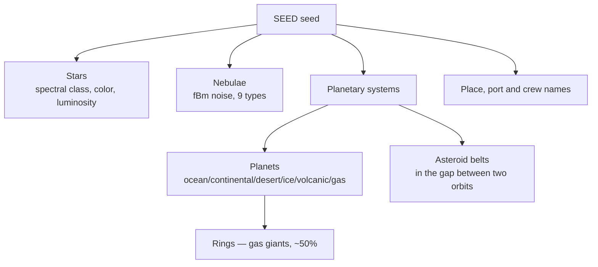

## 3. The ship

Low-poly container ship in two blocks: an open-frame cargo pod at the front, connected by a spine to a massive rear propulsion block carrying the bridge and a cluster of four engines.


**New in v2.1 — hull dressing.** The four materials reused throughout the ship (hull, deck, dark panels, frames) now carry a procedural, canvas-generated texture — a grid of panels with a slightly detuned tint, marked seams, scattered greebles (hatches, vents), occasional yellow/black hazard stripes. Inspired by *Homeworld*-style cargo ships, with no dependency on an external image: consistent with the rest of the file, which already generates its ring and planet textures the same way. One texture per material is enough to dress the whole silhouette; the shuttles have their own texture, generated once at load time rather than on every launch.

**New in v2.1 — shuttle dock.** A blue-lit bay, jutting out under the rear (propulsion) block — not under the cargo pod, where it would have ended up hidden by the bulk of the containers. Well + metal frame + emissive surface + double additive halo (tight core, wide glow) + a short-range point light that actually lights up the surrounding hull, with a gentle breathing pulse rather than a blink. Shuttles genuinely launch from this point, not from the ship's center.

## 4. Flight controls and camera

| Key | Action |
|---|---|
| `↑ ↓ ← →` / `Z Q S D` (AZERTY) / `W A S D` (QWERTY) | Orientation |
| `E` / `R` | Roll *(fixed in v2.1 — the help panel mistakenly showed `A / E`)* |
| `SHIFT` or `SPACE` | Thrust (boost) |
| Mouse drag | Fine aim |
| `CTRL` + drag | Free look |
| `F3` | Next camera mode *(new in v2.1)* |

**New in v2.1 — F3.** Switching camera mode (standard chase → cinematic tracking shot → distant shots) is now a single press of `F3`, replacing the old double/triple-press-on-`CTRL` mechanism. The latter — sensitive to rendering conditions during its initial validation — was **removed entirely** rather than patched: `CTRL` regains a single role (free look while dragging, recentering on a short press), with no timer needed to distinguish one, two or three presses.

## 5. Navigation — flight plan


**Fix v2.1 — panel width.** Measured in the code: the panel was only 230px wide, with number/name/star designation on a single line — well short of what generated port names need, causing frequent truncation. Two combined adjustments: moderate widening to 300px, **and** a switch to a two-line-per-step layout (name at full width, star designation below, dimmed). Truncation remains as a safety net for the rare names still too long.

**Revision v2.3 — back to 230px.** Explicit request to narrow the panel. Reverting to the original width did **not** reintroduce the truncation problem v2.1 had fixed: it was the switch to the two-line layout, kept intact, that did the real work (an overly long name gets its own line rather than being squeezed next to the number and designation). Width alone was only one of the two levers.

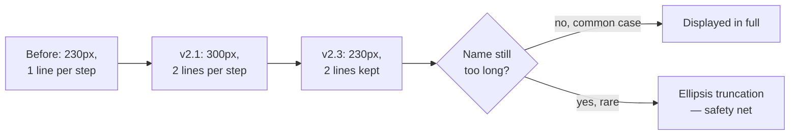

The route is planned via a Catmull-Rom curve passing through each star and then each target planet, with two safety passes that steer clear of any planet — targeted or not — that would otherwise end up too close to the path (verified collision-free across 150 randomly generated routes).


## 6. Planetary systems


- 2 to 3 planets per system, one habitable (space port).
- Orbital spacing in geometric growth (Titius-Bode spirit), with a mathematical guarantee of zero overlap regardless of orbital angle.
- Rings on ~50% of gas giants; asteroid fields placed in the **gap** between two orbits, never on a planet's orbit.


## 7. Arrival sequence: orbit, shuttles, credits

At every stop (not just the last), the ship slows on approach, enters orbit, and delivers its cargo.


*Shuttle in flight with its thruster trail (§17.2) aligned to its actual direction of travel — not to its nose orientation, which can diverge during the curved approach phase. Port services panel (§16) open in the foreground.*

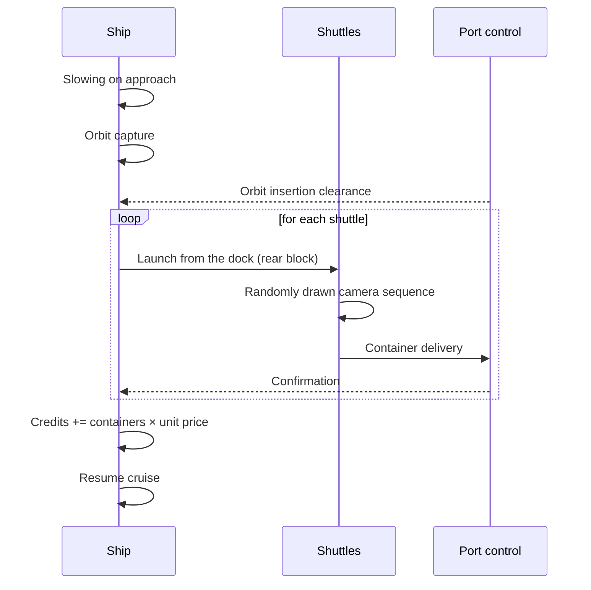

**New in v2.1 — shuttle staging.** A catalogue of four shot sequences, drawn at random on each launch (seeded, so reproducible for a given seed):

| Sequence | Initial close-up | Then |
|---|---|---|
| Close lateral | Dock seen from the side, low angle | Hard cut to a distant tracking shot |
| Head-on | The shuttle comes straight at the camera | Wide lateral tracking shot, the port enters frame |
| Continuous tracking | Dock in close-up | Gradual pull-back, no cut at all |
| Over the shoulder | Dock in close-up | Fixed shot, locked to the ship |

The hard cut (for the first three sequences) was verified by direct instrumentation: a camera jump of more than 120 units in a single frame, exactly at the intended moment — not a gradual fade.

**New in v2.1 — credits.** 1 to 5 containers drawn per stop, split across the shuttles actually launched — and this same split feeds the radio dialogue, so the crew never announces a number unrelated to what's actually credited. Payout happens the moment the last container lands. Starting balance of 10,000 credits, shown in the top bar to the left of `SEED`.


*Stacking order reversed in v2.3 (§17.1): port services (§16) now sit between "nearest object" and the radio channel, rather than the reverse — a dynamic overlap had been spotted in the old order.*

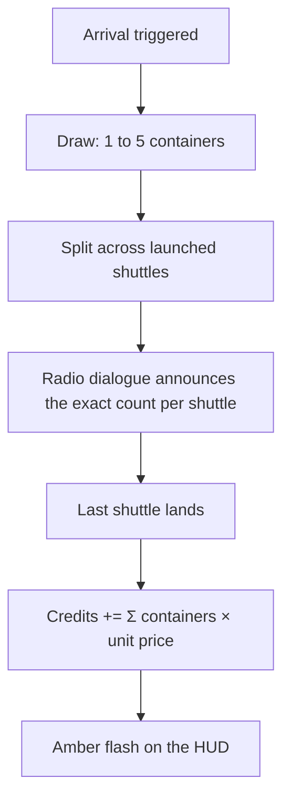

The radio channel combines text dialogue and speech synthesis (voice randomly drawn male/female for each speaker), with synthesized beeps as each message appears.


## 8. Interface (HUD)


Panels: Speed/Sector/Heading, Flight plan, Nearest object, Engine temperature, Propulsion, Engine commands, Radio channel (toggle `TAB`). Keyboard help (`H`) kept up to date with all current shortcuts, including `F3`/`F10`.

## 9. Technical architecture

### 9.1 The seed generator

The whole universe — stars, nebulae, planetary systems, place names — derives from a single starting value, the seed (`SEED`), through a two-stage mechanism: a string hash (`xmur3`) that turns a **text tag** into a 32-bit integer, followed by a fast pseudo-random generator (`mulberry32`) that turns that integer into a reproducible stream of numbers.

**Why two stages, not a single global stream.** A single generator advanced sequentially would make every draw depend on everything drawn before it — the same star cell would yield a different star depending on whether it's reached directly or after a long detour, since the generator wouldn't have consumed the same number of values along the way. The game needs the opposite: a planet, a star or a name must always be **the same**, regardless of the order in which the player explores the universe — a condition essential for sliding-window generation (§2), which never builds the whole universe at once.

The fix: every generated element gets its own unique, descriptive text tag (for example `SEED+':route:3'` for a route's 4th step, or a combination of cell coordinates for a star), which feeds an **independent, replayable-at-will** number stream:

```
rngFor(tag) = mulberry32( xmur3(tag)() )
```

**First stage — `xmur3`, an avalanche hash.** A function borrowed from the MurmurHash3 family, it turns a character string into a 32-bit integer by mixing in each character in turn:

```
h₀ = 1779033703 ⊕ length(string)
hᵢ = rot13( (hᵢ₋₁ ⊕ code(cᵢ)) × 3432918353  mod 2³² )
```

where `rot13` is a 13-bit bitwise rotation and `×` a 32-bit multiplication (`Math.imul`). A finishing pass — three rounds of shift/XOR/multiply by odd constants — guarantees that changing a single character of the tag, even a single bit, flips on average half the bits of the result (the avalanche property): a necessary condition for two neighboring tags (`':route:3'` and `':route:4'`) to produce seeds with no perceptible correlation.

**Second stage — `mulberry32`, the actual generator.** Starting from the integer produced by `xmur3`, each call advances the state by a simple increment:

```
aₙ₊₁ = aₙ + 0x6D2B79F5   (mod 2³²)
```

then derives a floating-point number through a combination of shifts and multiplications (the "scrambling" step):

```
t = (aₙ₊₁ ⊕ (aₙ₊₁ ≫ 15)) × (aₙ₊₁ | 1)
t = (t + ((t ⊕ (t ≫ 7)) × (t | 61))) ⊕ t
output = (t ⊕ (t ≫ 14)) / 2³²
```

The increment alone would already be enough to cycle through all 2³² possible values without ever repeating before the end of the period — 0x6D2B79F5 is odd, which mathematically guarantees a full cycle. The scrambling exists purely to distribute those values statistically, not to avoid repeats. Mulberry32 is deliberately chosen for its simplicity (a handful of integer operations, no dependencies) rather than for cryptographic quality that would be wasted here: good enough that no visual pattern is perceptible in a star field or a planet distribution, nowhere near enough for a use case that needs genuine unpredictability.

**Practical consequence.** Replaying the same seed (`SEED`) reproduces exactly the same universe, down to the last pebble in an asteroid field — the seed itself is just one more ingredient in the tags fed to `rngFor`, never consumed directly.

### 9.2 Architecture diagrams


## 10. Internationalization

French, English, German, Spanish — an `I18N` dictionary covering HUD labels, radio dialogue templates (parameterized, not hardcoded strings), and the speech-synthesis language. Chosen once on the title screen, applied for the whole session.

---

# Part II — Remaining developments to implement

The following efforts remain at the specification stage: they are **not** present in today's shipped file.

## 11. Pause mode — ✅ implemented

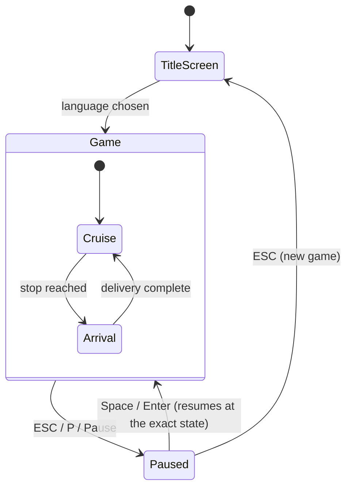

`ESC`, `P` or `PAUSE` freezes the simulation entirely (route, rotation, temperatures, shuttles) and suspends speech synthesis without cancelling it (`speechSynthesis.pause()`, not `cancel()`). `SPACE`/`ENTER` resumes exactly where the game left off; `ESC` from pause returns to the title screen.

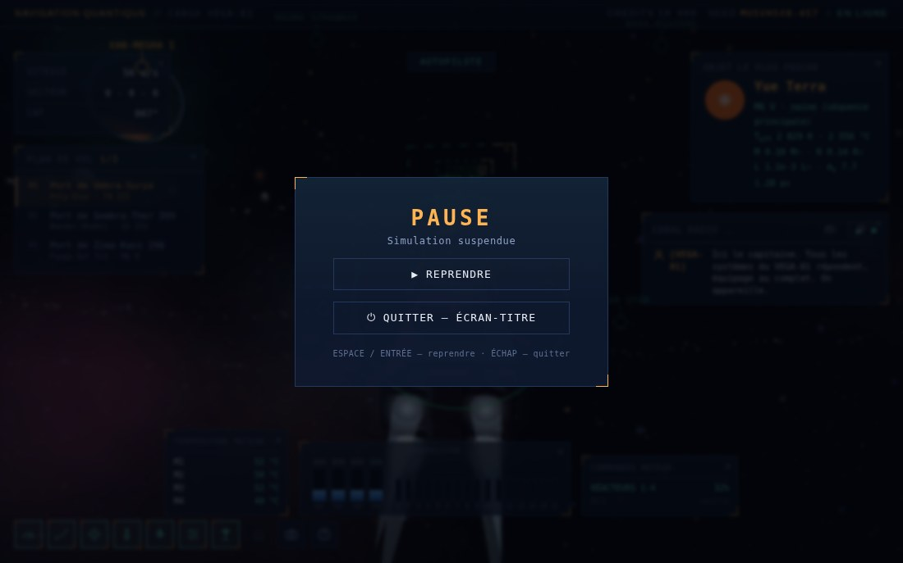

**Differences from the previous version of this spec:**
- **No renaming** of `ARRIVAL_PAUSE`/`paused`: the confusion risk flagged was real but purely documentary (distinct JS scopes, no actual conflict) — a new, unambiguously named flag (`gamePaused`) was enough, at far lower cost and regression risk than a rename touching the whole file.
- **`ESC` no longer ever acts as a maneuver skip** (a role it used to share with `SPACE`/`ENTER`) — removed from that role to eliminate any conflict with pause, which becomes its sole function, in every game phase without exception.
- **No confirmation before quitting**: `ESC` while paused reloads the page immediately (a deliberate choice — see below).
- Returning to the title screen is a **full page reload** (`location.reload()`), rather than manually resetting dozens of interdependent global variables (`ROUTE`, `orbitState`, credits, ship orientation, propulsion upgrade level…) — this guarantees a clean state and a fresh seed (`SEED` derives from `Date.now()`) with no risk of missing one. Accepted consequence: the upgrade level bought at port services (§16) also resets to zero, consistent with "new game."

## 12. HUD control bar — ✅ implemented

An SVG icon bar, generated dynamically from a single list (`HUD_BAR_ITEMS`) — desktop and touch share exactly the same toggle mechanism, the same icons and the same activation logic, only the position differs.

- **Desktop**: fixed at the bottom left, always visible, as originally planned.
- **Touch**: also at the bottom, centered — flight controls (joystick, roll, boost, free look) are shifted up to make room for it (§15). *Briefly moved to the top for lack of space, moved back down on explicit request — see §17.3.* Fully replaces the old touch ☰ menu (text dropdown list), now unified with this same bar.
- **12 buttons, not 8**: the six info panels, the radio channel, the camera (`F3` originally) — plus **port services** (§16, icon greyed out/inert outside its activation window), **help** (§17.3), and, since v2.4, the **itinerary** and **Lagrange point** (§21).
- **Shortcuts `F1` to `F9`**, one per button in display order, except help (`H`), itinerary (`I`) and Lagrange point (`L`), which keep fixed keys rather than an automatic F-slot. Replaces the old dedicated assignment of `F3` to the camera (now `F9`, like the others). See §20 for detail.
  > **Implementation note (v2.4)**: these F1-F9 shortcuts are dispatched by POSITION in the `HUD_BAR_ITEMS` array, not by matching each entry's `hotkey` property — an addition inserted before `radio`/`port`/`camera` would silently shift F7-F9 onto the wrong actions. For this reason, fixed-key entries (`H`, then `I`/`L`) are always added *after* the first nine.
- Unified visibility mechanism: a single class, `.panel-hidden`, added to hide a panel — works identically on click, from the keyboard (`F1`-`F9`) and via each panel's close button (§17.2). In touch portrait, the six panels other than the radio channel are pre-hidden at startup (no room to keep them all open at once); in landscape and on desktop, they start visible.

## 13. Random events and repairs

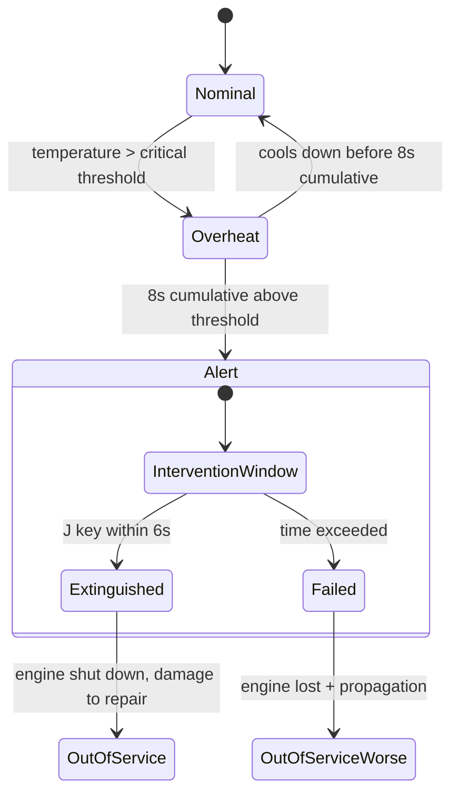

Three families of incidents sharing a common downstream path — damage to repair at the next stopover:

- **Engine fire** (see above): intervention via the `J` key (moved from `I`, taken by the itinerary — §20, §21), 6-second window.
- **Various failures**: radar, RCS thrusters, autopilot — each with its own in-flight penalty.
- **Pirate attacks**: three threat profiles (shuttle, interceptor, cruiser), branching dialogue (pay / resist / flee), border color coded by event type (amber = failure, red = hostile threat).

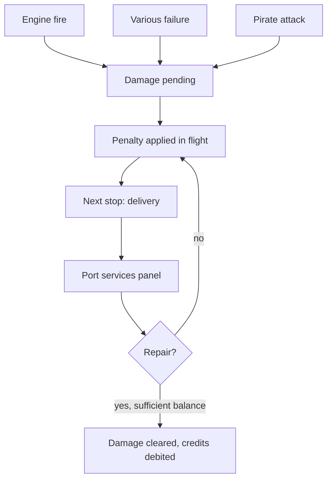

Repairs are offered in the same "port services" panel that already handles spending credits — the two mechanics naturally converge at the same point in the game loop.

## 14. Radio dialogues generated by embedded AI (Gemini Nano) — ✅ implemented

Principle: where possible, replace template-generated radio dialogues (§7, §13) with dynamic generation via the LLM embedded in Chrome (Gemini Nano, exposed through the *Prompt API*), with automatic, transparent fallback to the existing mechanism when that LLM isn't available.

**This choice does not betray the project's "zero external dependency" philosophy**: Gemini Nano runs **locally in the browser** — no network call, no API key, exactly the same principle as `SpeechSynthesis`, already used for voice (§7). It's not a cloud service, it's a browser capability.

### 14.1 Detection and fallback — implemented

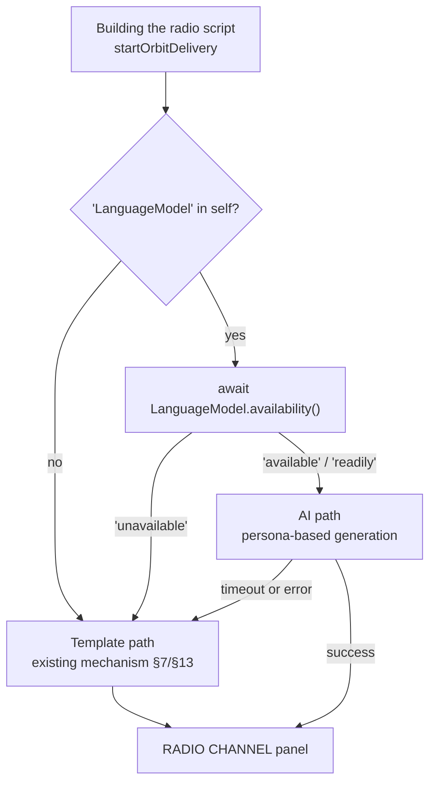

Minor deviation from the initial proposal: the *Prompt API* changed its naming between Chrome versions (`'readily'/'after-download'/'no'` in early previews, `'available'/'downloadable'/'downloading'/'unavailable'` afterward). The implementation treats both forms as equivalent rather than locking onto a single naming scheme, to stay correct if the API changes again.

Template text is **never cleared before a confirmed replacement arrives**: the template-generated script (§7) stays in memory for each line and serves directly as the fallback, with no separate backup code to maintain.

### 14.2 Personas — one identity per speaker — 2 of 4 implemented

Each speaker gets its own personality profile (tone, vocabulary register), supplied as a system instruction to its own `LanguageModel` session — rather than a single generic model called repeatedly.

| Speaker | Register | Status |
|---|---|---|
| Cargo captain | Direct, professional, short sentences | ✅ implemented |
| Port control | Formal, measured pace, set phrases | ✅ implemented |
| Shuttle pilots | Casual, trade slang, chattier | pending — no dedicated shuttle radio channel in the current code |
| *(pending)* Pirate captain | Threatening or mocking depending on the threat profile (§13.3) | pending — §13.3 not implemented |

Each session is created once and reused for the whole game (not one session per message): the personality profile is fixed, only the context passed in the user prompt changes from one message to the next.

### 14.3 Usage contexts

| Context | Status | Related section |
|---|---|---|
| Container delivery | ✅ implemented | §7 |
| Failures and damage | pending | §13.1, §13.2 |
| Pirate attacks | pending | §13.3 |

### 14.4 Tension with determinism — settled: the "accept the exception" option

Of the three options laid out in the previous version of this document, the implementation keeps the first: **dialogue remains the only non-reproducible part of the universe**, accepted as having no effect on gameplay (decorative, not mechanical). No per-seed cache was added — this choice may be revisited if a seeded "challenge mode" (option 3) ever comes about.

### 14.5 Performance and latency — implemented, with an added safeguard

Generation starts as soon as the radio script is built (`startOrbitDelivery`), for all 12 messages **in parallel**, well before the first one is due to display. A timeout (2s, via `Promise.race`) or an error leaves the template text in place for THAT specific message, without abandoning the AI attempt for the other messages in the same exchange.

Addition not planned in the previous version: a generation id (`orbitState.radioGen`), incremented on every new stopover, prevents a late response from an already-finished or superseded stopover from overwriting the script of the current one — necessary as soon as deliveries chain faster than the 2s maximum delay.

---

## 15. Touch controls for mobile devices — ✅ implemented

The simulator relied entirely on keyboard + mouse (§4). A full set of touch controls has been added, with a panel layout that adapts to a smaller screen and its orientation.

### 15.1 Guiding principles — confirmed during implementation

- Detection by **pointer capability** (`matchMedia('(pointer: coarse)')`), not screen size — a laptop in a small window doesn't trigger touch controls.
- Touch buttons drive **exactly the same variables** as the keyboard (`keys['ArrowUp']`, `keys['KeyE']`, etc.): no duplicated flight logic, `updateFlight()` sees no difference between the two control methods.
- **Drag a finger = look around**, no modifier to hold — implemented by branching on `e.pointerType === 'touch'` in the existing drag handler, alongside desktop `CTRL` + mouse (unchanged).

### 15.2 Portrait layout (smartphone) — updated: unified with §12

| Touch zone | Keyboard/mouse equivalent | Status |
|---|---|---|
| Virtual joystick (bottom left) | Arrows / ZQSD — pitch and yaw | ✅ |
| ⟲ / ⟳ buttons | E / R — roll | ✅ |
| BOOST button, held | SHIFT / SPACE — thrust | ✅ |
| 👁 button, held | CTRL + drag — free look *(§17.3: no longer automatic)* | ✅ |
| Drag a finger on the 3D view | Mouse drag — fine aim → free look ONLY while 👁 is held | ✅ |
| HUD icon bar (bottom, centered) | `F1`-`F9` + `H` — toggles panels, radio, services, camera, help (§12) | ✅ |

**Superseded**: the ☰ menu (text dropdown list) and the separate 📻 radio icon, described in an earlier version of this section, have been fully removed and replaced by the unified icon bar from §12 — same buttons as on desktop, also at the bottom (see §17.3 for the back-and-forth on this positioning choice).

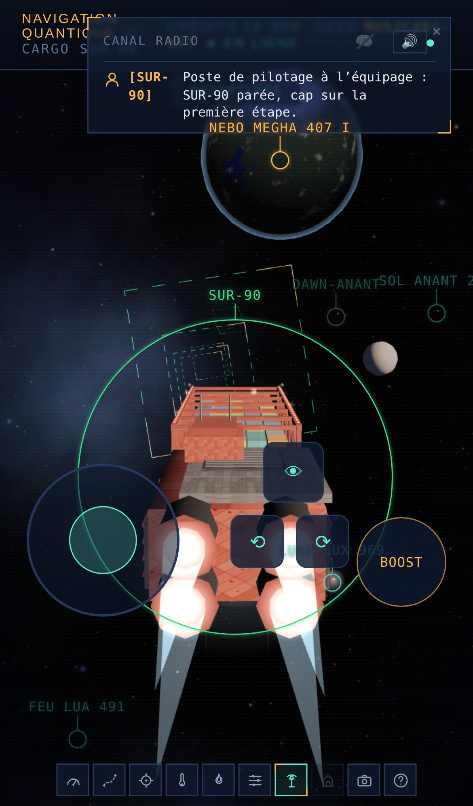

*Captured under Chromium device emulation (iPhone 13, touch). Shows the full set of flight controls (joystick, roll, boost, 👁 look) and the HUD icon bar along the bottom, plus the radio welcome message and a ship label with its target ring.*

### 15.3 Landscape layout (tablet) — updated: unified with §12

**Superseded** by the HUD control bar implementation (§12): the old separate touch ☰ menu, described in an earlier version of this section, has been fully removed and replaced by the same SVG icon bar as desktop — same icons, same activation logic. Its position changed twice along the way (top, then back to the bottom — §17.3); it now stays aligned with desktop in both orientations.

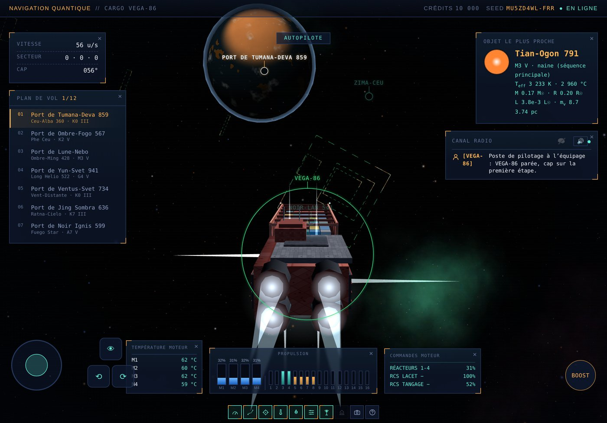

*Captured under Chromium device emulation (iPad Pro 11", touch, landscape). Info panels stay visible by default in this orientation (more room than portrait); flight controls occupy the bottom of the screen, the HUD icon bar centered beneath them.*

### 15.4 Orientation-based layout — implemented

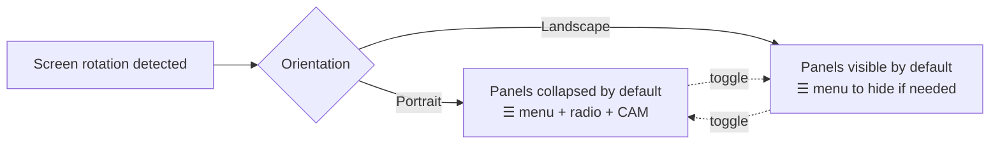

Recomputed on `resize` and on `screen.orientation.change`, without resetting any game state — same principle as desktop window resizing.

### 15.5 Points still to be settled — status after refinement (§17.3)

- One-handed mode (joystick + boost grouped on the same side): not implemented.
- ~~Separate toggle for drag-to-look~~: **settled** — a dedicated button (👁), held down, now gates drag-to-look (§17.3), rather than an unconditional drag outside the control zones.
- Dedicated touch trigger to skip a maneuver (equivalent of SPACE/ENTER/ESC): **deliberately not wired** to the BOOST button, to avoid mixing thrust and maneuver-skip without an explicit decision — remains a button to add separately if wanted.

## 16. Port services — ✅ implemented

An area entirely absent from the previous version of this spec (just a label in the implementation-plan diagram, §18). Scope chosen: a **real, self-contained mini-feature**, rather than an empty shell waiting on the repair system (§13, still not implemented) — accumulated credits had no outlet until now.

**"Thrusters" upgrade**: up to 4 levels, each increasing effective cruise speed by 9% (`effectiveCruiseSpeed() = CRUISE_SPEED_BASE × (1 + level × 0.09)`), cost growing ×1.55 per level (starting at 3,200 credits). Permanent gain, kept for the whole game — reset only by returning to the title screen (§11), consistent with a new seed.

> **Two new services proposed (v2.5, not implemented)**: this panel is now also the natural place for two further purchases, each detailed in its own section — **fuel refueling** (§22, on demand, priced by the volume missing) and **quantum jump module** (§23, one-time purchase). All three live in the same panel rather than opening a new one per feature.

**Conditional activation** (explicit request): the HUD bar's dedicated icon (§12) stays greyed out and inert unless one of two conditions holds, re-evaluated continuously:
- a delivery is in progress (`orbitState.active`);
- the ship is within 4 planetary radii of a port planet among those currently built (§2, `ensureSystemsBuilt` window).

If the window closes while the panel is open (the ship has moved away), it closes automatically rather than leaving a now-unreachable service on screen.

**Positioning**: stacked directly under the "nearest object" panel, with the radio channel (§7) taking its place below — order reversed from an overlap observed in play (see §17.1).

## 17. Fixes and improvements (post-Tier-1 refinement)

A batch of fixes and improvements surfaced after a first playtest pass on Tier 1. Grouped here rather than scattered across each original section, to keep a clustered record of what was observed and fixed.

### 17.1 Bugs fixed

**Planet and star spacing.** Generated systems looked too cramped. Widened spacing: minimum planet-to-planet margin (`GAP_MIN`) 260→400, additional range (`GAP_RANGE`) 360→480, orbital growth (`ORBIT_GROWTH`) ×1.55→×1.65, first orbit 550-850→780-1160 units. **Cruise speed raised proportionally** (`CRUISE_SPEED_BASE` 42→56, +33%) so travel time doesn't lengthen to match — the two go together, per the history already present in the code of an earlier, opposite tuning pass (systems tightened to avoid ~16-minute trips). Re-validated via Monte-Carlo search (6 routes, random seeds): star/planet safety margins always positive, estimated cruise time 4 to 9 minutes.

**Planets invisible in the flight plan.** Cause: `ensureSystemsBuilt()` only built the current step and the next one — any other planet listed in the flight plan simply had no 3D mesh until reached. Window widened to `[index-1, index, index+1, index+2]`.

**Port services / radio channel overlap.** Two combined causes: (1) both panels were repositioned only when opened, never when one's content later grew (the radio log, notably) — each repositioning function now also triggers the other; (2) stacking order reversed (services first, then radio), per explicit request.

### 17.2 Polish improvements

**Close button** on every panel (including radio channel, port services and help) — a single delegated handler (`data-panel-cls` on each button) rather than a duplicated listener per panel.

**Dynamic camera icon**: three distinct symbols depending on the active mode (chase / tracking shot / distant shots), replacing a single generic pictogram.

**Keyboard help as a centered overlay** (`H` key): replaces the old fixed bottom bar with a centered panel, same visual family as Pause mode (amber corners, dimmed background). Content generated dynamically from the HUD button list (§12), so it always stays in sync with it.

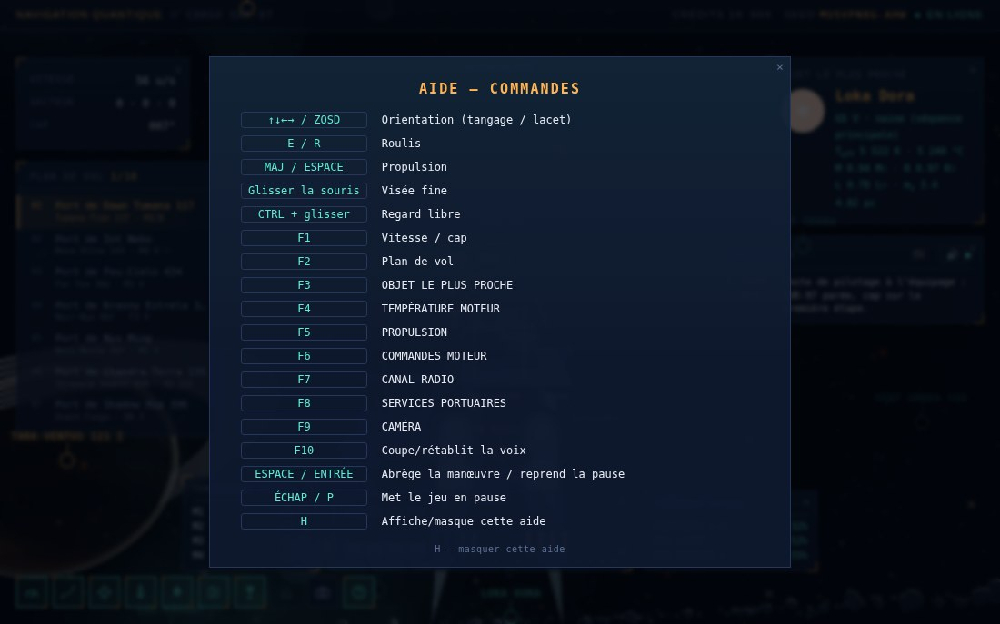

*A duplicate was spotted directly on this screenshot while taking it (the `H` key listed twice) and fixed on the spot: help was self-listing once via the generic loop over HUD buttons, then a second time via its own dedicated description line.*

**"Flight plan" panel width** reduced from 300 to 230px.

**Radio welcome message**: the captain greets the crew right after the first route is computed, before any stopover — same panel and same voice as the rest of the radio channel, no separate mechanism.

**Avatars in the radio channel**: captain silhouette (amber) for the crew, tower antenna (cyan) for ground control, inserted before each log line.

**Shuttle launch trajectory** redesigned in three phases, rather than a direct path from instant zero:

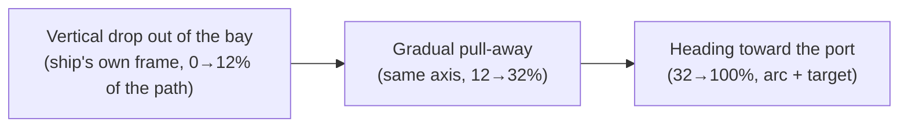

The ship's reference frame (dock position/orientation) is re-evaluated on EVERY frame during the first two phases: the cargo ship keeps maneuvering in orbit throughout the sequence, so the drop and pull-away must stay tied to its actual position, not a snapshot frozen at launch. The return to dock keeps the original simple path (not covered by the request).

**Thruster trail** on the shuttles: a polyline in WORLD coordinates (added to the scene, not to the shuttle's group), fade achieved by darkening colors under additive blending rather than a per-vertex alpha channel (not simply supported by `LineBasicMaterial`).

**Labels + target ring on ships** (cargo ship and shuttles), same visual vocabulary as stars/planets (circle + arrow + text), but with one underlying difference: the ring is sized **dynamically based on apparent on-screen size** (projecting the real radius through the camera's field of view), so it actually surrounds the object rather than being a fixed-size dot — adapted from an explicit request. Third color (green) to set them apart from stars (cyan) and planets (amber).

**Object rendering in the "nearest object" panel**: a 2D canvas icon (52px), not a full second 3D render — far cheaper for a thumbnail this size. Gradient tinted by planet type (dedicated palette per kind: ocean, desert, ice, volcanic, continental, gas giant with bands), true blackbody color for stars, diffuse gradient for nebulae.

### 17.3 Second pass — 4 additional fixes

A new batch surfaced after a second playtest session on the above deliverables.

**Panel overlap, a more general cause than the one already fixed in §17.1.** The left column (`hud-left` → `routePanel`) had its own **fixed** CSS offset (`top:210px`), never recomputed when `hud-left`'s actual height changed (wrapping on a small screen, panel hidden via the HUD bar, language change…) — exactly the same kind of flaw already fixed for radio/services, but left in place on this column. A single function, `repositionAllPanels()`, now handles ALL repositioning of the panel stack (measuring each anchor's real bottom edge, never a guessed value), called at four moments: opening, toggling a panel (icon, shortcut or close button), window resize, **and** continuously (throttled to 350ms, inside the HUD update loop) — this last one to absorb height changes caused purely by content (nearest-object text, flight-plan length), which no discrete event captures.

**Touch look button restored.** A dedicated button (👁 icon), **held down**, now gates drag-to-look on the 3D view — a faithful equivalent of holding CTRL on keyboard, where an unmodified drag had been in effect until now (§15.1). Without the button held, a touch drag now does nothing: no piloting (already excluded, the joystick remains the sole flight control), nor look — an accidental drag can no longer trigger anything by mistake.

**Icon bar moved back to the bottom, touch included.** Reverses the choice made in §12/§15.3 (moving it to the top for lack of space) — explicit request to keep it consistent with desktop, regardless of platform. Flight controls (joystick, roll, boost, look) are shifted up by about forty pixels to make room for it right at the bottom, without overlapping.

**Help button added to the bar.** Tenth icon (question mark), opening the same overlay panel already in place (title + close button, §17.2) — until now reachable only via the `H` key, with no button to discover it. A special case in automatic shortcut assignment: keeps `H` rather than the `F10` it would get under the usual logic (one F per button, in order), to avoid conflicting with voice mute already on `F10`.

**Robustness found while testing** (unrelated to an explicit request, but fixed along the way): `setPointerCapture()` can throw in certain edge cases (pointer already released, multi-touch) — uncaught, it interrupted the rest of the handler before the button's state was updated. Defensive `try/catch` added on the three held touch buttons (roll, boost, look).

## 18. Implementation plan

**Tier 0** from the previous specification (six steps with no dependency) and **Tier 1** (Pause mode, HUD bar, port services) are now **fully delivered**, with a bonus batch of fixes and polish (§17). The following tiers remain to be done.

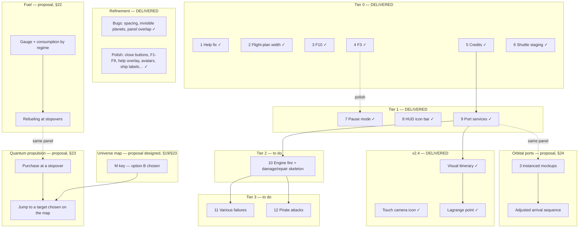

Game-loop economy — credits now have a real outlet (§16) in addition to future repairs:


## 19. Universe map — proposal (M key, not implemented)

Explicit request: an overview of the universe as an overlay, toggled by `M`. Unlike the other efforts in this session, this one has **not** been implemented — too structural to improvise at the end of the list, it deserves its own propose→validate cycle. Three approaches, with their cost/effort/value:

| Option | Effort | Value | Detail |
|---|---|---|---|
| **A — Schematic 2D map, not navigable** | Low | Medium | Orthographic projection of the known flight plan (visited + upcoming steps) onto a 2D subway-map-style plane, current system highlighted. No interaction beyond show/hide. Quick to ship, but only shows what's already in the flight plan — no discovery. |
| **B — Navigable 3D map, free camera** *(chosen — see decision below)* | Medium | High | 3D overview (orbital camera independent from the game's own) of every system already encountered/built, with mouse zoom/rotate. Largely reuses existing rendering (same simplified star meshes) rather than inventing a separate representation — contained cost. Gives a genuine sense of scale and exploration. |
| **C — Full procedural galactic map** | High | Uncertain | Generates and displays a region far larger than what's actually been visited (beyond built systems). Appealing on paper, but raises non-trivial questions: how far to generate without spoiling the surprise of discovery? Non-negligible generation cost at that scale for a simple overlay. |

**Decision (v2.5)**: option B, now serving double duty rather than plain viewing — the quantum-propulsion request (§23) gives it a second role, jump-destination selector. The functional detail (systems shown, click to select, pause during use) is specified in §23 rather than duplicated here, to keep the map's behavior described in one place only.

The three questions raised in the original proposal are therefore settled in §23: systems shown (built **and** within jump range, not just the flight plan), click-to-select (now essential, not just a "nice to have"), and the game pausing during use (rather than a simple toggle overlay like help) — a destination choice deserves not drifting through space while you hesitate.

## 20. Reference — all keyboard shortcuts

| Key | Action | Status |
|---|---|---|
| `↑ ↓ ← →` / `ZQSD` / `WASD` | Orientation | current |
| `E` / `R` | Roll | current |
| `SHIFT` / `SPACE` | Thrust | current |
| Mouse drag | Fine aim | current |
| `CTRL` + drag | Free look | current |
| `CTRL` (short press) | Recenters free look | current |
| `F1` to `F6` | Toggles each of the HUD's 6 info panels | **current** |
| `F7` | Shows/hides the radio channel (replaces `TAB`, kept as an alias) | **current** |
| `F8` | Opens/closes port services (§16) — inert outside zone/delivery | **current** |
| `F9` | Next camera mode (replaces the old `F3`) | **current** |
| `TAB` | Shows/hides the radio channel (historical alias of `F7`) | current |
| `H` | Opens/closes the centered help overlay (§17.2) | **current** |
| `I` | Opens/closes the itinerary panel (§21) | **current (v2.4)** |
| `L` | Opens/closes the Lagrange-point panel (§21) | **current (v2.4)** |
| `F10` | Mutes/restores the synthesized voice | current |
| `SPACE` / `ENTER` | Skips the approach maneuver · Resumes from pause | **current** |
| `ESC` / `P` / `PAUSE` | Pauses the game (§11) | **current** |
| `ESC` (while paused) | Returns to the title screen, full reload | **current** |
| `M` | Universe map / quantum-jump destination selection | proposal, designed (§19, §23) |
| `J` | Intervene on an engine fire | pending (§13) |

> **Key conflict resolved (v2.5).** v2.4 had flagged a collision: `I` was already reserved (§13, never implemented) for an engine-fire intervention, while the same key had just been taken for the itinerary (§21, which is actually implemented). Resolved by moving the engine-fire reservation to `J`, which was free. `I` therefore stays assigned to the itinerary with no reservation attached.

### Context-dependent keys

| Key | Meaning by context |
|---|---|
| `SPACE` | Thrust (cruise) · Skip (approach) · Resume (pause) |
| `ESC` | Pauses · Returns to the title screen (if already paused) — **no longer ever acts as a skip**, that role removed to eliminate any conflict with pause |
| `CTRL` | Free look while held and dragged · Recenters on a short press alone |

## 21. Visual itinerary and Lagrange point — ✅ implemented

Two new HUD panels, added in v2.4 with their own icons in the HUD bar (§12) and fixed-key shortcuts rather than an automatic F-slot (`I` and `L` — see §20 for the `I`/`J` arbitration).

**Touch look icon.** In passing, the touch free-look button (§15) changes pictogram — a camera instead of an eye — with no change in behavior: it's still the same button, held down to enable drag-to-look, the touch equivalent of `CTRL`+mouse.

### 21.1 Itinerary (bottom right)

A second view of the route, complementing the textual flight plan (§5): rather than a list of port names, a **visual track** with a dot representing the ship's actual position along the path.

- Sliding window of 6 steps (same logic as the flight plan, §5): spaced **evenly** along the track, not to the real scale of distances — two stars can be nearly adjacent or at opposite ends of the map, a proportional layout would make most steps unreadable.
- Three-value color code: **blue** (step completed), **amber** (current step, enlarged dot), **green** (step upcoming).
- The ship dot (white, glowing) moves continuously between two dots, interpolated along the curvilinear abscissa `ROUTE.s` already maintained by route tracking — no new background computation, just reading it every frame (unlike the dots themselves, rebuilt only when the step changes).

### 21.2 Lagrange point (bottom left)

A compass giving a heading to follow independent of the main route: the ship's orientation relative to a fixed point of the current step, plus its distance.

> **Assumed approximation, not an N-body simulation.** The targeted point sits on the star→planet axis of the current step, at 92% of the distance starting from the star — a plausible position for an L1-type point, chosen because generated planets have no simulated mass to derive a true libration point from. Shown as a secondary navigation aid, not as scientific data.

- Rotating needle (SVG dial) pointing the point's RELATIVE bearing from the ship's nose (0° = straight ahead), recomputed every frame from the ship's heading and the direction to the point — same construction as the heading already shown top left (§8), not a second coordinate system.
- Distance to the point shown in game units (`u`), same convention as the rest of the HUD (planetary radii, stellar distances).

### 21.3 Visibility

Both panels follow the unified mechanism from §12 (`.panel-hidden`, close button, bar icon) and start visible on desktop like the six existing info panels. **Hidden in touch mode**, regardless of orientation: their bottom-left/bottom-right slots exactly overlap the joystick, roll buttons and BOOST button (§15) — there isn't yet room to integrate them properly into that layout, unlike the info panels, which simply collapse in portrait without occupying the flight-controls' space.

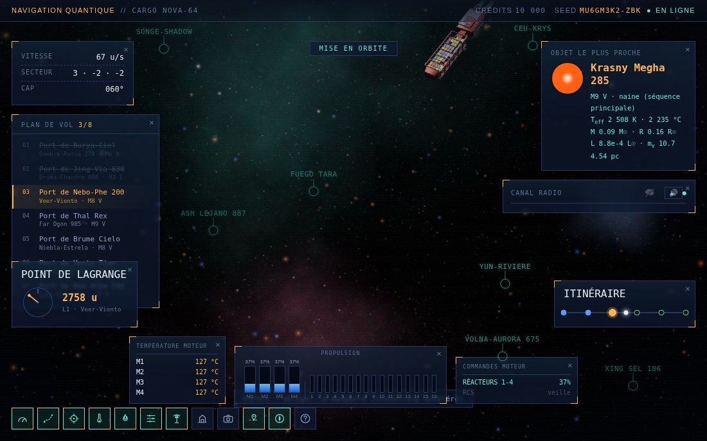

## 22. Fuel and consumption

Proposal, not implemented — like the other efforts of this scale (§13, §19 in its time), it deserves its own validation before being built rather than being improvised at the end of the list.

### 22.1 Why these numbers, not others

The explicitly flagged risk — stranding the player as early as the first step — isn't guarded against by picking a reserve that "feels comfortable": it's computed against the route generator's real constants, already in place and verified (§5).

- A hop between waypoint stars measures between `HOP_MIN=700` and `HOP_MAX=1500` units (`findNextWaypoint`) — **1,100 u** on average.
- A route has between 3 and 12 steps (`legCount = 3 + random(10)`, `planRoute`) — **7.5 steps** on average.
- A full route therefore averages 7.5 × 1,100 ≈ **8,250 u**, rounded to **8,000 u** for the calculations that follow (intra-system legs, from the star to the target planet, stay small by comparison — a few hundred units, §6).

### 22.2 Gauge and consumption

- **Starting tank**: 24,000 u — the equivalent of three full routes **at economical cruise**. Resets to zero only via a return to the title screen (§11), like the propulsion levels (§16).
- **Consumption tied to engine regime**, not distance alone: `consumption(u of distance) = distance × (speed / effectiveCruiseSpeed())^1.5`. At normal cruise (the ratio is 1 by construction — a "Thrusters" upgrade, §16, therefore does NOT change a trip's fuel cost, only its duration), an average route costs the 8,000u reference figure. Under sustained boost (`BOOST_MULT=3.1`), the ratio rises to 3.1^1.5 ≈ **5.46** — a route flown entirely under boost would cost ≈ 43,700u, more than a full tank: deliberate, sustained boost is meant to stay a supplementary resource, not a cruising regime.
- **Hence the requested "1 to 3 routes"**: economical cruise end to end → up to 3 routes on the starting reserve; generous use of boost → well under one. The dial is in the player's hands, not a fixed tier.
- **First-step safeguard**: the worst isolated case — a single `HOP_MAX=1500`u jump, flown entirely under boost — costs ≈ 1,500 × 5.46 ≈ 8,190u, a third of the starting tank. Even an unlucky first jump (the longest possible) flown with zero restraint still leaves two-thirds of the tank intact.

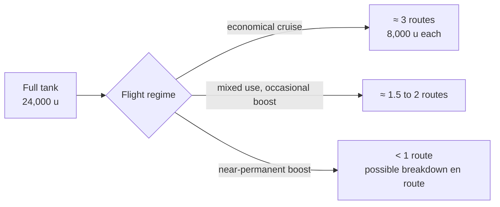

### 22.3 Refueling at stopovers

Added to the port services panel (§16), alongside the "Thrusters" upgrade rather than in a separate panel:
- Proposed rate: **0.20 credit per missing unit** — a full refill from an empty tank would cost 4,800 credits, the same order of magnitude as the first propulsion level (3,200 credits) rather than a negligible or crushing purchase.
- Charged only on the volume actually missing (just as one wouldn't pay for fuel already in the tank), not a flat fee.
- Same activation conditions as the rest of the panel (§16): stopped at a port or during an ongoing delivery.

### 22.4 HUD display

An additional gauge, in the spirit of the existing PROPULSION panel (§8) rather than a new standalone panel: bars or percentage, turning amber then red below thresholds to be defined via playtesting (starting proposal: amber below 25%, red below 10%). Open question: dedicated panel, or merged with the existing PROPULSION panel? Both are read at the same moment (engine regime drives both), a shared display would avoid multiplying windows for closely related information.

### 22.5 Wireframes

The two approaches from §22.4 laid out side by side, to settle the question before coding rather than after — structure and placement only, the final colors and icon style remain to be decided at implementation (likely reusing palettes already in use elsewhere in the HUD, §17.2).

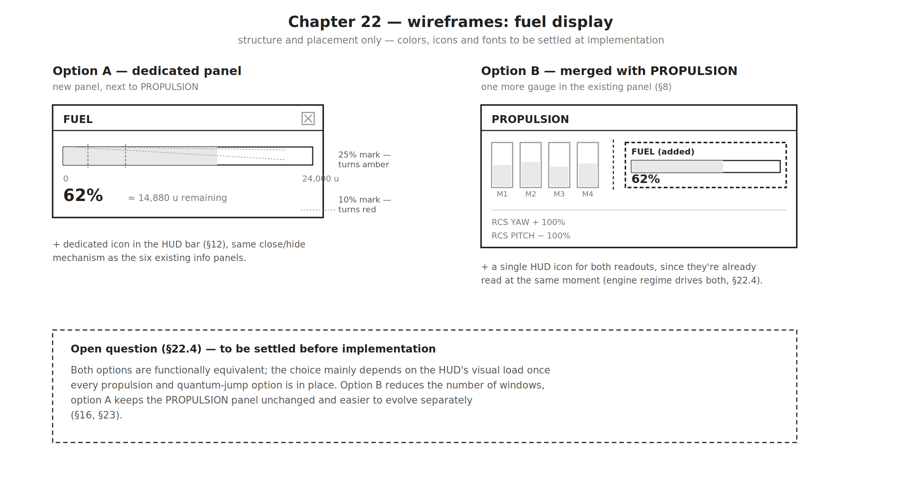

## 23. Quantum propulsion and star map

Proposal, not implemented. Brings together two requests that only make sense together: a jump module is useless without a way to choose its destination, and the universe map (§19, proposed but never settled) finds its true purpose here rather than as a mere viewer.

### 23.1 Acquisition

One-time purchase at a stopover (port services panel, §16), not a tiered system like the thrusters (§16) — the ship either has the module or it doesn't. Proposed price: **18,000 credits**, a structural purchase rather than an incremental upgrade, consistent with the fact that it opens an entirely new capability rather than a simple percentage gain.

### 23.2 Fuel cost of a jump

A deliberate choice to keep balancing simple: a jump consumes **exactly the fuel that the same trip would have cost at normal cruise** (§22 — `distance × 1`, the "cruise" regime of the consumption formula), no more, no less. The module's value therefore isn't saving fuel, but saving **flight time** — a jump is near-instantaneous (§23.4) versus several minutes of simulated flight. This choice avoids opening a second balancing axis (a jump-specific fuel rate) while the first one (§22) is still awaiting playtest validation.

### 23.3 Star map (`M` key)

Reuses option B from §19 (navigable 3D map, free orbital camera, already-existing simplified star meshes) and settles its previously open questions:

- **Systems shown**: those already built (§2, `ensureSystemsBuilt`) **and** any star already generated within jump range (§23.4), not just the current flight plan — selecting a destination off-route is the whole point of the module.
- **Selection**: click a star or planet to mark it as the target, explicit confirmation (button or double-click) before triggering the jump — an accidental click must not decide on the player's behalf.
- **While consulting it**: the game **pauses** (§11) rather than a simple toggle overlay like help (§17.2) — a destination choice deserves not drifting through space while you hesitate. `M` closes the map and resumes the simulation, exactly like `ESC` for pause.
- **Without the module** (§23.1): the map stays browsable read-only (an overview, useful in its own right) — clicking a star shows a tooltip along the lines of "Requires the quantum jump module" rather than hiding the feature entirely.

### 23.4 Jump range and regeneration

A jump can only target a star **already generated** by the cell-based star field (§2, `starField`/`STAR_CELL`) — jumping to a never-visited region would require generating it ahead of time, an unnecessary complexity when the already-built window offers plenty to choose from. After a jump:
- The star field and nebula refresh around the new position (reuses `refreshField`, already in place for normal scrolling), rather than a new generation mechanism.
- The current route is **replanned from the new position** (reuses `planRoute`, without the nose-to-curve realignment reserved for the very first departure) — jumping changes the route's starting point, not just the ship's raw position.

### 23.5 Proposed visual effect

Goal: an effect that clearly reads as a jump, built from means already in place rather than a costly new rendering system — consistent with the principle already followed for the shuttle trail (§17.2) or the nearest-object icon (§17.3).

1. **Charge-up (≈0.4s)**: the four engines (`M1`-`M4`, already modeled) exceed their normal light intensity, a pulsing cyan halo grows around the hull.
2. **Jump (≈0.5s)**: nearby stars from the existing star field (`starField`) stretch radially toward a vanishing point ahead of the ship — each already-rendered star is simply stretched along the camera→star axis during the transition, rather than a separate particle system to design and load. The hull switches to a translucent material, cyan wireframe outline, to suggest a brief desynchronization.
3. **Exit (≈0.15s)**: a brief white flash (full-screen plane, opacity 0→1→0) marks arrival. Camera fixed throughout the sequence — no camera movement layered on top of the stretch effect, so as not to add motion sickness to an already very readable effect.
4. HUD banner "QUANTUM JUMP IN PROGRESS" during the sequence (~1s total), non-interruptible — in the same spirit as the existing "ORBIT INSERTION" banner (§7).

### 23.6 Map wireframe

Structure and interactions only — the actual 3D rendering (materials, lighting, system-icon style) remains to be settled at implementation, consistent with the "proposal" spirit of this whole section. Reuses the same visual family as the already-implemented Pause and Help overlays (amber corners, dimmed background, §11/§17.2) rather than a new overlay template.

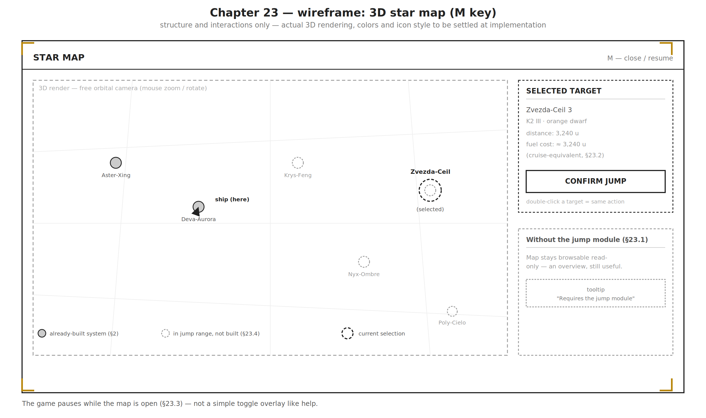

## 24. Orbital ports

Proposal, not implemented. A second port type, complementing — not replacing — the existing ground port (§6, §7): some ports float in orbit around a planet rather than sitting on it.

### 24.1 Why a second type

Beyond visual variety, a concrete case the current system doesn't handle properly: a **gas giant** (one of the six planet kinds, §6) by definition has no solid surface to place a port on. If a gas giant is ever chosen as a step's target planet, the orbital port isn't one option among others but the **only** coherent one — an implicit blind spot in the current system that this effort closes along the way.

### 24.2 Generation: a small, instanced set of mockups

Rather than a 3D model generated on the fly per port (costly, and little reason to vary a station endlessly the way a planetary system is varied): a **small catalogue of fixed mockups** — starting proposal, three models —, chosen and positioned at system generation like everything else (§2), then **instanced** (same base mesh reused, only the transform changes) everywhere they appear, in the same spirit already used for asteroids or star fields.

| Model | Silhouette | Ports concerned |
|---|---|---|
| **Simple ring** | An open ring, single dock at its center | Small stopovers, secondary systems |
| **Multi-arm hub** | Central core, 3-4 radiating docking arms | Main ports, busy systems |
| **Vertical docking tower** | Elongated structure along the orbital axis | Gas giants (§24.1) — profile designed for a fast low orbit |

- **Which systems get one**: seed-weighted draw (deterministic, like the rest of generation, §2) — starting proposal, about a third of systems, and **mandatory** for any gas giant chosen as a target (§24.1), which has no alternative.
- **Scale**: each mockup sized proportionally to the planet it orbits (planet radius, already available at system-generation time), not a fixed size that would look tiny in some cases and overwhelming in others.

### 24.3 Arrival sequence: an adjustment, not a redesign

The existing orbit system (§7 — orbit insertion, orbit ring around the target) already fits the orbital-port concept well: the station simply occupies a fixed point on that ring, rather than the planet's center. Concrete changes:
- The port itself replaces the ground delivery point as the orbit-insertion's visual target.
- Shuttles (§7) head straight for the station — a shorter, simpler trip than a surface approach, with no descent phase to stage.
- Radio dialogue (§7, §14) addresses the station rather than "the ground" — a text-template adjustment, not a new dialogue mechanic.

*No screenshot for this section: like random events (§13), an effort still at the proposal stage — an illustration will come once the three mockups are actually built, not before.*
