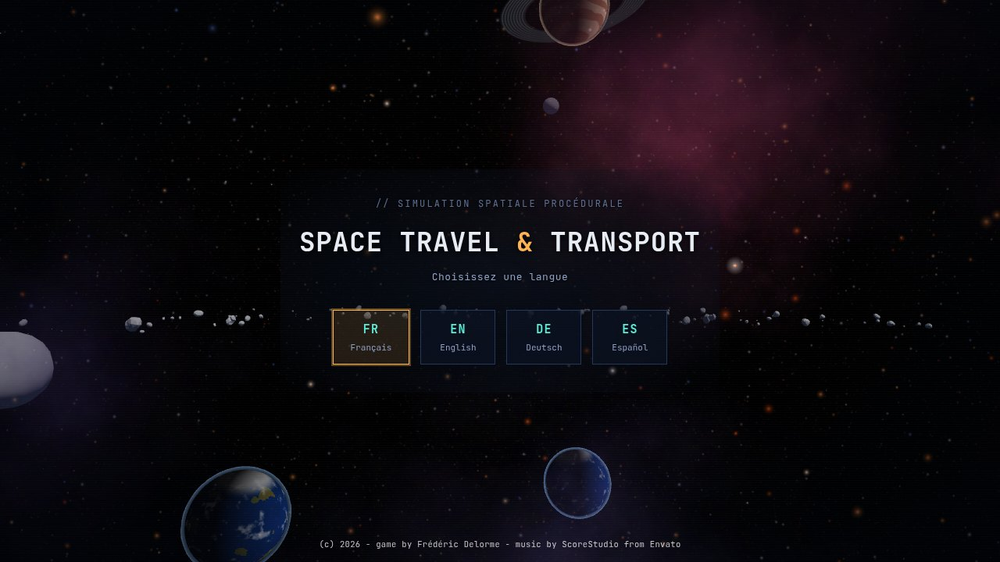
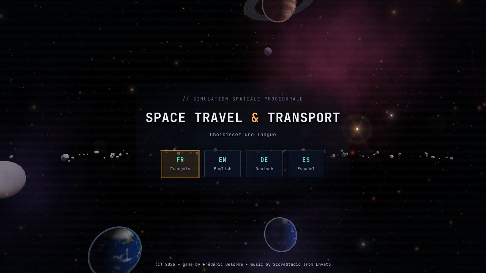
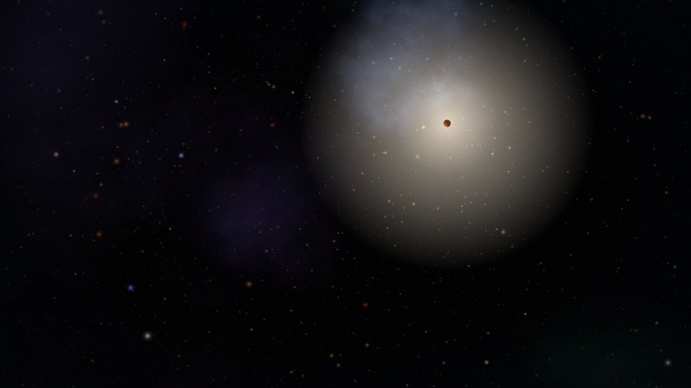
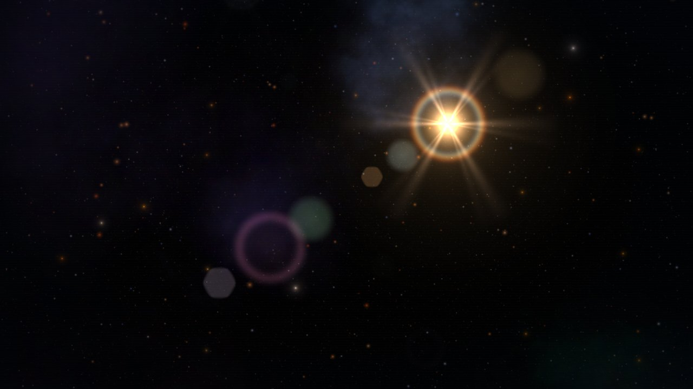
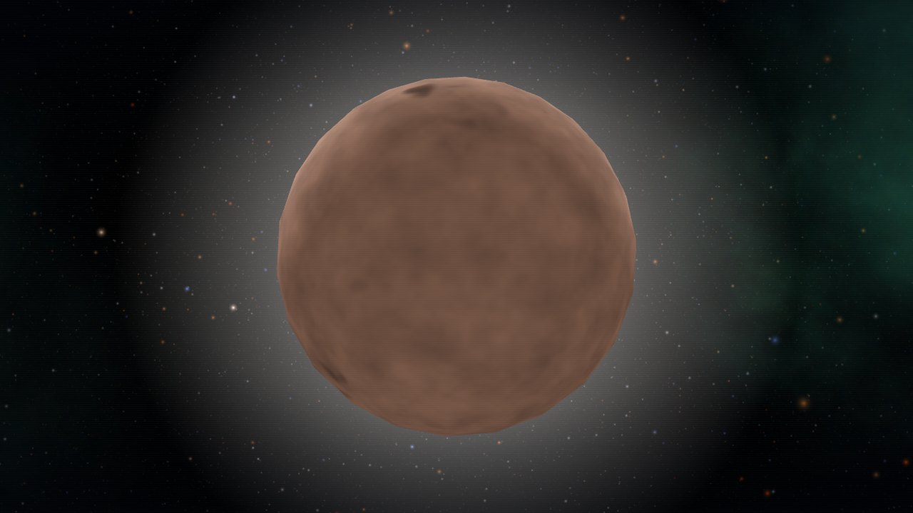
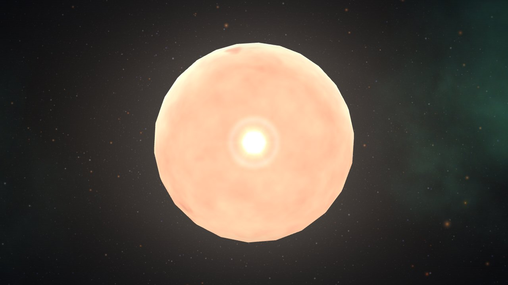
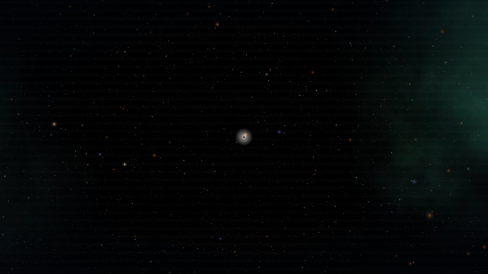
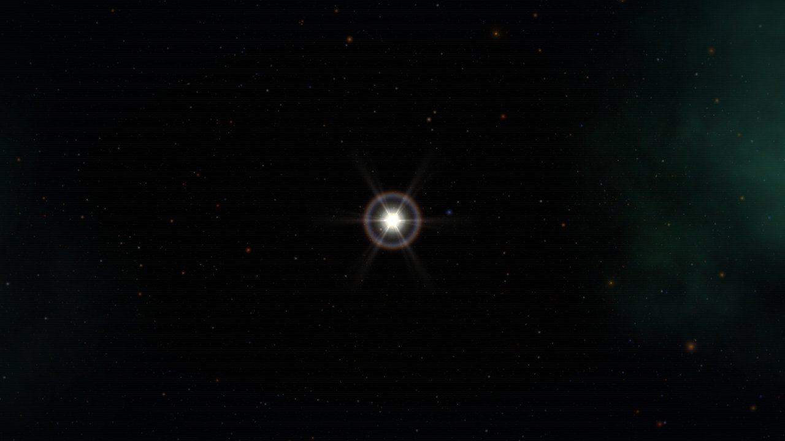
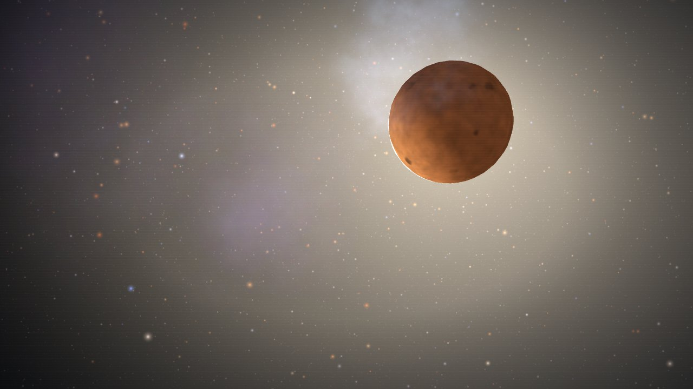
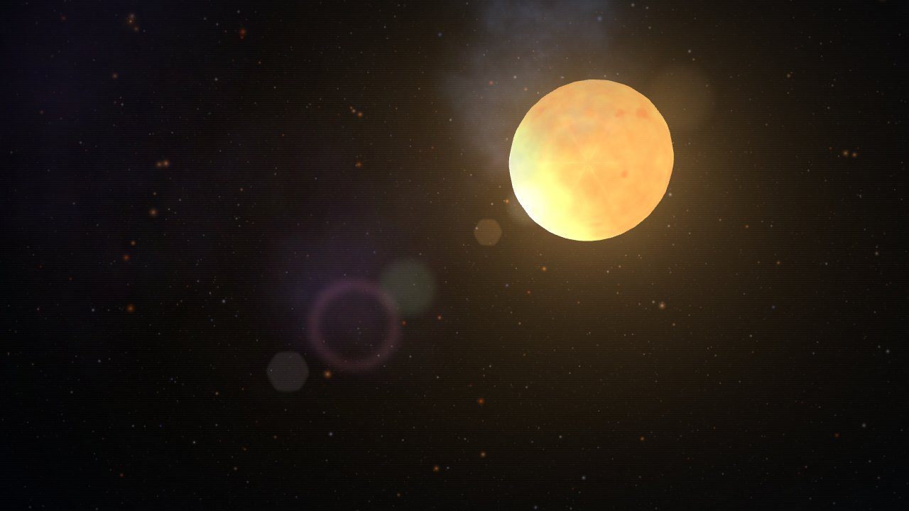

# Étude — Rendu des étoiles : halo, lumière et lens-flare

Document de travail séparé de la spécification principale. Il décrit un changement de rendu de l'écran-titre (et, pour les halos et les lumières, du jeu), le mesure et propose ce qu'il reste à trancher. Il s'appuie sur [`SPEC-002-generation_de_l_univers-V1.0.md`](./SPEC-002-generation_de_l_univers-V1.0.md), qui décrit la génération des étoiles.

**Statut : implémenté sur la branche `worktree-rendu-etoiles-flare`, non fusionné, à relire.** Le rendu des étoiles est actif par défaut ; le lens-flare est actif à l'écran-titre seulement et désactivé en partie (`?flare=1` le force). Les choix à trancher sont regroupés au [§9](#9-décisions-à-trancher).

Deux hypothèses d'interprétation de la demande, à confirmer :

- **« Scène d'intro »** = l'écran-titre et son travelling de fond en 3D (les étoiles des cellules suivies et le décor lointain), pas la séquence terminal de l'écran de démarrage.
- **« Elles doivent émettre de la lumière »** = deux niveaux : un niveau visuel (cœur brillant, halo dont l'importance dépend de l'étoile) et un niveau d'éclairage réel (les étoiles les plus brillantes en vue éclairent ce qui les entoure).

---

## Sommaire

- [1. Constat](#1-constat)
- [2. Conception](#2-conception)
- [3. Résultat](#3-résultat)
- [4. Paramètres et activation](#4-paramètres-et-activation)
- [5. Coût mesuré](#5-coût-mesuré)
- [6. Vérifications](#6-vérifications)
- [7. Limites connues](#7-limites-connues)
- [8. Comment les chiffres et les images ont été obtenus](#8-comment-les-chiffres-et-les-images-ont-été-obtenus)
- [9. Décisions à trancher](#9-décisions-à-trancher)

---

## 1. Constat

Dans l'écran-titre d'origine, les étoiles ne se lisent pas comme des sources de lumière : ce sont de petits points, et même la plus brillante n'est qu'une tache grise ou un point sombre dans une brume.

| Avant | Après |
|---|---|
|  |  |

*Écran-titre, graine `TEST`, 1280 × 720. L'étoile vers (940, 340) montre le changement : un simple point gris avant, un cœur chaud entouré d'un anneau et de rayons après. Les autres étoiles gagnent une lueur teintée.*

Les causes, relevées en lisant le code puis en mesurant :

| Élément | Comportement d'origine | Effet |
|---|---|---|
| Taille du halo | Sprite dont la taille est **fixe en unités du monde** (`baseHalo × (0,55 + éclat × 0,55)`, environ 5,8 u pour une étoile de type solaire) | Environ 20 px à 200 u, environ 7 px à 600 u : plus l'étoile est loin, plus elle est un point nu |
| Opacité du halo | `0,25 + éclat × 0,35`, bornée à 0,15 | Très faible pour la plupart des étoiles |
| Couleur du halo | Couleur de corps noir en linéaire, puis tone-mapping ACES et encodage sRGB | Une étoile orange sort gris-blanc |
| Brouillard | Le sprite de halo est soumis au `FogExp2` de la scène | Dimmé avec la distance, alors qu'une étoile lointaine reste éclatante |
| Disque | `clamp(baseCore × 26 / d, 0,3 ; 9)` | 1 à 2 px de rayon au loin |
| Cœur (shader) | Couleur × assombrissement du bord × granulation, sans gain ni tone-mapping | Un disque terne : en gros plan, une boule brune mate qui ressemble à une planète |
| Décor lointain | Environ 300 000 `Points` avec la texture de lueur de 128 px et un plancher de 1 px | Aucun halo au-delà de cette texture |
| Lumière | Une seule lumière directionnelle `starLight`, jamais mise à jour à l'écran-titre | Aucune étoile n'éclaire quoi que ce soit |

Le champ de l'écran-titre compte 172 étoiles suivies. Vu de l'origine, **une seule** a un éclat perçu supérieur à 1,5 (la supergéante `F6 I`, luminosité 34 360 L☉, à 883 u, éclat borné à 6,00) ; les suivantes plafonnent entre 0,8 et 1,2. Un seuil absolu élevé pour le lens-flare le rendrait presque toujours inactif : il doit se régler sur cette population.

Le cas le plus parlant est celui de cette supergéante, vue de loin :

| Avant | Après |
|---|---|
|  |  |

*Avant, la plus lumineuse de l'univers visible est un point brun-rouge au milieu d'une brume beige. Après, c'est une source, avec ses reflets d'objectif.*

## 2. Conception

Le code vit dans le fichier HTML unique, section « 3ter. RENDU DES ÉTOILES » (`space-travel.html`, à partir de la ligne 1795 de cette branche), sans fichier séparé ni dépendance nouvelle (Three.js r128 inchangé).

### 2.1 Cœur émissif

Le shader `STAR_FRAG` (ligne 1931) reçoit un uniform `uGain`, à 0 par défaut. Quand il est positif :

- la couleur est multipliée par un gain de 1,55 à 2,05 selon la luminosité de l'étoile ;
- l'assombrissement du bord est réduit de 40 %, la granulation et les taches sont adoucies (le disque se lit comme une source, pas comme un sol rocheux) ;
- le centre du disque sature vers le blanc (`mix` vers `(1, 0,98, 0,94)` avec `0,5 × μ^2,5`), et le bord garde la teinte du corps noir.

Sans `uGain` (par exemple la carte stellaire, qui réutilise ce shader), le résultat est numériquement identique à celui d'avant : chaque `mix` vaut son premier argument quand le paramètre est nul.

### 2.2 Halo dimensionné à l'écran

Le rayon du halo est maintenant fixé **en pixels écran**, puis converti en unités du monde (`starHaloUpdate`, ligne 2011) :

```
rayon (px) = clamp(8 + 42 × éclat, 9, 300) × haloSize
échelle monde = 2 × rayon × distance × (2 tan(fov/2) / hauteur écran)
opacité = clamp(0,55 + 0,10 × éclat, 0,5, 1)
```

`éclat` est l'éclat perçu déjà calculé par la boucle d'animation (magnitude apparente, `flux^0,25`, borné à 6). `haloSize` (0,85 à 1,35) dérive de la luminosité et de la température de l'étoile : **aucun tirage de PRNG**, donc aucune conséquence sur la génération.

La texture du halo (`makeStarHaloTexture`, ligne 1815) est une texture de données de 256 × 256 : cœur serré, lueur en exponentielle, queue qui s'éteint avant le bord. Elle est générée une fois et partagée. La teinte (`starHaloColor`) sature légèrement la couleur de corps noir et la sous-expose avant l'encodage sRGB de sortie, qui la reblanchirait sinon. Le sprite n'est plus soumis au brouillard ni au tone-mapping.

**Disque résolu.** En vue rapprochée, un halo qui tient dans le disque y est invisible. Quand le rayon du disque dépasse 5 % de celui du halo, le sprite est agrandi à dix rayons de disque (borné à 2 400 px), de sorte que la queue de la lueur sort au-delà du limbe en couronne ; son opacité est atténuée pour les très gros disques, afin de ne pas voiler tout l'écran.

| Avant | Après |
|---|---|
|  |  |

*Gros plan d'un travelling de l'écran-titre (`G2 IV`, 5 807 K). Avant, une boule brune mate ; après, un disque chaud au centre blanc, entouré d'une couronne.*

### 2.3 Lumières ponctuelles

Un pool de **3 `PointLight`** (`STAR_LIGHT_POOL`, ligne 2042), de nombre **constant** : en changer recompilerait les shaders de toute la scène. Les lumières inutilisées ont une intensité de 0.

- Toutes les 0,25 s, `updateStarLights` (ligne 2067) sélectionne les étoiles au flux `L / d²` le plus fort à portée de la caméra et les affecte aux lumières, sans allocation.
- Une lumière qui garde son étoile la garde ; une lumière dont l'étoile sort du meilleur trio s'éteint **en fondu** avant d'être réattribuée : pas de saut visible.
- L'étoile déjà servie par la lumière directionnelle `starLight` est exclue (`lightState.source`) : on n'éclaire pas deux fois.
- Couleur = couleur de corps noir. Intensité = `clamp(0,30 + 0,75 × log10(1 + L), 0,3, 3,2)`. Portée = 900 à 2 700 u selon la luminosité, avec un affaiblissement doux.

### 2.4 Lens-flare

Passe additive dessinée **après** la scène (`flare`, ligne 2189 ; `renderFrame`, ligne 2336), pour les 4 étoiles les plus éclatantes en vue :

| Élément | Rôle |
|---|---|
| Starburst | Six branches fines (ouverture à six lames), un second jeu plus fin décalé de 30°, et un noyau serré |
| Anneau de halo | Le rayon varie de ± 3,5 % selon le canal rouge, vert ou bleu : léger décalage chromatique |
| Ghosts | Six reflets (disques doux, hexagones à l'image de l'ouverture, anneau) alignés sur l'axe **étoile → centre de l'écran** |

Chaque élément est un quad en coordonnées d'écran, rempli côté CPU dans des tampons préalloués (aucune allocation par image) et dessiné par **un seul appel** avec un shader autonome (`FLARE_FRAG`, ligne 2151). L'intensité d'une étoile combine :

- son éclat perçu (0 sous 0,8, maximale à 3,5) ;
- sa distance au bord de l'écran (le flare s'éteint entre le bord et 35 % au-delà, pour une étoile hors champ) ;
- l'écart à l'axe optique ;
- la taille de son disque : une étoile résolue éblouit moins, le starburst et l'anneau disparaissent, les reflets restent à moitié ;
- une **occultation analytique** (`flareOcclusion`, ligne 2256) : le rayon caméra → étoile est testé contre les sphères des planètes des systèmes construits et du vaisseau, avec un bord doux.

| Avant | Après |
|---|---|
|  |  |

*Étoile brillante à 120 u. Le halo d'origine est un disque gris à bord dur ; le nouveau est un cœur blanc, un anneau à liseré chromatique et des rayons.*

| Avant | Après |
|---|---|
|  |  |

*La supergéante à 220 u, décentrée : le disque est résolu (le starburst s'efface), les reflets restent sur l'axe qui traverse le centre de l'écran.*

### 2.5 Décor lointain

Les deux couches de points les plus brillantes (`dust2` et `accent`, environ 25 000 points) reçoivent la texture de halo avec ses deux traits de diffraction fins en croix. Le halo des étoiles nommées n'a pas ces traits : sa taille varie de quelques pixels à des milliers, ils y deviendraient de larges bandes ; c'est le rôle du lens-flare.

## 3. Résultat

Les images du [§1](#1-constat) et du [§2](#2-conception) montrent les plans mesurés. Ce qui change à l'écran-titre :

- les étoiles ont un cœur brillant et une lueur teintée qui **ne rétrécit plus avec la distance** ;
- une étoile proche ou très lumineuse se lit comme une source, avec une couronne quand son disque est résolu ;
- les étoiles les plus éclatantes produisent des reflets d'objectif, dont la géométrie suit leur position à l'écran ;
- les étoiles brillantes portent une lumière réelle (le pool de trois lumières), qui agit sur les astéroïdes, les lunes et la coque ; les captures de ce document ne mettent pas cet effet en évidence, il n'est vérifié que par les contrôles du [§6](#6-vérifications).

Rien ne change dans la génération : `route=d12a2d50`, `i18n=60a44562` et 9 étapes restent identiques (voir le [§6](#6-vérifications)).

## 4. Paramètres et activation

| Paramètre d'URL | Effet |
|---|---|
| (aucun) | Rendu des étoiles actif ; lens-flare à l'écran-titre seulement |
| `?starfx=0` | Rendu d'origine des étoiles (aucune lumière ajoutée, aucun flare, halo et cœur comme avant). Sert à comparer |
| `?flare=1` | Lens-flare aussi en partie |
| `?flare=0` | Aucun lens-flare, même à l'écran-titre |

Les réglages sont regroupés dans trois objets du script :

| Objet | Contenu principal |
|---|---|
| `STAR_FX` | `haloBase` 8, `haloGain` 42, `haloMin` 9, `haloMax` 300 (px) ; `coreGainMin` 1,55, `coreGainMax` 2,05 ; `lightCount` 3, `lightDecay` 1,4, `lightGain` 1, `lightPeriod` 0,25 s |
| `FLARE` | `mode` (`title`, `always` ou `off`), `count` 4, `minPerceived` 0,8, `fullPerceived` 3,5, `strength` 1, `margin` 1,35 |
| `FLARE_ELEMENTS` | Pour chacun des 8 éléments : sorte, position sur l'axe, taille, gain, teinte |

`FLARE.count` doit rester supérieur ou égal à 1 : à 0, la page échoue (le mutant correspondant du `selftest` fait planter le script, ce qui est bien détecté).

## 5. Coût mesuré

Les mesures viennent d'un banc d'essai jetable, exécuté dans Chrome sans écran avec le **rendu logiciel** (swiftshader) à 1280 × 577, graine `TEST`, dans deux scénarios : la vue de l'écran-titre (A) et la vue de la supergéante à l'écran (E). Le rendu logiciel n'est pas représentatif d'un GPU : il sert ici de terrain de comparaison.

**Travail demandé au GPU** (compteurs de Three.js, exacts) :

| Compteur | Avant | Après |
|---|---:|---:|
| Appels de dessin de la scène (vue A) | 78 | 81 |
| Passes supplémentaires | 0 | 1 (le lens-flare, un seul appel) |
| Triangles (vue A) | 59 310 | 59 316 |
| Lumières dans la scène | 3 | 6 |
| Programmes de shader | 9 | 11 |
| Textures | 3 | 5 (deux de 256 × 256, environ 0,7 Mo avec leurs mipmaps) |
| Géométries | 60 | 61 (le flare) |

**Surface de remplissage des sprites de halo** (somme des aires, rapportée à l'écran, sans découpe) :

| Vue | Avant | Après | Plus grand sprite avant → après |
|---|---:|---:|---|
| A (écran-titre) | 0,00 | 0,19 | 22 → 113 px |
| E (supergéante à l'écran) | 0,24 | 0,70 | 417 → 624 px |

**Coût CPU par image** (JavaScript) : la mise à jour des halos reste de l'ordre de 0,1 à 0,3 ms, sans écart mesurable avec l'ancien code (ce bruit dépasse l'effet) ; la mise à jour du pool de lumières coûte 0,01 à 0,04 ms ; la préparation et l'envoi de la passe de flare, 0,15 à 0,40 ms.

**Temps d'image en rendu logiciel : la mesure n'est pas concluante.** Chronométrer le rendu exige une relecture de pixel bloquante (`gl.finish()` ne bloque pas dans ce mode). Pendant la mesure, la machine faisait tourner d'autres travaux : la médiane d'**une même** configuration variait de ± 40 % d'une série à l'autre (par exemple 785 à 1 134 ms pour l'ancien code), plus que l'effet cherché. Le seul indicateur robuste au bruit, le **meilleur temps d'image** de chaque série, est indiscernable : 476 ms pour le code d'origine, 412 ms pour le nouveau avec `?starfx=0`, 434 ms pour le nouveau par défaut. Aucun ralentissement n'est donc mesurable, mais on ne peut pas non plus affirmer son absence sur un GPU d'entrée de gamme. Les points de vigilance théoriques sont les trois lumières supplémentaires dans les shaders de matériaux standard (coque, lunes, astéroïdes) et le remplissage des halos étendus.

## 6. Vérifications

`selftest.sh` reste entièrement vert sur la source **et** sur la version minifiée : `route=d12a2d50`, `i18n=60a44562`, `legs=9`, `scale=actuel`, `geomGrowth` à −7 (seuil 60), `rules.allegee=6/6`, et le parcours de démarrage. Il vérifie en plus :

| Contrôle | Ce qu'il prouve |
|---|---|
| `starLights=3` (référence de `selftest.expected`) et `pointLightsStable=1` | Le pool a le nombre attendu et il ne change pas |
| `starLightsLit ≥ 1` | Des lumières sont mises en service près d'une étoile brillante |
| `flareActive ≥ 1` et `flarePixels=1` | La passe de flare est active et **ajoute des pixels** : un bloc de 128 × 128 px autour de l'étoile est lu avant puis après la passe additive |
| `flareOcclusion=1` | Une sphère entre la caméra et l'étoile la masque, la même sphère écartée ne la masque pas |
| `glError=0` | Le rendu ne laisse aucune erreur WebGL |
| `?starfx=0` : `starLights=0`, route identique, aucune passe de flare | Le rendu d'origine est bien restitué, et le rendu n'entre pas dans la génération |

Six mutants du code sont détectés : seuil d'éclat inatteignable (`flareActive=0`), shader qui n'ajoute plus rien (`flarePixels=0`), quatre lumières au lieu de trois (`starLights` ≠ 3), occultation désactivée (`flareOcclusion=0`), lumières éteintes (`starLightsLit=0`) et `?starfx=0` ignoré. Un septième (`FLARE.count = 0`) fait échouer le script de la page, ce qui est aussi détecté.

Le chemin en jeu a été vérifié séparément : une partie démarrée avec ou sans `?flare=1` ne lève aucune erreur, le pool s'allume, le flare est inactif par défaut et actif avec `?flare=1`.

Pas de fuite GPU : les deux textures, le matériau, la géométrie et la scène du flare et les lumières sont créés une fois et vivent autant que la page ; les matériaux de halo par étoile partagent la texture et sont libérés avec leur cellule comme depuis le lot R3a. `geomGrowth` reste à −7.

## 7. Limites connues

- **Les lumières n'éclairent que les matériaux standard de Three.js** : coque, lunes, astéroïdes. Les planètes et les nébuleuses ont un éclairage propre dans leur shader (direction de l'étoile hôte) et ignorent le pool. À l'écran-titre, `starLight` reste une lumière directionnelle fixe, comme avant.
- **Silhouette polygonale** du disque en tout gros plan (sphère de 24 × 24 segments) : la couronne l'adoucit, mais ne la supprime pas. Passer à 40 × 40 segments triplerait les triangles des 172 étoiles.
- **Occultation limitée** aux planètes des systèmes construits et au vaisseau : pas les lunes, les astéroïdes ni les nébuleuses.
- **Seules les étoiles suivies** (`starField`, environ 172) peuvent produire un flare, pas les points du décor lointain.
- **Constantes empiriques** : les gains, les portées de lumière et la table des éléments du flare ont été réglés à l'œil sur quelques vues de la graine `TEST` ; elles méritent un tour de réglage sur d'autres graines.
- **Mesure de performance** limitée au rendu logiciel et bruitée (voir le [§5](#5-coût-mesuré)).
- **Halos et lumières agissent aussi en jeu** (le lens-flare, non) : un changement d'aspect visible des étoiles pendant le vol, à valider.
- Les captures d'un Chrome sans écran fixent `dt` à 0 (l'horloge virtuelle du navigateur) : les fondus du pool de lumières y sont avancés à la main ; en jeu réel, ils suivent le temps normalement.

## 8. Comment les chiffres et les images ont été obtenus

Les mesures et les captures viennent de scripts jetables (non conservés dans le dépôt), exécutés dans Chrome sans écran avec le rendu logiciel de `selftest.sh` :

| Élément | Méthode |
|---|---|
| Captures | Une copie de la page reçoit un pilote qui clique sur START, attend la fin de la séquence, **fige le travelling** (`titleCineTimer`) et place la caméra à une position reproductible : A depuis l'origine, B à 120 u de l'étoile brillante la plus proche, C à `baseCore × 8,7` (gros plan du travelling), D à 220 u de la supergéante, E depuis l'origine avec la supergéante décentrée. Le code d'origine (`HEAD`) et le code modifié passent par le même pilote |
| Éclat perçu des étoiles | Lecture de `o.perceived` sur les 172 étoiles du champ, graine `TEST`, après quelques images |
| Compteurs de travail | `renderer.info.render` (appels, triangles) et `renderer.info.programs`, `renderer.info.memory` ; surface des sprites de halo calculée depuis leur échelle monde et leur distance |
| Temps d'image | Banc d'essai exécuté de façon synchrone avant l'événement `load` (temps réel, sans horloge virtuelle), 30 à 150 images après 6 images d'échauffement, séries entrelacées original / nouveau `?starfx=0` / nouveau |

## 9. Décisions à trancher

1. **Lens-flare en jeu.** Le laisser désactivé par défaut (choix actuel, activable par `?flare=1`), l'activer en croisière seulement, ou le supprimer du jeu et le réserver à l'écran-titre.
2. **Halos et lumières en jeu.** Ils sont actifs partout. Les limiter à l'écran-titre éviterait tout changement pendant le vol, mais créerait un saut visuel au démarrage de la partie.
3. **Intensité.** Le lens-flare est marqué sur les étoiles très brillantes (voir la vue de la supergéante) ; `FLARE.strength` et les gains de `FLARE_ELEMENTS` se règlent en une ligne.
4. **Nombre de lumières.** 3 est un compromis ; 2 réduirait le coût de shader des matériaux standard, 4 éclairerait davantage d'astéroïdes.
5. **Planètes et nébuleuses.** Leur faire recevoir la lumière des étoiles voisines demanderait de modifier leurs shaders (un éclairement supplémentaire par uniform), hors du périmètre de cette étude.
6. **Silhouette du disque.** Accepter la silhouette polygonale en tout gros plan, ou augmenter les segments des seules étoiles proches.
7. **Documentation du projet.** Ajouter une ligne pour ce document au tableau « Structure du projet » du `README.md` de la démo, et, si le lot est retenu, décrire le rendu des étoiles dans la spécification.
