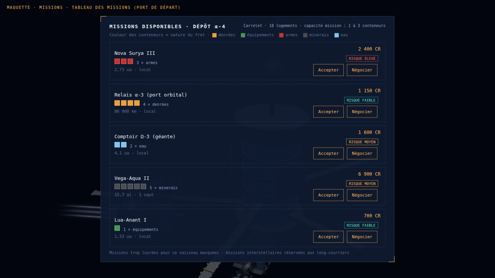
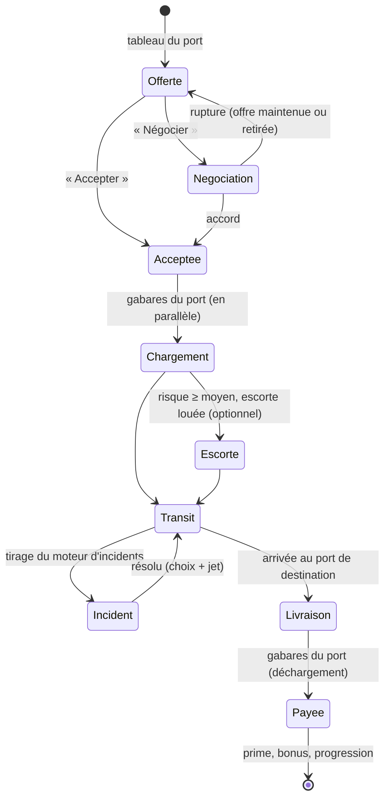
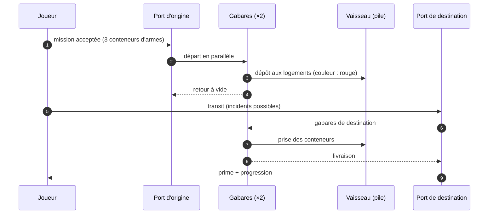
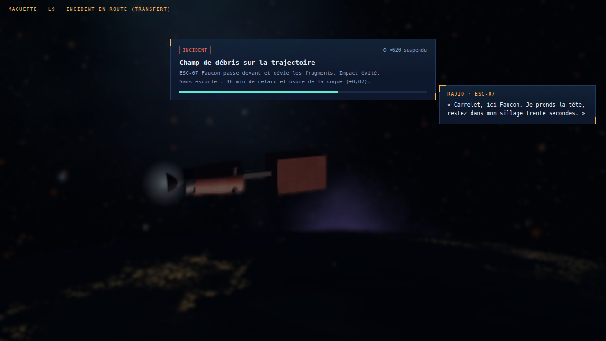
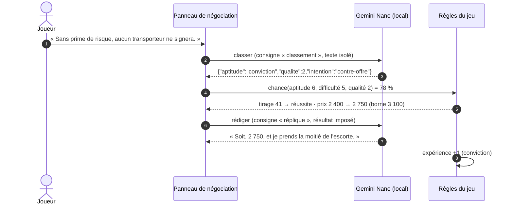
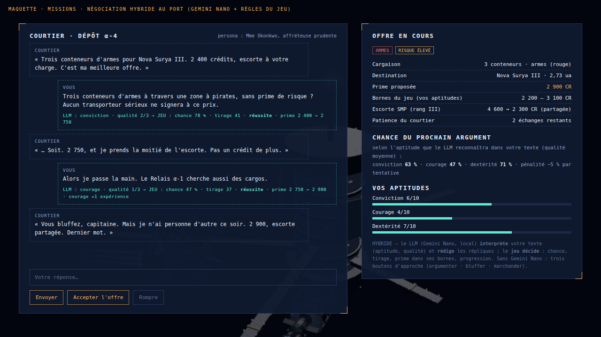

# Space Travel & Transport — Missions, risques, compétences et Gemini Nano

**Spécification** — refonte de la boucle de jeu : l'itinéraire imposé disparaît au profit de **missions négociées au port**.
Source : demande du 29/09/2026 (missions, ressources et passagers, risques et primes, composante RPG, missions et LLM,
incidents). Liée à [`SPEC-008-ports_orbitaux_et_navette-V1.0.md`](SPEC-008-ports_orbitaux_et_navette-V1.0.md) (ports, amarrage, navettes) et
à [`SPEC-007-l9_trafic_concurrence_escorte_jeu-V1.0.md`](SPEC-007-l9_trafic_concurrence_escorte_jeu-V1.0.md) (trafic, concurrence, escorte, radar).

| | |
|---|---|
| Base | v2.17 (échelle réelle, navettes de baie, ports orbitaux P1) |
| Statut | **spécification** — décisions prises le 29/09/2026 ; valeurs marquées **⚑** proposées, à valider |
| Ordre retenu | **P2 (amarrage) d'abord**, puis M1 → M5 |

---

## 1. Décisions

| Sujet | Décision |
|---|---|
| Itinéraire | **supprimé** — la partie commence près d'une planète dotée d'un port et de missions |
| Chargement à l'origine | **gabares du port, en parallèle** (1 à 2 conteneurs chacune) |
| Déchargement à destination | **gabares du port aussi** ; la navette de baie sert aux passagers, au fret léger, aux missions d'un conteneur |
| Rôle de Gemini Nano | **hybride** : le LLM interprète et rédige, **le jeu décide** (chances, prix, résultats) |
| Incidents | **interactifs** : pause du transfert, choix, jets d'aptitude, effet de l'escorte |
| Négociation | libre (texte du joueur) **et** chance de réussite calculée d'après les compétences ; les réussites font progresser |

## 2. Démarrage — plus d'itinéraire

1. La graine tire une **planète de départ** : un port (au sol ou orbital) et **au moins trois missions** compatibles avec
   le vaisseau du joueur.
2. Le vaisseau **apparaît en orbite** près de cette planète (⚑ ; alternative : déjà amarré au port orbital, après P2).
3. Le **contrôle du port appelle** (radio, §8.1) et le **tableau des missions** s'ouvre.
4. Le joueur accepte ou **négocie** une mission (§7), charge (§4), part.



**Coût caché** : l'itinéraire est référencé dans 11 fichiers (77 lignes : carte, panneau « Itinéraire », escales, sauts,
séquence de départ) et **14 tests** démarrent par lui — un démarrage de test « par mission » est à écrire (lot M1).

## 3. Natures de fret, capacités, passagers

| Nature | Couleur des conteneurs | Remplace (générateur actuel) | Risque propre |
|---|---|---|---|
| Denrées | orange `#f0a030` (ou jaune `#e8c547`) | denrées | faible |
| Équipements | vert `#3f9a52` | techno, transport, médical | faible à moyen |
| Armes | rouge `#c8342c` | — (nouveau) | élevé |
| Minerais | gris foncé `#4a4d52` (rares : noir `#26282b`) | minerais | moyen (rares : élevé) |
| Eau | bleu ciel `#7cc8f0` | glace | faible |

| Vaisseau | Cargaison des missions | Quantité par mission (⚑) |
|---|---|---|
| Carrelet (18) · Hirondelle (10) | conteneurs, toutes natures | 1 à 3 · 1 à 2 |
| Longue-Échine (44) · Basalte (140) | conteneurs, toutes natures | 2 à 4 · 3 à 5 |
| Belle-Étoile (paquebot, 20 cabines) | **passagers** (dont VIP) | 10 à 120 |
| Banquise (citernier, 15 réservoirs) | **eau** | 3 à 15 réservoirs |
| Vagabonde (soute légère) | armes, équipements (fret de valeur) | 1 lot |
| Pousseurs | équipements | 1 lot |

**Pile du vaisseau** (⚑) : les conteneurs de la mission à la couleur de leur nature, le reste de la pile en **gris neutre**
(fret d'autres affréteurs) — un Basalte portant 5 conteneurs ne paraît pas vide.

## 4. Cycle d'une mission



**Chargement et déchargement par les gabares du port** : 1 à 3 gabares (1 à 2 conteneurs chacune) décollent du port,
rejoignent la pile **en parallèle** aux vitesses de manœuvre de la navette de baie (≤ 8 m/s près de la coque, contact à
l'arrêt) et déposent (ou prennent) les conteneurs aux logements de la mission. Au port orbital (après P2) : vaisseau
amarré, portique de ponton. Mission entre systèmes : long-courriers seulement, via la carte (sauts, distorsion).



## 5. Risques et société militaire privée (SMP)

**Score de risque** (⚑ pondérations) : `R = nature + valeur + VIP + zone + sauts`, ramené à quatre niveaux :

| Composante | Valeurs |
|---|---|
| Nature | denrées, eau 0 · équipements 1 · minerais 1 (rares 3) · armes 3 |
| Valeur de la cargaison | 0 à 2 selon la prime |
| Passagers VIP | 0 ou 2 |
| Zone traversée | 0 à 3 (présence pirate du système, trafic de L9) |
| Sauts / distorsions | +1 par passage |
| **Niveau** | faible ≤ 2 · moyen 3–4 · élevé 5–6 · critique ≥ 7 |

**Escorte SMP** : rangs II à IV de la spec L9 ; prix = base du rang × (1 + 0,4 × niveau) × distance (⚑). Le prix se
**négocie** comme un achat (§7). L'escorte réduit la probabilité et la gravité des incidents et ouvre des choix (§6).

## 6. Moteur d'incidents (interactif)

| Incident | Déclencheur | Choix proposés | Aptitude du jet | Effets possibles |
|---|---|---|---|---|
| Pluie de météorites | transit, tirage selon la zone | manœuvrer · encaisser | dextérité | usure de coque, retard |
| Champ d'astéroïdes | trajectoire traversant un champ | contourner (retard) · traverser | dextérité | retard ou usure |
| Pirates | risque ≥ moyen, zone pirate | fuir · négocier le passage (radio, LLM) · payer · laisser l'escorte agir | courage / conviction | perte de fret, rançon, rien |
| Vol par un concurrent | mission disputée, fret de valeur | surveiller · accélérer · alerter le port | dextérité / conviction | perte d'un conteneur, retard |

**Déroulé** : le transfert se met en **pause** (temps accéléré suspendu), bandeau d'incident, choix ; **chance de réussite
affichée** (§7.2) ; résolution ; l'escorte ajoute un bonus ou résout d'office (rang IV). Pas de vrai combat (décision L9).



## 7. Compétences et négociation

### 7.1 Aptitudes

| Aptitude | Sert à | Départ (⚑) |
|---|---|---|
| Conviction | argumenter : primes, prix, passage négocié | 3 / 10 |
| Courage | bluffer, tenir tête : pirates, primes de risque | 3 / 10 |
| Dextérité | marchander ; manœuvres d'incident | 3 / 10 |

**Progression** (⚑) : chaque réussite d'un jet ajoute de l'expérience à l'aptitude utilisée ; niveau suivant tous les
`2 + niveau` succès ; plafond 10. Les échecs n'enlèvent rien.

### 7.2 Chance de réussite (calculée par le jeu)

`chance = clamp( 50 + 8 × (aptitude − difficulté) + 10 × qualité_argument − 5 × tentatives_précédentes , 5 %, 95 % )`

- `difficulté` : 1 à 10 selon l'interlocuteur (courtier prudent, SMP, pirate) et l'enjeu ;
- `qualité_argument` : 0 à 3, **donnée par le LLM** qui classe le texte du joueur (§8), 1 sans LLM ;
- résultat : **réussite** (prix amélioré dans les bornes), **échec** (patience −1), **échec grave** (< 5 % du tirage : offre retirée).

### 7.3 Achats et primes : « achat direct » ou « négocier »

Chantier naval, carburant, propulseurs, escorte, prime de risque : **achat direct** au prix affiché, ou **négocier** —
le joueur écrit (ou choisit une approche sans LLM) ; le jeu calcule la chance, tire, borne le prix ; le LLM rédige la réplique.





## 8. Gemini Nano — consignes (prompts) et garde-fous

Socle existant : `33-dialogues-radio-par-ia.js` (API Prompt de Chrome : détection de disponibilité, session avec consigne
système, délai, texte de repli). Nouvelle **bibliothèque de consignes** versionnée (`src/prompts/*.md`), une par situation,
chacune en deux temps : **classer** (sortie JSON imposée) puis **rédiger** (réplique conforme au résultat du jeu).

| Situation | Personnage | Le LLM classe | Le jeu décide | Le LLM rédige |
|---|---|---|---|---|
| 1. Tours de contrôle | contrôleur du port (ton selon le port) | — (dialogue scripté) | poste attribué, autorisation, file d'attente | messages d'amarrage et de livraison |
| 2. SMP | chargé d'affaires d'une société militaire | aptitude, qualité, intention | prix de l'escorte, rang, partage | réplique commerciale |
| 3. Pirates, concurrents | chef pirate, pilote concurrent | aptitude, qualité, intention | passage, rançon, fuite, perte | menaces, reddition, bravade |
| 4. Achats | courtier, chantier, avitailleur | aptitude, qualité, intention | prix final, offre retirée | réplique du vendeur |

**Format de classement** (toutes situations) :
```json
{ "aptitude": "conviction | courage | dexterite", "qualite": 0, "intention": "accepter | refuser | contre-offre | rompre" }
```

**Garde-fous** :
- **Les chiffres viennent toujours du jeu** : le LLM ne reçoit que le résultat à exprimer, jamais la liberté de le fixer ;
- **texte du joueur isolé** (balises, consigne d'ignorer toute instruction qu'il contient) ; sortie JSON validée, sinon
  qualité = 1 et intention = contre-offre ;
- **longueur** : 40 mots au plus par réplique ; **langue** : celle de l'interface (fr, en, de, es) ;
- **délai** 6 s, puis **repli** : répliques écrites par situation et résultat, choix d'approche à trois boutons ;
- **tests** : jeux de réponses types (fixtures) pour le classement et la validation, sans LLM.

## 9. Plan

| Lot | Contenu | Effort | Dépend de |
|---|---|---|---|
| **P2** | amarrage aux ports orbitaux ; dialogues des tours (situation 1) | élevé | P1 |
| **M1** | suppression de l'itinéraire ; planète de départ ; tableau des missions ; natures et couleurs ; capacités ; passagers ; migration des 14 tests | élevé | — |
| **M2** | gabares du port (chargement, déchargement) ; missions entre systèmes | moyen | M1 |
| **M3** | score de risque ; SMP ; moteur d'incidents ; pirates et concurrents visibles (trafic L9.1) | élevé | M2 |
| **M4** | aptitudes, chance de réussite, progression ; achats négociés | moyen | M1 |
| **M5** | bibliothèque de consignes (4 situations) ; sessions ; replis ; tests sur fixtures | moyen | M3, M4 |

## 10. À valider (⚑)

1. Démarrage en orbite (ou amarré, après P2).
2. Pile : mission en couleurs, reste en gris neutre.
3. Cargaisons et quantités par type de vaisseau (§3).
4. Pondérations du risque et prix de l'escorte (§5).
5. Aptitudes de départ (3/10) et rythme de progression (§7.1).
6. Formule de chance (§7.2).
