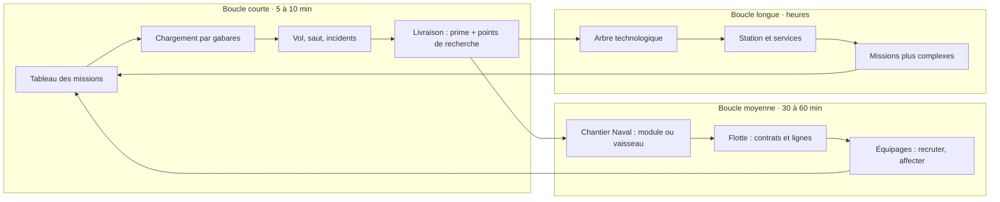
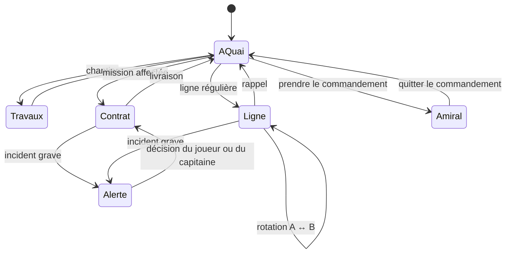
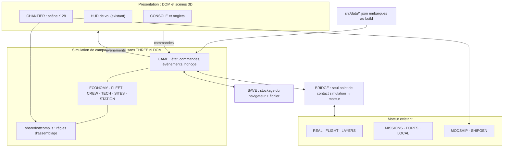
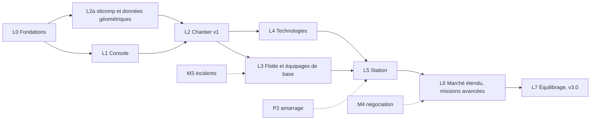
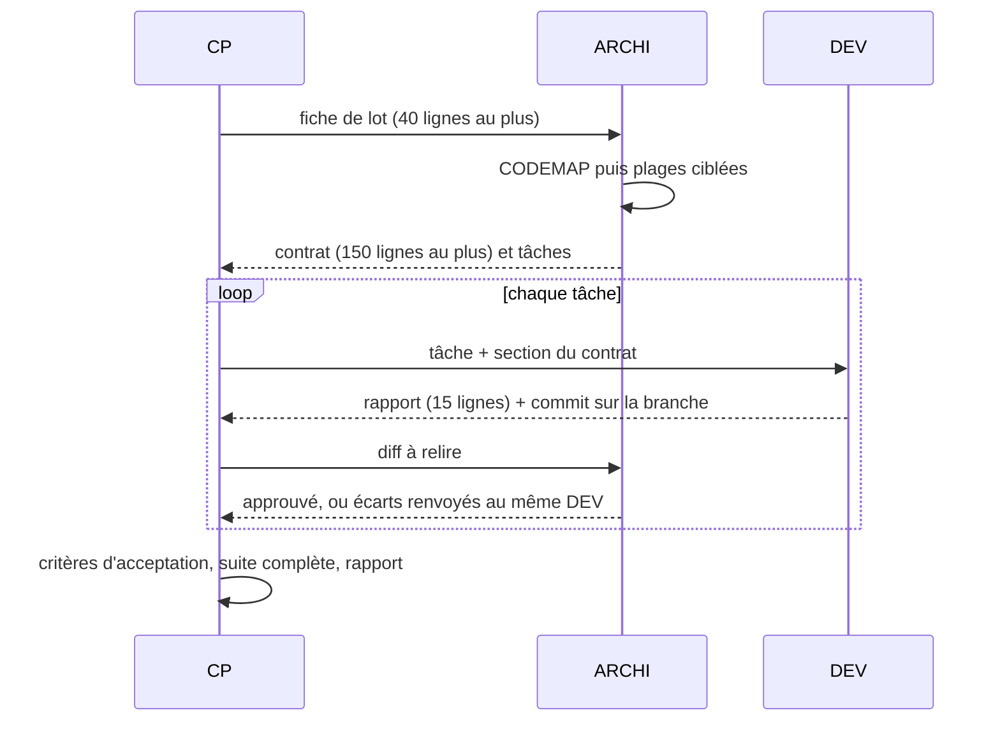

# SPEC-010 — Chantier Naval STT : campagne, flotte et architecture

2026-10-04 · Frédéric Delorme · réponse à SPEC-010 « arbre des technologies et missions »

> Version de travail pour les agents (CP, ARCHI, DEV). Relecture et commentaires : [Claude Doc](https://claude.ai/code/artifact/852ce71b-afb7-44ba-b78d-b41981473f89). Modèle d'équilibrage : `sources/tools/eco_sim.py`. Suivi : `PLAN-STATUS.md`.

Cette proposition intègre l'éditeur STT\_Modules dans *Space Travel & Transport* sous le nom **Chantier Naval STT**, et en fait le cœur d'une campagne de gestion : modules achetés, flotte, équipages, technologies, puis première station.

## 0. Cartouche et synthèse

|  |  |
| --- | --- |
| **Base** | jeu `stt_v2.17` (`sources/`), éditeur STT\_Modules (`STT_modules/sources/index.html`), assembleur `MODSHIP` (`09c-vaisseaux-modulaires.js`) |
| **Entrée** | SPEC-010 : scénario + propositions 1 (technologies), 2 (compétences), 3 (dialogue à onglets) |
| **Statut** | Proposition. Les valeurs marquées ⚑ sont à calibrer en jeu |
| **Rôles** | rédigé en rôles CP + ARCHI, à valider par le mainteneur |

**Décisions déjà prises (04/10/2026)** : flotte **hybride** (amiral piloté + flotte simulée, bascule possible) ; campagne **longue** (première station vers 6 h de jeu) ; livrables en Markdown dans `docs/specs/` **et** en Claude Doc ; plan + fichiers d'agents.

**Ce qui existe déjà et sert de socle** : les compositions de l'éditeur sont jouables (`MODSHIP`, familles, paliers, baies, stations en 4ᵉ archétype de port) ; le chantier naval vend les long-courriers ; les missions M1 tournent (M2 à M5 et l'amarrage P2 restent à faire) ; aucun système de sauvegarde de partie.

**Synthèse**

1. **Deux modes** : *Campagne* (nouveau, sauvegardé) et *Partie libre* (le jeu actuel, inchangé).
2. En campagne, le joueur démarre avec un **petit vaisseau modulaire** (le *Courlis*), l'agrandit au **Chantier Naval STT**, achète ou conçoit d'autres vaisseaux et les confie à des **capitaines recrutés**.
3. **Le design compte** : la masse pèse sur le carburant et l'accélération, le palier fixe l'équipage et le poste d'amarrage, le palier III ouvre le saut.
4. Un **arbre technologique** de 6 branches débloque des variantes de modules, des types de missions et des métiers.
5. Avec **3 vaisseaux** et la techno *Ingénierie orbitale*, le joueur fonde sa **station** sur une planète choisie parmi 3 à 5 candidates notées (ressources, passagers, risque). Sa propre flotte la construit par des missions d'approvisionnement.
6. Une **console de bord unique à onglets** remplace les overlays actuels (chantier, contrats, port, carte, aide, audio).
7. **Architecture** : portage natif de l'éditeur sur three r128 en réutilisant `MODSHIP`, règles d'assemblage dans un module partagé `shared/sttcomp.js` (source unique éditeur ↔ jeu), nouvelle couche **simulation de campagne** sans THREE ni DOM, testable sous Node, catalogues en JSON.
8. **Plan** en 8 lots (L0 à L7, de `stt_v2.18` à `stt_v3.0`), agents CP (Haiku), ARCHI (Opus), DEV (Sonnet), avec carte de code et fiches de lot pour limiter ce que chaque agent lit.

## 1.1 Principes, modes et boucle de jeu

### Principes directeurs

1. **Piloter reste le plaisir central.** La gestion sert le vol, jamais l'inverse : un vaisseau piloté rapporte toujours plus que le même vaisseau automatisé (rendement 65 % ⚑).
2. **Ce qu'on assemble est ce qu'on pilote.** Les masses réelles des modules pèsent sur le vol, le carburant et les ports accessibles.
3. **Le jeu décide, le LLM raconte.** Règle déjà en place pour les missions, étendue au recrutement et aux incidents de flotte.
4. **Déterminisme.** Même graine, mêmes planètes candidates et mêmes offres ; le hasard de partie passe par `RNG.game(tag)` (proposition F du DAT).
5. **Ouverture progressive.** Chaque acte ajoute une couche : module, flotte, équipages, technologies, station.

### Deux modes

| Mode | Démarrage | Économie | Sauvegarde |
| --- | --- | --- | --- |
| **Campagne** (nouveau) | *Courlis* modulaire CMD-CARGO-PWR-PROP (palier I, 4 conteneurs), 4 000 CR ⚑, au port d'une planète habitable | modules payants, technologies, salaires, entretien | automatique + 3 emplacements + export JSON |
| **Partie libre** (actuel) | sélecteur du hangar, tous les modèles | règles v2.17 inchangées | aucune, comme aujourd'hui |

Les vaisseaux procéduraux (Carrelet, Basalte…) restent : trafic ambiant, et en campagne **marché de l'occasion** (moins chers, non modifiables). Ils enrichissent l'offre sans travail 3D.

### Boucles imbriquées



### Progression en actes (campagne)

| Acte | Heure de jeu ⚑ | Situation | Ce qui s'ouvre |
| --- | --- | --- | --- |
| **I · Indépendant** | 0 à 1 h 45 | un vaisseau, missions locales | Chantier (modifier son vaisseau), premières technologies, marché de l'occasion |
| **II · Armateur** | 1 h 45 à 4 h | 2 vaisseaux, premier capitaine | onglet Flotte, lignes régulières, palier III et kit de saut, missions entre systèmes |
| **III · Compagnie** | 4 h à 6 h | 3 vaisseaux ou plus | recherche de site, sigle et livrée de compagnie (éditeur de compagnie existant), missions en chaîne |
| **IV · Base** | 6 h à 9 h | station fondée | services de station, laboratoire, recrutement élargi, chantier à domicile |
| **V · Expansion** | 9 h et plus | réseau | modules industriels, deuxième station, contrats stratégiques, militaire |

La campagne reste ouverte, sans victoire imposée. Des **objectifs de compagnie** servent de jalons visibles (flotte de 6, 1 M CR de valeur, toutes les branches au palier III…).

## 1.2 Chantier Naval STT en jeu

### Accès et modes

- Onglet **Chantier naval** de la console. Les travaux exigent d'être **à quai** dans un port doté du service *Chantier* (ports modulaires et ports des planètes habitables industrielles, environ 40 % des ports ⚑) ou à sa propre station. Ailleurs, l'onglet sert à concevoir des plans, sans travaux.
- Trois modes :
  - **Modifier** le vaisseau à quai ;
  - **Nouveau vaisseau** : coque vierge, plan de la bibliothèque, ou modèle de `fleet.json` (Meridian, Aurora, Longreach…) ;
  - **Station** : ouvert après la fondation (§ 1.6).

### Écran

```
┌ CHANTIER NAVAL STT ─ Comptoir β-4 ─────────────────── Crédits 12 480 CR ┐
│ [Modifier ▸ Courlis] [Nouveau] [Station 🔒]          [Plans] [Annuler]│
├─────────┬───────────────────────────────────────────┬──────────────┤
│ MODULES │                                           │ FICHE        │
│ CMD   9k│     vue 3D (scène du jeu, MODSHIP)        │ Masse 990 t  │
│ CARGO 8k│     fantôme holographique aimanté         │ Palier II    │
│ CRG6  🔒│     au port libre le plus proche          │ Équipage 4   │
│ TANK  7k│                                           │ Conteneurs 8 │
│ PWR   6k│                                           │ Autonomie ▮▮▯│
│ PROP 16k│                                           │ Poste M      │
│ …       │                                           │ ⚠ poussée    │
├─────────┴───────────────────────────────────────────┴──────────────┤
│ Travaux : +CARGO 8 000 · revente 0 · main-d'œuvre 400 · durée 2 min │
│                                     [Valider les travaux  8 400 CR]  │
└──────────────────────────────────────────────────────────────────┘
```

Ce qui est repris de l'éditeur : glisser-déposer avec fantôme, clic pour empiler, raccourcis `R` `P` `Suppr` `F` `Ctrl+Z`, inspecteur (roulis, porte de baie, marques de conteneurs), contrôles. Ce qui reste dans l'éditeur autonome : prise de vue, travellings, planète d'arrière-plan, filtres d'image.

### Catalogue et prix ⚑

| Module | Prix (CR) | Disponible |
| --- | --- | --- |
| TUNNEL · NODE4 | 1 500 · 4 000 | dès le départ |
| CMD · PWR · TANK | 9 000 · 6 000 · 7 000 | dès le départ |
| CARGO (4 conteneurs) | 8 000 | dès le départ |
| PROP (propulsion à fusion) | 16 000 | dès le départ |
| ELBOW · NODE6 | 3 000 · 5 500 | techno *Structures modulaires* |
| CRG6 (6 conteneurs en étoile) | 11 000 | techno *Arrimage radial* |
| PAX (48 passagers) | 12 000 | techno *Habitabilité* |
| BAY · SHUTTLE | 10 000 · 7 500 | techno *Engins de baie* |
| Kit de saut (sur PROP, palier III ou plus) | 18 000 | techno *Saut quantique* (prix actuel du module de saut) |
| Anneaux de distorsion | 26 000 | techno *Distorsion* |

**Variantes Mk II** débloquées par les technologies : même maillage, statistiques améliorées, marquage distinct (décal « MK II »), prix × 1,6. Exemples : PROP Mk II (+20 % poussée, −10 % consommation), TANK Mk II (+25 %), CARGO frigorifique (denrées premium), PAX Luxe (VIP), blindage de coque. Les **nouveaux maillages** (raffinerie, serre, laboratoire, tourelle) viendront plus tard par la chaîne Blender existante (`build_game_pack.py`).

### Travaux

- **Coût** = modules ajoutés + main-d'œuvre 5 % ⚑ − revente des modules retirés (60 % de leur valeur, usure déduite ⚑).
- **Durée** : 2 min réelles par module ⚑, vaisseau indisponible. Pendant ce temps, le joueur peut piloter un autre vaisseau de sa flotte ; option « travaux express » à +50 %.
- **Contrôles** de l'éditeur repris tels quels. Erreurs bloquantes : jet sur un module, chevauchement, station avec PROP. En campagne, un vaisseau doit aussi avoir un CMD et un PROP (avertissement de l'éditeur durci en erreur).
- La **livrée** et les conteneurs portent la compagnie du joueur (éditeur de compagnie personnalisée existant : nom, sigle, couleur, emblème).

### Le design a des effets en jeu

| Caractéristique | Source | Effet |
| --- | --- | --- |
| Masse en charge | `shipSpecs()` existant | accélération = poussée / masse ; consommation proportionnelle à la masse ⚑ |
| Palier I à IV | règle existante (800 / 1 300 / 2 000 t) | équipage requis 2 / 4 / 6 / 10, poste S / M / L, taxes portuaires, saut à partir du palier III |
| Conteneurs, passagers, m³ | `m.cap`, `cargoSpec()` | taille des missions proposées |
| Famille | règle existante | types de missions accessibles |
| Baies et navettes | `b.docks` | livraison directe sans attendre les gabares ; plusieurs baies = déchargement en parallèle |
| Poussée décentrée | avertissement de l'éditeur | dérive en vol, +5 % de carburant ⚑ |
| Valeur | somme des modules | entretien 0,4 %/h ⚑, revente |

### Plans

- Les plans sont des fichiers `stt-composition` (format inchangé), gardés dans la sauvegarde. Un plan conçu dans l'éditeur web s'importe en campagne, mais il **se paie**, et un module verrouillé bloque sa construction.
- Les modèles de `fleet.json` sont vendus comme plans prêts : prix = somme des modules −10 %.

## 1.3 Flotte hybride

Le joueur pilote un **amiral**. Les autres vaisseaux exécutent des ordres, simulés hors écran, et il peut **prendre le commandement** de l'un d'eux.

### États d'un vaisseau



### Ordres de flotte

| Ordre | Effet | Conditions |
| --- | --- | --- |
| **Contrat** | exécute une mission du tableau du port où se trouve le vaisseau | capacité compatible, capitaine à bord |
| **Ligne régulière** | rotation entre deux ports (une nature de fret ou des passagers) ; le rendement baisse si plusieurs lignes saturent la même route ⚑ | capitaine ; techno *Logistique* au-delà de 2 lignes |
| **Secours** | ravitaille ou remorque un vaisseau en panne (reprend la demande du TODO du 20/09 : vaisseau-citerne) | une citerne dans la flotte |
| **Escorte** | suit l'amiral, visible en 3D, réduit le risque comme une SMP | techno *Sécurité I*, coque blindée |
| **Retour à la base** | rejoint la station, entretien gratuit | station fondée |

### Simulation hors écran

- Chaque ordre devient un **plan horaire** calculé une fois à l'affectation : distance / vitesse du modèle + escales.
- **Tick de campagne à 1 Hz**, sur le temps de jeu actif (pause exclue). Les événements sont tirés à l'affectation par `RNG.game('flotte:' + id + ':' + n)` : une partie se rejoue à l'identique.
- **Incidents** : les mineurs se résolvent selon les compétences de l'équipage. Les graves (pirates, avarie majeure) lèvent une **alerte** (badge sur la console) : le joueur choisit sans pause forcée, et sans réponse sous 90 s ⚑, le capitaine applique son choix par défaut (selon son trait).
- **Résultat** : prime × rendement 65 % ⚑ × bonus du capitaine, carburant, usure (niveau `shipwear` mémorisé), 1 point de recherche par mission.
- **Pas de progression hors ligne** au départ (simple, sans abus possible). Option ultérieure : rattrapage plafonné à 1 h.

### Prendre le commandement

- Possible quand l'amiral et le vaisseau visé sont **dans le même port ou la même station** : courte séquence de transfert avec la navette de baie existante (10 s, passable).
- Avec la techno *Liaison à distance* (Organisation III) : bascule depuis n'importe où.
- L'ancien amiral garde son ordre en cours s'il a un capitaine, sinon il reste à quai.

### Visibilité et budget de rendu

- Un vaisseau de la flotte présent **dans le système de l'amiral** est instancié en 3D par le trafic ambiant de L9 : **2 au plus** ⚑. Les autres sont des balises sur le radar et la carte.
- Un vaisseau modulaire coûte 67 à 130 appels de dessin. Au-delà de 2 vaisseaux visibles : silhouette fusionnée en une maille (LOD, § 12 de `STT_INTEGRATION.md`) ou balise seule.
- La carte 2D montre la flotte (icônes, trajets) ; l'onglet Flotte réunit liste et carte.

### Limite de taille

La flotte est bornée par les **postes d'amarrage** possédés (station) plus 2 postes loués dans les ports publics (frais de stationnement ⚑). Agrandir la station devient donc un objectif concret.

## 1.4 Équipages et marché des compétences

### Fiche d'un membre d'équipage

- **Identité** : nom (générateur `03`), portrait (avatars radio existants et variantes), planète d'origine.
- **Métier** et niveau 1 à 10, une compétence secondaire, un **trait** (Économe, Téméraire, Prudent, Charismatique, Bricoleur, Loyal, Ambitieux…).
- **Salaire** en CR par heure de jeu (métier × niveau^1,3 ⚑), **moral** de 0 à 100 (paie, confort, succès), **expérience**.
- Les aptitudes du joueur (conviction, courage, dextérité : § 7 de `spec-missions.md`) restent celles du capitaine-joueur ; l'équipage ajoute des bonus.

### Métiers et ouverture progressive (proposition 2)

| Palier du marché | S'ouvre avec | Métiers | Effet principal |
| --- | --- | --- | --- |
| **0 · Départ** | — | Pilote, Mécanicien, Officier de fret | manœuvres, usure réduite, primes |
| **1 · Armateur** | 2ᵉ vaisseau | Capitaine, Steward | commande d'un vaisseau automatisé ; satisfaction des passagers et VIP |
| **2 · Compagnie** | techno *Organisation I* | Négociateur, Agent de sécurité, Navigateur | négociation (M4), incidents pirates, sauts moins chers |
| **3 · Base** | station fondée | Technicien, Chercheur, Médecin, Recruteur | entretien, points de recherche, missions médicales, meilleurs candidats |
| **4 · Spécialistes** | technos dédiées | Scientifique, Agronome, Ingénieur industriel, Officier militaire | missions scientifiques, serre, raffinerie et fabrication, escorte armée |

### Recrutement

- **Bureau d'embauche** des ports (onglet Équipages) : 3 à 6 candidats par port, renouvelés à chaque escale (tirage `RNG.game` par port et par visite).
- La qualité des candidats dépend de la taille du port, de la réputation de la compagnie et d'un recruteur éventuel.
- **Entretien** : Gemini Nano rédige la biographie et répond aux questions libres du joueur. Le jeu fixe les statistiques ; une question pertinente (classée par le LLM) peut **révéler un trait caché**. Sans IA : fiche + 3 questions prédéfinies.
- **Salaire négocié** avec la mécanique de négociation de M4 (chance calculée).

### Règles

- **Effectif minimal** par palier : 2 / 4 / 6 / 10. En dessous, un vaisseau automatisé ne part pas ; l'amiral piloté subit un malus (−20 % de manœuvre, usure accrue).
- **Salaires** prélevés au tick économique (toutes les 5 min de jeu ⚑). Après 2 ticks impayés : moral en chute, puis démissions.
- **Progression** : expérience par mission réussie. Un capitaine de niveau 6 ou plus porte le rendement automatique de 65 à 75 % ⚑.
- **Affectation** par glisser-déposer dans l'onglet Équipages, vers un vaisseau ou la station.

## 1.5 Arbre technologique et missions de complexité croissante

### Recherche

- **Points de recherche (PR)** : 2 par mission pilotée, 1 par mission automatisée, bonus des **missions scientifiques** (relevés près d'une étoile, d'une géante, d'un champ d'astéroïdes : le vol existant suffit), puis laboratoire de station et chercheurs (PR par heure).
- **Une recherche à la fois**, file de 3. Coût payé au lancement (PR + CR), durée de 3 / 6 / 10 / 15 min selon le palier ⚑, pour créer de l'attente.
- **Spécialisation douce** : chaque techno acquise renchérit les suivantes de 8 % ⚑. Tout reste accessible, mais on choisit un ordre.
- Coûts ⚑ : palier I 8 PR + 3 000 CR ; II 25 PR + 10 000 CR ; III 50 PR + 25 000 CR ; IV 120 PR + 60 000 CR. Gains ⚑ : 2 PR par mission pilotée, 1 par mission automatisée, environ 4 PR/h de missions scientifiques.

### Les 6 branches (proposition 1)

| Branche | Palier I | Palier II | Palier III | Palier IV |
| --- | --- | --- | --- | --- |
| **Voyage** | Moteurs optimisés (reprend l'amélioration de vitesse existante) | Saut quantique (kit de saut) | Distorsion (anneaux) | Navigation profonde (portée +50 %, sauts enchaînés) |
| **Transport** | Arrimage radial (CRG6) · Habitabilité (PAX) | Engins de baie (BAY, SHUTTLE) · Fret frigorifique | Paquebots de luxe (PAX Luxe, VIP) | Logistique intégrée (lignes sans limite, gabares propres) |
| **Énergie** | Panneaux Mk II (PWR) | Fusion efficiente (PROP Mk II) | Réservoirs cryogéniques (TANK Mk II) | Réseau de station (énergie × 2, alimente l'industrie) |
| **Sécurité et militaire** | Blindage de coque | SMP interne (escorte par sa flotte) | Défense ponctuelle (tourelle, nouveau maillage) | Escadre (escorteurs armés, contrats militaires) |
| **Industrie** (minerais) | Prospection (relevés minéraux) | Raffinerie (module de station : minerais → métaux) | Fabrication (métaux → équipements) | Chantier orbital (construire à sa station, −20 %) |
| **Organisation et sciences** | Structures modulaires (ELBOW, NODE6) · Organisation I (marché palier 2) | Administration (lignes régulières, 2 postes loués de plus) | **Ingénierie orbitale** (fonder une station) · Liaison à distance | Laboratoire avancé · Agronomie orbitale (serre) · Académie (former des recrues) |

Dépendances transverses principales : *Saut quantique* exige *Moteurs optimisés* ; *Raffinerie* et *Laboratoire avancé* exigent *Ingénierie orbitale* ; *Escadre* exige *Défense ponctuelle* et *Fusion efficiente*. L'arbre est un fichier de données : de nouveaux modules s'y ajoutent sans code (§ 2.6).

### Les missions suivent l'arbre

| Rang | Missions | Ouvertes par |
| --- | --- | --- |
| **M-I** | livraison locale simple (M1 actuel) | départ |
| **M-II** | plusieurs escales, VIP, fret frigorifique avec délai | Transport I et II |
| **M-III** | entre systèmes, chaînes A → B → C, risque élevé avec SMP (M3) | Voyage II, Sécurité I |
| **M-IV** | industrielles (minerais vers raffinerie, équipements fabriqués), ravitaillement de stations tierces, scientifiques | Industrie II et III, Organisation III |
| **M-V** | stratégiques : approvisionnement de sa station, contrats de flotte (plusieurs vaisseaux), convois escortés, appels d'offres | station, Sécurité IV |

**Exigences visibles** : le tableau montre aussi des offres grisées avec ce qui manque (« Exige : CARGO frigorifique », « Exige : Médecin à bord »). Chaque offre manquée devient une raison d'aller au chantier, au laboratoire ou au bureau d'embauche.

## 1.6 Première station spatiale

### Conditions

**3 vaisseaux ou plus** (règle de SPEC-010), techno *Ingénierie orbitale*, crédits du noyau (140 000 CR ⚑ pour le gabarit standard).

### Choisir le site parmi les planètes proposées

Chaque planète reçoit un **profil économique déterministe**, dérivé de ce que le générateur produit déjà (type, habitabilité, lunes, anneaux), puis modulé par `rngFor(SEED + ':eco:' + cell + ':' + i)`.

| Type (existant) | Eau | Denrées | Minerais | Rares | Carburant | Population |
| --- | --- | --- | --- | --- | --- | --- |
| océanique | ●●● | ●● | ● | — | ● | ●● |
| continental | ●● | ●●● | ●● | ● | — | ●●● |
| désertique | — | ● | ●●● | ●● | — | ● |
| glacé | ●●● | — | ●● | ● | ● | — |
| volcanique | — | — | ●●● | ●●● | — | — |
| géante gazeuse | — | — | — | — | ●●● | — |

Lunes : +● de minerais par paire. Anneaux : +● d'eau. Les planètes habitables ont déjà une ville (`cityName`) : c'est la demande de passagers.

Le jeu ne propose que les sites qui passent **les trois seuils de SPEC-010** :

1. **Ressources** : au moins 2 ressources à ●● dans le système (planète et voisines).
2. **Passagers** : population ●● dans le système ou à un saut.
3. **Transport** : au moins 2 systèmes à portée de saut dont la demande complète l'offre du site.

Il en garde **3 à 5, variés** (un site sûr, un riche mais risqué selon `zoneRisk`, un carrefour de passagers…), dans un rayon de 2 sauts ⚑. La fiche compare ressources, demande, risque, coût et revenu estimé par heure ; un **survol cinématique** du site (module `SURVOL` existant) précède la décision. Fort effet visuel pour un coût faible.

### Construire : la flotte au travail

1. **Paiement du noyau** : un chantier orbital apparaît ; les modules s'affichent à mesure qu'ils sont livrés (la station se monte sous les yeux du joueur).
2. **Missions d'approvisionnement** (rang M-V, réservées à la flotte) : 24 conteneurs d'équipements, 16 de minerais, 10 réservoirs d'eau ⚑. Livrés par sa flotte, la matière ne coûte rien ; achetés sur place, +40 % ⚑. Les trois vaisseaux exigés trouvent ici leur rôle (cargo, citerne, passagers pour les ouvriers).
3. **Durée** : 30 à 45 min de jeu ⚑, jalons visibles (structure, énergie, habitat, postes).
4. **Inauguration** : séquence radio et gros plans (`GP` existant).

Le **gabarit standard** du noyau est CMD + NODE6 + PWR + BAY + TANK + NODE4 avec 2 postes, proche de *Vigil Relay*. Le joueur peut aussi dessiner son noyau en mode Station (minimum : CMD, PWR, un poste L ; jamais de PROP).

### Services de la station

| Module | Service | Effet |
| --- | --- | --- |
| Postes d'amarrage déclarés | base de la flotte | taille de flotte, entretien gratuit, carburant au prix coûtant |
| PAX | terminal passagers | missions passagers au départ de la station, logement des équipages |
| CARGO, CRG6 | entrepôt | stocker du fret, acheter bas et revendre haut, lignes régulières depuis la base |
| TANK | dépôt de carburant | vente au trafic ambiant : revenu passif ⚑ |
| BAY + SHUTTLE | navettes de surface | missions planète ↔ station sans mobiliser un vaisseau |
| Laboratoire, raffinerie, fabrique, serre (nouveaux maillages) | recherche et industrie | PR par heure, transformation des ressources du site (missions M-IV) |
| Bureau d'embauche | recrutement | candidats du palier 3 |

Techniquement, la station est une composition `stt-composition` rendue par `MODSHIP.stationPort` (4ᵉ archétype de port, budget de 60 appels de dessin), placée en orbite du site et enregistrée dans la sauvegarde. Elle s'agrandit au chantier, mode Station, avec les zones A / B / C de l'éditeur.

## 1.7 Économie et équilibrage

### Sources et puits

| Sources de crédits | Puits |
| --- | --- |
| primes de missions (piloté 100 %, automatisé 65 % ⚑) | modules, vaisseaux, technologies |
| revente de modules (60 %) | salaires (tick de 5 min) |
| services de station : carburant, passagers, entrepôt | entretien (0,4 %/h de la valeur), carburant, taxes portuaires |
| contrats stratégiques (M-V) | location de postes, travaux express |

### Modèle et hypothèses ⚑

Le modèle est un script livré avec cette proposition, `sources/tools/eco_sim.py` (Python, sans dépendance). Il rejoue la campagne minute par minute avec des valeurs moyennes, sans hasard.

- Durée réelle d'une mission : 6 min en local, 9 min entre systèmes (**à mesurer en jeu**).
- Prime par conteneur : 300 CR en local, 360 entre systèmes ; facteur distance 2,0 en local, 3,46 pour un saut de 8 pc (formule de `20q-missions.js`) ; remplissage moyen 66 %.
- Frais : 12 % de la prime. Rendement automatisé : 65 %. Salaires : 275 à 300 CR/h par membre, 600 CR/h pour un capitaine.
- Départ : 4 000 CR et le *Courlis* (valeur 39 000 CR).

### Courbe simulée

| Heure de jeu | Jalon | Coût | Revenu net après |
| --- | --- | --- | --- |
| 0 h 19 | + CARGO sur l'amiral (8 conteneurs, palier II) | 8 000 CR | 26 600 CR/h |
| 0 h 25 | Moteurs optimisés | 3 000 CR + 8 PR | 26 600 CR/h |
| 1 h 53 | 2ᵉ vaisseau, *Courlis* automatisé | 39 000 CR | 34 300 CR/h |
| 2 h 19 | + TANK + CARGO (palier III) | 15 000 CR | 47 500 CR/h |
| 2 h 32 | Saut quantique | 10 000 CR + 27 PR | 47 500 CR/h |
| 2 h 55 | kit de saut : missions entre systèmes | 18 000 CR | 63 500 CR/h |
| 2 h 58 | Habitabilité | 3 000 CR + 9 PR | 63 500 CR/h |
| 3 h 56 | 3ᵉ vaisseau, paquebot automatisé | 62 000 CR | 79 000 CR/h |
| 4 h 15 | Ingénierie orbitale | 25 000 CR + 63 PR | 79 000 CR/h |
| **6 h 02** | **noyau de station** | **140 000 CR** | — |

### Sensibilité (heure de la station)

| Paramètre | Variation | Station |
| --- | --- | --- |
| Durée des missions | −30 % / +30 % | 4 h 09 / 7 h 59 |
| Rendement automatisé | 50 % / 80 % | 6 h 18 / 5 h 48 |
| Salaires | × 1,5 | 6 h 12 |

### Lecture

- **La durée réelle des missions est le paramètre décisif.** La mesurer est la première tâche d'équilibrage (test Playwright chronométrant une mission en pilotage automatique, lot L0).
- **Point faible : le creux de 0 h 25 à 1 h 53**, un seul vaisseau et peu d'achats. À combler par des achats intermédiaires de 3 000 à 6 000 CR (recrues, Mk II, amélioration de vitesse existante, marché de l'occasion) et par les missions M-II.
- **Les points de recherche deviennent le goulot avant la station** (63 PR pour *Ingénierie orbitale*). C'est voulu : cela valorise les missions scientifiques.
- Toutes ces valeurs vivent dans `src/data/economy.json` (§ 2.6) : on rééquilibre en modifiant un fichier de données, puis on relance `eco_sim.py`.

## 1.8 Console de bord unifiée (proposition 3) et risques

### Principe

Une seule fenêtre à onglets, la **Console de bord**, remplace les overlays actuels : `shipyardOverlay`, `contractBoardOverlay`, `portPanel`, carte stellaire, `helpOverlay`, `audioOverlay`. Les **instruments de vol restent dans le HUD** (vitesse, moteurs, température, télémétrie, radio, objet proche, itinéraire, Lagrange) : ce sont des cadrans en temps réel, pas des dialogues.

```
┌─ CONSOLE DE BORD ─ Courlis · Comptoir β-4 ──────────────────── 12 480 CR · 37 PR ┐
│ Flotte² │ Navigation │ Missions │ Port │ Chantier │ Techno● │ Équipages │ … │
├─────────────────────────────────────────────────────────────────────────┤
│                      (contenu de l'onglet actif)                             │
├──────────────────────────────────────────────────────────────────────────┤
│ ⚠ Courlis 2 : pirates près de Kessel — [Payer] [Dérouter] [Escorte]  0:74   │
└──────────────────────────────────────────────────────────────────────────┘
```

### Onglets

| Onglet | Contenu | Touche ⚑ | Visible |
| --- | --- | --- | --- |
| **Flotte** | liste et carte, ordres, alertes, prise de commandement | F1 | dès le 2ᵉ vaisseau (avant : fiche du vaisseau) |
| **Navigation** | carte stellaire 2D, ciblage de saut | M, F2 | toujours |
| **Missions** | tableau du port, mission en cours, exigences | J, F3 | toujours |
| **Port** | carburant, réparation, gabares, SMP, occasion | F4 | à quai ou à proximité |
| **Chantier naval** | éditeur | F5 | à quai dans un chantier (ailleurs : plans) |
| **Technologie** | arbre, recherche en cours, file | F6 | campagne |
| **Équipages** | effectifs, bureau d'embauche, affectations | F7 | campagne |
| **Station** | site, construction, services, modules | F8 | après *Ingénierie orbitale* |
| **Journal** | radio, grand livre des finances, événements | L | toujours |
| **Aide · Réglages** | aide, audio, langue, qualité, sauvegardes | H, Échap | toujours |

- `Tab` ouvre la console sur le dernier onglet, `Échap` la ferme. Des **badges** signalent alerte de flotte, recherche terminée, nouveaux candidats.
- Les touches F1 à F8 basculent aujourd'hui les panneaux du HUD : elles passent aux onglets, et les panneaux du HUD gardent la barre d'icônes plus `Alt+1` à `Alt+8` (décision à valider, § 4).
- En vol, la console ne met pas le jeu en pause. Le Chantier coupe le rendu de vol (le vaisseau est à quai, § 2.7).
- Tactile : console plein écran, onglets en barre défilante, un seul panneau à la fois (demande du TODO v2.5). Les onglets non débloqués sont masqués.
- Charte McGivrer, comme le HUD existant.

### Risques de gameplay

| Risque | Effet | Parade |
| --- | --- | --- |
| La gestion étouffe le vol | le joueur vit dans les menus | rendement piloté supérieur, alertes non bloquantes, ordres répétables |
| Creux de l'acte I | lassitude | achats intermédiaires, missions M-II, objectifs |
| Économie qui s'emballe en fin de partie | plus d'enjeu | puits croissants, saturation des lignes, objectifs coûteux |
| Interface chargée sur mobile | illisible | plein écran, onglets masqués tant qu'ils sont verrouillés |
| Sauvegarde perdue (stockage du navigateur purgé) | frustration | export JSON proposé à chaque jalon, 3 emplacements |
| Plans importés surpuissants | déséquilibre | coût payé, verrous des technos, contrôles |
| LLM lent ou absent | blocage | repli sans IA systématique (règle déjà en place) |

## 2. Architecture cible

### 2.1 Contraintes

- Un fichier HTML autonome par produit, aucun chargement à l'exécution (DAT § 6).
- Le jeu tourne sur **three r128** en scripts classiques à portée globale ; l'éditeur sur **three r169** en modules ES chargés depuis un CDN (`importmap`). C'est le nœud du problème.
- Modules partagés dans `shared/` : source unique, comportement propre au jeu fourni par un objet hôte.
- 4 langues, repli sans IA, *Partie libre* et démo *Observation des étoiles* intactes.

### 2.2 Intégrer l'éditeur : trois options

|  | **A. Iframe embarquée** | **B. Portage natif + noyau partagé** ★ | **C. Passer le jeu en r169** |
| --- | --- | --- | --- |
| Principe | l'éditeur r169 empaqueté dans le HTML (`srcdoc`), dialogue par `postMessage` | règles d'assemblage extraites dans `shared/sttcomp.js` (sans rendu), vue 3D du chantier écrite sur r128 avec `MODSHIP` | migrer le moteur et `shared/` en r169, puis importer l'éditeur |
| Effort | M | L | XL |
| Poids ajouté au HTML | +1,2 Mo (three r169, addons, éditeur) | +60 Ko | négligeable |
| GPU et mémoire | 2 contextes WebGL, pack décodé deux fois : risque élevé sur mobile | 1 contexte, prototypes partagés | 1 contexte |
| Rendu | celui de l'éditeur, différent du vol | **celui du vol** : ce qu'on voit est ce qu'on pilote | meilleur à terme |
| Économie, verrous | injectés par messages, logique en double | natifs (lit l'état de campagne) | natifs |
| Risque | moyen : mémoire, focus clavier, synchronisation | moyen : portage du glisser-déposer | élevé : tout le moteur et la démo |
| Maintenance | deux versions de three | une règle, deux vues | une base |

**Recommandation : B.** Meilleur résultat visuel cohérent pour un coût modéré ; C reste la proposition K du DAT, plus tard. Le noyau partagé contient : graphe de pièces (`addPart`, `movePart`, `replacePart`, `deletePart`, ports libres, compatibilité), contrôles (OBB, SAT, jet contre OBB), fiche (masse, palier, famille, équipage), import et export `stt-composition`, et une mini-bibliothèque de matrices 4×4 (environ 80 lignes) qui le rend **indépendant de la version de three**. Les matrices des sockets et les boîtes de coque sont extraites du pack par `build_game_pack.py` dans `modules-geom.json` : le noyau tourne donc **sous Node**, et se teste sans navigateur.

### 2.3 Vue en couches



### 2.4 Modules

| Espace de noms | Fichier | Rôle | Test Node |
| --- | --- | --- | --- |
| `GAME` | `sim/00-game-state.js` | état de campagne, commandes, bus d'événements, horloge (tick 1 Hz) | oui |
| `RNG.game` | `sim/01-rng-game.js` | aléa de partie déterministe (DAT F) | oui |
| `DATA` | `sim/02-data.js` | lit `<script id="sttData">`, valide, expose les catalogues | oui |
| `SAVE` | `sim/03-save.js` | sérialisation versionnée, migrations, sauvegarde automatique | oui |
| `ECONOMY` | `sim/10-economy.js` | grand livre, prix, salaires, entretien | oui |
| `STTCOMP` | `shared/sttcomp.js` | règles d'assemblage, contrôles, fiche | oui |
| `FLEET` | `sim/20-fleet.js` | vaisseaux, ordres, simulation hors écran, commandement | oui |
| `CREW` | `sim/21-crew.js` | fiches, marché, salaires, effets | oui |
| `TECH` | `sim/22-tech.js` | arbre, recherche, déblocages | oui |
| `SITES` | `sim/23-sites.js` | profils économiques des planètes, candidats | oui |
| `STATION` | `sim/24-station.js` | construction, services | oui |
| `BRIDGE` | `game/45-campaign-bridge.js` | branche la simulation sur `installShip`, `MISSIONS`, `PORTS`, le trafic L9 | Playwright |
| `CONSOLE` | `ui/50-console.js` | cadre à onglets, badges, raccourcis, tactile | Playwright |
| onglets | `ui/51-tab-*.js` | un fichier par onglet | Playwright |
| `CHANTIER` | `ui/60-chantier.js` | scène 3D, palette, fantôme, inspecteur | Playwright |

**Règle structurante** : la simulation ne touche jamais THREE ni le DOM, et ne parle au moteur que par `BRIDGE`. Bénéfices : tests Node rapides, modules courts, et des agents qui modifient la logique sans lire le moteur.

### 2.5 État de campagne et sauvegarde

```json
{
  "v": 1, "seed": "…", "mode": "campaign", "clock": 18342.5,
  "company": { "name": "…", "mark": "…", "livery_hex": "#7b3fb3", "emblem": "star4", "reputation": 12 },
  "credits": 12480, "rp": 37,
  "ledger": [[18200, "mission", 1840], [18290, "salaires", -1100]],
  "flagship": "s1",
  "ships": [{ "id": "s1", "name": "Courlis", "comp": "c1", "wear": 0.12, "fuel": 0.8,
              "at": { "cell": "…", "port": "…" }, "order": null, "crew": ["p1", "p2"] }],
  "blueprints": { "c1": { "format": "stt-composition", "version": 1 } },
  "crew": [{ "id": "p1", "name": "…", "job": "pilote", "lvl": 3, "trait": "prudent",
             "salary": 280, "morale": 70, "xp": 120 }],
  "tech": { "done": ["voyage1"], "queue": [{ "id": "voyage2", "end": 19020 }] },
  "stations": [{ "id": "b1", "comp": "c7", "site": { "cell": "…", "planet": 2 },
                 "stage": "build", "delivered": { "equipements": 8 } }],
  "missions": { "active": null, "serial": 42 },
  "flags": { "tutorial": 3 }
}
```

- Clés : `stt.campaign.v1.auto` et `stt.campaign.v1.slot1` à `slot3` ; export et import de fichiers `.stt-save.json`.
- Sauvegarde automatique sur événement (mission livrée, achat, fin de travaux, arrivée au port) et toutes les 2 min, jamais pendant un saut.
- Champ `v` et table de migrations ; une sauvegarde plus récente que le jeu est refusée proprement.
- **Le monde n'est pas sauvegardé** : il se régénère par la graine. Une sauvegarde pèse moins de 50 Ko.

### 2.6 Données et build

- `src/data/` : `modules.json` (prix, déblocages, variantes Mk II), `tech.json`, `crew.json`, `economy.json`, `sites.json`, `missions.json` (rangs, exigences), `starters.json` (Courlis), `modules-geom.json` (sockets et boîtes, produit par `build_game_pack.py`).
- `build.py compile` les embarque dans `<script type="application/json" id="sttData">`, comme le pack, après une validation minimale (clés obligatoires, références croisées techno ↔ modules) qui échoue tôt.
- **Contrôle d'ordre** : chaque nouveau fichier déclare `/* @provides X @requires Y, Z */` ; `build.py` vérifie que chaque `@requires` est fourni plus haut dans `ORDER.txt`. C'est une version légère de la proposition H du DAT.
- **i18n** : le nouveau code utilise la seule table `I18N` (proposition I du DAT), avec un test de parité des 4 langues au build.
- `ORDER.txt` reçoit des sections `# sim` et `# ui` qui pointent vers `src/JS/sim/` et `src/JS/ui/`.

### 2.7 Le Chantier dans le moteur

- **Scène dédiée** (r128) : portique orbital procédural, éclairage du jeu, `postfx` partagé (bloom). Le vaisseau est construit par `MODSHIP`, le même code que le vol.
- **Une seule scène lourde par image** : onglet ouvert, `animate()` saute le rendu de vol (l'amiral est à quai, sa simulation est figée) ; à la fermeture, le vol reprend.
- **Recomposition incrémentale** : une modification n'instancie que la pièce ajoutée, depuis les prototypes fusionnés déjà en cache dans `MODSHIP` ; la fusion « une maille par matériau » n'a lieu qu'à la validation des travaux.
- Vignettes de la palette rendues une fois hors écran, gardées pour la session ; fantôme holographique en matériau additif ; collisions par `STTCOMP` (OBB, SAT), sans physique.

### 2.8 Simulation de flotte

- Tick à 1 Hz sur le temps actif ; chaque ordre précalcule ses échéances et ses incidents (`RNG.game`). Coût négligeable, moins de 0,1 ms par vaisseau.
- Instanciation 3D seulement dans le système de l'amiral, 2 vaisseaux au plus, par le trafic L9 ; `dispose()` à la sortie (`MODSHIP.keeps()` protège les prototypes).
- Indépendante du `dt` de rendu : la proposition D du DAT (pas fixe) n'est **pas** un prérequis.

### 2.9 Budgets de performance ⚑

| Poste | Budget |
| --- | --- |
| HTML ajouté (code et données) | 150 Ko lisibles au plus |
| Tick de campagne | 1 ms par seconde au plus |
| Chantier | 200 appels de dessin (vaisseau + portique) |
| Vaisseaux de flotte visibles | 2 (260 appels au plus) |
| Station du joueur | 60 appels (règle existante), puis `InstancedMesh` pour les conteneurs |
| Sauvegarde | 50 Ko, écriture en moins de 5 ms |
| Mémoire | aucune croissance sur 1 h de campagne automatique (test longue durée, DAT § 4.8) |

### 2.10 Arborescence cible

```
demos/space-travel/
  shared/sttcomp.js                 règles d'assemblage (nouveau, partagé avec l'éditeur)
  STT_modules/sources/index.html    éditeur autonome, lit shared/sttcomp.js
  sources/
    build.py                        + embarquement de src/data, contrôle @requires, parité i18n
    tools/eco_sim.py, codemap.py    équilibrage, carte de code pour les agents
    src/JS/game/                    moteur existant (inchangé hors points d'accroche)
    src/JS/sim/                     simulation de campagne (nouveau, sans THREE ni DOM)
    src/JS/ui/                      console, onglets, chantier (nouveau)
    src/data/*.json                 catalogues (nouveau) + compositions/ (existant)
    src/test/*_test.py              Playwright (existant + campagne, chantier)
    src/test/unit/*.test.mjs        Node : simulation et sttcomp (nouveau)
```

### 2.11 Lien avec le DAT

Repris en version minimale, comme prérequis : **F** (aléa de partie), **E** (état unique, limité à la campagne, sans réécrire les `let` existants), **H allégé** (contrôle `@requires`), **I** (i18n pour le nouveau code), **J** (tests Node et longue durée). Non requis : C, D, K.

## 3. Plan d'implémentation par agents

Le plan prolonge le mode *chef de projet / architecte / développeur* déjà décrit dans `AGENTS.md`, et lui ajoute des règles d'économie de tokens.

### 3.1 Rôles

| Rôle | Où | Modèle | Lit | Produit | Ne fait jamais |
| --- | --- | --- | --- | --- | --- |
| **CP** | session principale (`stt-cp`) | Sonnet, ou Haiku pour le suivi courant | `PLAN-STATUS.md`, fiche de lot, rapports | fiches de lot, affectations, suivi, rapport final | coder, relire du code |
| **ARCHI** | sous-agent `stt-archi` | Opus | `CODEMAP.md`, plages de fichiers ciblées, diffs | contrat de lot, découpage en tâches, revue | implémenter |
| **DEV** | sous-agent `stt-dev` | Sonnet (Haiku pour les tâches mécaniques : traductions, JSON) | la tâche et sa section du contrat | code, tests, rapport court | changer le périmètre ou la conception |

Un sous-agent ne peut pas en lancer un autre : le CP est donc la **session principale**, qui délègue à `stt-archi` et `stt-dev`.

### 3.2 Règles d'économie de tokens

1. **Liste noire de lecture.** Jamais : `*.min.html`, `sources/target/*.html`, `docs/spec-*-P1.md` (8,9 Mo, images en base64), `docs/specs/*-autonome.md` (0,8 à 1,8 Mo), `STT_ModuleLibrary.json` (8 Mo), `*.glb`, `archives/`, `observation-des-etoiles/engine/game.html`. Une seule lecture accidentelle de l'un d'eux coûte plus qu'un lot entier.
2. **Carte de code.** `sources/tools/codemap.py` génère `docs/specs/CODEMAP.md` (environ 300 lignes) : par fichier, globales fournies et consommées, fonctions avec numéros de ligne. Les agents lisent la carte, puis des **plages** (`sed -n 'a,bp'`), jamais un fichier entier de plus de 300 lignes.
3. **Messages bornés.** Fiche de lot ≤ 40 lignes, contrat ≤ 150 lignes, rapport de DEV ≤ 15 lignes, sur gabarits fixes (§ 3.6).
4. **Contrat d'abord.** L'ARCHI fige signatures, forme de l'état, événements et fichiers ; le DEV de la couche simulation n'a pas besoin de lire le moteur.
5. **Tests sous Node.** La simulation et `sttcomp` se testent avec `node --test` en quelques secondes, sortie limitée aux échecs. Playwright : un seul test ciblé par tâche qui touche moteur ou interface ; la suite complète en fin de lot.
6. **Le bon modèle au bon rôle.** Opus seulement pour l'ARCHI (peu d'appels, décisifs), Sonnet pour le DEV, Haiku pour le suivi et le mécanique.
7. **Continuer plutôt que relancer.** Les retours de revue vont au **même** agent DEV (`SendMessage`) : son contexte est conservé, rien n'est relu.
8. **Revue sur diff.** L'ARCHI lit `git diff --stat`, puis les seuls hunks concernés.
9. **Sorties de commandes bornées.** `build.py compile | tail -5`, tests en mode silencieux, `grep -m`. Captures seulement pour les tâches visuelles, à 960 px de large.
10. **Données plutôt que code.** Prix, technos, métiers, textes et équilibrage sont en JSON : petits diffs, modifiables par le mainteneur sans agent.
11. **Préfixe stable.** Fichiers d'agents et `CLAUDE.md` stables pour profiter du cache de prompt ; la fiche de lot vient en fin de message.
12. **Budget par lot** suivi dans `PLAN-STATUS.md` ; au-delà de +30 %, le CP s'arrête et demande.
13. **Points de conflit sérialisés.** `ORDER.txt`, `index.template.html` et `I18N` ne sont modifiés que par une tâche à la fois ; deux lots ne tournent en parallèle que s'ils ne les touchent pas.

### 3.3 Lots

| Lot | Contenu | Dépend de | Effort | Risque | Tokens ⚑ | Version |
| --- | --- | --- | --- | --- | --- | --- |
| **L0 Fondations** | `codemap.py` ; build (`sttData`, contrôle `@requires`, parité i18n) ; `GAME`, `RNG.game`, `DATA`, `SAVE` ; tests Node ; chronométrage des missions ; choix Campagne / Partie libre ; *Courlis* de départ | — | M | faible | 0,6 M | `stt_v2.18` |
| **L1 Console** | cadre à onglets, migration des 6 overlays, raccourcis, tactile | L0 | M | moyen (régressions d'interface) | 0,5 M | `v2.19` |
| **L2 Chantier v1** | `shared/sttcomp.js` extrait et éditeur autonome rebranché ; `modules-geom.json` ; onglet Chantier (modifier son vaisseau) ; prix, travaux, revente ; effets du design ; salaires et entretien | L0, L1 | L | moyen | 1,2 M | `v2.20` |
| **L3 Flotte + équipages de base** | nouveau vaisseau, onglet Flotte, ordres, simulation hors écran, alertes, commandement, visibilité L9 ; métiers des paliers 0 et 1, bureau d'embauche | L2 | L | moyen à élevé | 1,2 M | `v2.21` |
| **L4 Technologies** | `TECH` et onglet, points de recherche, déblocages et variantes Mk II, exigences de missions, rangs M-II et M-III | L2 | M | faible | 0,6 M | `v2.22` |
| **L5 Station** | `SITES` (profils, candidats, survol), construction par missions M-V, mode Station, services, base de flotte | L3, L4 | L | élevé | 1,1 M | `v2.23` |
| **L6 Marché étendu, missions avancées** | métiers des paliers 2 à 4, entretiens par Gemini Nano, M-IV et M-V, objectifs de compagnie | L5 | M à L | moyen | 0,9 M | `v2.24` |
| **L7 Équilibrage et version** | `eco_sim.py` calé sur les mesures, test d'une heure, captures, spec et README | tous | M | faible | 0,4 M | **`stt_v3.0`** |

Total : environ **6,5 M tokens** ⚑ (ordre de grandeur à ±50 %, sur la base d'un contrat de 15 k, de 8 à 12 tâches par lot à 60–120 k chacune, revue comprise).

**Articulation avec les lots déjà spécifiés** : M3 (moteur d'incidents) avant L3, dont les incidents de flotte le réutilisent ; P2 (amarrage) avant L5, pour accoster aux postes de la station ; M4 (négociation) avant L6, pour les salaires négociés.

### 3.4 Séquencement



Parallélisable sans conflit : L1 avec L2a (fichiers distincts) ; L3 avec la partie simulation de L4.

### 3.5 Déroulé d'un lot



### 3.6 Gabarits

```
LOT Lx — <titre>
But : …
Périmètre : …            Hors périmètre : …
Critères d'acceptation : 1. … 2. …
Entrées : SPEC-010 §…, CODEMAP.md, fichiers …
Budget : … k tokens
```

```
TÂCHE Lx.n — fait | bloqué
Fichiers : …
Vérifications : node --test (12/12), build ok, campagne_test.py ok
Écarts au contrat : aucun | …
Question : …
```

### 3.7 Fichiers d'agents fournis

- `.claude/agents/stt-cp.md`, `stt-archi.md`, `stt-dev.md`, à la racine du dépôt `csblog`.
- `demos/space-travel/docs/specs/PLAN-STATUS.md` : tableau de suivi tenu par le CP.
- Usage : lancer la session principale avec l'agent CP (`claude --agent stt-cp`, ou la consigne « agis en CP selon `.claude/agents/stt-cp.md` »), puis « démarre le lot L0 ».

### 3.8 Premier pas

L0, tâche 1 : `codemap.py` et le chronométrage des missions. Deux résultats utiles tout de suite : la carte de code sert à tous les agents, et la mesure conditionne tout l'équilibrage (§ 1.7).

## 4. Décisions à valider

| # | Sujet | Recommandation | Autres options |
| --- | --- | --- | --- |
| 1 | Intégration de l'éditeur | **B** : portage natif sur r128 + `shared/sttcomp.js` | A iframe (rapide, +1,2 Mo, 2 contextes WebGL) ; C passage en r169 (plus tard) |
| 2 | Départ de campagne | *Courlis* modulaire, 4 000 CR | vaisseau procédural actuel, modulaire seulement plus tard |
| 3 | Vaisseaux procéduraux en campagne | marché de l'occasion, non modifiables | retirés de la campagne |
| 4 | Progression hors ligne | aucune au départ | rattrapage plafonné à 1 h |
| 5 | Touches F1 à F8 | onglets de la console ; panneaux du HUD en `Alt+1` à `Alt+8` | F1 à F8 gardés aux panneaux, console sur `Tab` seulement |
| 6 | Construction de la station | missions d'approvisionnement de la flotte, achat sur place possible à +40 % | achat instantané |
| 7 | Taille de la flotte | bornée par les postes (station + 2 loués) | illimitée |
| 8 | Rendement automatisé | 65 %, 75 % avec un capitaine expérimenté | 50 % ou 80 % (§ 1.7, sensibilité) |
| 9 | Nouveaux maillages (laboratoire, raffinerie, serre, tourelle) | après L5, par la chaîne Blender | variantes Mk II seulement jusqu'à la v3.0 |
| 10 | Lots M3, P2, M4 déjà spécifiés | intercalés (§ 3.3) | reportés après la v3.0, avec des replis simplifiés |

**Prochaine étape** : valider ces décisions (un commentaire par ligne suffit), puis lancer L0.
