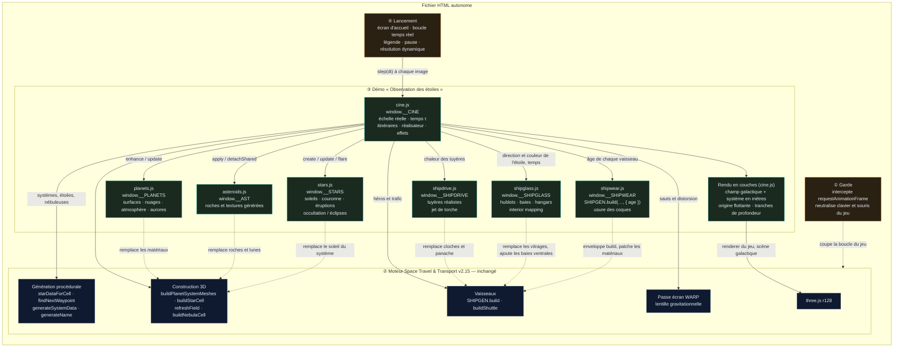
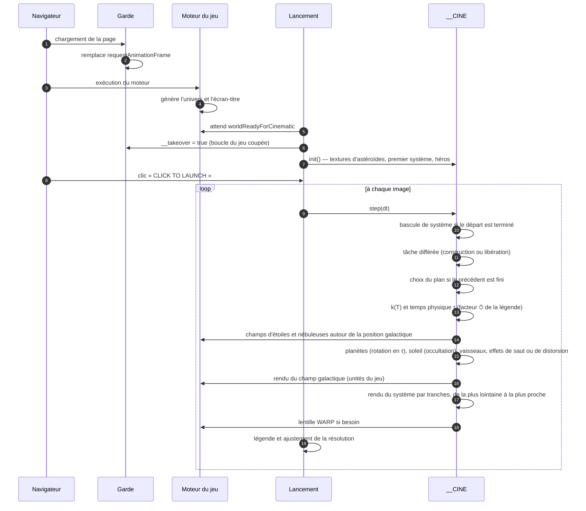
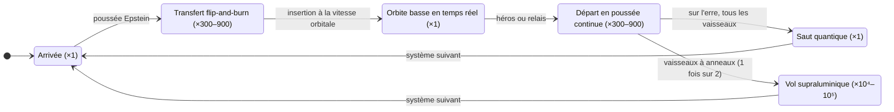
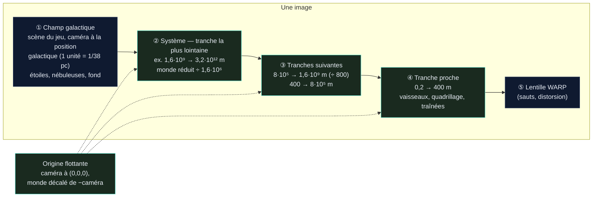

# Space Travel & Transport — *Observation des étoiles*

Démo cinématique **infinie** construite sur le moteur du jeu **Space Travel & Transport** (v2.15).
Aucune interface, aucun HUD : l'univers est généré en continu, des vaisseaux y circulent sur des trajectoires physiquement plausibles, et un réalisateur automatique choisit les plans comme au cinéma — tant qu'on ne ferme pas la page.

> (c) 2026 Frédéric Delorme & claude.ai — Music by ScoreStudio — Observation des étoiles

---

## Sommaire

1. [Fichiers](#fichiers)
2. [Lancer la démo](#lancer-la-démo)
3. [Paramètres d'URL](#paramètres-durl)
4. [Échelle réelle et temps accéléré](#échelle-réelle-et-temps-accéléré)
5. [Ce que montre la démo](#ce-que-montre-la-démo)
6. [Architecture technique](#architecture-technique)
7. [Chronologies de référence](#chronologies-de-référence)
8. [Performances](#performances)
9. [Limites connues](#limites-connues)
10. [Historique des versions](#historique-des-versions)
11. [Crédits et licences](#crédits-et-licences)

---

## Fichiers

| Fichier | Contenu |
|---|---|
| `observation-des-etoiles-v6.5.html` | Version courante (**échelle réelle**, **RCS**, **vaisseaux vieillis**, **moteurs réalistes**, **gros plans**, **géode pulsante**, **hublots et hangars réalistes**), code de la démo lisible et commenté |
| `observation-des-etoiles-v6.5.min.html` | Même version, scripts de la démo minifiés (terser) et CSS compacté |
| `observation-des-etoiles-v6.4.html` / `.min.html` | Gros plans et géode, vitrages plats d'origine |
| `observation-des-etoiles-v6.3.html` / `.min.html` | Moteurs réalistes, sans gros plans |
| `observation-des-etoiles-v6.2.html` / `.min.html` | Vaisseaux vieillis, tuyères d'origine du jeu |
| `observation-des-etoiles-v6.1.html` / `.min.html` | Échelle réelle et RCS, flotte neuve |
| `observation-des-etoiles-v6.html` / `.min.html` | Échelle réelle, sans RCS |
| `observation-des-etoiles-v5.html` / `.min.html` | Version précédente (échelle du jeu, soleils agrandis) |
| `observation-des-etoiles-v4.html` / `.min.html` | Sans soleils « cinéma » ni éclipses |
| `observation-des-etoiles-v3.html` / `.min.html` | Version stabilisée (sans aurores) |
| `space-travel-universe-tour.html` | Première démo : visite scénarisée de 60 s en boucle (plans fixes) |

Chaque fichier est **autonome** (≈ 7 Mo) : moteur du jeu, three.js r128, musique et code de la démo sont embarqués. L'essentiel du poids vient de la piste musicale encodée en base64 ; la minification ne fait gagner qu'environ 65 Ko (code de la démo : 241 Ko → 169 Ko).

Seules les polices *JetBrains Mono* / *Inter* sont chargées depuis Google Fonts (police système en repli si hors ligne).

### Package source (`observation-des-etoiles-v6.5-projet.zip`)

```
observation-des-etoiles/
├── README.md                              ce document
├── observation-des-etoiles-v6.5.html      version lisible (prête à ouvrir)
├── observation-des-etoiles-v6.5.min.html  version minifiée
├── package.json                           outils : terser, clean-css, playwright (tests)
├── engine/game.html                       build v2.15 du jeu (moteur, three.js r128, musique) — entrée du build, jamais modifiée
├── src/                                   code de la démo, dans l'ordre d'assemblage
│   ├── head_guard2.js                     ① garde (boucle, clavier, souris du jeu)
│   ├── planets.js · asteroids.js · stars.js
│   ├── shipdrive.js · shipglass.js · shipwear.js   options du générateur de vaisseaux
│   ├── cine.js                            simulation, réalisateur, rendu en couches
│   └── live2.js                           ④ écran d'accueil, boucle temps réel, légende
├── build/build.py · build/build_min.js    assemblage → dist/
├── tests/                                 harnais Playwright + SwiftShader (rendu logiciel)
└── docs/                                  planches d'images des versions 6.1 à 6.5
```

Reconstruire : `python3 build/build.py` (aucune dépendance) puis `npm install` et `node build/build_min.js` ; les fichiers sortent dans `dist/`. Tests : `node tests/smoke.js` (démarrage et 200 s de simulation sur la version minifiée), `node tests/longrun.js LONG-10` (20 min simulées : erreurs, mémoire, types de plans), `node tests/shots.js OBS-9 30:dockClose@x1:2` (plans forcés, captures), `node tests/hangar.js l20 0.5 "…"` (vaisseau isolé sous plusieurs angles), `node tests/geode.js`, `node tests/fleet.js` et `node tests/drawcalls.js`.

---

## Lancer la démo

1. Ouvrir le fichier HTML dans un navigateur récent avec WebGL (Chrome, Edge, Firefox, Safari).
2. Attendre la fin de **GENERATING UNIVERSE…** (génération du monde + textures d'astéroïdes, 1 à 2 s).
3. Cliquer sur **▶ CLICK TO LAUNCH** (le clic est nécessaire pour autoriser la musique).

| Touche | Action |
|---|---|
| `Entrée` / `Espace` (écran d'accueil) | Lancer |
| `Espace` | Pause / reprise (musique comprise) |
| `F` | Plein écran |

Toutes les autres entrées clavier / souris sont neutralisées : le jeu tourne « en arrière-plan » mais ne peut pas être démarré par erreur.

---

## Paramètres d'URL

À ajouter à la fin de l'adresse, par exemple `observation-des-etoiles-v6.5.html?seed=OBS-1&quality=low`.

| Paramètre | Valeurs | Effet |
|---|---|---|
| `seed` | texte libre | Graine de l'univers : même graine = même univers **et** même film. Sans graine, un univers neuf à chaque chargement. |
| `quality` | `low` · `high` | `low` : résolution plafonnée à 60 % (portables, GPU intégrés). `high` : jusqu'à 2× sur écrans haute densité. Par défaut : jusqu'à 1,5×. |
| `music` | `0` | Coupe la musique. |
| `traffic` | `0` | Supprime le trafic ambiant (navettes, remorqueurs, cargos) et les relais entre vaisseaux. |
| `ftl` | `warp` · `jump` | Impose le mode de départ : vol supraluminique (si le vaisseau en est équipé) ou saut quantique. |
| `aurora` | `all` | Met des aurores sur toutes les planètes à atmosphère (utile pour les tester). |
| `age` | `0` à `1` | Impose l'âge de toute la flotte (0 = sortie de chantier, 0,5 = usée, 1 = épaves en fin de vie). Par défaut : mélange réaliste. |

---

## Échelle réelle et temps accéléré

Depuis la v6, **tout est à l'échelle réelle** : 1 unité = 1 mètre dans les systèmes stellaires, et les distances entre étoiles sont celles du champ d'étoiles du jeu (1 unité du jeu = 1/38 parsec, l'échelle déjà utilisée par le moteur pour les magnitudes apparentes).

| Objet | Taille / distance | Origine |
|---|---|---|
| Étoiles | rayon du moteur en rayons solaires (R☉ = 695 700 km) : naines rouges ≈ 0,1–0,5 R☉, étoiles de type solaire ≈ 1 R☉, géantes 10–20 R☉, supergéantes > 100 R☉, naines blanches ≈ 0,01 R☉ | données stellaires du jeu (température, luminosité, classe) |
| Planètes rocheuses | 0,45 à 1,65 rayon terrestre (2 900 à 10 500 km) | rayon du jeu converti |
| Géantes gazeuses | 3,8 à 11,8 rayons terrestres (de Neptune à Jupiter) | rayon du jeu converti |
| Orbites | planète habitable à √L unités astronomiques (zone habitable), autres planètes espacées d'un facteur 1,5 à 2,2 (loi de type Titius-Bode), jamais à moins de 8 rayons stellaires | directions orbitales du jeu conservées |
| Lunes | 0,18–0,3 rayon planétaire autour d'une planète rocheuse (comme la Lune), ≈ 0,03 autour d'une géante (comme les satellites galiléens) ; orbites képlériennes à 18–60 rayons (6–30 autour des géantes), périodes de quelques jours à un mois | nombre de lunes du jeu |
| Ceintures d'astéroïdes | entre deux orbites réelles (souvent 1 à 10 UA) ; vue de près, un amas local : un astéroïde de 6 à 28 km et ses fragments | bornes du jeu transposées |
| Vaisseaux | dimensions du générateur de coques, en mètres : 60 m (remorqueur léger) à 240 m (*Long spine freighter*), navettes ≈ 25 m | `SHIPGEN` |
| Atmosphères, nuages, aurores | atmosphère ≈ 95 km pour une Terre, nuages à 10, 20 et 35 km, aurores de 95 à 290 km | proportions terrestres |

Conséquences visibles : de l'orbite basse (300 à 600 km), la planète occupe la moitié du ciel ; à l'arrivée (32 à 60 rayons, la distance Terre-Lune), elle n'est qu'un disque de 2° ; l'étoile vue d'une planète habitable fait un demi-degré (bien plus pour une naine rouge proche ou une géante) ; une éclipse totale se voit depuis l'ombre d'une lune, comme sur Terre.

### Temps physique et facteur affiché

Les trajets réels durent des heures (un transfert *flip-and-burn* à 1 g jusqu'à l'orbite basse : 2 à 4 h, pointe à 50–70 km/s) et une traversée supraluminique des jours. La démo distingue donc :

- **T**, le temps à l'écran ;
- **τ**, le temps physique, qui avance de `k(T)` secondes par seconde affichée.

Le facteur `k` est défini par des nœuds lissés (intégrale exacte), calculés à la planification de chaque visite pour que la durée physique de chaque manœuvre tienne dans la durée du plan :

| Phase | Facteur typique |
|---|---|
| Arrivée, orbite, saut quantique | ×1 — **temps réel** (un vaisseau en orbite basse file à 7–8 km/s : la surface défile lentement, comme depuis une station) |
| Transfert vers l'orbite, départ vers le point de saut | ×300 à ×900 |
| Vol supraluminique (1 200 à 3 000 c) | ×30 000 à ×300 000 |

Quand le temps est accéléré, la légende l'indique à droite du lieu : **`⏱ ×480`** (mis à jour en continu, sans refaire le fondu de la légende). Rotation des planètes (jours de 9 à 44 h), orbites des lunes et du trafic, évolution des nuages suivent τ ; les effets visuels (sauts, éruptions, aurores, vagues) restent en temps écran. Pour garder des images lisibles, la rotation propre des planètes est plafonnée à ×400 et celle des lunes à ×3 000.

---

## Ce que montre la démo

### Itinéraires générés à l'infini

Chaque étape (≈ 70 à 90 s) suit le même schéma, avec des paramètres tirés au hasard :

1. **Arrivée** à 32–60 rayons de la planète visée (12–22 pour une géante), par le flanc, par saut quantique (l'espace se creuse, éclair, le vaisseau apparaît) ou en sortie de distorsion.
2. **Transfert** vers une planète (habitée 7 fois sur 10) en *flip-and-burn* accéléré (×300–900) : poussée Epstein de 0,5 à 3 g selon le modèle, coupure et retournement de 180°, freinage tuyères en avant, **insertion à la vitesse orbitale réelle**. Trajectoire en courbe de Bézier paramétrée par l'abscisse curviligne, qui contourne planètes, anneaux et étoile.
3. **Orbite basse** (1,05–1,1 rayon, sous les anneaux des géantes) en **temps réel** pendant 18 à 26 s, commencée côté jour.
4. **Départ** en poussée continue accélérée vers un point de saut à 25–45 rayons, dans la direction de l'étoile suivante (choisie par le générateur d'itinéraires du jeu, à 18–40 parsecs), puis 3 s d'erre en temps réel.
5. **Saut quantique** « sur l'erre » ou **vol supraluminique** vers le système suivant, qui a été préparé en arrière-plan ; l'ancien est libéré dès que le nouveau est à l'écran.

**Relais** : 3 fois sur 10, un autre vaisseau en orbite prend le départ ; la caméra le suit dans le système suivant, l'ancien héros reste sur place.

**Trafic ambiant** par système, sur des orbites képlériennes réelles : 3 navettes en orbite basse autour de la planète habitée, 1 à 2 remorqueurs, 1 à 2 cargos en navette perpétuelle *flip-and-burn* entre l'orbite basse et une station haute (3,5–7 rayons).

**Noms** : types issus du catalogue du jeu (*Warehouse freighter*, *Long spine freighter*, *Ice tanker*, *Liner*…), noms générés à partir des banques de noms du jeu (*R.S.C. Ventaris*, *C.S.V. Etoilea*…).

### Réalisation automatique

Les plans durent de 5 à 8 s et sont choisis selon la phase du vol :

| Famille | Plans |
|---|---|
| Suivi du vaisseau | poursuite, travelling latéral, caméra « fixe » en formation (temps réel seulement), face, caméra en orbite autour du vaisseau, plan large en formation devant une planète ou l'étoile |
| Proches d'une planète | plongée par-dessus l'épaule (horizon en travers du cadre) ; en orbite, les plans latéraux et orbitaux se placent de préférence du côté extérieur pour garder la planète en fond |
| Événements | arrivée par saut, saut quantique (plan en surplomb pour voir le quadrillage), départ en distorsion, poursuite / côté / face en distorsion, sortie de distorsion, **transit du vaisseau devant son étoile** (longue focale) |
| **Gros plans** (v6.4–v6.5) | travelling au ras de la coque, tour des tuyères, proue en légère contre-plongée, bloc RCS pendant un retournement, géode du cœur de saut, **plongée dans une baie de hangar** (voir ci-dessous) |
| Plans de coupe | trafic ambiant (≈ 1 plan sur 4, en temps réel uniquement) |
| Découverte sans vaisseau | orbite lente autour d'une planète, rase-nuages à 60–95 km au lever d'étoile, **aurores vues de nuit à ~50 km d'altitude**, survol d'un astéroïde et de ses fragments, lune devant sa planète, dérive au bord d'une nébuleuse (plan purement galactique) |
| Étoiles et éclipses (sans vaisseau) | approche de la photosphère, **éruption vue de profil au limbe**, **éclipse totale par une lune**, **lever d'étoile derrière une planète**, transit d'une petite lune devant le disque |

Les travellings de découverte représentent environ un plan sur quatre (plus souvent juste après une arrivée, comme plan d'installation) ; tous les vaisseaux sont alors masqués et un même travelling n'est pas répété dans un système. Quand la géométrie le permet, une éclipse totale est proposée en priorité (une par système), et les étoiles de type solaire (F, G, K) reçoivent davantage de plans d'étoile. Pendant un retournement *flip-and-burn*, le réalisateur préfère les plans latéraux, orbitaux ou larges aux plans de poursuite ; la caméra ne descend jamais sous la couche nuageuse.

#### Gros plans — v6.4

Caméras placées **dans le repère du vaisseau**, toujours hors de sa boîte englobante (jamais dans la coque), à 7–25 % de sa longueur : elles suivent chaque mouvement, retournements compris, et restent utilisables en temps accéléré. Dans 85 % des cas elles se placent **du côté éclairé par l'étoile**.

| Plan | Cadrage | Phases où il est proposé (poids) |
|---|---|---|
| `hullDolly` | travelling le long d'un flanc : tôles, rouille, treillis, conteneurs | orbite (2,2), transfert (1,3), départ (1,2), retournement (1) |
| `engineClose` | lente rotation autour des tuyères : tubes de refroidissement, bobines, col incandescent, départ du jet | départ (2), transfert (1,8), retournement (1), orbite (0,8) |
| `bowClose` | proue, lente avancée | orbite (1,3), transfert (0,8), départ (0,6) |
| `rcsClose` | bloc RCS le plus en avant (60 %) : bouffées et gaz qui reste en arrière | retournement (2,4) |
| `geodeClose` | géode du cœur de saut sur son mât | orbite (0,6) ; séquence de saut (ci-dessous) |
| `dockClose` (v6.5) | en biais sous (ou à côté de) une baie de hangar, lente avancée : profondeur du hangar, nacelle arrimée, balisage ; baie latérale du *Vagabonde* filmée entre la coque et les nacelles | orbite (1,4), départ (0,7), transfert (0,6) ; aussi en plan de coupe sur le trafic |

Un gros plan n'est proposé que si le vaisseau possède l'élément filmé (tuyères du générateur, blocs RCS, géode, baie de hangar) ; sinon le réalisateur se replie sur le travelling de coque. Les gros plans occupent environ **20 % du temps d'antenne** (mesuré sur 2 × 20 min simulées) ; ils sont exemptés de la durée minimale de plan, comme les plans d'arrivée.

**Séquence de saut en gros plan** : quand un vaisseau équipé d'une géode part en saut quantique, le réalisateur choisit 7 fois sur 10 un découpage en trois temps — gros plan d'approche (moteurs, coque ou proue), puis **gros plan sur la géode pendant la charge**, puis plan large du saut 0,35 s avant le repli de l'espace.

**Caméras co-mobiles** : à l'échelle réelle, un vaisseau en orbite parcourt environ 80 fois sa longueur par seconde, bien plus en accéléré. Les plans « fixes » (arrivée, saut, plan en formation) sont donc tenus dans le repère qui se déplace avec le vaisseau, comme une caméra volant en formation ; les plans rasants (nuages, aurores) et les coupes sur le trafic ne sont choisis que lorsque le temps est réel.

### Habillage

- **En haut à gauche** : `// PROCEDURAL SPACE SIMULATION` / **SPACE TRAVEL & TRANSPORT**, comme sur l'écran-titre du jeu.
- **En bas à gauche**, légende du plan :
  `SpaceshipType / SpaceshipName -- Étoile . Classe spectrale . Planète`
  (ex. `Long spine freighter / R.S.C. Ventaris -- Krasny-Ther 713 . F8 V . Aqua-Ming I`).
  Pendant un vol supraluminique : `… . Superluminal transit → Étoile suivante · 2 300 c`.
  En temps accéléré, le facteur suit le lieu : `… . Aqua-Ming I  ⏱ ×480`.
  Pendant un travelling sans vaisseau, seul le lieu est affiché (ex. `… . Aube Sol II — aurora borealis`).
- **En bas au centre** : la ligne de crédits.

### Propulsions

| Propulsion | Qui | Rendu |
|---|---|---|
| **Moteur Epstein** (torche de fusion) | tous | tuyères réalistes et jet de torche (voir ci-dessous), une commande de poussée **par vaisseau**, lueur de tuyère sur la coque du vaisseau filmé |
| **Propulseurs d'attitude (RCS)** | tous les vaisseaux du générateur (6 à 10 blocs par coque) | voir ci-dessous |
| **Saut quantique** | tous (sur l'erre, à 50–120 km/s) | charge du cœur de saut — sur les vaisseaux à géode (*Warehouse bulk carrier*, *Long spine freighter*, *Ice tanker*, *Liner*), **la géode bat 15 fois de plus en plus vite** (intervalle de 0,8 s à 0,07 s, jusqu'au trémolo), chaque battement creusant un peu le quadrillage et y lançant une ondelette —, **quadrillage d'espace-temps façon banc d'essai des maquettes qui se creuse en entonnoir** et se tord sous le vaisseau, vaisseau qui s'étire et glisse dans le puits, lentille gravitationnelle, éclair, onde de choc sur la grille ; à l'arrivée le puits se forme dans le vide avant l'apparition |
| **Vol supraluminique** | vaisseaux à anneaux de distorsion : *Warehouse bulk carrier*, *Long spine freighter*, *Ice tanker*, *Liner* (1 fois sur 2) | montée en charge des bobines pendant l'alignement, formation de la bulle (éclair), accélération, **traversée réelle de l'espace interstellaire** (la caméra galactique parcourt les 18–40 parsecs : les étoiles voisines défilent en parallaxe) avec traînées de poussière, sortie de distorsion (contraction des traînées, éclair, onde) |

### Propulseurs d'attitude (RCS) — v6.1

Chaque rotation d'un vaisseau est pilotée par ses blocs RCS, placés par le générateur de coques à l'avant et à l'arrière :

- **Couple physique** : à chaque image, l'accélération angulaire du vaisseau est calculée dans son repère (dérivée seconde de son attitude) et projetée sur le couple que produit chaque buse (bras de levier × poussée, opposée à l'éjection). Seules les buses utiles s'allument.
- **Retournement *flip-and-burn*** : rotation en tangage d'environ 3 s à l'écran, sens constant. Le couple avant-haut / arrière-bas lance la rotation, puis le couple opposé la freine ; plus rien ne tire une fois le vaisseau stabilisé.
- **Autres rotations** : remise dans le sens de la marche après l'insertion en orbite (6 s), alignement sur l'étoile suivante avant la distorsion, retournements des cargos du trafic.
- **Rendu** : panache bleuté qui s'évase (15 % de la longueur de coque), étincelle à la buse ; **bouffées pulsées** (7,5 Hz, largeur d'impulsion selon la demande) quand le couple demandé est partiel, jet continu au plus fort ; **gaz éjecté** qui suit la translation du vaisseau mais pas sa rotation (on le voit rester en arrière pendant le retournement) et se dissipe en ~1 s.
- Pendant un retournement, le réalisateur privilégie les plans rapprochés (latéral, caméra en orbite autour du vaisseau).
- Coût : panaches dessinés seulement quand ils tirent, calcul limité aux vaisseaux à moins de 30 km de la caméra (bouffées à moins de 5 km), réserve fixe de 72 sprites de gaz.

### Moteurs principaux — v6.3

Les cloches du générateur sont remplacées par de vrais ensembles moteurs de torche de fusion (`shipdrive.js`). Le style est mixte : matériel réaliste et jet de torche inspiré de *The Expanse*. C'est une option du générateur, active par défaut : `SHIPGEN.build(modèle, { realDrive: false })` rend les tuyères d'origine.

- **Profil** :
  - chambre convergente, col, puis cloche de profil **Rao** (angle initial 32°, angle de sortie 9°) calculée pour chaque moteur à partir des dimensions du jeu ;
  - paroi épaisse, chemise de refroidissement plus forte autour de la chambre, lèvre de sortie renforcée.
- **Détails** :
  - **tubes de refroidissement régénératif** en relief (36 à plus de 100 selon la taille), effacés quand ils deviennent plus fins qu'un pixel ;
  - frettes de renfort, trois **bobines magnétiques** cuivrées autour du col, collecteur d'alimentation ;
  - quatre **vérins d'orientation** (fourreau et tige chromée).
- **Incandescence physique** :
  - le col est le point le plus chaud ;
  - la paroi intérieure passe du jaune-blanc au rouge sombre vers la sortie ;
  - la plaque d'injection au fond de la chambre brille blanc-bleu en poussée ;
  - la paroi extérieure, refroidie, ne rougit qu'au col ;
  - **inertie thermique** : la tuyère chauffe en ~1 s et refroidit en ~5 s après l'extinction (lueur orangée pendant les retournements et les croisières) ;
  - revenu permanent autour du col (bronze, bleu acier).
- **Jet de torche** :
  - un bouchon lumineux remplit la sortie de tuyère ;
  - le jet se resserre ensuite en un **cœur blanc très collimaté** (focalisation magnétique), 1,6 fois plus long qu'avant ;
  - gaine bleutée, halo violet ;
  - **diamants de choc** discrets près de la sortie seulement.
- **Compatibilité** : l'usure (v6.2) s'applique aussi aux moteurs (suie, revenu, peu de rouille). Les pièces d'un même matériau sont fusionnées, soit 6 appels de dessin par moteur.

### Hublots, baies et hangars — v6.5

Les vitrages du générateur étaient des rectangles et des disques lumineux plats. Ils sont remplacés (`shipglass.js`, option du générateur active par défaut) par des ouvertures rendues en **« interior mapping »** : pour chaque pixel, le shader prolonge le rayon de vue à travers la vitre dans une **pièce virtuelle** (murs, sol, plafond) et y trace quelques volumes analytiques (mobilier, nacelle, caisses) et des silhouettes. Aucune géométrie intérieure n'est ajoutée, mais la parallaxe est exacte : l'intérieur se déplace correctement quand la caméra tourne autour du vaisseau.

| Ouverture | Intérieur simulé |
|---|---|
| **Hublots de cabine** (ronds) | cabine de 2,4 m sous plafond : lit, meuble, plafonnier, occupant parfois ; store à demi baissé sur ~1 cabine sur 4 |
| **Vitres de passerelle** | une seule salle continue derrière toute la rangée : pupitres à écrans, sièges, écrans muraux animés, éclairage froid ; vitrage teinté |
| **Baies panoramiques** | salon : canapé, table basse, plante, passagers, parquet, spots ; meneaux en relief |
| **Baies de hangar** | hangar ouvert sur le vide (pas de vitre) : panneaux et nervures, rampes lumineuses, projecteurs, gyrophare, portique, coursive, caisses, **nacelle** avec poste de pilotage éclairé |

- **Cadre et embrasure** : anneau en relief éclairé par l'étoile (boulons sur les hublots, rails à chevrons sur les hangars, balisage lumineux séquentiel du seuil), puis tunnel dans l'épaisseur de la coque, qui prend le soleil selon l'angle.
- **Lumière** : chaque pièce a son état — chaude, froide, tamisée ou éteinte (≈ 20 % des cabines dans le noir) — qui change lentement ; la **tache de soleil** entre par l'ouverture et se déplace avec l'attitude du vaisseau. Côté nuit, les hublots allumés dessinent la vie à bord.
- **Vitrage** : reflet de Fresnel, éclat de l'étoile sur la vitre, crasse qui s'accumule avec l'âge du vaisseau (v6.2) et diffuse la lumière.
- **Baies de hangar** :
  - baies latérales du *Vagabonde* (x1) agrandies (≈ 10 × 2,3 m), sol balisé, nacelle posée ;
  - **baies ventrales ajoutées** sur le module arrière des pousseurs (*Light / Medium / Heavy tug*) et du paquebot (*Liner*), à l'emplacement du point d'amarrage des navettes du jeu (`dockPt`) : 11–12 m de long, jusqu'à 10 m de profondeur, nacelle arrimée au plafond par une pince. Désactivables : `SHIPGEN.build(modèle, { dockBay: false })`.
- **De loin** : quand une ouverture devient plus petite que quelques pixels, le détail est remplacé par sa lueur moyenne (pas de scintillement).
- **Coût** : toutes les ouvertures d'un vaisseau sont fusionnées en **un seul maillage** (un quad par ouverture, un seul programme GPU pour la flotte). Moins d'appels de dessin qu'avant : paquebot 215 → 140 objets (−35 %), pousseurs −20 à −25 %. Le calcul par pixel (4 à 9 intersections rayon-boîte) ne porte que sur les pixels des ouvertures.
- Désactivable : `SHIPGEN.build(modèle, { realGlass: false })` rend les vitrages d'origine.

### Vieillissement des vaisseaux — v6.2

Le générateur de vaisseaux accepte un **facteur de vieillissement** : `SHIPGEN.build(modèle, { age, ageSeed })`, avec `age` de 0 (sortie de chantier) à 1 (épave en fin de vie). La démo enveloppe l'appel du moteur sans modifier son code (`shipwear.js`) ; le même appel pourra être repris tel quel dans le jeu.

| Âge | Aspect |
|---|---|
| 0–0,12 · **neuf** (≈ 30 %) | peinture intacte |
| 0,32–0,6 · **usé** (≈ 45 %) | voile de crasse, peinture ternie et jaunie, quelques tôles remplacées, premières rouilles sur la structure, suie à la poupe |
| 0,68–1 · **très vieux** (≈ 25 %) | taches de crasse franches, coulures vers la poupe, rouille qui gagne les joints puis les tôles, éclats de peinture (apprêt ou métal nu), tuyères bleuies par la chaleur |

- **Répartition** : remorqueurs et cargos plus souvent fatigués, paquebots entretenus ; les navettes aussi vieillissent. `?age=0…1` impose un âge à toute la flotte.
- **Coordonnées « vaisseau »** : la position de chaque sommet dans le repère du vaisseau (en mètres) est précalculée dans un attribut, si bien que l'usure est fixe sur la coque et cohérente d'une pièce à l'autre.
- **Physique de l'usure** : les coulures sont étirées vers la poupe, la direction où l'accélération des moteurs entraîne les fuites. La rouille naît dans les joints de tôles (repérés dans la texture de panneaux du jeu) et la structure métallique rouille plus vite que la coque peinte. La suie se concentre près des tuyères.
- **Matériaux** : chaque matériau standard du vaisseau est copié (aucun matériau partagé n'est modifié) et reçoit l'usure par injection de shader. Couleur, rugosité, métallicité et relief sont touchés : cloques de rouille, éclats, bosses. Les vitres, feux et effets restent intacts.
- **Coût** : un seul programme GPU par variante de matériau pour toute la flotte (l'âge, la graine et les dimensions sont des valeurs par vaisseau). Le détail fin s'efface quand un pixel couvre plus de ~10 cm de coque, ce qui évite le scintillement de loin.

### Planètes

- **Surfaces procédurales à détail adaptatif** : les octaves fines n'apparaissent que lorsqu'elles sont visibles à l'écran (du plan large au rase-mottes).
- **Mondes continentaux / océaniques** : continents déformés, chaînes de montagnes, biomes selon latitude, altitude et humidité (plages, déserts, savanes, prairies, forêts, jungles, toundra, roche, neige), flore « exotique » sur ~15 % des planètes, relief ombré, océans à profondeur variable avec reflet du soleil et vagues, banquise, villes illuminées côté nuit.
- **Désert** (dunes, canyons, lacs salés), **glace** (banquise fracturée, crevasses), **volcanique** (coulées de lave incandescentes), **géante gazeuse** (bandes turbulentes, grande tempête ovale).
- **Trois couches de nuages** à 10, 20 et 35 km (proportions terrestres), vitesses de dérive différentes (cumulus et cyclones, voiles et fronts, cirrus), ombres portées au sol, couleurs du couchant au terminateur. Évolution quasi figée en temps réel, vive en accéléré.
- **Reflet solaire sur les océans** : houle à deux échelles, de plus en plus fine à l'approche — le grand reflet diffus vu d'orbite.
- **Atmosphère à diffusion** (≈ 95 km) : limbe bleuté, liseré orangé au terminateur, brume vers l'horizon, halo face au soleil, visible aussi de l'intérieur. Intersections rayon-sphère en forme numériquement stable (distances de 10⁷ à 10¹¹ m en virgule flottante 32 bits).
- **Aurores polaires** (v4) sur une partie des planètes à atmosphère (≈ 65 % des habitées, 60 % des glacées, 40 % des autres, 35 % des géantes) : deux ovales de rideaux par pôle magnétique, plis mouvants, rayons scintillants, arcs qui s'allument, vert → rouge (parfois bleu ou rose), visibles surtout côté nuit.

### Étoiles (v5, taille réelle depuis la v6)

Les soleils des systèmes visités sont à leur **taille réelle** (rayon du moteur en R☉). Les éclipses totales restent possibles pour la même raison que sur Terre : la caméra se place dans l'ombre d'une lune, là où elle paraît juste un peu plus grande que l'étoile. Rendu :

- **Photosphère** : granulation animée (visible de près), réseau de facules près du limbe, taches solaires (ombre + pénombre filamentaire) qui défilent avec la rotation, assombrissement centre-bord.
- **Chromosphère** : liseré rose (H-alpha) à spicules, très visible pendant la totalité.
- **Couronne** : disque toujours face caméra, jets (*streamers*) et plumes polaires qui évoluent lentement.
- **Protubérances** : arches magnétiques animées au limbe ; vues devant le disque, elles deviennent de discrets filaments.
- **Éruptions** : flash blanc sur la région active, arche qui s'arrache et s'élargit, **éjection de masse coronale** (coquille en expansion). Fréquence selon la classe : naines rouges très actives, étoiles chaudes calmes.
- **Halo et éblouissement** bornés à une fraction du champ (les longues focales des transits ne sont pas noyées de blanc) et **modulés par l'occultation** : la fraction visible du disque est calculée à chaque image (planètes et lunes) ; pendant une éclipse, le halo s'éteint, la couronne et la chromosphère se renforcent, l'éclat se concentre sur le dernier croissant (**anneau de diamant**).

| Plan d'étoile | Principe |
|---|---|
| Éclipse totale | caméra placée dans l'ombre d'une lune, à la distance où la lune paraît 3,5 % plus grande que l'étoile ; travelling latéral : partielle → anneau de diamant → totalité (ralentie) → sortie |
| Lever d'étoile | caméra derrière une planète, qui tourne pour faire émerger l'étoile du limbe ; l'atmosphère s'embrase en anneau orangé |
| Transit | petite lune (ou vaisseau, pendant un transfert) qui traverse le disque granuleux, vue de très loin en longue focale |
| Éruption | vue de profil au limbe, déclenchée au début du plan |

### Astéroïdes et lunes

Générés **au démarrage** : 5 gabarits de roches (formes bosselées, cratères à rebord, un astéroïde binaire de contact) et 4 familles de textures tuilables (carbonée, silicatée, métallique, glacée — albédo + hauteur). Mappage triplanaire sans couture et relief. Les lunes utilisent le même rendu (cratérisées). À l'échelle réelle, une ceinture est quasi vide à l'œil (des centaines de milliers de km entre deux roches) : ses instances sont retirées et, pour le travelling, un **amas local** est généré dans la ceinture — un astéroïde de 6 à 28 km et 14 à 26 fragments de 0,1 à 6 km, dans un repère local (précision des coordonnées préservée).

---

## Architecture technique

La démo **ne modifie pas le moteur** : elle le charge tel quel (build v2.15 du jeu) et en prend le contrôle. Le fichier HTML contient quatre blocs de script, exécutés dans l'ordre ① → ④.

### Vue d'ensemble



### Démarrage et boucle d'image



### Cycle d'une visite de système

Géré par `cine.js` : chaque visite est planifiée en entier à l'arrivée — trajectoires fonctions du temps écran T via le temps physique τ(T), nœuds du facteur d'accélération calculés pour que chaque manœuvre réelle tienne dans son plan. Le système suivant est construit en tâche de fond pendant la visite.



### Rendu à l'échelle réelle

Les distances vont de 0,2 m (gros plan sur une coque) à 10¹⁵ m (planètes d'une supergéante), bien au-delà de ce que tolèrent un z-buffer 24 bits et la virgule flottante 32 bits des GPU. Trois mécanismes, sans modifier le moteur :



- **Deux couches** : le champ d'étoiles du jeu est rendu d'abord, avec sa propre caméra placée à la position galactique de l'étoile visitée (qui glisse d'une étoile à l'autre pendant un vol supraluminique) ; le système, en mètres, est rendu par-dessus dans une scène séparée. L'étoile du système est masquée dans le champ galactique : elle est rendue à sa taille réelle dans la couche système.
- **Origine flottante** : la logique travaille en coordonnées absolues (double précision JavaScript) ; au moment du rendu, la caméra est placée à l'origine et le monde décalé de −position caméra. Tous les calculs GPU se font donc en coordonnées relatives.
- **Tranches de profondeur** (*multi-frustum*, comme dans les globes virtuels) : 0,2 m → 400 m → 800 km → 1,6·10⁶ km → 3,2·10⁹ km → …, rapport ≤ 2 000 par tranche. Seules les tranches occupées sont rendues, de la plus lointaine à la plus proche, avec effacement du z-buffer entre elles ; le *frustum culling* de three.js fait le tri des objets. Les tranches lointaines sont rendues dans un monde **réduit** (÷ 800, ÷ 1,6·10⁶…) pour que la profondeur de vue reste sous 2·10⁶ : au-delà, l'interpolation perspective des GPU se dégrade (textures déformées observées à 10¹² m). Les shaders des planètes et des étoiles lisent cette échelle dans leur `modelMatrix`.

Alternative écartée : le *logarithmic depth buffer* de three.js aurait imposé de réécrire tous les shaders du moteur et de la démo (écriture de `gl_FragDepth`), avec perte du rejet précoce en profondeur sur les shaders planétaires, les plus coûteux.

**Fonctions du moteur réutilisées** : `starDataForCell`, `findNextWaypoint` (génération d'itinéraires), `generateSystemData`, `buildPlanetSystemMeshes`, `buildStarCell`, `refreshField` / `buildNebulaCell` (champs d'étoiles et nébuleuses), `SHIPGEN.build` (10 modèles de vaisseaux), `buildShuttle`, la passe écran `WARP` (lentille gravitationnelle), `generateName` / `LANG_BANKS` (noms), `apparentMagnitude`.

**Adaptations notables**

- Les uniformes partagés du générateur de vaisseaux (poussée Epstein, charge du cœur de saut, champ et phase des bobines de distorsion) sont **dupliqués par vaisseau** : chaque vaisseau a ses propres moteurs.
- Une seule lumière de tuyère partagée (suit le vaisseau filmé) pour éviter les recompilations de shaders.
- Les matériaux des planètes et des ceintures créés par le moteur sont remplacés à chaud ; les géométries et matériaux partagés sont détachés avant la libération d'un système.
- Les données du moteur (positions et rayons en unités de jeu) sont converties à l'échelle réelle **avant** la construction des maillages (`realizeSystem`), puis lunes et ceintures ajustées après.
- Les vaisseaux et effets vivent dans un groupe à part, rendu uniquement dans les tranches proches (au-delà de 800 km, un vaisseau fait moins d'un pixel).
- Les fondus d'attitude entre deux phases de vol résorbent l'écart **dans le repère du vaisseau**, autour d'un axe fixe : pas d'inversion du sens de rotation lors des demi-tours à 180°.
- Tout est fonction du temps de simulation : la pause fige l'univers entier.

---

## Chronologies de référence

| Séquence | Phases (s) |
|---|---|
| Saut quantique (départ) | charge 3,4 (battements de la géode à 0,15 · 0,95 · 1,54 · 1,98 · 2,31 · 2,55 · 2,72 · 2,85 · 2,95 · 3,02 puis toutes les 0,07) · repli 1,25 · éclair 0,32 · onde 1,7 |
| Arrivée par saut | puits vide 1,8 · éclair 0,32 · onde ≈ 3 |
| Vol supraluminique | montée en charge 2,6 · engagement 0,75 · croisière 4,5–7,5 · décélération 0,9 · onde de sortie 1,6 |
| Arrivée | 2,6 avant l'allumage (1,8 en sortie de distorsion) |
| Transfert *flip-and-burn* | 19–27 à l'écran = 2 à 4 h réelles (×300–900), retournement à mi-parcours |
| Orbite | 18–26, temps réel |
| Départ en poussée continue | 12–15 à l'écran = 1 à 3 h réelles, puis 3,2 d'erre |
| Éruption stellaire | flash 0,8 · arrachement et éjection 9–12 |
| Éclipse totale (travelling) | 7,5–11, totalité au milieu du plan |

---

## Performances

- Les surfaces planétaires et les nuages sont calculés par shaders : les gros plans sont exigeants pour le GPU.
- **Résolution dynamique** : la page mesure le temps d'image et ajuste la densité de pixels entre 0,45 et le plafond (1,5 par défaut, 2 avec `quality=high`, 60 % avec `quality=low`). Au-dessus de ~23 ms par image elle baisse, en dessous de ~18,5 ms elle remonte.
- Le nombre d'octaves de bruit dépend de la taille d'un pixel sur la planète : une planète lointaine coûte peu.
- Rendu en tranches : 2 à 5 passes système par image, mais chaque fragment n'est calculé qu'une fois (les tranches découpent la géométrie) ; seul le traitement des sommets est répété. Mesuré sur 24 plans : ≈ 780 appels de dessin et 1,1 M triangles par image (médiane), contre ≈ 820 et 1,5 M en v5.
- Sphères planétaires plus fines (256 × 192 pour la surface, 224 × 168 pour les nuages) pour des horizons lisses à basse altitude.
- Mémoire stable sur de longues sessions (vérifié sur 20 min simulées : 11 à 15 vaisseaux, tas JavaScript constant, nœuds de temps élagués).

---

## Limites connues

- Validé en navigateur *headless* avec rendu logiciel (SwiftShader) : fluidité à confirmer sur GPU réels, en particulier intégrés.
- La musique ne démarre qu'après le clic de lancement (règle d'autoplay des navigateurs).
- Le vol supraluminique est réservé aux quatre modèles équipés d'anneaux de distorsion.
- Les planètes ne se déplacent pas sur leur orbite autour de l'étoile pendant une visite (quelques heures réelles : décalage négligeable à l'écran) ; rotation propre plafonnée à ×400 et lunes à ×3 000 pour rester lisibles.
- En accéléré, les plans en formation et les coupes sur le trafic sont évités (les orbites basses feraient un tour en une dizaine de secondes).
- Les étoiles du champ galactique gardent le rendu du jeu (points lumineux, taille angulaire bornée) ; seules les étoiles visitées ont le rendu « cinéma ».
- Une ceinture réelle est invisible dans son ensemble : seul un amas local est montré de près.
- RCS : seules les buses radiales des blocs sont animées (pas de roulis pur) ; les navettes du jeu n'ont pas de blocs RCS.
- Usure procédurale (bruits 3D) : pas de décalcomanies, d'immatriculations effacées ni de dégâts de forme (bosses géométriques, trous).
- Moteurs : les cloches restent fixes (les vérins ne pivotent pas) ; le jet est un effet lumineux (pas d'éclairage de la coque par le jet au-delà de la lueur de tuyère).
- Intérieurs simulés : les objets intérieurs ne projettent pas d'ombre et la tache de soleil les ignore ; chaque hublot a sa propre pièce (une suite à trois hublots montre trois « cabines ») ; l'intérieur est vu sans flou de profondeur.
- Gros plans : caméras sans détection de collision avec les autres vaisseaux (un vaisseau du trafic peut traverser le cadre) ; les navettes du jeu n'ont que le travelling de coque.
- L'éclipse totale n'est possible que si le système possède une lune ; sinon le réalisateur choisit un lever d'étoile, une éruption ou un transit du vaisseau.

---

## Historique des versions

| Version | Apports |
|---|---|
| v1 — *Universe Tour* | Visite scénarisée de 60 s en boucle, moteur piloté sans HUD, titre en haut à gauche |
| v2 — *Observation des étoiles* | Itinéraires et plans générés à l'infini, légende vaisseau/lieu, quadrillage d'espace-temps pendant les sauts, trafic ambiant, relais |
| v2.1 | Planètes détaillées : terres, océans, biomes, 3 couches de nuages, atmosphère à diffusion, rase-nuages, résolution dynamique |
| v3 | Astéroïdes et lunes texturés, travellings de découverte sans vaisseau, vol supraluminique, version minifiée |
| v4 | Aurores polaires et travellings en rase-mottes sous les aurores |
| v5 | Soleils « cinéma » (granulation, taches, chromosphère, couronne, protubérances, éruptions), éclipses totales, levers d'étoile, transits |
| v6.5 | **Hublots, baies et hangars réalistes** (interior mapping : pièces, mobilier, occupants, éclairage variable, tache de soleil, cadre en relief, embrasure, vitrage qui s'encrasse) ; **baies ventrales** ajoutées aux pousseurs et au paquebot, baie latérale du *Vagabonde* agrandie ; plan **dockClose** ; −20 à −35 % d'appels de dessin sur les vaisseaux habités |
| v6.4 | **Gros plans** dans le réalisateur (coque, tuyères, proue, RCS, géode), placés côté éclairé ; **géode du cœur de saut qui bat de plus en plus vite** avant le saut, avec séquence de saut en trois plans |
| v6.3 | **Moteurs principaux réalistes** : cloches Rao à tubes de refroidissement, bobines magnétiques, vérins, incandescence avec inertie thermique ; jet de torche de fusion collimaté à cœur blanc |
| v6.2 | **Facteur de vieillissement** du générateur de vaisseaux (`age`) : crasse, peinture passée, tôles remplacées, rouille, coulures vers la poupe, éclats, suie, tuyères bleuies ; flotte au mélange réaliste, paramètre `?age=` |
| v6.1 | **Propulseurs d'attitude RCS** pilotés par le couple (retournements en tangage, bouffées pulsées, gaz qui reste en arrière), fondus d'attitude sans ambiguïté à 180°, trajets aller-retour du trafic continus |
| v6 | **Échelle réelle** (étoiles, planètes, lunes, astéroïdes, vaisseaux, orbites en UA, distances interstellaires), temps physique accéléré avec facteur affiché, rendu en deux couches avec origine flottante et tranches de profondeur, caméras co-mobiles, orbites en temps réel, amas d'astéroïdes, reflet solaire des océans |

---

## Crédits et licences

- **Jeu et moteur** *Space Travel & Transport* — © 2026 Frédéric Delorme, licence MIT.
- **Démo « Observation des étoiles »** — Frédéric Delorme & claude.ai.
- **Musique** — ScoreStudio, via Envato, reprise du jeu. *Vérifier que la licence couvre la diffusion de la démo avant publication.*
- **three.js r128** — © three.js authors, licence MIT.
- **Bruit simplex 3D (GLSL)** — Ashima Arts / Stefan Gustavson, licence MIT.
- Polices *JetBrains Mono* et *Inter* — SIL Open Font License.
