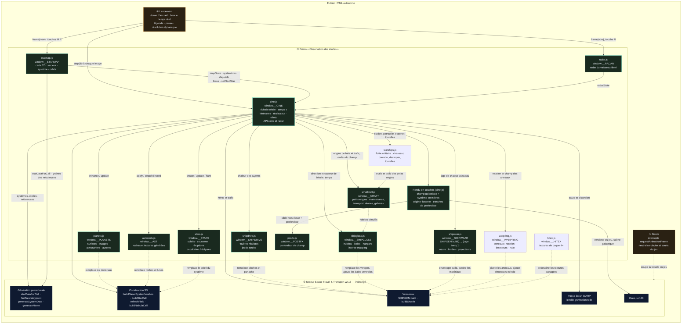
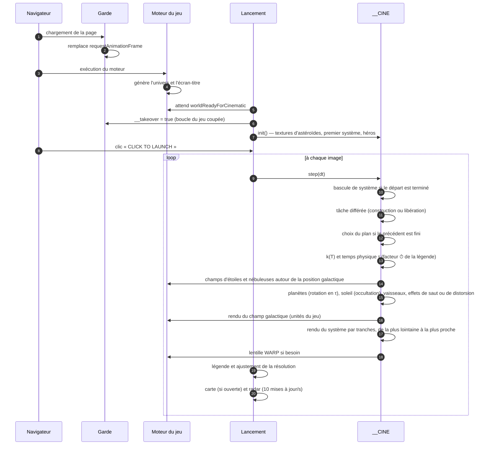
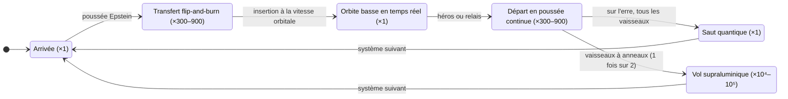
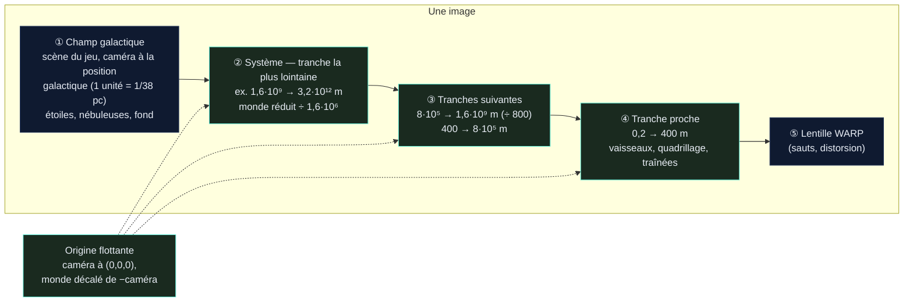

# Space Travel & Transport — *Observation des étoiles*

Démo cinématique **infinie** construite sur le moteur du jeu **Space Travel & Transport** (v2.15).
Pas de HUD imposé : l'univers est généré en continu, des vaisseaux y circulent sur des trajectoires physiquement plausibles, et un réalisateur automatique choisit les plans comme au cinéma — tant qu'on ne ferme pas la page. Pour qui veut explorer : une **carte de l'univers** (`M`), un **radar** discret (`R`) et le **sélecteur de vaisseaux** du jeu (`V`).

> (c) 2026 Frédéric Delorme & claude.ai — Music by ScoreStudio — Observation des étoiles

---

## Sommaire

1. [Fichiers](#fichiers)
2. [Lancer la démo](#lancer-la-démo)
3. [Paramètres d'URL](#paramètres-durl)
4. [Échelle réelle et temps accéléré](#échelle-réelle-et-temps-accéléré)
5. [Ce que montre la démo](#ce-que-montre-la-démo)
6. [Architecture technique](#architecture-technique)
7. [Chronologies de référence](#chronologies-de-référence)
8. [Performances](#performances)
9. [Limites connues](#limites-connues)
10. [Historique des versions](#historique-des-versions)
11. [Crédits et licences](#crédits-et-licences)

---

## Fichiers

| Fichier | Contenu |
|---|---|
| `observation-des-etoiles-v7.5.html` | Version courante (**échelle réelle**, **RCS**, **vaisseaux vieillis**, **moteurs réalistes**, **gros plans**, **géode pulsante**, **hublots et hangars réalistes**, **baies à champ de force**, **petits engins**, **sélecteur de vaisseaux**, **carte de l'univers**, **radar**, **profondeur de champ**, **tuyères orientables**, **tremblement de caméra**, **barre de chargement**, **une pièce par cabine**, **géode en rotation**, **textures haute résolution**, **hublots hexagonaux**, **livrées sombres**, **anneaux de distorsion en rotation**, **départ en distorsion avec traînée et gerbe violettes**, **intérieurs à trois ambiances**, **flotte militaire**, **catapultage et exercices de tir**, **panneau FLEET**), code de la démo lisible et commenté |
| `observation-des-etoiles-v7.5.min.html` | Même version, scripts de la démo minifiés (terser) et CSS compacté |
| `observation-des-etoiles-v7.4.html` / `.min.html` | Flotte militaire sans catapultage, tirs ni panneau FLEET |
| `observation-des-etoiles-v7.3.html` / `.min.html` | Sans flotte militaire |
| `observation-des-etoiles-v7.2.2.html` / `.min.html` | Intérieurs d'origine de la démo (pièces en boîte, style unique) |
| `observation-des-etoiles-v7.2.1.html` / `.min.html` | Avant les corrections de la v7.2.2 (sauts sans géode, sorties de baie en biais) |
| `observation-des-etoiles-v7.2.html` / `.min.html` | Départ en distorsion en 0,75 s, sans traînée ni gerbe |
| `observation-des-etoiles-v7.1.html` / `.min.html` | Textures HD, hublots ronds, livrées du jeu, anneaux fixes |
| `observation-des-etoiles-v7.0.html` / `.min.html` | Une pièce par cabine, textures d'origine du jeu (pixelisées en gros plan) |
| `observation-des-etoiles-v6.9.html` / `.min.html` | Effets de caméra, une pièce par hublot |
| `observation-des-etoiles-v6.8.html` / `.min.html` | Carte et radar, sans effets de caméra |
| `observation-des-etoiles-v6.7.html` / `.min.html` | Sélecteur et retournement final, sans carte ni radar |
| `observation-des-etoiles-v6.6.html` / `.min.html` | Baies et petits engins, sans sélecteur ni retournement final |
| `observation-des-etoiles-v6.5.html` / `.min.html` | Hublots et hangars simulés, navettes d'origine du jeu |
| `observation-des-etoiles-v6.4.html` / `.min.html` | Gros plans et géode, vitrages plats d'origine |
| `observation-des-etoiles-v6.3.html` / `.min.html` | Moteurs réalistes, sans gros plans |
| `observation-des-etoiles-v6.2.html` / `.min.html` | Vaisseaux vieillis, tuyères d'origine du jeu |
| `observation-des-etoiles-v6.1.html` / `.min.html` | Échelle réelle et RCS, flotte neuve |
| `observation-des-etoiles-v6.html` / `.min.html` | Échelle réelle, sans RCS |
| `observation-des-etoiles-v5.html` / `.min.html` | Version précédente (échelle du jeu, soleils agrandis) |
| `observation-des-etoiles-v4.html` / `.min.html` | Sans soleils « cinéma » ni éclipses |
| `observation-des-etoiles-v3.html` / `.min.html` | Version stabilisée (sans aurores) |
| `space-travel-universe-tour.html` | Première démo : visite scénarisée de 60 s en boucle (plans fixes) |

Chaque fichier est **autonome** (≈ 7 Mo) : moteur du jeu, three.js r128, musique et code de la démo sont embarqués. L'essentiel du poids vient de la piste musicale encodée en base64 ; la minification ne fait gagner qu'environ 130 Ko (code de la démo : 513 Ko → 346 Ko).

Seules les polices *JetBrains Mono* / *Inter* sont chargées depuis Google Fonts (police système en repli si hors ligne).

### Package source (`observation-des-etoiles-v7.5-projet.zip`)

```
observation-des-etoiles/
├── README.md                              ce document
├── observation-des-etoiles-v7.5.html      version lisible (prête à ouvrir)
├── observation-des-etoiles-v7.5.min.html  version minifiée
├── package.json                           outils : terser, clean-css, playwright (tests)
├── engine/game.html                       build v2.15 du jeu (moteur, three.js r128, musique) — entrée du build, jamais modifiée
├── src/                                   code de la démo, dans l'ordre d'assemblage
│   ├── head_guard2.js                     ① garde (boucle, clavier, souris du jeu)
│   ├── planets.js · asteroids.js · stars.js
│   ├── shipdrive.js · shipglass.js · shipwear.js   options du générateur de vaisseaux
│   ├── warpring.js                        anneaux de distorsion : rotation, émetteurs, halo
│   ├── hitex.js                           textures haute résolution des coques
│   ├── smallcraft.js                      générateur de petits engins (maintenance, transport, drones, gabares)
│   ├── warships.js                        flotte militaire : chasseur, corvette, destroyer (tourelles, hangars), drone-cible
│   ├── postfx.js                          profondeur de champ (passes plein écran)
│   ├── cine.js                            simulation, réalisateur, rendu en couches, API carte et radar
│   ├── starmap.js                         carte de l'univers (canevas 2D : secteur, système, orbite)
│   ├── radar.js                           radar du vaisseau filmé
│   └── live2.js                           ④ écran d'accueil (barre de chargement), boucle temps réel, légende
├── build/build.py · build_min.js · package.py   assemblage → dist/, zip du projet
├── tests/                                 harnais Playwright + SwiftShader (rendu logiciel)
└── docs/                                  planches d'images des versions 6.1 à 7.5
```

Reconstruire : `python3 build/build.py` (aucune dépendance) puis `npm install` et `node build/build_min.js` ; les fichiers sortent dans `dist/`. Tests : `node tests/smoke.js` (démarrage et 200 s de simulation sur la version minifiée), `node tests/longrun.js LONG-10` (20 min simulées : erreurs, mémoire, types de plans), `node tests/shots.js OBS-8 30:bay@1:1 34:keep` (plans forcés — ici une sortie de baie —, captures), `node tests/hangar.js l20 0.5 "…"` (vaisseau isolé sous plusieurs angles), `node tests/geode.js`, `node tests/fleet.js`, `node tests/drawcalls.js` (objets par modèle), `node tests/framecalls.js` (appels de dessin par image), `node tests/orientation.js OBS-2` (nez / vitesse par phase), `node tests/heroes.js LONG-10` (rotation des héros), `node tests/selector.js` (sélecteur, clavier et souris), `node tests/map-api.js` (API de la carte), `node tests/map.js` (carte à la souris : niveaux, sélection, double-clic, prochain saut ; radar), `node tests/map-jumps.js OBS-5` (changement de cible en distorsion, saut en attente, nébuleuse, lune), `node tests/map-mobile.js` (téléphone, tactile, paysage, version minifiée, mouvement réduit) `node tests/map-stress.js` (double-tap, pincement, 200 ouvertures, mémoire, coûts), `node tests/loading-fx.js` (barre de chargement, cardans, tremblement), `node tests/dof.js OBS-3 engineClose,hullDolly` (même image avec et sans profondeur de champ, coût), `node tests/gimbal-shake.js` (cardans pendant un retournement, allumage) `node tests/jump-dof.js` (saut filmé en gros plan : flou + lentille, erreurs GL), `node tests/cabins.js` (cabines reconstituées pour chaque modèle, rotation de la géode) `node tests/suite.js l20` (gros plans d'une suite et d'une cabine confort), `node tests/textures-inventory.js` (inventaire des textures : taille, répétition, densité en pixels par mètre) `node tests/textures.js 1 hd` / `0 sd` (mêmes gros plans avec et sans textures HD), `node tests/liveries.js tM "jeu,anthracite,nuit,noir"` (un modèle en plusieurs livrées, au soleil et côté ombre) `node tests/warp-rings.js OBS-1` (départ en distorsion filmé : pré-charge, charge, rotation, champ), `node tests/cme.js OBS-1` (éjection de masse coronale filmée) `node tests/ftl-means.js OBS-2` (départs selon l'équipement réel, sélecteur : vedette sans moyens de saut, bascule saut → distorsion, relais au système suivant) `node tests/military.js OBS-4` (système avec station, patrouille et escorte : plans de formation et de tourelle, carte et radar), `node tests/military-2.js OBS-4` (exercice de tir ouvert à la demande et filmé, tourelle en tir, catapultage d'un chasseur depuis le hangar du destroyer, panneau FLEET au clic) et `node tests/interiors.js l20 0.2 int 0` (gros plans à travers un hublot, une passerelle, une baie panoramique et les hangars ; ambiance forcée en 4ᵉ argument, `DIST=0.75` pour coller à la vitre).

---

## Lancer la démo

1. Ouvrir le fichier HTML dans un navigateur récent avec WebGL (Chrome, Edge, Firefox, Safari).
2. Attendre la fin de **GENERATING UNIVERSE…** : une barre suit les étapes (moteur, univers local, textures d'astéroïdes, premier système et vaisseaux, compilation des shaders), 3 à 6 s selon la machine.
3. Facultatif : **CHOOSE A SHIP** ouvre le sélecteur du jeu pour choisir le premier vaisseau suivi (sinon, tirage aléatoire).
4. Cliquer sur **▶ CLICK TO LAUNCH** (le clic est nécessaire pour autoriser la musique).

| Touche | Action |
|---|---|
| `Entrée` / `Espace` (écran d'accueil) | Lancer |
| `V` | Sélecteur de vaisseaux (accueil ou démo) : `←` `→` vaisseau, `↑` `↓` propulsion, `Entrée` embarquer, `Échap` annuler |
| `L` | Mode **Auto** (relais entre vaisseaux) / **Suivre** (le vaisseau filmé reste le héros) |
| `M` | Carte de l'univers (ouvrir / fermer ; aussi `Échap`) — dans la carte : molette ou `+` `−` zoom, glisser ou flèches pour se déplacer, `Retour arrière` niveau supérieur, `C` système courant, `Entrée` action sur la cible |
| `R` | Radar (affiché par défaut) |
| `G` | Panneau **FLEET** : suivre une patrouille de chasseurs, un destroyer en station ou une corvette d'escorte (`Échap` ferme) |
| `Espace` | Pause / reprise (musique comprise) |
| `F` | Plein écran |

En démo, bouger la souris fait apparaître cinq boutons discrets en haut à droite (**MAP**, **RADAR**, **SHIP**, **FLEET**, **AUTO/FOLLOW**). Sur écran tactile, la carte se manipule au doigt (glisser, pincer, double-tap). Toutes les autres entrées clavier / souris sont neutralisées : le jeu tourne « en arrière-plan » mais ne peut pas être démarré par erreur.

---

## Paramètres d'URL

À ajouter à la fin de l'adresse, par exemple `observation-des-etoiles-v6.7.html?seed=OBS-1&quality=low`.

| Paramètre | Valeurs | Effet |
|---|---|---|
| `seed` | texte libre | Graine de l'univers : même graine = même univers **et** même film. Sans graine, un univers neuf à chaque chargement. |
| `quality` | `low` · `high` | `low` : résolution plafonnée à 60 % (portables, GPU intégrés) et textures de coque 2× au lieu de 4×. `high` : jusqu'à 2× sur écrans haute densité. Par défaut : jusqu'à 1,5×. |
| `music` | `0` | Coupe la musique. |
| `traffic` | `0` | Supprime le trafic ambiant (navettes, remorqueurs, cargos) et les relais entre vaisseaux. |
| `relay` | `0` à `1` | Probabilité de relais vers un autre vaisseau à chaque système (défaut 0,6 ; relais toujours imposé après 2 systèmes avec le même héros, sauf en mode Suivre). |
| `ftl` | `warp` · `jump` | Mode de départ préféré quand le partant a les deux moyens (anneaux et géode) ; sinon, le seul moyen dont il est équipé. |
| `aurora` | `all` | Met des aurores sur toutes les planètes à atmosphère (utile pour les tester). |
| `radar` | `0` | Radar masqué au démarrage (`R` le rappelle). |
| `dof` | `0` · `1` | `0` : pas de profondeur de champ. `1` : profondeur de champ gardée même quand la résolution dynamique baisse (sinon coupée sous 0,7). |
| `shake` | `0` | Pas de tremblement de caméra (il est aussi coupé si le système demande de réduire les animations). |
| `military` | `0` · `1` · `all` · `station` · `patrol` · `escort` | Présence militaire : `0` aucune, `1` dans chaque système (scénario tiré au hasard), `all` les trois scénarios partout, ou un scénario précis. Par défaut : ≈ 6 systèmes sur 10. |
| `livery` | `dark` · `light` · `anthracite` · `nuit` · `bouteille` · `bordeaux` · `noir` · `acier` · `jeu` | Impose la livrée : `dark` = palettes sombres tirées au hasard, `light` / `jeu` = couleurs du jeu, ou une palette précise. Par défaut : ≈ 30 % de vaisseaux sombres selon la famille. |
| `age` | `0` à `1` | Impose l'âge de toute la flotte (0 = sortie de chantier, 0,5 = usée, 1 = épaves en fin de vie). Par défaut : mélange réaliste. |

---

## Échelle réelle et temps accéléré

Depuis la v6, **tout est à l'échelle réelle** : 1 unité = 1 mètre dans les systèmes stellaires, et les distances entre étoiles sont celles du champ d'étoiles du jeu (1 unité du jeu = 1/38 parsec, l'échelle déjà utilisée par le moteur pour les magnitudes apparentes).

| Objet | Taille / distance | Origine |
|---|---|---|
| Étoiles | rayon du moteur en rayons solaires (R☉ = 695 700 km) : naines rouges ≈ 0,1–0,5 R☉, étoiles de type solaire ≈ 1 R☉, géantes 10–20 R☉, supergéantes > 100 R☉, naines blanches ≈ 0,01 R☉ | données stellaires du jeu (température, luminosité, classe) |
| Planètes rocheuses | 0,45 à 1,65 rayon terrestre (2 900 à 10 500 km) | rayon du jeu converti |
| Géantes gazeuses | 3,8 à 11,8 rayons terrestres (de Neptune à Jupiter) | rayon du jeu converti |
| Orbites | planète habitable à √L unités astronomiques (zone habitable), autres planètes espacées d'un facteur 1,5 à 2,2 (loi de type Titius-Bode), jamais à moins de 8 rayons stellaires | directions orbitales du jeu conservées |
| Lunes | 0,18–0,3 rayon planétaire autour d'une planète rocheuse (comme la Lune), ≈ 0,03 autour d'une géante (comme les satellites galiléens) ; orbites képlériennes à 18–60 rayons (6–30 autour des géantes), périodes de quelques jours à un mois | nombre de lunes du jeu |
| Ceintures d'astéroïdes | entre deux orbites réelles (souvent 1 à 10 UA) ; vue de près, un amas local : un astéroïde de 6 à 28 km et ses fragments | bornes du jeu transposées |
| Vaisseaux | dimensions du générateur de coques, en mètres : 60 m (remorqueur léger) à 240 m (*Long spine freighter*), navettes ≈ 25 m | `SHIPGEN` |
| Atmosphères, nuages, aurores | atmosphère ≈ 95 km pour une Terre, nuages à 10, 20 et 35 km, aurores de 95 à 290 km | proportions terrestres |

Conséquences visibles : de l'orbite basse (300 à 600 km), la planète occupe la moitié du ciel ; à l'arrivée (32 à 60 rayons, la distance Terre-Lune), elle n'est qu'un disque de 2° ; l'étoile vue d'une planète habitable fait un demi-degré (bien plus pour une naine rouge proche ou une géante) ; une éclipse totale se voit depuis l'ombre d'une lune, comme sur Terre.

### Temps physique et facteur affiché

Les trajets réels durent des heures (un transfert *flip-and-burn* à 1 g jusqu'à l'orbite basse : 2 à 4 h, pointe à 50–70 km/s) et une traversée supraluminique des jours. La démo distingue donc :

- **T**, le temps à l'écran ;
- **τ**, le temps physique, qui avance de `k(T)` secondes par seconde affichée.

Le facteur `k` est défini par des nœuds lissés (intégrale exacte), calculés à la planification de chaque visite pour que la durée physique de chaque manœuvre tienne dans la durée du plan :

| Phase | Facteur typique |
|---|---|
| Arrivée, orbite, saut quantique | ×1 — **temps réel** (un vaisseau en orbite basse file à 7–8 km/s : la surface défile lentement, comme depuis une station) |
| Transfert vers l'orbite, départ vers le point de saut | ×300 à ×900 |
| Vol supraluminique (1 200 à 3 000 c) | ×30 000 à ×300 000 |

Quand le temps est accéléré, la légende l'indique à droite du lieu : **`⏱ ×480`** (mis à jour en continu, sans refaire le fondu de la légende). Rotation des planètes (jours de 9 à 44 h), orbites des lunes et du trafic, évolution des nuages suivent τ ; les effets visuels (sauts, éruptions, aurores, vagues) restent en temps écran. Pour garder des images lisibles, la rotation propre des planètes est plafonnée à ×400 et celle des lunes à ×3 000.

---

## Ce que montre la démo

### Itinéraires générés à l'infini

Chaque étape (≈ 70 à 90 s) suit le même schéma, avec des paramètres tirés au hasard :

1. **Arrivée** à 32–60 rayons de la planète visée (12–22 pour une géante), par le flanc, par saut quantique (l'espace se creuse, éclair, le vaisseau apparaît) ou en sortie de distorsion.
2. **Transfert** vers une planète (habitée 7 fois sur 10) en *flip-and-burn* accéléré (×300–900) : poussée Epstein de 0,5 à 3 g selon le modèle, coupure et retournement de 180°, freinage tuyères en avant jusqu'à la vitesse orbitale réelle vers 4 rayons planétaires, puis **retournement final** aux RCS pendant une courte erre : le vaisseau arrive nez en avant au-dessus de la planète et s'insère en orbite. Trajectoire en courbe de Bézier paramétrée par l'abscisse curviligne, qui contourne planètes, anneaux et étoile.
3. **Orbite basse** (1,05–1,1 rayon, sous les anneaux des géantes) en **temps réel** pendant 18 à 26 s, commencée côté jour.
4. **Départ** en poussée continue accélérée vers un point de saut à 25–45 rayons, dans la direction de l'étoile suivante (choisie par le générateur d'itinéraires du jeu, à 18–40 parsecs), puis 3 s d'erre en temps réel.
5. **Saut quantique** « sur l'erre » ou **vol supraluminique** vers le système suivant, qui a été préparé en arrière-plan ; l'ancien est libéré dès que le nouveau est à l'écran.

**Relais** (v6.7) : 6 fois sur 10, et obligatoirement après 2 systèmes avec le même héros, un autre vaisseau en orbite prend le départ ; il est présenté par un plan pendant l'orbite, puis la caméra le suit dans le système suivant, l'ancien héros reste sur place. Le nouveau héros n'est jamais du même modèle que les deux précédents. Mesuré sur 2 × 20 min simulées : 17 systèmes, 13 à 15 héros différents, aucun suivi plus de 2 systèmes, aucun vaisseau à plus de 9 % du temps d'antenne.

**Trafic ambiant** par système, sur des orbites képlériennes réelles : 3 petits engins (navettes de transport, gabares à conteneurs, navettes de maintenance) en orbite basse autour de la planète habitée, 1 à 2 remorqueurs, 1 à 2 cargos en navette perpétuelle *flip-and-burn* entre l'orbite basse et une station haute (3,5–7 rayons).

**Noms** : types issus du catalogue du jeu (*Warehouse freighter*, *Long spine freighter*, *Ice tanker*, *Liner*…), noms générés à partir des banques de noms du jeu (*R.S.C. Ventaris*, *C.S.V. Etoilea*…).

### Réalisation automatique

Les plans durent de 5 à 8 s et sont choisis selon la phase du vol :

| Famille | Plans |
|---|---|
| Suivi du vaisseau | poursuite, travelling latéral, caméra « fixe » en formation (temps réel seulement), face, caméra en orbite autour du vaisseau, plan large en formation devant une planète ou l'étoile |
| Proches d'une planète | plongée par-dessus l'épaule (horizon en travers du cadre) ; en orbite, les plans latéraux et orbitaux se placent de préférence du côté extérieur pour garder la planète en fond |
| Événements | arrivée par saut, saut quantique (plan en surplomb pour voir le quadrillage), départ en distorsion, poursuite / côté / face en distorsion, sortie de distorsion, **transit du vaisseau devant son étoile** (longue focale) |
| **Gros plans** (v6.4–v6.5) | travelling au ras de la coque, tour des tuyères, proue en légère contre-plongée, bloc RCS pendant un retournement, géode du cœur de saut, **plongée dans une baie de hangar** (voir ci-dessous) |
| **Manœuvres de baie** (v6.6) | un engin sort ou rentre par le champ de force d'une baie (`bayOps`, caméra dans le repère du porteur) : prioritaire quand une manœuvre a lieu pendant le plan ; la légende présente alors l'engin |
| Plans de coupe | trafic ambiant (≈ 1 plan sur 4, en temps réel uniquement), dont les manœuvres de baie des autres vaisseaux |
| Découverte sans vaisseau | orbite lente autour d'une planète, rase-nuages à 60–95 km au lever d'étoile, **aurores vues de nuit à ~50 km d'altitude**, survol d'un astéroïde et de ses fragments, lune devant sa planète, dérive au bord d'une nébuleuse (plan purement galactique) |
| Étoiles et éclipses (sans vaisseau) | approche de la photosphère, **éruption vue de profil au limbe**, **éclipse totale par une lune**, **lever d'étoile derrière une planète**, transit d'une petite lune devant le disque |

Les travellings de découverte représentent environ un plan sur quatre (plus souvent juste après une arrivée, comme plan d'installation) ; tous les vaisseaux sont alors masqués et un même travelling n'est pas répété dans un système. Quand la géométrie le permet, une éclipse totale est proposée en priorité (une par système), et les étoiles de type solaire (F, G, K) reçoivent davantage de plans d'étoile. Pendant un retournement *flip-and-burn*, le réalisateur préfère les plans latéraux, orbitaux ou larges aux plans de poursuite ; la caméra ne descend jamais sous la couche nuageuse.

#### Gros plans — v6.4

Caméras placées **dans le repère du vaisseau**, toujours hors de sa boîte englobante (jamais dans la coque), à 7–25 % de sa longueur : elles suivent chaque mouvement, retournements compris, et restent utilisables en temps accéléré. Dans 85 % des cas elles se placent **du côté éclairé par l'étoile**.

| Plan | Cadrage | Phases où il est proposé (poids) |
|---|---|---|
| `hullDolly` | travelling le long d'un flanc : tôles, rouille, treillis, conteneurs | orbite (2,2), transfert (1,3), départ (1,2), retournement (1) |
| `engineClose` | lente rotation autour des tuyères : tubes de refroidissement, bobines, col incandescent, départ du jet | départ (2), transfert (1,8), retournement (1), orbite (0,8) |
| `bowClose` | proue, lente avancée | orbite (1,3), transfert (0,8), départ (0,6) |
| `rcsClose` | bloc RCS le plus en avant (60 %) : bouffées et gaz qui reste en arrière | retournement (2,4) |
| `geodeClose` | géode du cœur de saut sur son mât | orbite (0,6) ; séquence de saut (ci-dessous) |
| `dockClose` (v6.5) | en biais sous (ou à côté de) une baie de hangar, lente avancée : profondeur du hangar, nacelle arrimée, balisage ; baie latérale du *Vagabonde* filmée entre la coque et les nacelles | orbite (1,4), départ (0,7), transfert (0,6) ; aussi en plan de coupe sur le trafic |

Un gros plan n'est proposé que si le vaisseau possède l'élément filmé (tuyères du générateur, blocs RCS, géode, baie de hangar) ; sinon le réalisateur se replie sur le travelling de coque. Les gros plans occupent environ **20 % du temps d'antenne** (mesuré sur 2 × 20 min simulées) ; ils sont exemptés de la durée minimale de plan, comme les plans d'arrivée.

**Séquence de saut en gros plan** : quand un vaisseau équipé d'une géode part en saut quantique, le réalisateur choisit 7 fois sur 10 un découpage en trois temps — gros plan d'approche (moteurs, coque ou proue), puis **gros plan sur la géode pendant la charge**, puis plan large du saut 0,35 s avant le repli de l'espace.

**Caméras co-mobiles** : à l'échelle réelle, un vaisseau en orbite parcourt environ 80 fois sa longueur par seconde, bien plus en accéléré. Les plans « fixes » (arrivée, saut, plan en formation) sont donc tenus dans le repère qui se déplace avec le vaisseau, comme une caméra volant en formation ; les plans rasants (nuages, aurores) et les coupes sur le trafic ne sont choisis que lorsque le temps est réel.

### Habillage

- **En haut à gauche** : `// PROCEDURAL SPACE SIMULATION` / **SPACE TRAVEL & TRANSPORT**, comme sur l'écran-titre du jeu.
- **En bas à gauche**, légende du plan :
  `SpaceshipType / SpaceshipName -- Étoile . Classe spectrale . Planète`
  (ex. `Long spine freighter / R.S.C. Ventaris -- Krasny-Ther 713 . F8 V . Aqua-Ming I`).
  Pendant un vol supraluminique : `… . Superluminal transit → Étoile suivante · 2 300 c`.
  En temps accéléré, le facteur suit le lieu : `… . Aqua-Ming I  ⏱ ×480`.
  Pendant un travelling sans vaisseau, seul le lieu est affiché (ex. `… . Aube Sol II — aurora borealis`).
- **En bas au centre** : la ligne de crédits.

### Propulsions

| Propulsion | Qui | Rendu |
|---|---|---|
| **Moteur Epstein** (torche de fusion) | tous | tuyères réalistes et jet de torche (voir ci-dessous), une commande de poussée **par vaisseau**, lueur de tuyère sur la coque du vaisseau filmé |
| **Propulseurs d'attitude (RCS)** | tous les vaisseaux du générateur (6 à 10 blocs par coque) | voir ci-dessous |
| **Saut quantique** | tous (sur l'erre, à 50–120 km/s) | charge du cœur de saut — sur les vaisseaux à géode (*Warehouse bulk carrier*, *Long spine freighter*, *Ice tanker*, *Liner*), **la géode bat 15 fois de plus en plus vite** (intervalle de 0,8 s à 0,07 s, jusqu'au trémolo), chaque battement creusant un peu le quadrillage et y lançant une ondelette —, **quadrillage d'espace-temps façon banc d'essai des maquettes qui se creuse en entonnoir** et se tord sous le vaisseau, vaisseau qui s'étire et glisse dans le puits, lentille gravitationnelle, éclair, onde de choc sur la grille ; à l'arrivée le puits se forme dans le vide avant l'apparition |
| **Vol supraluminique** | vaisseaux à anneaux de distorsion : *Warehouse bulk carrier*, *Long spine freighter*, *Ice tanker*, *Liner* (1 fois sur 2) | montée en charge des bobines pendant l'alignement, formation de la bulle (éclair), accélération, **traversée réelle de l'espace interstellaire** (la caméra galactique parcourt les 18–40 parsecs : les étoiles voisines défilent en parallaxe) avec traînées de poussière, sortie de distorsion (contraction des traînées, éclair, onde) |

### Propulseurs d'attitude (RCS) — v6.1

Chaque rotation d'un vaisseau est pilotée par ses blocs RCS, placés par le générateur de coques à l'avant et à l'arrière :

- **Couple physique** : à chaque image, l'accélération angulaire du vaisseau est calculée dans son repère (dérivée seconde de son attitude) et projetée sur le couple que produit chaque buse (bras de levier × poussée, opposée à l'éjection). Seules les buses utiles s'allument.
- **Retournement *flip-and-burn*** : rotation en tangage d'environ 3 s à l'écran, sens constant. Le couple avant-haut / arrière-bas lance la rotation, puis le couple opposé la freine ; plus rien ne tire une fois le vaisseau stabilisé.
- **Autres rotations** : remise dans le sens de la marche après l'insertion en orbite (6 s), alignement sur l'étoile suivante avant la distorsion, retournements des cargos du trafic.
- **Rendu** : panache bleuté qui s'évase (15 % de la longueur de coque), étincelle à la buse ; **bouffées pulsées** (7,5 Hz, largeur d'impulsion selon la demande) quand le couple demandé est partiel, jet continu au plus fort ; **gaz éjecté** qui suit la translation du vaisseau mais pas sa rotation (on le voit rester en arrière pendant le retournement) et se dissipe en ~1 s.
- Pendant un retournement, le réalisateur privilégie les plans rapprochés (latéral, caméra en orbite autour du vaisseau).
- Coût : panaches dessinés seulement quand ils tirent, calcul limité aux vaisseaux à moins de 30 km de la caméra (bouffées à moins de 5 km), réserve fixe de 72 sprites de gaz.

### Moteurs principaux — v6.3

Les cloches du générateur sont remplacées par de vrais ensembles moteurs de torche de fusion (`shipdrive.js`). Le style est mixte : matériel réaliste et jet de torche inspiré de *The Expanse*. C'est une option du générateur, active par défaut : `SHIPGEN.build(modèle, { realDrive: false })` rend les tuyères d'origine.

- **Profil** :
  - chambre convergente, col, puis cloche de profil **Rao** (angle initial 32°, angle de sortie 9°) calculée pour chaque moteur à partir des dimensions du jeu ;
  - paroi épaisse, chemise de refroidissement plus forte autour de la chambre, lèvre de sortie renforcée.
- **Détails** :
  - **tubes de refroidissement régénératif** en relief (36 à plus de 100 selon la taille), effacés quand ils deviennent plus fins qu'un pixel ;
  - frettes de renfort, trois **bobines magnétiques** cuivrées autour du col, collecteur d'alimentation ;
  - quatre **vérins d'orientation** (fourreau et tige chromée).
- **Incandescence physique** :
  - le col est le point le plus chaud ;
  - la paroi intérieure passe du jaune-blanc au rouge sombre vers la sortie ;
  - la plaque d'injection au fond de la chambre brille blanc-bleu en poussée ;
  - la paroi extérieure, refroidie, ne rougit qu'au col ;
  - **inertie thermique** : la tuyère chauffe en ~1 s et refroidit en ~5 s après l'extinction (lueur orangée pendant les retournements et les croisières) ;
  - revenu permanent autour du col (bronze, bleu acier).
- **Jet de torche** :
  - un bouchon lumineux remplit la sortie de tuyère ;
  - le jet se resserre ensuite en un **cœur blanc très collimaté** (focalisation magnétique), 1,6 fois plus long qu'avant ;
  - gaine bleutée, halo violet ;
  - **diamants de choc** discrets près de la sortie seulement.
- **Compatibilité** : l'usure (v6.2) s'applique aussi aux moteurs (suie, revenu, peu de rouille). Les pièces d'un même matériau sont fusionnées, soit 6 appels de dessin par moteur.
- **Cardan** (v6.9) : l'ensemble pivote autour de sa chambre et emporte son jet (voir *Profondeur de champ, cardans, tremblements*).

### Profondeur de champ, cardans, tremblements — v6.9 (géode : v7.0)

- **Profondeur de champ** (`postfx.js`) dans les gros plans (coque, tuyères, proue, RCS, géode, baies) : flou d'optique selon la profondeur réelle.
  - La scène rendue en tranches passe par une cible hors écran avec texture de profondeur ; après la dernière tranche, le tampon ne contient que le premier plan (vaisseaux, engins), tout le reste — planète, étoile, champ stellaire — est « au loin ».
  - Demi-résolution : cercle de confusion par pixel, flou séparable de 13 prises en lumière linéaire, chaque prise pondérée par son propre flou (le sujet net ne bave pas sur le fond) ; composition pleine résolution avec FXAA sur la partie nette.
  - Ouverture fixée par plan (0,45 à 0,75 % de la hauteur d'image, plus forte en longue focale), mise au point sur le point visé et lissée (pas de « pompage »), ouverture progressive en 0,4 s au début du gros plan ; premier plan plafonné pour que le sujet reste lisible.
  - Coupée automatiquement si la résolution dynamique descend sous 0,7 (`?dof=1` la garde, `?dof=0` la supprime) ; enchaînée avec la lentille du saut quand les deux sont actives.
- **Tuyères orientables** (`shipdrive.js`) : chaque ensemble moteur pivote sur son cardan (±3,4° au couple maximal) en suivant le couple demandé — le même calcul que les RCS — pendant les retournements et les corrections, avec l'inertie d'un vérin ; vibration fine (12 à 18 Hz, 0,2°) pendant la poussée ; le jet de torche suit la tuyère.
- **Cadre de la géode** (v7.0) : l'icosaèdre fil de fer blanc tourne lentement sur l'axe vertical du vaisseau (un tour en 40 s) ; pendant la charge du saut, chaque battement donne une impulsion et la vitesse monte par paliers jusqu'à ≈ 3 tours/s au repli, puis retombe après le saut (τ = 1,2 s). L'angle est calculé depuis le temps : juste aussi pour les plans qui anticipent.
- **Tremblement de caméra** : allumage (front montant de la poussée, puis vibration continue), battements de la géode, repli de l'espace, éclair et onde du saut, engagement de la distorsion, sortie de saut. Amplitude selon l'événement, nulle au-delà de 3 longueurs de vaisseau, 0,6° au plus, retour au calme en 0,6 à 1,5 s ; coupé si le système demande de réduire les animations (`?shake=0` aussi).
- **Barre de chargement** (écran d'accueil) : jalons mesurés (moteur, univers local, textures d'astéroïdes, premier système et vaisseaux, compilation des shaders), animation par le compositeur du navigateur, fluide même pendant les calculs ; les shaders sont compilés pendant le chargement, derrière l'écran d'accueil : le premier plan démarre sans saccade.

### Hublots, baies et hangars — v6.5

Les vitrages du générateur étaient des rectangles et des disques lumineux plats. Ils sont remplacés (`shipglass.js`, option du générateur active par défaut) par des ouvertures rendues en **« interior mapping »** : pour chaque pixel, le shader prolonge le rayon de vue à travers la vitre dans une **pièce virtuelle** (murs, sol, plafond) et y trace quelques volumes analytiques (mobilier, nacelle, caisses) et des silhouettes. Aucune géométrie intérieure n'est ajoutée, mais la parallaxe est exacte : l'intérieur se déplace correctement quand la caméra tourne autour du vaisseau.

| Ouverture | Intérieur simulé |
|---|---|
| **Hublots de cabine** (ronds) | cabine de 2,4 m sous plafond : lit, meuble, plafonnier, occupant parfois ; store à demi baissé sur ~1 cabine sur 4 ; depuis la v7.0, **une pièce par cabine** : les 2 hublots d'une cabine confort et les 3 d'une suite montrent la même pièce, et les suites ont un coin salon |
| **Vitres de passerelle** | une seule salle continue derrière toute la rangée : pupitres à écrans, sièges, écrans muraux animés, éclairage froid ; vitrage teinté |
| **Baies panoramiques** | salon : canapé, table basse, plante, passagers, parquet, spots ; meneaux en relief |
| **Baies de hangar** | hangar ouvert sur le vide (pas de vitre) : panneaux et nervures, rampes lumineuses, projecteurs, gyrophare, portique, coursive, caisses, **nacelle** avec poste de pilotage éclairé |

- **Cadre et embrasure** : anneau en relief éclairé par l'étoile (boulons sur les hublots, rails à chevrons sur les hangars, balisage lumineux séquentiel du seuil), puis tunnel dans l'épaisseur de la coque, qui prend le soleil selon l'angle.
- **Lumière** : chaque pièce a son état — chaude, froide, tamisée ou éteinte (≈ 20 % des cabines dans le noir) — qui change lentement ; la **tache de soleil** entre par l'ouverture et se déplace avec l'attitude du vaisseau. Côté nuit, les hublots allumés dessinent la vie à bord.
- **Vitrage** : reflet de Fresnel, éclat de l'étoile sur la vitre, crasse qui s'accumule avec l'âge du vaisseau (v6.2) et diffuse la lumière.
- **Baies de hangar** :
  - baies latérales du *Vagabonde* (x1) agrandies (≈ 10 × 2,3 m), sol balisé, nacelle posée ;
  - **baies ventrales ajoutées** sur le module arrière des pousseurs (*Light / Medium / Heavy tug*) et du paquebot (*Liner*), à l'emplacement du point d'amarrage des navettes du jeu (`dockPt`) : 11–12 m de long, jusqu'à 10 m de profondeur, nacelle arrimée au plafond par une pince. Désactivables : `SHIPGEN.build(modèle, { dockBay: false })`.
- **De loin** : quand une ouverture devient plus petite que quelques pixels, le détail est remplacé par sa lueur moyenne (pas de scintillement).
- **Coût** : toutes les ouvertures d'un vaisseau sont fusionnées en **un seul maillage** (un quad par ouverture, un seul programme GPU pour la flotte). Moins d'appels de dessin qu'avant : paquebot 215 → 140 objets (−35 %), pousseurs −20 à −25 %. Le calcul par pixel (4 à 9 intersections rayon-boîte) ne porte que sur les pixels des ouvertures.
- Désactivable : `SHIPGEN.build(modèle, { realGlass: false })` rend les vitrages d'origine.
- **Une cabine, une pièce** (v7.0) : le générateur répartit les cabines d'un modèle par module habité et par pont (la cabine d'indice *i* va au module *e* et au pont *n* tels que *i* mod (modules × ponts) = *e* × ponts + *n*), chacune sur une tranche égale du module ; standard = 1 hublot, confort = 2, suite = 3, panoramique = une baie. `shipglass.js` rejoue cette répartition (table des modules, ponts et cabines de chaque modèle) et rattache chaque hublot à sa cabine : ses hublots partagent la même boîte de pièce, la même graine (éclairage, mobilier, occupant, store) ; cloison de 16 cm entre deux cabines voisines ; les suites, plus profondes, gagnent un canapé et une table basse. Vérifié sur les 10 modèles (comptes du catalogue du jeu : 2, 3, 4, 6, 9, 20 cabines) ; si les comptes ne correspondaient pas (autre version du jeu), repli automatique sur une pièce par hublot.

### Sélecteur de vaisseaux — v6.7

- **Le sélecteur du jeu, réutilisé tel quel** (carrousel des 10 modèles, aperçu 3D, fiche technique, choix de propulsion) : sur l'écran d'accueil (**CHOOSE A SHIP**) ou à tout moment avec `V`.
- **Relais immédiat** : le vaisseau choisi rejoint l'orbite de la planète visitée juste derrière le héros, la caméra le suit aussitôt et c'est lui qui part vers l'étoile suivante. Son départ reprend la durée physique déjà planifiée (poussée ajustée), si bien que le rythme du film n'est pas perturbé. Si le départ est déjà engagé, ou si le vaisseau choisi ne peut pas suivre une distorsion en cours, le relais a lieu au système suivant (un message l'indique).
- **Choix de propulsion** du sélecteur respecté : distorsion ou saut quantique pour les vaisseaux qui ont les deux.
- **Auto / Suivre** (`L`) : en Auto, les relais reprennent (voir *Relais*) ; en Suivre, le vaisseau filmé reste le héros de système en système.
- Pendant l'ouverture, la démo se fige (un seul rendu WebGL actif) ; la garde d'entrées laisse passer vers le sélecteur les flèches, `Entrée`, la souris et ses images d'animation, et `Échap` l'annule.

### Carte de l'univers et radar — v6.8

**Carte** (`M`, bouton **MAP**) : vue de dessus dessinée en 2D (canevas) dans la charte McGivrer du jeu — panneau à coins en équerre, barre de titre, fiche de la cible, légende. La démo continue derrière, la musique aussi.

| Niveau | Ce qui s'affiche | Échelle |
|---|---|---|
| **Secteur** | étoiles (couleur spectrale, éclat selon la luminosité) sur une tranche de ±41 al autour du plan de l'étoile courante, nébuleuses (nappes par type), grille lettre + numéro comme sur les cartes du jeu, itinéraire parcouru, prochain saut (et son décalage vertical), saut en attente, héros ; **systèmes miniatures** (orbites et planètes) quand on s'approche | linéaire, barre d'échelle en al et pc, de 20 à 500 al de large |
| **Système** | étoile, orbites, planètes nommées (dégradés du jeu, face éclairée vers l'étoile, anneaux), lunes, ceinture d'astéroïdes, zone habitable ; système courant : vaisseaux groupés par planète, vaisseaux en transit, direction du prochain saut | logarithmique (orbites en UA dans la fiche) |
| **Orbite** | planète et cône d'ombre, lunes et leurs orbites, vaisseaux en orbite (chevron orienté, nom, immatriculation, altitude), traces d'orbite, repères d'altitude | logarithmique en altitude (100 ku, 1 Mu, 10 Mu…) |

- **Navigation** : molette, pincement ou `+` `−` ; en butée de zoom sur une étoile, on entre dans son système (sur une planète, dans son orbite) ; en butée de dézoom, on remonte. Fil d'Ariane cliquable, bouton ⌖ (système courant). Transitions de zoom de 0,34 s (coupées si mouvement réduit).
- **Clic** : fiche de l'objet (classe, luminosité, température, distance, planètes, zone habitable ; type, rayon, orbite, lunes, vaisseaux en orbite ; immatriculation, longueur, distance au héros…). **Double-clic** (ou bouton de la fiche) : 
  - étoile, planète, lune, ceinture du système courant → **la caméra y va** (travelling de découverte correspondant) ;
  - nébuleuse chargée autour de la position galactique → travelling de nébuleuse ; nébuleuse lointaine → saut vers l'étoile la plus proche de son centre ;
  - vaisseau (ou engin de baie) → plan sur lui ;
  - étoile lointaine → **prochain saut** ; planète lointaine → prochain saut **avec arrivée sur cette planète**. Le départ est replanifié avec la même durée physique (poussée ajustée ; en distorsion, vitesse ajustée à la nouvelle distance) ; si le départ est déjà engagé, le choix est mis **en attente** pour le saut suivant.
  - pendant la séquence de saut, la caméra reste sur le vaisseau (message dans la fiche).
- **Données** : étoiles lues dans les cellules du moteur (`starDataForCell`, chargement progressif, cache), nébuleuses **recalculées depuis leur graine** sans construire de maillage, systèmes générés à la demande sans maillage (`__CINE.systemInfo`, cache LRU de 80 systèmes), vaisseaux lus 5 fois par seconde.

**Radar** (`R`, bouton **RADAR**, affiché par défaut) : cercle en bas à droite, centré sur le vaisseau filmé, **nez vers le haut**.
- Contacts : vaisseaux et engins de baie sortis, point cyan (gris pour les engins), le plus proche en ambre ; immatriculation au format du jeu (`MIR-42`, dérivée du nom) ; repère ▴ / ▾ au-dessus ou au-dessous du plan du vaisseau ; contacts hors portée en triangle sur le bord.
- Liste des 4 plus proches : immatriculation, nom, distance. **1 u = 1 m** (échelle des coques du jeu), affiché en `u`, `ku`, `Mu`, `Gu`.
- **Portée automatique** par paliers (300 u → 3 Gu) pour garder au moins deux contacts dans le cercle, changée après 1,2 s de stabilité (pas de pompage), immédiatement au changement de sujet ; échelle en racine carrée.
- Balayage de 4 s par tour qui avive les contacts à son passage, coupé si `prefers-reduced-motion`. Masqué pendant les travellings sans vaisseau, quand la carte ou le sélecteur est ouvert.

### Baies à champ de force et petits engins — v6.6

Inspirées d'une image de référence (grande baie latérale bleue d'où sortent des navettes) : les hangars ne sont plus fermés par une porte mais par un **champ de force**, et de vrais engins y entrent et en sortent.

- **Champ de force** : voile bleu translucide dans l'ouverture (plus vif sur les bords et en incidence rasante, ondulations lentes), émetteurs bleus le long du seuil, feux de position ambre aux angles, **onde circulaire** chaque fois qu'un engin le traverse, halo additif sur la coque autour de l'ouverture ; le hangar est baigné de lumière bleue.
- **Grandes baies latérales** ajoutées (côté tribord) au paquebot (12,4 × 7 m, 17 m de profondeur) et au pousseur lourd (13 × 6,4 m) ; les hublots qui s'y trouvaient disparaissent. Baies ventrales (v6.5) et baies du *Vagabonde* conservées.
- **Baie-portail** (la technique qui permet d'y faire entrer de vrais engins) : l'intérieur reste simulé par le shader, mais il est dessiné en deux passes. Passe A : un quad invisible, testé contre la coque déjà dessinée, marque le stencil là où la baie est vue (un vaisseau qui passe devant la masque). Passe B : là où le stencil est marqué, l'intérieur remplace la coque et **écrit la profondeur réelle** du point vu (`gl_FragDepth`), puis remet le stencil à zéro. Les engins, dessinés ensuite, sont donc cachés ou visibles exactement comme dans un vrai hangar (derrière le portique, devant le mur du fond…). Coût : 2 appels de dessin par vaisseau à baies, calcul limité aux pixels de l'ouverture.
- **Éclairage des engins dans le hangar** : chaque engin connaît le plan de la baie dans son propre repère ; la partie à l'intérieur perd le soleil et prend la lumière bleue du hangar, pixel par pixel pendant la traversée.

| Engin (`smallcraft.js`) | Taille | Description | Où |
|---|---|---|---|
| **Crew shuttle** (transport court) | 16 m | nez effilé à pare-brise, cabine à 12 hublots (intérieurs simulés), ailerons radiateurs en flèche, collier d'amarrage, 2 tuyères à torche, liseré bleu | grandes baies latérales ; orbite basse |
| **Maintenance tender** | 8,8 m (version étroite 2,5 m) | cabine vitrée, soute d'équipement, **bras manipulateurs**, **projecteurs à faisceau visible**, réservoirs, radiateurs, 4 petites tuyères, peinture de chantier | baies ventrales ; orbite basse |
| **Drones** : inspection, relais, cargo | 2,4–3,4 m | quadri-propulseur à tourelle caméra et anneau bleu ; antenne et panneaux solaires ; caisse à 4 propulseurs | baies du *Vagabonde* |
| **Container lighter** (gabare) | 22–34 m | cabine, poutre en treillis, 1 ou 2 conteneurs de 12 m verrouillés, moteur | orbite basse |

Tous ont blocs RCS animés, feux de navigation clignotants, usure (v6.2), détails en relief ; pièces fusionnées par matériau (4 à 8 appels de dessin par engin).

**Cycle d'une baie** (dans le repère du porteur, qui file à 7 km/s en orbite) : garé (18–40 s) → **sortie** (marche arrière lente à travers le champ ; la navette de transport pivote puis allume ses tuyères vers la planète) → **mission** (transport : hors champ ; maintenance : travail au ras de la coque, projecteurs allumés ; drone : tour d'inspection autour du porteur) → **retour** (approche, alignement, entrée lente) → garé. Les manœuvres n'ont lieu qu'en temps réel et sans poussée du porteur ; quand le héros a une baie, une manœuvre est programmée pendant son orbite. Les RCS réagissent aux rotations et aux translations.

### Vieillissement des vaisseaux — v6.2

Le générateur de vaisseaux accepte un **facteur de vieillissement** : `SHIPGEN.build(modèle, { age, ageSeed })`, avec `age` de 0 (sortie de chantier) à 1 (épave en fin de vie). La démo enveloppe l'appel du moteur sans modifier son code (`shipwear.js`) ; le même appel pourra être repris tel quel dans le jeu.

| Âge | Aspect |
|---|---|
| 0–0,12 · **neuf** (≈ 30 %) | peinture intacte |
| 0,32–0,6 · **usé** (≈ 45 %) | voile de crasse, peinture ternie et jaunie, quelques tôles remplacées, premières rouilles sur la structure, suie à la poupe |
| 0,68–1 · **très vieux** (≈ 25 %) | taches de crasse franches, coulures vers la poupe, rouille qui gagne les joints puis les tôles, éclats de peinture (apprêt ou métal nu), tuyères bleuies par la chaleur |

- **Répartition** : remorqueurs et cargos plus souvent fatigués, paquebots entretenus ; les navettes aussi vieillissent. `?age=0…1` impose un âge à toute la flotte.
- **Coordonnées « vaisseau »** : la position de chaque sommet dans le repère du vaisseau (en mètres) est précalculée dans un attribut, si bien que l'usure est fixe sur la coque et cohérente d'une pièce à l'autre.
- **Physique de l'usure** : les coulures sont étirées vers la poupe, la direction où l'accélération des moteurs entraîne les fuites. La rouille naît dans les joints de tôles (repérés dans la texture de panneaux du jeu) et la structure métallique rouille plus vite que la coque peinte. La suie se concentre près des tuyères.
- **Matériaux** : chaque matériau standard du vaisseau est copié (aucun matériau partagé n'est modifié) et reçoit l'usure par injection de shader. Couleur, rugosité, métallicité et relief sont touchés : cloques de rouille, éclats, bosses. Les vitres, feux et effets restent intacts.
- **Coût** : un seul programme GPU par variante de matériau pour toute la flotte (l'âge, la graine et les dimensions sont des valeurs par vaisseau). Le détail fin s'efface quand un pixel couvre plus de ~10 cm de coque, ce qui évite le scintillement de loin.

### Textures haute résolution — v7.1

Les textures partagées du générateur de vaisseaux sont petites : **512 × 512 px pour les tôles** (map + relief), 128 × 32 pour les bandes de danger, 64 × 8 pour les rainures, 16 × 256 pour les radiateurs. Mesurée par `tests/textures-inventory.js`, la densité tombe à **≈ 25 à 75 px par mètre** sur les grandes coques : dans un gros plan à 3 m, un texel couvre 5 à 10 pixels d'écran (relief en escalier, rivets carrés, liserés pixelisés, points isolés dans l'usure).

| Couche | Ce qui est fait | Fichier |
|---|---|---|
| **Textures HD** | Les recettes du moteur (même générateur pseudo-aléatoire *mulberry32*, même graine, mêmes tracés) sont rejouées sur un canevas **4 fois plus grand** (2 fois avec `?quality=low`) : tôles 2 048², bandes 512 × 128, rainures 256 × 32, radiateurs 64 × 1 024. Le dessin est identique, seulement net ; les rivets deviennent ronds. L'image est remplacée dans les textures existantes (aucun matériau recréé, aucun code du moteur modifié), reconnue par sa taille ; la copie des réservoirs, déjà répétée 5 × 3, reçoit 2×. Filtrage anisotrope maximal pour les vues rasantes. | `hitex.js` |
| **Petits engins** | Leurs textures (tôles, bandes, grilles) sont dessinées à 4× (2× en `low`), rivets ronds, anisotropie maximale ; usure appliquée même neufs (micro-détail). | `smallcraft.js` |
| **Détail procédural** | Sous l'échelle du texel, le shader d'usure ajoute du **martelage** (ondulations de tôle), un **grain** de laminage étiré dans l'axe du vaisseau et de fines **rayures** (lignes de niveau d'un bruit), en relief, en couleur et en rugosité. Chaque couche s'efface quand elle devient plus fine qu'un pixel (pas de scintillement de loin). Actif sur tous les vaisseaux, même neufs. | `shipwear.js` |
| **Anticrénelage de l'usure** | Les seuils de rouille et d'éclats sont adoucis sur la largeur d'un pixel (`fwidth`) : fini les points isolés rouges ou noirs sur les tôles vues de biais. | `shipwear.js` |

Désactivation pour comparaison : `SHIPGEN.build(modèle, { hiTex: false })` (textures d'origine) ; `window.__HITEX.info` liste les canevas générés.

### Hublots hexagonaux, livrées sombres, anneaux de distorsion — v7.2

Inspiration : le langage visuel fonctionnel de *The Expanse*, de *2001/2010* et de *Star Trek* — sans reprendre aucun vaisseau existant.

- **Hublots par famille** (`shipglass.js`) : la forme d'une ouverture est une fonction de distance calculée dans le shader ; un attribut par ouverture choisit rond ou polygone (rectangle, coins à pans coupés, hexagone à pointes latérales). Cadre en relief, boulons, embrasure (paroi du tunnel, calculée comme la sortie d'un prisme convexe), tache de soleil et masque des hangars suivent la même forme.

| Famille | Hublots | Modèles |
|---|---|---|
| Passagers, coureurs indépendants | hexagone allongé (1,9 : 1) | Belle-Étoile (l20), Vagabonde (x1) |
| Cargos, pousseurs, citerniers | hexagone presque régulier | les 8 autres modèles, petits engins |
| Militaires (v7.4) | fente hexagonale blindée | — |
| Très vieux vaisseaux (âge > 0,68) | ronds, baies droites : l'ancienne génération | tous |

  Passerelles : bandeau hexagonal ; baies panoramiques : pans coupés et **verrière en nid d'abeille** (alvéoles de 0,95 m) ; hangars : portes à pans coupés.
- **Livrées** (`shipwear.js`) : le jeu peint chaque vaisseau avec 3 teintes (coque, intermédiaire, livrée) sur la même texture de tôles ; une palette remplace ces teintes sur les copies de matériaux, sans coût par image. Palettes : anthracite, bleu nuit et or, vert bouteille et laiton, bordeaux et argent, noir mat et orange, gris acier. Tirage par graine : ≈ 12 % de paquebots sombres, 35 % des pousseurs, 50 % des coureurs indépendants, 30 % des cargos. Sur peinture sombre, l'usure s'inverse : la poussière éclaircit, la peinture farine (oxydation mate), les rayures laissent voir le métal clair.
- **Projecteurs de coque** : 4 cônes de lumière chaude posés contre les flancs éclairent la proue et la poupe des vaisseaux sombres (et, plus doucement, des paquebots) ; calculés dans le shader d'usure (normale tirée des dérivées, portée limitée) : un vaisseau noir reste lisible côté ombre.
- **Anneaux de distorsion** (`warpring.js`, `cine.js`) : diagnostic de la v7.1 — l'effet de charge s'activait bien (champ 0,15 → 1,35), mais il ne durait que 2,6 s, montait de façon quadratique (première seconde invisible) et le plan de départ était filmé à 3–5 longueurs de vaisseau. Désormais :
  - chaque anneau tourne dans ses colliers (fixes) : un tour en 50 s au repos, **pré-charge de 3 s** (visuelle, trajectoires inchangées) jusqu'à un tour en 6 s, puis montée linéaire jusqu'à 1,2 tour/s pendant la charge, tenue en distorsion, retour en τ = 2 s ; deux anneaux tournent en sens contraires ; angle calculé depuis le temps ;
  - 12 **émetteurs** sur la jante extérieure (au-delà des colliers : aucune collision) rendent la rotation visible et s'allument avec le champ ;
  - **halo** additif dans le plan de l'anneau (impulsions synchronisées avec le tore lumineux) et **voile** intérieur quand le champ monte ; **lueur bleue sur la coque** proche (shader d'usure) ;
  - nouveau plan **`warpRings`** (7 fois sur 10) : trois-quarts arrière co-mobile sur les anneaux pendant la pré-charge et la charge, puis coupe sur l'engagement.
- **Départ en distorsion** (v7.2.1, `cine.js`) :
  - l'**engagement** dure 2,2 s au lieu de 0,75 s, avec une vitesse en x³ : le vaisseau démarre lentement (≈ 0,2 longueur la première seconde), puis s'arrache ; l'étirement et les traînées d'étoiles n'arrivent qu'à la fin ;
  - il laisse une **traînée lumineuse violette** (ruban face caméra, étroit au départ, large derrière la poupe, ondulation qui court vers l'avant) ;
  - à la **disparition** (fin de l'engagement) : éclair, secousse, et dans le plan de départ le vaisseau se replie en un trait et s'efface (dans les plans de poursuite, on reste dans la bulle : il reste visible) ;
  - une **gerbe de 1 500 particules violettes** se disperse là où il était (sphère et anneau de choc perpendiculaire à la route, freinées), et la traînée s'égrène en 900 particules qui dérivent latéralement ; extinction en ≈ 6 s ;
  - le plan de départ reste jusqu'à 3 s après la disparition, caméra plus proche (2–2,6 longueurs) dont le regard accompagne le démarrage ; la croisière dure 7 à 9,5 s (au lieu de 4,5 à 7) pour garder les plans de poursuite ; le voyage (temps physique, champ d'étoiles) commence à la disparition ;
  - coût : 1 nuage de points et 1 ruban additifs, positions calculées dans les shaders (aucun calcul par particule en JavaScript), dessinés seulement pendant ≈ 8 s par départ.

### Corrections — v7.2.2

- **Moyens de saut** : un vaisseau n'emploie que ce dont il est équipé. Les 4 modèles supraluminiques du jeu (Basalte, Longue-Échine, Banquise, Belle-Étoile) portent un cœur de saut (géode) et des anneaux de distorsion, que le sélecteur du jeu peut retirer un à un ; les 6 autres n'en ont aucun. Avant, ces derniers « sautaient » sans géode.
  - Seuls des vaisseaux équipés quittent un système : relais et premier héros sont tirés parmi eux ; le mode de départ est tiré parmi les moyens présents (un seul : celui-là).
  - Sélecteur : un vaisseau **sans moyen de saut** rejoint l'orbite et devient la vedette des plans, mais le départ se fait avec le partant prévu (message au moment du départ) ; un vaisseau **à anneaux seulement** choisi alors qu'un saut était prévu bascule le départ en distorsion ; **à géode seulement** pendant une distorsion prévue : relais au système suivant.
- **Retournements** : la racine de chaque vaisseau est désormais son centre de gravité (centre de la coque, comme pour le couple des RCS) : retournement *flip-and-burn*, alignements et étirements de la distorsion pivotent autour de lui (avant : autour de l'origine du modèle, près de la proue). Les caméras des gros plans suivent le même repère.
- **Baies** : les engins sortent et rentrent dans l'axe. Le point de sortie des baies ventrales est désormais franchement dehors (l'engin virait encore à moitié dans le hangar), les trajectoires de départ et de retour gardent l'axe de la baie sur 12 m, et la boucle d'inspection des drones commence et finit devant la porte (elle partait parfois de l'autre côté du porteur, le drone longeait la coque). Mesuré sur 35 manœuvres : écart à l'axe nul tant que l'engin est dans l'embrasure.
- **Éjection de masse coronale** : plus de demi-sphère franche. La coquille garde sa forme, mais sa brillance de bord s'efface avant la silhouette (bord plume, déchiqueté par un bruit), son bord ouvert se fond largement et irrégulièrement, et des filaments troués la parcourent.

### Flotte militaire — v7.4 (phase 1)

Nouveau générateur `warships.js`, bâti sur les outils des petits engins (formes à facettes, tôles, tuyères, blocs RCS, fusion par matériau, usure, hublots simulés). Langage visuel « hard SF » — blindage rapporté, radiateurs à canaux de chaleur rougeoyants, tourelles — et silhouettes originales. Coques sombres (gris acier, bleu marine, vert olive), liserés et feux rouges, projecteurs de coque, hublots en **fente blindée**, intérieurs industriels, vaisseaux bien entretenus.

| Type | Taille | Silhouette | Appels de dessin |
|---|---|---|---|
| **Chasseur** | ≈ 15 m | fuselage en coin, verrière, ailes-pylônes portant deux canons électromagnétiques, deux tuyères, ailettes radiateurs | ≈ 12 |
| **Corvette** | ≈ 80 m | proue blindée, coque à facettes, radiateurs ventraux, mât de capteurs, 2 tourelles de défense rapprochée, une grande tuyère et quatre petites | ≈ 20 |
| **Destroyer** | ≈ 250 m | proue « en marteau » et canon axial, épine centrale, trois modules blindés, grands radiateurs, 2 tourelles principales et 4 de défense rapprochée, trois tuyères | ≈ 35 |

- **Tourelles** animées (lacet, puis tangage des canons jumelés) : balayage lent pour les pièces principales, plus vif pour la défense rapprochée.
- **Présence** dans ≈ 6 systèmes sur 10 (`?military=`), un scénario par système :
  - **station** : un destroyer en orbite haute et sa ronde de deux chasseurs, qui tournent autour de lui en boucle inclinée ;
  - **patrouille** : 3 ou 4 chasseurs en formation « quatre doigts » en orbite basse, chaque ailier avec sa petite ondulation ;
  - **escorte** : une corvette le long d'un cargo en navette, à décalage fixe — elle se retourne en même temps que lui au milieu du trajet.
- **Plans** : `formation` (caméra co-mobile avec le chef de patrouille, cadrée sur le groupe) et `turretClose` (gros plan sur une tourelle qui balaie) ; quand une flotte militaire est présente, les coupes sur le trafic la montrent plus souvent.
- **Carte et radar** : contacts militaires en rouge, immatriculations `MIL-nnn`, étiquette MILITARY dans la fiche.
- Phase 2 : voir v7.5 ci-dessous.

### Flotte militaire — v7.5 (phase 2)

- **Hangars du destroyer** : deux baies latérales à champ de force (16 × 7 m, 24 m de profondeur), bordées de bandes de danger, avec l'intérieur « hangar » de la v7.3 (plot hexagonal, feux chenillards, portique, salle de contrôle). `SHIPGEN`/`CR.build` acceptent désormais des baies sur n'importe quel engin (`bays: [{ C, T, N, w, h, D }]`, via `GL.addBays`).
- **Catapultage** : le chasseur garé nez vers la sortie est lancé en 2,6 s (accélération croissante, tuyères qui s'allument au passage du champ), s'éloigne dans l'axe de la baie, fait une ronde inclinée autour du destroyer (26 à 36 s), puis revient et rentre au hangar. Les baies du destroyer entrent dans la rotation des plans `bayOps`.
- **Exercices de tir** : le destroyer s'exerce sur un **drone-cible** (icosaèdre à bouclier d'entraînement) qui tourne à 700–1 100 m. Fenêtres de 12 à 16 s toutes les 40 à 55 s, **en temps réel seulement**. Les tourelles pointent la cible avec anticipation (calculée dans le repère du destroyer, qui file à plusieurs km/s en orbite) et ne tirent qu'une fois en ligne ; défense rapprochée en rafales de traçantes orangées, pièces principales en obus électromagnétiques bleutés ; ≈ 70 % de coups au but : éclat et bouclier qui s'illumine. **Aucune destruction.** Traçantes et éclats sont allongés avec la distance de la caméra pour rester lisibles en plan large.
- **Plan `gunnery`** : deux cadrages — large de profil (le destroyer, la ligne de tir et la cible dans l'image) ou depuis la cible (les traçantes arrivent vers la caméra) ; un exercice en cours est filmé en priorité (6 fois sur 10 quand le réalisateur coupe).
- **Panneau FLEET** (touche `G` ou bouton **FLEET**) : patrouille de chasseurs, destroyer en station ou corvette d'escorte. Le groupe est ajouté au système courant (ou au suivant si un départ est engagé) et la caméra le suit comme vedette ; un message confirme le choix. API : `__CINE.showMilitary('patrol' | 'station' | 'escort')`.

### Intérieurs — v7.3

Toujours en *interior mapping* (une pièce virtuelle calculée derrière chaque ouverture, sans géométrie), mais les pièces ne sont plus des boîtes : les arêtes du plafond sont coupées en biais (pans coupés, 0,4 à 0,75 m ; 1,3 m dans les hangars latéraux), et chaque vaisseau reçoit une **ambiance** selon sa famille (`SHIPGEN.build(modèle, { interior: 0|1|2 })` pour l'imposer) :

| Ambiance | Vaisseaux | Cabines | Passerelle | Salon / mess | Lumière |
|---|---|---|---|---|---|
| **Hospitalité** (façon *Star Trek*) | Belle-Étoile, Vagabonde, navette de passagers | moquette bleue ou bordeaux, lit bas à tête de lit lumineuse, chevet à lampe, banquette sous le hublot, écran mural étoilé, corniche lumineuse | sièges clairs, écrans | bar à étagères rétroéclairées, canapé face à la baie, table, plante, passagers | chaude, états qui changent lentement |
| **Industriel** (façon *The Expanse*) | cargos, pousseurs, engins de service | caillebotis, nervures en relief, casiers, couchette anti-g, conduits à colliers jaunes, écran ambre qui défile, voyant rouge | sièges gris-bleu, écrans | table du mess et bancs, comptoir de cambuse à écrans | LED froides, parfois ambre ou veilleuse rouge |
| **Rétro-futur** (façon *2001*) | très vieux vaisseaux (âge > 0,68, hublots ronds) | parois capitonnées blanches, couchette moulée, fauteuil orange | parois capitonnées, sièges orange | banquette blanche, fauteuils orange | blanche et crue, pans coupés lumineux |

- **Passerelles** : opérateurs assis à chaque poste (silhouettes derrière les pupitres), **table tactique** au fond avec anneaux lumineux et hologramme animé.
- **Hangars** : **plot d'appontage hexagonal** au sol (ou au plafond de la baie ventrale, autour de la pince), **feux chenillards** qui courent vers la sortie, **portique roulant** qui se déplace lentement (poutre et palan), **salle de contrôle vitrée** au fond avec trois opérateurs devant leurs écrans ; hangars de paquebot clairs à marquages bleus, hangars industriels sombres à marquages jaunes.
- Coût : uniquement sur les pixels vitrés. En gros plan plein écran d'un hangar (rendu logiciel 960 × 540), +20 % par rapport à la v7.2.2 ; sans changement mesurable sur les plans habituels.

### Planètes

- **Surfaces procédurales à détail adaptatif** : les octaves fines n'apparaissent que lorsqu'elles sont visibles à l'écran (du plan large au rase-mottes).
- **Mondes continentaux / océaniques** : continents déformés, chaînes de montagnes, biomes selon latitude, altitude et humidité (plages, déserts, savanes, prairies, forêts, jungles, toundra, roche, neige), flore « exotique » sur ~15 % des planètes, relief ombré, océans à profondeur variable avec reflet du soleil et vagues, banquise, villes illuminées côté nuit.
- **Désert** (dunes, canyons, lacs salés), **glace** (banquise fracturée, crevasses), **volcanique** (coulées de lave incandescentes), **géante gazeuse** (bandes turbulentes, grande tempête ovale).
- **Trois couches de nuages** à 10, 20 et 35 km (proportions terrestres), vitesses de dérive différentes (cumulus et cyclones, voiles et fronts, cirrus), ombres portées au sol, couleurs du couchant au terminateur. Évolution quasi figée en temps réel, vive en accéléré.
- **Reflet solaire sur les océans** : houle à deux échelles, de plus en plus fine à l'approche — le grand reflet diffus vu d'orbite.
- **Atmosphère à diffusion** (≈ 95 km) : limbe bleuté, liseré orangé au terminateur, brume vers l'horizon, halo face au soleil, visible aussi de l'intérieur. Intersections rayon-sphère en forme numériquement stable (distances de 10⁷ à 10¹¹ m en virgule flottante 32 bits).
- **Aurores polaires** (v4) sur une partie des planètes à atmosphère (≈ 65 % des habitées, 60 % des glacées, 40 % des autres, 35 % des géantes) : deux ovales de rideaux par pôle magnétique, plis mouvants, rayons scintillants, arcs qui s'allument, vert → rouge (parfois bleu ou rose), visibles surtout côté nuit.

### Étoiles (v5, taille réelle depuis la v6)

Les soleils des systèmes visités sont à leur **taille réelle** (rayon du moteur en R☉). Les éclipses totales restent possibles pour la même raison que sur Terre : la caméra se place dans l'ombre d'une lune, là où elle paraît juste un peu plus grande que l'étoile. Rendu :

- **Photosphère** : granulation animée (visible de près), réseau de facules près du limbe, taches solaires (ombre + pénombre filamentaire) qui défilent avec la rotation, assombrissement centre-bord.
- **Chromosphère** : liseré rose (H-alpha) à spicules, très visible pendant la totalité.
- **Couronne** : disque toujours face caméra, jets (*streamers*) et plumes polaires qui évoluent lentement.
- **Protubérances** : arches magnétiques animées au limbe ; vues devant le disque, elles deviennent de discrets filaments.
- **Éruptions** : flash blanc sur la région active, arche qui s'arrache et s'élargit, **éjection de masse coronale** (coquille en expansion). Fréquence selon la classe : naines rouges très actives, étoiles chaudes calmes.
- **Halo et éblouissement** bornés à une fraction du champ (les longues focales des transits ne sont pas noyées de blanc) et **modulés par l'occultation** : la fraction visible du disque est calculée à chaque image (planètes et lunes) ; pendant une éclipse, le halo s'éteint, la couronne et la chromosphère se renforcent, l'éclat se concentre sur le dernier croissant (**anneau de diamant**).

| Plan d'étoile | Principe |
|---|---|
| Éclipse totale | caméra placée dans l'ombre d'une lune, à la distance où la lune paraît 3,5 % plus grande que l'étoile ; travelling latéral : partielle → anneau de diamant → totalité (ralentie) → sortie |
| Lever d'étoile | caméra derrière une planète, qui tourne pour faire émerger l'étoile du limbe ; l'atmosphère s'embrase en anneau orangé |
| Transit | petite lune (ou vaisseau, pendant un transfert) qui traverse le disque granuleux, vue de très loin en longue focale |
| Éruption | vue de profil au limbe, déclenchée au début du plan |

### Astéroïdes et lunes

Générés **au démarrage** : 5 gabarits de roches (formes bosselées, cratères à rebord, un astéroïde binaire de contact) et 4 familles de textures tuilables (carbonée, silicatée, métallique, glacée — albédo + hauteur). Mappage triplanaire sans couture et relief. Les lunes utilisent le même rendu (cratérisées). À l'échelle réelle, une ceinture est quasi vide à l'œil (des centaines de milliers de km entre deux roches) : ses instances sont retirées et, pour le travelling, un **amas local** est généré dans la ceinture — un astéroïde de 6 à 28 km et 14 à 26 fragments de 0,1 à 6 km, dans un repère local (précision des coordonnées préservée).

---

## Architecture technique

La démo **ne modifie pas le moteur** : elle le charge tel quel (build v2.15 du jeu) et en prend le contrôle. Le fichier HTML contient quatre blocs de script, exécutés dans l'ordre ① → ④.

### Vue d'ensemble



### Démarrage et boucle d'image



### Cycle d'une visite de système

Géré par `cine.js` : chaque visite est planifiée en entier à l'arrivée — trajectoires fonctions du temps écran T via le temps physique τ(T), nœuds du facteur d'accélération calculés pour que chaque manœuvre réelle tienne dans son plan. Le système suivant est construit en tâche de fond pendant la visite.



### Rendu à l'échelle réelle

Les distances vont de 0,2 m (gros plan sur une coque) à 10¹⁵ m (planètes d'une supergéante), bien au-delà de ce que tolèrent un z-buffer 24 bits et la virgule flottante 32 bits des GPU. Trois mécanismes, sans modifier le moteur :



- **Deux couches** : le champ d'étoiles du jeu est rendu d'abord, avec sa propre caméra placée à la position galactique de l'étoile visitée (qui glisse d'une étoile à l'autre pendant un vol supraluminique) ; le système, en mètres, est rendu par-dessus dans une scène séparée. L'étoile du système est masquée dans le champ galactique : elle est rendue à sa taille réelle dans la couche système.
- **Origine flottante** : la logique travaille en coordonnées absolues (double précision JavaScript) ; au moment du rendu, la caméra est placée à l'origine et le monde décalé de −position caméra. Tous les calculs GPU se font donc en coordonnées relatives.
- **Tranches de profondeur** (*multi-frustum*, comme dans les globes virtuels) : 0,2 m → 400 m → 800 km → 1,6·10⁶ km → 3,2·10⁹ km → …, rapport ≤ 2 000 par tranche. Seules les tranches occupées sont rendues, de la plus lointaine à la plus proche, avec effacement du z-buffer entre elles ; le *frustum culling* de three.js fait le tri des objets. Les tranches lointaines sont rendues dans un monde **réduit** (÷ 800, ÷ 1,6·10⁶…) pour que la profondeur de vue reste sous 2·10⁶ : au-delà, l'interpolation perspective des GPU se dégrade (textures déformées observées à 10¹² m). Les shaders des planètes et des étoiles lisent cette échelle dans leur `modelMatrix`.

Alternative écartée : le *logarithmic depth buffer* de three.js aurait imposé de réécrire tous les shaders du moteur et de la démo (écriture de `gl_FragDepth`), avec perte du rejet précoce en profondeur sur les shaders planétaires, les plus coûteux.

**Fonctions du moteur réutilisées** : `starDataForCell`, `findNextWaypoint` (génération d'itinéraires), `generateSystemData`, `buildPlanetSystemMeshes`, `buildStarCell`, `refreshField` / `buildNebulaCell` (champs d'étoiles et nébuleuses), `SHIPGEN.build` (10 modèles de vaisseaux), `buildShuttle`, la passe écran `WARP` (lentille gravitationnelle), `generateName` / `LANG_BANKS` (noms), `apparentMagnitude`.

**Adaptations notables**

- Les uniformes partagés du générateur de vaisseaux (poussée Epstein, charge du cœur de saut, champ et phase des bobines de distorsion) sont **dupliqués par vaisseau** : chaque vaisseau a ses propres moteurs.
- Une seule lumière de tuyère partagée (suit le vaisseau filmé) pour éviter les recompilations de shaders.
- Les matériaux des planètes et des ceintures créés par le moteur sont remplacés à chaud ; les géométries et matériaux partagés sont détachés avant la libération d'un système.
- Les données du moteur (positions et rayons en unités de jeu) sont converties à l'échelle réelle **avant** la construction des maillages (`realizeSystem`), puis lunes et ceintures ajustées après.
- Les vaisseaux et effets vivent dans un groupe à part, rendu uniquement dans les tranches proches (au-delà de 800 km, un vaisseau fait moins d'un pixel).
- Les fondus d'attitude entre deux phases de vol résorbent l'écart **dans le repère du vaisseau**, autour d'un axe fixe : pas d'inversion du sens de rotation lors des demi-tours à 180°.
- Tout est fonction du temps de simulation : la pause fige l'univers entier.

---

## Chronologies de référence

| Séquence | Phases (s) |
|---|---|
| Saut quantique (départ) | charge 3,4 (battements de la géode à 0,15 · 0,95 · 1,54 · 1,98 · 2,31 · 2,55 · 2,72 · 2,85 · 2,95 · 3,02 puis toutes les 0,07) · repli 1,25 · éclair 0,32 · onde 1,7 |
| Arrivée par saut | puits vide 1,8 · éclair 0,32 · onde ≈ 3 |
| Vol supraluminique | pré-charge 3 (v7.2) · montée en charge 2,6 · engagement 2,2 (v7.2.1) · croisière 7–9,5 · décélération 0,9 · onde de sortie 1,6 ; plan de départ jusqu’à 3 s après la disparition, particules ≈ 6 s |
| Arrivée | 2,6 avant l'allumage (1,8 en sortie de distorsion) |
| Transfert *flip-and-burn* | 19–27 à l'écran = 2 à 4 h réelles (×300–900), retournement à mi-parcours, retournement final sur les 4 derniers rayons planétaires (≈ 3 s à l'écran) |
| Orbite | 18–26, temps réel |
| Départ en poussée continue | 12–15 à l'écran = 1 à 3 h réelles, puis 3,2 d'erre |
| Éruption stellaire | flash 0,8 · arrachement et éjection 9–12 |
| Éclipse totale (travelling) | 7,5–11, totalité au milieu du plan |

---

## Performances

- Les surfaces planétaires et les nuages sont calculés par shaders : les gros plans sont exigeants pour le GPU.
- **Résolution dynamique** : la page mesure le temps d'image et ajuste la densité de pixels entre 0,45 et le plafond (1,5 par défaut, 2 avec `quality=high`, 60 % avec `quality=low`). Au-dessus de ~23 ms par image elle baisse, en dessous de ~18,5 ms elle remonte.
- Le nombre d'octaves de bruit dépend de la taille d'un pixel sur la planète : une planète lointaine coûte peu.
- Rendu en tranches : 2 à 5 passes système par image, mais chaque fragment n'est calculé qu'une fois (les tranches découpent la géométrie) ; seul le traitement des sommets est répété. Mesuré sur 24 plans : ≈ 780 appels de dessin et 1,1 M triangles par image (médiane), contre ≈ 820 et 1,5 M en v5.
- v6.6, mesuré sur 40 images d'un système riche en baies (toutes passes confondues, compteur remis à zéro à chaque image) : médiane **≈ 280 appels de dessin**, 90ᵉ centile 375, maximum 465 ; baies-portails : +2 appels par vaisseau à baies, halo +1 ; petits engins : 4 à 8 appels chacun.
- Sphères planétaires plus fines (256 × 192 pour la surface, 224 × 168 pour les nuages) pour des horizons lisses à basse altitude.
- Mémoire stable sur de longues sessions (vérifié sur 20 min simulées : 11 à 15 vaisseaux, tas JavaScript constant, nœuds de temps élagués).
- Profondeur de champ (v6.9) : 4 passes plein écran (2 à demi-résolution), uniquement pendant les gros plans ; mesuré en rendu logiciel à 960 × 540 : +4 à +9 ms par image (processeur), soit de l'ordre de 1 à 2 ms sur un GPU intégré en 1080p. Coupée automatiquement si la résolution dynamique descend sous 0,7. Cardans et tremblement : coût négligeable.
- v7.5 : exercices de tir en un seul lot de traçantes (1 appel), un lot de têtes lumineuses (1 appel) et 24 éclats réutilisés, groupe caché hors exercice ; hangars du destroyer : +2 appels (masques des baies). Tas JavaScript stable sur 20 min simulées.
- v7.4 : un groupe militaire ajoute 25 à 60 appels de dessin quand il est à l'écran (destroyer ≈ 35, corvette ≈ 20, chasseur ≈ 12) ; ses matériaux (canaux de chaleur) compilent à leur première apparition.
- v7.2 : formes d'ouverture, livrées et anneaux sans coût mesurable par image (même nombre de programmes, 2 halos additifs et 24 émetteurs par vaisseau à anneaux, halos masqués hors charge) ; première compilation des shaders un peu plus longue (masquée par l'étape « COMPILING SHADERS » du chargement) ; tas JavaScript stable sur 20 min simulées (≈ 188 Mo).
- Textures HD (v7.1) : canevas générés **une fois** pendant le chargement et partagés par toute la flotte (4 textures, ≈ 22 Mo de mémoire GPU avec les mipmaps en 4×, ≈ 5,5 Mo en `low`, contre ≈ 1,5 Mo auparavant) ; aucun coût par image : le nombre de textures et d'appels de dessin est inchangé. Le détail procédural ajoute quelques bruits dans le shader d'usure, négligeable devant les planètes. Tas JavaScript inchangé sur 20 min simulées (177 Mo).
- Carte et radar (v6.8, mesurés en rendu logiciel, donc majorés) : **rien quand ils sont fermés** ; radar 0,05 à 0,26 ms par mise à jour (10/s) et 0,05 à 0,35 ms par dessin (≈ 30/s, fond pré-rendu) ; carte redessinée seulement à l'interaction, 5 fois par seconde pour les vaisseaux, 1 fois par seconde au niveau secteur : 0,1 ms en vue rapprochée, 2,8 ms au dézoom maximal (≈ 1 700 étoiles) ; ouverture ≈ 1 ms, étoiles chargées par lots de 4 ms ; 18 changements de prochain saut : systèmes abandonnés libérés (nombre d'objets stable).

---

## Limites connues

- Validé en navigateur *headless* avec rendu logiciel (SwiftShader) : fluidité à confirmer sur GPU réels, en particulier intégrés.
- La musique ne démarre qu'après le clic de lancement (règle d'autoplay des navigateurs).
- Le vol supraluminique est réservé aux quatre modèles équipés d'anneaux de distorsion.
- Les planètes ne se déplacent pas sur leur orbite autour de l'étoile pendant une visite (quelques heures réelles : décalage négligeable à l'écran) ; rotation propre plafonnée à ×400 et lunes à ×3 000 pour rester lisibles.
- En accéléré, les plans en formation et les coupes sur le trafic sont évités (les orbites basses feraient un tour en une dizaine de secondes).
- Les étoiles du champ galactique gardent le rendu du jeu (points lumineux, taille angulaire bornée) ; seules les étoiles visitées ont le rendu « cinéma ».
- Une ceinture réelle est invisible dans son ensemble : seul un amas local est montré de près.
- RCS : seules les buses radiales des blocs sont animées (pas de roulis pur) ; les navettes du jeu n'ont pas de blocs RCS.
- Flotte militaire : pas de combat réel (exercices sans destruction, pas d'ennemis) ; le panneau FLEET remplace un onglet du sélecteur du jeu (celui-ci reste limité aux 10 modèles du catalogue) ; les traçantes ne sont pas occultées par les coques (effet additif) ; les formations sont rigides (décalages fixes dans le repère du chef) et la ronde des chasseurs autour du destroyer se fait en temps réel même en accéléré.
- Seuls les 4 modèles supraluminiques passent d'un système à l'autre : les autres n'apparaissent qu'en trafic local ou comme vedette choisie au sélecteur.
- Livrées et projecteurs : les projecteurs sont des cônes sans appareil visible ni ombre portée ; les petits engins gardent leurs couleurs. Anneaux : la pré-charge est un effet visuel (le calendrier des départs n'a pas changé) ; le halo additif prend le flou de ce qui est derrière lui en profondeur de champ.
- Textures HD : seules les 4 textures partagées du générateur sont refaites (reconnues par leur taille : une autre version du jeu qui en changerait les dimensions retomberait sur les textures d'origine) ; au-delà de ~1 m de distance, la finesse reste bornée par le texel 4× (≈ 95 à 330 px par mètre), relayée par le détail procédural.
- Usure procédurale (bruits 3D) : pas de décalcomanies, d'immatriculations effacées ni de dégâts de forme (bosses géométriques, trous).
- Moteurs : le jet est un effet lumineux (pas d'éclairage de la coque par le jet au-delà de la lueur de tuyère).
- Sélecteur : repris du jeu, il garde ses textes en français et ne propose que les 10 modèles du catalogue (pas les petits engins de la v6.6).
- Baies et petits engins : les engins ne croisent jamais d'autres engins (pas d'évitement) ; la navette de transport part « hors champ » (elle disparaît au-delà de quelques kilomètres) ; les gabares ne s'amarrent pas ; les engins garés dans un hangar ne projettent pas d'ombre sur son sol simulé.
- Intérieurs simulés : mobilier en volumes simples (boîtes) et silhouettes plates pour les occupants ; les objets intérieurs ne projettent pas d'ombre et la tache de soleil les ignore ; dans une cabine à plusieurs hublots, chaque hublot ne montre que la tache de soleil qui entre par lui-même ; les deux bords du vaisseau ont chacun leur pièce (le jeu place les hublots d'une cabine des deux côtés) ; l'intérieur est vu sans flou de profondeur.
- Gros plans : caméras sans détection de collision avec les autres vaisseaux (un vaisseau du trafic peut traverser le cadre) ; les navettes du jeu n'ont que le travelling de coque.
- Profondeur de champ : les effets additifs (jets, bouffées RCS, lueurs) n'écrivent pas la profondeur et prennent le flou de ce qui est derrière eux ; le flou de premier plan reste dans la silhouette de l'objet (pas de débordement sur un sujet net) ; dans les gros plans, l'anticrénelage matériel est remplacé par un FXAA.
- Carte : vue de dessus d'une tranche de ±41 al (les étoiles hors tranche n'apparaissent pas, sauf le prochain saut) ; dans un système, le plan orbital est vu de face et les distances sont logarithmiques ; les vaisseaux ne sont suivis que dans le système courant ; les nébuleuses lointaines ne sont pas filmables (le double-clic mène à l'étoile la plus proche) ; noms de types en anglais comme le reste de la démo.
- Radar : les contacts très proches par rapport à la portée sont posés sur un petit cercle intérieur (jamais sous le vaisseau central) ; la liste donne la vraie distance.
- L'éclipse totale n'est possible que si le système possède une lune ; sinon le réalisateur choisit un lever d'étoile, une éruption ou un transit du vaisseau.

---

## Historique des versions

| Version | Apports |
|---|---|
| v1 — *Universe Tour* | Visite scénarisée de 60 s en boucle, moteur piloté sans HUD, titre en haut à gauche |
| v2 — *Observation des étoiles* | Itinéraires et plans générés à l'infini, légende vaisseau/lieu, quadrillage d'espace-temps pendant les sauts, trafic ambiant, relais |
| v2.1 | Planètes détaillées : terres, océans, biomes, 3 couches de nuages, atmosphère à diffusion, rase-nuages, résolution dynamique |
| v3 | Astéroïdes et lunes texturés, travellings de découverte sans vaisseau, vol supraluminique, version minifiée |
| v4 | Aurores polaires et travellings en rase-mottes sous les aurores |
| v5 | Soleils « cinéma » (granulation, taches, chromosphère, couronne, protubérances, éruptions), éclipses totales, levers d'étoile, transits |
| v7.5 | **Flotte militaire** (phase 2) : hangars latéraux du destroyer et **catapultage** des chasseurs ; **exercices de tir** sur drone-cible (traçantes, obus, éclats, bouclier d'entraînement, sans destruction) et plan `gunnery` à deux cadrages ; panneau **FLEET** (touche `G`) |
| v7.4 | **Flotte militaire** (phase 1) : générateur `warships.js` — chasseur, corvette, destroyer à tourelles animées ; station (destroyer et ronde de chasseurs), patrouille en formation, escorte de cargo ; plans `formation` et `turretClose` ; contacts militaires sur la carte et le radar ; paramètre `military` |
| v7.3 | **Intérieurs** à trois ambiances (hospitalité, industriel, rétro-futur) selon la famille et l'âge ; pièces à pans coupés ; passerelles avec opérateurs assis et table tactique holographique ; hangars : plot hexagonal, feux chenillards, portique roulant, salle de contrôle vitrée |
| v7.2.2 | Corrections : **moyens de saut** selon l'équipement réel (plus de saut sans géode, vedette sans moyens au sélecteur, bascule saut → distorsion) ; **retournements autour du centre de gravité** ; **sorties de baie dans l'axe** (baies ventrales, drones) ; **éjection coronale** au bord adouci |
| v7.2.1 | **Départ en distorsion** : engagement de 2,2 s (démarrage lent visible), traînée violette, disparition (éclair, repli), gerbe de particules violettes qui se disperse là où était le vaisseau, traînée qui s'égrène ; plan de départ prolongé et plus proche, croisière allongée |
| v7.2 | **Hublots hexagonaux** par famille (ronds pour les très vieux vaisseaux), verrières en nid d'abeille, hangars et passerelles à pans coupés ; **livrées** (≈ 30 % sombres : anthracite, bleu nuit, bouteille, bordeaux, noir, acier) avec usure inversée et **projecteurs de coque** ; **anneaux de distorsion** en rotation (émetteurs, halo, voile, lueur sur la coque), pré-charge de 3 s et plan rapproché `warpRings` ; paramètre `livery` |
| v7.1 | **Textures haute résolution** : recettes du générateur rejouées en 4× (tôles 2 048², bandes, rainures, radiateurs), rivets ronds, filtrage anisotrope ; petits engins en 4× ; **détail procédural** sous le texel (martelage, grain, rayures) qui s'efface au-delà du pixel ; **usure anticrénelée** (plus de points isolés) ; 2× avec `quality=low` |
| v7.0 | **Une pièce par cabine** : répartition des cabines du générateur rejouée, hublots d'une même cabine sur la même pièce (graine, éclairage, mobilier, store), coin salon des suites, repli automatique ; **cadre de la géode** en rotation lente, accéléré par les battements jusqu'à ≈ 3 tours/s au repli |
| v6.9 | **Profondeur de champ** dans les gros plans (profondeur réelle du premier plan, flou pondéré, FXAA, mise au point lissée) ; **tuyères orientables** qui suivent le couple et vibrent en poussée, jet qui suit ; **tremblement de caméra** (allumage, géode, repli, éclair, distorsion, sortie de saut) ; **barre de chargement** par jalons et shaders compilés avant le lancement ; paramètres `dof` et `shake` |
| v6.8 | **Carte de l'univers** (`M`) : vue de dessus 2D en trois niveaux (secteur, système, orbite) avec zoom enchaîné, étoiles et nébuleuses du moteur, systèmes miniatures, itinéraire, vaisseaux nommés ; double-clic : la caméra va sur l'objet ou l'étoile devient le **prochain saut** (arrivée sur la planète choisie, départ replanifié sans rupture, saut en attente si trop tard) ; **radar** McGivrer (`R`) : contacts, immatriculations, distances en u adaptées, portée automatique ; tactile (glisser, pincer, double-tap) ; paramètre `radar` |
| v6.7 | **Retournement final** avant l'orbite (plus de marche arrière au-dessus des planètes) ; **relais plus fréquents** (6 sur 10, imposé après 2 systèmes, modèles variés, présentation du relayeur) ; **sélecteur de vaisseaux** du jeu sur l'accueil et en démo (`V`), relais immédiat, modes Auto / Suivre (`L`), paramètre `relay` |
| v6.6 | **Baies à champ de force** (voile bleu, onde au passage, halo) et **baies-portails** (stencil + profondeur écrite : de vrais engins entrent dans les hangars simulés) ; grandes baies latérales sur le paquebot et le pousseur lourd ; **générateur de petits engins** (navette de transport, navette de maintenance, drones, gabare à conteneurs) qui remplace les navettes du jeu ; cycle de sortie / mission / retour, plan **bayOps** |
| v6.5 | **Hublots, baies et hangars réalistes** (interior mapping : pièces, mobilier, occupants, éclairage variable, tache de soleil, cadre en relief, embrasure, vitrage qui s'encrasse) ; **baies ventrales** ajoutées aux pousseurs et au paquebot, baie latérale du *Vagabonde* agrandie ; plan **dockClose** ; −20 à −35 % d'appels de dessin sur les vaisseaux habités |
| v6.4 | **Gros plans** dans le réalisateur (coque, tuyères, proue, RCS, géode), placés côté éclairé ; **géode du cœur de saut qui bat de plus en plus vite** avant le saut, avec séquence de saut en trois plans |
| v6.3 | **Moteurs principaux réalistes** : cloches Rao à tubes de refroidissement, bobines magnétiques, vérins, incandescence avec inertie thermique ; jet de torche de fusion collimaté à cœur blanc |
| v6.2 | **Facteur de vieillissement** du générateur de vaisseaux (`age`) : crasse, peinture passée, tôles remplacées, rouille, coulures vers la poupe, éclats, suie, tuyères bleuies ; flotte au mélange réaliste, paramètre `?age=` |
| v6.1 | **Propulseurs d'attitude RCS** pilotés par le couple (retournements en tangage, bouffées pulsées, gaz qui reste en arrière), fondus d'attitude sans ambiguïté à 180°, trajets aller-retour du trafic continus |
| v6 | **Échelle réelle** (étoiles, planètes, lunes, astéroïdes, vaisseaux, orbites en UA, distances interstellaires), temps physique accéléré avec facteur affiché, rendu en deux couches avec origine flottante et tranches de profondeur, caméras co-mobiles, orbites en temps réel, amas d'astéroïdes, reflet solaire des océans |

---

## Crédits et licences

- **Jeu et moteur** *Space Travel & Transport* — © 2026 Frédéric Delorme, licence MIT.
- **Démo « Observation des étoiles »** — Frédéric Delorme & claude.ai.
- **Musique** — ScoreStudio, via Envato, reprise du jeu. *Vérifier que la licence couvre la diffusion de la démo avant publication.*
- **three.js r128** — © three.js authors, licence MIT.
- **Bruit simplex 3D (GLSL)** — Ashima Arts / Stefan Gustavson, licence MIT.
- Polices *JetBrains Mono* et *Inter* — SIL Open Font License.
