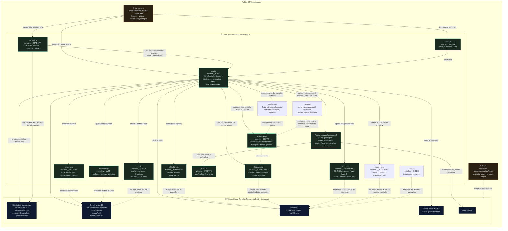
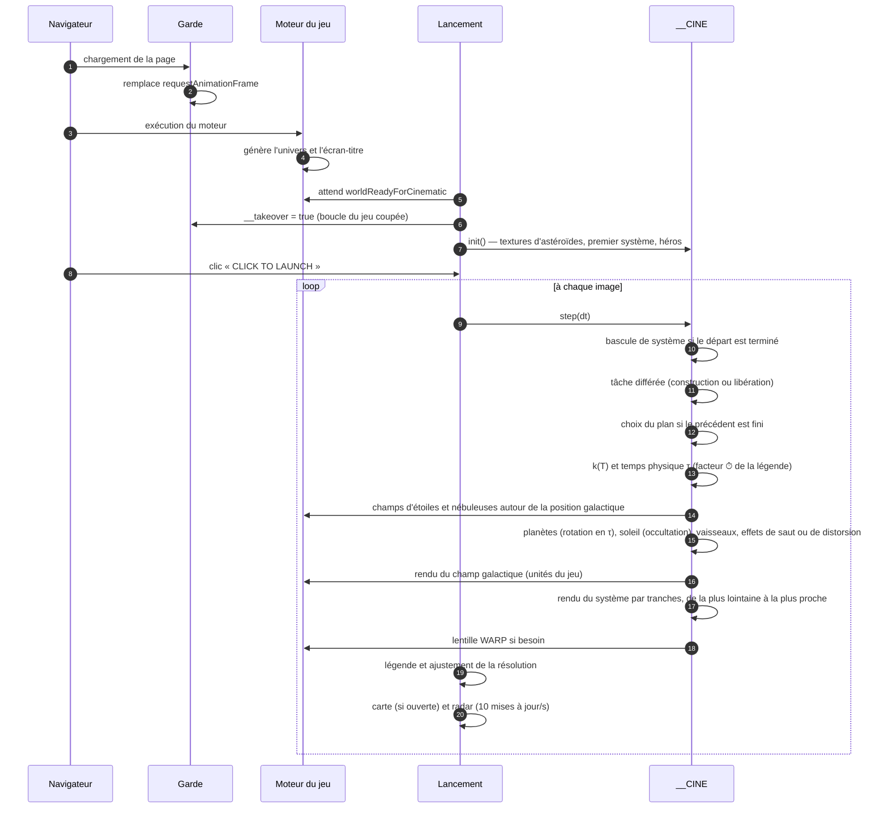
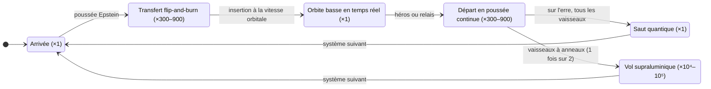
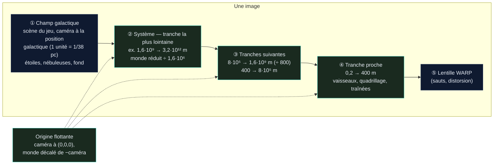

# Space Travel & Transport — *Observation des étoiles*

Démo cinématique **infinie** construite sur le moteur du jeu **Space Travel & Transport** (v2.15).
Pas de HUD imposé : l'univers est généré en continu, des vaisseaux y circulent sur des trajectoires physiquement plausibles, et un réalisateur automatique choisit les plans comme au cinéma — tant qu'on ne ferme pas la page. Pour qui veut explorer : une **carte de l'univers** (`M`), un **radar** discret (`R`) et le **sélecteur de vaisseaux** du jeu (`V`).

> (c) 2026 Frédéric Delorme & claude.ai — Music by ScoreStudio — Observation des étoiles

---

## Sommaire

1. [Fichiers](#fichiers)
2. [Lancer la démo](#lancer-la-démo)
3. [Paramètres d'URL](#paramètres-durl)
4. [Échelle réelle et temps accéléré](#échelle-réelle-et-temps-accéléré)
5. [Ce que montre la démo](#ce-que-montre-la-démo)
6. [Architecture technique](#architecture-technique)
7. [Chronologies de référence](#chronologies-de-référence)
8. [Performances](#performances)
9. [Limites connues](#limites-connues)
10. [Historique des versions](#historique-des-versions)
11. [Crédits et licences](#crédits-et-licences)

---

## Fichiers

| Fichier | Contenu |
|---|---|
| `observation-des-etoiles-v7.19.2.html` | Version courante (**échelle réelle**, **RCS**, **vaisseaux vieillis**, **moteurs réalistes**, **gros plans**, **géode pulsante**, **hublots et hangars réalistes**, **baies à champ de force**, **petits engins**, **sélecteur de vaisseaux**, **carte de l'univers**, **radar**, **profondeur de champ**, **tuyères orientables**, **tremblement de caméra**, **barre de chargement**, **une pièce par cabine**, **géode en rotation**, **textures haute résolution**, **hublots hexagonaux**, **livrées sombres**, **anneaux de distorsion en rotation**, **départ en distorsion avec traînée et gerbe violettes**, **intérieurs à trois ambiances**, **flotte militaire**, **catapultage et exercices de tir**, **panneau FLEET**, **porte-vaisseaux à dock traversant**, **travellings planétaires lents et éclipses rares**, **propulsion hard SF du porte-vaisseaux**, **plans-séquences : révélation, anneaux, tour du système**, **escale au porte-vaisseaux : rangement et sortie à couple**, **voyage à bord d'un porte-vaisseaux**, **escale interplanétaire**, **factions, étiquettes et jauges, dégâts et impacts**, **engagements : escarmouche de chasseurs et duel de destroyers**, **attaque de convoi, raid de pirates, assaut de porte-vaisseaux**, **destruction : boule de feu, onde de choc, débris, ralenti**, **coques brisées en tronçons à la dérive**, **chantier : les 23 types de vaisseaux, âge et usure réglables**, **mémoire stable sur de longues sessions**), code de la démo lisible et commenté |
| `observation-des-etoiles-v7.19.2.min.html` | Même version, scripts de la démo minifiés (terser) et CSS compacté |
| `observation-des-etoiles-v7.19.1.html` / `.min.html` | Voir le tag `ode_v7.19.1` : lunes aplaties (même ellipsoïde que les astéroïdes) |
| `observation-des-etoiles-v7.19.html` / `.min.html` | Voir le tag `ode_v7.19.0` : avec `?quality=high`, la résolution dynamique baissait quand même la résolution |
| `observation-des-etoiles-v7.18.html` / `.min.html` | Avec la fuite mémoire (≈ +120 Mo de tas par heure simulée, un système entier retenu par visite) |
| `observation-des-etoiles-v7.17.html` / `.min.html` | Sans chantier (sélecteur du jeu seulement : 10 modèles) ; âge seul, sans usure distincte |
| `observation-des-etoiles-v7.16.html` / `.min.html` | Destruction sans coque brisée (le vaisseau disparaît d'un bloc derrière l'éclair) |
| `observation-des-etoiles-v7.15.html` / `.min.html` | Sans destruction (les vaisseaux vaincus restent désemparés) |
| `observation-des-etoiles-v7.14.html` / `.min.html` | Escarmouche et duel seulement (ni convoi, ni pirates, ni assaut de porteur) |
| `observation-des-etoiles-v7.13.html` / `.min.html` | Sans engagements (dégâts et étiquettes seulement sur les exercices de tir) |
| `observation-des-etoiles-v7.12.html` / `.min.html` | Sans factions, étiquettes ni dégâts (exercices de tir sans effet sur la cible) |
| `observation-des-etoiles-v7.11.html` / `.min.html` | Sans escale interplanétaire (une seule planète par système) |
| `observation-des-etoiles-v7.10.html` / `.min.html` | Sans voyage à bord (le porteur ne quitte jamais son système) |
| `observation-des-etoiles-v7.9.html` / `.min.html` | Sans escale au porte-vaisseaux (vaisseau garé immobile, pinces figées) |
| `observation-des-etoiles-v7.8.html` / `.min.html` | Sans les plans-séquences de la v7.9 |
| `observation-des-etoiles-v7.7.1.html` / `.min.html` | Porte-vaisseaux à 4 moteurs, destroyer et corvette à tuyères simples |
| `observation-des-etoiles-v7.7.html` / `.min.html` | Sans numéro de version dans la ligne de crédits |
| `observation-des-etoiles-v7.6.2.html` / `.min.html` | Réalisation précédente (une éclipse tentée dans chaque système, travellings de 7 à 11 s) |
| `observation-des-etoiles-v7.6.1.html` / `.min.html` | Porte-vaisseaux à tuyères simples (petits engins) |
| `observation-des-etoiles-v7.6.html` / `.min.html` | Porte-vaisseaux sans cœur de saut quantique (anneaux seuls) |
| `observation-des-etoiles-v7.5.html` / `.min.html` | Sans porte-vaisseaux |
| `observation-des-etoiles-v7.4.html` / `.min.html` | Flotte militaire sans catapultage, tirs ni panneau FLEET |
| `observation-des-etoiles-v7.3.html` / `.min.html` | Sans flotte militaire |
| `observation-des-etoiles-v7.2.2.html` / `.min.html` | Intérieurs d'origine de la démo (pièces en boîte, style unique) |
| `observation-des-etoiles-v7.2.1.html` / `.min.html` | Avant les corrections de la v7.2.2 (sauts sans géode, sorties de baie en biais) |
| `observation-des-etoiles-v7.2.html` / `.min.html` | Départ en distorsion en 0,75 s, sans traînée ni gerbe |
| `observation-des-etoiles-v7.1.html` / `.min.html` | Textures HD, hublots ronds, livrées du jeu, anneaux fixes |
| `observation-des-etoiles-v7.0.html` / `.min.html` | Une pièce par cabine, textures d'origine du jeu (pixelisées en gros plan) |
| `observation-des-etoiles-v6.9.html` / `.min.html` | Effets de caméra, une pièce par hublot |
| `observation-des-etoiles-v6.8.html` / `.min.html` | Carte et radar, sans effets de caméra |
| `observation-des-etoiles-v6.7.html` / `.min.html` | Sélecteur et retournement final, sans carte ni radar |
| `observation-des-etoiles-v6.6.html` / `.min.html` | Baies et petits engins, sans sélecteur ni retournement final |
| `observation-des-etoiles-v6.5.html` / `.min.html` | Hublots et hangars simulés, navettes d'origine du jeu |
| `observation-des-etoiles-v6.4.html` / `.min.html` | Gros plans et géode, vitrages plats d'origine |
| `observation-des-etoiles-v6.3.html` / `.min.html` | Moteurs réalistes, sans gros plans |
| `observation-des-etoiles-v6.2.html` / `.min.html` | Vaisseaux vieillis, tuyères d'origine du jeu |
| `observation-des-etoiles-v6.1.html` / `.min.html` | Échelle réelle et RCS, flotte neuve |
| `observation-des-etoiles-v6.html` / `.min.html` | Échelle réelle, sans RCS |
| `observation-des-etoiles-v5.html` / `.min.html` | Version précédente (échelle du jeu, soleils agrandis) |
| `observation-des-etoiles-v4.html` / `.min.html` | Sans soleils « cinéma » ni éclipses |
| `observation-des-etoiles-v3.html` / `.min.html` | Version stabilisée (sans aurores) |
| `space-travel-universe-tour.html` | Première démo : visite scénarisée de 60 s en boucle (plans fixes) |

Chaque fichier est **autonome** (≈ 7 Mo) : moteur du jeu, three.js r128, musique et code de la démo sont embarqués. L'essentiel du poids vient de la piste musicale encodée en base64 ; la minification ne fait gagner qu'environ 130 Ko (code de la démo : 557 Ko → 372 Ko).

Seules les polices *JetBrains Mono* / *Inter* sont chargées depuis Google Fonts (police système en repli si hors ligne).

La ligne de crédits (écran d'accueil et bas de l'écran) indique la version : `… Observation des étoiles v7.19.2`.

### Package source (`observation-des-etoiles-v7.19.2-projet.zip`)

```
observation-des-etoiles/
├── README.md                              ce document
├── observation-des-etoiles-v7.19.2.html     version lisible (prête à ouvrir)
├── observation-des-etoiles-v7.19.2.min.html version minifiée
├── package.json                           outils : terser, clean-css, playwright (tests)
├── engine/game.html                       build v2.15 du jeu (moteur, three.js r128, musique) — entrée du build, jamais modifiée
├── src/                                   code de la démo, dans l'ordre d'assemblage
│   ├── head_guard2.js                     ① garde (boucle, clavier, souris du jeu)
│   ├── planets.js · asteroids.js · stars.js
│   ├── shipdrive.js · shipglass.js · shipwear.js   options du générateur de vaisseaux
│   ├── warpring.js                        anneaux de distorsion : rotation, émetteurs, halo
│   ├── hitex.js                           textures haute résolution des coques
│   ├── smallcraft.js                      générateur de petits engins (maintenance, transport, drones, gabares)
│   ├── warships.js                        flotte militaire : chasseur, corvette, destroyer (tourelles, hangars), drone-cible
│   ├── carrier.js                         porte-vaisseaux civil ou militaire : dock traversant, postes, ombre de soute
│   ├── postfx.js                          profondeur de champ (passes plein écran)
│   ├── cine.js                            simulation, réalisateur, rendu en couches, combats, API carte et radar
│   ├── starmap.js                         carte de l'univers (canevas 2D : secteur, système, orbite)
│   ├── radar.js                           radar du vaisseau filmé
│   ├── shiplabels.js                      étiquettes et jauges des vaisseaux (bouton DATA, touche D)
│   ├── shipyard.js                        chantier : tous les vaisseaux, aperçu 3D, âge et usure (bouton SHIP, touche C)
│   └── live2.js                           ④ écran d'accueil (barre de chargement), boucle temps réel, légende
├── build/build.py · build_min.js · package.py   assemblage → dist/, zip du projet
├── tests/                                 harnais Playwright + SwiftShader (rendu logiciel)
└── docs/                                  planches d'images des versions 6.1 à 7.19.2
```

Reconstruire : `python3 build/build.py` (aucune dépendance) puis `npm ci` (les `node_modules` ne sont pas versionnés) et `node build/build_min.js` ; les fichiers sortent dans `dist/`. Tests : `node tests/smoke.js` (démarrage et 200 s de simulation sur la version minifiée), `node tests/longrun.js LONG-10` (20 min simulées : erreurs, mémoire, types de plans), `node tests/shots.js OBS-8 30:bay@1:1 34:keep` (plans forcés — ici une sortie de baie —, captures), `node tests/hangar.js l20 0.5 "…"` (vaisseau isolé sous plusieurs angles), `node tests/geode.js`, `node tests/fleet.js`, `node tests/drawcalls.js` (objets par modèle), `node tests/framecalls.js` (appels de dessin par image), `node tests/orientation.js OBS-2` (nez / vitesse par phase), `node tests/heroes.js LONG-10` (rotation des héros), `node tests/selector.js` (sélecteur, clavier et souris), `node tests/map-api.js` (API de la carte), `node tests/map.js` (carte à la souris : niveaux, sélection, double-clic, prochain saut ; radar), `node tests/map-jumps.js OBS-5` (changement de cible en distorsion, saut en attente, nébuleuse, lune), `node tests/map-mobile.js` (téléphone, tactile, paysage, version minifiée, mouvement réduit) `node tests/map-stress.js` (double-tap, pincement, 200 ouvertures, mémoire, coûts), `node tests/loading-fx.js` (barre de chargement, cardans, tremblement), `node tests/dof.js OBS-3 engineClose,hullDolly` (même image avec et sans profondeur de champ, coût), `node tests/gimbal-shake.js` (cardans pendant un retournement, allumage) `node tests/jump-dof.js` (saut filmé en gros plan : flou + lentille, erreurs GL), `node tests/cabins.js` (cabines reconstituées pour chaque modèle, rotation de la géode) `node tests/suite.js l20` (gros plans d'une suite et d'une cabine confort), `node tests/textures-inventory.js` (inventaire des textures : taille, répétition, densité en pixels par mètre) `node tests/textures.js 1 hd` / `0 sd` (mêmes gros plans avec et sans textures HD), `node tests/liveries.js tM "jeu,anthracite,nuit,noir"` (un modèle en plusieurs livrées, au soleil et côté ombre) `node tests/warp-rings.js OBS-1` (départ en distorsion filmé : pré-charge, charge, rotation, champ), `node tests/cme.js OBS-1` (éjection de masse coronale filmée) `node tests/ftl-means.js OBS-2` (départs selon l'équipement réel, sélecteur : vedette sans moyens de saut, bascule saut → distorsion, relais au système suivant) `node tests/military.js OBS-4` (système avec station, patrouille et escorte : plans de formation et de tourelle, carte et radar), `node tests/military-2.js OBS-4` (exercice de tir ouvert à la demande et filmé, tourelle en tir, catapultage d'un chasseur depuis le hangar du destroyer, panneau FLEET au clic), `node tests/carrier-views.js carrier e18 "x,y,z,lx,ly,lz,fov;…" cv ".7,.6,-.3" 1` (porte-vaisseaux isolé avec un vaisseau garé, soleil et ombre de soute au choix, appels de dessin) `node tests/carrier-demo.js OBS-4 c6 civil` (porte-vaisseaux dans la démo : plans `dockPass`, `dockInterior`, `dockBerth`, ombre de soute, entrée SHIP CARRIER du panneau FLEET) `node tests/long-takes.js OBS-4 s9 20` (révélation, tour du système, survol des anneaux : captures en séquence ; statistiques de plans sur 20 min), `node tests/carrier-berth.js OBS-4 b10 civil 6` (escale au poste 1 : chaque phase imposée puis filmée — approche, glissement, pinces, amarré, sortie, allumage — avec l'état des pinces, des champs, de l'onde, du portique et les appels de dessin ; statistiques de plans), `node tests/carrier-berth-directing.js OBS-7 ba civil 10 8` (plans d'escale choisis par le réalisateur, captures), `node tests/carrier-trip.js OBS-4 tr 4` (voyage à bord : journal des visites — départ du porteur avec son passager, arrivée, débarquement, tour libre, réembarquement —, captures des phases, carte et radar « à bord de », saut avec les vaisseaux à bord, sélecteur en mode Suivre), `node tests/memory.js LONG-7 3600` (mémoire sur une longue session simulée, pas à pas par tâches : tas après ramasse-miettes, objets three.js vivants, vaisseaux libérés mais encore retenus, géométries et textures GPU ; verdict STABLE ou FUITE), `node tests/shipyard-ui.js OBS-4` (chantier : 23 types et leurs vignettes, aperçu à différents âges et usures, `Échap`, vaisseau choisi — modèle du jeu, engin, porte-vaisseaux — avec son aspect dans la scène ; `MOBILE=1` : téléphone), `node tests/hull-break.js duel OBS-4` (coque brisée imposée : découpe préparée pendant l'épave — triangles, durée —, tronçons, maillages par tronçon, plan `hulkPass` ; `CAP=1` : épave, rupture, feu, tronçons à 9 s et 30 s, appels de dessin), `node tests/destruction.js duel OBS-4` / `skirmish` (destruction imposée : explosions, débris, messages ; `CAP=1` : séquence filmée autour d'une explosion — épave, rupture, boule de feu, onde, débris — et ralenti), `node tests/combat-scenarios.js convoy OBS-4` / `raid` / `assault` (déroulé et issue — repli, fuite des pirates —, messages, plans choisis, appels de dessin ; `CAP=1` : captures des plans `strafeRun`, `convoyPass`, `patrolArrival`…), `node tests/combat.js skirmish OBS-4` / `duel` (engagement demandé au panneau FLEET puis filmé : camps, traçantes, missiles, interceptions, désemparés, fin d'engagement ; `CAP=1` pour les captures des plans d'engagement), `node tests/combat-damage.js OBS-4 k17` (exercice de tir : bouclier puis coque de la cible jusqu'au désemparé et au cessez-le-feu, chasseur désemparé, étiquettes, coût, touche H), `node tests/stopover.js OBS-1 st 3` (escale forcée : planètes A et B, distance et durée physique, continuité de la trajectoire aux raccords, captures des deux raccords filmés et de l'orbite B, phase et trajet sur la carte) et `node tests/directing.js OBS-4 r7 20` (contre-champ d'arrivée, lever de planète, terminateur, travelling planétaire, dérive planétaire ; statistiques sur 20 min simulées : éclipses par système, durées moyennes des plans) et `node tests/interiors.js l20 0.2 int 0` (gros plans à travers un hublot, une passerelle, une baie panoramique et les hangars ; ambiance forcée en 4ᵉ argument, `DIST=0.75` pour coller à la vitre).

---

## Lancer la démo

1. Ouvrir le fichier HTML dans un navigateur récent avec WebGL (Chrome, Edge, Firefox, Safari).
2. Attendre la fin de **GENERATING UNIVERSE…** : une barre suit les étapes (moteur, univers local, textures d'astéroïdes, premier système et vaisseaux, compilation des shaders), 3 à 6 s selon la machine.
3. Facultatif : **CHOOSE A SHIP** ouvre le sélecteur du jeu pour choisir le premier vaisseau suivi (sinon, tirage aléatoire).
4. Cliquer sur **▶ CLICK TO LAUNCH** (le clic est nécessaire pour autoriser la musique).

| Touche | Action |
|---|---|
| `Entrée` / `Espace` (écran d'accueil) | Lancer |
| `C` | **Chantier** (v7.18, bouton **SHIP**) : les 23 types de vaisseaux, aperçu 3D, curseurs d'âge et d'usure ; `←` `→` `↑` `↓` dans la liste, `Échap` ferme |
| `V` | Sélecteur du jeu (accueil ou démo, 10 modèles) : `←` `→` vaisseau, `↑` `↓` propulsion, `Entrée` embarquer, `Échap` annuler |
| `L` | Mode **Auto** (relais entre vaisseaux) / **Suivre** (le vaisseau filmé reste le héros) |
| `M` | Carte de l'univers (ouvrir / fermer ; aussi `Échap`) — dans la carte : molette ou `+` `−` zoom, glisser ou flèches pour se déplacer, `Retour arrière` niveau supérieur, `C` système courant, `Entrée` action sur la cible |
| `R` | Radar (affiché par défaut) |
| `D` | **DATA** : étiquettes et jauges au-dessus des vaisseaux proches (affichées par défaut, choix mémorisé) |
| `H` | **Aide** : dialogue listant toutes les touches et actions de la démo (`H` ou `Échap` ferme) |
| `G` | Panneau **FLEET** : suivre une patrouille de chasseurs, un destroyer en station, une corvette d'escorte, le **porte-vaisseaux** ou un **engagement** (escarmouche, duel, convoi, pirates, assaut de porteur) (`Échap` ferme) |
| `Espace` | Pause / reprise (musique comprise) |
| `F` | Plein écran |

En démo, bouger la souris fait apparaître sept boutons discrets en haut à droite (**MAP**, **RADAR**, **SHIP**, **FLEET**, **DATA**, **AUTO/FOLLOW**, **HELP**). Sur écran tactile, la carte se manipule au doigt (glisser, pincer, double-tap). Toutes les autres entrées clavier / souris sont neutralisées : le jeu tourne « en arrière-plan » mais ne peut pas être démarré par erreur.

---

## Paramètres d'URL

À ajouter à la fin de l'adresse, par exemple `observation-des-etoiles-v6.7.html?seed=OBS-1&quality=low`.

| Paramètre | Valeurs | Effet |
|---|---|---|
| `seed` | texte libre | Graine de l'univers : même graine = même univers **et** même film. Sans graine, un univers neuf à chaque chargement. |
| `quality` | `low` · `high` | `low` : résolution plafonnée à 60 % (portables, GPU intégrés) et textures de coque 2× au lieu de 4×. `high` : résolution imposée à 2× sur écrans haute densité, **sans adaptation dynamique** (image toujours nette, mais la fluidité peut chuter sur les gros plans planétaires). Par défaut : jusqu'à 1,5×, abaissée automatiquement si le débit baisse. |
| `music` | `0` | Coupe la musique. |
| `traffic` | `0` | Supprime le trafic ambiant (navettes, remorqueurs, cargos) et les relais entre vaisseaux. |
| `relay` | `0` à `1` | Probabilité de relais vers un autre vaisseau à chaque système (défaut 0,6 ; relais toujours imposé après 2 systèmes avec le même héros, sauf en mode Suivre). |
| `ftl` | `warp` · `jump` | Mode de départ préféré quand le partant a les deux moyens (anneaux et géode) ; sinon, le seul moyen dont il est équipé. |
| `aurora` | `all` | Met des aurores sur toutes les planètes à atmosphère (utile pour les tester). |
| `radar` | `0` | Radar masqué au démarrage (`R` le rappelle). |
| `dof` | `0` · `1` | `0` : pas de profondeur de champ. `1` : profondeur de champ gardée même quand la résolution dynamique baisse (sinon coupée sous 0,7). |
| `shake` | `0` | Pas de tremblement de caméra (il est aussi coupé si le système demande de réduire les animations). |
| `military` | `0` · `1` · `all` · `station` · `patrol` · `escort` | Présence militaire : `0` aucune, `1` dans chaque système (scénario tiré au hasard), `all` les trois scénarios partout, ou un scénario précis. Par défaut : ≈ 6 systèmes sur 10. |
| `eclipse` | `0` à `1` | Probabilité qu'un système ait droit à une éclipse (défaut 0,15, jamais deux systèmes de suite ; `1` = tentée dans chaque système, `0` = jamais). |
| `carrier` | `0` · `1` · `civil` · `mil` | Porte-vaisseaux : `0` aucun, `1` dans chaque système, `civil` / `mil` dans chaque système avec cette identité. Par défaut : ≈ 1 système sur 3, civil ou militaire au hasard. |
| `stopover` | `0` · `1` | Escale interplanétaire (v7.12) : `0` jamais, `1` dès que possible. Par défaut : ≈ 3 visites sur 10 parmi celles qui s'y prêtent (ni voyage à bord, ni choix en attente). |
| `combat` | `0` · `1` · `skirmish` · `duel` · `convoy` · `raid` · `assault` | Engagement (v7.14, v7.15) : `0` jamais, `1` dans chaque système (scénario au hasard), ou un scénario imposé partout. Par défaut : ≈ 1 système sur 5 parmi ceux qui s'y prêtent (ni voyage à bord, ni escale interplanétaire, ni choix en attente) ; tirage : escarmouche 28 %, duel 22 %, convoi 20 %, pirates 18 %, assaut 12 %. |
| `destroy` | `0` · `1` | Destruction (v7.16) : `0` jamais (les vaincus restent désemparés), `1` toute épave militaire explose. Par défaut : chasseur 60 %, corvette 50 %, destroyer 40 %. |
| `slowmo` | `0` | Pas de ralenti sur les destructions filmées. |
| `hullbreak` | `0` · `1` | Coques brisées (v7.17) : `0` jamais (explosion complète), `1` toute corvette ou tout destroyer détruit se brise. Par défaut : destroyer 70 %, corvette 55 % des destructions. |
| `trip` | `0` · `1` | Voyage à bord d'un porte-vaisseaux (v7.11) : `0` jamais, `1` dès qu'un porteur est là et qu'un relais est prévu, et réembarquement systématique. Par défaut : en mode Auto, 1 relais sur 2 quand un porteur est là, réembarquement 1 fois sur 2. |
| `livery` | `dark` · `light` · `anthracite` · `nuit` · `bouteille` · `bordeaux` · `noir` · `acier` · `jeu` | Impose la livrée : `dark` = palettes sombres tirées au hasard, `light` / `jeu` = couleurs du jeu, ou une palette précise. Par défaut : ≈ 30 % de vaisseaux sombres selon la famille. |
| `age` | `0` à `1` | Impose l'âge de toute la flotte (0 = sortie de chantier, 0,5 = usée, 1 = épaves en fin de vie). Par défaut : mélange réaliste. |

---

## Échelle réelle et temps accéléré

Depuis la v6, **tout est à l'échelle réelle** : 1 unité = 1 mètre dans les systèmes stellaires, et les distances entre étoiles sont celles du champ d'étoiles du jeu (1 unité du jeu = 1/38 parsec, l'échelle déjà utilisée par le moteur pour les magnitudes apparentes).

| Objet | Taille / distance | Origine |
|---|---|---|
| Étoiles | rayon du moteur en rayons solaires (R☉ = 695 700 km) : naines rouges ≈ 0,1–0,5 R☉, étoiles de type solaire ≈ 1 R☉, géantes 10–20 R☉, supergéantes > 100 R☉, naines blanches ≈ 0,01 R☉ | données stellaires du jeu (température, luminosité, classe) |
| Planètes rocheuses | 0,45 à 1,65 rayon terrestre (2 900 à 10 500 km) | rayon du jeu converti |
| Géantes gazeuses | 3,8 à 11,8 rayons terrestres (de Neptune à Jupiter) | rayon du jeu converti |
| Orbites | planète habitable à √L unités astronomiques (zone habitable), autres planètes espacées d'un facteur 1,5 à 2,2 (loi de type Titius-Bode), jamais à moins de 8 rayons stellaires | directions orbitales du jeu conservées |
| Lunes | 0,18–0,3 rayon planétaire autour d'une planète rocheuse (comme la Lune), ≈ 0,03 autour d'une géante (comme les satellites galiléens) ; orbites képlériennes à 18–60 rayons (6–30 autour des géantes), périodes de quelques jours à un mois | nombre de lunes du jeu |
| Ceintures d'astéroïdes | entre deux orbites réelles (souvent 1 à 10 UA) ; vue de près, un amas local : un astéroïde de 6 à 28 km et ses fragments | bornes du jeu transposées |
| Vaisseaux | dimensions du générateur de coques, en mètres : 60 m (remorqueur léger) à 240 m (*Long spine freighter*), navettes ≈ 25 m | `SHIPGEN` |
| Atmosphères, nuages, aurores | atmosphère ≈ 95 km pour une Terre, nuages à 10, 20 et 35 km, aurores de 95 à 290 km | proportions terrestres |

Conséquences visibles : de l'orbite basse (300 à 600 km), la planète occupe la moitié du ciel ; à l'arrivée (32 à 60 rayons, la distance Terre-Lune), elle n'est qu'un disque de 2° ; l'étoile vue d'une planète habitable fait un demi-degré (bien plus pour une naine rouge proche ou une géante) ; une éclipse totale se voit depuis l'ombre d'une lune, comme sur Terre.

### Temps physique et facteur affiché

Les trajets réels durent des heures (un transfert *flip-and-burn* à 1 g jusqu'à l'orbite basse : 2 à 4 h, pointe à 50–70 km/s) et une traversée supraluminique des jours. La démo distingue donc :

- **T**, le temps à l'écran ;
- **τ**, le temps physique, qui avance de `k(T)` secondes par seconde affichée.

Le facteur `k` est défini par des nœuds lissés (intégrale exacte), calculés à la planification de chaque visite pour que la durée physique de chaque manœuvre tienne dans la durée du plan :

| Phase | Facteur typique |
|---|---|
| Arrivée, orbite, saut quantique | ×1 — **temps réel** (un vaisseau en orbite basse file à 7–8 km/s : la surface défile lentement, comme depuis une station) |
| Transfert vers l'orbite, départ vers le point de saut | ×300 à ×900 |
| Vol supraluminique (1 200 à 3 000 c) | ×30 000 à ×300 000 |

Quand le temps est accéléré, la légende l'indique à droite du lieu : **`⏱ ×480`** (mis à jour en continu, sans refaire le fondu de la légende). Rotation des planètes (jours de 9 à 44 h), orbites des lunes et du trafic, évolution des nuages suivent τ ; les effets visuels (sauts, éruptions, aurores, vagues) restent en temps écran. Pour garder des images lisibles, la rotation propre des planètes est plafonnée à ×400 et celle des lunes à ×3 000.

---

## Ce que montre la démo

### Itinéraires générés à l'infini

Chaque étape (≈ 70 à 90 s) suit le même schéma, avec des paramètres tirés au hasard :

1. **Arrivée** à 32–60 rayons de la planète visée (12–22 pour une géante), par le flanc, par saut quantique (l'espace se creuse, éclair, le vaisseau apparaît) ou en sortie de distorsion.
2. **Transfert** vers une planète (habitée 7 fois sur 10) en *flip-and-burn* accéléré (×300–900) : poussée Epstein de 0,5 à 3 g selon le modèle, coupure et retournement de 180°, freinage tuyères en avant jusqu'à la vitesse orbitale réelle vers 4 rayons planétaires, puis **retournement final** aux RCS pendant une courte erre : le vaisseau arrive nez en avant au-dessus de la planète et s'insère en orbite. Trajectoire en courbe de Bézier paramétrée par l'abscisse curviligne, qui contourne planètes, anneaux et étoile.
3. **Orbite basse** (1,05–1,1 rayon, sous les anneaux des géantes) en **temps réel** pendant 18 à 26 s, commencée côté jour.
4. **Départ** en poussée continue accélérée vers un point de saut à 25–45 rayons, dans la direction de l'étoile suivante (choisie par le générateur d'itinéraires du jeu, à 18–40 parsecs), puis 3 s d'erre en temps réel.
5. **Saut quantique** « sur l'erre » ou **vol supraluminique** vers le système suivant, qui a été préparé en arrière-plan ; l'ancien est libéré dès que le nouveau est à l'écran.

**Relais** (v6.7) : 6 fois sur 10, et obligatoirement après 2 systèmes avec le même héros, un autre vaisseau en orbite prend le départ ; il est présenté par un plan pendant l'orbite, puis la caméra le suit dans le système suivant, l'ancien héros reste sur place. Le nouveau héros n'est jamais du même modèle que les deux précédents. Mesuré sur 2 × 20 min simulées : 17 systèmes, 13 à 15 héros différents, aucun suivi plus de 2 systèmes, aucun vaisseau à plus de 9 % du temps d'antenne.

**Trafic ambiant** par système, sur des orbites képlériennes réelles : 3 petits engins (navettes de transport, gabares à conteneurs, navettes de maintenance) en orbite basse autour de la planète habitée, 1 à 2 remorqueurs, 1 à 2 cargos en navette perpétuelle *flip-and-burn* entre l'orbite basse et une station haute (3,5–7 rayons).

**Noms** : types issus du catalogue du jeu (*Warehouse freighter*, *Long spine freighter*, *Ice tanker*, *Liner*…), noms générés à partir des banques de noms du jeu (*R.S.C. Ventaris*, *C.S.V. Etoilea*…).

### Réalisation automatique

Les plans durent de 5 à 8 s et sont choisis selon la phase du vol :

| Famille | Plans |
|---|---|
| Suivi du vaisseau | poursuite, travelling latéral, caméra « fixe » en formation (temps réel seulement), face, caméra en orbite autour du vaisseau, plan large en formation devant une planète ou l'étoile |
| Proches d'une planète | plongée par-dessus l'épaule (horizon en travers du cadre) ; en orbite, les plans latéraux et orbitaux se placent de préférence du côté extérieur pour garder la planète en fond |
| Événements | arrivée par saut, saut quantique (plan en surplomb pour voir le quadrillage), départ en distorsion, poursuite / côté / face en distorsion, sortie de distorsion, **transit du vaisseau devant son étoile** (longue focale) |
| **Gros plans** (v6.4–v6.5) | travelling au ras de la coque, tour des tuyères, proue en légère contre-plongée, bloc RCS pendant un retournement, géode du cœur de saut, **plongée dans une baie de hangar** (voir ci-dessous) |
| **Manœuvres de baie** (v6.6) | un engin sort ou rentre par le champ de force d'une baie (`bayOps`, caméra dans le repère du porteur) : prioritaire quand une manœuvre a lieu pendant le plan ; la légende présente alors l'engin |
| Plans de coupe | trafic ambiant (≈ 1 plan sur 4, en temps réel uniquement), dont les manœuvres de baie des autres vaisseaux |
| Découverte sans vaisseau | orbite lente autour d'une planète, rase-nuages à 60–95 km au lever d'étoile, **aurores vues de nuit à ~50 km d'altitude**, survol d'un astéroïde et de ses fragments, lune devant sa planète, dérive au bord d'une nébuleuse (plan purement galactique) |
| Étoiles et éclipses (sans vaisseau) | approche de la photosphère, **éruption vue de profil au limbe**, **éclipse totale par une lune**, **lever d'étoile derrière une planète**, transit d'une petite lune devant le disque |

Les travellings de découverte représentent environ un plan sur quatre (plus souvent juste après une arrivée, comme plan d'installation) ; tous les vaisseaux sont alors masqués et un même travelling n'est pas répété dans un système. Quand la géométrie le permet, une éclipse totale est proposée en priorité (une par système), et les étoiles de type solaire (F, G, K) reçoivent davantage de plans d'étoile. Pendant un retournement *flip-and-burn*, le réalisateur préfère les plans latéraux, orbitaux ou larges aux plans de poursuite ; la caméra ne descend jamais sous la couche nuageuse.

#### Travellings et éclipses — v7.7

- **Éclipses rares** : un système sur 6 ou 7 environ y a droit (`?eclipse=`), jamais deux systèmes de suite ; elles restaient tentées dans chaque système auparavant.
- **Travellings planétaires longs et lents** : 15 à 25 s au lieu de 7 à 11, mouvement 2 à 3 fois plus lent, deux fois plus souvent choisis parmi les plans de découverte (raccourcis ou écartés quand le départ approche) ; les plans de découverte passent d'environ 1 sur 4 à 1 sur 3.
- **Lever de planète** (nouveau) : au-dessus d'une lune, la planète monte lentement au-dessus de son horizon ; les lunes étant irrégulières, le limbe réel est mesuré (lancers de rayons) au début du plan pour que la planète soit cachée au départ et entière à la fin, le limbe restant dans le cadre.
- **Terminateur** (nouveau) : long panoramique du jour vers la nuit à 0,35–0,75 rayon d'altitude : arc de l'atmosphère, lumières des villes, aurores au limbe.
- **Dérive planétaire** (nouveau, avec vaisseau) : en orbite, 12 à 18 s ; la planète en grand sous l'horizon, le vaisseau petit au premier tiers, caméra co-mobile qui dérive latéralement.
- **Contre-champ d'arrivée** (nouveau, arrivées par saut, une fois sur trois) : la caméra attend devant le point d'arrivée et regarde vers l'arrière ; le quadrillage se creuse au fond de l'image, l'éclair, puis le vaisseau vient vers la caméra ; coupé au début du transfert.
- Mesuré sur 2 × 20 min simulées : 3 éclipses pour 32 systèmes, jamais consécutives ; travellings planétaires 16 à 20 s en moyenne, levers de planète ≈ 18 s, terminateurs ≈ 21 s, dérives planétaires ≈ 11–13 s.

#### Plans-séquences — v7.9

- **Révélation** (avec le vaisseau, en orbite, côté jour) : 20 à 30 s d'un seul tenant — la caméra part au ras de la coque, s'en écarte, puis recule et monte en grue sur une courbe continue jusqu'à placer le vaisseau entre elle et la planète : la surface apparaît derrière lui, la focale se resserre (58° → 42°).
- **Survol des anneaux** : à quelques centaines de km du plan des anneaux, côté éclairé, la caméra file vers l'intérieur ; le plan translucide s'étend jusqu'à l'horizon et les anneaux traversent le disque de la planète géante (planètes à anneaux seulement).
- **Tour du système** (sans vaisseau) : vol documentaire accéléré — survol d'une planète à 2,2–2,8 rayons, traversée rapide, survol d'une autre ; légende « System tour — A → B ».

#### Gros plans — v6.4

Caméras placées **dans le repère du vaisseau**, toujours hors de sa boîte englobante (jamais dans la coque), à 7–25 % de sa longueur : elles suivent chaque mouvement, retournements compris, et restent utilisables en temps accéléré. Dans 85 % des cas elles se placent **du côté éclairé par l'étoile**.

| Plan | Cadrage | Phases où il est proposé (poids) |
|---|---|---|
| `hullDolly` | travelling le long d'un flanc : tôles, rouille, treillis, conteneurs | orbite (2,2), transfert (1,3), départ (1,2), retournement (1) |
| `engineClose` | lente rotation autour des tuyères : tubes de refroidissement, bobines, col incandescent, départ du jet | départ (2), transfert (1,8), retournement (1), orbite (0,8) |
| `bowClose` | proue, lente avancée | orbite (1,3), transfert (0,8), départ (0,6) |
| `rcsClose` | bloc RCS le plus en avant (60 %) : bouffées et gaz qui reste en arrière | retournement (2,4) |
| `geodeClose` | géode du cœur de saut sur son mât | orbite (0,6) ; séquence de saut (ci-dessous) |
| `dockClose` (v6.5) | en biais sous (ou à côté de) une baie de hangar, lente avancée : profondeur du hangar, nacelle arrimée, balisage ; baie latérale du *Vagabonde* filmée entre la coque et les nacelles | orbite (1,4), départ (0,7), transfert (0,6) ; aussi en plan de coupe sur le trafic |

Un gros plan n'est proposé que si le vaisseau possède l'élément filmé (tuyères du générateur, blocs RCS, géode, baie de hangar) ; sinon le réalisateur se replie sur le travelling de coque. Les gros plans occupent environ **20 % du temps d'antenne** (mesuré sur 2 × 20 min simulées) ; ils sont exemptés de la durée minimale de plan, comme les plans d'arrivée.

**Séquence de saut en gros plan** : quand un vaisseau équipé d'une géode part en saut quantique, le réalisateur choisit 7 fois sur 10 un découpage en trois temps — gros plan d'approche (moteurs, coque ou proue), puis **gros plan sur la géode pendant la charge**, puis plan large du saut 0,35 s avant le repli de l'espace.

**Caméras co-mobiles** : à l'échelle réelle, un vaisseau en orbite parcourt environ 80 fois sa longueur par seconde, bien plus en accéléré. Les plans « fixes » (arrivée, saut, plan en formation) sont donc tenus dans le repère qui se déplace avec le vaisseau, comme une caméra volant en formation ; les plans rasants (nuages, aurores) et les coupes sur le trafic ne sont choisis que lorsque le temps est réel.

### Habillage

- **En haut à gauche** : `// PROCEDURAL SPACE SIMULATION` / **SPACE TRAVEL & TRANSPORT**, comme sur l'écran-titre du jeu.
- **En bas à gauche**, légende du plan :
  `SpaceshipType / SpaceshipName -- Étoile . Classe spectrale . Planète`
  (ex. `Long spine freighter / R.S.C. Ventaris -- Krasny-Ther 713 . F8 V . Aqua-Ming I`).
  Pendant un vol supraluminique : `… . Superluminal transit → Étoile suivante · 2 300 c`.
  En temps accéléré, le facteur suit le lieu : `… . Aqua-Ming I  ⏱ ×480`.
  Pendant un travelling sans vaisseau, seul le lieu est affiché (ex. `… . Aube Sol II — aurora borealis`).
- **En bas au centre** : la ligne de crédits.

### Propulsions

| Propulsion | Qui | Rendu |
|---|---|---|
| **Moteur Epstein** (torche de fusion) | tous | tuyères réalistes et jet de torche (voir ci-dessous), une commande de poussée **par vaisseau**, lueur de tuyère sur la coque du vaisseau filmé |
| **Propulseurs d'attitude (RCS)** | tous les vaisseaux du générateur (6 à 10 blocs par coque) | voir ci-dessous |
| **Saut quantique** | tous (sur l'erre, à 50–120 km/s) | charge du cœur de saut — sur les vaisseaux à géode (*Warehouse bulk carrier*, *Long spine freighter*, *Ice tanker*, *Liner*), **la géode bat 15 fois de plus en plus vite** (intervalle de 0,8 s à 0,07 s, jusqu'au trémolo), chaque battement creusant un peu le quadrillage et y lançant une ondelette —, **quadrillage d'espace-temps façon banc d'essai des maquettes qui se creuse en entonnoir** et se tord sous le vaisseau, vaisseau qui s'étire et glisse dans le puits, lentille gravitationnelle, éclair, onde de choc sur la grille ; à l'arrivée le puits se forme dans le vide avant l'apparition |
| **Vol supraluminique** | vaisseaux à anneaux de distorsion : *Warehouse bulk carrier*, *Long spine freighter*, *Ice tanker*, *Liner* (1 fois sur 2) | montée en charge des bobines pendant l'alignement, formation de la bulle (éclair), accélération, **traversée réelle de l'espace interstellaire** (la caméra galactique parcourt les 18–40 parsecs : les étoiles voisines défilent en parallaxe) avec traînées de poussière, sortie de distorsion (contraction des traînées, éclair, onde) |

### Propulseurs d'attitude (RCS) — v6.1

Chaque rotation d'un vaisseau est pilotée par ses blocs RCS, placés par le générateur de coques à l'avant et à l'arrière :

- **Couple physique** : à chaque image, l'accélération angulaire du vaisseau est calculée dans son repère (dérivée seconde de son attitude) et projetée sur le couple que produit chaque buse (bras de levier × poussée, opposée à l'éjection). Seules les buses utiles s'allument.
- **Retournement *flip-and-burn*** : rotation en tangage d'environ 3 s à l'écran, sens constant. Le couple avant-haut / arrière-bas lance la rotation, puis le couple opposé la freine ; plus rien ne tire une fois le vaisseau stabilisé.
- **Autres rotations** : remise dans le sens de la marche après l'insertion en orbite (6 s), alignement sur l'étoile suivante avant la distorsion, retournements des cargos du trafic.
- **Rendu** : panache bleuté qui s'évase (15 % de la longueur de coque), étincelle à la buse ; **bouffées pulsées** (7,5 Hz, largeur d'impulsion selon la demande) quand le couple demandé est partiel, jet continu au plus fort ; **gaz éjecté** qui suit la translation du vaisseau mais pas sa rotation (on le voit rester en arrière pendant le retournement) et se dissipe en ~1 s.
- Pendant un retournement, le réalisateur privilégie les plans rapprochés (latéral, caméra en orbite autour du vaisseau).
- Coût : panaches dessinés seulement quand ils tirent, calcul limité aux vaisseaux à moins de 30 km de la caméra (bouffées à moins de 5 km), réserve fixe de 72 sprites de gaz.

### Moteurs principaux — v6.3

Les cloches du générateur sont remplacées par de vrais ensembles moteurs de torche de fusion (`shipdrive.js`). Le style est mixte : matériel réaliste et jet de torche inspiré de *The Expanse*. C'est une option du générateur, active par défaut : `SHIPGEN.build(modèle, { realDrive: false })` rend les tuyères d'origine.

- **Profil** :
  - chambre convergente, col, puis cloche de profil **Rao** (angle initial 32°, angle de sortie 9°) calculée pour chaque moteur à partir des dimensions du jeu ;
  - paroi épaisse, chemise de refroidissement plus forte autour de la chambre, lèvre de sortie renforcée.
- **Détails** :
  - **tubes de refroidissement régénératif** en relief (36 à plus de 100 selon la taille), effacés quand ils deviennent plus fins qu'un pixel ;
  - frettes de renfort, trois **bobines magnétiques** cuivrées autour du col, collecteur d'alimentation ;
  - quatre **vérins d'orientation** (fourreau et tige chromée).
- **Incandescence physique** :
  - le col est le point le plus chaud ;
  - la paroi intérieure passe du jaune-blanc au rouge sombre vers la sortie ;
  - la plaque d'injection au fond de la chambre brille blanc-bleu en poussée ;
  - la paroi extérieure, refroidie, ne rougit qu'au col ;
  - **inertie thermique** : la tuyère chauffe en ~1 s et refroidit en ~5 s après l'extinction (lueur orangée pendant les retournements et les croisières) ;
  - revenu permanent autour du col (bronze, bleu acier).
- **Jet de torche** :
  - un bouchon lumineux remplit la sortie de tuyère ;
  - le jet se resserre ensuite en un **cœur blanc très collimaté** (focalisation magnétique), 1,6 fois plus long qu'avant ;
  - gaine bleutée, halo violet ;
  - **diamants de choc** discrets près de la sortie seulement.
- **Compatibilité** : l'usure (v6.2) s'applique aussi aux moteurs (suie, revenu, peu de rouille). Les pièces d'un même matériau sont fusionnées, soit 6 appels de dessin par moteur.
- **Cardan** (v6.9) : l'ensemble pivote autour de sa chambre et emporte son jet (voir *Profondeur de champ, cardans, tremblements*).

### Profondeur de champ, cardans, tremblements — v6.9 (géode : v7.0)

- **Profondeur de champ** (`postfx.js`) dans les gros plans (coque, tuyères, proue, RCS, géode, baies) : flou d'optique selon la profondeur réelle.
  - La scène rendue en tranches passe par une cible hors écran avec texture de profondeur ; après la dernière tranche, le tampon ne contient que le premier plan (vaisseaux, engins), tout le reste — planète, étoile, champ stellaire — est « au loin ».
  - Demi-résolution : cercle de confusion par pixel, flou séparable de 13 prises en lumière linéaire, chaque prise pondérée par son propre flou (le sujet net ne bave pas sur le fond) ; composition pleine résolution avec FXAA sur la partie nette.
  - Ouverture fixée par plan (0,45 à 0,75 % de la hauteur d'image, plus forte en longue focale), mise au point sur le point visé et lissée (pas de « pompage »), ouverture progressive en 0,4 s au début du gros plan ; premier plan plafonné pour que le sujet reste lisible.
  - Coupée automatiquement si la résolution dynamique descend sous 0,7 (`?dof=1` la garde, `?dof=0` la supprime) ; enchaînée avec la lentille du saut quand les deux sont actives.
- **Tuyères orientables** (`shipdrive.js`) : chaque ensemble moteur pivote sur son cardan (±3,4° au couple maximal) en suivant le couple demandé — le même calcul que les RCS — pendant les retournements et les corrections, avec l'inertie d'un vérin ; vibration fine (12 à 18 Hz, 0,2°) pendant la poussée ; le jet de torche suit la tuyère.
- **Cadre de la géode** (v7.0) : l'icosaèdre fil de fer blanc tourne lentement sur l'axe vertical du vaisseau (un tour en 40 s) ; pendant la charge du saut, chaque battement donne une impulsion et la vitesse monte par paliers jusqu'à ≈ 3 tours/s au repli, puis retombe après le saut (τ = 1,2 s). L'angle est calculé depuis le temps : juste aussi pour les plans qui anticipent.
- **Tremblement de caméra** : allumage (front montant de la poussée, puis vibration continue), battements de la géode, repli de l'espace, éclair et onde du saut, engagement de la distorsion, sortie de saut. Amplitude selon l'événement, nulle au-delà de 3 longueurs de vaisseau, 0,6° au plus, retour au calme en 0,6 à 1,5 s ; coupé si le système demande de réduire les animations (`?shake=0` aussi).
- **Barre de chargement** (écran d'accueil) : jalons mesurés (moteur, univers local, textures d'astéroïdes, premier système et vaisseaux, compilation des shaders), animation par le compositeur du navigateur, fluide même pendant les calculs ; les shaders sont compilés pendant le chargement, derrière l'écran d'accueil : le premier plan démarre sans saccade.

### Hublots, baies et hangars — v6.5

Les vitrages du générateur étaient des rectangles et des disques lumineux plats. Ils sont remplacés (`shipglass.js`, option du générateur active par défaut) par des ouvertures rendues en **« interior mapping »** : pour chaque pixel, le shader prolonge le rayon de vue à travers la vitre dans une **pièce virtuelle** (murs, sol, plafond) et y trace quelques volumes analytiques (mobilier, nacelle, caisses) et des silhouettes. Aucune géométrie intérieure n'est ajoutée, mais la parallaxe est exacte : l'intérieur se déplace correctement quand la caméra tourne autour du vaisseau.

| Ouverture | Intérieur simulé |
|---|---|
| **Hublots de cabine** (ronds) | cabine de 2,4 m sous plafond : lit, meuble, plafonnier, occupant parfois ; store à demi baissé sur ~1 cabine sur 4 ; depuis la v7.0, **une pièce par cabine** : les 2 hublots d'une cabine confort et les 3 d'une suite montrent la même pièce, et les suites ont un coin salon |
| **Vitres de passerelle** | une seule salle continue derrière toute la rangée : pupitres à écrans, sièges, écrans muraux animés, éclairage froid ; vitrage teinté |
| **Baies panoramiques** | salon : canapé, table basse, plante, passagers, parquet, spots ; meneaux en relief |
| **Baies de hangar** | hangar ouvert sur le vide (pas de vitre) : panneaux et nervures, rampes lumineuses, projecteurs, gyrophare, portique, coursive, caisses, **nacelle** avec poste de pilotage éclairé |

- **Cadre et embrasure** : anneau en relief éclairé par l'étoile (boulons sur les hublots, rails à chevrons sur les hangars, balisage lumineux séquentiel du seuil), puis tunnel dans l'épaisseur de la coque, qui prend le soleil selon l'angle.
- **Lumière** : chaque pièce a son état — chaude, froide, tamisée ou éteinte (≈ 20 % des cabines dans le noir) — qui change lentement ; la **tache de soleil** entre par l'ouverture et se déplace avec l'attitude du vaisseau. Côté nuit, les hublots allumés dessinent la vie à bord.
- **Vitrage** : reflet de Fresnel, éclat de l'étoile sur la vitre, crasse qui s'accumule avec l'âge du vaisseau (v6.2) et diffuse la lumière.
- **Baies de hangar** :
  - baies latérales du *Vagabonde* (x1) agrandies (≈ 10 × 2,3 m), sol balisé, nacelle posée ;
  - **baies ventrales ajoutées** sur le module arrière des pousseurs (*Light / Medium / Heavy tug*) et du paquebot (*Liner*), à l'emplacement du point d'amarrage des navettes du jeu (`dockPt`) : 11–12 m de long, jusqu'à 10 m de profondeur, nacelle arrimée au plafond par une pince. Désactivables : `SHIPGEN.build(modèle, { dockBay: false })`.
- **De loin** : quand une ouverture devient plus petite que quelques pixels, le détail est remplacé par sa lueur moyenne (pas de scintillement).
- **Coût** : toutes les ouvertures d'un vaisseau sont fusionnées en **un seul maillage** (un quad par ouverture, un seul programme GPU pour la flotte). Moins d'appels de dessin qu'avant : paquebot 215 → 140 objets (−35 %), pousseurs −20 à −25 %. Le calcul par pixel (4 à 9 intersections rayon-boîte) ne porte que sur les pixels des ouvertures.
- Désactivable : `SHIPGEN.build(modèle, { realGlass: false })` rend les vitrages d'origine.
- **Une cabine, une pièce** (v7.0) : le générateur répartit les cabines d'un modèle par module habité et par pont (la cabine d'indice *i* va au module *e* et au pont *n* tels que *i* mod (modules × ponts) = *e* × ponts + *n*), chacune sur une tranche égale du module ; standard = 1 hublot, confort = 2, suite = 3, panoramique = une baie. `shipglass.js` rejoue cette répartition (table des modules, ponts et cabines de chaque modèle) et rattache chaque hublot à sa cabine : ses hublots partagent la même boîte de pièce, la même graine (éclairage, mobilier, occupant, store) ; cloison de 16 cm entre deux cabines voisines ; les suites, plus profondes, gagnent un canapé et une table basse. Vérifié sur les 10 modèles (comptes du catalogue du jeu : 2, 3, 4, 6, 9, 20 cabines) ; si les comptes ne correspondaient pas (autre version du jeu), repli automatique sur une pièce par hublot.

### Sélecteur de vaisseaux — v6.7

*Depuis la v7.18, le bouton **SHIP** ouvre le chantier (touche `C`, voir plus haut) ; le sélecteur du jeu reste sur `V`.*

- **Le sélecteur du jeu, réutilisé tel quel** (carrousel des 10 modèles, aperçu 3D, fiche technique, choix de propulsion) : sur l'écran d'accueil (**CHOOSE A SHIP**) ou à tout moment avec `V`.
- **Relais immédiat** : le vaisseau choisi rejoint l'orbite de la planète visitée juste derrière le héros, la caméra le suit aussitôt et c'est lui qui part vers l'étoile suivante. Son départ reprend la durée physique déjà planifiée (poussée ajustée), si bien que le rythme du film n'est pas perturbé. Si le départ est déjà engagé, ou si le vaisseau choisi ne peut pas suivre une distorsion en cours, le relais a lieu au système suivant (un message l'indique).
- **Choix de propulsion** du sélecteur respecté : distorsion ou saut quantique pour les vaisseaux qui ont les deux.
- **Auto / Suivre** (`L`) : en Auto, les relais reprennent (voir *Relais*) ; en Suivre, le vaisseau filmé reste le héros de système en système.
- Pendant l'ouverture, la démo se fige (un seul rendu WebGL actif) ; la garde d'entrées laisse passer vers le sélecteur les flèches, `Entrée`, la souris et ses images d'animation, et `Échap` l'annule.

### Carte de l'univers et radar — v6.8

**Carte** (`M`, bouton **MAP**) : vue de dessus dessinée en 2D (canevas) dans la charte McGivrer du jeu — panneau à coins en équerre, barre de titre, fiche de la cible, légende. La démo continue derrière, la musique aussi.

| Niveau | Ce qui s'affiche | Échelle |
|---|---|---|
| **Secteur** | étoiles (couleur spectrale, éclat selon la luminosité) sur une tranche de ±41 al autour du plan de l'étoile courante, nébuleuses (nappes par type), grille lettre + numéro comme sur les cartes du jeu, itinéraire parcouru, prochain saut (et son décalage vertical), saut en attente, héros ; **systèmes miniatures** (orbites et planètes) quand on s'approche | linéaire, barre d'échelle en al et pc, de 20 à 500 al de large |
| **Système** | étoile, orbites, planètes nommées (dégradés du jeu, face éclairée vers l'étoile, anneaux), lunes, ceinture d'astéroïdes, zone habitable ; système courant : vaisseaux groupés par planète, vaisseaux en transit, direction du prochain saut | logarithmique (orbites en UA dans la fiche) |
| **Orbite** | planète et cône d'ombre, lunes et leurs orbites, vaisseaux en orbite (chevron orienté, nom, immatriculation, altitude), traces d'orbite, repères d'altitude | logarithmique en altitude (100 ku, 1 Mu, 10 Mu…) |

- **Navigation** : molette, pincement ou `+` `−` ; en butée de zoom sur une étoile, on entre dans son système (sur une planète, dans son orbite) ; en butée de dézoom, on remonte. Fil d'Ariane cliquable, bouton ⌖ (système courant). Transitions de zoom de 0,34 s (coupées si mouvement réduit).
- **Clic** : fiche de l'objet (classe, luminosité, température, distance, planètes, zone habitable ; type, rayon, orbite, lunes, vaisseaux en orbite ; immatriculation, longueur, distance au héros…). **Double-clic** (ou bouton de la fiche) : 
  - étoile, planète, lune, ceinture du système courant → **la caméra y va** (travelling de découverte correspondant) ;
  - nébuleuse chargée autour de la position galactique → travelling de nébuleuse ; nébuleuse lointaine → saut vers l'étoile la plus proche de son centre ;
  - vaisseau (ou engin de baie) → plan sur lui ;
  - étoile lointaine → **prochain saut** ; planète lointaine → prochain saut **avec arrivée sur cette planète**. Le départ est replanifié avec la même durée physique (poussée ajustée ; en distorsion, vitesse ajustée à la nouvelle distance) ; si le départ est déjà engagé, le choix est mis **en attente** pour le saut suivant.
  - pendant la séquence de saut, la caméra reste sur le vaisseau (message dans la fiche).
- **Données** : étoiles lues dans les cellules du moteur (`starDataForCell`, chargement progressif, cache), nébuleuses **recalculées depuis leur graine** sans construire de maillage, systèmes générés à la demande sans maillage (`__CINE.systemInfo`, cache LRU de 80 systèmes), vaisseaux lus 5 fois par seconde.

**Radar** (`R`, bouton **RADAR**, affiché par défaut) : cercle en bas à droite, centré sur le vaisseau filmé, **nez vers le haut**.
- Contacts : vaisseaux et engins de baie sortis, point cyan (gris pour les engins), le plus proche en ambre ; immatriculation au format du jeu (`MIR-42`, dérivée du nom) ; repère ▴ / ▾ au-dessus ou au-dessous du plan du vaisseau ; contacts hors portée en triangle sur le bord.
- Liste des 4 plus proches : immatriculation, nom, distance. **1 u = 1 m** (échelle des coques du jeu), affiché en `u`, `ku`, `Mu`, `Gu`.
- **Portée automatique** par paliers (300 u → 3 Gu) pour garder au moins deux contacts dans le cercle, changée après 1,2 s de stabilité (pas de pompage), immédiatement au changement de sujet ; échelle en racine carrée.
- Balayage de 4 s par tour qui avive les contacts à son passage, coupé si `prefers-reduced-motion`. Masqué pendant les travellings sans vaisseau, quand la carte ou le sélecteur est ouvert.

### Baies à champ de force et petits engins — v6.6

Inspirées d'une image de référence (grande baie latérale bleue d'où sortent des navettes) : les hangars ne sont plus fermés par une porte mais par un **champ de force**, et de vrais engins y entrent et en sortent.

- **Champ de force** : voile bleu translucide dans l'ouverture (plus vif sur les bords et en incidence rasante, ondulations lentes), émetteurs bleus le long du seuil, feux de position ambre aux angles, **onde circulaire** chaque fois qu'un engin le traverse, halo additif sur la coque autour de l'ouverture ; le hangar est baigné de lumière bleue.
- **Grandes baies latérales** ajoutées (côté tribord) au paquebot (12,4 × 7 m, 17 m de profondeur) et au pousseur lourd (13 × 6,4 m) ; les hublots qui s'y trouvaient disparaissent. Baies ventrales (v6.5) et baies du *Vagabonde* conservées.
- **Baie-portail** (la technique qui permet d'y faire entrer de vrais engins) : l'intérieur reste simulé par le shader, mais il est dessiné en deux passes. Passe A : un quad invisible, testé contre la coque déjà dessinée, marque le stencil là où la baie est vue (un vaisseau qui passe devant la masque). Passe B : là où le stencil est marqué, l'intérieur remplace la coque et **écrit la profondeur réelle** du point vu (`gl_FragDepth`), puis remet le stencil à zéro. Les engins, dessinés ensuite, sont donc cachés ou visibles exactement comme dans un vrai hangar (derrière le portique, devant le mur du fond…). Coût : 2 appels de dessin par vaisseau à baies, calcul limité aux pixels de l'ouverture.
- **Éclairage des engins dans le hangar** : chaque engin connaît le plan de la baie dans son propre repère ; la partie à l'intérieur perd le soleil et prend la lumière bleue du hangar, pixel par pixel pendant la traversée.

| Engin (`smallcraft.js`) | Taille | Description | Où |
|---|---|---|---|
| **Crew shuttle** (transport court) | 16 m | nez effilé à pare-brise, cabine à 12 hublots (intérieurs simulés), ailerons radiateurs en flèche, collier d'amarrage, 2 tuyères à torche, liseré bleu | grandes baies latérales ; orbite basse |
| **Maintenance tender** | 8,8 m (version étroite 2,5 m) | cabine vitrée, soute d'équipement, **bras manipulateurs**, **projecteurs à faisceau visible**, réservoirs, radiateurs, 4 petites tuyères, peinture de chantier | baies ventrales ; orbite basse |
| **Drones** : inspection, relais, cargo | 2,4–3,4 m | quadri-propulseur à tourelle caméra et anneau bleu ; antenne et panneaux solaires ; caisse à 4 propulseurs | baies du *Vagabonde* |
| **Container lighter** (gabare) | 22–34 m | cabine, poutre en treillis, 1 ou 2 conteneurs de 12 m verrouillés, moteur | orbite basse |

Tous ont blocs RCS animés, feux de navigation clignotants, usure (v6.2), détails en relief ; pièces fusionnées par matériau (4 à 8 appels de dessin par engin).

**Cycle d'une baie** (dans le repère du porteur, qui file à 7 km/s en orbite) : garé (18–40 s) → **sortie** (marche arrière lente à travers le champ ; la navette de transport pivote puis allume ses tuyères vers la planète) → **mission** (transport : hors champ ; maintenance : travail au ras de la coque, projecteurs allumés ; drone : tour d'inspection autour du porteur) → **retour** (approche, alignement, entrée lente) → garé. Les manœuvres n'ont lieu qu'en temps réel et sans poussée du porteur ; quand le héros a une baie, une manœuvre est programmée pendant son orbite. Les RCS réagissent aux rotations et aux translations.

### Vieillissement des vaisseaux — v6.2

Le générateur de vaisseaux accepte un **facteur de vieillissement** : `SHIPGEN.build(modèle, { age, ageSeed })`, avec `age` de 0 (sortie de chantier) à 1 (épave en fin de vie). La démo enveloppe l'appel du moteur sans modifier son code (`shipwear.js`) ; le même appel pourra être repris tel quel dans le jeu.

| Âge | Aspect |
|---|---|
| 0–0,12 · **neuf** (≈ 30 %) | peinture intacte |
| 0,32–0,6 · **usé** (≈ 45 %) | voile de crasse, peinture ternie et jaunie, quelques tôles remplacées, premières rouilles sur la structure, suie à la poupe |
| 0,68–1 · **très vieux** (≈ 25 %) | taches de crasse franches, coulures vers la poupe, rouille qui gagne les joints puis les tôles, éclats de peinture (apprêt ou métal nu), tuyères bleuies par la chaleur |

- **Répartition** : remorqueurs et cargos plus souvent fatigués, paquebots entretenus ; les navettes aussi vieillissent. `?age=0…1` impose un âge à toute la flotte.
- **Coordonnées « vaisseau »** : la position de chaque sommet dans le repère du vaisseau (en mètres) est précalculée dans un attribut, si bien que l'usure est fixe sur la coque et cohérente d'une pièce à l'autre.
- **Physique de l'usure** : les coulures sont étirées vers la poupe, la direction où l'accélération des moteurs entraîne les fuites. La rouille naît dans les joints de tôles (repérés dans la texture de panneaux du jeu) et la structure métallique rouille plus vite que la coque peinte. La suie se concentre près des tuyères.
- **Matériaux** : chaque matériau standard du vaisseau est copié (aucun matériau partagé n'est modifié) et reçoit l'usure par injection de shader. Couleur, rugosité, métallicité et relief sont touchés : cloques de rouille, éclats, bosses. Les vitres, feux et effets restent intacts.
- **Coût** : un seul programme GPU par variante de matériau pour toute la flotte (l'âge, la graine et les dimensions sont des valeurs par vaisseau). Le détail fin s'efface quand un pixel couvre plus de ~10 cm de coque, ce qui évite le scintillement de loin.

### Textures haute résolution — v7.1

Les textures partagées du générateur de vaisseaux sont petites : **512 × 512 px pour les tôles** (map + relief), 128 × 32 pour les bandes de danger, 64 × 8 pour les rainures, 16 × 256 pour les radiateurs. Mesurée par `tests/textures-inventory.js`, la densité tombe à **≈ 25 à 75 px par mètre** sur les grandes coques : dans un gros plan à 3 m, un texel couvre 5 à 10 pixels d'écran (relief en escalier, rivets carrés, liserés pixelisés, points isolés dans l'usure).

| Couche | Ce qui est fait | Fichier |
|---|---|---|
| **Textures HD** | Les recettes du moteur (même générateur pseudo-aléatoire *mulberry32*, même graine, mêmes tracés) sont rejouées sur un canevas **4 fois plus grand** (2 fois avec `?quality=low`) : tôles 2 048², bandes 512 × 128, rainures 256 × 32, radiateurs 64 × 1 024. Le dessin est identique, seulement net ; les rivets deviennent ronds. L'image est remplacée dans les textures existantes (aucun matériau recréé, aucun code du moteur modifié), reconnue par sa taille ; la copie des réservoirs, déjà répétée 5 × 3, reçoit 2×. Filtrage anisotrope maximal pour les vues rasantes. | `hitex.js` |
| **Petits engins** | Leurs textures (tôles, bandes, grilles) sont dessinées à 4× (2× en `low`), rivets ronds, anisotropie maximale ; usure appliquée même neufs (micro-détail). | `smallcraft.js` |
| **Détail procédural** | Sous l'échelle du texel, le shader d'usure ajoute du **martelage** (ondulations de tôle), un **grain** de laminage étiré dans l'axe du vaisseau et de fines **rayures** (lignes de niveau d'un bruit), en relief, en couleur et en rugosité. Chaque couche s'efface quand elle devient plus fine qu'un pixel (pas de scintillement de loin). Actif sur tous les vaisseaux, même neufs. | `shipwear.js` |
| **Anticrénelage de l'usure** | Les seuils de rouille et d'éclats sont adoucis sur la largeur d'un pixel (`fwidth`) : fini les points isolés rouges ou noirs sur les tôles vues de biais. | `shipwear.js` |

Désactivation pour comparaison : `SHIPGEN.build(modèle, { hiTex: false })` (textures d'origine) ; `window.__HITEX.info` liste les canevas générés.

### Hublots hexagonaux, livrées sombres, anneaux de distorsion — v7.2

Inspiration : le langage visuel fonctionnel de *The Expanse*, de *2001/2010* et de *Star Trek* — sans reprendre aucun vaisseau existant.

- **Hublots par famille** (`shipglass.js`) : la forme d'une ouverture est une fonction de distance calculée dans le shader ; un attribut par ouverture choisit rond ou polygone (rectangle, coins à pans coupés, hexagone à pointes latérales). Cadre en relief, boulons, embrasure (paroi du tunnel, calculée comme la sortie d'un prisme convexe), tache de soleil et masque des hangars suivent la même forme.

| Famille | Hublots | Modèles |
|---|---|---|
| Passagers, coureurs indépendants | hexagone allongé (1,9 : 1) | Belle-Étoile (l20), Vagabonde (x1) |
| Cargos, pousseurs, citerniers | hexagone presque régulier | les 8 autres modèles, petits engins |
| Militaires (v7.4) | fente hexagonale blindée | — |
| Très vieux vaisseaux (âge > 0,68) | ronds, baies droites : l'ancienne génération | tous |

  Passerelles : bandeau hexagonal ; baies panoramiques : pans coupés et **verrière en nid d'abeille** (alvéoles de 0,95 m) ; hangars : portes à pans coupés.
- **Livrées** (`shipwear.js`) : le jeu peint chaque vaisseau avec 3 teintes (coque, intermédiaire, livrée) sur la même texture de tôles ; une palette remplace ces teintes sur les copies de matériaux, sans coût par image. Palettes : anthracite, bleu nuit et or, vert bouteille et laiton, bordeaux et argent, noir mat et orange, gris acier. Tirage par graine : ≈ 12 % de paquebots sombres, 35 % des pousseurs, 50 % des coureurs indépendants, 30 % des cargos. Sur peinture sombre, l'usure s'inverse : la poussière éclaircit, la peinture farine (oxydation mate), les rayures laissent voir le métal clair.
- **Projecteurs de coque** : 4 cônes de lumière chaude posés contre les flancs éclairent la proue et la poupe des vaisseaux sombres (et, plus doucement, des paquebots) ; calculés dans le shader d'usure (normale tirée des dérivées, portée limitée) : un vaisseau noir reste lisible côté ombre.
- **Anneaux de distorsion** (`warpring.js`, `cine.js`) : diagnostic de la v7.1 — l'effet de charge s'activait bien (champ 0,15 → 1,35), mais il ne durait que 2,6 s, montait de façon quadratique (première seconde invisible) et le plan de départ était filmé à 3–5 longueurs de vaisseau. Désormais :
  - chaque anneau tourne dans ses colliers (fixes) : un tour en 50 s au repos, **pré-charge de 3 s** (visuelle, trajectoires inchangées) jusqu'à un tour en 6 s, puis montée linéaire jusqu'à 1,2 tour/s pendant la charge, tenue en distorsion, retour en τ = 2 s ; deux anneaux tournent en sens contraires ; angle calculé depuis le temps ;
  - 12 **émetteurs** sur la jante extérieure (au-delà des colliers : aucune collision) rendent la rotation visible et s'allument avec le champ ;
  - **halo** additif dans le plan de l'anneau (impulsions synchronisées avec le tore lumineux) et **voile** intérieur quand le champ monte ; **lueur bleue sur la coque** proche (shader d'usure) ;
  - nouveau plan **`warpRings`** (7 fois sur 10) : trois-quarts arrière co-mobile sur les anneaux pendant la pré-charge et la charge, puis coupe sur l'engagement.
- **Départ en distorsion** (v7.2.1, `cine.js`) :
  - l'**engagement** dure 2,2 s au lieu de 0,75 s, avec une vitesse en x³ : le vaisseau démarre lentement (≈ 0,2 longueur la première seconde), puis s'arrache ; l'étirement et les traînées d'étoiles n'arrivent qu'à la fin ;
  - il laisse une **traînée lumineuse violette** (ruban face caméra, étroit au départ, large derrière la poupe, ondulation qui court vers l'avant) ;
  - à la **disparition** (fin de l'engagement) : éclair, secousse, et dans le plan de départ le vaisseau se replie en un trait et s'efface (dans les plans de poursuite, on reste dans la bulle : il reste visible) ;
  - une **gerbe de 1 500 particules violettes** se disperse là où il était (sphère et anneau de choc perpendiculaire à la route, freinées), et la traînée s'égrène en 900 particules qui dérivent latéralement ; extinction en ≈ 6 s ;
  - le plan de départ reste jusqu'à 3 s après la disparition, caméra plus proche (2–2,6 longueurs) dont le regard accompagne le démarrage ; la croisière dure 7 à 9,5 s (au lieu de 4,5 à 7) pour garder les plans de poursuite ; le voyage (temps physique, champ d'étoiles) commence à la disparition ;
  - coût : 1 nuage de points et 1 ruban additifs, positions calculées dans les shaders (aucun calcul par particule en JavaScript), dessinés seulement pendant ≈ 8 s par départ.

### Corrections — v7.2.2

- **Moyens de saut** : un vaisseau n'emploie que ce dont il est équipé. Les 4 modèles supraluminiques du jeu (Basalte, Longue-Échine, Banquise, Belle-Étoile) portent un cœur de saut (géode) et des anneaux de distorsion, que le sélecteur du jeu peut retirer un à un ; les 6 autres n'en ont aucun. Avant, ces derniers « sautaient » sans géode.
  - Seuls des vaisseaux équipés quittent un système : relais et premier héros sont tirés parmi eux ; le mode de départ est tiré parmi les moyens présents (un seul : celui-là).
  - Sélecteur : un vaisseau **sans moyen de saut** rejoint l'orbite et devient la vedette des plans, mais le départ se fait avec le partant prévu (message au moment du départ) ; un vaisseau **à anneaux seulement** choisi alors qu'un saut était prévu bascule le départ en distorsion ; **à géode seulement** pendant une distorsion prévue : relais au système suivant.
- **Retournements** : la racine de chaque vaisseau est désormais son centre de gravité (centre de la coque, comme pour le couple des RCS) : retournement *flip-and-burn*, alignements et étirements de la distorsion pivotent autour de lui (avant : autour de l'origine du modèle, près de la proue). Les caméras des gros plans suivent le même repère.
- **Baies** : les engins sortent et rentrent dans l'axe. Le point de sortie des baies ventrales est désormais franchement dehors (l'engin virait encore à moitié dans le hangar), les trajectoires de départ et de retour gardent l'axe de la baie sur 12 m, et la boucle d'inspection des drones commence et finit devant la porte (elle partait parfois de l'autre côté du porteur, le drone longeait la coque). Mesuré sur 35 manœuvres : écart à l'axe nul tant que l'engin est dans l'embrasure.
- **Éjection de masse coronale** : plus de demi-sphère franche. La coquille garde sa forme, mais sa brillance de bord s'efface avant la silhouette (bord plume, déchiqueté par un bruit), son bord ouvert se fond largement et irrégulièrement, et des filaments troués la parcourent.

### Flotte militaire — v7.4 (phase 1)

Nouveau générateur `warships.js`, bâti sur les outils des petits engins (formes à facettes, tôles, tuyères, blocs RCS, fusion par matériau, usure, hublots simulés). Langage visuel « hard SF » — blindage rapporté, radiateurs à canaux de chaleur rougeoyants, tourelles — et silhouettes originales. Coques sombres (gris acier, bleu marine, vert olive), liserés et feux rouges, projecteurs de coque, hublots en **fente blindée**, intérieurs industriels, vaisseaux bien entretenus.

| Type | Taille | Silhouette | Appels de dessin |
|---|---|---|---|
| **Chasseur** | ≈ 15 m | fuselage en coin, verrière, ailes-pylônes portant deux canons électromagnétiques, deux tuyères, ailettes radiateurs | ≈ 12 |
| **Corvette** | ≈ 80 m | proue blindée, coque à facettes, radiateurs ventraux, mât de capteurs, 2 tourelles de défense rapprochée, une grande tuyère et quatre petites | ≈ 20 |
| **Destroyer** | ≈ 250 m | proue « en marteau » et canon axial, épine centrale, trois modules blindés, grands radiateurs, 2 tourelles principales et 4 de défense rapprochée, trois tuyères | ≈ 35 |

- **Tourelles** animées (lacet, puis tangage des canons jumelés) : balayage lent pour les pièces principales, plus vif pour la défense rapprochée.
- **Présence** dans ≈ 6 systèmes sur 10 (`?military=`), un scénario par système :
  - **station** : un destroyer en orbite haute et sa ronde de deux chasseurs, qui tournent autour de lui en boucle inclinée ;
  - **patrouille** : 3 ou 4 chasseurs en formation « quatre doigts » en orbite basse, chaque ailier avec sa petite ondulation ;
  - **escorte** : une corvette le long d'un cargo en navette, à décalage fixe — elle se retourne en même temps que lui au milieu du trajet.
- **Plans** : `formation` (caméra co-mobile avec le chef de patrouille, cadrée sur le groupe) et `turretClose` (gros plan sur une tourelle qui balaie) ; quand une flotte militaire est présente, les coupes sur le trafic la montrent plus souvent.
- **Carte et radar** : contacts militaires en rouge, immatriculations `MIL-nnn`, étiquette MILITARY dans la fiche.
- Phase 2 : voir v7.5 ci-dessous.

### Flotte militaire — v7.5 (phase 2)

- **Hangars du destroyer** : deux baies latérales à champ de force (16 × 7 m, 24 m de profondeur), bordées de bandes de danger, avec l'intérieur « hangar » de la v7.3 (plot hexagonal, feux chenillards, portique, salle de contrôle). `SHIPGEN`/`CR.build` acceptent désormais des baies sur n'importe quel engin (`bays: [{ C, T, N, w, h, D }]`, via `GL.addBays`).
- **Catapultage** : le chasseur garé nez vers la sortie est lancé en 2,6 s (accélération croissante, tuyères qui s'allument au passage du champ), s'éloigne dans l'axe de la baie, fait une ronde inclinée autour du destroyer (26 à 36 s), puis revient et rentre au hangar. Les baies du destroyer entrent dans la rotation des plans `bayOps`.
- **Exercices de tir** : le destroyer s'exerce sur un **drone-cible** (icosaèdre à bouclier d'entraînement) qui tourne à 700–1 100 m. Fenêtres de 12 à 16 s toutes les 40 à 55 s, **en temps réel seulement**. Les tourelles pointent la cible avec anticipation (calculée dans le repère du destroyer, qui file à plusieurs km/s en orbite) et ne tirent qu'une fois en ligne ; défense rapprochée en rafales de traçantes orangées, pièces principales en obus électromagnétiques bleutés ; ≈ 70 % de coups au but : éclat et bouclier qui s'illumine. **Aucune destruction.** Traçantes et éclats sont allongés avec la distance de la caméra pour rester lisibles en plan large.
- **Plan `gunnery`** : deux cadrages — large de profil (le destroyer, la ligne de tir et la cible dans l'image) ou depuis la cible (les traçantes arrivent vers la caméra) ; un exercice en cours est filmé en priorité (6 fois sur 10 quand le réalisateur coupe).
- **Panneau FLEET** (touche `G` ou bouton **FLEET**) : patrouille de chasseurs, destroyer en station ou corvette d'escorte. Le groupe est ajouté au système courant (ou au suivant si un départ est engagé) et la caméra le suit comme vedette ; un message confirme le choix. API : `__CINE.showMilitary('patrol' | 'station' | 'escort')`.

### Porte-vaisseaux — v7.6 (lot 10, phase 1)

Nouveau type pour faire voyager, à terme, les vaisseaux sans moyen supraluminique (cargos e18 et p10, x1, remorqueurs). Générateur `carrier.js`, sur les outils des petits engins.

- **Silhouette « catamaran »** (≈ 640 × 96 × 100 m) : une coque dorsale et une coque ventrale réunies par la proue (passerelle, antenne) et par le bloc arrière : **cœur de saut quantique** (v7.6.1 — la raison d'être du porteur : même géode que les vaisseaux du jeu, sur un mât entre les anneaux, qui tourne au repos et battra avant chaque saut), deux **anneaux de distorsion** qui tournent au repos, radiateurs, et **quatre moteurs de la dernière version** (v7.6.2 : mêmes ensembles que les vaisseaux du jeu — cloche de profil Rao, col incandescent qui chauffe et refroidit lentement, tubes de refroidissement, bobines magnétiques, vérins de cardan, jet de torche de fusion qui suit le cardan). Le porteur a donc les deux moyens supraluminiques ; il partira par **saut quantique** par défaut (v7.8). Le **dock traverse le vaisseau de bord à bord** (≈ 290 × 96 × 55 m) : de profil, on voit les étoiles ou la planète à travers.
- **Dock en vraie géométrie** : deux postes de 140 m séparés par un pylône en treillis ; pont à berceaux et pinces, bandes de danger, numéros de poste peints ; plafond lumineux, rails et **portique roulant** (un aller-retour en 2,5 min) ; passerelles, conduites, deux **salles de contrôle vitrées** (intérieurs simulés, opérateurs) ; **feux d'approche chenillards** le long des lèvres ; deux **champs de force** translucides (trame hexagonale, ondes) sur les ouvertures.
- **Ombre de soute** (shader d'usure, `__SHIPWEAR.HOLD`) : le moteur n'a pas d'ombres portées ; pour chaque point situé dans le volume du dock, la direction du soleil est suivie jusqu'à la sortie de la boîte : éclairé seulement si elle sort par une des deux ouvertures (bord adouci), sinon à l'ombre. S'y ajoute la lumière du plafond (blanc chaud pour un porteur civil, froid pour un militaire). Vaut pour le dock et pour tout ce qui s'y trouve (vaisseau garé, drones).
- **Identité** tirée par système : **civil** (coque claire, bande de couleur de l'armateur, immatriculation `SC nnn`, feux ambre) ou **militaire** (coque sombre, liserés rouges, `FC nnn`, 7 tourelles, feux rouges, contact rouge sur la carte et le radar).
- **Présence** dans ≈ 1 système sur 3 (`?carrier=`), en orbite haute : un vaisseau sans moyen de saut **garé au poste 2** (il suit le porteur), **deux drones d'inspection** qui tournent dans le poste libre (repères d'échelle).
- **Plans** : `dockPass` (passage latéral dans l'axe du dock, on voit à travers), `dockInterior` (au ras du pont, dans le poste libre, le vaisseau garé derrière le treillis), `dockBerth` (juste devant une ouverture, le vaisseau garé encadré par les lèvres du dock) ; quand un porteur est là, les coupes sur le trafic le montrent souvent.
- **Panneau FLEET** : entrée **SHIP CARRIER** (touche `G`) ; le porteur devient la vedette, premier plan `dockPass`. API : `__CINE.showCarrier()`.
- **Propulsion hard SF** (v7.8, design original dans un esprit industriel) : derrière le bloc moteur, un **bouclier anti-radiations** en disque nervuré, la **cuve du réacteur** et sa **pile de 6 bobines magnétiques** en cuivre, un **treillis de poussée** (4 longerons, croisillons, anneau de montage), **4 réservoirs d'ergols** et leurs conduites, des pompes et conduites le long du bloc moteur, **4 ailes de radiateurs en croix** dont les caloducs rougeoient avec la poussée (inertie thermique du moteur), et une **torche de fusion unique** : la cloche de 74 m est l'ensemble moteur du jeu à grande échelle (profil Rao, col incandescent, cardan, jet de torche), avec 16 raidisseurs extérieurs et 3 frettes lourdes qui suivent le cardan. Le porteur mesure ≈ 750 m. Plans `torchClose` (orbite lente autour de la cloche) et `radiatorPass` (travelling au ras d'une aile de radiateurs).
- Même principe, à leur échelle, pour la **corvette** (un moteur du jeu) et le **destroyer** (trois) : cloches Rao, torches, chauffe ; leurs radiateurs rougeoient aussi avec la poussée.

### Porte-vaisseaux II : escale au poste 1 — v7.10 (lot 14)

Le poste 1 reçoit désormais des visiteurs : un vaisseau sans moyen supraluminique (e18, p10, x1, tS, tM, tL) vient s'y ranger **à couple**, puis repart **par l'ouverture opposée** (dock traversant). Toutes les positions sont tenues dans le repère du porteur (le visiteur suit son orbite).

| Phase | Durée | Ce qu'on voit |
|---|---|---|
| Approche | 30 s | depuis ≈ 1 km à l'arrière et au-dessus du porteur, trajectoire courbe qui reste hors de la coque ; freinage aux **RCS** (bouffées de translation), feux d'approche plus vifs |
| Alignement | 3 s | immobile face à l'ouverture, à ≈ 45 m de la lèvre |
| Glissement | 16 s | translation latérale lente à travers le **champ de force** : le champ s'abaisse là où la coque le traverse, **onde** au contact puis à la sortie |
| Pinces | 4 s | les 4 bras pivotent jusqu'au contact de la coque (angle calculé sur la demi-largeur du vaisseau) |
| Amarré | 24–40 s | le **portique** vient au-dessus du poste (transition de 12 s) |
| Pinces ouvertes → sortie | 3 + 16 s | glissement vers l'autre bord, nouvelle onde sur l'autre champ |
| Dégagement | 24 s | poussée latérale aux RCS, puis **allumage de la torche** à ≈ 150 m du porteur, départ vers l'avant |
| Hors champ | 25–50 s | puis nouvelle approche (bord tiré au hasard) |

- **Calage sur l'orbite** : un système n'offre qu'une vingtaine de secondes d'orbite en temps réel ; à chaque visite, l'escale est donc recalée pour qu'une phase visible tombe dans cette fenêtre (≈ 55 % : glissement qui commence 1 à 12 s après le début de l'orbite ; sinon ouverture des pinces 1 à 5 s après). Entre deux visites, le cycle ne démarre qu'en temps réel.
- **Plans dédiés** (le visiteur donne la légende) : `berthApproach` (sur l'échine du porteur, au-dessus de la lèvre : le vaisseau arrive de l'arrière et freine), `fieldCross` (hors du dock, devant la proue, au ras de l'ouverture : la coque traverse le champ), `controlRoom` (devant le vitrage de la salle de contrôle avant : tout le dock en enfilade), `deckLevel` (au ras du pont, côté que la coque ne balaie pas : contre-plongée sur la coque, les pinces et le plafond lumineux), `berthDepart` (même poste d'observation que l'approche, bord de sortie : dégagement et allumage). Le choix dépend de la phase ; une escale passe **avant les travellings** une fois par système (3 visites sur 4 environ), et un travelling commencé avant l'orbite s'arrête à son début pour ne pas la manger.
- Les **drones d'inspection** quittent le poste 1 à l'approche d'un visiteur et se mettent en faction dans les coins avant, en hauteur ; le plan `dockInterior` (caméra dans ce poste) est remplacé par `deckLevel` quand le poste est occupé.
- Le vaisseau garé au poste 2 a désormais ses **pinces fermées** sur la coque.
- **Optimisation** : les vaisseaux à bord (garé, visiteur) ont leurs pièces statiques **fusionnées par matériau** (`mergeStatic`) : 90–210 appels de dessin → 37–49, rendu identique au pixel près (usure et livrée conservées ; cardans, jets, vitrages et intérieurs restent à part). Le portique du dock est lui aussi fusionné (une fusion était restée en commentaire).
- API de test : `__CINE.forceBerth(phase, u)` (impose une phase et son avancement), `__CINE.berthDbg()` (phase, position, pinces, champs, onde, portique, bouffées RCS).

### Combat I : factions, jauges, dégâts — v7.13 (lot 17)

Première brique des combats (lots 17 à 20). La destruction arrive en v7.16. Les engagements eux-mêmes arrivent en v7.14 (ci-dessous).

**Factions et livrées**

| Faction | Livrée | Préfixe |
|---|---|---|
| **Coalition** | gris acier et bleu | `CNV` |
| **League** | ocre et orange | `LWS` |
| **Irregulars** | noir et rouge | aucun |

- **Garnisons** : tirées par système, Coalition 6 fois sur 10 et League 4 fois sur 10 ; les Irregulars viendront avec les pirates (lot 19).
- **Porte-vaisseaux militaire** : il prend la livrée de sa faction.
- **Drone-cible** : il reste neutre, avec le préfixe `TGT`.
- **Civils** : ils affichent un armateur fictif (Helion Freight, Kestrel Lines…).

**État d'un vaisseau**

Chaque vaisseau a une **énergie** (le réacteur, entamée par la poussée), un **bouclier** (militaires seulement) et une **coque**. Les vieilles coques partent un peu entamées.

- **Ordre des dégâts** : un coup est d'abord absorbé par le bouclier, puis entame la coque.
- **Recharge** : le bouclier se recharge sur l'énergie 1,5 s après le dernier coup ; tirer coûte aussi de l'énergie.
- **Désemparé** : sous **22 % de coque**, la propulsion est coupée, les feux s'éteignent (avec des sursauts), le vaisseau dérive en rotation lente, et arcs électriques et fuites de gaz apparaissent.

**Impacts visibles**

- **Bouclier** : bulle ellipsoïdale à trame hexagonale, couleur de la faction, onde qui part du point d'impact. Elle est créée au premier coup et visible 1,4 s après chaque impact.
- **Coque** :
  - point d'entrée calculé sur la boîte de la coque ;
  - gerbe d'étincelles ;
  - **point chaud** qui refroidit en 7 à 10 s, au plus 8 par vaisseau ;
  - parfois un **jet de gaz** de 3 à 7 s.
- **Coût** : tous ces effets tiennent en un seul nuage de points additif (1 appel de dessin, 900 particules au plus).

**Étiquettes et jauges** (`shiplabels.js`, bouton **DATA**, touche `D`)

- **Contenu** : au-dessus des vaisseaux proches à l'écran, le nom, la faction ou l'armateur, une jauge de **coque** (couleur selon l'état, bouclier en liseré bleu pour les militaires) et une jauge d'**énergie**. Mention *DISABLED* en rouge pour un vaisseau désemparé.
- **Quels vaisseaux** : au plus 8, le vaisseau filmé en premier. Les étiquettes sont masquées en gros plan, dans les travellings et pour ce qui est à bord d'un porteur, et décalées quand elles se chevauchent.
- **Affichage** : actif par défaut, choix mémorisé dans le navigateur.

**Validation sur les exercices de tir**

- La cible perd son bouclier en 5 s environ, puis sa coque ; elle est désemparée vers 9 s, et le destroyer cesse le feu.
- Elle redémarre 18 s après l'exercice et se répare lentement entre deux exercices.

**API de test** : `__CINE.combatDbg()`, `__CINE.hitTest(modèle, n, dégâts)`, `__CINE.labelsState()`, `__LABELS.stats()`.

### Mémoire : fuite corrigée — v7.19 (lot 23)

La v7.17 avait révélé une croissance du tas JavaScript. La v7.19 en trouve la cause et la corrige : la mémoire est désormais **stable** sur 2 h simulées.

**Cause**

- Les effets réutilisent des **tampons circulaires** : étincelles d'impact, fumée, traçantes et missiles du combat, obus des exercices de tir. Chaque élément gardait une référence au vaisseau qu'il suivait ou visait, même après la libération du vaisseau.
- Un vaisseau libéré retenait ainsi sa trajectoire, qui retenait la **visite**, qui retenait **tout le système** : planètes, nuages, lunes, trafic. Selon les effets joués, un ou plusieurs systèmes entiers restaient en mémoire à chaque saut.
- Les **chasseurs des hangars** des destroyers n'étaient jamais libérés avec leur vaisseau porteur.
- La fuite existait avant les combats : en v7.12, les obus des exercices et les chasseurs des hangars suffisaient.

**Correction**

- À la libération d'un vaisseau, `forgetShip` efface toute référence dans les tampons d'effets. L'élément concerné s'éteint s'il était encore actif.
- Les chasseurs des hangars sont libérés avec leur porteur. Les taches de dégâts et la découpe de coque préparée sont abandonnées.
- Des gardes empêchent un effet orphelin de lire un vaisseau absent.
- Aucun changement visible : un vaisseau n'est libéré qu'à la fin d'une étape ou d'une visite, hors champ (un vaisseau détruit est seulement caché).

**Mesure**

Méthode : simulation découpée en tâches courtes (5 s simulées par appel), ramasse-miettes forcé (`HeapProfiler.collectGarbage`), puis comptage des objets three.js vivants (`queryObjects`, poignées libérées après chaque comptage).

Deux pièges faussaient les mesures précédentes :

- une longue boucle synchrone empêche la libération des objets suivis par `WeakRef` jusqu'à la fin de la tâche ;
- les tableaux renvoyés par `queryObjects` restent retenus tant que leur groupe d'objets n'est pas libéré.

**Tas après ramasse-miettes (Mo), graine OBS-4**

| Version | 300 s | 1 200 s | 2 400 s | 3 600 s | Tendance |
|---|---|---|---|---|---|
| v7.12 | 206 | 212 | 306 | 320 | ≈ +115 Mo/h |
| v7.16 | 249 | 298 | 324 | 380 | ≈ +130 Mo/h |
| **v7.19** | **198** | **175** | **179** | **172** | stable |

Autres graines en v7.19 (300 s → 3 600 s) : OBS-3 191 → 175 Mo, LONG-7 165 → 193 Mo, sans tendance.

`tests/memory.js LONG-7 7200` (2 h simulées) donne :

- tas 196 → 179 Mo, pente −13,5 Mo/h ;
- 3 700 à 4 200 objets 3D et 2 300 à 2 700 géométries, sans dérive ;
- aucun vaisseau libéré encore retenu ;
- 58 géométries et 2 textures GPU constantes ;
- verdict **STABLE**.

### Chantier : tous les vaisseaux, âge et usure — v7.18

Le bouton **SHIP** (touche `C`) ouvre un **chantier** qui présente **les 23 types de vaisseaux** de la démo. Le sélecteur du jeu reste disponible sur `V` et sur l'écran d'accueil.

**Choix retenus (lot 22)**

| Question | Retenu | Écarté |
|---|---|---|
| Quels vaisseaux | Catalogue complet (23 types) | Vaisseaux présents dans le système |
| Aperçu | Aperçu 3D dédié, démo figée | Gros plan dans la démo, panneau latéral |
| Âge / usure | Deux effets distincts | Âge + intensité globale |

**Catalogue**

| Famille | Types |
|---|---|
| Cargos, remorqueurs, paquebots | les 10 modèles du jeu (Carrelet, Basalte, Hirondelle, Longue-Échine, Banquise, Mistral, Sirocco, Tramontane, Belle-Étoile, Vagabonde) et la navette de fret du trafic |
| Petits engins | navette de maintenance, navette d'équipage, drones d'inspection, de relais et de fret, gabare à conteneurs |
| Militaires | chasseur, corvette, destroyer, drone-cible |
| Porte-vaisseaux | civil et militaire |

- **Vignettes** générées au fil de l'eau à la première ouverture (une toutes les deux images), puis gardées en mémoire ; chaque carte indique le type, la classe et la longueur.
- **Aperçu 3D** : le vaisseau tourne lentement sur une grille à l'échelle (1 à 100 m selon la taille, indiquée en bas à gauche) ; glisser pour tourner, molette pour rapprocher. Type, classe, longueur et propulsion sont affichés sous l'aperçu.
- **ÂGE** (le temps) : peinture passée et jaunie, farinage des livrées sombres, crasse, rouille née dans les joints, coulures vers la poupe.
- **USURE** (le service) : éclats jusqu'au métal nu, rayures, bosses, suie autour des tuyères, tôles remplacées, tuyères bleuies par la chaleur.
- **Préréglages** : *NEW*, *IN SERVICE*, *OLD, CARED FOR* (vieux mais entretenu), *HARD-WORKED* (récent mais malmené), *WRECK*.
- **Options** : faction pour les militaires (Coalition, League, Irregulars) ; propulsion des modèles supraluminiques (saut + distorsion, saut seul, distorsion seule) ; *ANOTHER HULL / LIVERY* tire une autre coque et une autre livrée.
- **À l'ouverture**, l'âge et l'usure du vaisseau filmé servent de point de départ.
- **USE THIS SHIP** : le vaisseau rejoint l'orbite avec exactement cet aspect et la caméra le suit. Un modèle du jeu devient le héros (comme avec `V`) ; un engin, un militaire ou la navette devient la vedette et le voyage continue à bord d'un autre ; un porte-vaisseaux d'un autre type que celui déjà en orbite arrive au système suivant.

**Technique**

- **Deux uniformes** dans le shader d'usure (`uAge`, `uWear`) : les curseurs agissent en direct, sans reconstruire le vaisseau. Le reste de la flotte est inchangé (usure = âge par défaut). Options du générateur : `SHIPGEN.build(modèle, { age, wearAmt })`, `__SHIPWEAR.apply(groupe, âge, graine, unité, usure)`.
- **Rendu de l'aperçu** par le moteur de rendu de la démo, dans un coin de son canevas, puis copié dans le canevas du dialogue. La scène d'aperçu a le même jeu de lumières que la scène de la démo (ambiante, directionnelle, ponctuelle) : les programmes GPU sont partagés, sans recompilation. Démo figée pendant l'ouverture ; la scène figée sert de fond flouté.
- **Téléphone** : aperçu en haut, curseurs, puis la liste ; boutons d'action fixés en bas de l'écran.
- **API** : `__YARD.open()`, `__YARD.pick(id)`, `__YARD.setLook(âge, usure)`, `__YARD.state()` ; `__CINE.catalog()`, `__CINE.previewBuild(id, aspect)`, `__CINE.useShip(id, aspect)`, `__CINE.lookOf(vaisseau)`.

### Coques brisées : tronçons à la dérive — v7.17 (lot 21)

Une corvette ou un destroyer détruit ne disparaît plus forcément d'un bloc : sa coque **se brise en tronçons** qui dérivent jusqu'au départ du système. Cela arrive pour 70 % des destroyers et 55 % des corvettes détruits (`?hullbreak=0|1`).

**Découpe (options comparées au lot 21)**

| Technique | Retenue | Pourquoi |
|---|---|---|
| **Découpe des triangles** | oui | Cassure irrégulière et déchirée, mêmes matériaux (pas de recompilation de shaders), préparée pendant la phase d'épave |
| Plans de coupe (*clipping*) | non | Coupe nette « au laser », 2 copies complètes du vaisseau, recompilation de shaders au premier usage |

- **Plans de cassure** : 1 plan (corvette, 55 % des destroyers) ou 2 (destroyer : 3 tronçons), vers le tiers ou le milieu de la coque, inclinés de ±20° et **bruités** : chaque triangle rejoint un tronçon selon son centre, d'où un bord déchiré qui suit les modules de la coque.
- **Préparation étalée** : dès que l'épave est condamnée (4,5 à 8 s avant l'explosion), la découpe traite 2 500 triangles par image (destroyer : ≈ 48 000 triangles, ≈ 85 ms au total en rendu logiciel, soit ≈ 4 ms par image sur une vingtaine d'images) ; aucun à-coup au moment de la rupture.
- **Fusion par tronçon et par matériau** : un destroyer brisé en 2 tronçons compte 55 à 60 maillages, autant que le vaisseau intact (≈ 70).

**Rupture et dérive**

- À chaque cassure : éclair, boule de feu, fumée, étincelles, une douzaine de débris ; onde de choc plus courte qu'une explosion complète. Message *DESTROYED — hull broken in two / three*.
- Chaque tronçon garde la rotation de l'épave et tourne lentement autour de **son propre centre** ; les tronçons s'écartent l'un de l'autre à 5–11 m/s.
- Cassure : fond sombre (l'intérieur de la coque n'est pas vide), halo incandescent qui passe de l'orange au rouge sombre en 20 s puis couve, avec fumée et étincelles pendant 9 s.
- Les tronçons disparaissent au départ du système ou au début de l'engagement suivant (géométries libérées).

**Plan `hulkPass`** : travelling latéral lent, perpendiculaire à l'axe de l'épave, à une distance qui suit l'écartement des tronçons. Pendant l'engagement, dès 2,5 s après la rupture (2 fois au plus), puis une fois après l'engagement, avant le départ (légende *Wreck of … · two sections adrift*). Le plan d'épave (`wreckDrift`) est désormais choisi même si le plan en cours ne filme pas l'engagement.

**Corrections** : les effets d'explosion (feu, fumée) sont ancrés sur la trajectoire du vaisseau détruit et non plus sur sa racine figée (rayon des effets et tranches de rendu réduits) ; `wreckDrift` se rapproche des destroyers (2,3 à 3 longueurs).

**API de test** : `__CINE.splitDbg()` (découpes en cours : triangles, durée, plans), `__CINE.hulkDbg()` (tronçons, âge, écartement, maillages), `__CINE.hulkSubj(nom)`, `__CINE.smk()`.

### Combat IV : destruction — v7.16 (lot 20)

Un vaisseau vaincu est d'abord **désemparé** (lot 17) : il dérive en tournant, feux éteints, avec des arcs et des fuites de gaz. Ensuite, son réacteur peut céder.

**Qui explose**

- Épaves militaires seulement : chasseur 60 %, corvette 50 %, destroyer 50 % (40 % en v7.16) (`?destroy=0|1`).
- Jamais : les cargos civils, le porte-vaisseaux, le drone-cible des exercices, la vedette du film.
- Délai après le désemparé : 2,5 à 5 s pour un chasseur, 4,5 à 8 s pour une corvette ou un destroyer.

**Déroulé**

1. **Explosions secondaires** (corvette, destroyer) : 2 à 4 boules de feu en des points de la coque, sur la dernière seconde et demie.
2. **Rupture** : éclair, boule de feu (50 à 160 particules additives : blanc, orange puis rouge sombre), fumée sombre en mélange normal (visible sur une planète claire, là où un effet additif disparaît), braises.
3. **Onde de choc** : anneau qui s'étend jusqu'à 2,8 longueurs de coque et s'éteint en 1,3 à 2,4 s.
4. **Débris** : 22 (chasseur), 30 (corvette) ou 40 (destroyer) plaques et poutres, parties de toute la coque, à la teinte de la livrée ; ils dérivent en tournant et disparaissent au bout de 30 à 45 s.

**Réalisation**

- **Plan `wreckDrift`** : quand une épave va exploser, le réalisateur écourte le plan en cours et vient tourner lentement autour d'elle jusqu'à l'explosion.
- **Ralenti** (`?slowmo=0` pour le couper) : si l'explosion est à l'image, le temps ralentit à 28 % pendant 1 à 1,5 s de film (≈ 2 à 3,5 s réelles, rampes comprises).
- **Recadrage** : le plan reste sur l'explosion 2,2 à 3,2 s, puis la caméra change de sujet.
- Message *DESTROYED* pour les corvettes et les destroyers.

**Coût** : +1 appel de dessin pour tous les débris (maillage instancié, 200 au plus), +1 pour la fumée et +1 par onde visible, seulement pendant les explosions. Les particules de feu passent par le nuage d'impacts existant (1 400 au plus). Rien ne reste d'un engagement à l'autre.

**API de test** : `__CINE.boomDbg()` (épaves condamnées et heure d'explosion), `__CINE.slow()`, `__CINE.debris()`.

### Combat III : convoi, pirates, porte-vaisseaux — v7.15 (lot 19)

Trois scénarios de plus pour le moteur d'engagement du lot 18. Les cargos civils ne sont jamais armés ni détruits : au pire désemparés (coque jamais sous 12 %).

| Scénario | Camps | Déroulé |
|---|---|---|
| **Attaque de convoi** | 3 cargos en file (55–75 m/s), 1 corvette et 2 chasseurs d'escorte (faction du système) contre 4 chasseurs irréguliers | Les assaillants arrivent de 2,6–3,2 km et enchaînent les **passes de mitraillage** : piqué dans l'axe, passage au ras de la coque, ressource aux extrémités. Les chasseurs d'escorte quittent la formation pour les prendre en chasse, la corvette tire en barrage et lance des missiles. Repli des survivants en fin de fenêtre. |
| **Raid de pirates** | 1 ou 2 cargos contre une corvette et 3 chasseurs irréguliers ; patrouille de la faction du système (destroyer et 3 chasseurs) | Les pirates harcèlent le cargo ; à un tiers de la fenêtre (≈ 14 s), la patrouille **surgit dans un éclair de saut** à 4 km, décélère et engage ; aux deux tiers, les pirates décrochent à pleine poussée, poursuivis. Messages *DISTRESS CALL*, *PATROL INBOUND*, *PIRATES WITHDRAWING*, *PIRATES DRIVEN OFF*. |
| **Assaut de porte-vaisseaux** | Porte-vaisseaux militaire (défense rapprochée, pièce principale) et 2 chasseurs contre un destroyer et 4 chasseurs | Le destroyer se place à 2,6–3,2 km et tire, les chasseurs mitraillent le porteur sur toute sa longueur ; le bouclier du porteur encaisse (blindage : dégâts ÷ 5, jamais désemparé). Repli des assaillants en fin de fenêtre. Sans porteur militaire disponible (porteur civil dans le système, `?carrier=0`), le scénario devient une attaque de convoi. |

**Moteur**

- Cibles : chaque vaisseau a un adversaire désigné ; s'il est désemparé, il passe au plus proche (de préférence de la même catégorie, civil ou militaire).
- Tir de barrage : sans missile à intercepter, les tourelles de défense rapprochée tirent sur l'ennemi le plus proche à moins de 1,1 km (chasseurs en priorité).
- Missiles sur les grandes coques : l'impact est testé sur la boîte de la coque (plus d'explosion à 300 m d'un porteur de 760 m).
- Dégâts sur les civils réduits (les pirates visent les moteurs : ×0,22 ; les pillards du convoi : ×0,3).
- Porte-vaisseaux créé à la demande sur une orbite côté jour quand le système n'en a pas.

**Plans**

| Plan | Cadrage |
|---|---|
| `strafeRun` | En aval de la cible, à hauteur de coque : l'assaillant arrive en piqué, canons en action, la coque dans le bas du cadre, et passe tout près de la caméra |
| `convoyPass` | Point fixe à 400–700 m du convoi : les cargos défilent, assaillants et escorte les traversent |
| `patrolArrival` | Derrière le cargo attaqué, au téléobjectif (jusqu'à 9°) : l'éclair de saut, puis le destroyer qui approche en gardant sa taille à l'image |

`battleWide` cadre désormais une paire d'adversaires quelle que soit sa taille (chasseur et cargo, porteur et destroyer) ; `dogfight` regarde devant quand l'adversaire passe derrière.

**API de test** : `__CINE.startCombat('convoy' | 'raid' | 'assault')` (`__CINE.lastCombatKind` : scénario réellement lancé), `__CINE.camDbg()` (distance et angle du sujet), `__CINE.strafeIn(vaisseau)`.

### Combat II : moteur d'engagement — v7.14 (lot 18)

Des engagements rares entre deux factions, filmés pendant l'orbite. Le vaincu est **désemparé** et dérive (destruction : v7.16).

**Quand**

- ≈ 1 système sur 5, hors voyage à bord, escale interplanétaire et choix en attente : l'orbite passe à 46 s au moins, l'engagement commence 1,5 s après son début et dure 42 s.
- À la demande : panneau **FLEET**, section **COMBAT** (*Fighter skirmish*, *Line duel*) — tout de suite s'il reste au moins 26 s d'orbite, sinon au système suivant ; paramètre `?combat=`.
- Camps : la faction du système contre une autre (les Irregulars environ 1 fois sur 3).
- Lieu : côté jour de la planète habitable, dans un repère qui suit son orbite — le combat est éclairé et la planète sert de décor.

**Scénarios**

| Scénario | Déroulé |
|---|---|
| Escarmouche de chasseurs | 3 duels sur des courbes de Lissajous : poursuite, dépassement, inversion des rôles. Entrée en 6 s depuis 2,5–3 km ; canons fixes dans l'axe (cône de ±20°) ; un missile par chasseur 6 fois sur 10 ; repli à pleine poussée en fin de fenêtre. |
| Duel de ligne | 2 destroyers en station à 2,2–3 km. Tourelles principales avec anticipation, salves de 2 missiles toutes les 8 à 12 s, défense rapprochée sur les missiles entrants. Un camp un peu moins armé (coque −15 %, bouclier 75 %) : l'issue se lit dans les jauges. |

**Armes**

- Traçantes et obus : touche ou manque décidé au tir, dégâts appliqués à l'arrivée (bouclier puis coque, étincelles et points chauds du lot 17).
- Missiles : guidage avec anticipation, impact testé sur tout le segment parcouru dans l'image (pas de traversée à grande vitesse), traînée de 1,4 s. Environ 1 missile sur 2 est intercepté quand deux tourelles de défense sont engagées.
- Cessez-le-feu sur un vaisseau désemparé. Fin quand un camp est entièrement désemparé (message *ENGAGEMENT OVER*) ou au repli.

**Plans**

| Plan | Cadrage |
|---|---|
| `battleWide` | Plan large : une paire de chasseurs, ou les deux destroyers dans le champ |
| `dogfight` | Poursuite derrière un chasseur, sa cible devant |
| `missileCam` | Derrière un missile jusqu'à l'impact ou l'interception |
| `duelSide` | Profil d'un destroyer, l'adversaire au loin |

`turretClose` et `lateral` complètent le duel. Le réalisateur ne répète pas deux fois de suite le même type de plan d'engagement.

**API de test** : `__CINE.startCombat('skirmish' | 'duel')` (réponse `now`, `next` ou `busy`), `__CINE.engDbg()`.

### Escale interplanétaire — v7.12 (lot 16)

De temps en temps, le vaisseau suivi s'arrête à une deuxième planète du système avant de partir.

- **Déroulé** : arrivée → transfert → **orbite A** (13 à 17 s, écourtée) → **transfert *flip-and-burn* vers B** (accélération à 1 g, retournement, freinage, puis retournement final nez en avant) → **orbite B** (16 à 22 s, temps réel) → départ depuis B, saut ou distorsion. Le relais éventuel attend en formation autour de B.
- **Choix de B** : une planète d'orbite voisine, prise parmi les 3 plus proches en demi-grand axe, avec une préférence pour les planètes rocheuses, habitables ou à anneaux. B doit rester à moins de 8 UA de A et du même côté de l'étoile (écart de moins de 100°) : le trajet ne rase pas l'étoile.
- **Durées mesurées** : de 0,05 à 7,4 UA, soit de 17 h à 11 jours de temps physique, joués en 21 à 29 s à l'écran (accélération jusqu'à ×45 000).
- **Temps accéléré** : le segment d'escale a des rampes plus longues aux deux bouts (3 s au départ, 4,5 s à l'arrivée, contre 1,8 s ailleurs). La planète quittée recule donc à l'écran, et la planète d'escale grossit pendant les dernières secondes au lieu d'apparaître d'un coup.
- **Deux nouveaux plans, calés sur les raccords** (le plan en cours s'arrête pour les laisser passer, un travelling aussi) :
  - `leaveOrbit` : caméra devant et de côté, la planète A recule derrière le vaisseau ;
  - `planetApproach` : trois-quarts arrière, la planète B grossit devant jusqu'à la mise en orbite.
- **Légende** : *Stopover → B* pendant le transfert.
- **Carte** : phase « stopover transfer ». Dans la vue du système, le trajet réel est tracé en ambre : plein pour la partie parcourue, tireté pour le reste, avec l'étiquette *STOPOVER → B*.
- **Fréquence** : environ 3 visites sur 10 parmi celles qui s'y prêtent. Mesuré sur 3 × 30 min : 11 à 17 % des visites selon le film. Une visite avec escale dure environ 25 s de plus. Paramètre `?stopover=0|1`.
- **API de test** : `__CINE.timings().stop`.

### Porte-vaisseaux III : voyage à bord — v7.11 (lot 15)

Les vaisseaux sans moyen supraluminique voyagent désormais **à bord d'un porteur**, au poste 1.

- **Départ** : le porteur devient le partant. Il quitte son orbite par la poussée habituelle, puis part par **saut quantique** (géode du porteur, charge, onde) ou en **distorsion** avec `?ftl=warp`. Il emporte son passager amarré, son vaisseau garé et ses drones. Pendant le saut, tout ce qui est à bord suit l'étirement du porteur et disparaît avec lui.
- **Arrivée** : le porteur arrive, puis rejoint l'orbite basse (transfert *flip-and-burn*) avec tout ce qu'il transporte.
- **Débarquement** dans la fenêtre d'orbite : pinces ouvertes, puis sortie par l'autre bord. Le passager fait ensuite un **tour libre** le long du porteur (≈ 250 m vers l'avant puis retour, nez parallèle au porteur, translations aux RCS) : il redevient le vaisseau suivi.
- **Réembarquement** : alignement, glissement, pinces, puis le porteur repart avec lui. Sinon, relais habituel : un vaisseau capable prend le départ, et le porteur et son passager restent dans le système.
- **Durée de la fenêtre d'orbite** : elle passe à 52 s avec réembarquement, 36 s sans (18 à 26 s d'ordinaire), car le passager doit tout faire en temps réel.

**Quand un voyage a lieu**

| Situation | Règle |
|---|---|
| Mode **Suivre**, vaisseau sans moyen de saut choisi au sélecteur | Il part toujours à bord d'un porteur : celui du système, ou un porteur qui arrive. Choisi pendant l'orbite, il est amarré aussitôt, et le porteur part avec lui ; choisi pendant un départ, il embarque pendant l'orbite du système suivant. Il réembarque toujours. |
| Mode **Auto**, même choix | Une fois sur deux, voyage à bord ; sinon, vedette et départ par un autre vaisseau, comme avant. |
| Mode **Auto**, sans intervention | Quand un porteur est dans le système et qu'un relais est prévu, 1 fois sur 2 le porteur part avec son visiteur, qui embarque pendant l'orbite. Au système suivant, le visiteur débarque et devient le vaisseau suivi ; il réembarque ensuite 1 fois sur 2 (au plus 4 systèmes de suite). Mesuré sur 3 × 30 min : ≈ 13 % des visites lancent un voyage, et les visites durent 78 s en moyenne (72 s avant). |
| Panneau **FLEET**, porteur, en mode Suivre | Le porteur devient le partant, avec son visiteur s'il est amarré ; la caméra le suit de système en système. |

**Réalisation, carte et radar**

- **Réalisation** : la fenêtre d'orbite d'un voyage est réservée aux plans d'escale (`deckLevel`, `fieldCross`, `controlRoom`) et aux plans du passager libre (`lateral`, `orbitcam`, `tripod`, `chase`…), sans travelling.
- **Porteur filmé** : il a ses propres plans (`dockPass`, `torchClose`, `radiatorPass`, `wide`…) à la place des gros plans des vaisseaux du jeu. Quand il porte un passager, la légende l'indique : « K · X aboard ».
- **Carte et radar** : **« à bord de … »**. Le vaisseau suivi est affiché « X (aboard K) », et ce qui est à bord est rangé sous le porteur (ligne *Aboard* de sa fiche). Le radar d'un vaisseau à bord affiche « ABOARD » avec l'immatriculation du porteur.
- **Messages** : *CARRIER · X travels on aboard K* au départ, *DISEMBARK · X leaves K* au débarquement, *CARRIER · X boards a ship carrier* au sélecteur.
- **API de test** : `__CINE.tripDbg()` et `__CINE.forceShotOn(type, vaisseau)`. Paramètre `?trip=0|1`.

### Intérieurs — v7.3

Toujours en *interior mapping* (une pièce virtuelle calculée derrière chaque ouverture, sans géométrie), mais les pièces ne sont plus des boîtes : les arêtes du plafond sont coupées en biais (pans coupés, 0,4 à 0,75 m ; 1,3 m dans les hangars latéraux), et chaque vaisseau reçoit une **ambiance** selon sa famille (`SHIPGEN.build(modèle, { interior: 0|1|2 })` pour l'imposer) :

| Ambiance | Vaisseaux | Cabines | Passerelle | Salon / mess | Lumière |
|---|---|---|---|---|---|
| **Hospitalité** (façon *Star Trek*) | Belle-Étoile, Vagabonde, navette de passagers | moquette bleue ou bordeaux, lit bas à tête de lit lumineuse, chevet à lampe, banquette sous le hublot, écran mural étoilé, corniche lumineuse | sièges clairs, écrans | bar à étagères rétroéclairées, canapé face à la baie, table, plante, passagers | chaude, états qui changent lentement |
| **Industriel** (façon *The Expanse*) | cargos, pousseurs, engins de service | caillebotis, nervures en relief, casiers, couchette anti-g, conduits à colliers jaunes, écran ambre qui défile, voyant rouge | sièges gris-bleu, écrans | table du mess et bancs, comptoir de cambuse à écrans | LED froides, parfois ambre ou veilleuse rouge |
| **Rétro-futur** (façon *2001*) | très vieux vaisseaux (âge > 0,68, hublots ronds) | parois capitonnées blanches, couchette moulée, fauteuil orange | parois capitonnées, sièges orange | banquette blanche, fauteuils orange | blanche et crue, pans coupés lumineux |

- **Passerelles** : opérateurs assis à chaque poste (silhouettes derrière les pupitres), **table tactique** au fond avec anneaux lumineux et hologramme animé.
- **Hangars** : **plot d'appontage hexagonal** au sol (ou au plafond de la baie ventrale, autour de la pince), **feux chenillards** qui courent vers la sortie, **portique roulant** qui se déplace lentement (poutre et palan), **salle de contrôle vitrée** au fond avec trois opérateurs devant leurs écrans ; hangars de paquebot clairs à marquages bleus, hangars industriels sombres à marquages jaunes.
- Coût : uniquement sur les pixels vitrés. En gros plan plein écran d'un hangar (rendu logiciel 960 × 540), +20 % par rapport à la v7.2.2 ; sans changement mesurable sur les plans habituels.

### Planètes

- **Surfaces procédurales à détail adaptatif** : les octaves fines n'apparaissent que lorsqu'elles sont visibles à l'écran (du plan large au rase-mottes).
- **Mondes continentaux / océaniques** : continents déformés, chaînes de montagnes, biomes selon latitude, altitude et humidité (plages, déserts, savanes, prairies, forêts, jungles, toundra, roche, neige), flore « exotique » sur ~15 % des planètes, relief ombré, océans à profondeur variable avec reflet du soleil et vagues, banquise, villes illuminées côté nuit.
- **Désert** (dunes, canyons, lacs salés), **glace** (banquise fracturée, crevasses), **volcanique** (coulées de lave incandescentes), **géante gazeuse** (bandes turbulentes, grande tempête ovale).
- **Trois couches de nuages** à 10, 20 et 35 km (proportions terrestres), vitesses de dérive différentes (cumulus et cyclones, voiles et fronts, cirrus), ombres portées au sol, couleurs du couchant au terminateur. Évolution quasi figée en temps réel, vive en accéléré.
- **Reflet solaire sur les océans** : houle à deux échelles, de plus en plus fine à l'approche — le grand reflet diffus vu d'orbite.
- **Atmosphère à diffusion** (≈ 95 km) : limbe bleuté, liseré orangé au terminateur, brume vers l'horizon, halo face au soleil, visible aussi de l'intérieur. Intersections rayon-sphère en forme numériquement stable (distances de 10⁷ à 10¹¹ m en virgule flottante 32 bits).
- **Aurores polaires** (v4) sur une partie des planètes à atmosphère (≈ 65 % des habitées, 60 % des glacées, 40 % des autres, 35 % des géantes) : deux ovales de rideaux par pôle magnétique, plis mouvants, rayons scintillants, arcs qui s'allument, vert → rouge (parfois bleu ou rose), visibles surtout côté nuit.

### Étoiles (v5, taille réelle depuis la v6)

Les soleils des systèmes visités sont à leur **taille réelle** (rayon du moteur en R☉). Les éclipses totales restent possibles pour la même raison que sur Terre : la caméra se place dans l'ombre d'une lune, là où elle paraît juste un peu plus grande que l'étoile. Rendu :

- **Photosphère** : granulation animée (visible de près), réseau de facules près du limbe, taches solaires (ombre + pénombre filamentaire) qui défilent avec la rotation, assombrissement centre-bord.
- **Chromosphère** : liseré rose (H-alpha) à spicules, très visible pendant la totalité.
- **Couronne** : disque toujours face caméra, jets (*streamers*) et plumes polaires qui évoluent lentement.
- **Protubérances** : arches magnétiques animées au limbe ; vues devant le disque, elles deviennent de discrets filaments.
- **Éruptions** : flash blanc sur la région active, arche qui s'arrache et s'élargit, **éjection de masse coronale** (coquille en expansion). Fréquence selon la classe : naines rouges très actives, étoiles chaudes calmes.
- **Halo et éblouissement** bornés à une fraction du champ (les longues focales des transits ne sont pas noyées de blanc) et **modulés par l'occultation** : la fraction visible du disque est calculée à chaque image (planètes et lunes) ; pendant une éclipse, le halo s'éteint, la couronne et la chromosphère se renforcent, l'éclat se concentre sur le dernier croissant (**anneau de diamant**).

| Plan d'étoile | Principe |
|---|---|
| Éclipse totale | caméra placée dans l'ombre d'une lune, à la distance où la lune paraît 3,5 % plus grande que l'étoile ; travelling latéral : partielle → anneau de diamant → totalité (ralentie) → sortie |
| Lever d'étoile | caméra derrière une planète, qui tourne pour faire émerger l'étoile du limbe ; l'atmosphère s'embrase en anneau orangé |
| Transit | petite lune (ou vaisseau, pendant un transfert) qui traverse le disque granuleux, vue de très loin en longue focale |
| Éruption | vue de profil au limbe, déclenchée au début du plan |

### Astéroïdes et lunes

Générés **au démarrage** : 5 gabarits de roches (formes bosselées, cratères à rebord, un astéroïde binaire de contact) et 4 familles de textures tuilables (carbonée, silicatée, métallique, glacée — albédo + hauteur). Mappage triplanaire sans couture et relief. Les lunes utilisent le même rendu (cratérisées), sur une sphère : l'aplatissement en ellipsoïde est réservé aux astéroïdes (v7.19.2). À l'échelle réelle, une ceinture est quasi vide à l'œil (des centaines de milliers de km entre deux roches) : ses instances sont retirées et, pour le travelling, un **amas local** est généré dans la ceinture — un astéroïde de 6 à 28 km et 14 à 26 fragments de 0,1 à 6 km, dans un repère local (précision des coordonnées préservée).

---

## Architecture technique

La démo **ne modifie pas le moteur** : elle le charge tel quel (build v2.15 du jeu) et en prend le contrôle. Le fichier HTML contient quatre blocs de script, exécutés dans l'ordre ① → ④.

### Vue d'ensemble



### Démarrage et boucle d'image



### Cycle d'une visite de système

Géré par `cine.js` : chaque visite est planifiée en entier à l'arrivée — trajectoires fonctions du temps écran T via le temps physique τ(T), nœuds du facteur d'accélération calculés pour que chaque manœuvre réelle tienne dans son plan. Le système suivant est construit en tâche de fond pendant la visite.



### Rendu à l'échelle réelle

Les distances vont de 0,2 m (gros plan sur une coque) à 10¹⁵ m (planètes d'une supergéante), bien au-delà de ce que tolèrent un z-buffer 24 bits et la virgule flottante 32 bits des GPU. Trois mécanismes, sans modifier le moteur :



- **Deux couches** : le champ d'étoiles du jeu est rendu d'abord, avec sa propre caméra placée à la position galactique de l'étoile visitée (qui glisse d'une étoile à l'autre pendant un vol supraluminique) ; le système, en mètres, est rendu par-dessus dans une scène séparée. L'étoile du système est masquée dans le champ galactique : elle est rendue à sa taille réelle dans la couche système.
- **Origine flottante** : la logique travaille en coordonnées absolues (double précision JavaScript) ; au moment du rendu, la caméra est placée à l'origine et le monde décalé de −position caméra. Tous les calculs GPU se font donc en coordonnées relatives.
- **Tranches de profondeur** (*multi-frustum*, comme dans les globes virtuels) : 0,2 m → 400 m → 800 km → 1,6·10⁶ km → 3,2·10⁹ km → …, rapport ≤ 2 000 par tranche. Seules les tranches occupées sont rendues, de la plus lointaine à la plus proche, avec effacement du z-buffer entre elles ; le *frustum culling* de three.js fait le tri des objets. Les tranches lointaines sont rendues dans un monde **réduit** (÷ 800, ÷ 1,6·10⁶…) pour que la profondeur de vue reste sous 2·10⁶ : au-delà, l'interpolation perspective des GPU se dégrade (textures déformées observées à 10¹² m). Les shaders des planètes et des étoiles lisent cette échelle dans leur `modelMatrix`.

Alternative écartée : le *logarithmic depth buffer* de three.js aurait imposé de réécrire tous les shaders du moteur et de la démo (écriture de `gl_FragDepth`), avec perte du rejet précoce en profondeur sur les shaders planétaires, les plus coûteux.

**Fonctions du moteur réutilisées** : `starDataForCell`, `findNextWaypoint` (génération d'itinéraires), `generateSystemData`, `buildPlanetSystemMeshes`, `buildStarCell`, `refreshField` / `buildNebulaCell` (champs d'étoiles et nébuleuses), `SHIPGEN.build` (10 modèles de vaisseaux), `buildShuttle`, la passe écran `WARP` (lentille gravitationnelle), `generateName` / `LANG_BANKS` (noms), `apparentMagnitude`.

**Adaptations notables**

- Les uniformes partagés du générateur de vaisseaux (poussée Epstein, charge du cœur de saut, champ et phase des bobines de distorsion) sont **dupliqués par vaisseau** : chaque vaisseau a ses propres moteurs.
- Une seule lumière de tuyère partagée (suit le vaisseau filmé) pour éviter les recompilations de shaders.
- Les matériaux des planètes et des ceintures créés par le moteur sont remplacés à chaud ; les géométries et matériaux partagés sont détachés avant la libération d'un système.
- Les données du moteur (positions et rayons en unités de jeu) sont converties à l'échelle réelle **avant** la construction des maillages (`realizeSystem`), puis lunes et ceintures ajustées après.
- Les vaisseaux et effets vivent dans un groupe à part, rendu uniquement dans les tranches proches (au-delà de 800 km, un vaisseau fait moins d'un pixel).
- Les fondus d'attitude entre deux phases de vol résorbent l'écart **dans le repère du vaisseau**, autour d'un axe fixe : pas d'inversion du sens de rotation lors des demi-tours à 180°.
- Tout est fonction du temps de simulation : la pause fige l'univers entier.

---

## Chronologies de référence

| Séquence | Phases (s) |
|---|---|
| Saut quantique (départ) | charge 3,4 (battements de la géode à 0,15 · 0,95 · 1,54 · 1,98 · 2,31 · 2,55 · 2,72 · 2,85 · 2,95 · 3,02 puis toutes les 0,07) · repli 1,25 · éclair 0,32 · onde 1,7 |
| Arrivée par saut | puits vide 1,8 · éclair 0,32 · onde ≈ 3 |
| Vol supraluminique | pré-charge 3 (v7.2) · montée en charge 2,6 · engagement 2,2 (v7.2.1) · croisière 7–9,5 · décélération 0,9 · onde de sortie 1,6 ; plan de départ jusqu’à 3 s après la disparition, particules ≈ 6 s |
| Arrivée | 2,6 avant l'allumage (1,8 en sortie de distorsion) |
| Transfert *flip-and-burn* | 19–27 à l'écran = 2 à 4 h réelles (×300–900), retournement à mi-parcours, retournement final sur les 4 derniers rayons planétaires (≈ 3 s à l'écran) |
| Orbite | 18–26, temps réel |
| Départ en poussée continue | 12–15 à l'écran = 1 à 3 h réelles, puis 3,2 d'erre |
| Éruption stellaire | flash 0,8 · arrachement et éjection 9–12 |
| Éclipse totale (travelling) | 7,5–11, totalité au milieu du plan |
| Coque brisée (v7.17) | découpe 0,3–0,6 s d'images après la condamnation · rupture à l'explosion · tronçons écartés de 5–11 m/s · halo incandescent 20 s puis couvant · fumée et étincelles 9 s · `hulkPass` dès 2,5 s |
| Destruction (v7.16) | désemparé → explosion 2,5–5 (chasseur) ou 4,5–8 (corvette, destroyer) · explosions secondaires sur les 1,5 dernières · éclair 0,6 · boule de feu 1–2,6 · onde 1,3–2,4 · ralenti 1–1,5 de film à 28 % · recadrage 2,2–3,2 après · débris 30–45 |
| Raid de pirates (v7.15) | pirates au contact dès le début · patrouille à 33 % de la fenêtre (≈ 14 s ; plan `patrolArrival` 2,6 s avant), décélération 6,5 s · fuite à 66 % (≈ 28 s) · fin 5 s plus tard |
| Engagement (v7.14) | orbite ≥ 46 · entrée 6 (depuis 2,5–3 km) · premiers tirs à +2 · fenêtre 42 · repli des chasseurs au-delà ; salves de missiles toutes les 8–12 (duel) ; désemparé vers 55–65 s d'escarmouche, en fin de fenêtre pour le duel |
| Escale interplanétaire (v7.12) | orbite A 13–17 · transfert A → B 21–27 (+2 pour une géante), rampes 3 et 4,5 · orbite B 16–22 ; `leaveOrbit` de −4 à +3,5–4,5 s autour de la fin d'orbite A, `planetApproach` des 6 dernières secondes à +2–3 s après la mise en orbite B |
| Voyage à bord (v7.11) | débarquement 1 s après le début de l'orbite : pinces 3 · sortie 10 · tour libre 20 · (alignement 2 · glissement 10 · pinces 3) ; orbite de 52 s avec réembarquement, 36 s sans ; embarquement d'un visiteur : glissement 1 à 4 s après le début de l'orbite, orbite ≥ 23 s après |
| Escale au porte-vaisseaux (v7.10) | approche 30 · alignement 3 · glissement 16 · pinces 4 · amarré 24–40 · pinces 3 · sortie 16 · dégagement 24 (torche à 8 s) · absence 25–50 ; glissement calé 1 à 12 s après le début de l'orbite (ou pinces ouvertes 1 à 5 s après) |

---

## Performances

- Les surfaces planétaires et les nuages sont calculés par shaders : les gros plans sont exigeants pour le GPU.
- **Résolution dynamique** : la page mesure le temps d'image et ajuste la densité de pixels entre 0,45 et le plafond (1,5 par défaut, 2 avec `quality=high`, 60 % avec `quality=low`). Au-dessus de ~23 ms par image elle baisse, en dessous de ~18,5 ms elle remonte.
- Le nombre d'octaves de bruit dépend de la taille d'un pixel sur la planète : une planète lointaine coûte peu.
- Rendu en tranches : 2 à 5 passes système par image, mais chaque fragment n'est calculé qu'une fois (les tranches découpent la géométrie) ; seul le traitement des sommets est répété. Mesuré sur 24 plans : ≈ 780 appels de dessin et 1,1 M triangles par image (médiane), contre ≈ 820 et 1,5 M en v5.
- v6.6, mesuré sur 40 images d'un système riche en baies (toutes passes confondues, compteur remis à zéro à chaque image) : médiane **≈ 280 appels de dessin**, 90ᵉ centile 375, maximum 465 ; baies-portails : +2 appels par vaisseau à baies, halo +1 ; petits engins : 4 à 8 appels chacun.
- Sphères planétaires plus fines (256 × 192 pour la surface, 224 × 168 pour les nuages) pour des horizons lisses à basse altitude.
- Mémoire (v7.19) : **stable**. Tas après ramasse-miettes entre 165 et 200 Mo sur 1 à 2 h simulées ; objets three.js, géométries et textures GPU sans dérive. Jusqu'à la v7.18, une fuite ajoutait environ 115 à 130 Mo par heure simulée (voir « Mémoire : fuite corrigée »). Coût de la correction : un parcours des tampons d'effets à chaque libération de vaisseau, négligeable.
- Profondeur de champ (v6.9) : 4 passes plein écran (2 à demi-résolution), uniquement pendant les gros plans ; mesuré en rendu logiciel à 960 × 540 : +4 à +9 ms par image (processeur), soit de l'ordre de 1 à 2 ms sur un GPU intégré en 1080p. Coupée automatiquement si la résolution dynamique descend sous 0,7. Cardans et tremblement : coût négligeable.
- v7.18 : chantier fermé : aucun coût ; ouvert : démo figée, un rendu d'aperçu par image (≈ 1–3 ms sur GPU ; 75 à 170 ms en rendu logiciel dans les tests), construction d'un aperçu 1 à 120 ms, vignettes des 23 types en ≈ 2 s sur GPU (20 à 35 s en rendu logiciel) ; usure distincte : un uniforme de plus, aucun programme GPU supplémentaire.
- v7.17 : découpe étalée (≈ 4 ms par image pendant une vingtaine d'images, rendu logiciel) ; destroyer brisé : 55–60 maillages (intact : ≈ 70) + 1 fond et 1 halo par cassure.
- v7.16 : débris en un seul maillage instancié (200 au plus), fumée en un nuage de points (320), ondes : 4 anneaux réutilisés ; +1 à +3 appels de dessin pendant une explosion.
- v7.15 : aucun effet nouveau ; 3 cargos fusionnés (≈ 40 appels chacun) pendant une attaque de convoi ; mesuré en rendu logiciel : **85 à 190 appels par image** pendant les engagements ; le choix d'un plan `strafeRun` évalue 16 positions par chasseur (une fois par plan).
- v7.14 : un groupe d'effets d'engagement en 4 appels de dessin (traçantes, têtes, traînées de missiles, têtes de missiles) + 1 par éclair visible ; tampons fixes (560 traçantes, 40 missiles × 14 points), aucune allocation par image ; 2 à 6 vaisseaux militaires de plus pendant l'engagement seulement.
- v7.13 : effets d'impact en 1 appel de dessin (nuage de points), +1 appel par bulle de bouclier visible ; étiquettes : 0,1 ms par mise à jour (15/s, DOM réutilisé, rendu logiciel) ; rien par image hors combat en dehors d'un parcours de 900 particules inactives.
- v7.12 : aucun objet nouveau ; le trajet de la carte est échantillonné une fois (25 points) par escale.
- v7.11 : aucun objet nouveau (le passager est le visiteur du poste 1, déjà fusionné quand il vient du trafic ; un passager choisi au sélecteur garde sa géométrie d'origine). Les visites avec voyage durent plus longtemps en temps réel (fenêtre d'orbite de 36 à 52 s). Mémoire stable sur 20 min simulées.
- v7.10 : visiteur au poste 1 = un vaisseau du jeu de plus, mais fusionné (37 à 49 appels) comme le vaisseau garé ; en plan de dock, **260 à 450 appels par image** au total avec les deux vaisseaux (340 à 450 en v7.9 avec le seul vaisseau garé non fusionné). Escale : quelques évaluations de trajectoire par image. Tas JavaScript stable sur 20 min simulées.
- v7.9 : aucun coût nouveau par image (caméras seules).
- v7.8 : porte-vaisseaux ≈ 44 appels de dessin (au lieu de 64 avec 4 moteurs) ; destroyer ≈ 67, corvette ≈ 30 avec les moteurs du jeu ; radiateurs : une valeur par matériau et par image.
- v7.7 : aucun coût nouveau par image ; les plans lourds (planète plein écran) durent plus longtemps. Lever de planète : une vingtaine de lancers de rayons une seule fois au début du plan.
- v7.6 : porte-vaisseaux ≈ 64 appels de dessin (civil, géode et 4 moteurs du jeu compris : ≈ 7 par moteur) à ≈ 75 (militaire, tourelles), émetteurs des anneaux fusionnés ; le vaisseau garé coûte comme un cargo du trafic (120 à 200 appels quand il est à l'écran) : en plan de dock, 340 à 450 appels par image au total (rendu logiciel, toutes tranches). Ombre de soute : quelques opérations par pixel de coque, sautées hors du volume du dock. Porte-vaisseaux et flotte militaire compilés pendant l'étape « COMPILING SHADERS » (≈ 0,8 s de plus en rendu logiciel) : plus d'à-coup à leur première apparition. Mémoire stable sur 20 min simulées.
- v7.5 : exercices de tir en un seul lot de traçantes (1 appel), un lot de têtes lumineuses (1 appel) et 24 éclats réutilisés, groupe caché hors exercice ; hangars du destroyer : +2 appels (masques des baies). Tas JavaScript stable sur 20 min simulées.
- v7.4 : un groupe militaire ajoute 25 à 60 appels de dessin quand il est à l'écran (destroyer ≈ 35, corvette ≈ 20, chasseur ≈ 12) ; ses matériaux (canaux de chaleur) compilaient à leur première apparition (v7.6 : pendant le chargement).
- v7.2 : formes d'ouverture, livrées et anneaux sans coût mesurable par image (même nombre de programmes, 2 halos additifs et 24 émetteurs par vaisseau à anneaux, halos masqués hors charge) ; première compilation des shaders un peu plus longue (masquée par l'étape « COMPILING SHADERS » du chargement) ; tas JavaScript stable sur 20 min simulées (≈ 188 Mo).
- Textures HD (v7.1) : canevas générés **une fois** pendant le chargement et partagés par toute la flotte (4 textures, ≈ 22 Mo de mémoire GPU avec les mipmaps en 4×, ≈ 5,5 Mo en `low`, contre ≈ 1,5 Mo auparavant) ; aucun coût par image : le nombre de textures et d'appels de dessin est inchangé. Le détail procédural ajoute quelques bruits dans le shader d'usure, négligeable devant les planètes. Tas JavaScript inchangé sur 20 min simulées (177 Mo).
- Carte et radar (v6.8, mesurés en rendu logiciel, donc majorés) : **rien quand ils sont fermés** ; radar 0,05 à 0,26 ms par mise à jour (10/s) et 0,05 à 0,35 ms par dessin (≈ 30/s, fond pré-rendu) ; carte redessinée seulement à l'interaction, 5 fois par seconde pour les vaisseaux, 1 fois par seconde au niveau secteur : 0,1 ms en vue rapprochée, 2,8 ms au dézoom maximal (≈ 1 700 étoiles) ; ouverture ≈ 1 ms, étoiles chargées par lots de 4 ms ; 18 changements de prochain saut : systèmes abandonnés libérés (nombre d'objets stable).

---

## Limites connues

- Validé en navigateur *headless* avec rendu logiciel (SwiftShader) : fluidité à confirmer sur GPU réels, en particulier intégrés.
- La musique ne démarre qu'après le clic de lancement (règle d'autoplay des navigateurs).
- Le vol supraluminique est réservé aux quatre modèles équipés d'anneaux de distorsion.
- Les planètes ne se déplacent pas sur leur orbite autour de l'étoile pendant une visite (quelques heures réelles : décalage négligeable à l'écran) ; rotation propre plafonnée à ×400 et lunes à ×3 000 pour rester lisibles.
- En accéléré, les plans en formation et les coupes sur le trafic sont évités (les orbites basses feraient un tour en une dizaine de secondes).
- Les étoiles du champ galactique gardent le rendu du jeu (points lumineux, taille angulaire bornée) ; seules les étoiles visitées ont le rendu « cinéma ».
- Une ceinture réelle est invisible dans son ensemble : seul un amas local est montré de près.
- RCS : seules les buses radiales des blocs sont animées (pas de roulis pur) ; les navettes du jeu n'ont pas de blocs RCS.
- Porte-vaisseaux : le vaisseau du poste 2 reste garé (seul le poste 1 reçoit des escales) ; le visiteur revient avec le même nom et la même livrée d'une escale à l'autre ; pas de bras d'avitaillement (le portique vient au-dessus du poste) ; une première apparition au début de l'approche peut se voir de loin (≈ 1 km) ; en voyage, le passager n'a pas ses engins de baie, et un vaisseau choisi au sélecteur pendant l'orbite apparaît directement amarré (embarquement non filmé) ; un porteur choisi au sélecteur pendant un voyage arrête ce voyage (l'ancien porteur reste en orbite avec son passager) ; l'ombre de soute ne concerne que le volume du dock (la coque n'ombre pas un vaisseau à couple, un vaisseau garé n'ombre pas le pont) et un seul porteur à la fois (le plus proche de la caméra).
- Combat (v7.13–v7.17) : le porte-vaisseaux ne lance pas ses propres chasseurs (il n'a pas de hangar) et l'assaut exige un porteur militaire ; les étiquettes ne sont pas masquées par les coques ou les planètes qui passent devant et se superposent dans les plans larges (touche `D`) ; les points chauds sont posés sur la boîte de la coque ; le drone-cible se répare par magie entre deux exercices ; les traçantes et les traînées ne sont pas occultées par les coques (effet additif) ; les effets et les dégâts utilisent un hasard non graine (même graine = même plan de combat, pas forcément la même issue) ; les chasseurs d'escorte suivent encore la trajectoire d'un assaillant désemparé ou détruit (en tirant sur un autre) ; les débris ne se heurtent pas et ne sont pas incandescents (les braises en tiennent lieu) ; les chasseurs ne se brisent pas (ils explosent) ; la cassure suit les triangles de la coque (dents larges là où la coque a de grandes faces) et son fond sombre est un disque plat ; les tronçons ne se heurtent pas.
- Mémoire (v7.19) : stable sur 2 h simulées en rendu logiciel ; des sessions de plusieurs heures sur GPU réel restent à observer (pilotes, caches du navigateur).
- Chantier (v7.18) : l'aperçu est un studio (grille, deux lumières), pas la lumière du système visité ; les vignettes sont refaites à chaque rechargement de la page ; l'aspect choisi pour un porte-vaisseaux déjà en orbite remplace le sien ; l'aperçu d'un vaisseau du jeu montre la même coque et la même livrée que le vaisseau qui rejoint la scène, mais le nom et l'immatriculation sont tirés à ce moment-là.
- Flotte militaire : exercices sans destruction ; le panneau FLEET remplace un onglet du sélecteur du jeu (celui-ci reste limité aux 10 modèles du catalogue) ; les traçantes ne sont pas occultées par les coques (effet additif) ; les formations sont rigides (décalages fixes dans le repère du chef) et la ronde des chasseurs autour du destroyer se fait en temps réel même en accéléré.
- Seuls les 4 modèles supraluminiques passent d'un système à l'autre : les autres n'apparaissent qu'en trafic local ou comme vedette choisie au sélecteur.
- Livrées et projecteurs : les projecteurs sont des cônes sans appareil visible ni ombre portée ; les petits engins gardent leurs couleurs. Anneaux : la pré-charge est un effet visuel (le calendrier des départs n'a pas changé) ; le halo additif prend le flou de ce qui est derrière lui en profondeur de champ.
- Textures HD : seules les 4 textures partagées du générateur sont refaites (reconnues par leur taille : une autre version du jeu qui en changerait les dimensions retomberait sur les textures d'origine) ; au-delà de ~1 m de distance, la finesse reste bornée par le texel 4× (≈ 95 à 330 px par mètre), relayée par le détail procédural.
- Usure procédurale (bruits 3D) : pas de décalcomanies, d'immatriculations effacées ni de dégâts de forme (bosses géométriques, trous).
- Moteurs : le jet est un effet lumineux (pas d'éclairage de la coque par le jet au-delà de la lueur de tuyère).
- Sélecteur : repris du jeu, il garde ses textes en français et ne propose que les 10 modèles du catalogue (pas les petits engins de la v6.6).
- Baies et petits engins : les engins ne croisent jamais d'autres engins (pas d'évitement) ; la navette de transport part « hors champ » (elle disparaît au-delà de quelques kilomètres) ; les gabares ne s'amarrent pas ; les engins garés dans un hangar ne projettent pas d'ombre sur son sol simulé.
- Intérieurs simulés : mobilier en volumes simples (boîtes) et silhouettes plates pour les occupants ; les objets intérieurs ne projettent pas d'ombre et la tache de soleil les ignore ; dans une cabine à plusieurs hublots, chaque hublot ne montre que la tache de soleil qui entre par lui-même ; les deux bords du vaisseau ont chacun leur pièce (le jeu place les hublots d'une cabine des deux côtés) ; l'intérieur est vu sans flou de profondeur.
- Gros plans : caméras sans détection de collision avec les autres vaisseaux (un vaisseau du trafic peut traverser le cadre) ; les navettes du jeu n'ont que le travelling de coque.
- Profondeur de champ : les effets additifs (jets, bouffées RCS, lueurs) n'écrivent pas la profondeur et prennent le flou de ce qui est derrière eux ; le flou de premier plan reste dans la silhouette de l'objet (pas de débordement sur un sujet net) ; dans les gros plans, l'anticrénelage matériel est remplacé par un FXAA.
- Carte : vue de dessus d'une tranche de ±41 al (les étoiles hors tranche n'apparaissent pas, sauf le prochain saut) ; dans un système, le plan orbital est vu de face et les distances sont logarithmiques ; les vaisseaux ne sont suivis que dans le système courant ; les nébuleuses lointaines ne sont pas filmables (le double-clic mène à l'étoile la plus proche) ; noms de types en anglais comme le reste de la démo.
- Radar : les contacts très proches par rapport à la portée sont posés sur un petit cercle intérieur (jamais sous le vaisseau central) ; la liste donne la vraie distance.
- Escale : les planètes restent fixes sur leur orbite pendant le transfert, qui dure pourtant jusqu'à 11 jours ; une vedette (sélecteur, FLEET) choisie pendant l'orbite A rejoint la planète B.
- Lever de planète : seulement dans les systèmes avec lunes ; contre-champ : seulement pour les arrivées par saut (la sortie de distorsion garde son plan fixe). L'éclipse totale n'est possible que si le système possède une lune ; sinon le réalisateur choisit un lever d'étoile, une éruption ou un transit du vaisseau.

---

## Historique des versions

| Version | Apports |
|---|---|
| v1 — *Universe Tour* | Visite scénarisée de 60 s en boucle, moteur piloté sans HUD, titre en haut à gauche |
| v2 — *Observation des étoiles* | Itinéraires et plans générés à l'infini, légende vaisseau/lieu, quadrillage d'espace-temps pendant les sauts, trafic ambiant, relais |
| v2.1 | Planètes détaillées : terres, océans, biomes, 3 couches de nuages, atmosphère à diffusion, rase-nuages, résolution dynamique |
| v3 | Astéroïdes et lunes texturés, travellings de découverte sans vaisseau, vol supraluminique, version minifiée |
| v4 | Aurores polaires et travellings en rase-mottes sous les aurores |
| v5 | Soleils « cinéma » (granulation, taches, chromosphère, couronne, protubérances, éruptions), éclipses totales, levers d'étoile, transits |
| v7.19.2 | **Lunes rondes** : la géométrie partagée des lunes (`AST.moonGeo`) n'hérite plus de l'ellipsoïde des astéroïdes (axes de 0,65 à 1,30, la même pour toutes les lunes) ; relief et cratères inchangés, astéroïdes inchangés |
| v7.19.1 | **`?quality=high` tient la résolution** : plus d'adaptation dynamique avec ce paramètre (résolution imposée à 2× sur écrans haute densité) ; sans paramètre, comportement inchangé |
| v7.19 | **Fuite mémoire corrigée** (lot 23) : les tampons d'effets (étincelles, fumée, traçantes, obus) ne retiennent plus les vaisseaux libérés, ni donc les systèmes visités ; chasseurs des hangars libérés avec leur porteur ; tas stable sur 2 h simulées (≈ 165–200 Mo, contre +115 à +130 Mo par heure avant) ; test `tests/memory.js` |
| v7.18 | **Chantier** (lot 22) : bouton SHIP / touche `C` — les **23 types** de vaisseaux avec vignettes, aperçu 3D tournant sur grille à l'échelle, curseurs **ÂGE** (temps) et **USURE** (service) distincts dans le shader, préréglages, faction, propulsion, autre coque ; le vaisseau rejoint la scène avec cet aspect ; mise en page téléphone |
| v7.17 | **Coques brisées** (lot 21) : corvettes et destroyers détruits brisés en 2 ou 3 **tronçons** (découpe des triangles préparée pendant l'épave, bord déchiré, fusion par matériau) qui dérivent et tournent jusqu'au départ du système ; cassures incandescentes, fumée, étincelles ; plan `hulkPass` ; `?hullbreak=` ; effets ancrés sur la trajectoire du vaisseau détruit |
| v7.16 | **Combat IV** (lot 20) : **destruction** des épaves militaires — explosions secondaires, éclair, boule de feu, fumée, braises, onde de choc, 22 à 40 débris ; plan `wreckDrift`, **ralenti** et recadrage ; `?destroy=`, `?slowmo=` ; civils, porteur et vedette jamais détruits |
| v7.15 | **Combat III** (lot 19) : **attaque de convoi** (passes de mitraillage, escorte), **raid de pirates** (patrouille surgie d'un saut, fuite des pirates) et **assaut de porte-vaisseaux** (bouclier et défense rapprochée du porteur) ; tir de barrage, changement de cible, impacts de missiles sur la coque ; plans `strafeRun`, `convoyPass`, `patrolArrival` ; entrées CONVOY ATTACK, PIRATE RAID, CARRIER ASSAULT du panneau FLEET |
| v7.14 | **Combat II** (lot 18) : **moteur d'engagement** — escarmouche de chasseurs (3 duels, poursuites et dépassements) et duel de destroyers (tourelles, salves de missiles, défense rapprochée) ; missiles guidés et interceptables ; côté jour de la planète ; plans `battleWide`, `dogfight`, `missileCam`, `duelSide` ; section COMBAT du panneau FLEET ; `?combat=` |
| v7.13 | **Combat I** (lot 17) : factions (Coalition, League, Irregulars) et livrées ; état des vaisseaux (énergie → bouclier → coque), désemparé sous 22 % ; impacts (bulle de bouclier, étincelles, points chauds, jets de gaz) ; étiquettes et jauges (bouton DATA, touche `H`) ; exercices de tir avec dégâts et cessez-le-feu |
| v7.12 | **Escale interplanétaire** (lot 16) : orbite A écourtée, transfert *flip-and-burn* vers une planète voisine, orbite B, départ depuis B ; plans `leaveOrbit` et `planetApproach` calés sur les raccords ; trajet sur la carte ; `?stopover=` |
| v7.11 | **Porte-vaisseaux III** (lot 15) : **voyage à bord** — le porteur part (saut quantique, distorsion avec `?ftl=warp`) avec son passager, son vaisseau garé et ses drones ; arrivée, débarquement, tour libre, réembarquement ; mode Suivre pour tous les vaisseaux (sélecteur : un vaisseau sans moyen de saut part à bord d'un porteur) ; Auto : 1 fois sur 2 ; carte et radar « à bord de » ; `?trip=` |
| v7.10 | **Porte-vaisseaux II** (lot 14) : **escale au poste 1** — approche aux RCS, glissement à couple à travers le champ de force (onde, champ abaissé), pinces animées, portique au-dessus du poste, sortie par l'autre bord et allumage à distance ; calage sur la fenêtre d'orbite ; plans `berthApproach`, `fieldCross`, `controlRoom`, `deckLevel`, `berthDepart` ; vaisseaux à bord fusionnés (÷3 à ÷5 appels de dessin) |
| v7.9 | **Réalisation II** (lot 13) : plans-séquences **révélation** (20–30 s, de la coque à la planète), **survol des anneaux**, **tour du système** de planète en planète |
| v7.8 | **Propulsion hard SF du porte-vaisseaux** (lot 12) : torche de fusion unique de 74 m, bouclier anti-radiations, bobines, treillis, réservoirs, radiateurs en croix qui rougeoient avec la poussée ; plans `torchClose` et `radiatorPass` ; moteurs du jeu sur la corvette et le destroyer |
| v7.7.1 | Numéro de version dans la ligne de crédits (écran d'accueil et bas de l'écran) : constante `VERSION` de `live2.js`, vérifiée par `package.py` |
| v7.7 | **Réalisation I** : éclipses rares (≈ 15 % des systèmes, jamais deux de suite, `?eclipse=`), travellings planétaires de 15 à 25 s plus lents et plus fréquents ; nouveaux plans : **lever de planète** au-dessus d'une lune, **terminateur** jour → nuit, **dérive planétaire** avec le vaisseau, **contre-champ d'arrivée** |
| v7.6.2 | Porte-vaisseaux : **moteurs de la dernière version** (ensembles de shipdrive.js : cloches Rao, col incandescent, bobines, cardans, jets de torche de fusion qui suivent le cardan) à la place des tuyères de petits engins |
| v7.6.1 | Porte-vaisseaux : **cœur de saut quantique** (géode du jeu sur un mât entre les anneaux, charge propre, rotation au repos) — sa raison d'être ; équipement saut + distorsion ; message de relais adapté quand il est la vedette |
| v7.6 | **Porte-vaisseaux** (phase 1) : générateur `carrier.js`, silhouette catamaran à dock traversant, deux postes, portique, salles de contrôle, champs de force, anneaux ; identité civile ou militaire ; **ombre de soute** calculée ; vaisseau garé et drones ; plans `dockPass`, `dockInterior`, `dockBerth` ; entrée SHIP CARRIER du panneau FLEET ; paramètre `carrier` ; shaders des engins tardifs compilés au chargement |
| v7.5 | **Flotte militaire** (phase 2) : hangars latéraux du destroyer et **catapultage** des chasseurs ; **exercices de tir** sur drone-cible (traçantes, obus, éclats, bouclier d'entraînement, sans destruction) et plan `gunnery` à deux cadrages ; panneau **FLEET** (touche `G`) |
| v7.4 | **Flotte militaire** (phase 1) : générateur `warships.js` — chasseur, corvette, destroyer à tourelles animées ; station (destroyer et ronde de chasseurs), patrouille en formation, escorte de cargo ; plans `formation` et `turretClose` ; contacts militaires sur la carte et le radar ; paramètre `military` |
| v7.3 | **Intérieurs** à trois ambiances (hospitalité, industriel, rétro-futur) selon la famille et l'âge ; pièces à pans coupés ; passerelles avec opérateurs assis et table tactique holographique ; hangars : plot hexagonal, feux chenillards, portique roulant, salle de contrôle vitrée |
| v7.2.2 | Corrections : **moyens de saut** selon l'équipement réel (plus de saut sans géode, vedette sans moyens au sélecteur, bascule saut → distorsion) ; **retournements autour du centre de gravité** ; **sorties de baie dans l'axe** (baies ventrales, drones) ; **éjection coronale** au bord adouci |
| v7.2.1 | **Départ en distorsion** : engagement de 2,2 s (démarrage lent visible), traînée violette, disparition (éclair, repli), gerbe de particules violettes qui se disperse là où était le vaisseau, traînée qui s'égrène ; plan de départ prolongé et plus proche, croisière allongée |
| v7.2 | **Hublots hexagonaux** par famille (ronds pour les très vieux vaisseaux), verrières en nid d'abeille, hangars et passerelles à pans coupés ; **livrées** (≈ 30 % sombres : anthracite, bleu nuit, bouteille, bordeaux, noir, acier) avec usure inversée et **projecteurs de coque** ; **anneaux de distorsion** en rotation (émetteurs, halo, voile, lueur sur la coque), pré-charge de 3 s et plan rapproché `warpRings` ; paramètre `livery` |
| v7.1 | **Textures haute résolution** : recettes du générateur rejouées en 4× (tôles 2 048², bandes, rainures, radiateurs), rivets ronds, filtrage anisotrope ; petits engins en 4× ; **détail procédural** sous le texel (martelage, grain, rayures) qui s'efface au-delà du pixel ; **usure anticrénelée** (plus de points isolés) ; 2× avec `quality=low` |
| v7.0 | **Une pièce par cabine** : répartition des cabines du générateur rejouée, hublots d'une même cabine sur la même pièce (graine, éclairage, mobilier, store), coin salon des suites, repli automatique ; **cadre de la géode** en rotation lente, accéléré par les battements jusqu'à ≈ 3 tours/s au repli |
| v6.9 | **Profondeur de champ** dans les gros plans (profondeur réelle du premier plan, flou pondéré, FXAA, mise au point lissée) ; **tuyères orientables** qui suivent le couple et vibrent en poussée, jet qui suit ; **tremblement de caméra** (allumage, géode, repli, éclair, distorsion, sortie de saut) ; **barre de chargement** par jalons et shaders compilés avant le lancement ; paramètres `dof` et `shake` |
| v6.8 | **Carte de l'univers** (`M`) : vue de dessus 2D en trois niveaux (secteur, système, orbite) avec zoom enchaîné, étoiles et nébuleuses du moteur, systèmes miniatures, itinéraire, vaisseaux nommés ; double-clic : la caméra va sur l'objet ou l'étoile devient le **prochain saut** (arrivée sur la planète choisie, départ replanifié sans rupture, saut en attente si trop tard) ; **radar** McGivrer (`R`) : contacts, immatriculations, distances en u adaptées, portée automatique ; tactile (glisser, pincer, double-tap) ; paramètre `radar` |
| v6.7 | **Retournement final** avant l'orbite (plus de marche arrière au-dessus des planètes) ; **relais plus fréquents** (6 sur 10, imposé après 2 systèmes, modèles variés, présentation du relayeur) ; **sélecteur de vaisseaux** du jeu sur l'accueil et en démo (`V`), relais immédiat, modes Auto / Suivre (`L`), paramètre `relay` |
| v6.6 | **Baies à champ de force** (voile bleu, onde au passage, halo) et **baies-portails** (stencil + profondeur écrite : de vrais engins entrent dans les hangars simulés) ; grandes baies latérales sur le paquebot et le pousseur lourd ; **générateur de petits engins** (navette de transport, navette de maintenance, drones, gabare à conteneurs) qui remplace les navettes du jeu ; cycle de sortie / mission / retour, plan **bayOps** |
| v6.5 | **Hublots, baies et hangars réalistes** (interior mapping : pièces, mobilier, occupants, éclairage variable, tache de soleil, cadre en relief, embrasure, vitrage qui s'encrasse) ; **baies ventrales** ajoutées aux pousseurs et au paquebot, baie latérale du *Vagabonde* agrandie ; plan **dockClose** ; −20 à −35 % d'appels de dessin sur les vaisseaux habités |
| v6.4 | **Gros plans** dans le réalisateur (coque, tuyères, proue, RCS, géode), placés côté éclairé ; **géode du cœur de saut qui bat de plus en plus vite** avant le saut, avec séquence de saut en trois plans |
| v6.3 | **Moteurs principaux réalistes** : cloches Rao à tubes de refroidissement, bobines magnétiques, vérins, incandescence avec inertie thermique ; jet de torche de fusion collimaté à cœur blanc |
| v6.2 | **Facteur de vieillissement** du générateur de vaisseaux (`age`) : crasse, peinture passée, tôles remplacées, rouille, coulures vers la poupe, éclats, suie, tuyères bleuies ; flotte au mélange réaliste, paramètre `?age=` |
| v6.1 | **Propulseurs d'attitude RCS** pilotés par le couple (retournements en tangage, bouffées pulsées, gaz qui reste en arrière), fondus d'attitude sans ambiguïté à 180°, trajets aller-retour du trafic continus |
| v6 | **Échelle réelle** (étoiles, planètes, lunes, astéroïdes, vaisseaux, orbites en UA, distances interstellaires), temps physique accéléré avec facteur affiché, rendu en deux couches avec origine flottante et tranches de profondeur, caméras co-mobiles, orbites en temps réel, amas d'astéroïdes, reflet solaire des océans |

---

## Crédits et licences

- **Jeu et moteur** *Space Travel & Transport* — © 2026 Frédéric Delorme, licence MIT.
- **Démo « Observation des étoiles »** — Frédéric Delorme & claude.ai.
- **Musique** — ScoreStudio, via Envato, reprise du jeu. *Vérifier que la licence couvre la diffusion de la démo avant publication.*
- **three.js r128** — © three.js authors, licence MIT.
- **Bruit simplex 3D (GLSL)** — Ashima Arts / Stefan Gustavson, licence MIT.
- Polices *JetBrains Mono* et *Inter* — SIL Open Font License.
