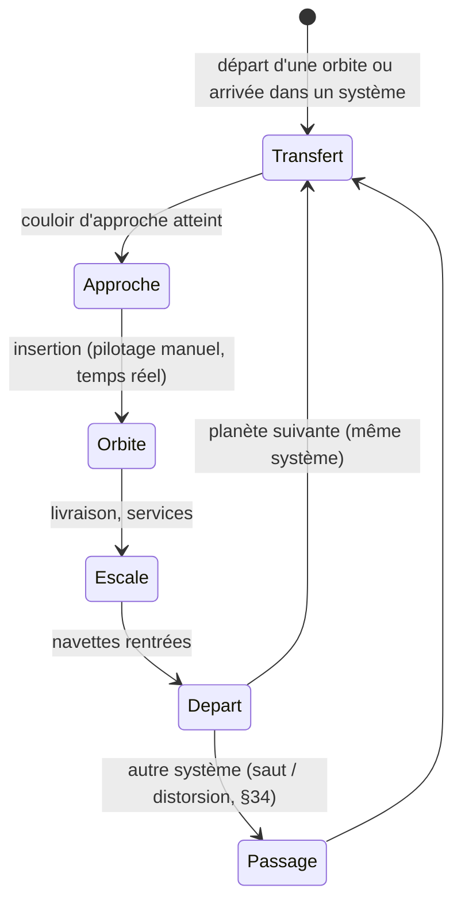
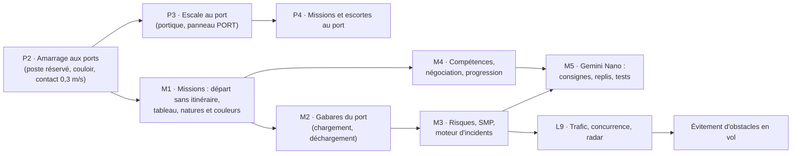

# Partie III — Nouveautés de la v2.17 (fusion de la démo « Observation des étoiles » v7.2.2)

La v2.17 fusionne dans le jeu la démo cinématique « Observation des étoiles » v7.2.2 et **abandonne le monde
compressé** : l'**échelle réelle** devient le seul mode. Les chapitres ci-dessous décrivent l'état du jeu à la
livraison du lot **P1** (ports orbitaux). Les spécifications détaillées des chantiers en cours sont des documents
séparés : `spec-L9-jeu.md` / `spec-L9-technique.md` (trafic, concurrence, escorte, radar),
`spec-ports-orbitaux-navette.md` (navettes, ports), `spec-missions.md` (missions, risques, compétences, Gemini Nano).

## 32. Échelle réelle et rendu en deux couches — ✅ implémenté

**Décision (v2.17)** : plus de profil d'échelle (`?scale=` et le monde compressé de la v2.16 sont supprimés). Les
systèmes sont en **mètres réels** : planètes de milliers de kilomètres, orbites en unités astronomiques, étoiles
réalistes, vaisseaux de 61 à 237 m.

| Élément | Mise en œuvre |
|---|---|
| Deux couches de rendu | **couche galactique** (scène d'origine : champ d'étoiles, nébuleuses, caméra à la position galactique) et **couche système** (planètes, étoile, astéroïdes, ports, vaisseaux, effets) |
| Origine flottante | la couche système est rendue relativement à la caméra, en **six tranches de profondeur** (de 0,2 m à des ua) : précision au centimètre près du vaisseau, à ~10¹¹ m de l'étoile |
| Module `REAL` (`20c-echelle-reelle.js`) | cœur de l'échelle réelle : réalisation des systèmes et des lunes à partir de la graine, plan des étapes, horloge physique τ |
| Astres de la démo | `planets.js` (atmosphères, nuages, villes de nuit, aurores, anneaux), `stars.js` (soleils « cinéma » : couronne, taches, éruptions) |

## 33. Vol par étapes — ✅ implémenté

Le vol continu à vitesse de croisière (pilote automatique, suivi de spline, consommation au kilomètre) est **remplacé**
par un vol par étapes physiquement cohérent :

| Phase | Temps | Pilotage |
|---|---|---|
| Transfert (accélération / retournement / freinage) | **accéléré** (×300 à ×900), ~22 s à l'écran | automatique |
| Approche finale | **temps réel**, couloir holographique (portiques) | **manuel** |
| Orbite, escale | temps réel (~8 km/s en orbite basse) | automatique |

**Carburant** : consommation en **Δv** réel. **Propulseurs** (amélioration du port) : sans effet sur la durée à l'écran ;
la spec L9 propose d'en faire un avantage en course (accélération physique) — décision en attente.

## 34. Saut quantique et distorsion (séquences de la démo) — ✅ implémenté

| Passage | Séquence | Durées |
|---|---|---|
| Saut quantique (générateur) | **géode** de confinement, charge, repli, éclair, onde, arrivée | charge 3,4 s · repli 1,25 s · éclair 0,32 s · onde 1,7 s |
| Distorsion (long-courriers) | plan **extérieur** (traînée violette, gerbe), puis **traversée** (parallaxe réelle du ciel) | selon la distance |

Le ciblage d'un saut se fait sur la **carte 2D** (§36). Dès l'arrivée par un passage, le **survol du système** (§38)
se déclenche.

## 35. Greffons visuels des vaisseaux (démo) — ✅ implémenté

Les modules de la démo sont copiés **tels quels** (`src/JS/demo/`) et pilotés à chaque image par `20f-greffons-vaisseau.js` :

| Module | Effet |
|---|---|
| `shipdrive.js` | tuyères à profil Rao, jets de propulsion, chauffe |
| `warpring.js` | anneaux de distorsion (long-courriers) |
| `shipwear.js` | usure progressive de la coque, **livrées** |
| `hitex.js` | textures haute définition |
| `shipglass.js` | hublots, baies de hangar à champ de force (§41 : baie ajoutée aux porte-conteneurs) |
| tremblement | secousse de caméra liée à la poussée |

## 36. Carte 2D de la démo — ✅ implémenté

La carte 3D de la v2.16 (§19) est remplacée par la **carte 2D de la démo** (`starmap.js`, niveaux **secteur · système ·
orbite**), alimentée par un adaptateur (`20e-carte-2d.js`) ; le ciblage du saut (§23) y est intégré (portée, carburant,
générateur requis). Touche **M**, fermeture par Échap.

## 37. Commerce local — ✅ implémenté

Les vaisseaux sans saut ni distorsion font du **commerce local** : destinations = planètes secondaires, **lunes** et
**ports orbitaux** (§42). Un **tableau de contrats** propose 4 destinations renouvelées à chaque ouverture ; le
**chantier naval** vend les 4 long-courriers dès que les crédits suivent.

| Tableau de contrats | Chantier naval |
|---|---|
|  |  |

## 38. Survol du système — ✅ implémenté

À l'arrivée dans un système jamais visité (après un saut ou une distorsion), la caméra quitte le vaisseau et **passe près
de chaque planète**, puis revient ; le temps du transfert est recalé pour que l'approche commence juste après. **G** : survol
à la demande ; toute touche ou un clic : retour au vaisseau. Légende à chaque planète (nom, type, rayon, orbite).

## 39. Gros plans et profondeur de champ — ✅ implémenté

- **Mode de caméra « GROS PLANS »** (F9 : poursuite → plan-séquence → plans lointains → gros plans) : tuyères, géode,
  anneaux, proue, travelling de coque ; caméra jamais dans la coque.
- **Profondeur de champ** (`postfx.js` de la démo) sur les gros plans ; coupée si la résolution dynamique descend.
- **Plans des navettes** à l'escale : prise sur la pile et suivi, sans saccade (§43).

## 40. Séquence de titre — ✅ implémenté

Remplace le travelling de fond (§25) : **plans-séquences dans des systèmes réels** — les 4 systèmes les plus
spectaculaires du voisinage (anneaux, lunes, géantes, étoiles colorées), ~30 s chacun : approche de l'étoile, puis ses deux
plus belles planètes (passage derrière une lune) ; **fondu au noir** d'un système à l'autre.

## 41. Navette-cargo et navettes de baie — ✅ implémenté

- **Conteneur ISO 20' réel** (6,058 × 2,438 × 2,591 m). **Plus de module d'amarrage ni de bras.**
- **Porte-conteneurs** (Carrelet, Basalte, Hirondelle, Longue-Échine) : une **baie ventrale** leur est ajoutée ; la
  **navette-cargo** en sort, longe la coque jusqu'à la **pile de conteneurs**, prend un conteneur (dos à la pile, contact
  à l'arrêt), s'écarte, livre, revient et **rentre en baie**.
- **Autres vaisseaux** : l'engin de leur baie, **sans conteneur** — paquebot : navette de passagers ; Vagabonde et
  pousseurs : drone-cargo ; citernier (sans baie) : livraison sans navette.

| Étape | Vitesse de pointe |
|---|---|
| Sortie de baie · entrée en baie | 2,5 m/s |
| Le long de la coque · écartement (30 m) | 8 m/s |
| Approche finale de la pile | 2 m/s → contact à l'arrêt |

Mesures : aller-retour de la navette **97 s**, escale **111 s** (194 s avant réglage) ; ≤ 8 m/s dans les 40 m autour
de la coque ; aucune traversée du vaisseau.

| Sortie de baie | Prise sur la pile | Retour en baie |
|---|---|---|
|  |  |  |

## 42. Ports orbitaux — lot P1 ✅ implémenté (P2 à P4 à venir)

Remplace la proposition du §24. **Trois archétypes tirés par graine**, à taille réelle, **au moins un poste L** (vaisseau
≤ 240 m) par port — tous les vaisseaux accosteront (P2). Postes décrits (classe S/M/L, position, axe du ponton, côté).

| Anneau (≈ 400 × 530 m) | Moyeu à pontons (≈ 450 × 530 m) | Tour d'amarrage (700–1 060 m) |
|---|---|---|
|  |  |  |

- **Placement** : les stations du commerce local sont **absorbées** (mêmes planètes, mêmes noms) ; altitude 1,15–1,4 R
  (tellurique), 2,5–3 R (géante) ; **toute géante gazeuse** reçoit une tour d'amarrage (seul port possible).
- **Rendu** : géométrie fusionnée par matériau, feux de balisage instanciés (ambre L, cyan M, blanc S), éclairage propre des
  coques ; **9 à 11 appels de dessin par port**.

## 43. Qualité : tests et leçons — ✅ en place

| Suite | Vérifie |
|---|---|
| `smoke_test.py` | démarrage, rendu, aucune erreur (versions lisible et obfusquée) |
| `vol_test.py` · `passage_test.py` | vol par étapes, carburant, escales ; saut, distorsion |
| `commerce_test.py` · `carte_test.py` | contrats, chantier, stations ; carte 2D et ciblage |
| `survol_test.py` · `gros_plans_test.py` · `titre_test.py` | caméras cinématiques, profondeur de champ, séquence de titre |
| `largage_test.py` · `saccades_test.py` | chargement sans saut, rotations, traînée ; **cadence irrégulière** (10–45 ms) |
| `navette_baie_test.py` · `escale_baie_test.py` | baie → pile → baie, vitesses, contact ; fin d'escale navette rentrée |
| `ports_test.py` | postes L, altitudes, géantes, budget, absorption des stations |

**Leçons** (règles désormais appliquées) : toute position lue par une caméra est **mise à jour avant** la caméra ; jamais
de « haut » absolu pour orienter un engin ou une caméra ; une échelle héritée ne s'applique **qu'une fois** ; tester à
**cadence irrégulière** ; en simulation sans rendu, mettre à jour les matrices avant de mesurer.

## 44. Feuille de route

| Chantier | Référence | Statut |
|---|---|---|
| P2 → P4 : amarrage, escale au port, missions et escortes | `spec-ports-orbitaux-navette.md` | P2 en cours |
| M1 → M5 : missions (plus d'itinéraire), natures de fret, risques, SMP, incidents interactifs, compétences, **Gemini Nano hybride** (le LLM interprète, le jeu décide) | `spec-missions.md` | spécifié |
| L9 : trafic ambiant, petits engins, concurrence, escorte, radar (touche B) | `spec-L9-jeu.md`, `spec-L9-technique.md` | spécifié |
| Évitement d'obstacles en vol (planètes, lunes, stations, vaisseaux, anneaux) | — | à spécifier |
| Nettoyage : portiques et spline de l'ancien vol, alternatives ancien/réel, panneau d'itinéraire | — | à faire (en partie rendu caduc par M1) |

| Tableau des missions (maquette) | Négociation hybride (maquette) |
|---|---|
|  |  |
